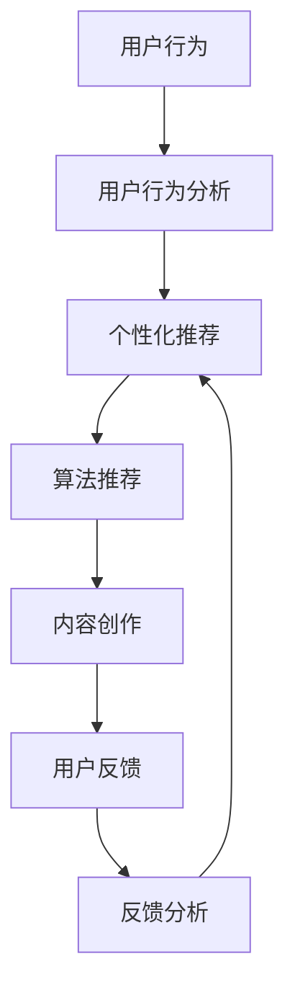

                 

# 内容创作者如何在注意力经济中生存

> 关键词：内容创作, 注意力经济, 算法推荐, 用户行为分析, 数据驱动, 自然语言处理, 个性化推荐系统

## 1. 背景介绍

在互联网时代，信息爆炸让内容创作者面临前所未有的挑战和机遇。数以亿计的内容充斥网络，吸引用户注意力的竞争日益激烈。而算法推荐技术的应用，更是将用户注意力进一步聚集成资源，形成了新的注意力经济形态。内容创作者要想在如此激烈的市场中生存并繁荣，必须深入理解注意力经济及其背后的算法机制，利用数据和技术优化创作策略和分发渠道。

### 1.1 问题由来
随着互联网的发展，内容创作和消费的形式发生了显著变化。以往以电视、广播等为代表的线性媒体，逐渐被海量、即时、个性化的数字内容所取代。各种博客、播客、视频、音频、图片等内容形式，构成了信息海洋。这种转变带来了内容消费的民主化和多元化，但同时也加剧了内容获取的碎片化。

另一方面，随着算法推荐技术的发展，平台能够根据用户的历史行为数据，精准预测其兴趣并推荐相应内容。在注意力有限的条件下，这些推荐内容进一步成为用户获取信息的主要渠道。由此，用户行为与平台算法形成了复杂的互动关系，逐渐演变成一种以用户注意力为核心的新型经济形态，即注意力经济。

在注意力经济中，创作者的内容作品不再是单纯的文化商品，而是用户注意力的竞争对象。而平台算法则是引导用户注意力的无形之手，极大地影响了内容作品的传播和收益。在这种背景下，创作者若要提升自己的作品曝光率和用户吸引力，必须深刻理解注意力经济及其背后的技术机制，从而制定更加有效的创作和分发策略。

### 1.2 问题核心关键点
注意力经济的核心在于用户注意力资源的竞争。而平台算法通过分析用户行为数据，预测其兴趣倾向，从而精准推荐相关内容，使得内容创作者的作品成为被推荐对象。创作者若要提升作品被推荐的可能性，则需要从多个维度进行优化，包括提升作品质量、优化分发渠道、利用算法推荐等。

具体来说，注意力经济的关键点包括：
- 理解平台算法推荐的原理和机制，精准把握用户兴趣点。
- 掌握用户行为分析方法，实时调整内容创作和分发策略。
- 运用数据驱动的技术手段，提升内容作品的市场表现。
- 引入个性化推荐系统，实现精准投放，扩大作品影响范围。
- 分析并评估算法推荐的效果，优化创作与推荐之间的互动。

这些关键点构成了创作者在注意力经济中生存和发展的基本框架，帮助其理解和应对这一新兴经济形态带来的挑战与机遇。

### 1.3 问题研究意义
理解并应对注意力经济，对于内容创作者而言，具有重要意义：

1. **提升作品曝光率**：通过精准把握用户兴趣，提升作品在算法推荐系统中的排名，增加曝光机会。
2. **优化收入结构**：利用推荐系统的精准投放，实现内容付费、广告分成等多元化的收入模式。
3. **精准触达用户**：利用数据分析和算法推荐，实现对特定用户群体的精准覆盖，提升用户粘性和忠诚度。
4. **提升创作效率**：通过数据分析和算法指导，创作出更具吸引力的作品，提高创作效率和质量。
5. **推动内容创新**：在理解用户需求的基础上，不断探索新题材、新形式和新表达，推动内容创新和多样性。

理解注意力经济及其背后的技术机制，不仅可以帮助创作者更好地适应当前的市场环境，还能为未来的内容创作提供方向性指导，引领行业潮流。

## 2. 核心概念与联系

### 2.1 核心概念概述

为了深入理解注意力经济中的算法推荐机制，本节将介绍几个关键的概念：

- **算法推荐系统(Recommendation System)**：利用用户行为数据，通过计算模型预测用户可能感兴趣的内容，并推荐给用户。常用于电商、音乐、视频等平台。

- **用户行为分析(User Behavior Analysis)**：通过分析用户在线行为数据，如浏览、点击、购买等，挖掘用户兴趣和偏好。常用于个性化推荐、用户细分等场景。

- **自然语言处理(Natural Language Processing, NLP)**：处理和分析自然语言文本数据的技术，包括分词、词性标注、实体识别、情感分析等。常用于文本推荐、内容分类等任务。

- **个性化推荐系统(Personalized Recommendation System)**：针对特定用户个体，推荐其可能感兴趣的内容，提升用户满意度和平台粘性。常用于电商、新闻、社交网络等平台。

- **注意力经济(Attention Economy)**：以用户注意力为关键资源，通过精准投放和推荐，争夺用户注意力，从而实现经济价值的一种新型经济形态。

这些核心概念构成了注意力经济及其背后的技术机制的基本框架，帮助我们理解内容创作者在注意力经济中的生存之道。

### 2.2 核心概念原理和架构的 Mermaid 流程图



这个流程图展示了用户行为分析、个性化推荐、算法推荐、内容创作和用户反馈之间的互动关系。通过这种循环迭代的过程，平台不断优化推荐算法，创作者不断优化内容创作，最终实现内容作品的精准投放和用户满意度的提升。

## 3. 核心算法原理 & 具体操作步骤

### 3.1 算法原理概述

算法推荐系统的核心在于根据用户的历史行为数据，通过计算模型预测用户可能感兴趣的内容。常用的推荐算法包括基于协同过滤(Collaborative Filtering)、基于内容的推荐(Content-based Recommendation)、深度学习推荐等。

推荐算法的基本流程如下：

1. **数据采集**：收集用户的历史行为数据，如浏览记录、点击行为、评分数据等。
2. **特征提取**：对收集到的行为数据进行特征提取，如用户特征、物品特征、时间特征等。
3. **模型训练**：使用训练数据对推荐模型进行训练，常用的模型包括矩阵分解、深度神经网络等。
4. **预测推荐**：使用训练好的模型对新数据进行预测，生成推荐结果。
5. **反馈迭代**：根据用户对推荐结果的反馈数据，不断优化推荐模型。

在注意力经济中，推荐算法需充分考虑到用户注意力的稀缺性和竞争力。通过优化模型结构和算法参数，提升推荐准确性和用户满意度，从而争夺更多的用户注意力资源。

### 3.2 算法步骤详解

以下以基于协同过滤的推荐算法为例，详细讲解其操作步骤：

1. **数据采集**：收集用户的历史行为数据，包括用户的ID、物品ID、评分等。
2. **特征提取**：对用户和物品分别提取特征，如用户的年龄、性别、兴趣，物品的类别、价格、评分等。
3. **模型训练**：将用户和物品的特征作为输入，利用矩阵分解等方法，训练出一个用户-物品相似度矩阵。
4. **预测推荐**：根据相似度矩阵，预测用户可能感兴趣的物品，生成推荐列表。
5. **反馈迭代**：收集用户对推荐列表的反馈数据，更新模型参数，提升推荐效果。

### 3.3 算法优缺点

**优点**：
- 能够充分利用用户历史行为数据，生成个性化推荐。
- 算法模型简单易懂，易于理解和实现。
- 能够实时生成推荐结果，满足用户即时性需求。

**缺点**：
- 需要大量的用户行为数据，数据采集成本较高。
- 模型容易过拟合，需要不断优化模型和数据。
- 推荐效果受限于用户行为数据的稀疏性，无法处理冷启动问题。

### 3.4 算法应用领域

基于协同过滤的推荐算法广泛应用于电商、音乐、视频等平台，帮助用户发现感兴趣的内容，提高平台粘性和用户满意度。例如，Amazon推荐系统通过分析用户的浏览和购买行为，生成个性化商品推荐列表，提升了用户购物体验。

此外，基于内容的推荐算法和深度学习推荐算法也广泛应用于不同场景，如新闻、社交网络等。新闻平台利用用户的浏览记录和评分数据，生成个性化新闻推荐列表，提升用户留存率。社交网络平台则利用用户的社交关系和行为数据，推荐可能感兴趣的内容和好友，增强用户互动。

## 4. 数学模型和公式 & 详细讲解 & 举例说明

### 4.1 数学模型构建

推荐算法的核心模型为协同过滤模型，其数学表达式如下：

$$
\hat{y} = \alpha_u \alpha_i \sum_{j=1}^m u_ji_j + \beta_u + \gamma_i + \delta
$$

其中：
- $y$ 为用户对物品 $i$ 的评分或兴趣度。
- $\alpha_u, \alpha_i$ 为模型的参数，控制用户和物品的影响程度。
- $u_ji_j$ 为用户和物品的特征矩阵，表示用户和物品的特征向量。
- $\beta_u, \gamma_i, \delta$ 为模型截距，用于调整模型的输出。

### 4.2 公式推导过程

通过上述公式，协同过滤模型对用户对物品 $i$ 的评分 $y$ 进行了预测。具体推导如下：

1. 设用户 $u$ 对物品 $i$ 的评分 $y$ 可表示为 $y = \alpha_u \alpha_i \sum_{j=1}^m u_ji_j + \beta_u + \gamma_i + \delta$。
2. 将用户 $u$ 的特征向量 $u$ 和物品 $i$ 的特征向量 $i$ 进行矩阵乘法，得到 $u \cdot i = \sum_{j=1}^m u_ji_j$。
3. 将 $u \cdot i$ 代入公式，得到 $y = \alpha_u \alpha_i u \cdot i + \beta_u + \gamma_i + \delta$。
4. 对公式进行简化，得到最终的推荐公式。

### 4.3 案例分析与讲解

以Netflix的推荐系统为例，分析协同过滤算法的应用。Netflix通过分析用户的观看历史和评分数据，生成个性化电影推荐列表。模型首先提取用户和电影的特征向量，如用户ID、电影类别、评分等。然后通过计算用户和电影的特征向量的点积，得到相似度矩阵。最后根据相似度矩阵，预测用户可能感兴趣的电影，生成推荐列表。

## 5. 项目实践：代码实例和详细解释说明

### 5.1 开发环境搭建

在进行推荐算法开发前，需要准备好开发环境。以下是使用Python进行推荐算法开发的常见环境配置流程：

1. 安装Anaconda：从官网下载并安装Anaconda，用于创建独立的Python环境。

2. 创建并激活虚拟环境：
```bash
conda create -n recommendation-env python=3.8 
conda activate recommendation-env
```

3. 安装必要的Python库：
```bash
pip install numpy pandas scikit-learn scipy
```

4. 安装推荐算法库：
```bash
pip install Surprise
```

5. 安装TensorFlow或PyTorch：
```bash
pip install tensorflow
```
或
```bash
pip install torch
```

完成上述步骤后，即可在`recommendation-env`环境中开始推荐算法开发。

### 5.2 源代码详细实现

这里以基于矩阵分解的协同过滤算法为例，给出使用Surprise库进行用户行为分析的Python代码实现。

```python
from surprise import Dataset, Reader, SVD
from surprise.model_selection import cross_validate

# 读取数据集
reader = Reader(rating_scale=(1, 5))
data = Dataset.load_from_file('data/ml-100k ratings.csv', reader=reader)

# 使用SVD算法
algo = SVD()

# 交叉验证评估
cross_validate(algo, data, measures=['RMSE', 'MAE'], cv=5, verbose=True)
```

这段代码实现了基于矩阵分解的协同过滤算法，并使用交叉验证对模型进行了评估。

### 5.3 代码解读与分析

**代码解读**：
- 首先，使用Surprise库读取用户行为数据，并指定评分范围为1-5。
- 然后，选择SVD算法作为协同过滤模型的具体实现。
- 最后，使用交叉验证评估模型的性能，包括均方根误差(RMSE)和平均绝对误差(MAE)。

**分析**：
- 代码展示了推荐算法的典型实现步骤，包括数据准备、模型选择和性能评估。
- Surprise库提供了多种协同过滤算法和模型评估方法，是推荐算法开发的常用工具。
- 交叉验证方法用于评估模型的泛化能力，是推荐系统性能评估的标准流程。

## 6. 实际应用场景

### 6.1 电商推荐

电商平台的推荐系统是典型的基于协同过滤的推荐场景。例如，Amazon、淘宝等电商平台通过分析用户的历史浏览和购买行为，生成个性化商品推荐列表。通过推荐系统，用户能够更快地找到自己感兴趣的商品，提升了购物体验和平台转化率。

具体实现时，平台会收集用户的行为数据，如浏览记录、点击行为、购买历史等。然后根据这些数据，利用协同过滤算法预测用户可能感兴趣的商品，生成推荐列表。用户可以看到系统推荐的商品，并给出评分或点击行为，这些数据进一步用于优化推荐模型，提升推荐效果。

### 6.2 视频推荐

视频平台的推荐系统同样应用了协同过滤算法。例如，YouTube通过分析用户的历史观看记录和评分数据，生成个性化视频推荐列表。推荐系统能够推荐用户可能感兴趣的视频，提升用户观看体验和平台留存率。

具体实现时，平台会收集用户的历史观看记录、评分和观看时长等数据。然后根据这些数据，利用协同过滤算法预测用户可能感兴趣的视频，生成推荐列表。用户可以看到系统推荐的视频，并给出观看行为或评分，这些数据进一步用于优化推荐模型，提升推荐效果。

### 6.3 新闻推荐

新闻平台的推荐系统通过分析用户的浏览记录和点击行为，生成个性化新闻推荐列表。推荐系统能够推荐用户可能感兴趣的新闻，提升用户阅读体验和平台粘性。

具体实现时，平台会收集用户的历史浏览记录、点击行为和新闻分类等数据。然后根据这些数据，利用协同过滤算法预测用户可能感兴趣的新闻，生成推荐列表。用户可以看到系统推荐的新闻，并给出阅读行为或评分，这些数据进一步用于优化推荐模型，提升推荐效果。

### 6.4 未来应用展望

随着推荐算法的发展，未来的推荐系统将更加智能化和个性化。以下是一些可能的趋势：

1. **多模态推荐**：推荐系统将不仅关注文本数据，还将引入图片、音频等多模态数据，提升推荐效果和用户体验。例如，通过分析视频内容的视觉和声音特征，推荐用户可能感兴趣的视频或新闻。

2. **实时推荐**：推荐系统将具备实时生成推荐结果的能力，能够根据用户当前的实时行为数据进行动态推荐。例如，根据用户的即时搜索行为和浏览记录，推荐可能感兴趣的商品或新闻。

3. **跨平台推荐**：推荐系统将跨平台融合用户行为数据，提供更全面和一致的推荐服务。例如，用户在不同平台上的行为数据将被整合，生成统一的推荐列表。

4. **推荐透明化**：推荐系统将具备更强的可解释性，能够提供推荐结果的解释和理由。例如，推荐系统将告知用户推荐的原因和依据，提升用户信任度。

5. **推荐多样性**：推荐系统将更注重推荐内容的多样性，避免用户陷入信息茧房。例如，推荐系统将推荐不同类型和风格的内容，丰富用户的信息获取渠道。

## 7. 工具和资源推荐

### 7.1 学习资源推荐

为了帮助开发者系统掌握推荐算法及其在注意力经济中的应用，这里推荐一些优质的学习资源：

1. 《推荐系统实战》系列书籍：由推荐算法专家撰写，详细介绍了推荐算法的原理和实现方法，包括协同过滤、基于内容的推荐、深度学习推荐等。

2. 《深度学习推荐系统：理论与实践》课程：由Coursera提供，系统讲解了推荐系统的理论基础和实际应用，包括矩阵分解、神经网络等。

3. Kaggle推荐系统竞赛：Kaggle社区提供了大量推荐系统竞赛数据集，帮助开发者实践和优化推荐算法。

4. Apache Surprise：Apache基金会提供的推荐算法库，包含多种协同过滤算法和模型评估方法。

5. RecSys会议论文：Recommender Systems会议是推荐系统领域的重要学术会议，提供了大量前沿研究成果和论文。

通过对这些资源的学习实践，相信你一定能够快速掌握推荐算法的精髓，并用于解决实际的推荐问题。

### 7.2 开发工具推荐

高效的开发离不开优秀的工具支持。以下是几款用于推荐算法开发的常用工具：

1. Apache Spark：Apache基金会提供的分布式计算框架，支持大规模数据处理和推荐算法开发。

2. TensorFlow或PyTorch：由Google和Facebook主导的开源深度学习框架，支持高效算法实现和模型训练。

3. Surprise：Apache基金会提供的推荐算法库，支持多种协同过滤算法和模型评估方法。

4. Weights & Biases：模型训练的实验跟踪工具，可以记录和可视化模型训练过程中的各项指标，方便对比和调优。

5. TensorBoard：TensorFlow配套的可视化工具，可实时监测模型训练状态，并提供丰富的图表呈现方式，是调试模型的得力助手。

合理利用这些工具，可以显著提升推荐算法的开发效率，加快创新迭代的步伐。

### 7.3 相关论文推荐

推荐算法的发展源于学界的持续研究。以下是几篇奠基性的相关论文，推荐阅读：

1. Amazon Personalization: Item Recommendation Algorithms（Amazon个性化：物品推荐算法）：亚马逊推荐系统论文，详细介绍了Amazon推荐系统的工作原理和算法实现。

2. Collaborative Filtering for Implicit Feedback Datasets（协同过滤处理隐式反馈数据集）：Surprise库中的协同过滤算法论文，介绍了协同过滤算法的理论基础和实现方法。

3. Deep Learning for Recommender Systems: A Survey and Outlook（深度学习在推荐系统中的应用：综述与展望）：深度学习推荐系统综述论文，介绍了深度学习在推荐系统中的应用和发展。

4. Neural Collaborative Filtering（神经协同过滤）：基于神经网络的协同过滤算法论文，提出了神经协同过滤模型及其在推荐系统中的应用。

5. Matrix Factorization Techniques for Recommender Systems（矩阵分解技术在推荐系统中的应用）：推荐系统矩阵分解论文，介绍了矩阵分解算法及其在推荐系统中的应用。

这些论文代表了大规模推荐算法的发展脉络。通过学习这些前沿成果，可以帮助研究者把握学科前进方向，激发更多的创新灵感。

## 8. 总结：未来发展趋势与挑战

### 8.1 总结

本文对基于协同过滤的推荐算法及其在注意力经济中的应用进行了全面系统的介绍。首先阐述了推荐算法在注意力经济中的重要性和应用场景，明确了推荐算法和用户行为分析的紧密联系。其次，从原理到实践，详细讲解了推荐算法的数学模型和操作步骤，给出了推荐算法任务开发的完整代码实例。同时，本文还广泛探讨了推荐算法在电商、视频、新闻等多个行业领域的应用前景，展示了推荐算法的巨大潜力。此外，本文精选了推荐算法的各类学习资源，力求为读者提供全方位的技术指引。

通过本文的系统梳理，可以看到，推荐算法及其在注意力经济中的应用，已经成为内容创作者提升作品曝光率和收益的重要工具。掌握推荐算法的原理和实现方法，不仅可以帮助创作者更好地适应当前的市场环境，还能为未来的内容创作提供方向性指导，引领行业潮流。

### 8.2 未来发展趋势

展望未来，推荐算法及其在注意力经济中的应用将呈现以下几个发展趋势：

1. **推荐智能化**：推荐算法将引入更多智能技术，如自然语言处理、深度学习、强化学习等，提升推荐效果和用户体验。例如，通过引入情感分析、文本分类等技术，实现更加精准和个性化的推荐。

2. **推荐多样化**：推荐算法将更注重推荐内容的多样性，避免用户陷入信息茧房。例如，推荐系统将推荐不同类型和风格的内容，丰富用户的信息获取渠道。

3. **推荐实时化**：推荐算法将具备实时生成推荐结果的能力，能够根据用户当前的实时行为数据进行动态推荐。例如，根据用户的即时搜索行为和浏览记录，推荐可能感兴趣的商品或新闻。

4. **推荐透明化**：推荐算法将具备更强的可解释性，能够提供推荐结果的解释和理由。例如，推荐系统将告知用户推荐的原因和依据，提升用户信任度。

5. **推荐跨平台化**：推荐算法将跨平台融合用户行为数据，提供更全面和一致的推荐服务。例如，用户在不同平台上的行为数据将被整合，生成统一的推荐列表。

这些趋势凸显了推荐算法及其在注意力经济中的重要性和发展潜力，推动了推荐系统向更加智能、个性化和实时化的方向发展。

### 8.3 面临的挑战

尽管推荐算法在注意力经济中取得了显著成效，但在迈向更加智能化、普适化应用的过程中，仍面临诸多挑战：

1. **数据质量问题**：推荐算法的性能很大程度上依赖于数据质量，数据稀疏、噪音和不完整性都会影响推荐效果。如何提高数据采集和处理的质量，是推荐系统面临的重要挑战。

2. **推荐冷启动问题**：对于新用户和新物品，推荐算法缺乏历史行为数据，难以进行有效推荐。如何处理冷启动问题，提升新用户和新物品的推荐效果，是推荐系统需要解决的关键问题。

3. **推荐效果评估**：推荐算法的性能评估需要大量标注数据和复杂的实验设计，评估标准和方法不够统一。如何设计有效的评估标准和方法，是推荐系统面临的重要挑战。

4. **推荐系统偏见**：推荐算法可能会放大用户历史行为中的偏见，导致不公平和歧视性推荐。如何减少和消除推荐系统的偏见，是推荐系统需要解决的关键问题。

5. **推荐系统安全性**：推荐算法可能会被恶意利用，产生误导性推荐。如何提高推荐系统的安全性，保护用户利益，是推荐系统需要解决的关键问题。

这些挑战需要研究者在数据、算法、工程等多个维度进行持续优化和改进，才能实现推荐算法的智能化和普适化应用。

### 8.4 研究展望

面向未来，推荐算法的研发需要从以下几个方面进行突破：

1. **数据增强与质量提升**：通过数据增强技术，提升推荐算法的数据质量，减少数据稀疏性和噪音。例如，利用生成对抗网络生成合成数据，提高数据多样性和覆盖面。

2. **多模态推荐**：引入多模态数据，提升推荐效果和用户体验。例如，通过融合文本、图片、音频等多模态数据，实现更加精准和个性化的推荐。

3. **深度学习和强化学习**：利用深度学习和强化学习技术，提升推荐算法的性能和泛化能力。例如，通过引入神经网络和强化学习，实现更加智能和动态的推荐。

4. **推荐系统公平性**：引入公平性指标，减少和消除推荐系统的偏见。例如，通过引入公平性评估指标和算法，确保推荐系统的公正性和透明性。

5. **推荐系统安全性**：引入安全性措施，保护用户利益。例如，通过引入加密技术和反恶意推荐算法，提升推荐系统的安全性。

这些研究方向将进一步推动推荐算法的发展，为内容创作者提供更加智能化、个性化和安全的推荐服务，提升内容作品的市场表现和用户满意度。

## 9. 附录：常见问题与解答

**Q1：推荐算法在电商推荐中的应用效果如何？**

A: 推荐算法在电商推荐中的应用效果显著。例如，Amazon通过协同过滤算法，显著提升了用户的购物体验和平台的转化率。通过推荐系统，用户能够更快地找到自己感兴趣的商品，提高了购物的效率和满意度。

**Q2：推荐算法是否能够应对推荐冷启动问题？**

A: 推荐算法在处理冷启动问题方面有不同的方法。例如，通过用户画像构建和行为预测，可以实现新用户的推荐。通过物品画像和标签匹配，可以实现新物品的推荐。同时，利用协同过滤算法的聚类和相似性匹配，也可以部分解决冷启动问题。

**Q3：推荐算法是否容易受到数据偏见的影响？**

A: 推荐算法容易受到数据偏见的影响，尤其是在处理隐式反馈数据时。例如，用户的历史行为数据可能包含偏见，导致推荐算法输出不公平的结果。为了减少偏见，可以引入公平性评估指标和算法，优化推荐系统的公平性和透明性。

**Q4：推荐算法的性能评估标准和方法有哪些？**

A: 推荐算法的性能评估标准和方法包括：
1. 精度指标：如均方根误差(RMSE)、平均绝对误差(MAE)、准确率等。
2. 多样性指标：如推荐列表的熵、长尾推荐效果等。
3. 新颖性指标：如新物品推荐数量、新类别推荐数量等。
4. 综合指标：如用户满意度、平台留存率等。

推荐算法的评估需要综合考虑精度、多样性、新颖性和用户体验等多个方面，才能全面评估其性能。

**Q5：推荐算法在新闻推荐中的应用效果如何？**

A: 推荐算法在新闻推荐中的应用效果显著。例如，谷歌新闻通过协同过滤算法，显著提升了用户的新闻阅读体验和平台的留存率。通过推荐系统，用户能够更快地找到自己感兴趣的新闻，提高了阅读的效率和满意度。

**Q6：推荐算法是否能够实时生成推荐结果？**

A: 推荐算法具备实时生成推荐结果的能力。例如，推荐系统可以通过实时收集用户行为数据，动态更新推荐列表，实现即时推荐。通过实时推荐，用户能够即时获取感兴趣的内容，提升了用户体验。

**Q7：推荐算法是否能够跨平台融合用户行为数据？**

A: 推荐算法具备跨平台融合用户行为数据的能力。例如，推荐系统可以通过跨平台数据共享，实现用户行为数据的整合，生成统一的推荐列表。通过跨平台推荐，用户在不同平台上的行为数据可以被整合，提供更全面和一致的推荐服务。

