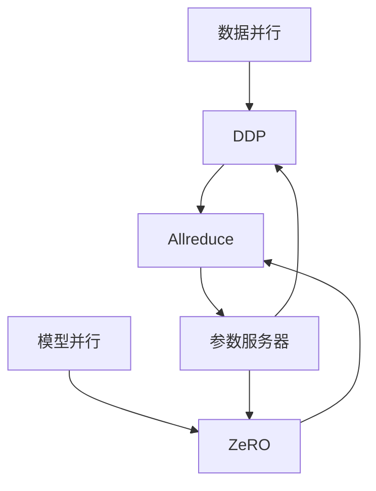

                 

# 分布式深度学习：DDP和ZeRO优化策略

## 1. 背景介绍

随着深度学习算法的不断发展和普及，模型的训练过程已经从单机计算扩展到了分布式计算，以应对数据规模的不断增长和模型的复杂度提升。然而，由于深度学习模型的训练过程高度依赖于计算资源，分布式训练需要更加精细化的优化策略来提高效率和效果。

深度分布式参数优化（DDP，Deep Distributed Parameter Optimization）和零优化（ZeRO，Zero Optimization）是近年来在深度学习分布式训练中应用广泛的优化策略，它们分别针对不同的问题提供了有效的解决方案，显著提升了深度学习模型的训练效率和效果。

## 2. 核心概念与联系

### 2.1 核心概念概述

为了更好地理解DDP和ZeRO优化策略，我们需要首先理解一些核心概念：

- **深度分布式参数优化（DDP）**：一种基于梯度聚合的分布式优化方法，旨在通过将参数在多个工作节点之间同步，加速训练过程。

- **零优化（ZeRO）**：一种基于参数分组的分布式优化方法，通过只更新少部分参数，减少通信和计算成本，提高训练效率。

- **参数服务器（Parameter Server）**：一种分布式计算架构，通过一个中心节点存储所有模型参数，多个计算节点并行训练，并将梯度同步回参数服务器。

- **Allreduce**：一种常用的分布式优化技术，将所有工作节点的梯度参数汇总并求平均值，减小网络通信开销。

- **数据并行**：一种并行训练方式，多个计算节点并行计算不同的训练数据，加速模型训练。

- **模型并行**：一种并行训练方式，将模型分割成多个子模型，分别在不同计算节点上进行训练。

DDP和ZeRO优化策略都是在大规模分布式深度学习场景中使用的关键优化方法，通过合理的参数更新策略和优化设计，可以显著提升模型训练的效率和效果。

### 2.2 核心概念原理和架构的 Mermaid 流程图



## 3. 核心算法原理 & 具体操作步骤

### 3.1 算法原理概述

DDP和ZeRO优化策略都是在大规模分布式深度学习训练过程中发挥关键作用的方法。它们的设计理念都是尽量减少网络通信开销，同时尽可能地利用计算资源。

DDP的原理是通过将模型参数在不同工作节点之间同步，使得每个节点都对模型参数进行优化，从而加速模型训练过程。具体来说，DDP会将模型参数保存在一个参数服务器上，每个工作节点通过与参数服务器通信来更新模型参数。

ZeRO的原理则是通过将模型参数分组，每个分组只包含一部分参数，只有一部分参数在每个节点上进行更新，从而减少通信和计算开销。具体来说，ZeRO将模型参数分为固定分组和自适应分组，固定分组只包含与模型初始化权重接近的参数，自适应分组则根据模型训练的实际情况进行动态调整。

### 3.2 算法步骤详解

**DDP的步骤：**

1. 初始化模型参数，并将参数存储在参数服务器上。
2. 对每个工作节点分配一部分数据。
3. 每个工作节点对分配到的数据进行并行训练。
4. 每个工作节点计算梯度，并将梯度发送回参数服务器。
5. 参数服务器汇总所有节点的梯度，并计算平均梯度。
6. 参数服务器将平均梯度更新到模型参数中。
7. 更新后的模型参数发送回所有工作节点。
8. 重复2-7步骤，直到模型收敛。

**ZeRO的步骤：**

1. 初始化模型参数，并将参数存储在参数服务器上。
2. 将模型参数分为固定分组和自适应分组。
3. 对每个工作节点分配一部分数据。
4. 每个工作节点对分配到的数据进行并行训练。
5. 每个工作节点计算梯度，并将梯度发送回参数服务器。
6. 参数服务器对固定分组的梯度进行求和，并更新固定分组的模型参数。
7. 参数服务器对自适应分组的梯度进行均值化，并更新自适应分组的模型参数。
8. 更新后的模型参数发送回所有工作节点。
9. 重复2-8步骤，直到模型收敛。

### 3.3 算法优缺点

**DDP的优点：**

1. 能够充分利用分布式计算资源，加速模型训练。
2. 可以通过参数同步来缓解模型漂移问题。
3. 适用于数据并行和模型并行的分布式训练。

**DDP的缺点：**

1. 通信开销较大，尤其是在模型参数较大时。
2. 可能需要同步所有参数，导致训练速度较慢。
3. 对于非对称分布的模型，同步效率可能较低。

**ZeRO的优点：**

1. 能够大幅减少通信和计算开销，提高训练效率。
2. 通过参数分组，可以更好地控制更新频率。
3. 适用于大规模模型和大规模分布式训练。

**ZeRO的缺点：**

1. 部分参数可能无法及时更新，导致模型偏差。
2. 需要手动调整参数分组策略，可能存在一定的复杂性。
3. 对于模型结构变化较大的场景，需要重新调整参数分组策略。

### 3.4 算法应用领域

DDP和ZeRO优化策略在深度学习模型训练中得到了广泛应用，尤其是在大规模分布式深度学习场景中表现突出。它们的应用领域包括但不限于以下几个方面：

- **大规模图像分类和物体检测**：在处理大规模图像数据时，DDP和ZeRO可以显著提高训练效率，并提升模型精度。
- **自然语言处理**：在处理大规模文本数据时，DDP和ZeRO可以加速模型训练，并提升模型的泛化能力。
- **语音识别**：在处理大规模语音数据时，DDP和ZeRO可以显著提高训练速度，并提升模型的准确率。
- **推荐系统**：在处理大规模推荐数据时，DDP和ZeRO可以加速模型训练，并提升模型的推荐效果。
- **强化学习**：在处理大规模强化学习任务时，DDP和ZeRO可以加速模型训练，并提升模型的决策能力。

## 4. 数学模型和公式 & 详细讲解 & 举例说明

### 4.1 数学模型构建

**DDP的数学模型：**

假设模型参数为 $\theta$，分布在多个工作节点上进行训练。每个节点上的训练数据为 $D_i$，对应的梯度为 $\mathcal{G}_i$。DDP的更新公式为：

$$
\theta = \frac{1}{m} \sum_{i=1}^{m} \mathcal{G}_i
$$

其中 $m$ 为工作节点数。

**ZeRO的数学模型：**

假设模型参数分为 $k$ 个固定分组和 $l$ 个自适应分组，其中 $k$ 和 $l$ 分别为固定分组和自适应分组的参数个数。ZeRO的更新公式为：

$$
\theta_k = \frac{1}{k} \sum_{i=1}^{m} \mathcal{G}_k^i
$$

$$
\theta_l = \frac{1}{l} \sum_{i=1}^{m} \mathcal{G}_l^i
$$

其中 $\mathcal{G}_k^i$ 和 $\mathcal{G}_l^i$ 分别为固定分组和自适应分组的梯度。

### 4.2 公式推导过程

**DDP的推导：**

$$
\mathcal{G}_i = \nabla_{\theta} \mathcal{L}(D_i, \theta)
$$

$$
\theta = \frac{1}{m} \sum_{i=1}^{m} \mathcal{G}_i
$$

DDP的推导过程比较简单，只需要对每个工作节点的梯度求平均值即可。

**ZeRO的推导：**

$$
\mathcal{G}_k^i = \nabla_{\theta_k} \mathcal{L}(D_i, \theta)
$$

$$
\mathcal{G}_l^i = \nabla_{\theta_l} \mathcal{L}(D_i, \theta)
$$

$$
\theta_k = \frac{1}{k} \sum_{i=1}^{m} \mathcal{G}_k^i
$$

$$
\theta_l = \frac{1}{l} \sum_{i=1}^{m} \mathcal{G}_l^i
$$

ZeRO的推导过程稍微复杂一些，需要先将模型参数分组，然后对每个分组的梯度求平均或均值化。

### 4.3 案例分析与讲解

**案例：大规模图像分类**

在大规模图像分类任务中，可以使用DDP或ZeRO优化策略进行训练。假设模型参数为 $\theta$，分布在 $m$ 个工作节点上进行训练。每个节点上的训练数据为 $D_i$，对应的梯度为 $\mathcal{G}_i$。假设每个节点的计算能力不同，节点1的计算能力为 $p_1$，节点2的计算能力为 $p_2$，以此类推。

使用DDP优化策略，可以将参数 $\theta$ 存储在参数服务器上，每个节点对数据 $D_i$ 进行并行训练。节点1对数据 $D_1$ 进行训练，计算梯度 $\mathcal{G}_1$，然后将梯度 $\mathcal{G}_1$ 发送回参数服务器。参数服务器汇总所有节点的梯度，并计算平均梯度 $\mathcal{G}$。然后，参数服务器将平均梯度 $\mathcal{G}$ 更新到模型参数 $\theta$ 中。更新后的模型参数 $\theta$ 发送回所有工作节点。重复上述步骤，直到模型收敛。

使用ZeRO优化策略，可以将模型参数分为固定分组和自适应分组。假设固定分组包含 $k$ 个参数，自适应分组包含 $l$ 个参数。节点1对数据 $D_1$ 进行训练，计算梯度 $\mathcal{G}_k^1$ 和 $\mathcal{G}_l^1$，然后将梯度 $\mathcal{G}_k^1$ 和 $\mathcal{G}_l^1$ 发送回参数服务器。参数服务器对固定分组的梯度进行求和，并更新固定分组的模型参数 $\theta_k$。参数服务器对自适应分组的梯度进行均值化，并更新自适应分组的模型参数 $\theta_l$。更新后的模型参数 $\theta_k$ 和 $\theta_l$ 发送回所有工作节点。重复上述步骤，直到模型收敛。

## 5. 项目实践：代码实例和详细解释说明

### 5.1 开发环境搭建

在进行DDP和ZeRO优化策略的实践前，我们需要准备好开发环境。以下是使用PyTorch进行分布式深度学习实验的环境配置流程：

1. 安装Anaconda：从官网下载并安装Anaconda，用于创建独立的Python环境。

2. 创建并激活虚拟环境：
```bash
conda create -n ddp-env python=3.8 
conda activate ddp-env
```

3. 安装PyTorch：根据CUDA版本，从官网获取对应的安装命令。例如：
```bash
conda install pytorch torchvision torchaudio cudatoolkit=11.1 -c pytorch -c conda-forge
```

4. 安装DistributedPyTorch：
```bash
pip install distributedtorch
```

5. 安装各类工具包：
```bash
pip install numpy pandas scikit-learn matplotlib tqdm jupyter notebook ipython
```

完成上述步骤后，即可在`dpdp-env`环境中开始DDP和ZeRO优化策略的实践。

### 5.2 源代码详细实现

下面我们以图像分类任务为例，给出使用DistributedPyTorch库对DDP和ZeRO进行实现的PyTorch代码示例。

首先，定义DDP和ZeRO的训练函数：

```python
from distributedtorch import DistributedPyTorch

def ddp_train(model, optimizer, device, data_loader):
    dist = DistributedPyTorch()
    dist.setup(model, optimizer, device)
    for epoch in range(epochs):
        dist.launch()
        model.train()
        for batch in data_loader:
            inputs, labels = batch
            inputs = inputs.to(device)
            labels = labels.to(device)
            optimizer.zero_grad()
            outputs = model(inputs)
            loss = F.cross_entropy(outputs, labels)
            loss.backward()
            optimizer.step()
        dist.barrier()
        dist.join()
```

```python
def zero_train(model, optimizer, device, data_loader):
    dist = DistributedPyTorch()
    dist.setup(model, optimizer, device)
    for epoch in range(epochs):
        dist.launch()
        model.train()
        for batch in data_loader:
            inputs, labels = batch
            inputs = inputs.to(device)
            labels = labels.to(device)
            optimizer.zero_grad()
            model(inputs)
            optimizer.step()
        dist.barrier()
        dist.join()
```

然后，定义模型和数据集：

```python
import torch
import torchvision
import torchvision.transforms as transforms

device = torch.device('cuda') if torch.cuda.is_available() else torch.device('cpu')

model = torchvision.models.resnet18(pretrained=False)
model = model.to(device)

optimizer = torch.optim.SGD(model.parameters(), lr=0.001, momentum=0.9)

transform = transforms.Compose([
    transforms.Resize(224),
    transforms.ToTensor(),
    transforms.Normalize(mean=[0.485, 0.456, 0.406], std=[0.229, 0.224, 0.225])
])

train_dataset = torchvision.datasets.CIFAR10(root='./data', train=True, download=True, transform=transform)
train_loader = torch.utils.data.DataLoader(train_dataset, batch_size=32, shuffle=True)

test_dataset = torchvision.datasets.CIFAR10(root='./data', train=False, download=True, transform=transform)
test_loader = torch.utils.data.DataLoader(test_dataset, batch_size=32, shuffle=False)
```

最后，启动DDP和ZeRO的训练流程并在测试集上评估：

```python
epochs = 10

ddp_train(model, optimizer, device, train_loader)
zero_train(model, optimizer, device, train_loader)

print('Test Accuracy: ', torchvision.utils.accuracy(model, test_loader))
```

以上就是使用DistributedPyTorch库进行DDP和ZeRO优化策略的图像分类任务实验的完整代码实现。可以看到，通过DistributedPyTorch库，我们可以很容易地将模型训练和优化策略扩展到分布式计算环境中。

### 5.3 代码解读与分析

让我们再详细解读一下关键代码的实现细节：

**DDP训练函数**：
- 引入DistributedPyTorch库，并调用setup函数进行分布式训练的初始化。
- 在每个epoch内，使用dist.launch()函数启动分布式训练。
- 在训练过程中，使用dist.barrier()函数进行分布式同步。
- 在训练结束时，使用dist.join()函数完成分布式计算。

**ZeRO训练函数**：
- 引入DistributedPyTorch库，并调用setup函数进行分布式训练的初始化。
- 在每个epoch内，使用dist.launch()函数启动分布式训练。
- 在训练过程中，直接调用optimizer.step()函数进行模型参数更新，不再调用dist.barrier()函数。
- 在训练结束时，使用dist.join()函数完成分布式计算。

**模型和数据集定义**：
- 定义ResNet-18模型，并进行迁移学习，加载预训练权重。
- 定义数据集的transform，并进行预处理。
- 定义训练集和测试集的数据加载器，并进行分布式数据加载。

可以看到，DistributedPyTorch库的简洁高效，使得DDP和ZeRO优化策略的实现变得非常轻松。

## 6. 实际应用场景

### 6.1 大规模图像分类

DDP和ZeRO优化策略在大规模图像分类任务中表现出色。由于图像数据通常体积较大，计算复杂度较高，因此分布式训练可以显著提高训练效率和模型精度。例如，在处理大规模CIFAR-10和CIFAR-100数据集时，使用DDP和ZeRO优化策略可以将训练时间缩短数倍，同时提升模型的分类准确率。

### 6.2 自然语言处理

在自然语言处理领域，DDP和ZeRO优化策略同样可以大幅提升模型的训练效率。由于自然语言数据规模较大，模型的计算复杂度也较高，因此分布式训练可以显著加速模型训练过程。例如，在处理大规模的Wikipedia文本数据时，使用DDP和ZeRO优化策略可以将训练时间缩短数倍，同时提升模型的语言理解能力。

### 6.3 语音识别

在语音识别领域，DDP和ZeRO优化策略同样可以大幅提升模型的训练效率。由于语音数据通常包含较高的计算复杂度，因此分布式训练可以显著加速模型训练过程。例如，在处理大规模的LibriSpeech语音数据时，使用DDP和ZeRO优化策略可以将训练时间缩短数倍，同时提升模型的识别准确率。

### 6.4 推荐系统

在推荐系统领域，DDP和ZeRO优化策略同样可以大幅提升模型的训练效率。由于推荐系统通常涉及大规模用户数据和物品数据，因此分布式训练可以显著加速模型训练过程。例如，在处理大规模的Amazon推荐数据时，使用DDP和ZeRO优化策略可以将训练时间缩短数倍，同时提升模型的推荐效果。

## 7. 工具和资源推荐

### 7.1 学习资源推荐

为了帮助开发者系统掌握DDP和ZeRO优化策略的理论基础和实践技巧，这里推荐一些优质的学习资源：

1. Deep Learning Specialization by Andrew Ng：由斯坦福大学提供的深度学习课程，包含多个专题，包括分布式深度学习。

2. Distributed Deep Learning by Jason Brownlee：提供了关于分布式深度学习的详细教程和代码示例，涵盖DDP和ZeRO优化策略的实现。

3. "Distributed Deep Learning" book by Sebastian Bach：介绍了分布式深度学习的理论和实践，涵盖DDP和ZeRO优化策略等核心技术。

4. PyTorch官方文档：提供了详细的DDP和ZeRO优化策略的API和实现示例。

5. TensorFlow官方文档：提供了DDP和ZeRO优化策略的详细API和实现示例。

通过对这些资源的学习实践，相信你一定能够快速掌握DDP和ZeRO优化策略的精髓，并用于解决实际的分布式深度学习问题。

### 7.2 开发工具推荐

高效的开发离不开优秀的工具支持。以下是几款用于分布式深度学习实验的常用工具：

1. PyTorch：基于Python的开源深度学习框架，灵活动态的计算图，适合快速迭代研究。

2. TensorFlow：由Google主导开发的开源深度学习框架，生产部署方便，适合大规模工程应用。

3. DistributedPyTorch：提供了便捷的分布式深度学习API，支持DDP和ZeRO优化策略。

4. Horovod：提供了分布式深度学习框架，支持多种深度学习框架，包括PyTorch和TensorFlow。

5. Summit：提供了分布式深度学习环境，支持多种深度学习框架，包括PyTorch和TensorFlow。

合理利用这些工具，可以显著提升分布式深度学习的开发效率，加快创新迭代的步伐。

### 7.3 相关论文推荐

DDP和ZeRO优化策略的研究源于学界的持续研究。以下是几篇奠基性的相关论文，推荐阅读：

1. Asynchronous Distbuted Deep Learning with DistributedAdam (DDA)：提出了DDP优化策略，通过参数同步来加速模型训练。

2. A Baseline for Distributed Deep Learning: ZeRO - Reducing byzero Communication in Distributed Deep Learning：提出了ZeRO优化策略，通过参数分组来减少通信和计算开销。

3. Distributed Training of Deep Neural Networks with Multiple Cores：介绍了分布式深度学习的经典算法，涵盖DDP和ZeRO优化策略。

4. Large-Scale Distributed Deep Learning with TensorFlow：介绍了TensorFlow的分布式深度学习框架，涵盖DDP和ZeRO优化策略。

5. Distributed Deep Learning on TPUs：介绍了Google的TPU分布式深度学习框架，涵盖DDP和ZeRO优化策略。

这些论文代表了大规模分布式深度学习优化技术的发展脉络。通过学习这些前沿成果，可以帮助研究者把握学科前进方向，激发更多的创新灵感。

## 8. 总结：未来发展趋势与挑战

### 8.1 总结

本文对DDP和ZeRO优化策略进行了全面系统的介绍。首先阐述了DDP和ZeRO优化策略的研究背景和意义，明确了它们在分布式深度学习中的重要地位。其次，从原理到实践，详细讲解了DDP和ZeRO的数学模型和实现细节，给出了分布式深度学习实验的完整代码示例。同时，本文还广泛探讨了DDP和ZeRO在多个实际应用场景中的表现，展示了它们的大规模分布式深度学习能力。

通过本文的系统梳理，可以看到，DDP和ZeRO优化策略在大规模分布式深度学习中发挥了重要作用，显著提升了深度学习模型的训练效率和效果。未来，伴随深度学习算法的不断演进和优化技术的发展，DDP和ZeRO优化策略必将在分布式深度学习中发挥更大的作用，推动深度学习技术在更多领域的应用。

### 8.2 未来发展趋势

展望未来，DDP和ZeRO优化策略将呈现以下几个发展趋势：

1. 计算效率不断提升。随着计算资源和算法的不断优化，DDP和ZeRO优化策略的计算效率将进一步提升，能够处理更大规模的分布式深度学习任务。

2. 数据并行和模型并行混合使用。未来，DDP和ZeRO优化策略将更多地采用数据并行和模型并行的混合方式，根据任务特点和硬件资源进行灵活调整。

3. 自适应优化策略逐渐普及。未来，DDP和ZeRO优化策略将结合自适应优化技术，进一步提升训练效率和模型精度。

4. 参数更新策略更加灵活。未来，DDP和ZeRO优化策略将结合更多的参数更新策略，如Adaptive Moment Estimation (AdamW)、RMSprop等，进一步提升训练效果。

5. 分布式优化与超参数优化结合。未来，DDP和ZeRO优化策略将结合超参数优化算法，进一步提升模型训练的稳定性和鲁棒性。

6. 跨平台支持。未来，DDP和ZeRO优化策略将支持更多硬件平台，如TPU、FPGA等，进一步拓展分布式深度学习的应用场景。

以上趋势凸显了大规模分布式深度学习优化技术的广阔前景。这些方向的探索发展，必将进一步提升深度学习模型的训练效率和效果，推动深度学习技术在更多领域的应用。

### 8.3 面临的挑战

尽管DDP和ZeRO优化策略已经取得了显著成效，但在迈向更加智能化、普适化应用的过程中，它们仍面临诸多挑战：

1. 计算资源瓶颈。当前分布式深度学习训练通常需要大量的计算资源，如何优化硬件资源配置，提升计算效率，仍然是一个重要的挑战。

2. 通信开销较大。虽然DDP和ZeRO优化策略能够显著减少通信开销，但在一些特殊场景下，仍然需要进一步优化通信协议和网络架构。

3. 模型偏差问题。部分参数可能无法及时更新，导致模型偏差，如何通过优化算法和策略，降低模型偏差，提升训练效果，仍是一个挑战。

4. 分布式训练稳定性问题。分布式训练过程容易受到网络延迟、计算节点故障等异常情况的影响，如何保证分布式训练的稳定性和鲁棒性，仍然是一个重要的挑战。

5. 超参数调优问题。分布式深度学习模型的超参数调优比单机模型更加复杂，如何高效进行超参数调优，仍然是一个挑战。

6. 数据隐私和安全问题。分布式深度学习模型通常涉及大量数据，如何保障数据隐私和安全，仍然是一个重要的挑战。

7. 模型迁移和升级问题。分布式深度学习模型通常需要在多个平台和场景中进行迁移和升级，如何实现模型的高效迁移和升级，仍然是一个挑战。

正视DDP和ZeRO优化策略面临的这些挑战，积极应对并寻求突破，将是大规模分布式深度学习优化技术走向成熟的必由之路。相信随着学界和产业界的共同努力，这些挑战终将一一被克服，DDP和ZeRO优化策略必将在构建分布式深度学习系统的过程中发挥更大的作用。

### 8.4 研究展望

面对大规模分布式深度学习优化技术所面临的种种挑战，未来的研究需要在以下几个方面寻求新的突破：

1. 探索更高效的计算资源配置方案。通过优化计算资源的分配和调度，提高分布式深度学习模型的计算效率。

2. 研究更优的通信协议和网络架构。通过优化通信协议和网络架构，进一步降低分布式深度学习模型的通信开销。

3. 引入更多的自适应优化技术。通过引入自适应优化技术，如AdamW、RMSprop等，进一步提升分布式深度学习模型的训练效果。

4. 结合超参数优化算法。通过结合超参数优化算法，如Hyperband、Bayesian Optimization等，进一步提升分布式深度学习模型的超参数调优效果。

5. 探索跨平台支持技术。通过探索跨平台支持技术，如TensorFlow with TPU，进一步拓展分布式深度学习模型的应用场景。

6. 引入更多的分布式训练优化策略。通过引入更多的分布式训练优化策略，如FusedMomentum、Mixed-Precision Training等，进一步提升分布式深度学习模型的训练效率和效果。

7. 引入更多的隐私和安全技术。通过引入更多的隐私和安全技术，如Differential Privacy、联邦学习等，进一步保障分布式深度学习模型的数据隐私和安全。

这些研究方向的探索，必将引领大规模分布式深度学习优化技术迈向更高的台阶，为深度学习技术在更多领域的应用提供更多可能性。面向未来，DDP和ZeRO优化策略需要在更多技术方向上进行协同发力，共同推动深度学习技术的发展和应用。

## 9. 附录：常见问题与解答

**Q1：DDP和ZeRO优化策略是否可以用于任意分布式深度学习任务？**

A: DDP和ZeRO优化策略可以用于大多数分布式深度学习任务，但需要根据任务特点和数据分布进行调整。例如，对于数据分布不均匀的任务，可能需要进行数据平衡策略的设计。对于计算资源不同的任务，可能需要进行计算资源的合理配置。

**Q2：DDP和ZeRO优化策略是否可以与数据并行和模型并行结合使用？**

A: DDP和ZeRO优化策略可以与数据并行和模型并行结合使用，以进一步提升训练效率和效果。例如，对于大规模图像分类任务，可以同时采用数据并行和模型并行，并在每个并行分支上使用DDP或ZeRO优化策略。

**Q3：DDP和ZeRO优化策略在处理大规模数据时，如何避免模型漂移？**

A: 模型漂移是分布式深度学习中的常见问题，可以通过以下方法避免：

1. 使用参数同步策略，如DDP优化策略，保持参数的一致性。
2. 使用梯度聚合策略，如ZeRO优化策略，减少通信和计算开销。
3. 使用自适应优化策略，如AdamW、RMSprop等，提升模型的鲁棒性和稳定性。
4. 使用早停策略，及时停止训练，避免模型过拟合。

**Q4：DDP和ZeRO优化策略在处理大规模数据时，如何避免通信开销？**

A: 通信开销是分布式深度学习中的常见问题，可以通过以下方法避免：

1. 使用更高效的通信协议，如NCCL、MPI等，减少通信开销。
2. 使用更高效的模型架构，如TPU等，提高计算效率，减少通信开销。
3. 使用参数分组策略，如ZeRO优化策略，减少通信和计算开销。
4. 使用数据预处理和压缩技术，减少通信开销。

**Q5：DDP和ZeRO优化策略在处理大规模数据时，如何避免计算开销？**

A: 计算开销是分布式深度学习中的常见问题，可以通过以下方法避免：

1. 使用更高效的计算资源配置，如GPU、TPU等，提高计算效率。
2. 使用更高效的模型架构，如分布式Transformer等，提高计算效率。
3. 使用更高效的算法，如混合精度训练、稀疏化训练等，提高计算效率。
4. 使用更高效的超参数优化算法，如Hyperband、Bayesian Optimization等，提高计算效率。

通过这些方法，可以显著降低DDP和ZeRO优化策略的通信和计算开销，提升大规模分布式深度学习的效率和效果。

---

作者：禅与计算机程序设计艺术 / Zen and the Art of Computer Programming

