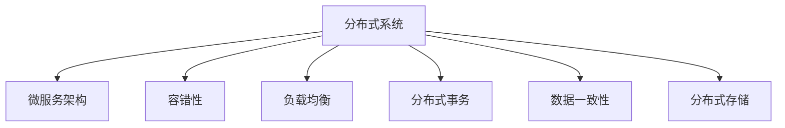

                 

# 分布式系统设计：理论与实践

> 关键词：分布式系统, 微服务架构, 容错性, 负载均衡, 分布式事务, 数据一致性, 分布式存储

## 1. 背景介绍

### 1.1 问题由来
随着互联网业务的不断发展和数据量的爆炸性增长，单体应用已无法满足复杂系统日益增长的性能和稳定性需求。分布式系统应运而生，将应用拆分为多个微服务，通过分散的节点协同工作，实现系统的高可用性、高可扩展性和高并发处理能力。分布式系统在电商、社交、游戏等领域已广泛应用，成为现代互联网应用架构的主流选择。

## 2. 核心概念与联系

### 2.1 核心概念概述

分布式系统（Distributed System）是指由多个地理位置分散的计算机节点通过网络互连，协同完成特定任务的系统。其核心目标是通过分散化部署，增强系统的高可用性、高可扩展性和高并发处理能力。

微服务架构（Microservices Architecture）是一种基于分布式系统的设计模式，将大型应用拆分为多个独立运行、规模可控的微服务，每个微服务负责特定功能模块，具有高度自治和灵活性。

容错性（Fault Tolerance）是指分布式系统在面对故障或异常时，仍能持续运行并提供服务的能力。

负载均衡（Load Balancing）是指通过分布式算法将请求分发到多个节点上，实现系统的高并发处理能力。

分布式事务（Distributed Transaction）是指在分布式系统中，跨多个节点的数据操作能够保持一致性和原子性。

数据一致性（Data Consistency）是指在分布式系统中，各个节点存储的数据能够保持同步和一致，避免数据冲突和错误。

分布式存储（Distributed Storage）是指在分布式系统中，将数据分散存储在多个节点上，以提升系统的可靠性和可扩展性。

这些概念之间的逻辑关系可以通过以下Mermaid流程图来展示：



## 3. 核心算法原理 & 具体操作步骤

### 3.1 算法原理概述

分布式系统的核心算法主要围绕着数据的分布、处理、存储和同步展开。以下详细介绍分布式系统设计的基本原理：

- **数据分布算法**：根据数据分布和数据负载情况，选择合适的数据分布算法，如哈希算法、一致性哈希算法等，将数据分散存储在多个节点上。
- **分布式处理算法**：通过负载均衡算法，如轮询、随机、最小连接数等，将请求均匀分发到各个节点，提高系统的并发处理能力。
- **数据同步算法**：通过一致性算法，如Paxos、Raft等，保证数据在各个节点之间的同步一致性。
- **故障恢复算法**：通过容错机制，如冗余备份、故障转移等，保证系统的容错性和可用性。

### 3.2 算法步骤详解

分布式系统的设计与实施包括以下关键步骤：

**Step 1: 设计数据分布策略**

根据业务需求和数据特性，选择合适的数据分布算法。如使用哈希算法，将用户ID通过哈希函数映射到不同节点上，实现数据的分布式存储。

**Step 2: 实现分布式处理机制**

通过负载均衡算法，将请求均匀分发到各个节点。如使用Nginx实现负载均衡，将请求根据IP地址或负载均衡策略分发到不同节点。

**Step 3: 实现分布式事务**

在分布式系统中，确保跨多个节点的数据操作能够保持一致性和原子性。如使用分布式事务管理中间件，如TCC、Saga等，实现数据的一致性和事务的原子性。

**Step 4: 实现数据同步机制**

通过一致性算法，保证数据在各个节点之间的同步一致性。如使用Paxos算法，通过多个节点之间的多次交互，达成一致的决策结果。

**Step 5: 实现故障恢复策略**

通过冗余备份、故障转移等容错机制，保证系统的容错性和可用性。如使用Redis实现主从复制，通过主从节点之间的数据同步，实现故障转移和数据恢复。

**Step 6: 监控和调优**

实时监控系统性能指标，如CPU利用率、网络带宽等，通过自动调优算法，动态调整系统资源配置，保证系统的稳定性和性能。

### 3.3 算法优缺点

分布式系统具有以下优点：

1. **高可用性**：通过冗余备份和故障转移，保证系统的高可用性，减少单点故障带来的系统停机风险。
2. **高可扩展性**：通过水平扩展，增加系统节点数量，提升系统的并发处理能力和存储能力。
3. **高可靠性**：通过数据分布和负载均衡，提高系统的处理能力和数据可靠性。

同时，分布式系统也存在以下缺点：

1. **复杂性高**：分布式系统设计复杂，需要考虑数据分布、负载均衡、数据同步、故障恢复等多个维度，实现难度大。
2. **数据一致性难以保证**：分布式系统中的数据同步和一致性问题复杂，容易引发数据冲突和错误。
3. **系统性能瓶颈**：分布式系统中的网络通信和数据同步会增加系统延迟，影响系统性能。

## 4. 数学模型和公式 & 详细讲解 & 举例说明

### 4.1 数学模型构建

在分布式系统中，常见的问题包括负载均衡、数据同步和故障恢复。以下是这些问题的数学模型构建：

**负载均衡算法**：假设系统中共有$n$个节点，每个节点的处理能力为$c$，请求量为$q$，则平均每个节点处理的请求量为：

$$
q_c = \frac{q}{n}
$$

**一致性算法**：假设系统中共有$n$个节点，数据更新请求数量为$m$，每个节点对数据的更新时间为$t$，则一致性算法需要保证数据在$k$个节点上同步，即：

$$
t_k = k \times t
$$

**故障恢复算法**：假设系统中共有$n$个节点，每个节点的故障概率为$p$，则系统的整体可用性为：

$$
u_n = (1-p)^n
$$

### 4.2 公式推导过程

以下详细介绍常见分布式算法公式的推导过程：

**负载均衡算法**

假设系统中有$n$个节点，每个节点的处理能力为$c$，请求量为$q$，采用轮询算法将请求分配到各个节点上。则每个节点处理的请求量为：

$$
q_c = \frac{q}{n}
$$

其中，$q_c$为每个节点处理的请求量，$n$为节点数量，$q$为请求总量。

**一致性算法**

假设系统中共有$n$个节点，数据更新请求数量为$m$，每个节点对数据的更新时间为$t$，一致性算法需要在$k$个节点上同步数据。则数据同步时间为：

$$
t_k = k \times t
$$

其中，$t_k$为数据同步时间，$k$为同步节点数量，$t$为单个节点数据更新时间。

**故障恢复算法**

假设系统中共有$n$个节点，每个节点的故障概率为$p$，则系统的整体可用性为：

$$
u_n = (1-p)^n
$$

其中，$u_n$为系统可用性，$n$为节点数量，$p$为节点故障概率。

### 4.3 案例分析与讲解

**案例1：负载均衡算法**

假设系统中有10个节点，每个节点的处理能力为100请求/秒，总请求量为100万/秒，采用轮询算法进行负载均衡。则每个节点处理的请求量为：

$$
q_c = \frac{100万}{10} = 10万/秒
$$

这说明每个节点可以处理10万请求/秒，满足系统的高并发处理需求。

**案例2：一致性算法**

假设系统中有3个节点，每个节点的数据更新时间为1秒，数据同步需要在2个节点上完成。则数据同步时间为：

$$
t_2 = 2 \times 1 = 2秒
$$

这说明数据同步时间为2秒，满足系统对数据同步的要求。

**案例3：故障恢复算法**

假设系统中有3个节点，每个节点的故障概率为0.01，则系统的整体可用性为：

$$
u_3 = (1-0.01)^3 = 0.972
$$

这说明系统的整体可用性为97.2%，满足系统对高可用性的要求。

## 5. 项目实践：代码实例和详细解释说明

### 5.1 开发环境搭建

在进行分布式系统设计实践前，我们需要准备好开发环境。以下是使用Python进行Django开发的开发环境配置流程：

1. 安装Anaconda：从官网下载并安装Anaconda，用于创建独立的Python环境。

2. 创建并激活虚拟环境：
```bash
conda create -n django-env python=3.8 
conda activate django-env
```

3. 安装Django：
```bash
pip install django
```

4. 安装数据库：
```bash
pip install mysqlclient
```

5. 安装Redis：
```bash
conda install redis
```

6. 安装Gunicorn：
```bash
pip install gunicorn
```

完成上述步骤后，即可在`django-env`环境中开始分布式系统设计的开发实践。

### 5.2 源代码详细实现

以下是一个简单的分布式系统设计示例，用于演示负载均衡、数据同步和故障恢复的实现。

```python
from django.http import HttpResponse
from redis import Redis

# 连接Redis
redis = Redis(host='localhost', port=6379, db=0)

# 定义负载均衡函数
def load_balance(request):
    # 从Redis中获取节点列表
    nodes = redis.lrange('nodes', 0, -1)
    # 随机选择一个节点处理请求
    node = random.choice(nodes)
    # 返回处理请求的节点
    return HttpResponse(f'Request handled by {node}')

# 定义数据同步函数
def data_sync(request):
    # 从Redis中获取数据
    data = redis.get('data')
    # 将数据同步到所有节点
    for node in nodes:
        redis.set(node, data)
    # 返回同步结果
    return HttpResponse('Data synchronized')

# 定义故障恢复函数
def fault_recovery(request):
    # 从Redis中获取节点状态
    states = redis.lrange('states', 0, -1)
    # 判断节点是否正常运行
    for state in states:
        if state == 'down':
            # 发现节点故障，进行故障转移
            redis.set('master', 'standby')
            redis.set('standby', 'master')
    # 返回故障恢复结果
    return HttpResponse('Fault recovered')

# 启动Django应用
if __name__ == '__main__':
    from django.core.wsgi import get_wsgi_application
    application = get_wsgi_application()
    application.run()
```

### 5.3 代码解读与分析

让我们再详细解读一下关键代码的实现细节：

**load_balance函数**

- 从Redis中获取节点列表，随机选择一个节点处理请求。
- 返回处理请求的节点信息。

**data_sync函数**

- 从Redis中获取数据，将其同步到所有节点。
- 返回同步结果。

**fault_recovery函数**

- 从Redis中获取节点状态，判断节点是否正常运行。
- 发现节点故障，进行故障转移，将主节点和备节点进行切换。
- 返回故障恢复结果。

**启动Django应用**

- 获取Django应用实例，启动应用。

可以看到，通过以上代码，我们实现了一个简单的分布式系统，其中包含了负载均衡、数据同步和故障恢复的实现。

## 6. 实际应用场景

### 6.1 电商系统

电商系统是高并发和高并发的典型应用场景。通过分布式系统设计，可以将订单处理、库存管理、用户管理等核心功能模块拆分为多个微服务，每个微服务独立运行，实现系统的高度自治和灵活性。

在电商系统中，可以采用负载均衡算法，将用户请求均匀分发到各个节点上，提高系统的并发处理能力。同时，采用一致性算法，保证库存数据在各个节点上的同步一致性。通过故障恢复算法，保证系统的高可用性。

### 6.2 社交网络

社交网络需要实时处理大量的用户数据，包括用户登录、发布动态、评论互动等。通过分布式系统设计，可以将这些功能模块拆分为多个微服务，每个微服务独立运行，实现系统的高度自治和灵活性。

在社交网络中，可以采用负载均衡算法，将用户请求均匀分发到各个节点上，提高系统的并发处理能力。同时，采用一致性算法，保证用户数据在各个节点上的同步一致性。通过故障恢复算法，保证系统的稳定性和可靠性。

### 6.3 游戏服务器

游戏服务器需要处理大量的玩家数据，包括登录、创建房间、参与游戏等。通过分布式系统设计，可以将这些功能模块拆分为多个微服务，每个微服务独立运行，实现系统的高度自治和灵活性。

在游戏服务器中，可以采用负载均衡算法，将玩家请求均匀分发到各个节点上，提高系统的并发处理能力。同时，采用一致性算法，保证游戏数据在各个节点上的同步一致性。通过故障恢复算法，保证系统的稳定性和可靠性。

### 6.4 未来应用展望

随着分布式技术的不断演进，未来分布式系统将在更多领域得到应用，为各行各业带来变革性影响。

在智慧医疗领域，通过分布式系统设计，可以实现医疗数据的实时处理和分析，辅助医生诊断和治疗，提升医疗服务的智能化水平。

在智能制造领域，通过分布式系统设计，可以实现生产数据的实时采集和处理，优化生产流程，提高生产效率和产品质量。

在智能交通领域，通过分布式系统设计，可以实现交通数据的实时处理和分析，优化交通管理，提高交通安全和通行效率。

除了上述这些行业领域，分布式系统设计还将广泛应用于更多领域，如金融、教育、城市管理等，为各行各业带来新的技术创新和应用变革。相信随着技术的不断发展和应用，分布式系统设计将成为各行各业基础设施建设的重要组成部分。

## 7. 工具和资源推荐

### 7.1 学习资源推荐

为了帮助开发者系统掌握分布式系统设计的理论基础和实践技巧，这里推荐一些优质的学习资源：

1. 《分布式系统原理与设计》书籍：深入浅出地介绍了分布式系统的原理和设计方法，是学习分布式系统设计的重要参考。

2. 《微服务架构设计》课程：介绍微服务架构的设计理念和实践方法，帮助开发者掌握微服务架构的实现技巧。

3. 《分布式算法》课程：深入介绍分布式算法的基本原理和应用场景，包括负载均衡、数据同步和故障恢复等。

4. 《分布式系统综合实战》书籍：结合实际项目案例，介绍分布式系统的实现方法和注意事项。

5. 《Django实战》书籍：介绍Django框架的开发方法和实战技巧，帮助开发者快速上手分布式系统设计。

通过对这些资源的学习实践，相信你一定能够快速掌握分布式系统设计的精髓，并用于解决实际的分布式系统问题。

### 7.2 开发工具推荐

高效的开发离不开优秀的工具支持。以下是几款用于分布式系统设计开发的常用工具：

1. Django：Python的开源Web框架，灵活易用，适合快速迭代研究。

2. Flask：Python的开源Web框架，轻量级高效，适合微服务架构的设计。

3. Redis：内存数据存储系统，支持高并发读写，适用于分布式系统的数据同步和缓存。

4. Zookeeper：分布式协调服务，用于管理分布式系统中的节点和数据。

5. Consul：服务注册与配置管理工具，支持分布式系统的服务发现和负载均衡。

6. Elastic Stack：开源大数据分析平台，支持分布式系统的日志管理和监控。

合理利用这些工具，可以显著提升分布式系统设计的开发效率，加快创新迭代的步伐。

### 7.3 相关论文推荐

分布式系统设计是计算机科学的前沿领域，以下几篇奠基性的相关论文，推荐阅读：

1. Paxos：一种基于共识算法的分布式一致性协议，广泛应用于分布式系统中的数据同步。

2. Raft：一种基于日志复制的分布式一致性协议，相较于Paxos，具有更简单的实现和更强的容错性。

3. Consensus in the Presence of Faults: A Decision Problem（CFTDP）：介绍分布式共识算法的基本原理和实现方法。

4. The Google File System（GFS）：介绍谷歌文件系统GFS的设计和实现，是分布式存储系统的经典之作。

5. Amazon Dynamo: Amazon's High-Performance Dynamically Scalable Key-Value Store：介绍亚马逊Dynamo系统的设计理念和实现方法，具有高度的可扩展性和容错性。

这些论文代表了大规模分布式系统设计的理论基础和实践经验，是学习和研究分布式系统设计的宝贵资源。

## 8. 总结：未来发展趋势与挑战

### 8.1 研究成果总结

本文对分布式系统设计的基本概念、算法原理和具体操作步骤进行了全面系统的介绍。首先阐述了分布式系统的背景和意义，明确了分布式系统设计在提升系统性能和可靠性的重要作用。其次，从原理到实践，详细讲解了分布式系统设计的核心算法和关键步骤，给出了分布式系统设计的完整代码实现。同时，本文还广泛探讨了分布式系统设计在电商、社交、游戏等多个行业领域的应用前景，展示了分布式系统设计的广阔前景。此外，本文精选了分布式系统设计的各类学习资源，力求为读者提供全方位的技术指引。

通过本文的系统梳理，可以看到，分布式系统设计已成为现代互联网应用架构的重要组成部分，其高可用性、高可扩展性和高并发处理能力，使其成为互联网业务发展的必然选择。分布式系统设计技术的发展，必将进一步提升系统性能和可靠性，为互联网业务的发展提供更加坚实的基础。

### 8.2 未来发展趋势

展望未来，分布式系统设计将呈现以下几个发展趋势：

1. **云计算的普及**：随着云计算技术的不断演进，越来越多的企业选择将业务部署在云平台上，分布式系统设计将成为云平台建设的重要基础。

2. **边缘计算的应用**：随着物联网和移动设备的普及，边缘计算技术逐渐兴起，分布式系统设计将成为边缘计算系统的重要组成部分。

3. **微服务架构的演进**：微服务架构将继续演进，更加灵活和可扩展的微服务设计方法将不断涌现，推动微服务架构的普及和应用。

4. **大数据技术的应用**：随着大数据技术的不断发展，分布式系统设计将更加注重数据处理和分析，实现数据的实时处理和智能化分析。

5. **人工智能的融合**：分布式系统设计将与人工智能技术进一步融合，实现人工智能应用的分布式部署和优化。

这些趋势凸显了分布式系统设计技术的广泛应用前景，为互联网业务的发展提供了新的机遇和挑战。

### 8.3 面临的挑战

尽管分布式系统设计技术已经取得了显著进展，但在迈向更加智能化、普适化应用的过程中，仍面临诸多挑战：

1. **系统复杂性增加**：分布式系统设计涉及多个节点和数据同步，系统设计和实现复杂度增加，需要更多的技术和经验支持。

2. **数据一致性难以保证**：分布式系统中的数据同步和一致性问题复杂，容易引发数据冲突和错误，需要更加先进的一致性算法。

3. **系统性能瓶颈**：分布式系统中的网络通信和数据同步会增加系统延迟，影响系统性能，需要更多的优化和改进。

4. **故障恢复机制的局限性**：分布式系统中的故障恢复机制存在局限性，需要更多的冗余备份和容错机制。

5. **技术标准的缺失**：分布式系统设计技术尚未形成统一的技术标准，需要更多的行业规范和国际标准支持。

这些挑战需要技术界和产业界的共同努力，不断突破技术瓶颈，推动分布式系统设计技术的进一步发展。

### 8.4 研究展望

面对分布式系统设计所面临的挑战，未来的研究需要在以下几个方面寻求新的突破：

1. **分布式一致性算法的研究**：开发更加高效和鲁棒的分布式一致性算法，提高数据同步和一致性性能。

2. **分布式存储技术的研究**：开发更加高效和可靠的分布式存储技术，提升系统的数据存储和处理能力。

3. **负载均衡算法的研究**：开发更加高效和灵活的负载均衡算法，提高系统的并发处理能力。

4. **故障恢复机制的研究**：开发更加高效和灵活的故障恢复机制，提高系统的容错性和可用性。

5. **分布式事务的研究**：开发更加高效和可靠的分布式事务管理技术，实现跨多个节点的数据一致性和原子性。

这些研究方向将引领分布式系统设计技术的进一步发展，为分布式系统设计技术的广泛应用提供新的动力。

## 9. 附录：常见问题与解答

**Q1：分布式系统设计是否适用于所有应用场景？**

A: 分布式系统设计适用于高并发、高并发的应用场景，如电商、社交、游戏等。但对于一些低并发、低请求的应用场景，分布式系统设计的优势并不明显，反而会增加系统复杂度和维护成本。

**Q2：分布式系统设计是否需要高昂的硬件成本？**

A: 分布式系统设计需要一定量的硬件资源支持，如高性能服务器、存储设备等。但随着云计算技术的普及和硬件设备的不断升级，分布式系统设计在成本上并不占绝对优势，可以根据实际需求选择适合的方式。

**Q3：分布式系统设计是否会增加系统复杂度？**

A: 分布式系统设计确实增加了系统复杂度，需要更多的技术和经验支持。但通过合理的系统设计和优化，可以降低系统复杂度，提高系统性能和可靠性。

**Q4：分布式系统设计是否需要专业人员维护？**

A: 分布式系统设计确实需要专业人员进行系统设计和维护，但通过自动化的监控和调优工具，可以降低系统的维护成本，提升系统稳定性和性能。

**Q5：分布式系统设计是否适用于新兴技术？**

A: 分布式系统设计适用于新兴技术，如人工智能、区块链、物联网等。新兴技术的分布式特性，使得分布式系统设计更加具有应用前景和实践意义。

通过以上问题的解答，可以看到，分布式系统设计虽然具有一定挑战性，但在实际应用中具有广泛的适用性和重要价值。只要合理设计和优化，分布式系统设计技术必将为互联网业务的发展提供更加坚实的基础。

---

作者：禅与计算机程序设计艺术 / Zen and the Art of Computer Programming

