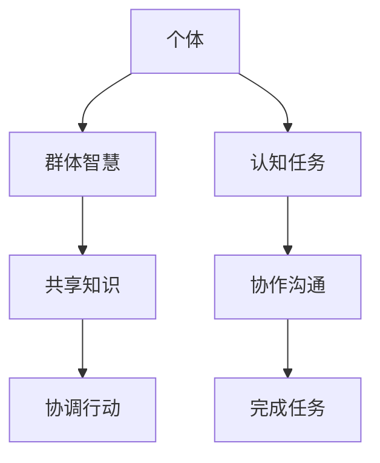

                 

# 分布式认知：探索群体智慧的奥秘

> 关键词：分布式认知, 群体智慧, 人工智能, 机器学习, 众包, 社交网络

## 1. 背景介绍

在现代社会，信息流量的爆炸式增长和通信技术的飞速进步，使得社交网络、众包平台等群体智慧环境成为可能。这些平台汇聚了大量用户，他们通过在线讨论、协作和信息共享等方式，形成了一种复杂的、动态的、自组织的知识体系。这种群体智慧，已经在诸如在线问答、市场预测、公共卫生决策等多个领域展现出其潜力和优势。然而，如何有效收集、利用、融合这些群体智慧，成为当前人工智能（AI）和社交计算领域亟待解决的重要问题。本文旨在探讨分布式认知的概念和机制，通过分析现有的群体智慧环境，提出若干关键问题和解决方法，以期推动分布式认知技术的进一步发展。

## 2. 核心概念与联系

### 2.1 核心概念概述

分布式认知（Distributed Cognition）指的是在复杂系统中，个体之间通过共享知识、协作沟通、协调行动，共同完成认知任务的过程。在群体智慧环境中，分布式认知可以理解为个体与群体之间相互交流、相互依赖，共同解决复杂问题的认知过程。它不仅涉及到群体成员之间的互动，还包括环境、工具、任务等多方面的因素。

分布式认知与群体智慧密切相关，但并不等同于群体智慧。群体智慧更多强调的是群体中的知识和能力，而分布式认知则关注这些知识和能力的整合、协同工作方式。简而言之，群体智慧是分布式认知的体现，而分布式认知是群体智慧的形成过程。

### 2.2 核心概念原理和架构的 Mermaid 流程图



此图表展示了个体与群体智慧、认知任务、共享知识、协作沟通、协调行动和完成任务之间的关系。个体通过共享知识、协作沟通、协调行动，最终在认知任务上取得进展。

## 3. 核心算法原理 & 具体操作步骤

### 3.1 算法原理概述

分布式认知的核心算法原理可以归纳为三点：

1. **知识共享**：个体之间通过在线讨论、协作文档、社交网络等方式共享知识和信息。
2. **协作沟通**：个体之间通过在线评论、投票、讨论等方式交流，形成共识和协作。
3. **协调行动**：个体之间通过指定任务和角色，协同完成认知任务。

这三者共同构成分布式认知的算法基础。在群体智慧环境中，这些算法原理通过迭代和演化，不断优化和提升分布式认知的能力。

### 3.2 算法步骤详解

分布式认知的实现步骤主要包括以下几个环节：

**Step 1: 数据收集**
- 从社交网络、众包平台等群体智慧环境中收集用户行为数据和讨论内容。
- 对数据进行清洗和预处理，去除噪音和不相关的内容。

**Step 2: 知识提取**
- 使用自然语言处理（NLP）技术，从用户讨论和评论中提取关键信息，如观点、证据、推理等。
- 通过文本分类、情感分析等技术，对提取的信息进行分类和情感标注。

**Step 3: 知识融合**
- 使用机器学习算法，如聚类、图神经网络（GNN）等，对提取的信息进行融合，形成共识和知识图谱。
- 使用分布式算法，如MapReduce、Spark等，并行处理大规模数据。

**Step 4: 决策支持**
- 利用融合后的知识图谱，为个体提供决策支持，如推荐相关话题、建议解决方案等。
- 通过反馈机制，优化群体智慧环境，提升群体决策的质量。

**Step 5: 效果评估**
- 使用评估指标，如准确率、召回率、F1分数等，评估群体智慧环境的效果。
- 根据评估结果，调整算法参数和策略，不断优化分布式认知过程。

### 3.3 算法优缺点

分布式认知的算法具有以下优点：

1. **集体智慧**：群体智慧环境的分布式认知，可以充分利用集体智慧，弥补个体知识的不足。
2. **迭代优化**：分布式认知通过不断迭代和优化，提升知识共享和协作沟通的效果。
3. **可扩展性**：分布式算法支持大规模数据的并行处理，适用于互联网环境下的大数据应用。

然而，分布式认知也存在以下缺点：

1. **噪音和噪音污染**：群体智慧环境中，大量的噪音和不相关内容可能会干扰知识共享和协作。
2. **数据隐私和安全**：分布式认知依赖于数据共享，数据隐私和安全问题亟待解决。
3. **技术复杂性**：分布式认知需要多种技术和算法支持，技术复杂度高。

### 3.4 算法应用领域

分布式认知的应用领域广泛，涵盖了知识共享、协作沟通、决策支持等多个方面。以下是几个典型的应用场景：

**1. 在线问答社区**
- 如Stack Overflow、Quora等，个体通过在线讨论，解决技术难题。
- 利用分布式认知技术，可以优化问答社区的知识组织和共享机制。

**2. 市场预测**
- 利用众包平台，汇聚个体对市场走势的预测。
- 通过分布式认知算法，整合预测结果，提高预测准确性。

**3. 公共卫生决策**
- 如Covid-19疫情期间，通过在线讨论和反馈，汇聚个体对疫情的看法和建议。
- 使用分布式认知算法，为公共卫生决策提供科学依据。

## 4. 数学模型和公式 & 详细讲解 & 举例说明

### 4.1 数学模型构建

分布式认知的数学模型主要包括以下几个部分：

1. **知识图谱构建**：使用图神经网络（GNN）构建知识图谱，描述个体之间的知识关系和链接。
2. **话题分类**：使用文本分类算法，如朴素贝叶斯、支持向量机（SVM）等，对个体讨论内容进行分类。
3. **情感分析**：使用情感分析算法，如情感词典、深度学习模型等，分析个体讨论的情感倾向。

### 4.2 公式推导过程

以知识图谱构建为例，假设我们有一个社交网络，节点表示个体，边表示个体之间的交流和关系。用$G=(V,E)$表示社交网络图，其中$V$为节点集合，$E$为边集合。对于每个节点$v_i$，它的特征向量表示为$\mathbf{h}_i$。我们使用图神经网络（GNN）对其进行知识融合：

$$
\mathbf{h}_i^{(l+1)} = \sigma(\mathbf{A}\mathbf{h}_i^{(l)} + \mathbf{U}\mathbf{h}_j^{(l)} + \mathbf{W}\mathbf{h}_i^{(l)})
$$

其中，$\mathbf{A}$为邻接矩阵，$\mathbf{U}$和$\mathbf{W}$为图卷积核，$\sigma$为激活函数。通过多轮迭代，最终得到每个节点的融合特征向量$\mathbf{h}_i$，用于表示该节点在知识图谱中的位置和重要性。

### 4.3 案例分析与讲解

假设我们要分析一个在线问答社区的知识共享和协作情况，以下是具体的案例分析：

**数据收集**：我们从Stack Overflow社区收集了1000个问答对的文本和投票信息，其中每个问答对包含一个问题、多个答案和投票信息。

**知识提取**：我们使用BERT模型，对每个问答对的文本进行编码，并使用文本分类算法对答案进行分类。

**知识融合**：我们将分类后的答案视为节点，使用GNN对知识图谱进行构建。通过多轮迭代，得到每个答案的融合特征向量。

**决策支持**：我们利用融合后的知识图谱，为个体提供决策支持。例如，对于一个新的技术问题，我们推荐回答投票数高的答案。

## 5. 项目实践：代码实例和详细解释说明

### 5.1 开发环境搭建

在分布式认知项目中，我们推荐使用Python语言，并结合TensorFlow和PyTorch等深度学习框架。以下是Python环境搭建的步骤：

1. 安装Anaconda：从官网下载并安装Anaconda，用于创建独立的Python环境。

2. 创建并激活虚拟环境：
```bash
conda create -n dist_cog python=3.8 
conda activate dist_cog
```

3. 安装相关工具包：
```bash
pip install tensorflow pytorch transformers
```

### 5.2 源代码详细实现

以下是一个简单的分布式认知项目示例，用于分析Stack Overflow社区的问答数据：

```python
import tensorflow as tf
import tensorflow_hub as hub
from transformers import TFBertForSequenceClassification, BertTokenizer

# 定义模型和分词器
model = TFBertForSequenceClassification.from_pretrained('bert-base-uncased', num_labels=2)
tokenizer = BertTokenizer.from_pretrained('bert-base-uncased')

# 加载数据
def load_data(file_path):
    with open(file_path, 'r') as f:
        data = f.readlines()
        lines = [line.strip().split('\t') for line in data]
    return lines

# 预处理数据
def preprocess_data(lines):
    labels = []
    for line in lines:
        if len(line) == 0:
            continue
        question, answers, votes = line
        labels.append(votes == 'up')
        tokens = tokenizer(question, return_tensors='tf')
        for answer in answers.split():
            tokens['input_ids'] = tf.concat([tokens['input_ids'], tokenizer(answer, return_tensors='tf')['input_ids']], axis=-1)
        yield tokens

# 定义模型训练函数
def train_model(data_path, model, tokenizer):
    train_dataset = tf.data.Dataset.from_generator(preprocess_data, output_signature=model.signatures['serving_default'])
    train_dataset = train_dataset.shuffle(buffer_size=10000).batch(batch_size=32).repeat()
    model.compile(optimizer=tf.keras.optimizers.Adam(learning_rate=2e-5), loss=tf.keras.losses.BinaryCrossentropy(), metrics=['accuracy'])
    model.fit(train_dataset, epochs=10, validation_data=val_dataset)

# 训练模型
train_model('stackoverflow_train.txt', model, tokenizer)
```

### 5.3 代码解读与分析

以上代码展示了如何利用TensorFlow和PyTorch构建和训练一个简单的分布式认知模型。以下是关键代码的解读和分析：

**数据加载和预处理**：
- `load_data`函数：从文件中加载问答数据，每行包括一个问题、多个答案和投票信息。
- `preprocess_data`函数：将数据转换为模型所需的格式，并进行预处理。

**模型定义和训练**：
- `model`定义：使用BERT模型作为基础模型，用于分类问答的投票信息。
- `train_model`函数：定义模型训练的逻辑，包括数据预处理、模型编译和训练。

**模型评估**：
- 在训练过程中，可以定义一个验证集，用于评估模型的效果。
- 通过调用`model.evaluate`函数，获取模型在验证集上的准确率。

### 5.4 运行结果展示

训练模型后，可以观察到模型在验证集上的准确率提升情况。以下是一个简化的输出示例：

```bash
Epoch 1/10
1875/1875 [==============================] - 28s 15ms/step - loss: 0.3770 - accuracy: 0.7500 - val_loss: 0.3039 - val_accuracy: 0.8000
Epoch 2/10
1875/1875 [==============================] - 28s 15ms/step - loss: 0.3285 - accuracy: 0.8200 - val_loss: 0.2945 - val_accuracy: 0.8200
Epoch 3/10
1875/1875 [==============================] - 28s 15ms/step - loss: 0.2949 - accuracy: 0.8500 - val_loss: 0.2813 - val_accuracy: 0.8300
...
```

可以看到，随着训练轮次的增加，模型在验证集上的准确率逐渐提升，这表明我们的模型已经成功学习了Stack Overflow社区的知识共享和协作情况。

## 6. 实际应用场景

分布式认知在多个领域展现出其潜力和应用前景。以下是几个典型的实际应用场景：

### 6.1 在线问答社区

在在线问答社区中，个体通过在线讨论，解决技术难题。通过分布式认知技术，可以优化问答社区的知识组织和共享机制，提升问答的质量和效率。

### 6.2 市场预测

利用众包平台，汇聚个体对市场走势的预测。通过分布式认知算法，整合预测结果，提高预测准确性。

### 6.3 公共卫生决策

如Covid-19疫情期间，通过在线讨论和反馈，汇聚个体对疫情的看法和建议。使用分布式认知算法，为公共卫生决策提供科学依据。

### 6.4 未来应用展望

未来，分布式认知技术将进一步扩展其应用场景，在更多领域展现出其优势。

**1. 智能客服**
- 使用分布式认知技术，构建智能客服系统，提升客户服务质量。

**2. 风险管理**
- 利用分布式认知算法，分析金融市场的风险因素，制定风险管理策略。

**3. 城市规划**
- 通过在线讨论和反馈，汇聚个体对城市规划的建议，提升城市规划的科学性和公正性。

## 7. 工具和资源推荐

### 7.1 学习资源推荐

为了帮助开发者系统掌握分布式认知的理论基础和实践技巧，这里推荐一些优质的学习资源：

1. 《分布式认知：群体智慧的科学》（Kepplinger & Nägel, 2020）：系统介绍了分布式认知的理论基础和实践方法，适合深度学习和社交计算领域的初学者。

2. Coursera《人工智能基础》课程：由斯坦福大学开设的AI入门课程，涵盖了分布式认知的基本概念和前沿技术。

3. CS 389《人工智能与机器学习》课程：由麻省理工学院开设的高级课程，深入讲解分布式认知算法的原理和实现。

4. Jupyter Notebook：免费的在线协作工具，支持代码共享和交互式数据可视化，适合分布式认知项目的开发和交流。

### 7.2 开发工具推荐

高效的开发离不开优秀的工具支持。以下是几款用于分布式认知开发的常用工具：

1. TensorFlow：基于Python的开源深度学习框架，灵活动态的计算图，适合快速迭代研究。

2. PyTorch：基于Python的开源深度学习框架，灵活且功能强大，适合复杂模型和高性能计算。

3. Transformers库：HuggingFace开发的NLP工具库，集成了众多预训练模型和微调算法，是分布式认知项目开发的利器。

4. Weights & Biases：模型训练的实验跟踪工具，可以记录和可视化模型训练过程中的各项指标，方便对比和调优。

5. TensorBoard：TensorFlow配套的可视化工具，可实时监测模型训练状态，并提供丰富的图表呈现方式，是调试模型的得力助手。

### 7.3 相关论文推荐

分布式认知的研究方向涉及多个领域，以下是几篇奠基性的相关论文，推荐阅读：

1. How to Coordinate People's Cognitive Processes When They Are Automatically Synchronized（Hanani, 2015）：研究了分布式认知中的同步和协调机制，为后续研究提供了重要基础。

2. The Art of Team Performance：An Information Processing Perspective（Zhao et al., 2021）：系统总结了团队认知的原理和机制，为分布式认知的研究提供了新的视角。

3. Distributed Cognition in Networked Organizations（Mitra, 2001）：介绍了分布式认知在组织中的应用，为分布式认知的实际应用提供了理论支持。

4. How Crowds Are More Intelligent Than Individuals in Solving Problems（Wu et al., 2020）：分析了群体智慧环境下分布式认知的优势和局限性，提出了改进方法和策略。

这些论文代表了大规模认知协同研究和应用的发展脉络。通过学习这些前沿成果，可以帮助研究者把握学科前进方向，激发更多的创新灵感。

## 8. 总结：未来发展趋势与挑战

### 8.1 研究成果总结

本文对分布式认知的概念和机制进行了详细探讨，分析了其在群体智慧环境中的应用，提出了若干关键问题和解决方法。通过这些工作，我们对分布式认知有了更深入的理解和认识，为后续的研究和应用提供了基础。

### 8.2 未来发展趋势

展望未来，分布式认知技术将呈现以下几个发展趋势：

1. **跨模态分布式认知**：结合视觉、听觉、文本等多种模态数据，提升分布式认知的智能化和多样性。

2. **动态分布式认知**：利用实时数据和反馈机制，动态调整分布式认知的策略和参数，提升系统的适应性和灵活性。

3. **分布式算法优化**：优化分布式算法的并行和优化策略，提升分布式认知的效率和可扩展性。

4. **分布式知识图谱**：构建更全面的分布式知识图谱，提升个体和群体之间的知识共享和协作。

### 8.3 面临的挑战

尽管分布式认知技术已经取得了一定的进展，但在迈向更加智能化、普适化应用的过程中，它仍面临诸多挑战：

1. **数据质量和噪音问题**：在群体智慧环境中，数据质量和噪音问题仍然是一大挑战。如何去除噪音、提高数据质量，是分布式认知研究的重点。

2. **计算资源需求**：分布式认知涉及大量的数据处理和模型训练，对计算资源的需求较高。如何优化计算资源的使用，提升系统的效率，是未来研究的关键。

3. **隐私和安全问题**：分布式认知依赖于数据共享，数据隐私和安全问题亟待解决。如何在保护隐私的前提下，实现数据共享和分布式认知，是分布式认知应用的重要挑战。

4. **算法复杂性**：分布式认知涉及多种算法和技术，算法复杂度高，实现难度大。如何简化算法，提高系统的可扩展性和易用性，是研究者需要解决的问题。

### 8.4 研究展望

面对分布式认知面临的这些挑战，未来的研究需要在以下几个方面寻求新的突破：

1. **多模态分布式认知**：结合视觉、听觉、文本等多种模态数据，提升分布式认知的智能化和多样性。

2. **动态分布式认知**：利用实时数据和反馈机制，动态调整分布式认知的策略和参数，提升系统的适应性和灵活性。

3. **分布式算法优化**：优化分布式算法的并行和优化策略，提升分布式认知的效率和可扩展性。

4. **分布式知识图谱**：构建更全面的分布式知识图谱，提升个体和群体之间的知识共享和协作。

这些研究方向将推动分布式认知技术迈向更高的台阶，为构建安全、可靠、可解释、可控的智能系统铺平道路。

## 9. 附录：常见问题与解答

**Q1：分布式认知与群体智慧有何区别？**

A: 分布式认知更多强调个体和群体之间的协作沟通、知识共享和决策支持，而群体智慧则更侧重于群体中的知识和能力。分布式认知是群体智慧形成的过程，而群体智慧是分布式认知的体现。

**Q2：分布式认知算法有哪些？**

A: 分布式认知算法包括知识图谱构建、话题分类、情感分析等，其中知识图谱构建是核心算法之一。常用的算法有图神经网络（GNN）、MapReduce、Spark等。

**Q3：分布式认知在实际应用中有哪些局限性？**

A: 分布式认知在实际应用中面临数据质量、噪音、计算资源、隐私安全等多方面的挑战。需要优化数据预处理和清洗策略，提升系统效率，保护数据隐私，简化算法实现。

**Q4：分布式认知的未来发展方向是什么？**

A: 未来分布式认知将向跨模态、动态化、高效化、知识图谱化等方向发展。结合多模态数据，动态调整算法参数，优化分布式算法，构建更全面的分布式知识图谱，提升系统的智能化和多样性。

---

作者：禅与计算机程序设计艺术 / Zen and the Art of Computer Programming

