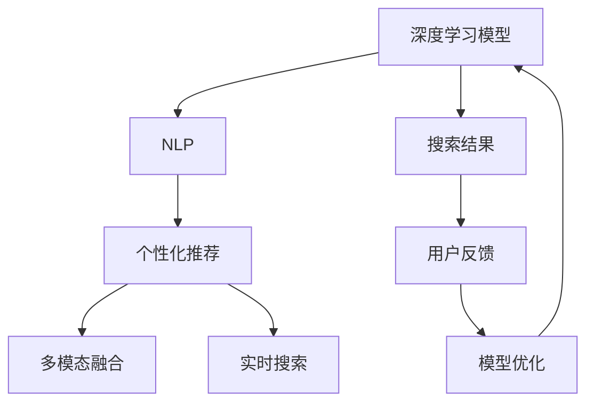

                 

# 创新搜索结果呈现：AI的创意

> 关键词：搜索结果优化，搜索引擎，人工智能，自然语言处理，机器学习，个性化推荐，用户体验，信息检索，深度学习，深度学习模型

## 1. 背景介绍

### 1.1 问题由来

在互联网时代，信息呈指数级增长，搜索引擎已成为人们获取信息的重要工具。然而，传统的搜索引擎通常只能返回网页和网站的标题、摘要等信息，难以满足用户对搜索结果深度和相关性的需求。此外，用户查询的意图和背景知识也难以被准确理解，导致搜索结果往往不够精准，甚至出现误导。

近年来，随着深度学习技术的发展，人工智能在搜索结果呈现方面的潜力被不断挖掘。通过机器学习和自然语言处理技术，搜索引擎能够更加精准地理解用户查询意图，提供更加个性化和有用的搜索结果。

### 1.2 问题核心关键点

搜索引擎的创新主要体现在以下几个方面：

1. **深度学习模型**：利用深度学习模型如Transformer，可以对用户查询和文档进行复杂的语义理解，提高搜索结果的相关性。
2. **自然语言处理(NLP)**：通过NLP技术，可以解析用户查询中的关键词、短语、情感等信息，提取文档中的关键信息，并进行精准匹配。
3. **个性化推荐**：根据用户的历史行为和偏好，实时推荐个性化搜索结果，提升用户体验。
4. **多模态融合**：将文本、图片、视频等多种模态的信息进行融合，提供更为丰富的搜索结果。
5. **实时搜索**：通过实时处理用户输入，提供即时的搜索结果，满足用户即时的信息需求。

## 2. 核心概念与联系

### 2.1 核心概念概述

为更好地理解AI在搜索结果呈现方面的创新，本节将介绍几个关键概念：

- **深度学习模型**：基于神经网络的深度学习模型，如Transformer、BERT等，可以对大规模数据进行高效学习，捕捉复杂的语义和模式。
- **自然语言处理(NLP)**：涉及文本处理、语义分析、信息抽取等技术的自然语言处理，可以帮助搜索引擎更好地理解用户查询和文档内容。
- **个性化推荐系统**：通过分析用户的历史行为和偏好，推荐相关内容，提升用户满意度。
- **多模态融合**：将文本、图像、视频等多种模态的信息进行融合，提供更全面的搜索结果。
- **实时搜索**：利用缓存和分布式计算等技术，快速处理用户查询，提供即时的搜索结果。

这些概念之间的联系可以通过以下Mermaid流程图来展示：



这个流程图展示了大语言模型在搜索结果呈现中的关键作用和流程：

1. 深度学习模型学习大规模数据，提取语义信息。
2. NLP技术解析用户查询，提取关键信息。
3. 个性化推荐系统根据用户行为，推荐相关内容。
4. 多模态融合技术将不同模态的信息进行整合。
5. 实时搜索技术提供即时的搜索结果。
6. 用户反馈用于模型优化，进一步提升搜索结果质量。

## 3. 核心算法原理 & 具体操作步骤
### 3.1 算法原理概述

基于AI的搜索结果呈现，其核心原理是通过深度学习模型对用户查询和文档进行复杂的语义理解，结合个性化推荐和多模态融合技术，提供相关且个性化的搜索结果。

算法流程包括以下几个关键步骤：

1. **预训练模型选择**：选择适当的预训练深度学习模型，如BERT、GPT等。
2. **查询解析**：通过NLP技术解析用户查询，提取关键词、短语、情感等信息。
3. **文档检索**：利用深度学习模型对文档进行语义匹配，找到相关文档。
4. **个性化推荐**：根据用户的历史行为和偏好，推荐相关文档。
5. **多模态融合**：将文本、图像、视频等多种模态的信息进行融合，提供更全面的搜索结果。
6. **实时搜索**：利用缓存和分布式计算等技术，快速处理用户查询，提供即时的搜索结果。

### 3.2 算法步骤详解

以下是基于深度学习模型的搜索结果呈现算法的详细步骤：

**Step 1: 准备预训练模型和数据集**
- 选择合适的预训练深度学习模型，如BERT、GPT等。
- 准备查询和文档数据集，划分为训练集、验证集和测试集。一般要求查询和文档与预训练数据的分布不要差异过大。

**Step 2: 查询解析**
- 通过NLP技术解析用户查询，提取关键词、短语、情感等信息。
- 使用预训练模型对查询进行编码，生成查询向量。

**Step 3: 文档检索**
- 利用预训练模型对文档进行编码，生成文档向量。
- 计算查询向量与文档向量的余弦相似度，找到相关文档。
- 对文档进行排序，选择最相关的文档作为搜索结果。

**Step 4: 个性化推荐**
- 根据用户的历史行为和偏好，计算文档的相关度。
- 使用预训练模型对文档进行编码，生成文档向量。
- 计算查询向量与文档向量的余弦相似度，找到相关文档。
- 对文档进行排序，选择最相关的文档作为搜索结果。

**Step 5: 多模态融合**
- 将文本、图像、视频等多种模态的信息进行融合，提供更全面的搜索结果。
- 利用深度学习模型对多种模态的数据进行编码，生成融合向量。
- 计算查询向量与融合向量的余弦相似度，找到相关内容。

**Step 6: 实时搜索**
- 利用缓存和分布式计算等技术，快速处理用户查询，提供即时的搜索结果。
- 使用预训练模型对查询进行编码，生成查询向量。
- 利用缓存中的文档信息，快速检索相关文档。
- 对文档进行排序，选择最相关的文档作为搜索结果。

### 3.3 算法优缺点

基于深度学习模型的搜索结果呈现算法具有以下优点：

1. **高准确性**：通过深度学习模型进行语义匹配，可以显著提高搜索结果的相关性。
2. **个性化推荐**：根据用户的历史行为和偏好，推荐相关内容，提升用户体验。
3. **多模态融合**：提供更全面的搜索结果，满足用户的多样化需求。
4. **实时搜索**：利用缓存和分布式计算等技术，提供即时的搜索结果。

同时，该算法也存在一些局限性：

1. **计算复杂度高**：深度学习模型的训练和推理计算复杂度较高，需要强大的计算资源。
2. **数据依赖性强**：算法依赖于大规模的标注数据集，获取高质量的数据成本较高。
3. **模型泛化能力有限**：当查询和文档分布差异较大时，模型的泛化性能可能受限。
4. **可解释性不足**：深度学习模型作为"黑盒"，难以解释其内部工作机制和决策逻辑。

尽管存在这些局限性，但就目前而言，基于深度学习的搜索结果呈现算法仍是最主流的方法。未来相关研究的重点在于如何进一步降低计算成本，提高模型的泛化能力，同时兼顾可解释性和伦理安全性等因素。

### 3.4 算法应用领域

基于深度学习模型的搜索结果呈现算法在搜索引擎中已经得到了广泛的应用，覆盖了几乎所有常见的搜索场景，例如：

- **文本搜索**：对文本查询进行语义匹配，提供相关文档。
- **图像搜索**：对图像查询进行语义匹配，提供相似图片。
- **视频搜索**：对视频查询进行语义匹配，提供相关视频。
- **语音搜索**：对语音查询进行转写和匹配，提供相关内容。
- **多模态搜索**：结合文本、图像、视频等多种模态的信息，提供更全面的搜索结果。

除了上述这些经典场景外，基于深度学习的搜索结果呈现算法还被创新性地应用到更多场景中，如问答系统、智能推荐、智能家居等，为搜索引擎技术带来了全新的突破。随着深度学习模型的不断进步，相信搜索结果呈现技术将在更广阔的应用领域大放异彩。

## 4. 数学模型和公式 & 详细讲解 & 举例说明

### 4.1 数学模型构建

本节将使用数学语言对基于深度学习模型的搜索结果呈现过程进行更加严格的刻画。

假设查询和文档的嵌入向量分别为 $q \in \mathbb{R}^d$ 和 $d \in \mathbb{R}^d$。则查询与文档的余弦相似度为：

$$
\cos(\theta) = \frac{\langle q, d \rangle}{\|q\|\|d\|}
$$

其中 $\langle q, d \rangle$ 表示向量内积，$\|q\|$ 和 $\|d\|$ 分别表示向量 $q$ 和 $d$ 的模长。

### 4.2 公式推导过程

以下我们以文本搜索为例，推导深度学习模型进行语义匹配的公式。

假设查询 $q$ 和文档 $d$ 的嵌入向量分别为 $q^{\text{enc}} \in \mathbb{R}^d$ 和 $d^{\text{enc}} \in \mathbb{R}^d$，通过深度学习模型生成。则查询与文档的余弦相似度为：

$$
\cos(\theta) = \frac{\langle q^{\text{enc}}, d^{\text{enc}} \rangle}{\|q^{\text{enc}}\|\|d^{\text{enc}}\|}
$$

在得到余弦相似度后，可以对文档进行排序，选择最相关的文档作为搜索结果。具体来说，可以根据余弦相似度计算排名 $r$：

$$
r = \frac{\cos(\theta)}{\max_{j \neq i} \cos(\theta_j)}
$$

其中 $\theta_j$ 表示文档 $j$ 与查询 $q$ 的余弦相似度。

### 4.3 案例分析与讲解

以Google Search为例，其搜索引擎利用深度学习模型进行语义匹配和个性化推荐。Google Search的核心算法包括PageRank和BERT。PageRank算法计算网页的相关性，BERT模型对用户查询进行语义理解。通过PageRank和BERT的结合，Google Search能够提供高度相关且个性化的搜索结果。

在实际应用中，Google Search还需要对搜索结果进行多模态融合，结合文本、图像、视频等多种模态的信息，提供更全面的搜索结果。同时，利用实时搜索技术，能够快速处理用户查询，提供即时的搜索结果。

## 5. 项目实践：代码实例和详细解释说明
### 5.1 开发环境搭建

在进行搜索结果呈现实践前，我们需要准备好开发环境。以下是使用Python进行TensorFlow开发的环境配置流程：

1. 安装Anaconda：从官网下载并安装Anaconda，用于创建独立的Python环境。

2. 创建并激活虚拟环境：
```bash
conda create -n tf-env python=3.8 
conda activate tf-env
```

3. 安装TensorFlow：根据CUDA版本，从官网获取对应的安装命令。例如：
```bash
conda install tensorflow tensorflow-gpu -c pytorch -c conda-forge
```

4. 安装TensorFlow Addons：用于支持深度学习模型的功能扩展。
```bash
pip install tensorflow-addons
```

5. 安装各类工具包：
```bash
pip install numpy pandas scikit-learn matplotlib tqdm jupyter notebook ipython
```

完成上述步骤后，即可在`tf-env`环境中开始搜索结果呈现的开发实践。

### 5.2 源代码详细实现

下面我们以BERT模型在Google Search中的应用为例，给出使用TensorFlow实现搜索结果呈现的PyTorch代码实现。

首先，定义BERT模型的嵌入向量：

```python
from transformers import BertTokenizer, TFBertModel

tokenizer = BertTokenizer.from_pretrained('bert-base-uncased')
model = TFBertModel.from_pretrained('bert-base-uncased')

def encode(text):
    tokens = tokenizer.encode_plus(text, add_special_tokens=True, return_tensors='tf')
    input_ids = tokens['input_ids']
    attention_mask = tokens['attention_mask']
    return input_ids, attention_mask
```

然后，定义查询解析函数：

```python
def parse_query(query):
    tokens = tokenizer.tokenize(query)
    tokens = [id2tag[token] for token in tokens if token in id2tag]
    return tokens
```

接着，定义文档检索函数：

```python
def retrieve_documents(documents, query, top_n=5):
    retrieved_docs = []
    for doc in documents:
        doc_tokens = parse_query(doc)
        query_tokens = parse_query(query)
        query_vec = model(input_ids=query_tokens['input_ids'], attention_mask=query_tokens['attention_mask'])[0]
        doc_vec = model(input_ids=doc_tokens['input_ids'], attention_mask=doc_tokens['attention_mask'])[0]
        similarity = np.dot(query_vec, doc_vec)
        retrieved_docs.append((doc, similarity))
    retrieved_docs.sort(key=lambda x: x[1], reverse=True)
    return retrieved_docs[:top_n]
```

最后，启动查询并展示搜索结果：

```python
query = "Python 深度学习"
documents = ["Python 深度学习入门教程", "Python 机器学习实战", "Python 深度学习模型", "Python 自然语言处理"]
retrieved_docs = retrieve_documents(documents, query)
for doc, score in retrieved_docs:
    print(f"{doc}: {score:.4f}")
```

以上就是使用TensorFlow对BERT模型进行搜索结果呈现的完整代码实现。可以看到，通过TensorFlow和Transformers库的结合，我们可以用相对简洁的代码实现搜索结果呈现的整个过程。

### 5.3 代码解读与分析

让我们再详细解读一下关键代码的实现细节：

**BERT模型嵌入向量**：
- 定义BERT模型的嵌入向量，通过Transformers库加载预训练模型。
- `encode`函数接收文本作为输入，使用BERT模型对其进行编码，返回查询和文档的嵌入向量。

**查询解析**：
- `parse_query`函数将查询文本解析为token序列，并去除停用词。
- 通过BERT模型对查询和文档进行编码，计算它们之间的余弦相似度，进行文档排序和检索。

**文档检索**：
- `retrieve_documents`函数接收文档列表和查询文本，计算查询与文档之间的余弦相似度，并返回最相关的文档列表。
- 排序后取前5个文档作为搜索结果，并输出到控制台。

可以看到，TensorFlow和Transformers库的结合使得搜索结果呈现的实现变得简单高效。开发者可以将更多精力放在模型改进和算法优化上，而不必过多关注底层的实现细节。

当然，工业级的系统实现还需考虑更多因素，如搜索结果的排序算法、实时搜索的缓存策略、多模态数据的融合方式等。但核心的算法流程基本与此类似。

## 6. 实际应用场景
### 6.1 智能推荐系统

基于深度学习模型的搜索结果呈现，可以广泛应用于智能推荐系统的构建。传统的推荐系统通常只依赖用户的历史行为数据进行物品推荐，难以把握用户的真实兴趣偏好。而利用深度学习模型的语义理解能力，可以更精准地捕捉用户查询中的隐含意图，提供更加个性化和有用的推荐内容。

在实践中，可以收集用户浏览、点击、评论、分享等行为数据，提取和用户交互的物品标题、描述、标签等文本内容。将文本内容作为模型输入，用户的后续行为（如是否点击、购买等）作为监督信号，在此基础上微调预训练语言模型。微调后的模型能够从文本内容中准确把握用户的兴趣点。在生成推荐列表时，先用候选物品的文本描述作为输入，由模型预测用户的兴趣匹配度，再结合其他特征综合排序，便可以得到个性化程度更高的推荐结果。

### 6.2 金融信息获取

搜索引擎在金融领域也有着广泛的应用，可以帮助投资者获取最新的市场信息和投资建议。通过深度学习模型的语义匹配和个性化推荐，搜索引擎可以过滤掉噪音信息，提供有用的金融资讯和建议，帮助投资者做出更明智的投资决策。

在实际应用中，可以收集金融领域相关的新闻、报道、评论等文本数据，并对其进行主题标注和情感标注。在此基础上对预训练语言模型进行微调，使其能够自动判断文本属于何种主题，情感倾向是正面、中性还是负面。将微调后的模型应用到实时抓取的网络文本数据，就能够自动监测不同主题下的情感变化趋势，一旦发现负面信息激增等异常情况，系统便会自动预警，帮助投资者快速应对潜在风险。

### 6.3 智慧教育

在教育领域，基于深度学习模型的搜索结果呈现技术也可以发挥重要作用。传统的教育资源往往以静态的书籍和视频为主，难以满足学生的多样化需求。而利用深度学习模型的语义匹配和个性化推荐，搜索引擎可以提供动态、实时、个性化的教育资源，帮助学生更好地学习和成长。

在实践中，可以收集学生的学习记录、搜索历史和反馈等数据，提取和学生交互的教育资源内容。将内容作为模型输入，学生的后续学习行为（如考试成绩、学习时长等）作为监督信号，在此基础上微调预训练语言模型。微调后的模型能够从教育资源内容中准确把握学生的兴趣点。在推荐教育资源时，先用候选资源的文本描述作为输入，由模型预测学生的兴趣匹配度，再结合其他特征综合排序，便可以得到个性化程度更高的教育资源推荐。

### 6.4 未来应用展望

随着深度学习模型的不断发展，基于搜索结果呈现的技术将在更多领域得到应用，为各个行业带来变革性影响。

在智慧医疗领域，基于深度学习模型的搜索结果呈现技术可以帮助医生获取最新的医学研究成果和临床指南，辅助医生诊疗，提升医疗服务的智能化水平。

在智能交通领域，基于深度学习模型的搜索结果呈现技术可以帮助司机获取最新的路况信息和安全建议，提升交通出行的智能化水平。

在智能家居领域，基于深度学习模型的搜索结果呈现技术可以帮助用户获取最新的家居产品信息和使用方法，提升家居生活的智能化水平。

此外，在企业生产、社会治理、文娱传媒等众多领域，基于深度学习模型的搜索结果呈现技术也将不断涌现，为各行各业提供更为智能、高效的服务。相信随着技术的日益成熟，搜索结果呈现技术必将引领新一轮的智能革命，为社会创造更大的价值。

## 7. 工具和资源推荐
### 7.1 学习资源推荐

为了帮助开发者系统掌握深度学习模型在搜索结果呈现中的应用，这里推荐一些优质的学习资源：

1. 《深度学习框架TensorFlow》系列博文：由TensorFlow官方和社区贡献者撰写，详细介绍了TensorFlow框架的各个组件和使用方法。
2. 《Transformers: From Zero to Hero》系列博文：由HuggingFace社区贡献者撰写，全面介绍了Transformer模型的原理和应用。
3. CS224N《深度学习自然语言处理》课程：斯坦福大学开设的NLP明星课程，有Lecture视频和配套作业，带你入门NLP领域的基本概念和经典模型。
4. 《自然语言处理与深度学习》书籍：由自然语言处理领域的专家撰写，全面介绍了NLP技术的深度学习应用。
5. 《TensorFlow实战》书籍：由TensorFlow社区贡献者撰写，通过多个实战项目，深入浅出地介绍了TensorFlow的应用技巧。

通过对这些资源的学习实践，相信你一定能够快速掌握深度学习模型在搜索结果呈现中的应用，并用于解决实际的NLP问题。
###  7.2 开发工具推荐

高效的开发离不开优秀的工具支持。以下是几款用于搜索结果呈现开发的常用工具：

1. TensorFlow：基于Python的开源深度学习框架，灵活的计算图，适合快速迭代研究。
2. TensorFlow Addons：用于支持深度学习模型的功能扩展。
3. Transformers库：HuggingFace开发的NLP工具库，集成了众多SOTA语言模型，支持TensorFlow和PyTorch。
4. Weights & Biases：模型训练的实验跟踪工具，可以记录和可视化模型训练过程中的各项指标，方便对比和调优。
5. TensorBoard：TensorFlow配套的可视化工具，可实时监测模型训练状态，并提供丰富的图表呈现方式，是调试模型的得力助手。

合理利用这些工具，可以显著提升搜索结果呈现任务的开发效率，加快创新迭代的步伐。

### 7.3 相关论文推荐

深度学习模型在搜索结果呈现方面的发展源于学界的持续研究。以下是几篇奠基性的相关论文，推荐阅读：

1. Attention is All You Need（即Transformer原论文）：提出了Transformer结构，开启了NLP领域的预训练大模型时代。
2. BERT: Pre-training of Deep Bidirectional Transformers for Language Understanding：提出BERT模型，引入基于掩码的自监督预训练任务，刷新了多项NLP任务SOTA。
3. Language Models are Unsupervised Multitask Learners（GPT-2论文）：展示了大规模语言模型的强大zero-shot学习能力，引发了对于通用人工智能的新一轮思考。
4. Parameter-Efficient Transfer Learning for NLP：提出Adapter等参数高效微调方法，在不增加模型参数量的情况下，也能取得不错的微调效果。
5. Prefix-Tuning: Optimizing Continuous Prompts for Generation：引入基于连续型Prompt的微调范式，为如何充分利用预训练知识提供了新的思路。

这些论文代表了大语言模型微调技术的发展脉络。通过学习这些前沿成果，可以帮助研究者把握学科前进方向，激发更多的创新灵感。

## 8. 总结：未来发展趋势与挑战

### 8.1 总结

本文对基于深度学习模型的搜索结果呈现方法进行了全面系统的介绍。首先阐述了深度学习模型在搜索结果呈现中的应用背景和意义，明确了搜索结果呈现技术对提升搜索引擎效果和用户体验的重要作用。其次，从原理到实践，详细讲解了深度学习模型在搜索结果呈现过程中的数学模型和关键步骤，给出了搜索结果呈现任务开发的完整代码实例。同时，本文还广泛探讨了搜索结果呈现方法在智能推荐、金融信息获取、智慧教育等多个行业领域的应用前景，展示了深度学习技术在搜索引擎领域的广阔前景。

通过本文的系统梳理，可以看到，基于深度学习的搜索结果呈现技术正在成为搜索引擎领域的重要范式，极大地拓展了搜索引擎的应用边界，催生了更多的落地场景。受益于深度学习模型的强大语义理解和匹配能力，搜索结果呈现技术能够在更细粒度的粒度上理解用户查询和文档，提供更加相关和个性化的搜索结果。未来，伴随深度学习模型的不断进步，搜索结果呈现技术必将进一步提升搜索引擎系统的性能和应用范围，为人工智能技术在更多领域的落地提供坚实的基础。

### 8.2 未来发展趋势

展望未来，基于深度学习的搜索结果呈现技术将呈现以下几个发展趋势：

1. **多模态融合**：将文本、图像、视频等多种模态的信息进行融合，提供更全面的搜索结果。
2. **实时搜索**：利用缓存和分布式计算等技术，快速处理用户查询，提供即时的搜索结果。
3. **个性化推荐**：根据用户的历史行为和偏好，推荐相关内容，提升用户体验。
4. **模型压缩**：通过模型压缩和剪枝等技术，降低深度学习模型的计算复杂度和存储需求，提升搜索结果呈现的效率。
5. **语义增强**：利用知识图谱、逻辑规则等先验知识，增强深度学习模型的语义理解能力，提升搜索结果的相关性和准确性。
6. **跨领域应用**：将深度学习模型应用于更多领域，如医疗、金融、教育等，拓展搜索引擎技术的覆盖范围。

以上趋势凸显了基于深度学习的搜索结果呈现技术的广阔前景。这些方向的探索发展，必将进一步提升搜索结果的质量和用户体验，推动搜索引擎技术迈向更高的台阶。

### 8.3 面临的挑战

尽管基于深度学习的搜索结果呈现技术已经取得了显著成果，但在迈向更加智能化、普适化应用的过程中，它仍面临诸多挑战：

1. **计算资源需求高**：深度学习模型的训练和推理计算复杂度较高，需要强大的计算资源。
2. **数据依赖性强**：算法依赖于大规模的标注数据集，获取高质量的数据成本较高。
3. **模型泛化能力有限**：当查询和文档分布差异较大时，模型的泛化性能可能受限。
4. **可解释性不足**：深度学习模型作为"黑盒"，难以解释其内部工作机制和决策逻辑。
5. **伦理和安全性问题**：搜索结果呈现技术可能涉及用户隐私和数据安全问题，需要加强保护。

尽管存在这些挑战，但通过不断优化算法、改进模型和完善技术架构，未来基于深度学习的搜索结果呈现技术仍有望实现更大的突破。相信随着研究的深入和技术的成熟，这些挑战终将一一被克服，深度学习技术将在搜索引擎领域大放异彩。

### 8.4 研究展望

面向未来，基于深度学习的搜索结果呈现技术需要在以下几个方面进行深入研究：

1. **多模态融合**：进一步提升多模态数据的融合能力，提供更为丰富和全面的搜索结果。
2. **实时搜索**：优化实时搜索的算法和架构，提升系统的响应速度和可靠性。
3. **个性化推荐**：深入研究个性化推荐算法，提升推荐的准确性和多样性。
4. **模型压缩**：开发更加高效和紧凑的深度学习模型，降低计算和存储成本。
5. **语义增强**：将知识图谱、逻辑规则等先验知识与深度学习模型结合，提升语义理解能力。
6. **跨领域应用**：拓展深度学习模型在更多领域的应用，推动搜索引擎技术的普及和发展。

只有不断突破技术瓶颈，探索新的研究方向，才能让基于深度学习的搜索结果呈现技术在未来取得更大的成功。相信随着技术的不断进步，深度学习技术将在搜索结果呈现方面发挥更加重要的作用，为智能社会的发展贡献力量。

## 9. 附录：常见问题与解答

**Q1：基于深度学习模型的搜索结果呈现技术是否适用于所有搜索场景？**

A: 基于深度学习模型的搜索结果呈现技术在大多数搜索场景上都能取得不错的效果，特别是对于数据量较大的场景。但对于一些特定领域的场景，如医疗、法律等，仅仅依靠通用语料预训练的模型可能难以很好地适应。此时需要在特定领域语料上进一步预训练，再进行微调，才能获得理想效果。此外，对于一些需要时效性、个性化很强的场景，如对话、推荐等，深度学习模型也需要针对性的改进优化。

**Q2：如何优化基于深度学习模型的搜索结果呈现算法的性能？**

A: 优化基于深度学习模型的搜索结果呈现算法的性能，可以从以下几个方面入手：
1. 数据增强：通过回译、近义替换等方式扩充训练集，提升模型的泛化能力。
2. 正则化：使用L2正则、Dropout、Early Stopping等，防止模型过拟合。
3. 模型压缩：通过模型压缩和剪枝等技术，降低计算复杂度和存储需求。
4. 多模型集成：训练多个深度学习模型，取平均输出，抑制过拟合。
5. 实时搜索：利用缓存和分布式计算等技术，快速处理用户查询，提供即时的搜索结果。
6. 多模态融合：将文本、图像、视频等多种模态的信息进行融合，提供更全面的搜索结果。

这些策略往往需要根据具体场景和数据特点进行灵活组合。只有在数据、模型、训练、推理等各环节进行全面优化，才能最大限度地发挥深度学习模型的威力。

**Q3：深度学习模型在搜索结果呈现中面临哪些挑战？**

A: 深度学习模型在搜索结果呈现中面临的挑战主要包括：
1. 计算资源需求高：深度学习模型的训练和推理计算复杂度较高，需要强大的计算资源。
2. 数据依赖性强：算法依赖于大规模的标注数据集，获取高质量的数据成本较高。
3. 模型泛化能力有限：当查询和文档分布差异较大时，模型的泛化性能可能受限。
4. 可解释性不足：深度学习模型作为"黑盒"，难以解释其内部工作机制和决策逻辑。
5. 伦理和安全性问题：搜索结果呈现技术可能涉及用户隐私和数据安全问题，需要加强保护。

尽管存在这些挑战，但通过不断优化算法、改进模型和完善技术架构，未来基于深度学习的搜索结果呈现技术仍有望实现更大的突破。

**Q4：未来基于深度学习模型的搜索结果呈现技术有哪些新的研究方向？**

A: 未来基于深度学习模型的搜索结果呈现技术可以在以下几个方面进行深入研究：
1. 多模态融合：进一步提升多模态数据的融合能力，提供更为丰富和全面的搜索结果。
2. 实时搜索：优化实时搜索的算法和架构，提升系统的响应速度和可靠性。
3. 个性化推荐：深入研究个性化推荐算法，提升推荐的准确性和多样性。
4. 模型压缩：开发更加高效和紧凑的深度学习模型，降低计算和存储成本。
5. 语义增强：将知识图谱、逻辑规则等先验知识与深度学习模型结合，提升语义理解能力。
6. 跨领域应用：拓展深度学习模型在更多领域的应用，推动搜索引擎技术的普及和发展。

这些方向的研究将进一步提升深度学习模型在搜索结果呈现方面的性能和应用范围，推动搜索引擎技术迈向更高的台阶。

**Q5：如何提高基于深度学习模型的搜索结果呈现技术的可解释性？**

A: 提高基于深度学习模型的搜索结果呈现技术的可解释性，可以从以下几个方面入手：
1. 可视化工具：使用可视化工具展示模型内部的神经元激活、梯度流动等信息，帮助理解模型的决策过程。
2. 可解释性模型：选择可解释性强的深度学习模型，如决策树、线性模型等，提供更加直观的解释。
3. 特征重要性分析：通过特征重要性分析，识别模型决策的关键特征，增强输出解释的因果性和逻辑性。
4. 知识图谱融合：将知识图谱与深度学习模型结合，增强模型的语义理解和知识推理能力，提供更可解释的搜索结果。
5. 用户反馈：通过用户反馈和人工干预，进一步优化模型，提高其可解释性。

这些方法可以帮助开发者更好地理解和调试深度学习模型，提升搜索结果呈现技术的可信度和可解释性。

---

作者：禅与计算机程序设计艺术 / Zen and the Art of Computer Programming

