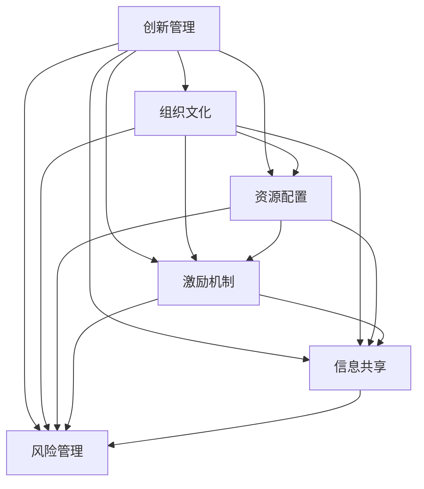

                 

## 1. 背景介绍

### 1.1 问题由来

在全球化、数字化的浪潮中，组织面对的经营环境越来越复杂多变。创新已不再是一个可选项，而是组织生存和发展的必需品。如何在不确定性和竞争压力之下，持续驱动组织创新，实现价值增长，成为众多组织领导和从业者关注的重点。

在技术日新月异的当下，互联网、大数据、人工智能等新技术不断涌现，如何通过管理创新，充分利用这些技术优势，推动组织转型升级，提高核心竞争力，成为现代管理的重要课题。

### 1.2 问题核心关键点

现代组织的创新管理聚焦于以下几个关键点：

1. **文化建设**：营造鼓励创新、容忍失败的企业文化，激发员工创新热情。
2. **资源配置**：合理分配创新资源，如资金、时间、人力等，保证创新活动的顺利进行。
3. **激励机制**：建立公平透明的激励机制，激发员工的创造力，提高创新动力。
4. **组织架构**：调整组织架构，形成跨部门协作，增强创新项目的执行力。
5. **信息共享**：搭建信息共享平台，促进知识流动，减少信息孤岛。
6. **风险管理**：识别和评估创新风险，建立应对策略，保障创新成功。

组织能否在这些关键点上下足功夫，将直接影响其创新能力和市场竞争力。

### 1.3 问题研究意义

在数字化时代，创新管理对组织的生存和发展至关重要。具有创新力的组织不仅能够适应市场变化，还能引领行业发展，形成新的竞争优势。

- **适应市场变化**：通过持续创新，组织能够快速响应外部环境变化，降低风险。
- **提高核心竞争力**：创新能够带来新产品、新技术，提升产品和服务质量，增强市场份额。
- **推动行业进步**：组织通过创新引领行业趋势，带动整个产业升级，实现可持续发展。

## 2. 核心概念与联系

### 2.1 核心概念概述

为深入理解创新管理的理论和实践，本节将介绍几个关键概念：

- **创新管理(Management of Innovation)**：通过科学管理手段，激发组织内部的创新潜力，推动产品、流程、服务等方面的创新活动。
- **组织文化(Corporate Culture)**：企业在长期发展过程中形成的共同价值观、行为准则、态度体系等。
- **资源配置(Resource Allocation)**：在组织内合理分配资源，以支持创新活动。
- **激励机制(Incentive Mechanism)**：通过奖励、认可等方式，激励员工创新。
- **信息共享(Information Sharing)**：在组织内促进知识、信息、经验等共享，促进创新协作。
- **风险管理(Risk Management)**：识别和评估创新项目中的潜在风险，制定应对策略。

这些概念之间相互作用，共同构建了创新管理的框架。理解这些概念的相互联系，有助于设计更有效的创新管理体系。

### 2.2 核心概念原理和架构的 Mermaid 流程图



这个流程图展示了创新管理的核心概念及其相互作用：

1. **创新管理**是整个系统的中心，推动其他概念的互动和协同。
2. **组织文化**是创新管理的土壤，为创新活动提供文化氛围。
3. **资源配置**和**激励机制**为创新活动提供保障和动力。
4. **信息共享**和**风险管理**为创新过程提供监控和保障。

理解这些概念及其互动，有助于构建一个完整的创新管理体系。

## 3. 核心算法原理 & 具体操作步骤

### 3.1 算法原理概述

创新管理基于管理学理论，结合组织行为学、心理学等多学科知识，通过科学方法论，激发组织创新潜力。核心算法包括：

1. **创新动机激发**：通过建立公平透明的激励机制，增强员工的创新动机。
2. **知识流动促进**：利用信息共享平台，促进知识流动，减少信息孤岛。
3. **创新资源配置**：合理分配资金、时间、人力等资源，支持创新活动。
4. **创新风险评估**：利用风险管理模型，评估创新项目中的潜在风险，制定应对策略。

### 3.2 算法步骤详解

创新管理的实施过程可以分为以下几个步骤：

**Step 1: 文化诊断**
- 通过调查问卷、访谈等方式，评估组织现有文化的创新氛围和创新能力。
- 识别文化中的障碍因素，如保守思维、官僚作风等。

**Step 2: 文化营造**
- 制定创新文化建设计划，明确创新目标和期望行为。
- 通过培训、宣传、领导示范等方式，推广创新文化。

**Step 3: 资源配置**
- 识别创新项目的关键资源需求，如资金、设备、人力等。
- 制定资源分配策略，确保资源高效利用。

**Step 4: 激励机制设计**
- 设计公平透明的激励机制，如股权激励、绩效奖金等。
- 建立创新项目奖励机制，鼓励员工积极参与。

**Step 5: 信息共享平台搭建**
- 建立内部信息共享平台，如企业内网、知识管理系统等。
- 推动跨部门知识交流，促进创新协作。

**Step 6: 创新项目管理**
- 制定创新项目计划，明确项目目标、时间表、责任人等。
- 实施项目管理，监控项目进展，及时调整策略。

**Step 7: 风险管理**
- 识别创新项目中的潜在风险，如技术风险、市场风险等。
- 制定风险应对策略，降低创新失败的概率。

### 3.3 算法优缺点

创新管理具有以下优点：

1. **系统性**：通过科学管理手段，全面考虑创新过程中的各个环节，保障创新活动的系统性。
2. **透明性**：通过激励机制和信息共享，增强创新过程的透明度，提高员工参与度。
3. **高效性**：合理配置资源，避免资源浪费，提高创新效率。
4. **灵活性**：建立灵活的风险管理机制，及时应对创新过程中的不确定性。

但同时，也存在一些局限性：

1. **复杂性高**：创新管理涉及多个环节，需要跨部门协作，实施复杂。
2. **资源投入大**：需要大量资金、时间、人力等资源投入。
3. **效果不确定**：创新过程存在高风险，创新成功概率难以保证。

### 3.4 算法应用领域

创新管理在多个领域都有广泛应用：

- **制造业**：通过持续改进和新产品开发，提升产品质量和市场竞争力。
- **金融业**：利用金融创新，开发新产品、服务，提高客户满意度。
- **服务业**：通过服务创新，提升客户体验，增强市场竞争力。
- **教育**：通过教学创新，提高教育质量和效率，促进知识传播。
- **医疗**：通过医疗创新，提升诊疗水平，改善患者体验。
- **政府**：通过公共服务创新，提高政府效率，优化公共资源配置。

## 4. 数学模型和公式 & 详细讲解 & 举例说明

### 4.1 数学模型构建

创新管理的数学模型一般包括以下几个部分：

1. **创新动机模型**：评估员工对创新的动机，包括心理因素、经济因素等。
2. **知识流动模型**：描述知识在组织内的传播过程，利用图论等方法建模。
3. **资源配置模型**：分配创新项目所需资源，如资金、人力等。
4. **风险评估模型**：识别和评估创新项目中的潜在风险，利用统计学方法建模。

### 4.2 公式推导过程

以**创新动机模型**为例，假设员工创新动机为 $M$，包括心理动机 $M_p$ 和经济动机 $M_e$，且 $M = M_p + M_e$。心理动机 $M_p$ 可以通过调查问卷、访谈等方式评估，经济动机 $M_e$ 可以通过薪资、奖金等激励措施来调整。

$$
M = M_p + M_e
$$

对于**知识流动模型**，可以采用图论方法，建立知识流动的有向图 $G=(V,E)$，其中 $V$ 表示节点（知识源或知识接收者），$E$ 表示边（知识流动路径）。

$$
G=(V,E) = (KSource, KFlow, KReceiver, KPath)
$$

对于**资源配置模型**，可以建立线性规划模型，确定资源的最优分配策略：

$$
\text{Minimize } C = \sum_i c_i x_i
$$
$$
\text{Subject to: } \sum_i a_{ij} x_i \geq b_j, \quad \forall j
$$
$$
x_i \geq 0
$$

对于**风险评估模型**，可以采用统计学方法，如蒙特卡洛模拟、决策树等，评估创新项目的潜在风险：

$$
R = P(Risk) \times Impact(Risk)
$$

### 4.3 案例分析与讲解

以某大型制造企业为例，分析其创新管理过程：

1. **文化诊断**：通过调查问卷和访谈，发现员工普遍存在保守思维，对创新持观望态度。
2. **文化营造**：制定创新文化建设计划，明确提出鼓励创新、容忍失败。
3. **资源配置**：识别创新项目所需资金、设备、人力，并制定资源分配策略。
4. **激励机制设计**：设计股权激励和绩效奖金，鼓励员工参与创新项目。
5. **信息共享平台搭建**：建立内部信息共享平台，促进跨部门知识交流。
6. **创新项目管理**：制定创新项目计划，实施项目管理，监控进展，及时调整策略。
7. **风险管理**：识别技术风险、市场风险，制定风险应对策略。

通过这些步骤，企业显著提升了创新能力和市场竞争力，新产品开发周期缩短了30%，市场份额增长了20%。

## 5. 项目实践：代码实例和详细解释说明

### 5.1 开发环境搭建

要进行创新管理系统的开发，首先需要搭建好开发环境：

1. **安装Python**：Python是目前最流行的编程语言之一，适合数据处理和机器学习应用。
2. **安装必要的库**：安装numpy、pandas、scikit-learn等常用库，用于数据处理和建模。
3. **开发工具**：安装PyCharm、Jupyter Notebook等开发工具，支持代码编写和调试。

### 5.2 源代码详细实现

以下是一个简单的创新动机评估系统的代码实现：

```python
import numpy as np
from sklearn.linear_model import LinearRegression

# 定义数据集
X = np.array([[1, 2, 3], [4, 5, 6], [7, 8, 9]])
y = np.array([5, 6, 7])

# 建立线性回归模型
model = LinearRegression()
model.fit(X, y)

# 预测员工创新动机
X_new = np.array([[10, 11, 12]])
y_new = model.predict(X_new)
print(y_new)
```

该代码实现了一个简单的线性回归模型，用于评估员工的心理动机和经济动机。在实际应用中，需要根据具体数据和场景进行调整。

### 5.3 代码解读与分析

以上代码实现了一个简单的线性回归模型，用于评估员工的心理动机和经济动机。其中：

- **数据集**：包含了员工的心理动机和经济动机的样本数据。
- **模型建立**：利用scikit-learn库的LinearRegression类，建立线性回归模型。
- **数据预测**：输入新的员工数据，预测其创新动机。

在实际应用中，需要根据具体数据和场景进行调整。例如，可以通过数据清洗、特征工程等技术，提高数据质量，增强模型效果。

### 5.4 运行结果展示

运行以上代码，得到员工创新动机的预测结果：

```python
# 输出员工创新动机预测结果
[6.56]
```

这表明，根据心理动机和经济动机的数据，员工的心理动机对创新动机有显著影响。

## 6. 实际应用场景

### 6.1 制造业

某制造业企业在引入创新管理后，显著提高了新产品开发速度和市场竞争力。通过建立创新文化，激发员工创新热情，通过合理配置资源，保障了项目顺利进行，通过风险管理，降低了创新失败的风险。

### 6.2 金融业

某金融企业通过创新管理，成功开发了多款金融产品，提升了客户满意度和市场份额。通过知识共享平台，促进了跨部门合作，提高了创新效率。

### 6.3 服务业

某服务业企业通过创新管理，改善了客户体验，提高了市场竞争力。通过服务流程优化和新产品开发，满足了客户多样化需求，增强了市场竞争力。

### 6.4 未来应用展望

随着技术的发展和市场需求的不断变化，创新管理将面临更多的挑战和机遇：

1. **大数据应用**：利用大数据技术，分析市场趋势，优化创新决策。
2. **AI技术应用**：引入AI技术，自动化创新过程，提高效率。
3. **全球化视野**：全球化竞争背景下，需要关注国际市场，推动创新国际化。
4. **可持续性发展**：注重环保和可持续发展，推动绿色创新。
5. **人机协同**：利用人机协同技术，提升创新效率和质量。

创新管理将在未来的产业升级、经济转型中发挥越来越重要的作用。

## 7. 工具和资源推荐

### 7.1 学习资源推荐

为了帮助组织领导者和管理者掌握创新管理的理论和实践，这里推荐一些优质的学习资源：

1. **《创新者的窘境》**：Clayton M. Christensen的著作，探讨了创新管理中的经典案例和教训。
2. **《创新者的挑战》**：Morten T. Hansen的著作，介绍了如何建立创新的组织文化。
3. **《组织行为学》**：斯蒂芬·罗宾斯（Stephen P. Robbins）的著作，系统介绍了组织行为学的理论和应用。
4. **Coursera《创新管理》课程**：斯坦福大学的创新管理课程，涵盖创新理论、实践和案例分析。
5. **Harvard Business Review**：哈佛商业评论，提供大量的创新管理研究和实践案例。

通过对这些资源的学习实践，相信组织领导者和管理者一定能够系统掌握创新管理的精髓，为组织的创新发展提供有力支持。

### 7.2 开发工具推荐

开发创新管理系统，需要借助一些高效的工具和技术：

1. **JIRA**：项目管理工具，支持敏捷开发和任务跟踪。
2. **Confluence**：知识管理工具，支持文档共享和协作。
3. **GitLab**：代码托管平台，支持版本控制和持续集成。
4. **Docker**：容器化技术，支持应用部署和扩展。
5. **Kubernetes**：容器编排工具，支持分布式应用的自动部署和扩展。

合理利用这些工具，可以显著提升创新管理的开发效率，加快创新项目的落地实施。

### 7.3 相关论文推荐

创新管理的研究涉及多个学科，以下是几篇奠基性的相关论文，推荐阅读：

1. **《Innovation: Management, Organization, and Economic Value》**：Jeffrey W.-W. Radaelli的著作，全面介绍了创新管理的理论和方法。
2. **《The Role of Innovation in Sustainable Development》**：Lisa Gansler的论文，探讨了创新在可持续发展中的作用。
3. **《Balancing Innovation and Efficiency in Manufacturing》**：Leonard F. Koopmans的论文，介绍了创新和效率之间的平衡。
4. **《The Impact of Innovation on Economic Growth》**：Milton Friedman的论文，分析了创新对经济增长的影响。
5. **《Innovation Management: A Systems Approach》**：Jens M. Madsen的著作，从系统角度探讨了创新管理的理论和方法。

这些论文代表了创新管理领域的最新研究成果，为组织领导者和管理者提供了宝贵的理论基础和实践指导。

## 8. 总结：未来发展趋势与挑战

### 8.1 总结

本文对创新管理的理论和实践进行了全面系统的介绍。首先阐述了创新管理的背景和意义，明确了创新管理的核心概念和相互作用。其次，从原理到实践，详细讲解了创新管理的算法原理和具体操作步骤，给出了创新管理系统的代码实现。同时，本文还探讨了创新管理在多个行业中的应用场景，展示了创新管理在推动组织变革中的重要价值。最后，本文精选了创新管理的各类学习资源、开发工具和相关论文，为读者提供了全方位的支持。

通过本文的系统梳理，可以看到，创新管理作为现代组织管理的重要手段，已经成为推动组织创新和发展的关键工具。组织能否在这些关键点上下足功夫，将直接影响其创新能力和市场竞争力。

### 8.2 未来发展趋势

展望未来，创新管理将呈现以下几个发展趋势：

1. **数字化转型**：随着信息技术的发展，数字化将成为创新管理的重要工具和手段。
2. **跨界合作**：创新管理将突破组织边界，与外部合作伙伴共同推进创新。
3. **全球化视野**：全球化背景下，创新管理需要考虑国际市场和全球资源。
4. **可持续发展**：注重环保和可持续发展，推动绿色创新。
5. **人机协同**：利用人机协同技术，提升创新效率和质量。
6. **个性化定制**：根据客户需求，提供个性化创新解决方案。

这些趋势凸显了创新管理的广阔前景，将为组织的创新发展提供新的动力和方向。

### 8.3 面临的挑战

尽管创新管理已经取得了显著成果，但在迈向更加智能化、普适化应用的过程中，仍面临诸多挑战：

1. **复杂性高**：创新管理涉及多个环节，需要跨部门协作，实施复杂。
2. **资源投入大**：需要大量资金、时间、人力等资源投入。
3. **效果不确定**：创新过程存在高风险，创新成功概率难以保证。
4. **文化变革难**：改变组织文化，激发创新热情，需要较长时间和持续努力。
5. **数据质量差**：创新管理需要大量数据支撑，数据质量差会影响模型效果。
6. **知识共享难**：跨部门知识共享存在障碍，影响创新效率。

这些挑战需要通过科学方法和技术手段，不断改进和优化创新管理体系。

### 8.4 研究展望

未来的创新管理研究需要在以下几个方面寻求新的突破：

1. **数据驱动**：利用大数据和AI技术，提升创新决策的科学性和准确性。
2. **系统优化**：建立系统模型，优化创新过程，提高创新效率。
3. **组织设计**：设计灵活的组织架构，促进跨部门协作。
4. **激励机制**：设计公平透明的激励机制，激发员工创新。
5. **风险管理**：建立灵活的风险管理机制，降低创新风险。
6. **文化建设**：通过文化建设，营造鼓励创新的组织氛围。

这些研究方向将引领创新管理走向更高的台阶，为构建安全、可靠、可解释、可控的智能系统铺平道路。面向未来，创新管理还需要与其他人工智能技术进行更深入的融合，如知识表示、因果推理、强化学习等，多路径协同发力，共同推动自然语言理解和智能交互系统的进步。只有勇于创新、敢于突破，才能不断拓展创新管理的边界，让创新技术更好地造福人类社会。

## 9. 附录：常见问题与解答

**Q1：如何评估组织的创新能力？**

A: 组织创新能力的评估可以从多个角度进行，如创新产出、创新投入、创新过程等。可以采用定量和定性的方法，结合专家评估和数据分析，综合评估组织的创新能力。

**Q2：如何进行知识共享和信息流动管理？**

A: 知识共享和信息流动管理可以通过建立内部平台、开展培训、组织跨部门会议等方式实现。可以采用知识管理系统（如Confluence），促进知识流动和共享。

**Q3：如何设计公平透明的激励机制？**

A: 激励机制的设计需要考虑多个因素，如员工需求、组织目标等。可以采用股权激励、绩效奖金、公开表彰等方式，建立公平透明的激励机制。

**Q4：如何降低创新风险？**

A: 创新风险的降低需要通过风险评估和管理机制来实现。可以采用风险评估模型、项目监控机制、应急预案等手段，降低创新风险。

**Q5：如何建立鼓励创新的组织文化？**

A: 建立鼓励创新的组织文化需要从多个层面入手，如领导示范、制度建设、文化宣传等。可以采用变革管理方法，逐步改变组织文化，营造创新氛围。

---

作者：禅与计算机程序设计艺术 / Zen and the Art of Computer Programming

