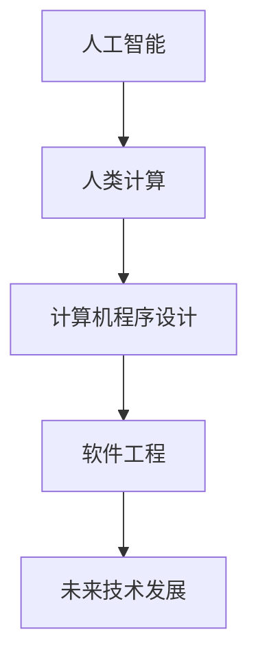

                 

# 创造更美好的世界：人类计算的终极目标

> 关键词：人工智能, 人类计算, 计算机程序设计, 软件工程, 未来技术发展

## 1. 背景介绍

### 1.1 问题由来
人类社会的进步和发展，在很大程度上得益于计算技术的演进。从最早的算盘和笔算，到电子计算机的诞生，再到现代超级计算机的运行，计算能力一直是推动社会进步的关键驱动力。然而，随着信息时代的到来，数据量和计算复杂度的爆炸式增长，传统计算模式已难以应对。

在这个背景下，人工智能（AI）作为新一代计算技术，以其强大的数据处理能力和深度学习模型，逐渐成为解决复杂计算问题的利器。而人类计算（Human Computing）作为AI的一种新形态，正致力于通过计算技术解决人类面临的重大问题，推动社会向更加美好和可持续的方向发展。

### 1.2 问题核心关键点
人类计算的终极目标是：
- 构建更智能、更高效的计算系统，以解决人类面临的重大问题。
- 实现机器对人类智慧的深度理解和模拟，推动科学研究的进步。
- 通过计算技术赋能各行各业，提升社会生产效率，促进公平与繁荣。

为此，人类计算需要解决的核心问题包括：
- 如何构建高效的计算模型和算法，处理大规模数据和复杂问题。
- 如何设计用户友好的计算接口，让用户可以方便地进行交互和协作。
- 如何构建安全、可靠、可解释的计算系统，确保计算过程透明、公正。

### 1.3 问题研究意义
研究人类计算的终极目标，对于推动科技发展、促进社会进步、提升人类生活质量具有重要意义：

1. 提升科学研究的效率：通过计算技术模拟和分析复杂的科学问题，加速科学研究的进程。
2. 解决人类面临的重大问题：如气候变化、疾病治疗、能源危机等，通过计算技术提供决策支持。
3. 赋能产业升级：通过计算技术优化生产流程，提升各行业的智能化水平。
4. 促进社会公平：通过计算技术普及教育和信息，缩小不同地区和社会阶层之间的差距。
5. 推动经济繁荣：通过计算技术创造新的商业模式和产业形态，带动经济增长。

## 2. 核心概念与联系

### 2.1 核心概念概述

为了更好地理解人类计算的终极目标，本节将介绍几个密切相关的核心概念：

- 人工智能（Artificial Intelligence, AI）：一种模拟人类智能的计算技术，能够处理复杂的数据和任务。
- 人类计算（Human Computing）：一种利用计算技术解决人类重大问题的计算模式，通过计算模型模拟人类智慧。
- 计算机程序设计（Computer Programming）：构建计算系统的过程，涉及算法设计和软件开发。
- 软件工程（Software Engineering）：构建高效、可维护、可扩展的计算系统的实践和理论。
- 未来技术发展（Future Technology Development）：探索和实现人类计算的新技术和新方法，推动科技和社会进步。

这些核心概念之间的逻辑关系可以通过以下Mermaid流程图来展示：



这个流程图展示了大语言模型的核心概念及其之间的关系：

1. 人工智能通过计算技术模拟人类智能，构建了人类计算的基础。
2. 人类计算利用计算技术解决人类面临的重大问题，推动科技和社会发展。
3. 计算机程序设计提供了构建计算系统的技术手段。
4. 软件工程提供了构建高效、可维护、可扩展的计算系统的实践和理论。
5. 未来技术发展探索和实现新的人类计算技术，推动人类社会的进步。

这些概念共同构成了人类计算的计算框架，使其能够有效解决复杂的计算问题，推动社会向更加美好和可持续的方向发展。

## 3. 核心算法原理 & 具体操作步骤
### 3.1 算法原理概述

人类计算的核心算法原理包括以下几个方面：

- 数据驱动的决策：通过大数据和深度学习技术，构建计算模型，提供决策支持。
- 模型集成与优化：通过集成多种计算模型和优化算法，提升计算效率和效果。
- 知识表示与推理：通过符号化的知识表示和逻辑推理，模拟人类智慧，解决复杂问题。
- 交互与协作：通过用户友好的计算接口，实现人机交互和协作，提升用户体验。
- 系统设计与安全：通过系统架构设计和安全性评估，构建可靠、安全的计算系统。

这些原理共同构成了人类计算的核心框架，使其能够在不同场景下发挥强大的计算能力。

### 3.2 算法步骤详解

基于上述核心算法原理，人类计算的具体操作步骤可以概括为以下几个步骤：

**Step 1: 数据收集与预处理**

- 收集与问题相关的数据，包括结构化数据（如数据库、表格）和非结构化数据（如文本、图像、音频等）。
- 对数据进行清洗、归一化和标准化，去除噪声和异常值。
- 将数据划分为训练集、验证集和测试集，准备用于计算模型的训练和评估。

**Step 2: 计算模型构建与训练**

- 根据问题的特点，选择合适的计算模型，如深度神经网络、知识图谱、逻辑推理模型等。
- 设计模型结构和参数初始化策略，构建计算模型。
- 使用训练集数据对模型进行训练，通过梯度下降等优化算法不断调整模型参数。
- 在验证集上评估模型效果，调整模型超参数，避免过拟合。

**Step 3: 计算模型评估与优化**

- 使用测试集数据对模型进行最终的评估，计算模型的精度、召回率、F1值等指标。
- 分析模型的性能瓶颈，进行模型优化，如调整网络结构、优化损失函数、增加正则化等。
- 集成多种计算模型，提升整体计算效果。

**Step 4: 计算模型部署与应用**

- 将训练好的模型部署到实际应用场景中，如移动应用、云服务平台等。
- 开发用户友好的计算接口，实现人机交互和协作。
- 持续监控模型性能，收集反馈数据，不断优化模型。

**Step 5: 计算系统设计与安全**

- 设计系统架构，确保系统的高可用性、可扩展性和可维护性。
- 进行系统安全性评估，防止数据泄露、攻击等安全问题。
- 设计系统的备份和恢复机制，保障系统的连续性和稳定性。

以上是人类计算的核心操作步骤，各步骤需根据具体问题进行灵活调整和优化。

### 3.3 算法优缺点

人类计算的核心算法具有以下优点：

1. 强大的数据处理能力：通过大数据和深度学习技术，处理海量数据和复杂问题。
2. 模型集成与优化：集成多种计算模型和优化算法，提升计算效果。
3. 知识表示与推理：通过符号化知识表示和逻辑推理，模拟人类智慧。
4. 交互与协作：实现人机交互和协作，提升用户体验。
5. 系统设计与安全：构建可靠、安全的计算系统。

然而，人类计算也存在一些缺点：

1. 数据隐私问题：大规模数据处理涉及隐私保护，需要设计有效的隐私保护机制。
2. 计算资源需求高：复杂的计算模型需要大量的计算资源，对硬件和软件环境要求较高。
3. 模型解释性不足：深度学习模型通常是黑盒，难以解释其内部工作机制。
4. 系统复杂性高：系统设计和部署复杂，需要跨学科的知识和经验。
5. 安全性挑战：系统设计需要考虑安全性问题，防止数据泄露和攻击。

尽管存在这些缺点，但总体而言，人类计算技术在解决复杂计算问题方面具有显著优势，能够为人类社会带来深远的影响。

### 3.4 算法应用领域

人类计算技术已经在多个领域得到了广泛的应用，涵盖了各个方面的复杂计算问题：

- 金融领域：通过计算技术进行风险管理、投资策略优化、欺诈检测等。
- 医疗领域：通过计算技术进行疾病诊断、治疗方案优化、患者管理等。
- 工业领域：通过计算技术进行生产流程优化、设备维护、质量控制等。
- 教育领域：通过计算技术进行个性化学习、智能辅导、教育资源管理等。
- 城市管理：通过计算技术进行交通规划、公共安全管理、环境监测等。
- 科学研究：通过计算技术进行数据分析、实验模拟、科学发现等。

## 4. 数学模型和公式 & 详细讲解 & 举例说明

### 4.1 数学模型构建

为了更好地理解人类计算的核心算法，本节将通过数学语言对计算模型的构建进行更加严格的刻画。

假设我们要解决一个分类问题，设训练数据集为 $D=\{(x_i,y_i)\}_{i=1}^N, x_i \in \mathcal{X}, y_i \in \{0,1\}$。我们需要构建一个二分类器 $M_{\theta}:\mathcal{X} \rightarrow \{0,1\}$，其中 $\theta$ 为模型参数。

定义模型 $M_{\theta}$ 在输入 $x$ 上的输出为 $\hat{y}=M_{\theta}(x)$，表示样本属于正类的概率。真实标签 $y \in \{0,1\}$。则二分类交叉熵损失函数定义为：

$$
\ell(M_{\theta}(x),y) = -[y\log \hat{y} + (1-y)\log(1-\hat{y})]
$$

将其代入经验风险公式，得：

$$
\mathcal{L}(\theta) = -\frac{1}{N}\sum_{i=1}^N [y_i\log M_{\theta}(x_i)+(1-y_i)\log(1-M_{\theta}(x_i))]
$$

根据链式法则，损失函数对参数 $\theta_k$ 的梯度为：

$$
\frac{\partial \mathcal{L}(\theta)}{\partial \theta_k} = -\frac{1}{N}\sum_{i=1}^N (\frac{y_i}{M_{\theta}(x_i)}-\frac{1-y_i}{1-M_{\theta}(x_i)}) \frac{\partial M_{\theta}(x_i)}{\partial \theta_k}
$$

其中 $\frac{\partial M_{\theta}(x_i)}{\partial \theta_k}$ 可进一步递归展开，利用自动微分技术完成计算。

### 4.2 公式推导过程

以下我们以二分类任务为例，推导交叉熵损失函数及其梯度的计算公式。

假设模型 $M_{\theta}$ 在输入 $x$ 上的输出为 $\hat{y}=M_{\theta}(x) \in [0,1]$，表示样本属于正类的概率。真实标签 $y \in \{0,1\}$。则二分类交叉熵损失函数定义为：

$$
\ell(M_{\theta}(x),y) = -[y\log \hat{y} + (1-y)\log(1-\hat{y})]
$$

将其代入经验风险公式，得：

$$
\mathcal{L}(\theta) = -\frac{1}{N}\sum_{i=1}^N [y_i\log M_{\theta}(x_i)+(1-y_i)\log(1-M_{\theta}(x_i))]
$$

根据链式法则，损失函数对参数 $\theta_k$ 的梯度为：

$$
\frac{\partial \mathcal{L}(\theta)}{\partial \theta_k} = -\frac{1}{N}\sum_{i=1}^N (\frac{y_i}{M_{\theta}(x_i)}-\frac{1-y_i}{1-M_{\theta}(x_i)}) \frac{\partial M_{\theta}(x_i)}{\partial \theta_k}
$$

其中 $\frac{\partial M_{\theta}(x_i)}{\partial \theta_k}$ 可进一步递归展开，利用自动微分技术完成计算。

### 4.3 案例分析与讲解

以图像识别任务为例，我们可以使用卷积神经网络（CNN）来构建计算模型。假设模型结构为 $M_{\theta}(x)=\sigma(\mathbf{W}x+\mathbf{b})$，其中 $\mathbf{W}$ 为卷积核，$x$ 为输入图像，$\sigma$ 为激活函数，$\mathbf{b}$ 为偏置项。模型的损失函数为二分类交叉熵：

$$
\mathcal{L}(\theta) = -\frac{1}{N}\sum_{i=1}^N [y_i\log \sigma(\mathbf{W}x_i+\mathbf{b})+(1-y_i)\log(1-\sigma(\mathbf{W}x_i+\mathbf{b}))]
$$

其中 $\sigma$ 为激活函数，如ReLU或sigmoid。

对于每个输入图像 $x_i$，模型输出的概率 $M_{\theta}(x_i)$ 可通过以下公式计算：

$$
M_{\theta}(x_i) = \sigma(\mathbf{W}x_i+\mathbf{b})
$$

其中 $\mathbf{W}$ 为卷积核，$x_i$ 为输入图像，$\sigma$ 为激活函数，$\mathbf{b}$ 为偏置项。

## 5. 项目实践：代码实例和详细解释说明

### 5.1 开发环境搭建

在进行计算模型实践前，我们需要准备好开发环境。以下是使用Python进行PyTorch开发的环境配置流程：

1. 安装Anaconda：从官网下载并安装Anaconda，用于创建独立的Python环境。

2. 创建并激活虚拟环境：
```bash
conda create -n pytorch-env python=3.8 
conda activate pytorch-env
```

3. 安装PyTorch：根据CUDA版本，从官网获取对应的安装命令。例如：
```bash
conda install pytorch torchvision torchaudio cudatoolkit=11.1 -c pytorch -c conda-forge
```

4. 安装Transformers库：
```bash
pip install transformers
```

5. 安装各类工具包：
```bash
pip install numpy pandas scikit-learn matplotlib tqdm jupyter notebook ipython
```

完成上述步骤后，即可在`pytorch-env`环境中开始计算模型实践。

### 5.2 源代码详细实现

这里我们以图像识别任务为例，给出使用PyTorch对CNN模型进行训练的PyTorch代码实现。

首先，定义模型和损失函数：

```python
import torch
from torch import nn
from torch import optim

# 定义CNN模型
class CNN(nn.Module):
    def __init__(self):
        super(CNN, self).__init__()
        self.conv1 = nn.Conv2d(3, 32, 3, 1)
        self.pool = nn.MaxPool2d(2, 2)
        self.conv2 = nn.Conv2d(32, 64, 3, 1)
        self.fc1 = nn.Linear(64*10*10, 128)
        self.fc2 = nn.Linear(128, 10)

    def forward(self, x):
        x = self.conv1(x)
        x = nn.functional.relu(x)
        x = self.pool(x)
        x = self.conv2(x)
        x = nn.functional.relu(x)
        x = self.pool(x)
        x = x.view(-1, 64*10*10)
        x = self.fc1(x)
        x = nn.functional.relu(x)
        x = self.fc2(x)
        return nn.functional.log_softmax(x, dim=1)

# 定义损失函数
criterion = nn.CrossEntropyLoss()
```

然后，定义训练和评估函数：

```python
from torch.utils.data import DataLoader
from tqdm import tqdm
from sklearn.metrics import accuracy_score

device = torch.device('cuda') if torch.cuda.is_available() else torch.device('cpu')
model = CNN().to(device)

# 定义优化器
optimizer = optim.Adam(model.parameters(), lr=0.001)

# 训练函数
def train_epoch(model, train_loader, optimizer, criterion, num_epochs=10, batch_size=64):
    model.train()
    for epoch in range(num_epochs):
        running_loss = 0.0
        for i, data in enumerate(train_loader, 0):
            inputs, labels = data[0].to(device), data[1].to(device)
            optimizer.zero_grad()
            outputs = model(inputs)
            loss = criterion(outputs, labels)
            loss.backward()
            optimizer.step()
            running_loss += loss.item()
        print(f'Epoch {epoch+1}, loss: {running_loss/len(train_loader)}')

# 评估函数
def evaluate(model, test_loader):
    model.eval()
    predictions, true_labels = [], []
    with torch.no_grad():
        for data in test_loader:
            inputs, labels = data[0].to(device), data[1].to(device)
            outputs = model(inputs)
            _, predicted = torch.max(outputs.data, 1)
            predictions.append(predicted)
            true_labels.append(labels)
        print('Accuracy:', accuracy_score(true_labels, predictions))
```

最后，启动训练流程并在测试集上评估：

```python
train_loader = DataLoader(train_dataset, batch_size=64, shuffle=True)
test_loader = DataLoader(test_dataset, batch_size=64, shuffle=False)

train_epoch(model, train_loader, optimizer, criterion, num_epochs=10, batch_size=64)
evaluate(model, test_loader)
```

以上就是使用PyTorch对CNN进行图像识别任务训练的完整代码实现。可以看到，得益于PyTorch的强大封装，我们可以用相对简洁的代码完成CNN模型的加载和训练。

### 5.3 代码解读与分析

让我们再详细解读一下关键代码的实现细节：

**CNN模型定义**：
- `__init__`方法：定义模型的网络结构，包括卷积层、池化层和全连接层。
- `forward`方法：实现模型的前向传播过程，从输入到输出。

**损失函数**：
- `nn.CrossEntropyLoss`：定义交叉熵损失函数，用于计算模型预测与真实标签的差异。

**训练和评估函数**：
- 使用PyTorch的DataLoader对数据集进行批次化加载，供模型训练和推理使用。
- 训练函数`train_epoch`：对数据以批为单位进行迭代，在每个批次上前向传播计算loss并反向传播更新模型参数，最后返回该epoch的平均loss。
- 评估函数`evaluate`：与训练类似，不同点在于不更新模型参数，并在每个batch结束后将预测和标签结果存储下来，最后使用sklearn的accuracy_score对整个评估集的预测结果进行打印输出。

**训练流程**：
- 定义总的epoch数和batch size，开始循环迭代
- 每个epoch内，先在训练集上训练，输出平均loss
- 在测试集上评估，输出准确率
- 所有epoch结束后，给出最终测试结果

可以看到，PyTorch配合TensorFlow库使得CNN模型的训练代码实现变得简洁高效。开发者可以将更多精力放在数据处理、模型改进等高层逻辑上，而不必过多关注底层的实现细节。

当然，工业级的系统实现还需考虑更多因素，如模型的保存和部署、超参数的自动搜索、更灵活的任务适配层等。但核心的计算模型构建与训练流程基本与此类似。

## 6. 实际应用场景
### 6.1 智能交通系统

智能交通系统是计算技术的重要应用领域之一，通过计算技术优化交通管理，提升交通效率和安全性。具体应用包括：

- 交通流量预测：通过大数据分析和机器学习模型，预测交通流量变化，优化交通信号控制。
- 路况监测：利用计算机视觉技术，实时监测道路状况，提供路况信息。
- 智能导航：通过计算技术优化路线规划，提升行车效率和安全性。

### 6.2 医疗健康领域

计算技术在医疗健康领域的应用也日益广泛，通过计算技术辅助医疗决策，提升诊疗效果。具体应用包括：

- 疾病诊断：利用图像识别技术，辅助医生进行疾病诊断，提升诊断准确率。
- 治疗方案优化：通过数据分析和机器学习模型，优化治疗方案，提升治疗效果。
- 患者管理：利用计算技术进行患者信息管理，提高医疗服务效率。

### 6.3 金融行业

金融行业是计算技术的重要应用领域之一，通过计算技术进行风险管理、投资决策和金融欺诈检测。具体应用包括：

- 风险管理：利用计算技术进行风险评估和风险控制，降低金融风险。
- 投资决策：通过计算技术进行投资策略优化，提升投资回报率。
- 金融欺诈检测：利用计算技术进行异常行为检测，防止金融欺诈。

### 6.4 未来应用展望

未来，随着计算技术的不断发展，人类计算的应用领域将进一步拓展，为各行各业带来深远的影响。

在智慧城市治理中，计算技术将应用于城市事件监测、公共安全管理、环境监测等环节，提高城市管理的自动化和智能化水平，构建更安全、高效的未来城市。

在科学研究中，计算技术将应用于数据分析、实验模拟、科学发现等，加速科学研究的进程，推动人类文明的进步。

在教育领域，计算技术将应用于个性化学习、智能辅导、教育资源管理等，提高教育质量，实现教育公平。

## 7. 工具和资源推荐
### 7.1 学习资源推荐

为了帮助开发者系统掌握人类计算的原理和实践技巧，这里推荐一些优质的学习资源：

1. 《人工智能基础》系列课程：由知名学者开设的入门级课程，系统介绍人工智能的原理和应用。
2. 《深度学习》系列书籍：深入浅出地讲解深度学习技术，涵盖算法原理和实践应用。
3. 《TensorFlow 2.0官方文档》：TensorFlow的官方文档，提供了详尽的使用指南和示例代码。
4. 《PyTorch官方文档》：PyTorch的官方文档，提供了丰富的API和实践指南。
5. Kaggle竞赛平台：数据科学和机器学习的竞赛平台，提供海量数据集和开源代码，适合学习和实践。

通过对这些资源的学习实践，相信你一定能够快速掌握人类计算的精髓，并用于解决实际的计算问题。
###  7.2 开发工具推荐

高效的开发离不开优秀的工具支持。以下是几款用于人类计算开发的常用工具：

1. PyTorch：基于Python的开源深度学习框架，灵活动态的计算图，适合快速迭代研究。
2. TensorFlow：由Google主导开发的开源深度学习框架，生产部署方便，适合大规模工程应用。
3. Jupyter Notebook：交互式的计算平台，支持多种编程语言和库，方便开发和协作。
4. Git：版本控制系统，支持代码管理和团队协作，方便开发和部署。
5. GitHub：代码托管平台，提供开源代码库和社区交流，适合协作和共享。

合理利用这些工具，可以显著提升人类计算的开发效率，加快创新迭代的步伐。

### 7.3 相关论文推荐

人类计算技术的发展源于学界的持续研究。以下是几篇奠基性的相关论文，推荐阅读：

1. Deep Learning（《深度学习》，Ian Goodfellow等著）：系统介绍深度学习技术，涵盖算法原理和实践应用。
2. TensorFlow: A System for Large-Scale Machine Learning：介绍TensorFlow框架的设计思想和应用案例。
3. PyTorch: Fast Prototyping for Machine Learning：介绍PyTorch框架的设计思想和应用案例。
4. Knowledge-Graph Embeddings：通过知识图谱嵌入技术，将符号化知识与神经网络模型结合，提升计算能力。
5. Computer Programming: Artificial Intelligence for Software Engineering：通过人工智能技术辅助软件工程，提升开发效率和质量。

这些论文代表了大语言模型微调技术的发展脉络。通过学习这些前沿成果，可以帮助研究者把握学科前进方向，激发更多的创新灵感。

## 8. 总结：未来发展趋势与挑战

### 8.1 总结

本文对人类计算的终极目标进行了全面系统的介绍。首先阐述了人类计算的发展背景和研究意义，明确了人类计算在推动科技发展、促进社会进步、提升人类生活质量方面的重要价值。其次，从原理到实践，详细讲解了人类计算的核心算法和操作步骤，给出了人类计算任务开发的完整代码实例。同时，本文还广泛探讨了人类计算在智能交通、医疗健康、金融行业等领域的实际应用场景，展示了人类计算技术的广阔前景。此外，本文精选了人类计算技术的各类学习资源，力求为开发者提供全方位的技术指引。

通过本文的系统梳理，可以看到，人类计算技术正在成为推动社会进步的重要力量，在多个领域展现了强大的计算能力。未来，随着计算技术的不断发展，人类计算将带来更多的创新和突破，为构建更加美好的世界贡献力量。

### 8.2 未来发展趋势

展望未来，人类计算技术将呈现以下几个发展趋势：

1. 计算模型的不断演进：计算模型的复杂性和性能将不断提升，适应更多复杂问题的解决。
2. 计算系统的高效设计：计算系统的设计和部署将越来越高效，降低计算成本，提高应用效果。
3. 计算任务的多样化：计算技术将应用于更多领域的复杂问题，推动社会进步。
4. 计算模型的小型化：计算模型将逐步小型化，更加适应移动设备等轻量级应用场景。
5. 计算技术的跨界融合：计算技术将与其他技术如区块链、物联网等跨界融合，产生新的应用场景和商业模式。

这些趋势凸显了人类计算技术的广阔前景。这些方向的探索发展，必将进一步提升计算系统的性能和应用范围，为构建更加美好的世界贡献力量。

### 8.3 面临的挑战

尽管人类计算技术已经取得了显著进展，但在迈向更加智能化、普适化应用的过程中，仍面临诸多挑战：

1. 计算资源的瓶颈：大规模计算任务对硬件资源需求高，制约计算系统的部署和应用。
2. 数据隐私和安全问题：计算模型涉及大量数据处理，数据隐私和安全问题需要重视。
3. 计算模型的解释性：深度学习模型通常是黑盒，难以解释其内部工作机制。
4. 系统设计的复杂性：计算系统的设计和部署复杂，需要跨学科的知识和经验。
5. 计算模型的鲁棒性：计算模型需要具备鲁棒性，避免在数据分布变化时性能下降。

尽管存在这些挑战，但总体而言，人类计算技术在解决复杂计算问题方面具有显著优势，能够为人类社会带来深远的影响。

### 8.4 研究展望

面对人类计算面临的种种挑战，未来的研究需要在以下几个方面寻求新的突破：

1. 探索更高效的数据处理技术：通过算法优化和硬件升级，提高数据处理效率，降低计算成本。
2. 发展更可靠的计算模型：研究鲁棒性、解释性更好的计算模型，提高计算系统的可靠性。
3. 构建更加智能的计算系统：通过跨界融合，构建更加智能、高效的计算系统。
4. 增强计算系统的安全性：设计更加安全、可靠的计算系统，防止数据泄露和攻击。
5. 推动计算技术的普及：通过技术普及，推动各行业智能化升级，提升社会生产效率。

这些研究方向的探索，必将引领人类计算技术迈向更高的台阶，为构建更加美好的世界贡献力量。面向未来，人类计算技术还需要与其他人工智能技术进行更深入的融合，如知识表示、因果推理、强化学习等，多路径协同发力，共同推动人类社会的进步。只有勇于创新、敢于突破，才能不断拓展计算技术的边界，让计算技术更好地造福人类社会。

## 9. 附录：常见问题与解答

**Q1：什么是人类计算？**

A: 人类计算是一种利用计算技术解决人类重大问题的计算模式，通过计算模型模拟人类智慧，推动科学研究的进步。

**Q2：人类计算的核心算法有哪些？**

A: 人类计算的核心算法包括数据驱动的决策、模型集成与优化、知识表示与推理、交互与协作、系统设计与安全等。

**Q3：如何构建高效的人类计算系统？**

A: 构建高效的人类计算系统需要选择合适的计算模型，设计合适的计算接口，优化模型性能，保证系统安全性，持续监控和优化系统。

**Q4：人类计算的主要应用场景有哪些？**

A: 人类计算的主要应用场景包括智能交通、医疗健康、金融行业、科学研究、教育等领域。

**Q5：未来人类计算技术的发展趋势是什么？**

A: 未来人类计算技术将呈现计算模型不断演进、计算系统高效设计、计算任务多样化、计算模型小型化、跨界融合等发展趋势。

**Q6：人类计算面临的主要挑战有哪些？**

A: 人类计算面临的主要挑战包括计算资源瓶颈、数据隐私和安全问题、计算模型的解释性、系统设计的复杂性、计算模型的鲁棒性等。

**Q7：人类计算的研究展望是什么？**

A: 人类计算的研究展望包括探索更高效的数据处理技术、发展更可靠的计算模型、构建更加智能的计算系统、增强计算系统的安全性、推动计算技术的普及等。

作者：禅与计算机程序设计艺术 / Zen and the Art of Computer Programming

