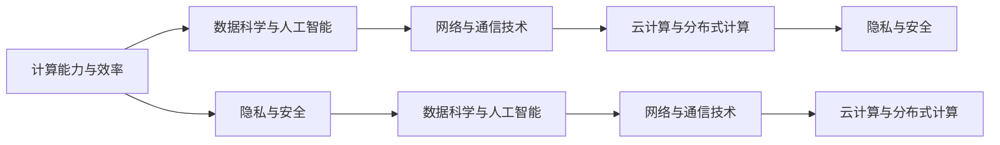

                 

# 创造更美好的世界：人类计算的终极目标

## 1. 背景介绍

### 1.1 问题由来
随着人类社会从工业时代迈向信息时代，计算技术已经成为推动社会进步、提高生活质量的关键力量。无论是医疗、教育、交通、能源，还是金融、科技、娱乐，计算技术的进步都带来了翻天覆地的变化。然而，随着计算能力的不断提升，我们面临的挑战也日益增多，从数据隐私保护到网络安全，从气候变化到经济危机，再到人类健康和福祉，计算技术正在塑造一个全新的未来世界。

本文旨在探讨计算技术如何被应用于解决人类面临的种种问题，创造更美好的世界。我们将从计算技术的发展历程、核心概念与原理、算法设计与应用、未来展望等多个方面，深入分析计算技术在推动社会进步中的作用与潜力。

### 1.2 问题核心关键点
人类计算的终极目标是通过计算技术解决人类社会面临的各种挑战，创造更美好的未来世界。这涉及到以下几个核心关键点：
1. **计算能力与效率**：计算能力的提升直接影响了人类社会的各个领域，从科学探索到商业创新，再到日常生活的便利化。
2. **数据科学与人工智能**：数据科学与人工智能技术的进步，使人类能够更好地理解和处理海量数据，提取知识，做出更加精准的决策。
3. **网络与通信技术**：高速、可靠的网络与通信技术，使信息传递更加迅速，连接更加紧密，协作更加高效。
4. **云计算与分布式计算**：云计算与分布式计算技术，使得资源共享更加方便，处理能力更加强大，计算成本更加可控。
5. **隐私与安全**：如何在使用计算技术的过程中保护个人隐私和数据安全，成为一个亟待解决的问题。

这些问题相互交织，共同构成了计算技术的核心挑战与机遇，也是本文的主要研究对象。

### 1.3 问题研究意义
研究人类计算的终极目标，对于推动计算技术在各个领域的应用，提升人类生活质量，具有重要意义：

1. **推动科学进步**：计算技术在生物学、天文学、物理学等领域的应用，加速了科学探索的步伐，推动了人类对未知世界的认识。
2. **优化社会管理**：计算技术在城市规划、交通管理、环境保护等方面的应用，提高了社会管理的效率与水平。
3. **促进经济发展**：计算技术在金融、电子商务、制造等领域的应用，促进了经济的创新与发展，提升了企业的竞争力。
4. **改善人类福祉**：计算技术在医疗、教育、文化等领域的应用，提高了公共服务的质量与水平，改善了人类的生活质量。
5. **保障网络安全**：计算技术在网络安全、反恐、情报分析等领域的应用，提升了国家安全与公共安全，维护了社会的稳定与和谐。

## 2. 核心概念与联系

### 2.1 核心概念概述

为了更好地理解计算技术在推动社会进步中的作用，本节将介绍几个核心概念：

- **计算能力与效率**：指计算系统在单位时间内处理数据和执行任务的能力。这是衡量一个国家或地区信息化水平的重要指标。
- **数据科学与人工智能**：指利用算法与模型从数据中提取知识、进行推理与决策的技术。人工智能是数据科学的重要分支，具有广泛的应用前景。
- **网络与通信技术**：指用于实现信息传输与通信的技术，包括有线与无线传输、互联网与物联网等。
- **云计算与分布式计算**：指通过互联网提供按需扩展的计算资源与服务的模式，使计算能力得以高效利用。
- **隐私与安全**：指在计算技术应用过程中，如何保护个人隐私和数据安全，防范网络攻击与数据泄露。

这些核心概念之间的关系可以通过以下Mermaid流程图来展示：



这个流程图展示了大计算核心概念之间的相互关系：

1. 计算能力与效率是基础，决定了数据科学与人工智能的规模与精度。
2. 网络与通信技术是载体，使得计算能力得以在更广范围内实现共享与利用。
3. 云计算与分布式计算是形式，使计算资源得以高效利用，减少资源浪费。
4. 隐私与安全是保障，防止计算过程中的数据泄露与滥用，保护个人与组织的合法权益。

这些概念共同构成了计算技术的核心框架，驱动着人类社会向更加智能化、信息化、安全化的方向发展。

## 3. 核心算法原理 & 具体操作步骤

### 3.1 算法原理概述

计算技术涉及多个领域的算法设计，包括但不限于以下几个方面：

- **科学计算算法**：用于解决复杂科学问题的高效算法，如分子动力学、量子计算等。
- **数据挖掘算法**：用于从大数据中提取有用信息的算法，如机器学习、深度学习等。
- **网络通信算法**：用于优化网络传输效率与质量的算法，如路由算法、网络协议等。
- **云计算与分布式计算算法**：用于优化资源分配与使用的算法，如调度算法、容错算法等。

这些算法共同构成了计算技术的基础，支撑着人类社会在各个领域的创新与发展。

### 3.2 算法步骤详解

本节将以机器学习算法为例，详细讲解其核心步骤。

**机器学习算法步骤**：

1. **数据准备**：收集并预处理数据，确保数据的质量与代表性。
2. **模型选择**：根据任务需求选择适合的模型，如线性回归、决策树、神经网络等。
3. **特征工程**：对数据进行特征提取与选择，提升模型的性能。
4. **模型训练**：使用训练数据集训练模型，优化模型的参数。
5. **模型评估**：使用测试数据集评估模型性能，判断模型是否过拟合或欠拟合。
6. **模型应用**：将训练好的模型应用于实际任务中，进行预测与决策。

**案例分析与讲解**：

以深度学习在图像识别任务中的应用为例，详细讲解其核心算法步骤：

1. **数据准备**：收集标注好的图像数据集，如MNIST、CIFAR等，并进行预处理，如归一化、数据增强等。
2. **模型选择**：选择适合的深度学习模型，如卷积神经网络(CNN)。
3. **特征工程**：对图像数据进行特征提取，如卷积层、池化层等，提取图像中的特征。
4. **模型训练**：使用训练集训练CNN模型，优化其参数，如权重、偏置等。
5. **模型评估**：使用测试集评估CNN模型的性能，如准确率、召回率等。
6. **模型应用**：将训练好的CNN模型应用于实际图像识别任务中，进行预测与决策。

### 3.3 算法优缺点

机器学习算法具有以下优点：

- **高效性**：能够处理大规模数据集，并自动发现数据中的模式与规律。
- **可解释性**：通过可视化的方式，可以理解模型的内部决策过程，提升模型的可解释性。
- **泛化能力强**：能够处理未知数据，并进行预测与决策，具有较强的泛化能力。

同时，机器学习算法也存在以下缺点：

- **数据依赖**：需要大量标注数据进行训练，数据质量对模型性能有很大影响。
- **模型复杂**：复杂的模型结构可能引入过多的参数，导致过拟合。
- **计算资源需求高**：深度学习模型需要大量的计算资源进行训练与优化。

### 3.4 算法应用领域

机器学习算法在多个领域得到了广泛应用，例如：

- **医疗**：用于疾病诊断、基因分析、药物研发等，提升医疗服务的精准性与效率。
- **金融**：用于风险评估、信用评分、投资预测等，提升金融决策的准确性与可靠性。
- **零售**：用于客户行为分析、库存管理、个性化推荐等，提升零售服务的个性化与体验。
- **制造业**：用于质量控制、生产调度、供应链管理等，提升制造业的效率与竞争力。
- **交通**：用于智能交通管理、路径规划、车辆调度等，提升交通系统的智能化与安全性。

除了以上领域，机器学习算法还在气象预报、能源管理、环境保护等众多领域发挥着重要作用。

## 4. 数学模型和公式 & 详细讲解 & 举例说明

### 4.1 数学模型构建

本节将使用数学语言对机器学习算法进行严格定义与描述。

以线性回归模型为例，其数学模型定义为：

$$y = \theta^T X + \beta$$

其中，$y$ 为预测值，$\theta$ 为模型参数，$X$ 为输入数据，$\beta$ 为截距。

### 4.2 公式推导过程

以梯度下降算法为例，其基本原理为：

$$\theta_{n+1} = \theta_n - \alpha \nabla L(\theta_n)$$

其中，$\alpha$ 为学习率，$L(\theta_n)$ 为损失函数，$\nabla L(\theta_n)$ 为损失函数对模型参数的梯度。

**案例分析与讲解**：

以梯度下降算法在训练线性回归模型中的应用为例，详细讲解其核心公式：

1. **损失函数**：常用的损失函数包括均方误差、交叉熵等。这里以均方误差为例，其公式为：

$$L(\theta) = \frac{1}{2m} \sum_{i=1}^m (y_i - \theta^T X_i)^2$$

其中，$m$ 为样本数量，$y_i$ 为真实值，$X_i$ 为输入向量。

2. **梯度计算**：梯度计算公式为：

$$\nabla L(\theta) = \frac{1}{m} \sum_{i=1}^m -(X_i \odot (y_i - \theta^T X_i))$$

其中，$\odot$ 表示逐元素相乘。

3. **参数更新**：梯度下降算法的基本公式为：

$$\theta_{n+1} = \theta_n - \alpha \nabla L(\theta_n)$$

其中，$\alpha$ 为学习率，通常设置为0.01或0.001等。

4. **迭代训练**：在训练过程中，不断更新模型参数，直到损失函数收敛或达到预设的迭代次数。

## 5. 项目实践：代码实例和详细解释说明

### 5.1 开发环境搭建

在进行机器学习算法实践前，我们需要准备好开发环境。以下是使用Python进行Scikit-learn开发的开发环境配置流程：

1. 安装Anaconda：从官网下载并安装Anaconda，用于创建独立的Python环境。

2. 创建并激活虚拟环境：
```bash
conda create -n sklearn-env python=3.8 
conda activate sklearn-env
```

3. 安装Scikit-learn：
```bash
conda install scikit-learn
```

4. 安装各类工具包：
```bash
pip install numpy pandas scikit-learn matplotlib tqdm jupyter notebook ipython
```

完成上述步骤后，即可在`sklearn-env`环境中开始项目实践。

### 5.2 源代码详细实现

这里以Scikit-learn库中的线性回归模型为例，给出详细的代码实现。

```python
from sklearn.linear_model import LinearRegression
from sklearn.datasets import load_boston
from sklearn.model_selection import train_test_split
from sklearn.metrics import mean_squared_error
import numpy as np

# 加载波士顿房价数据集
boston = load_boston()
X = boston.data
y = boston.target

# 将数据集划分为训练集与测试集
X_train, X_test, y_train, y_test = train_test_split(X, y, test_size=0.2, random_state=42)

# 创建线性回归模型
model = LinearRegression()

# 训练模型
model.fit(X_train, y_train)

# 预测并评估模型
y_pred = model.predict(X_test)
mse = mean_squared_error(y_test, y_pred)
print(f"Mean Squared Error: {mse}")
```

以上代码实现了线性回归模型的基本流程，包括数据加载、数据划分、模型训练、模型预测与评估。

### 5.3 代码解读与分析

让我们再详细解读一下关键代码的实现细节：

**数据加载与划分**：
- 使用Scikit-learn库中的`load_boston`函数加载波士顿房价数据集。
- 将数据集划分为训练集与测试集，使用`train_test_split`函数，设置测试集比例为20%，随机种子为42。

**模型创建与训练**：
- 使用Scikit-learn库中的`LinearRegression`类创建线性回归模型。
- 使用`fit`函数训练模型，将训练集数据作为输入，真实标签作为输出。

**模型预测与评估**：
- 使用`predict`函数对测试集进行预测，生成预测标签。
- 使用`mean_squared_error`函数计算预测值与真实值之间的均方误差。
- 最终输出均方误差，评估模型性能。

## 6. 实际应用场景

### 6.1 医疗诊断

机器学习算法在医疗诊断中的应用，可以显著提高诊断的准确性与效率。例如，通过分析患者的历史病历、检验报告等数据，训练机器学习模型，可以实现疾病的早期预测与诊断。

**实际案例**：
- 使用深度学习模型，对患者的CT影像进行分析，识别出早期肺癌病灶，提升早期筛查的准确性。
- 通过分析患者的基因数据，预测出患有遗传疾病的概率，提供个性化的预防建议。

### 6.2 金融风险管理

金融行业面临的挑战之一是风险管理。机器学习算法可以用于风险评估、信用评分、投资预测等，帮助金融机构更好地控制风险。

**实际案例**：
- 使用随机森林模型，分析客户的信用记录、收入水平、消费行为等数据，预测客户的还款能力与风险水平。
- 通过分析市场数据，预测股票价格走势，优化投资组合，提升投资回报率。

### 6.3 智能制造

智能制造是制造业未来的重要方向，机器学习算法可以用于优化生产流程、提高生产效率、降低生产成本等。

**实际案例**：
- 使用机器学习模型，对生产设备的运行状态进行分析，预测设备故障，提前进行维护，减少停机时间。
- 通过分析历史生产数据，优化生产调度，提升生产效率与产品质量。

### 6.4 智慧城市

智慧城市是未来城市发展的方向，机器学习算法可以用于城市管理、交通规划、环境保护等。

**实际案例**：
- 通过分析交通数据，预测交通拥堵情况，优化交通信号控制，提升城市交通效率。
- 使用机器学习模型，分析环境数据，预测天气变化，提升城市应急管理能力。

## 7. 工具和资源推荐

### 7.1 学习资源推荐

为了帮助开发者系统掌握机器学习算法的理论基础和实践技巧，这里推荐一些优质的学习资源：

1. 《机器学习实战》：由Peter Harrington所著，通过丰富的示例代码，介绍了机器学习算法的原理与实践。
2. 《深度学习》：由Ian Goodfellow、Yoshua Bengio、Aaron Courville所著，全面介绍了深度学习算法的理论基础与实现细节。
3. CS229《机器学习》课程：斯坦福大学开设的机器学习课程，内容全面，适合初学者与进阶者。
4. Coursera《机器学习》课程：由Andrew Ng主讲，适合希望系统学习机器学习算法的开发者。
5. Scikit-learn官方文档：Scikit-learn库的官方文档，提供了详尽的算法介绍与实践示例。

通过对这些资源的学习实践，相信你一定能够快速掌握机器学习算法的精髓，并用于解决实际的NLP问题。

### 7.2 开发工具推荐

高效的开发离不开优秀的工具支持。以下是几款用于机器学习算法开发的常用工具：

1. Python：作为机器学习算法的主要编程语言，Python有着丰富的第三方库支持，如Scikit-learn、TensorFlow、PyTorch等。
2. Jupyter Notebook：提供交互式的编程环境，方便开发者进行数据探索、算法实现与结果展示。
3. Scikit-learn：提供了多种机器学习算法的实现，包括分类、回归、聚类等，简单易用。
4. TensorFlow：由Google主导开发的深度学习框架，支持多种算法与模型，生产部署方便。
5. PyTorch：由Facebook开发，支持动态计算图，灵活方便，适合研究与实验。

合理利用这些工具，可以显著提升机器学习算法的开发效率，加快创新迭代的步伐。

### 7.3 相关论文推荐

机器学习算法的发展源于学界的持续研究。以下是几篇奠基性的相关论文，推荐阅读：

1. 《机器学习》：由Tom Mitchell所著，奠定了机器学习理论的基础，介绍了常见的机器学习算法与模型。
2. 《深度学习》：由Ian Goodfellow、Yoshua Bengio、Aaron Courville所著，全面介绍了深度学习算法的原理与实现细节。
3. 《随机森林》：由Tibshirani、Hastie、Frank等所著，介绍了一种常用的集成学习方法，展示了其在数据处理中的广泛应用。
4. 《支持向量机》：由Cortes、Vapnik等所著，介绍了一种常用的分类算法，展示了其在模式识别中的应用。
5. 《神经网络与深度学习》：由Goodfellow、Bengio、Courville所著，介绍了一种重要的神经网络模型，展示了其在图像识别中的应用。

这些论文代表了大计算算法的核心思想，通过学习这些前沿成果，可以帮助研究者把握学科前进方向，激发更多的创新灵感。

## 8. 总结：未来发展趋势与挑战

### 8.1 总结

本文对机器学习算法在推动人类计算能力提升中的应用进行了全面系统的介绍。首先阐述了计算能力提升的重要意义，明确了机器学习算法在各领域的应用前景。其次，从算法原理到具体操作步骤，详细讲解了机器学习算法的核心步骤，给出了代码实现与案例分析。同时，本文还广泛探讨了机器学习算法在医疗、金融、智能制造、智慧城市等多个领域的应用前景，展示了其巨大的潜力。此外，本文精选了机器学习算法的各类学习资源，力求为读者提供全方位的技术指引。

通过本文的系统梳理，可以看到，机器学习算法正在成为推动计算技术在各个领域应用的重要工具，极大地拓展了计算技术的应用边界，为社会进步带来了新的动力。未来，伴随机器学习算法的不断演进，计算技术必将在更多领域展现出新的生命力。

### 8.2 未来发展趋势

展望未来，机器学习算法将呈现以下几个发展趋势：

1. **算法复杂性增加**：随着计算能力的提升，更多复杂算法将被开发与应用，如深度强化学习、对抗生成网络等。
2. **数据质量与多样性提升**：随着数据采集技术的进步，数据的质量与多样性将不断提升，为机器学习提供更好的训练基础。
3. **模型可解释性加强**：随着对模型可解释性要求的提高，更多可解释性强的模型将被开发与应用，如决策树、规则学习等。
4. **跨领域应用广泛**：随着算法的普及与改进，更多领域将能够应用机器学习技术，如智能交通、智能制造、智慧城市等。
5. **联邦学习与隐私保护**：随着数据隐私要求的提高，联邦学习等隐私保护算法将成为机器学习的重要研究方向。
6. **边缘计算与实时性**：随着计算能力的下移，边缘计算与实时计算将成为机器学习的重要应用场景。

以上趋势凸显了机器学习算法的发展方向，这些方向的探索发展，必将进一步提升计算技术的应用范围与深度，为人类社会带来更多福祉。

### 8.3 面临的挑战

尽管机器学习算法已经取得了瞩目成就，但在迈向更加智能化、普适化应用的过程中，它仍面临着诸多挑战：

1. **数据依赖**：需要大量高质量的数据进行训练，数据获取与标注成本高，数据质量难以保证。
2. **模型复杂性**：复杂的模型结构可能引入过多的参数，导致过拟合。
3. **计算资源需求高**：深度学习模型需要大量的计算资源进行训练与优化。
4. **模型可解释性不足**：复杂的模型难以解释其内部决策过程，缺乏可解释性。
5. **隐私与安全**：在使用机器学习算法的过程中，如何保护个人隐私和数据安全，防范网络攻击与数据泄露。
6. **公平性与偏见**：机器学习模型可能引入数据偏见，导致不公平的决策。

这些挑战需要在算法设计、数据处理、模型训练、应用部署等多个环节进行全面优化，才能实现机器学习算法的普适化应用。

### 8.4 研究展望

面对机器学习算法所面临的种种挑战，未来的研究需要在以下几个方面寻求新的突破：

1. **数据获取与处理**：开发更多高效的数据获取与处理技术，提升数据的质量与多样性。
2. **算法优化与简化**：开发更多高效的算法模型，降低模型的复杂性，提升模型的可解释性。
3. **资源优化与利用**：开发更多优化资源使用的技术，提升计算效率，降低计算成本。
4. **隐私保护与公平性**：开发更多隐私保护与公平性算法，确保数据安全与决策公平。
5. **跨领域应用**：推动机器学习算法在更多领域的推广与实践，提升社会治理与公共服务的水平。

这些研究方向的探索，必将引领机器学习算法向更加智能化、普适化、安全化的方向发展，为计算技术在各个领域的应用提供坚实的理论基础与技术保障。

## 9. 附录：常见问题与解答

**Q1：机器学习算法是否适用于所有领域？**

A: 机器学习算法在大多数领域都能取得不错的效果，特别是对于数据量较大的任务。但对于一些特殊领域，如军事、国家安全等，由于数据隐私和安全限制，可能难以大规模应用。

**Q2：如何选择合适的机器学习算法？**

A: 选择合适的机器学习算法需要考虑以下几个因素：
1. 数据类型与规模：根据数据类型与规模选择合适的算法，如线性回归、随机森林、神经网络等。
2. 任务需求：根据任务需求选择合适的算法，如分类、回归、聚类等。
3. 模型复杂性：根据模型复杂性选择合适的算法，如简单模型、复杂模型等。
4. 可解释性要求：根据可解释性要求选择合适的算法，如决策树、规则学习等。

**Q3：机器学习算法在落地部署时需要注意哪些问题？**

A: 在将机器学习算法应用于实际问题时，需要注意以下几个问题：
1. 数据预处理：对数据进行清洗、归一化、特征提取等预处理。
2. 模型选择与优化：选择合适的模型，并进行参数调优，提升模型性能。
3. 模型部署与测试：将模型部署到实际环境中，进行测试与验证，确保模型稳定运行。
4. 数据更新与维护：定期更新模型，确保模型适应新的数据分布与任务需求。

**Q4：机器学习算法的未来发展方向是什么？**

A: 机器学习算法的未来发展方向包括：
1. 算法复杂性增加：开发更多复杂算法，如深度强化学习、对抗生成网络等。
2. 数据质量与多样性提升：提升数据的质量与多样性，提供更好的训练基础。
3. 模型可解释性加强：提升模型的可解释性，确保决策的透明性与公平性。
4. 跨领域应用广泛：推动算法在更多领域的推广与实践，提升社会治理与公共服务的水平。
5. 联邦学习与隐私保护：开发更多隐私保护与公平性算法，确保数据安全与决策公平。

这些研究方向将引领机器学习算法向更加智能化、普适化、安全化的方向发展，为计算技术在各个领域的应用提供坚实的理论基础与技术保障。

---

作者：禅与计算机程序设计艺术 / Zen and the Art of Computer Programming

