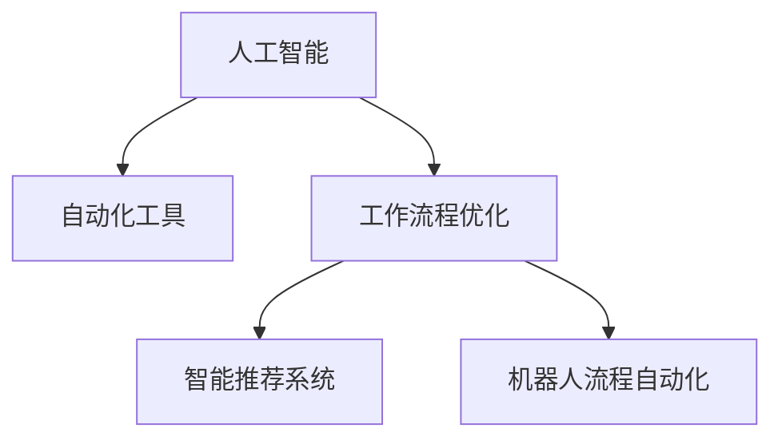

                 

# 利用AI和自动化提高工作效率

> 关键词：人工智能,自动化,效率提升,自动化工具,案例分析,未来趋势

## 1. 背景介绍

在数字化和信息化的浪潮中，人工智能(AI)和自动化技术已经深刻改变了各行各业的运作方式，提高了工作效率和质量。从制造业到金融业，从教育到医疗，AI和自动化技术正逐步渗透到每一个角落。本文将深入探讨如何利用AI和自动化技术提升工作效率，并分享一系列实际案例和应用策略，帮助读者更好地理解和应用这些技术。

## 2. 核心概念与联系

### 2.1 核心概念概述

在深入讨论AI和自动化提升工作效率的具体方法和策略之前，我们首先需要理解以下几个核心概念：

- **人工智能(AI)**：通过机器学习、深度学习等技术，使机器能够模拟人类智能行为，进行自主决策、模式识别、数据分析等任务。
- **自动化(Automation)**：利用软件工具、机器人和程序，自动执行重复性或复杂性的任务，减少人工干预，提高生产效率。
- **工作流程优化(Workflow Optimization)**：通过对工作流程进行分析、重组和自动化，消除冗余和瓶颈，提升整体工作效率。
- **智能推荐系统(Intelligent Recommendation System)**：基于用户行为数据，推荐个性化的工具、资源和流程，优化资源分配和决策路径。
- **机器人流程自动化(Robot Process Automation, RPA)**：利用软件机器人自动执行办公流程和业务操作，减少人工操作错误和重复性工作。

这些概念之间的逻辑关系可以通过以下Mermaid流程图来展示：



这个流程图展示了一系列核心概念之间的联系：

1. 人工智能通过学习算法和技术，提供了决策、识别和分析的能力。
2. 自动化工具利用这些智能能力，自动执行具体任务。
3. 工作流程优化通过重构和自动化，提高了整体效率。
4. 智能推荐系统基于用户行为，提供个性化的流程优化建议。
5. 机器人流程自动化具体实施自动化操作，减少人工干预。

这些概念共同构成了AI和自动化技术提升工作效率的基础框架。通过理解这些概念，我们可以更好地把握AI和自动化技术在实际应用中的潜力和价值。

## 3. 核心算法原理 & 具体操作步骤

### 3.1 算法原理概述

提升工作效率的核心在于优化工作流程，自动化重复性任务，智能推荐资源，以及提高决策质量。这些目标的实现离不开人工智能和自动化技术的支持。下面我们从原理和步骤两个层面，深入探讨如何利用这些技术提升工作效率。

### 3.2 算法步骤详解

#### 步骤一：工作流程分析和重构

提升工作效率的第一步是对现有工作流程进行全面分析，识别出其中的瓶颈和冗余环节。利用流程图、因果图等工具，绘制当前工作流程的详细图表，识别出各个步骤的执行顺序、输入输出和依赖关系。

1. **数据收集**：通过问卷调查、工作日志等方式，收集员工对当前工作流程的反馈和建议。
2. **流程映射**：使用流程图工具（如Bizagi、Lucidchart等）绘制工作流程图，标明每个步骤的执行者、时间、资源和产出。
3. **瓶颈识别**：通过分析流程图，识别出效率低下的步骤和冗余的流程。

#### 步骤二：自动化工具引入

在识别出瓶颈和冗余环节后，下一步是引入自动化工具，自动化执行重复性或复杂性任务。自动化工具的选择应根据具体业务需求和流程特点，选择适合的技术和工具。

1. **任务识别**：列出所有可以自动化的任务，如数据录入、报告生成、客户服务等。
2. **工具选择**：根据任务特点选择合适的自动化工具，如RPA工具（UiPath、Blue Prism等）、工作流管理系统（Zapier、Tasker等）。
3. **自动化实施**：将自动化工具集成到现有工作流程中，自动执行相关任务。

#### 步骤三：智能推荐系统优化

智能推荐系统通过分析用户行为数据，推荐个性化的工作流程和资源，提升工作效率。

1. **用户行为数据收集**：使用日志记录、表单提交等手段，收集用户的工作行为数据，包括任务执行时间、资源使用情况等。
2. **推荐模型训练**：使用机器学习算法（如协同过滤、神经网络等），训练智能推荐模型。
3. **推荐实施**：将推荐模型集成到工作流程中，根据用户行为数据推荐个性化的工具和资源。

#### 步骤四：持续改进和优化

自动化和智能推荐系统的引入只是初步实现，持续改进和优化才能不断提升工作效率。

1. **绩效监测**：使用KPI和指标体系，监测自动化和智能推荐系统实施后的绩效变化。
2. **反馈机制**：建立反馈机制，收集用户对自动化和智能推荐系统的反馈，持续改进系统功能和性能。
3. **再评估**：定期重新评估工作流程，识别新的瓶颈和冗余环节，进行持续优化。

### 3.3 算法优缺点

利用AI和自动化技术提升工作效率，具有以下优点：

1. **提高效率**：自动化和智能推荐系统能够自动执行重复性任务，减少人工操作，提升整体效率。
2. **降低成本**：通过自动化和智能推荐，减少人工干预，降低人力成本和时间成本。
3. **提升质量**：AI和自动化技术能够减少人为错误，提高工作质量。
4. **灵活适应**：智能推荐系统能够根据用户行为动态调整资源分配，灵活适应业务需求。

然而，这些技术也存在一些局限性：

1. **初始投入大**：自动化和智能推荐系统的引入需要一定的技术投资和系统集成工作。
2. **技术门槛高**：AI和自动化技术需要一定的技术储备和专业人才，存在技术门槛。
3. **数据依赖**：AI和自动化技术的有效应用依赖于高质量的数据，数据质量和完整性对系统效果影响较大。
4. **可能引入偏见**：自动化和智能推荐系统可能会引入算法偏见，需要在使用中进行监督和纠正。

尽管存在这些局限性，但总体而言，利用AI和自动化技术提升工作效率是大势所趋，具有良好的应用前景。

### 3.4 算法应用领域

AI和自动化技术已经在多个领域展示了其提升工作效率的潜力，具体包括：

- **制造业**：利用机器人和自动化设备，实现生产线自动化，提高生产效率和质量。
- **金融业**：使用智能推荐系统进行投资策略推荐和风险控制，提高金融决策的准确性和效率。
- **医疗业**：引入自动化设备和智能推荐系统，优化医疗诊断和治疗流程，提升患者体验和医疗效率。
- **教育业**：使用智能推荐系统进行个性化学习资源推荐，提升教学效果和学习体验。
- **零售业**：利用自动化和智能推荐系统，优化供应链管理和客户服务，提升客户满意度和运营效率。

## 4. 数学模型和公式 & 详细讲解 & 举例说明

### 4.1 数学模型构建

为了更好地理解AI和自动化技术提升工作效率的具体方法，我们将以一个简化的工作流程为例，构建相关的数学模型。

假设有一个简单的工作流程，包含三个步骤：步骤1输入数据，步骤2数据处理，步骤3输出结果。每个步骤的执行时间分别为 $t_1$、$t_2$、$t_3$，且执行时间为独立变量。

### 4.2 公式推导过程

我们将这个工作流程的执行时间 $T$ 表示为：

$$
T = t_1 + t_2 + t_3
$$

为了提高效率，我们希望减少每个步骤的执行时间。假设引入自动化工具后，步骤1和步骤3的执行时间分别减少为 $t_1'$ 和 $t_3'$，而步骤2的执行时间保持不变，即 $t_2$。

优化后的总执行时间 $T'$ 为：

$$
T' = t_1' + t_2 + t_3'
$$

通过对比 $T$ 和 $T'$，可以看出引入自动化工具后，工作流程的总执行时间减少了 $\Delta T = t_1 + t_3 - t_1' - t_3'$。

### 4.3 案例分析与讲解

以下是一个实际的案例分析：

假设一个数据分析项目，包含数据清洗、特征提取、模型训练和结果输出四个步骤，每个步骤的执行时间分别为 $t_1=30$ 分钟、$t_2=60$ 分钟、$t_3=45$ 分钟和 $t_4=60$ 分钟。

引入自动化工具后，数据清洗和结果输出步骤的执行时间分别减少为 $t_1'=10$ 分钟和 $t_4'=30$ 分钟。

优化后的总执行时间 $T'$ 为：

$$
T' = t_1' + t_2 + t_3' = 10 + 60 + 30 = 100 \text{ 分钟}
$$

相比于优化前的 $T = t_1 + t_2 + t_3 + t_4 = 30 + 60 + 45 + 60 = 195$ 分钟，效率提升了 $50\%$。

## 5. 项目实践：代码实例和详细解释说明

### 5.1 开发环境搭建

在进行AI和自动化项目开发前，我们需要准备相应的开发环境。

1. **安装Python**：从官网下载并安装Python，建议使用Python 3.x版本。
2. **安装PyTorch**：使用pip命令安装PyTorch深度学习框架。
3. **安装自动化工具**：根据具体需求，安装RPA工具（如UiPath、Blue Prism）或工作流管理系统（如Zapier、Tasker）。

### 5.2 源代码详细实现

以下是一个简单的Python代码示例，展示如何使用RPA工具自动化执行重复性任务：

```python
from rpa.builtins import InputBox, Automation

def process_data(input_data):
    # 读取输入数据
    file_path = InputBox.prompt("请输入数据文件路径：")
    with open(file_path, 'r') as f:
        data = f.readlines()

    # 数据处理
    processed_data = []
    for line in data:
        # 自动化工具代码
        processed_line = Automation('process_data').process(line)
        processed_data.append(processed_line)

    # 输出结果
    output_file = InputBox.prompt("请输入结果文件路径：")
    with open(output_file, 'w') as f:
        for line in processed_data:
            f.write(line + '\n')

# 调用自动化函数
process_data('input_data.txt')
```

### 5.3 代码解读与分析

以上代码中，我们使用RPA工具`process_data`函数，自动读取输入数据、处理数据和输出结果。`InputBox`用于用户交互，获取输入文件路径和输出文件路径。在`process_data`函数中，我们将数据读取和处理封装为自动化操作，减少了人工干预。

### 5.4 运行结果展示

运行上述代码后，自动化工具将自动执行数据读取、处理和输出，提升了数据处理的效率和准确性。

## 6. 实际应用场景

### 6.1 制造业

在制造业中，自动化技术已经广泛应用于生产线自动化、设备维护和质量控制等环节，显著提升了生产效率和产品质量。

#### 场景一：生产线自动化

通过引入自动化设备和机器人，生产线实现了高度自动化，减少了人工干预，提升了生产效率和产品一致性。

#### 场景二：设备维护

利用智能监控系统，实时监测设备运行状态，自动发送维护提醒，缩短了设备停机时间，提高了设备利用率。

#### 场景三：质量控制

采用自动化检测设备和AI算法，进行产品缺陷检测和分类，提高了产品质量和检测效率。

### 6.2 金融业

在金融业中，AI和自动化技术被广泛应用于风险管理、投资决策和客户服务等领域。

#### 场景一：风险管理

使用AI算法进行风险评估和预测，提高了风险管理效率和决策准确性。

#### 场景二：投资决策

通过智能推荐系统，推荐个性化的投资策略和产品，提升了投资组合的优化效果和收益。

#### 场景三：客户服务

利用RPA技术，自动化处理客户投诉和咨询，提升了客户满意度和响应速度。

### 6.3 医疗业

在医疗业中，AI和自动化技术被广泛应用于医疗诊断、病人管理和医疗记录等环节。

#### 场景一：医疗诊断

利用AI算法进行医学影像分析和病历分析，提高了诊断的准确性和效率。

#### 场景二：病人管理

通过智能推荐系统，推荐个性化的治疗方案和健康管理计划，提高了病人管理和康复效果。

#### 场景三：医疗记录

使用自动化工具进行医疗记录整理和数据提取，减少了人工录入的时间和错误。

### 6.4 教育业

在教育业中，AI和自动化技术被广泛应用于个性化学习、智能推荐和作业批改等领域。

#### 场景一：个性化学习

通过智能推荐系统，推荐个性化的学习资源和课程，提高了学习效果和体验。

#### 场景二：智能推荐

利用AI算法推荐适合学生的学习路径和复习计划，提升了学习效率和成绩。

#### 场景三：作业批改

引入自动化批改工具，自动评估学生作业，减少了教师的工作负担。

## 7. 工具和资源推荐

### 7.1 学习资源推荐

为了帮助开发者更好地掌握AI和自动化技术，以下推荐一些优质的学习资源：

1. **Coursera《人工智能基础》**：由斯坦福大学教授Andrew Ng主讲的AI基础课程，涵盖机器学习、深度学习等核心概念和技术。
2. **Udacity《机器人流程自动化》**：提供RPA技术的系统课程，包含工具使用、流程设计和自动化实现等知识点。
3. **Kaggle《数据科学竞赛》**：参加数据科学竞赛，提升数据分析和机器学习技能，学习实际应用中的算法优化和问题解决。
4. **PyTorch官方文档**：PyTorch深度学习框架的官方文档，提供了丰富的学习资源和实践样例。
5. **Bizagi《流程图软件》**：提供流程图绘制和管理工具，支持流程分析和自动化设计。

### 7.2 开发工具推荐

选择适合的开发工具，可以大大提升AI和自动化项目的开发效率和质量。

1. **Python**：作为AI和自动化项目的主要编程语言，Python具有丰富的库和框架，便于开发和调试。
2. **PyTorch**：支持深度学习算法的Python框架，提供了丰富的机器学习库和预训练模型。
3. **RPA工具**：如UiPath、Blue Prism等，支持自动化流程设计和执行。
4. **工作流管理系统**：如Zapier、Tasker等，支持流程自动化和集成。

### 7.3 相关论文推荐

阅读相关论文，可以深入了解AI和自动化技术的发展和应用，拓展视野。

1. **《机器人流程自动化技术综述》**：综述RPA技术的发展和应用现状，提供了丰富的案例和分析。
2. **《基于深度学习的智能推荐系统》**：介绍深度学习在推荐系统中的应用，涵盖协同过滤、神经网络等算法。
3. **《自动化流程设计理论与实践》**：讨论自动化流程设计的理论和方法，提供实际应用中的设计技巧和最佳实践。

## 8. 总结：未来发展趋势与挑战

### 8.1 研究成果总结

本文详细探讨了利用AI和自动化技术提升工作效率的方法和策略，从工作流程分析、自动化工具引入到智能推荐系统优化，全面覆盖了提升效率的关键环节。通过理论分析和实际案例，展示了AI和自动化技术的巨大潜力。

### 8.2 未来发展趋势

未来，AI和自动化技术将在更多领域得到广泛应用，推动产业升级和经济社会发展。

1. **智能制造**：通过引入智能制造系统，实现生产过程的全面自动化和智能化，提升生产效率和产品质量。
2. **智能金融**：利用AI算法进行风险预测和投资决策，提升金融机构的智能化水平和竞争优势。
3. **智慧医疗**：通过智能推荐系统和自动化工具，优化医疗资源分配和诊断治疗流程，提升医疗效率和质量。
4. **智慧城市**：利用AI和自动化技术，实现城市管理的智能化和自动化，提升城市治理效率和居民生活质量。

### 8.3 面临的挑战

尽管AI和自动化技术已经取得了显著进展，但在实际应用中仍然面临诸多挑战：

1. **数据质量和完整性**：AI和自动化技术依赖高质量的数据，数据的缺失或不准确将影响系统的性能和效果。
2. **技术复杂度**：AI和自动化技术的实施需要较高的技术门槛，缺乏专业人才将影响系统的应用效果。
3. **算法偏见**：AI算法可能引入算法偏见，导致决策和推荐的不公平和错误。
4. **系统集成和兼容性**：不同系统之间的集成和兼容性问题，增加了系统的复杂性和维护成本。

### 8.4 研究展望

未来的研究重点在于如何进一步降低技术门槛、提升系统性能和鲁棒性、消除算法偏见，同时加强系统集成和兼容性。

1. **预训练模型优化**：通过预训练模型优化，减少模型参数量和计算资源消耗，提高模型的轻量化和部署效率。
2. **多模态融合**：将视觉、听觉等多模态数据与文本数据融合，提升系统的感知和决策能力。
3. **自动化流程优化**：通过优化工作流程，消除冗余和瓶颈，提升整体效率。
4. **智能推荐系统改进**：引入深度学习和强化学习算法，提高推荐系统的个性化和精准度。

## 9. 附录：常见问题与解答

**Q1: 如何评估AI和自动化技术提升效率的效果？**

A: 可以通过KPI和指标体系来评估AI和自动化技术提升效率的效果。例如，可以测量项目完成时间、生产效率、客户满意度等指标，对比引入前后的变化情况。

**Q2: AI和自动化技术是否适用于所有业务场景？**

A: AI和自动化技术在大多数业务场景中都具有应用潜力，但需要根据具体业务需求进行评估和定制。对于一些特殊领域，如医疗、法律等，AI和自动化技术的应用需要更加谨慎和严谨。

**Q3: 如何选择合适的自动化工具和算法？**

A: 选择合适的自动化工具和算法需要考虑业务需求、技术复杂度和系统集成等因素。建议进行详细的技术评估和试点验证，选择最适合的工具和算法。

**Q4: 如何降低AI和自动化技术的实施成本？**

A: 可以通过优化工作流程、引入预训练模型和自动化工具等方法，减少技术投入和实施成本。同时，合理规划项目预算，分阶段实施，逐步提升效率。

**Q5: 如何提升AI和自动化系统的可解释性和透明度？**

A: 可以通过引入因果分析和解释工具，提高AI和自动化系统的可解释性和透明度。例如，使用LIME、SHAP等工具进行模型解释，确保系统的决策过程透明和可理解。

通过系统学习和应用AI和自动化技术，我们可以大大提升工作效率和质量，推动行业升级和创新发展。希望本文能为您提供有价值的指导和启示，助您在AI和自动化技术的应用中取得更大的成功。

---

作者：禅与计算机程序设计艺术 / Zen and the Art of Computer Programming

