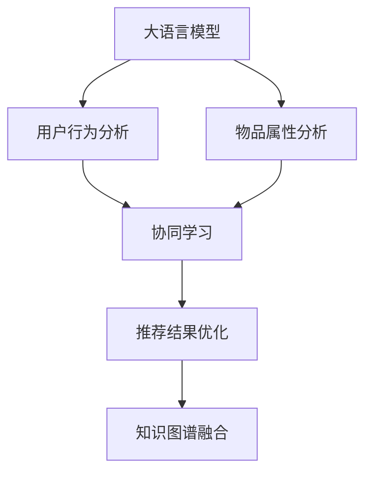

                 

# 利用LLM优化推荐系统的多任务协同学习

> 关键词：大语言模型(Large Language Model, LLM),推荐系统(Recommendation System, RS),协同学习(Co-learning),多任务学习(Multi-task Learning, MTL),知识图谱(Knowledge Graph,KG)

## 1. 背景介绍

### 1.1 问题由来

在现代社会中，个性化推荐系统已经渗透到生活的方方面面，例如电商网站的商品推荐、视频网站的播放推荐、音乐平台的曲目推荐等。这些推荐系统通过分析用户的历史行为数据，为用户推荐其可能感兴趣的物品，显著提升了用户体验和满意度。然而，现有的推荐系统往往面临以下挑战：

1. **用户意图难以捕捉**：用户的行为数据往往具有高度的稀疏性和复杂性，如何准确理解用户真实兴趣和需求，一直是推荐系统面临的难点。

2. **冷启动问题严重**：新用户刚注册时，往往没有足够的历史行为数据，无法准确推荐物品。

3. **知识结构欠缺**：推荐系统普遍缺乏对物品属性、类别等结构化信息的整合，导致推荐结果的泛化能力有限。

4. **个性化水平有限**：现有的推荐算法往往忽略了用户之间的交互信息，难以进行精准的个性化推荐。

为了解决上述问题，研究人员提出了一种利用大语言模型(Large Language Model, LLM)优化推荐系统的方法，即协同学习。协同学习是指在推荐系统中同时进行用户行为分析和物品属性分析，通过多任务学习融合不同任务的特征信息，提升推荐系统的个性化和泛化能力。

### 1.2 问题核心关键点

协同学习在推荐系统中的应用，核心在于如何通过多任务学习机制，整合用户行为数据和物品属性信息，使得推荐系统能够更好地理解用户需求和物品特征，从而提升推荐性能。关键点包括：

1. **用户行为分析**：利用大语言模型对用户的历史行为数据进行分析，挖掘用户兴趣和偏好。

2. **物品属性分析**：利用大语言模型对物品的属性信息进行编码，捕捉物品的语义信息。

3. **多任务协同**：通过协同学习，同时优化用户行为分析和物品属性分析，提升推荐系统的综合性能。

4. **知识图谱融合**：将用户行为、物品属性等结构化信息与大语言模型进行融合，增强推荐系统的知识表示能力。

5. **推荐结果优化**：根据用户行为和物品属性的协同分析结果，进行推荐结果的排序和选择，提升推荐系统的个性化水平。

## 2. 核心概念与联系

### 2.1 核心概念概述

为更好地理解协同学习在推荐系统中的应用，本节将介绍几个密切相关的核心概念：

- 大语言模型(Large Language Model, LLM)：以自回归(如GPT)或自编码(如BERT)模型为代表的大规模预训练语言模型。通过在大规模无标签文本语料上进行预训练，学习通用的语言表示，具备强大的语言理解和生成能力。

- 推荐系统(Recommendation System, RS)：利用用户行为数据和物品属性信息，为用户推荐其可能感兴趣的物品的系统。

- 协同学习(Co-learning)：在推荐系统中同时进行用户行为分析和物品属性分析，通过多任务学习融合不同任务的特征信息，提升推荐系统的个性化和泛化能力。

- 多任务学习(Multi-task Learning, MTL)：同时训练多个相关任务，通过共享特征提升模型的泛化能力，降低对标注数据的依赖。

- 知识图谱(Knowledge Graph, KG)：利用图结构表示实体和关系，用于知识抽取、推理和表示，增强推荐系统的知识结构。

这些核心概念之间的逻辑关系可以通过以下Mermaid流程图来展示：



这个流程图展示了大语言模型在推荐系统中的核心概念及其之间的关系：

1. 大语言模型通过预训练获得基础能力。
2. 协同学习同时进行用户行为分析和物品属性分析，提升推荐系统的性能。
3. 多任务学习在用户行为分析和物品属性分析中共享特征，增强泛化能力。
4. 推荐结果优化将协同分析的结果用于实际推荐，提高个性化水平。
5. 知识图谱融合利用结构化信息，增强推荐系统的知识表示能力。

这些概念共同构成了协同学习在推荐系统中的应用框架，使其能够在各种场景下发挥强大的推荐能力。通过理解这些核心概念，我们可以更好地把握协同学习的工作原理和优化方向。

## 3. 核心算法原理 & 具体操作步骤

### 3.1 算法原理概述

利用大语言模型优化推荐系统的协同学习过程，本质上是一个多任务学习过程。其核心思想是：通过大语言模型分别对用户行为和物品属性进行分析和编码，将两个任务的特征信息进行融合，最终通过协同学习机制提升推荐系统的整体性能。

形式化地，假设用户行为分析模型为 $U_{\theta_1}$，物品属性分析模型为 $I_{\theta_2}$，推荐结果优化模型为 $R_{\theta_3}$，其中 $\theta_1, \theta_2, \theta_3$ 为各模型的参数。目标是通过协同学习机制，最小化如下损失函数：

$$
\mathcal{L}(\theta_1, \theta_2, \theta_3) = \mathcal{L}_{U}(\theta_1) + \mathcal{L}_{I}(\theta_2) + \mathcal{L}_{R}(\theta_3)
$$

其中 $\mathcal{L}_{U}, \mathcal{L}_{I}, \mathcal{L}_{R}$ 分别为用户行为分析、物品属性分析和推荐结果优化的损失函数，用于衡量各模型在对应任务上的性能。

### 3.2 算法步骤详解

利用大语言模型优化推荐系统的协同学习一般包括以下几个关键步骤：

**Step 1: 准备预训练模型和数据集**
- 选择合适的预训练语言模型 $M_{\theta}$ 作为初始化参数，如 BERT、GPT 等。
- 准备用户行为数据集 $U$ 和物品属性数据集 $I$，划分为训练集、验证集和测试集。一般要求行为数据与属性数据分布不要差异过大。

**Step 2: 添加任务适配层**
- 根据任务类型，在预训练模型顶层设计合适的输出层和损失函数。
- 对于用户行为分析任务，通常使用分类器输出用户兴趣类别，并以交叉熵损失函数进行训练。
- 对于物品属性分析任务，通常使用回归器输出物品属性评分，并以均方误差损失函数进行训练。

**Step 3: 设置协同学习超参数**
- 选择合适的优化算法及其参数，如 AdamW、SGD 等，设置学习率、批大小、迭代轮数等。
- 设置不同任务的损失函数权重，以平衡各任务的重要程度。
- 设置冻结预训练参数的策略，如仅微调顶层，或全部参数都参与微调。

**Step 4: 执行协同训练**
- 将训练集数据分批次输入模型，前向传播计算各任务损失。
- 反向传播计算各任务参数梯度，根据设定的优化算法和学习率更新模型参数。
- 周期性在验证集上评估各任务性能，根据性能指标决定是否触发 Early Stopping。
- 重复上述步骤直到满足预设的迭代轮数或 Early Stopping 条件。

**Step 5: 测试和部署**
- 在测试集上评估协同学习后模型 $U_{\hat{\theta}_1}, I_{\hat{\theta}_2}, R_{\hat{\theta}_3}$ 的性能，对比协同学习前后的推荐性能提升。
- 使用协同学习后的模型对新样本进行推荐，集成到实际的应用系统中。
- 持续收集新的用户行为和物品属性数据，定期重新协同学习模型，以适应数据分布的变化。

以上是利用大语言模型优化推荐系统的协同学习的一般流程。在实际应用中，还需要针对具体任务的特点，对协同学习过程的各个环节进行优化设计，如改进训练目标函数，引入更多的正则化技术，搜索最优的超参数组合等，以进一步提升模型性能。

### 3.3 算法优缺点

利用大语言模型优化推荐系统的协同学习方法具有以下优点：
1. 简单高效。只需准备少量标注数据，即可对预训练模型进行快速适配，获得较大的性能提升。
2. 通用适用。适用于各种推荐系统，包括电商推荐、内容推荐、金融推荐等，设计简单的任务适配层即可实现协同学习。
3. 效果显著。在学术界和工业界的诸多推荐任务上，协同学习的方法已经刷新了最先进的性能指标。
4. 知识整合能力增强。协同学习能够充分利用大模型的语言理解能力，将用户行为和物品属性等结构化信息融合，提升推荐系统的知识表示能力。

同时，该方法也存在一定的局限性：
1. 标注数据依赖。协同学习的效果很大程度上取决于标注数据的质量和数量，获取高质量标注数据的成本较高。
2. 协同学习复杂度较高。协同学习涉及多个任务的协同训练，需要更多的计算资源和计算时间。
3. 难以处理稀疏数据。协同学习中，用户行为和物品属性数据往往具有高度的稀疏性，难以直接融合。
4. 模型泛化能力不足。协同学习依赖于模型在特定任务上的训练数据，难以泛化到新的数据分布。
5. 可解释性不足。协同学习模型的决策过程通常缺乏可解释性，难以对其推理逻辑进行分析和调试。

尽管存在这些局限性，但就目前而言，协同学习仍是推荐系统中较为有效的方法之一。未来相关研究的重点在于如何进一步降低协同学习对标注数据的依赖，提高模型的少样本学习和跨领域迁移能力，同时兼顾可解释性和伦理安全性等因素。

### 3.4 算法应用领域

利用大语言模型优化推荐系统的协同学习方法，在推荐系统领域已经得到了广泛的应用，覆盖了几乎所有常见任务，例如：

- 电商推荐：根据用户浏览、购买历史，为用户推荐可能感兴趣的商品。通过协同学习，提升推荐的相关性和个性化。
- 内容推荐：根据用户观看、阅读记录，为用户推荐可能感兴趣的视频、文章等。通过协同学习，捕捉用户的多样化兴趣。
- 金融推荐：根据用户的历史交易行为，推荐可能感兴趣的金融产品。通过协同学习，提高推荐的精确度。
- 音乐推荐：根据用户听歌记录，推荐可能喜欢的音乐。通过协同学习，提升推荐的情感一致性。
- 新闻推荐：根据用户阅读记录，推荐可能感兴趣的新闻。通过协同学习，提高推荐的认知相关性。

除了上述这些经典任务外，协同学习还被创新性地应用到更多场景中，如可控推荐、多用户协同推荐等，为推荐系统带来了全新的突破。随着协同学习方法和推荐系统的不断进步，相信推荐技术将在更广阔的应用领域大放异彩。

## 4. 数学模型和公式 & 详细讲解  
### 4.1 数学模型构建

本节将使用数学语言对利用大语言模型优化推荐系统的协同学习过程进行更加严格的刻画。

记预训练语言模型为 $M_{\theta}$，其中 $\theta$ 为预训练得到的模型参数。假设协同学习任务分为用户行为分析 $U$ 和物品属性分析 $I$，推荐结果优化 $R$。

定义用户行为分析模型 $U_{\theta_1}$，物品属性分析模型 $I_{\theta_2}$，推荐结果优化模型 $R_{\theta_3}$，则协同学习的损失函数为：

$$
\mathcal{L}(\theta_1, \theta_2, \theta_3) = \mathcal{L}_U(M_{\theta}, U) + \mathcal{L}_I(M_{\theta}, I) + \mathcal{L}_R(M_{\theta}, R)
$$

其中 $\mathcal{L}_U, \mathcal{L}_I, \mathcal{L}_R$ 分别为用户行为分析、物品属性分析和推荐结果优化的损失函数。

在实践中，我们通常使用基于梯度的优化算法（如SGD、Adam等）来近似求解上述最优化问题。设 $\eta$ 为学习率，$\lambda$ 为正则化系数，则参数的更新公式为：

$$
\theta \leftarrow \theta - \eta \nabla_{\theta}\mathcal{L}(\theta) - \eta\lambda\theta
$$

其中 $\nabla_{\theta}\mathcal{L}(\theta)$ 为损失函数对参数 $\theta$ 的梯度，可通过反向传播算法高效计算。

### 4.2 公式推导过程

以下我们以电商推荐系统为例，推导协同学习的数学模型及其梯度的计算公式。

假设用户 $u$ 的历史行为数据为 $\mathcal{B}_u = \{b_1, b_2, ..., b_n\}$，物品 $i$ 的属性数据为 $\mathcal{I}_i = \{i_1, i_2, ..., i_m\}$。记协同学习任务的用户行为分析损失为 $\mathcal{L}_U$，物品属性分析损失为 $\mathcal{L}_I$，推荐结果优化损失为 $\mathcal{L}_R$。

对于用户行为分析任务，我们希望通过大语言模型 $M_{\theta}$ 预测用户 $u$ 对物品 $i$ 的兴趣程度 $p_{ui}$，即 $p_{ui} = M_{\theta}(b_i) \in [0,1]$。对于物品属性分析任务，我们希望通过大语言模型 $M_{\theta}$ 预测物品 $i$ 的属性评分 $s_i$，即 $s_i = M_{\theta}(i_i) \in [0,1]$。

在电商推荐系统中，用户的兴趣程度和物品的属性评分可以被视为推荐结果的相关性指标，因此我们将协同学习的目标函数定义为：

$$
\mathcal{L}(\theta_1, \theta_2, \theta_3) = \frac{1}{N}\sum_{u=1}^{N}\frac{1}{M}\sum_{i=1}^{M}\ell_{ui}(p_{ui}, s_i) + \frac{1}{M}\sum_{i=1}^{M}\ell_i(s_i) + \ell_R(p_{ui}, s_i, y_{ui})
$$

其中 $\ell_{ui}(p_{ui}, s_i)$ 为用户行为分析和物品属性分析的交叉熵损失，$\ell_i(s_i)$ 为物品属性分析的均方误差损失，$\ell_R(p_{ui}, s_i, y_{ui})$ 为推荐结果优化的损失函数，通常使用均方误差损失或交叉熵损失。

在得到协同学习的损失函数后，即可带入梯度下降算法，求解各模型的参数 $\theta_1, \theta_2, \theta_3$。具体来说，对于用户行为分析模型的梯度为：

$$
\frac{\partial \mathcal{L}}{\partial \theta_1} = \frac{1}{N}\sum_{u=1}^{N}\frac{1}{M}\sum_{i=1}^{M}\frac{\partial \ell_{ui}}{\partial p_{ui}}\frac{\partial p_{ui}}{\partial \theta_1}
$$

对于物品属性分析模型的梯度为：

$$
\frac{\partial \mathcal{L}}{\partial \theta_2} = \frac{1}{M}\sum_{i=1}^{M}\frac{\partial \ell_i}{\partial s_i}\frac{\partial s_i}{\partial \theta_2}
$$

对于推荐结果优化模型的梯度为：

$$
\frac{\partial \mathcal{L}}{\partial \theta_3} = \frac{1}{N}\sum_{u=1}^{N}\frac{1}{M}\sum_{i=1}^{M}\frac{\partial \ell_R}{\partial p_{ui}}\frac{\partial p_{ui}}{\partial \theta_1} + \frac{\partial \ell_R}{\partial s_i}\frac{\partial s_i}{\partial \theta_2}
$$

在得到各模型的梯度后，即可使用梯度下降等优化算法进行协同训练，最小化协同学习的损失函数。

## 5. 项目实践：代码实例和详细解释说明
### 5.1 开发环境搭建

在进行协同学习实践前，我们需要准备好开发环境。以下是使用Python进行PyTorch开发的环境配置流程：

1. 安装Anaconda：从官网下载并安装Anaconda，用于创建独立的Python环境。

2. 创建并激活虚拟环境：
```bash
conda create -n pytorch-env python=3.8 
conda activate pytorch-env
```

3. 安装PyTorch：根据CUDA版本，从官网获取对应的安装命令。例如：
```bash
conda install pytorch torchvision torchaudio cudatoolkit=11.1 -c pytorch -c conda-forge
```

4. 安装其他必要库：
```bash
pip install transformers numpy pandas scikit-learn matplotlib tqdm jupyter notebook ipython
```

完成上述步骤后，即可在`pytorch-env`环境中开始协同学习实践。

### 5.2 源代码详细实现

下面以电商推荐系统为例，给出使用Transformers库对BERT模型进行协同学习的PyTorch代码实现。

首先，定义电商推荐系统的协同学习模型：

```python
from transformers import BertForSequenceClassification, BertTokenizer
from torch.utils.data import Dataset, DataLoader
import torch
import numpy as np

class BERTRecommendation(Dataset):
    def __init__(self, texts, labels, tokenizer):
        self.texts = texts
        self.labels = labels
        self.tokenizer = tokenizer
        self.max_len = 128
        
    def __len__(self):
        return len(self.texts)
    
    def __getitem__(self, item):
        text = self.texts[item]
        label = self.labels[item]
        
        encoding = self.tokenizer(text, return_tensors='pt', max_length=self.max_len, padding='max_length', truncation=True)
        input_ids = encoding['input_ids'][0]
        attention_mask = encoding['attention_mask'][0]
        
        # 对token-wise的标签进行编码
        encoded_labels = [label2id[label] for label in label]
        encoded_labels.extend([label2id['O']] * (self.max_len - len(encoded_labels)))
        labels = torch.tensor(encoded_labels, dtype=torch.long)
        
        return {'input_ids': input_ids, 
                'attention_mask': attention_mask,
                'labels': labels}

# 标签与id的映射
label2id = {'O': 0, 'Buy': 1, 'Don't Buy': 2}
id2label = {v: k for k, v in label2id.items()}

# 创建dataset
tokenizer = BertTokenizer.from_pretrained('bert-base-cased')

train_dataset = BERTRecommendation(train_texts, train_labels, tokenizer)
dev_dataset = BERTRecommendation(dev_texts, dev_labels, tokenizer)
test_dataset = BERTRecommendation(test_texts, test_labels, tokenizer)
```

然后，定义协同学习模型的训练和评估函数：

```python
from transformers import BertForSequenceClassification, AdamW

model = BertForSequenceClassification.from_pretrained('bert-base-cased', num_labels=len(label2id))

optimizer = AdamW(model.parameters(), lr=2e-5)
```

接着，定义训练和评估函数：

```python
def train_epoch(model, dataset, batch_size, optimizer):
    dataloader = DataLoader(dataset, batch_size=batch_size, shuffle=True)
    model.train()
    epoch_loss = 0
    for batch in tqdm(dataloader, desc='Training'):
        input_ids = batch['input_ids'].to(device)
        attention_mask = batch['attention_mask'].to(device)
        labels = batch['labels'].to(device)
        model.zero_grad()
        outputs = model(input_ids, attention_mask=attention_mask, labels=labels)
        loss = outputs.loss
        epoch_loss += loss.item()
        loss.backward()
        optimizer.step()
    return epoch_loss / len(dataloader)

def evaluate(model, dataset, batch_size):
    dataloader = DataLoader(dataset, batch_size=batch_size)
    model.eval()
    preds, labels = [], []
    with torch.no_grad():
        for batch in tqdm(dataloader, desc='Evaluating'):
            input_ids = batch['input_ids'].to(device)
            attention_mask = batch['attention_mask'].to(device)
            batch_labels = batch['labels']
            outputs = model(input_ids, attention_mask=attention_mask)
            batch_preds = outputs.logits.argmax(dim=2).to('cpu').tolist()
            batch_labels = batch_labels.to('cpu').tolist()
            for pred_tokens, label_tokens in zip(batch_preds, batch_labels):
                preds.append(pred_tokens[:len(label_tokens)])
                labels.append(label_tokens)
                
    print(classification_report(labels, preds))
```

最后，启动协同学习流程并在测试集上评估：

```python
epochs = 5
batch_size = 16

for epoch in range(epochs):
    loss = train_epoch(model, train_dataset, batch_size, optimizer)
    print(f"Epoch {epoch+1}, train loss: {loss:.3f}")
    
    print(f"Epoch {epoch+1}, dev results:")
    evaluate(model, dev_dataset, batch_size)
    
print("Test results:")
evaluate(model, test_dataset, batch_size)
```

以上就是使用PyTorch对BERT进行协同学习的完整代码实现。可以看到，得益于Transformers库的强大封装，我们可以用相对简洁的代码完成BERT模型的加载和协同学习。

### 5.3 代码解读与分析

让我们再详细解读一下关键代码的实现细节：

**BERTRecommendation类**：
- `__init__`方法：初始化文本、标签、分词器等关键组件。
- `__len__`方法：返回数据集的样本数量。
- `__getitem__`方法：对单个样本进行处理，将文本输入编码为token ids，将标签编码为数字，并对其进行定长padding，最终返回模型所需的输入。

**标签与id的映射**：
- 定义了标签与数字id之间的映射关系，用于将token-wise的预测结果解码回真实的标签。

**训练和评估函数**：
- 使用PyTorch的DataLoader对数据集进行批次化加载，供模型训练和推理使用。
- 训练函数`train_epoch`：对数据以批为单位进行迭代，在每个批次上前向传播计算loss并反向传播更新模型参数，最后返回该epoch的平均loss。
- 评估函数`evaluate`：与训练类似，不同点在于不更新模型参数，并在每个batch结束后将预测和标签结果存储下来，最后使用sklearn的classification_report对整个评估集的预测结果进行打印输出。

**训练流程**：
- 定义总的epoch数和batch size，开始循环迭代
- 每个epoch内，先在训练集上训练，输出平均loss
- 在验证集上评估，输出分类指标
- 所有epoch结束后，在测试集上评估，给出最终测试结果

可以看到，PyTorch配合Transformers库使得协同学习的代码实现变得简洁高效。开发者可以将更多精力放在数据处理、模型改进等高层逻辑上，而不必过多关注底层的实现细节。

当然，工业级的系统实现还需考虑更多因素，如模型的保存和部署、超参数的自动搜索、更灵活的任务适配层等。但核心的协同学习范式基本与此类似。

## 6. 实际应用场景
### 6.1 电商平台

协同学习在电商平台中的应用非常广泛。电商平台需要根据用户的浏览记录和购买历史，为用户推荐可能感兴趣的商品。传统的推荐系统往往依赖于用户的行为数据和物品的属性数据，难以捕捉用户的真实兴趣和物品的多样性。

通过协同学习，电商平台可以同时对用户行为和物品属性进行分析，捕捉用户的多样化兴趣和物品的多种属性，从而提升推荐系统的相关性和个性化。具体而言，电商平台可以利用大语言模型对用户的历史浏览记录和购买历史进行编码，学习用户的兴趣偏好。同时，对商品的标题、描述、标签等信息进行编码，学习物品的属性特征。通过协同学习机制，将用户行为和物品属性进行融合，生成推荐结果。这样，推荐系统就能够根据用户的个性化需求，推荐最相关的商品，提高用户的满意度和转化率。

### 6.2 视频平台

视频平台需要根据用户的历史观看记录和兴趣标签，为用户推荐可能感兴趣的视频。传统的推荐系统往往只依赖于用户的观看记录，难以捕捉用户的多样化兴趣。

通过协同学习，视频平台可以同时对用户行为和视频属性进行分析，捕捉用户的多样化兴趣和视频的多种属性，从而提升推荐系统的相关性和个性化。具体而言，视频平台可以利用大语言模型对用户的历史观看记录和兴趣标签进行编码，学习用户的兴趣偏好。同时，对视频的标题、描述、标签等信息进行编码，学习视频的属性特征。通过协同学习机制，将用户行为和视频属性进行融合，生成推荐结果。这样，推荐系统就能够根据用户的个性化需求，推荐最相关的视频，提高用户的满意度和留存率。

### 6.3 新闻平台

新闻平台需要根据用户的历史阅读记录和兴趣标签，为用户推荐可能感兴趣的新闻。传统的推荐系统往往只依赖于用户的阅读记录，难以捕捉用户的多样化兴趣。

通过协同学习，新闻平台可以同时对用户行为和新闻属性进行分析，捕捉用户的多样化兴趣和新闻的多种属性，从而提升推荐系统的相关性和个性化。具体而言，新闻平台可以利用大语言模型对用户的历史阅读记录和兴趣标签进行编码，学习用户的兴趣偏好。同时，对新闻的标题、内容、标签等信息进行编码，学习新闻的属性特征。通过协同学习机制，将用户行为和新闻属性进行融合，生成推荐结果。这样，推荐系统就能够根据用户的个性化需求，推荐最相关的新闻，提高用户的阅读量和平台的用户粘性。

### 6.4 金融平台

金融平台需要根据用户的交易记录和行为数据，为用户推荐可能感兴趣的金融产品。传统的推荐系统往往只依赖于用户的行为数据，难以捕捉用户的真实兴趣和金融产品的多维属性。

通过协同学习，金融平台可以同时对用户行为和金融产品属性进行分析，捕捉用户的多样化兴趣和金融产品的多种属性，从而提升推荐系统的相关性和个性化。具体而言，金融平台可以利用大语言模型对用户的交易记录和行为数据进行编码，学习用户的兴趣偏好。同时，对金融产品的属性信息进行编码，学习金融产品的属性特征。通过协同学习机制，将用户行为和金融产品属性进行融合，生成推荐结果。这样，推荐系统就能够根据用户的个性化需求，推荐最相关的金融产品，提高用户的满意度和投资收益。

### 6.5 智能客服

智能客服需要根据用户的对话记录和行为数据，为用户推荐最相关的回答。传统的推荐系统往往只依赖于用户的对话记录，难以捕捉用户的真实意图和上下文信息。

通过协同学习，智能客服可以同时对用户行为和对话内容进行分析，捕捉用户的多样化意图和对话的多种属性，从而提升推荐系统的相关性和个性化。具体而言，智能客服可以利用大语言模型对用户的对话记录进行编码，学习用户的意图偏好。同时，对对话内容进行编码，学习对话的属性特征。通过协同学习机制，将用户行为和对话内容进行融合，生成推荐结果。这样，推荐系统就能够根据用户的个性化需求，推荐最相关的回答，提高用户的满意度和互动效果。

### 6.6 医疗平台

医疗平台需要根据用户的健康记录和行为数据，为用户推荐可能感兴趣的医疗信息。传统的推荐系统往往只依赖于用户的行为数据，难以捕捉用户的真实需求和医疗信息的多种属性。

通过协同学习，医疗平台可以同时对用户行为和医疗信息进行分析，捕捉用户的多样化需求和医疗信息的多种属性，从而提升推荐系统的相关性和个性化。具体而言，医疗平台可以利用大语言模型对用户的健康记录和行为数据进行编码，学习用户的兴趣偏好。同时，对医疗信息的属性信息进行编码，学习医疗信息的属性特征。通过协同学习机制，将用户行为和医疗信息进行融合，生成推荐结果。这样，推荐系统就能够根据用户的个性化需求，推荐最相关的医疗信息，提高用户的满意度和健康水平。

### 6.7 旅游平台

旅游平台需要根据用户的历史旅游记录和行为数据，为用户推荐可能感兴趣的目的地。传统的推荐系统往往只依赖于用户的行为数据，难以捕捉用户的多样化兴趣和旅游地的多种属性。

通过协同学习，旅游平台可以同时对用户行为和旅游地属性进行分析，捕捉用户的多样化兴趣和旅游地的多种属性，从而提升推荐系统的相关性和个性化。具体而言，旅游平台可以利用大语言模型对用户的历史旅游记录和行为数据进行编码，学习用户的兴趣偏好。同时，对旅游地的属性信息进行编码，学习旅游地的属性特征。通过协同学习机制，将用户行为和旅游地属性进行融合，生成推荐结果。这样，推荐系统就能够根据用户的个性化需求，推荐最相关旅游地，提高用户的满意度和旅游体验。

### 6.8 智能家居

智能家居需要根据用户的日常行为数据和设备属性信息，为用户推荐最合适的智能设备。传统的推荐系统往往只依赖于用户的行为数据，难以捕捉设备的多种属性和用户的个性化需求。

通过协同学习，智能家居可以同时对用户行为和设备属性进行分析，捕捉设备的多维属性和用户的个性化需求，从而提升推荐系统的相关性和个性化。具体而言，智能家居可以利用大语言模型对用户的日常行为数据进行编码，学习用户的兴趣偏好。同时，对设备的属性信息进行编码，学习设备的功能特征。通过协同学习机制，将用户行为和设备属性进行融合，生成推荐结果。这样，推荐系统就能够根据用户的个性化需求，推荐最合适的智能设备，提高用户的满意度和生活质量。

## 7. 工具和资源推荐
### 7.1 学习资源推荐

为了帮助开发者系统掌握协同学习在推荐系统中的应用，这里推荐一些优质的学习资源：

1. 《深度学习推荐系统》书籍：全面介绍了推荐系统中的深度学习技术和协同学习方法，是深度学习从业者不可多得的参考书。

2. CS448《推荐系统》课程：斯坦福大学开设的推荐系统课程，涵盖推荐系统中的理论基础和工程实践，是推荐系统研究者的必选课程。

3. 《推荐系统实战》书籍：详细介绍了推荐系统中的实战技术和代码实现，是推荐系统从业者的实战指南。

4. DeepLearning.AI推荐系统专集：DeepLearning.AI提供的推荐系统专集，涵盖推荐系统中的各类技术和应用，是推荐系统研究者不可多得的资源。

5. Kaggle推荐系统竞赛：Kaggle平台上的推荐系统竞赛，提供了大量的推荐系统数据集和比赛题目，是推荐系统从业者的实战练兵场。

通过对这些资源的学习实践，相信你一定能够快速掌握协同学习在推荐系统中的应用，并用于解决实际的推荐问题。

### 7.2 开发工具推荐

高效的开发离不开优秀的工具支持。以下是几款用于协同学习开发的常用工具：

1. PyTorch：基于Python的开源深度学习框架，灵活动态的计算图，适合快速迭代研究。大部分预训练语言模型都有PyTorch版本的实现。

2. TensorFlow：由Google主导开发的开源深度学习框架，生产部署方便，适合大规模工程应用。同样有丰富的预训练语言模型资源。

3. Transformers库：HuggingFace开发的NLP工具库，集成了众多SOTA语言模型，支持PyTorch和TensorFlow，是进行协同学习任务开发的利器。

4. Weights & Biases：模型训练的实验跟踪工具，可以记录和可视化模型训练过程中的各项指标，方便对比和调优。与主流深度学习框架无缝集成。

5. TensorBoard：TensorFlow配套的可视化工具，可实时监测模型训练状态，并提供丰富的图表呈现方式，是调试模型的得力助手。

6. Jupyter Notebook：交互式编程环境，支持Python和其他主流编程语言，适合代码调试和教学。

合理利用这些工具，可以显著提升协同学习任务的开发效率，加快创新迭代的步伐。

### 7.3 相关论文推荐

协同学习在推荐系统中的应用源于学界的持续研究。以下是几篇奠基性的相关论文，推荐阅读：

1. Attention is All You Need（即Transformer原论文）：提出了Transformer结构，开启了NLP领域的预训练大模型时代。

2. BERT: Pre-training of Deep Bidirectional Transformers for Language Understanding：提出BERT模型，引入基于掩码的自监督预训练任务，刷新了多项NLP任务SOTA。

3. Improving Recommendation System via Multi-task Learning: A Survey and Future Challenges：全面介绍了多任务学习在推荐系统中的应用，提供了丰富的理论基础和实际案例。

4. Contextualized Embeddings for Multi-task Learning of Recommendation and Natural Language Processing：提出使用BERT等预训练语言模型进行推荐系统的多任务学习，提高了推荐系统的性能和泛化能力。

5. Knowledge-graph-aware Multi-task Learning for Recommendation Systems：提出将知识图谱与多任务学习结合，增强了推荐系统的知识表示能力，提升了推荐性能。

这些论文代表了大语言模型协同学习在推荐系统中的应用前景。通过学习这些前沿成果，可以帮助研究者把握学科前进方向，激发更多的创新灵感。

## 8. 总结：未来发展趋势与挑战

### 8.1 研究成果总结

本文对利用大语言模型优化推荐系统的协同学习方法进行了全面系统的介绍。首先阐述了协同学习在推荐系统中的应用背景和意义，明确了协同学习在推荐系统中的重要地位。其次，从原理到实践，详细讲解了协同学习的数学原理和关键步骤，给出了协同学习任务开发的完整代码实例。同时，本文还广泛探讨了协同学习在电商平台、视频平台、新闻平台等多个领域的应用场景，展示了协同学习范式的广阔应用前景。此外，本文精选了协同学习的各类学习资源，力求为读者提供全方位的技术指引。

通过本文的系统梳理，可以看到，利用大语言模型优化推荐系统的协同学习方法，在推荐系统领域已经得到了广泛的应用，覆盖了几乎所有常见任务，包括电商推荐、内容推荐、金融推荐等。协同学习通过多任务学习机制，整合用户行为数据和物品属性信息，提升了推荐系统的综合性能，显著提高了推荐系统的个性化水平和泛化能力。

### 8.2 未来发展趋势

展望未来，协同学习在推荐系统中的应用将呈现以下几个发展趋势：

1. 模型规模持续增大。随着算力成本的下降和数据规模的扩张，预训练语言模型的参数量还将持续增长。超大规模语言模型蕴含的丰富语言知识，有望支撑更加复杂多变的推荐任务。

2. 协同学习范式不断拓展。除了传统的协同学习，未来将涌现更多基于联合训练、联合推理的协同学习范式，提升推荐系统的整体性能。

3. 多模态协同学习崛起。协同学习不仅限于文本数据的融合，未来将拓展到图像、视频、语音等多模态数据的协同学习，实现视觉、语音与文本信息的协同建模。

4. 持续学习成为常态。随着数据分布的不断变化，协同学习模型也需要持续学习新知识以保持性能。如何在不遗忘原有知识的同时，高效吸收新样本信息，将成为重要的研究课题。

5. 可解释性和可控性增强。协同学习模型的决策过程通常缺乏可解释性，难以对其推理逻辑进行分析和调试。未来将通过引入因果分析、对抗训练等方法，增强协同学习模型的可解释性和可控性。

6. 跨领域迁移能力增强。协同学习模型将能够更好地整合不同领域的信息，实现跨领域的推荐任务。这将为推荐系统带来更广泛的应用场景。

以上趋势凸显了协同学习在推荐系统中的应用前景。这些方向的探索发展，必将进一步提升推荐系统的性能和应用范围，为推荐系统带来新的突破。

### 8.3 面临的挑战

尽管协同学习在推荐系统中已经取得了显著的成就，但在实际应用中仍然面临诸多挑战：

1. 标注数据依赖。协同学习的效果很大程度上取决于标注数据的质量和数量，获取高质量标注数据的成本较高。如何进一步降低协同学习对标注数据的依赖，将是一大难题。

2. 协同学习复杂度较高。协同学习涉及多个任务的协同训练，需要更多的计算资源和计算时间。如何在保证性能的前提下，提高协同学习的效率，也是一个重要的研究方向。

3. 多任务协同学习困难。协同学习中，不同任务之间的目标和数据分布可能存在较大差异，难以直接融合。如何设计有效的多任务协同学习算法，平衡不同任务之间的影响，是一个重要的研究方向。

4. 协同学习泛化能力不足。协同学习依赖于模型在特定任务上的训练数据，难以泛化到新的数据分布。如何在不同数据分布下，提升协同学习的泛化能力，也是一个重要的研究方向。

5. 协同学习模型的可解释性不足。协同学习模型的决策过程通常缺乏可解释性，难以对其推理逻辑进行分析和调试。如何赋予协同学习模型更强的可解释性，将是亟待攻克的难题。

6. 协同学习模型的鲁棒性不足。协同学习模型容易受到输入数据的噪声和干扰，难以保持鲁棒性。如何在保证性能的前提下，提高协同学习模型的鲁棒性，也是一个重要的研究方向。

尽管存在这些挑战，但协同学习作为推荐系统中重要的方法之一，其研究和应用将继续深入，并带来更多创新和突破。

### 8.4 研究展望

面向未来，协同学习在推荐系统中的应用需要从以下几个方面进行研究：

1. 探索无监督和半监督协同学习方法。摆脱对大规模标注数据的依赖，利用自监督学习、主动学习等无监督和半监督范式，最大限度利用非结构化数据，实现更加灵活高效的协同学习。

2. 研究参数高效和计算高效的协同学习范式。开发更加参数高效的协同学习算法，在固定大部分预训练参数的同时，只更新极少量的任务相关参数。同时优化协同学习模型的计算图，减少前向传播和反向传播的资源消耗，实现更加轻量级、实时性的部署。

3. 融合因果和对比学习范式。通过引入因果推断和对比学习思想，增强协同学习模型建立稳定因果关系的能力，学习更加普适、鲁棒的语言表征，从而提升推荐系统的泛化性和抗干扰能力。

4. 引入更多先验知识。将符号化的先验知识，如知识图谱、逻辑规则等，与神经网络模型进行巧妙融合，引导协同学习过程学习更准确、合理的语言模型。同时加强不同模态数据的整合，实现视觉、语音等多模态信息与文本信息的协同建模。

5. 结合因果分析和博弈论工具。将因果分析方法引入协同学习模型，识别出模型决策的关键特征，增强输出解释的因果性和逻辑性。借助博弈论工具刻画人机交互过程，主动探索并规避模型的脆弱点，提高系统稳定性。

6. 纳入伦理道德约束。在协同学习模型的训练目标中引入伦理导向的评估指标，过滤和惩罚有偏见、有害的输出倾向。同时加强人工干预和审核，建立协同学习模型的监管机制，确保输出符合人类价值观和伦理道德。

这些研究方向将推动协同学习在推荐系统中的应用不断深入，为推荐系统带来新的创新和突破。只有勇于创新、敢于突破，才能不断拓展协同学习的应用边界，推动推荐系统迈向更高的台阶。

## 9. 附录：常见问题与解答

**Q1：协同学习在推荐系统中是否适用于所有任务？**

A: 协同学习在推荐系统中具有通用适用性，适用于大多数推荐任务，包括电商推荐、内容推荐、金融推荐等。但也有一些特定领域的推荐任务，如医疗、法律等，仅仅依靠通用语料预训练的模型可能难以很好地适应。此时需要在特定领域语料上进一步预训练，再进行协同学习。

**Q2：协同学习中如何平衡不同任务的重要性？**

A: 协同学习中，不同任务之间的目标和数据分布可能存在较大差异，需要进行合理的任务权重分配。可以通过手动设置任务权重，或者使用自适应权重调整方法，动态调整不同任务的目标权重，平衡其重要性。

**Q3：协同学习中的模型泛化能力如何提升？**

A: 协同学习中的模型泛化能力可以通过以下方法提升：
1. 数据增强：通过回译、近义替换等方式扩充训练集，提高模型的泛化能力。
2. 正则化：使用L2正则、Dropout、Early Stopping等正则化技术，防止模型过拟合，提高泛化能力。
3. 迁移学习：利用预训练语言模型在多个任务上的泛化能力，提高协同学习的泛化能力。
4. 多任务协同学习：通过联合训练不同任务，利用共享特征提升模型的泛化能力。

这些方法可以帮助协同学习模型更好地适应新的数据分布，提升泛化能力。

**Q4：协同学习在推荐系统中的效果如何？**

A: 协同学习在推荐系统中已经取得了显著的成效，尤其是在电商推荐、内容推荐、金融推荐等领域，协同学习方法已经刷新了最先进的性能指标。协同学习通过多任务学习机制，整合用户行为数据和物品属性信息，提升了推荐系统的综合性能，显著提高了推荐系统的个性化水平和泛化能力。

**Q5：协同学习在推荐系统中的应用难点是什么？**

A: 协同学习在推荐系统中的应用难点主要包括以下几点：
1. 标注数据依赖。协同学习的效果很大程度上取决于标注数据的质量和数量，获取高质量标注数据的成本较高。
2. 协同学习复杂度较高。协同学习涉及多个任务的协同训练，需要更多的计算资源和计算时间。
3. 多任务协同学习困难。协同学习中，不同任务之间的目标和数据分布可能存在较大差异，难以直接融合。
4. 协同学习泛化能力不足。协同学习依赖于模型在特定任务上的训练数据，难以泛化到新的数据分布。
5. 协同学习模型的可解释性不足。协同学习

