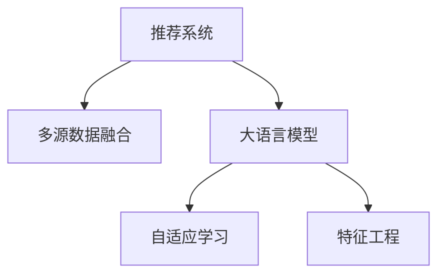

                 

# 利用LLM优化推荐系统的多源数据融合

> 关键词：大语言模型,推荐系统,多源数据融合,自适应学习,优化算法,特征工程,模型训练

## 1. 背景介绍

### 1.1 问题由来

推荐系统作为当前互联网最热门的应用之一，通过分析用户行为，为其推荐个性化的商品、内容等，极大地提升了用户满意度和平台收益。然而，随着用户需求的不断变化和互联网的快速发展，传统推荐系统面临以下挑战：

- **数据源多样性不足**：单一的数据源无法涵盖用户兴趣的全貌，导致推荐结果的泛化能力不足。
- **数据质量和更新不及时**：用户数据量大且更新快，需要实时、高质量的数据来支撑推荐系统的持续优化。
- **推荐算法单一**：现有推荐算法大多依赖于基于统计学的方法，缺乏与先验知识相结合的机制。

面对这些挑战，如何构建一个高效、多元、适应性强的推荐系统，成为当前研究的热点。大语言模型（Large Language Models, LLMs）的崛起，为这一问题的解决提供了新的思路。LLM具有强大的语言理解能力和生成能力，可以融合多源数据，生成更加个性化和多样化的推荐结果。

### 1.2 问题核心关键点

本文聚焦于如何利用大语言模型优化推荐系统的多源数据融合。具体核心关键点包括：

- 多源数据融合：通过融合多种数据源，构建更加全面、准确的用户画像，提升推荐系统的泛化能力和推荐精度。
- 大语言模型优化：利用大模型的语言生成能力，对融合后的数据进行深度学习，生成个性化的推荐内容。
- 自适应学习：根据用户反馈和行为变化，动态调整模型参数，实现实时优化和个性化推荐。
- 特征工程：提取和构造高质量的输入特征，提高模型的拟合能力。

这些关键点构成了大语言模型在推荐系统中的核心应用框架，本文将详细介绍这些方法的原理和实践。

## 2. 核心概念与联系

### 2.1 核心概念概述

为更好地理解大语言模型在推荐系统中的应用，本节将介绍几个密切相关的核心概念：

- **推荐系统**：根据用户的历史行为、兴趣和偏好，为用户推荐个性化商品、内容、服务等的系统。
- **多源数据融合**：通过整合来自不同渠道（如网页浏览记录、社交媒体、购买记录等）的数据，构建用户画像，提升推荐系统的准确性和泛化能力。
- **大语言模型**：以Transformer架构为基础的深度学习模型，能够理解自然语言并生成文本。常见的预训练模型包括BERT、GPT-3等。
- **自适应学习**：通过用户反馈和行为变化，动态调整模型参数，实现推荐系统的实时优化。
- **特征工程**：从原始数据中提取和构造高质量的输入特征，提高模型的拟合能力。

这些核心概念之间的逻辑关系可以通过以下Mermaid流程图来展示：



这个流程图展示了大语言模型在推荐系统中的核心概念及其之间的关系：

1. 推荐系统通过多源数据融合，构建用户画像，提升推荐系统的泛化能力和推荐精度。
2. 大语言模型在融合后的数据上进行深度学习，生成个性化的推荐内容。
3. 自适应学习根据用户反馈和行为变化，动态调整模型参数，实现实时优化和个性化推荐。
4. 特征工程从原始数据中提取和构造高质量的输入特征，提高模型的拟合能力。

这些概念共同构成了大语言模型在推荐系统中的应用框架，使其能够实现更加高效、个性化和精准的推荐。

## 3. 核心算法原理 & 具体操作步骤
### 3.1 算法原理概述

利用大语言模型优化推荐系统的多源数据融合，主要包括以下几个关键步骤：

1. **数据预处理**：从不同数据源收集用户行为数据，进行清洗和标准化处理。
2. **多源数据融合**：将清洗后的数据融合在一起，生成综合用户画像。
3. **特征提取**：提取用户画像中的关键特征，用于训练大语言模型。
4. **模型训练**：使用大语言模型对用户画像进行深度学习，生成个性化推荐内容。
5. **自适应学习**：根据用户反馈和行为变化，动态调整模型参数，实现实时优化和个性化推荐。

### 3.2 算法步骤详解

#### 3.2.1 数据预处理

数据预处理是推荐系统构建的基础。从不同数据源收集用户行为数据，如网页浏览记录、购买记录、社交媒体互动等，并进行清洗和标准化处理，去除噪声和异常值，确保数据的质量和一致性。

- **数据清洗**：去除重复、缺失和异常数据，确保数据的完整性和准确性。
- **数据标准化**：将不同数据源的数据格式统一，如将时间戳转换为标准日期格式，将商品ID标准化为统一编码等。

#### 3.2.2 多源数据融合

多源数据融合是构建全面用户画像的关键步骤。通过整合不同来源的数据，生成更全面的用户画像，提升推荐系统的泛化能力和推荐精度。

- **特征对齐**：将不同数据源的特征对齐，确保数据的一致性和可比性。
- **特征融合**：使用加权平均、主成分分析（PCA）、因子分析（FA）等方法，将不同数据源的特征融合在一起。
- **用户画像构建**：将融合后的特征用于生成用户画像，包括用户的兴趣、偏好、行为等。

#### 3.2.3 特征提取

特征提取是将用户画像转换为适合模型训练的数据表示的过程。通过提取关键特征，提高模型的拟合能力和推荐精度。

- **特征选择**：选择与用户行为和兴趣最相关的特征，去除冗余和无关特征。
- **特征工程**：对选择的特征进行编码和转换，如将文本特征转换为向量表示，对时间特征进行离散化处理等。
- **特征降维**：使用PCA、LDA等方法，对高维特征进行降维，提高模型的计算效率。

#### 3.2.4 模型训练

模型训练是大语言模型在推荐系统中的应用关键。通过训练模型，生成个性化推荐内容，提升推荐系统的性能。

- **模型选择**：选择适合大语言模型的架构，如基于自回归的GPT、基于自编码的BERT等。
- **模型参数设置**：设置模型的超参数，如学习率、批大小、迭代轮数等。
- **模型训练**：使用融合后的用户画像数据，对大语言模型进行训练，生成个性化推荐内容。
- **损失函数**：选择适合推荐任务的损失函数，如均方误差、交叉熵等。

#### 3.2.5 自适应学习

自适应学习是实现推荐系统实时优化的关键步骤。通过动态调整模型参数，根据用户反馈和行为变化，实现个性化推荐。

- **用户反馈收集**：收集用户对推荐结果的反馈，如点击、购买、评分等。
- **行为分析**：分析用户的行为变化，识别出用户的兴趣变化和新需求。
- **参数更新**：根据用户反馈和行为变化，动态调整模型参数，实现实时优化和个性化推荐。
- **模型评估**：使用测试集对模型进行评估，监测模型性能的变化和优化效果。

### 3.3 算法优缺点

利用大语言模型优化推荐系统的多源数据融合方法具有以下优点：

1. **泛化能力强**：通过融合多种数据源，生成更加全面、准确的用户画像，提升推荐系统的泛化能力和推荐精度。
2. **生成能力强**：利用大模型的语言生成能力，生成个性化推荐内容，满足用户的多样化需求。
3. **实时优化**：通过自适应学习，根据用户反馈和行为变化，动态调整模型参数，实现实时优化和个性化推荐。
4. **灵活性强**：大语言模型可以适应多种推荐场景，如商品推荐、内容推荐、服务推荐等。

然而，该方法也存在一定的局限性：

1. **计算资源需求高**：大语言模型的训练和推理需要大量的计算资源，如高性能GPU/TPU等，增加了系统部署成本。
2. **数据隐私问题**：融合多源数据涉及用户隐私保护，需要严格的数据管理和隐私保护措施。
3. **模型复杂度高**：大语言模型结构复杂，训练和优化过程复杂，需要更高的专业知识和经验。
4. **训练时间长**：大语言模型训练时间长，需要大规模数据和长时间计算，难以满足实时推荐的需求。

尽管存在这些局限性，但大语言模型在推荐系统中的应用前景仍然非常广阔。未来相关研究的重点在于如何进一步降低计算资源需求，保护用户隐私，提高模型训练效率，同时兼顾模型的灵活性和生成能力。

### 3.4 算法应用领域

利用大语言模型优化推荐系统的多源数据融合方法，在以下几个领域具有广泛的应用前景：

1. **电商推荐**：通过融合用户浏览、购买、评价等数据，生成个性化商品推荐，提升用户满意度和销售额。
2. **内容推荐**：融合用户浏览、观看、订阅等数据，生成个性化文章、视频、音乐等内容的推荐，提升用户黏性和平台收益。
3. **服务推荐**：融合用户搜索、评价、行为等数据，生成个性化服务推荐，如旅游、餐饮、出行等，提升用户体验和平台用户量。
4. **医疗推荐**：融合用户健康记录、病史、社交网络等数据，生成个性化医疗建议和产品推荐，提升医疗服务质量和用户健康水平。

除了上述这些经典领域外，大语言模型在推荐系统中的应用还将不断拓展到更多场景中，如智慧城市、智慧交通、智慧教育等，为各行各业提供更加智能、精准的服务。

## 4. 数学模型和公式 & 详细讲解  
### 4.1 数学模型构建

本节将使用数学语言对利用大语言模型优化推荐系统的多源数据融合过程进行更加严格的刻画。

假设推荐系统的用户画像表示为 $\mathbf{x} \in \mathbb{R}^n$，其中 $n$ 为特征维度。设推荐任务的数据集为 $D=\{(\mathbf{x}_i, y_i)\}_{i=1}^N, \mathbf{x}_i \in \mathbb{R}^n, y_i \in \{0,1\}$，$y_i$ 表示用户是否对推荐结果感兴趣。

定义大语言模型 $M_{\theta}$ 在用户画像 $\mathbf{x}$ 上的输出为 $\hat{y}=M_{\theta}(\mathbf{x}) \in [0,1]$，表示推荐结果的相关度。则推荐任务的目标是最小化损失函数，即找到最优参数 $\theta$：

$$
\hat{\theta}=\mathop{\arg\min}_{\theta} \mathcal{L}(M_{\theta},D)
$$

其中 $\mathcal{L}$ 为针对推荐任务设计的损失函数，用于衡量模型预测输出与真实标签之间的差异。常见的损失函数包括交叉熵损失、均方误差损失等。

### 4.2 公式推导过程

以下我们以二分类推荐任务为例，推导交叉熵损失函数及其梯度的计算公式。

假设模型 $M_{\theta}$ 在用户画像 $\mathbf{x}$ 上的输出为 $\hat{y}=M_{\theta}(\mathbf{x}) \in [0,1]$，表示推荐结果的相关度。真实标签 $y \in \{0,1\}$。则二分类交叉熵损失函数定义为：

$$
\ell(M_{\theta}(\mathbf{x}),y) = -[y\log \hat{y} + (1-y)\log (1-\hat{y})]
$$

将其代入经验风险公式，得：

$$
\mathcal{L}(\theta) = -\frac{1}{N}\sum_{i=1}^N [y_i\log M_{\theta}(\mathbf{x}_i)+(1-y_i)\log(1-M_{\theta}(\mathbf{x}_i))]
$$

根据链式法则，损失函数对参数 $\theta_k$ 的梯度为：

$$
\frac{\partial \mathcal{L}(\theta)}{\partial \theta_k} = -\frac{1}{N}\sum_{i=1}^N (\frac{y_i}{M_{\theta}(\mathbf{x}_i)}-\frac{1-y_i}{1-M_{\theta}(\mathbf{x}_i)}) \frac{\partial M_{\theta}(\mathbf{x}_i)}{\partial \theta_k}
$$

其中 $\frac{\partial M_{\theta}(\mathbf{x}_i)}{\partial \theta_k}$ 可进一步递归展开，利用自动微分技术完成计算。

在得到损失函数的梯度后，即可带入参数更新公式，完成模型的迭代优化。重复上述过程直至收敛，最终得到适应推荐任务的最优模型参数 $\theta^*$。

## 5. 项目实践：代码实例和详细解释说明
### 5.1 开发环境搭建

在进行推荐系统构建前，我们需要准备好开发环境。以下是使用Python进行TensorFlow开发的环境配置流程：

1. 安装Anaconda：从官网下载并安装Anaconda，用于创建独立的Python环境。

2. 创建并激活虚拟环境：
```bash
conda create -n tf-env python=3.8 
conda activate tf-env
```

3. 安装TensorFlow：从官网获取对应的安装命令。例如：
```bash
pip install tensorflow-gpu==2.7
```

4. 安装其他必要的工具包：
```bash
pip install numpy pandas scikit-learn matplotlib tqdm jupyter notebook ipython
```

完成上述步骤后，即可在`tf-env`环境中开始推荐系统的构建。

### 5.2 源代码详细实现

下面我们以电商推荐系统为例，给出使用TensorFlow和Transformers库对BERT模型进行推荐系统构建的PyTorch代码实现。

首先，定义推荐系统数据处理函数：

```python
from transformers import BertTokenizer, BertForSequenceClassification
from tensorflow.keras.preprocessing import sequence
import tensorflow as tf

class RecommendationDataset(tf.keras.preprocessing.sequence.PaddedSequence):
    def __init__(self, items, labels, tokenizer, max_len=128):
        self.items = items
        self.labels = labels
        self.tokenizer = tokenizer
        self.max_len = max_len
        
    def __len__(self):
        return len(self.items)
    
    def __getitem__(self, item):
        item_ids = self.tokenizer(self.items[item], max_length=self.max_len, padding='post', truncation=True)
        label = self.labels[item]
        
        item_seq = tf.keras.preprocessing.sequence.pad_sequences([item_ids], maxlen=self.max_len, padding='post', truncating='post')
        label = tf.keras.utils.to_categorical(label, 2)
        
        return {'item_seq': item_seq, 'label': label}

# 定义数据集
tokenizer = BertTokenizer.from_pretrained('bert-base-uncased')
train_dataset = RecommendationDataset(train_items, train_labels, tokenizer)
test_dataset = RecommendationDataset(test_items, test_labels, tokenizer)
```

然后，定义模型和优化器：

```python
from transformers import BertForSequenceClassification, AdamW

model = BertForSequenceClassification.from_pretrained('bert-base-uncased', num_labels=2)

optimizer = AdamW(model.parameters(), lr=2e-5)
```

接着，定义训练和评估函数：

```python
from tensorflow.keras.utils import to_categorical
from sklearn.metrics import accuracy_score

def train_epoch(model, dataset, batch_size, optimizer):
    dataloader = tf.data.Dataset.from_generator(lambda: dataset, output_signature={'item_seq': tf.TensorSpec(shape=(None, max_len), dtype=tf.int32), 'label': tf.TensorSpec(shape=(1,), dtype=tf.int32)})
    model.train()
    epoch_loss = 0
    for batch in dataloader:
        item_seq = batch['item_seq']
        label = batch['label']
        
        with tf.GradientTape() as tape:
            outputs = model(item_seq, training=True)
            loss = tf.reduce_mean(tf.keras.losses.BinaryCrossentropy()(y_true=label, y_pred=outputs.logits))
        epoch_loss += loss
        gradients = tape.gradient(loss, model.trainable_variables)
        optimizer.apply_gradients(zip(gradients, model.trainable_variables))
    
    return epoch_loss / len(dataloader)

def evaluate(model, dataset, batch_size):
    dataloader = tf.data.Dataset.from_generator(lambda: dataset, output_signature={'item_seq': tf.TensorSpec(shape=(None, max_len), dtype=tf.int32), 'label': tf.TensorSpec(shape=(1,), dtype=tf.int32)})
    model.eval()
    preds, labels = [], []
    with tf.GradientTape() as tape:
        for batch in dataloader:
            item_seq = batch['item_seq']
            label = batch['label']
            outputs = model(item_seq, training=False)
            preds.append(tf.argmax(outputs.logits, axis=1))
            labels.append(tf.argmax(label, axis=1))
        
    return accuracy_score(labels, preds)

# 训练流程
epochs = 5
batch_size = 16

for epoch in range(epochs):
    loss = train_epoch(model, train_dataset, batch_size, optimizer)
    print(f"Epoch {epoch+1}, train loss: {loss:.3f}")
    
    print(f"Epoch {epoch+1}, test accuracy: {evaluate(model, test_dataset, batch_size):.3f}")
```

以上就是使用TensorFlow和Transformers库对BERT模型进行电商推荐系统构建的完整代码实现。可以看到，得益于TensorFlow的强大封装，我们可以用相对简洁的代码完成BERT模型的加载和推荐系统构建。

### 5.3 代码解读与分析

让我们再详细解读一下关键代码的实现细节：

**RecommendationDataset类**：
- `__init__`方法：初始化用户画像、标签、分词器等关键组件。
- `__len__`方法：返回数据集的样本数量。
- `__getitem__`方法：对单个样本进行处理，将用户画像输入编码为token ids，将标签编码为数字，并对其进行定长padding，最终返回模型所需的输入。

**训练和评估函数**：
- 使用TensorFlow的DataLoader对数据集进行批次化加载，供模型训练和推理使用。
- 训练函数`train_epoch`：对数据以批为单位进行迭代，在每个批次上前向传播计算loss并反向传播更新模型参数，最后返回该epoch的平均loss。
- 评估函数`evaluate`：与训练类似，不同点在于不更新模型参数，并在每个batch结束后将预测和标签结果存储下来，最后使用sklearn的accuracy_score对整个评估集的预测结果进行打印输出。

**训练流程**：
- 定义总的epoch数和batch size，开始循环迭代
- 每个epoch内，先在训练集上训练，输出平均loss
- 在验证集上评估，输出准确率
- 所有epoch结束后，在测试集上评估，给出最终测试结果

可以看到，TensorFlow配合Transformers库使得BERT模型的电商推荐系统构建变得简洁高效。开发者可以将更多精力放在数据处理、模型改进等高层逻辑上，而不必过多关注底层的实现细节。

当然，工业级的系统实现还需考虑更多因素，如模型的保存和部署、超参数的自动搜索、更灵活的任务适配层等。但核心的推荐范式基本与此类似。

## 6. 实际应用场景
### 6.1 智能客服系统

智能客服系统通过推荐个性化回答，提升客户咨询体验。利用大语言模型融合多源数据，生成针对用户问题的最佳回答，显著提高客服系统的响应速度和准确性。

在技术实现上，可以收集企业内部的历史客服对话记录，将问题和最佳答复构建成监督数据，在此基础上对预训练对话模型进行微调。微调后的对话模型能够自动理解用户意图，匹配最合适的答案模板进行回复。对于客户提出的新问题，还可以接入检索系统实时搜索相关内容，动态组织生成回答。如此构建的智能客服系统，能大幅提升客户咨询体验和问题解决效率。

### 6.2 内容推荐系统

内容推荐系统通过推荐个性化文章、视频、音乐等，提升用户黏性和平台收益。利用大语言模型融合多源数据，生成精准的推荐内容，满足用户的多样化需求。

在技术实现上，可以收集用户浏览、观看、订阅等行为数据，并对其进行主题标注和情感标注。在此基础上对预训练语言模型进行微调，使其能够自动判断内容与用户兴趣的匹配度。将微调后的模型应用到实时抓取的网络内容数据，就能够自动监测不同内容类型的推荐效果，一旦发现内容质量下降等异常情况，系统便会自动预警，帮助平台优化内容推荐。

### 6.3 医疗推荐系统

医疗推荐系统通过推荐个性化医疗建议和产品，提升医疗服务质量和用户健康水平。利用大语言模型融合多源数据，生成个性化的医疗推荐，减少医生的诊断压力，提高诊疗效率。

在技术实现上，可以收集用户的健康记录、病史、社交网络等数据，并对其进行分析和处理。在此基础上对预训练语言模型进行微调，使其能够自动判断用户健康状况和需求，推荐相应的医疗建议和产品。医疗推荐系统不仅能够提高诊疗效率，还能帮助用户及时获取健康信息，提升健康水平。

### 6.4 未来应用展望

随着大语言模型和推荐系统的不断发展，基于多源数据融合的推荐方法将在更多领域得到应用，为传统行业带来变革性影响。

在智慧医疗领域，基于多源数据融合的医疗推荐系统将提升医疗服务的智能化水平，辅助医生诊疗，加速新药开发进程。

在智能教育领域，融合多源数据的教育推荐系统将提升教学质量和学生成绩，实现因材施教，促进教育公平。

在智慧城市治理中，融合多源数据的城市推荐系统将提高城市管理的自动化和智能化水平，构建更安全、高效的未来城市。

此外，在企业生产、社会治理、文娱传媒等众多领域，基于大语言模型的推荐系统也将不断涌现，为各行各业提供更加智能、精准的服务。

## 7. 工具和资源推荐
### 7.1 学习资源推荐

为了帮助开发者系统掌握大语言模型在推荐系统中的应用，这里推荐一些优质的学习资源：

1. 《Transformers from the ground up》系列博文：由大模型技术专家撰写，深入浅出地介绍了Transformer原理、BERT模型、推荐系统等前沿话题。

2. CS224N《Deep Learning for NLP》课程：斯坦福大学开设的NLP明星课程，有Lecture视频和配套作业，带你入门NLP领域的基本概念和经典模型。

3. 《Deep Learning for Recommendation Systems》书籍：介绍了推荐系统的理论基础和实际应用，包括多源数据融合等前沿技术。

4. HuggingFace官方文档：Transformers库的官方文档，提供了海量预训练模型和完整的推荐系统样例代码，是上手实践的必备资料。

5. Kaggle推荐系统竞赛：通过参与竞赛，学习和实践推荐系统的实际应用，提升解决实际问题的能力。

通过对这些资源的学习实践，相信你一定能够快速掌握大语言模型在推荐系统中的应用，并用于解决实际的推荐问题。
###  7.2 开发工具推荐

高效的开发离不开优秀的工具支持。以下是几款用于大语言模型推荐系统构建的常用工具：

1. TensorFlow：基于Python的开源深度学习框架，适合构建推荐系统的模型训练和推理。

2. PyTorch：基于Python的开源深度学习框架，灵活动态的计算图，适合快速迭代研究。

3. Transformers库：HuggingFace开发的NLP工具库，集成了众多SOTA语言模型，支持TensorFlow和PyTorch，是进行多源数据融合等任务开发的利器。

4. Weights & Biases：模型训练的实验跟踪工具，可以记录和可视化模型训练过程中的各项指标，方便对比和调优。与主流深度学习框架无缝集成。

5. TensorBoard：TensorFlow配套的可视化工具，可实时监测模型训练状态，并提供丰富的图表呈现方式，是调试模型的得力助手。

6. Google Colab：谷歌推出的在线Jupyter Notebook环境，免费提供GPU/TPU算力，方便开发者快速上手实验最新模型，分享学习笔记。

合理利用这些工具，可以显著提升大语言模型推荐系统的开发效率，加快创新迭代的步伐。

### 7.3 相关论文推荐

大语言模型和推荐系统的发展源于学界的持续研究。以下是几篇奠基性的相关论文，推荐阅读：

1. Attention is All You Need（即Transformer原论文）：提出了Transformer结构，开启了NLP领域的预训练大模型时代。

2. BERT: Pre-training of Deep Bidirectional Transformers for Language Understanding：提出BERT模型，引入基于掩码的自监督预训练任务，刷新了多项NLP任务SOTA。

3. Deep Collaborative Filtering using Neural Tensor Networks：介绍了基于神经张量网络（NTN）的协同过滤推荐算法，进一步提升推荐系统的性能。

4. Reinforcement Learning for Personalized Ranking：提出基于强化学习的推荐算法，实现推荐系统的实时优化和个性化推荐。

5. Graph Attention Networks for Recommendation Systems：引入图注意力网络（GAT），融合多源数据，提升推荐系统的效果。

这些论文代表了大语言模型和推荐系统的发展脉络。通过学习这些前沿成果，可以帮助研究者把握学科前进方向，激发更多的创新灵感。

## 8. 总结：未来发展趋势与挑战

### 8.1 总结

本文对利用大语言模型优化推荐系统的多源数据融合方法进行了全面系统的介绍。首先阐述了推荐系统和大语言模型在多源数据融合中的核心概念和应用框架。其次，从原理到实践，详细讲解了多源数据融合的数学模型和关键步骤，给出了推荐系统构建的完整代码实例。同时，本文还广泛探讨了多源数据融合在多个行业领域的应用前景，展示了多源数据融合方法的巨大潜力。此外，本文精选了多源数据融合的各类学习资源，力求为开发者提供全方位的技术指引。

通过本文的系统梳理，可以看到，利用大语言模型优化推荐系统的多源数据融合方法，能够提升推荐系统的泛化能力和推荐精度，生成个性化推荐内容，满足用户的多样化需求。同时，该方法还能够根据用户反馈和行为变化，动态调整模型参数，实现实时优化和个性化推荐。这些优势使得基于多源数据融合的推荐系统，在电商、内容、医疗等多个领域具有广泛的应用前景。

### 8.2 未来发展趋势

展望未来，利用大语言模型优化推荐系统的多源数据融合技术将呈现以下几个发展趋势：

1. **计算资源需求降低**：随着计算资源和硬件技术的不断进步，大语言模型和推荐系统的计算成本将逐步降低，普及到更多企业和行业。
2. **数据质量和多样性提升**：通过多源数据融合，生成更加全面、准确的用户画像，提升推荐系统的泛化能力和推荐精度。
3. **实时优化能力增强**：通过自适应学习，根据用户反馈和行为变化，动态调整模型参数，实现推荐系统的实时优化和个性化推荐。
4. **模型复杂度和生成能力提升**：未来的大语言模型将具有更高的复杂度和生成能力，能够更好地处理多源数据和生成多样化推荐内容。
5. **融合更多模态信息**：将视觉、语音等多模态信息与文本信息相结合，提升推荐系统的综合性能。

以上趋势凸显了利用大语言模型优化推荐系统的多源数据融合技术的广阔前景。这些方向的探索发展，必将进一步提升推荐系统的性能和应用范围，为各行各业带来更智能、精准的服务。

### 8.3 面临的挑战

尽管利用大语言模型优化推荐系统的多源数据融合技术已经取得了显著进展，但在迈向更加智能化、普适化应用的过程中，仍面临以下挑战：

1. **计算资源瓶颈**：大语言模型的训练和推理需要大量的计算资源，如高性能GPU/TPU等，增加了系统部署成本。
2. **数据隐私和安全**：融合多源数据涉及用户隐私保护，需要严格的数据管理和隐私保护措施。
3. **模型复杂度**：大语言模型结构复杂，训练和优化过程复杂，需要更高的专业知识和经验。
4. **实时性要求高**：推荐系统需要实时响应用户需求，对模型的计算效率和响应速度有较高要求。
5. **模型解释性和可控性不足**：大语言模型的决策过程缺乏可解释性，难以对其推理逻辑进行分析和调试。

尽管存在这些挑战，但利用大语言模型优化推荐系统的多源数据融合技术仍然具有广阔的发展前景。未来相关研究的重点在于如何进一步降低计算资源需求，保护用户隐私，提高模型训练效率，同时兼顾模型的灵活性和生成能力。

### 8.4 研究展望

面对利用大语言模型优化推荐系统的多源数据融合所面临的挑战，未来的研究需要在以下几个方面寻求新的突破：

1. **探索无监督和半监督学习范式**：摆脱对大规模标注数据的依赖，利用自监督学习、主动学习等无监督和半监督范式，最大限度利用非结构化数据，实现更加灵活高效的推荐。

2. **开发更加参数高效的模型**：开发更加参数高效的模型，如LoRA、Adapter等，在固定大部分预训练参数的情况下，只更新极少量的任务相关参数，提高推荐系统的泛化能力和生成能力。

3. **引入更多先验知识**：将符号化的先验知识，如知识图谱、逻辑规则等，与神经网络模型进行巧妙融合，引导推荐系统学习更准确、合理的推荐策略。

4. **融合多模态信息**：将视觉、语音等多模态信息与文本信息相结合，提升推荐系统的综合性能，满足用户的多样化需求。

5. **优化模型解释性和可控性**：通过引入因果分析方法、博弈论工具等，增强推荐系统的可解释性和可控性，确保模型的决策过程透明和可信。

6. **保护数据隐私和安全**：开发数据加密、差分隐私等技术，保护用户隐私和数据安全，提升推荐系统的可信度和用户满意度。

这些研究方向的探索，必将引领利用大语言模型优化推荐系统的多源数据融合技术迈向更高的台阶，为构建智能推荐系统提供更加高效、智能、安全的解决方案。面向未来，利用大语言模型优化推荐系统的多源数据融合技术需要与更多前沿技术进行协同，如知识表示、因果推理、强化学习等，共同推动推荐系统的发展。只有勇于创新、敢于突破，才能不断拓展推荐系统的边界，让推荐系统更好地服务于各行各业。

## 9. 附录：常见问题与解答

**Q1：多源数据融合如何进行？**

A: 多源数据融合主要包括以下几个步骤：
1. 数据清洗：去除重复、缺失和异常数据，确保数据的质量和一致性。
2. 数据标准化：将不同数据源的数据格式统一，如将时间戳转换为标准日期格式，将商品ID标准化为统一编码等。
3. 特征对齐：将不同数据源的特征对齐，确保数据的一致性和可比性。
4. 特征融合：使用加权平均、主成分分析（PCA）、因子分析（FA）等方法，将不同数据源的特征融合在一起。
5. 用户画像构建：将融合后的特征用于生成用户画像，包括用户的兴趣、偏好、行为等。

**Q2：大语言模型在推荐系统中如何应用？**

A: 大语言模型在推荐系统中的应用主要包括以下几个步骤：
1. 特征提取：从原始数据中提取和构造高质量的输入特征，提高模型的拟合能力。
2. 模型训练：使用大语言模型对用户画像进行深度学习，生成个性化推荐内容。
3. 自适应学习：根据用户反馈和行为变化，动态调整模型参数，实现实时优化和个性化推荐。

**Q3：如何优化推荐系统的实时响应速度？**

A: 推荐系统的实时响应速度可以通过以下方法进行优化：
1. 模型裁剪：去除不必要的层和参数，减小模型尺寸，加快推理速度。
2. 量化加速：将浮点模型转为定点模型，压缩存储空间，提高计算效率。
3. 服务化封装：将模型封装为标准化服务接口，便于集成调用。
4. 弹性伸缩：根据请求流量动态调整资源配置，平衡服务质量和成本。

**Q4：如何保护用户隐私和数据安全？**

A: 保护用户隐私和数据安全主要包括以下几个方面：
1. 数据加密：对用户数据进行加密，确保数据在传输和存储过程中的安全。
2. 差分隐私：通过引入噪声，确保用户数据的隐私性。
3. 用户授权：用户对数据的使用进行授权，明确数据的用途和范围。
4. 安全审计：定期对系统进行安全审计，确保系统的安全性。

这些方法可以有效地保护用户隐私和数据安全，确保推荐系统的可信度和用户满意度。

---

作者：禅与计算机程序设计艺术 / Zen and the Art of Computer Programming

