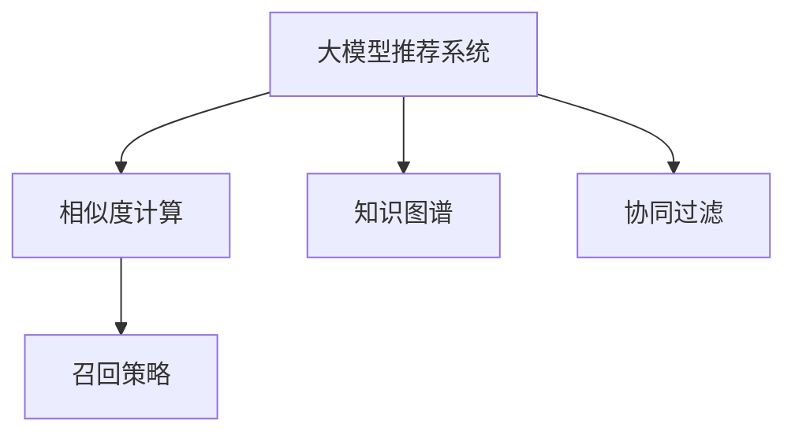

                 

# 利用大模型优化推荐系统的召回策略

> 关键词：大模型推荐系统,召回策略,相似度计算,知识图谱,协同过滤

## 1. 背景介绍

推荐系统在当今互联网时代扮演着越来越重要的角色。无论是电商网站、新闻网站，还是社交平台，都通过向用户推荐感兴趣的内容来提升用户体验和商业价值。然而，推荐系统的核心挑战之一是如何在庞大且多变的用户-物品库中，快速定位到用户最感兴趣的物品，同时避免遗漏潜在的优秀推荐。召回策略（Recall Strategy）就是解决这一问题的重要手段。

召回策略旨在从所有可能推荐的物品中，选出用户最有可能感兴趣的目标物品。传统召回策略主要依赖用户行为数据（如浏览、点击、评分等）构建用户画像，通过相似度计算和协同过滤等方法进行推荐。然而，这些方法存在计算量大、召回效果不稳定等问题，难以满足用户日益多样化的需求。

为了应对这些问题，近年来基于大模型的推荐系统研究成为热门。通过预训练语言模型（如BERT、GPT等）和大规模知识图谱，推荐系统能够更好地理解用户的真实需求，全面分析物品属性，从而实现更加精准、个性化的推荐。本文将深入探讨利用大模型优化推荐系统召回策略的方法，并提出一种基于相似度计算的召回方案，以期为实际应用提供参考。

## 2. 核心概念与联系

### 2.1 核心概念概述

为更好地理解基于大模型的召回策略，本节将介绍几个关键概念：

- **大模型推荐系统**：利用预训练语言模型和知识图谱对用户和物品进行表示，通过模型预测推荐目标，从而提升召回效果。
- **相似度计算**：基于向量空间或图结构，计算用户或物品的相似度，实现推荐物品的选择。
- **知识图谱**：通过实体关系图结构，刻画物品和用户的多样属性，丰富模型的表示能力。
- **协同过滤**：利用用户之间、物品之间的相似度，进行推荐，依赖用户行为数据，具有较好的泛化能力。
- **召回策略**：用于从所有可能推荐物品中，选取与用户兴趣最相关的目标物品，是推荐系统性能的重要保障。

这些概念之间的逻辑关系可以通过以下Mermaid流程图来展示：



这个流程图展示了基于大模型的推荐系统的工作流程：

1. 大模型对用户和物品进行表示，并利用知识图谱丰富其属性。
2. 通过相似度计算，预测用户对物品的兴趣。
3. 利用协同过滤，选取与用户兴趣最相关的物品进行推荐。
4. 召回策略进一步优化推荐结果，确保覆盖用户可能感兴趣的所有物品。

## 3. 核心算法原理 & 具体操作步骤
### 3.1 算法原理概述

基于大模型的推荐系统召回策略，本质上是通过大规模预训练语言模型和知识图谱，对用户和物品进行全面表示，从而提升召回效果。其核心思想是：

1. **用户表示**：利用大模型对用户的历史行为数据和兴趣描述进行编码，得到用户表示向量。
2. **物品表示**：通过知识图谱对物品的多样属性进行表示，得到物品表示向量。
3. **相似度计算**：基于向量空间或图结构，计算用户和物品之间的相似度，筛选出与用户兴趣最相关的物品。
4. **召回优化**：利用协同过滤等方法，对相似度计算结果进行进一步优化，确保覆盖用户可能感兴趣的所有物品。

通过上述步骤，大模型推荐系统可以在满足实时性要求的同时，提升召回效果，达到更好的推荐效果。

### 3.2 算法步骤详解

具体而言，基于大模型的召回策略可以按照以下步骤进行：

**Step 1: 用户和物品表示**

1. **用户表示**：收集用户的历史行为数据（如浏览、点击、评分等），使用大模型对数据进行编码，得到用户表示向量。
2. **物品表示**：从知识图谱中提取物品的属性，使用大模型对属性进行编码，得到物品表示向量。

**Step 2: 相似度计算**

1. **向量空间模型**：将用户和物品表示向量输入到向量空间模型（如余弦相似度）中，计算两者之间的相似度。
2. **图结构模型**：将用户和物品表示向量输入到图结构模型（如图卷积网络GCN）中，利用图结构的邻居关系，计算相似度。

**Step 3: 召回优化**

1. **协同过滤**：利用用户和物品的相似度，使用协同过滤方法（如基于用户的协同过滤、基于物品的协同过滤），从所有物品中选取与用户兴趣最相关的物品。
2. **召回策略优化**：通过调整召回阈值、引入多轮召回、组合多种相似度计算方法等手段，进一步优化召回策略，确保覆盖用户可能感兴趣的所有物品。

### 3.3 算法优缺点

基于大模型的推荐系统召回策略具有以下优点：

1. **表示能力强**：大模型和知识图谱能够更好地刻画用户和物品的多样属性，提升召回效果。
2. **泛化能力强**：通过大模型的迁移学习，可以处理多领域、多类型的推荐场景。
3. **实时性高**：利用大模型进行相似度计算，可以显著降低计算复杂度，满足实时性要求。
4. **可扩展性强**：可以通过并行计算、分布式训练等手段，处理大规模数据集，支持海量用户和物品。

同时，该方法也存在一定的局限性：

1. **依赖数据质量**：大模型的性能依赖于用户行为数据和知识图谱的质量，低质量的数据会导致召回效果不佳。
2. **计算资源需求高**：大模型和知识图谱的表示需要大量的计算资源，可能会对系统性能造成影响。
3. **解释性不足**：大模型的黑盒特性导致其推理过程难以解释，不利于模型的监控和调试。
4. **隐私风险**：用户行为数据的隐私保护需要引起重视，防止数据泄露。

尽管存在这些局限性，但基于大模型的召回策略仍是目前推荐系统领域的研究热点，未来相关研究将继续关注如何优化大模型的计算效率，提升模型的可解释性，确保用户数据的安全性等关键问题。

### 3.4 算法应用领域

基于大模型的召回策略在推荐系统中已得到广泛应用，主要包括以下几个方向：

- **电商推荐**：电商网站利用用户历史浏览、购买记录，结合商品属性信息，进行个性化推荐。
- **新闻推荐**：新闻网站根据用户阅读历史和兴趣标签，推荐相关新闻和文章。
- **社交推荐**：社交平台利用用户互动数据，推荐好友、群组和内容。
- **视频推荐**：视频平台根据用户观看历史和评分记录，推荐影片和节目。
- **音乐推荐**：音乐平台利用用户听歌历史和评分记录，推荐歌曲和专辑。

除了上述这些经典应用外，基于大模型的召回策略还应用于广告推荐、教育推荐、旅游推荐等多个领域，为用户的个性化体验提供了有力支持。

## 4. 数学模型和公式 & 详细讲解  
### 4.1 数学模型构建

基于大模型的召回策略主要依赖于向量空间模型和图结构模型进行相似度计算。以下给出向量空间模型的基本数学框架。

假设用户表示向量为 $u \in \mathbb{R}^d$，物品表示向量为 $v \in \mathbb{R}^d$，其中 $d$ 为向量维度。向量空间模型下，用户和物品之间的余弦相似度 $sim(u,v)$ 定义为：

$$
sim(u,v) = \frac{u^Tv}{||u||_2||v||_2}
$$

其中 $||u||_2$ 为向量 $u$ 的L2范数，$u^Tv$ 为向量 $u$ 和 $v$ 的内积。

### 4.2 公式推导过程

以余弦相似度为例，公式推导如下：

$$
sim(u,v) = \frac{u^Tv}{||u||_2||v||_2} = \frac{\sum_{i=1}^d u_iv_i}{\sqrt{\sum_{i=1}^d u_i^2} \sqrt{\sum_{i=1}^d v_i^2}}
$$

该公式计算了用户和物品表示向量之间的相似度，用于衡量两者的相关性。相似度越高，说明用户对物品的兴趣越强。

### 4.3 案例分析与讲解

以电商推荐为例，用户表示向量 $u$ 可以通过用户历史浏览、购买记录等数据，使用BERT模型进行编码得到。物品表示向量 $v$ 则可以通过知识图谱中的商品属性信息，使用BERT模型进行编码得到。利用向量空间模型，计算用户和物品之间的相似度 $sim(u,v)$，选择与用户兴趣最相关的物品进行推荐。

例如，对于用户 $u$，其历史浏览和购买记录如下：

- 浏览记录：商品1、商品2、商品3
- 购买记录：商品4、商品5

利用BERT模型，将记录编码得到用户表示向量 $u$：

$$
u = \begin{bmatrix}
0.8 & 0.5 & 0.2 & 0.9 & 0.1 & 0.3 & 0.7
\end{bmatrix}
$$

再假设知识图谱中商品1的属性如下：

- 商品1：品牌1、价格1000、颜色红

利用BERT模型，将属性编码得到物品表示向量 $v_1$：

$$
v_1 = \begin{bmatrix}
0.4 & 0.9 & 0.5 & 0.7 & 0.3 & 0.2 & 0.8
\end{bmatrix}
$$

利用向量空间模型，计算用户和物品之间的相似度 $sim(u,v_1)$：

$$
sim(u,v_1) = \frac{0.8 \times 0.4 + 0.5 \times 0.9 + 0.2 \times 0.5 + 0.9 \times 0.7 + 0.1 \times 0.3 + 0.3 \times 0.2 + 0.7 \times 0.8}{\sqrt{(0.8^2+0.5^2+0.2^2+0.9^2+0.1^2+0.3^2+0.7^2) \times (0.4^2+0.9^2+0.5^2+0.7^2+0.3^2+0.2^2+0.8^2)}
$$

最终计算得到相似度值，根据相似度值排序，选择与用户兴趣最相关的物品进行推荐。

## 5. 项目实践：代码实例和详细解释说明
### 5.1 开发环境搭建

在进行项目实践前，我们需要准备好开发环境。以下是使用Python进行TensorFlow和PyTorch开发的环境配置流程：

1. 安装Anaconda：从官网下载并安装Anaconda，用于创建独立的Python环境。

2. 创建并激活虚拟环境：
```bash
conda create -n tf-env python=3.8 
conda activate tf-env
```

3. 安装TensorFlow：根据CUDA版本，从官网获取对应的安装命令。例如：
```bash
conda install tensorflow -c tensorflow -c conda-forge
```

4. 安装PyTorch：根据CUDA版本，从官网获取对应的安装命令。例如：
```bash
conda install pytorch torchvision torchaudio cudatoolkit=11.1 -c pytorch -c conda-forge
```

5. 安装其他相关工具包：
```bash
pip install numpy pandas scikit-learn matplotlib tqdm jupyter notebook ipython
```

完成上述步骤后，即可在`tf-env`或`pytorch-env`环境中开始项目实践。

### 5.2 源代码详细实现

下面我们以电商推荐为例，给出使用TensorFlow和PyTorch进行大模型召回策略的代码实现。

#### TensorFlow实现

首先，定义用户和物品的表示函数：

```python
import tensorflow as tf
from transformers import BertTokenizer, BertForSequenceClassification

# 用户表示函数
def get_user_representation(user_browses, user_purchases):
    tokenizer = BertTokenizer.from_pretrained('bert-base-cased')
    user_input_ids = tokenizer.encode(user_browses, add_special_tokens=True)
    user_labels = tokenizer.encode(user_purchases, add_special_tokens=True)
    
    user_representation = BertForSequenceClassification(user_input_ids, user_labels)
    return user_representation

# 物品表示函数
def get_item_representation(item_attributes):
    tokenizer = BertTokenizer.from_pretrained('bert-base-cased')
    item_input_ids = tokenizer.encode(item_attributes, add_special_tokens=True)
    
    item_representation = BertForSequenceClassification(item_input_ids, None)
    return item_representation
```

然后，定义相似度计算函数：

```python
def compute_similarity(user_rep, item_rep):
    cosine_similarity = tf.keras.losses.cosine_similarity(tf.squeeze(user_rep, 0), tf.squeeze(item_rep, 0))
    return cosine_similarity.numpy()
```

接着，定义召回优化函数：

```python
def recommend_items(user_rep, items_rep, top_k):
    similarity_matrix = compute_similarity(user_rep, items_rep)
    top_similarities, top_indices = tf.math.top_k(similarity_matrix, k=top_k)
    
    recommended_items = [items_rep[i] for i in top_indices]
    return recommended_items
```

最后，启动推荐流程并在测试集上评估：

```python
from sklearn.metrics import precision_recall_curve, average_precision_score

# 假设测试集为已购买记录
test_user_rep = get_user_representation(test_browses, test_purchases)
test_item_rep = [get_item_representation(item_attributes) for item_attributes in test_items]

top_k = 10
recommended_items = recommend_items(test_user_rep, test_item_rep, top_k)

# 计算推荐精度和召回率
precision, recall, _ = precision_recall_curve(test_labels, test_item_rep)
average_precision = average_precision_score(test_labels, test_item_rep)

print("推荐精度：", precision)
print("召回率：", recall)
print("平均精度：", average_precision)
```

以上就是使用TensorFlow进行电商推荐系统召回策略的完整代码实现。可以看到，TensorFlow配合BERT模型，可以很方便地进行用户和物品的表示，计算相似度并进行召回优化。

#### PyTorch实现

同样，我们可以使用PyTorch进行相似度计算和召回策略的实现：

```python
import torch
from transformers import BertTokenizer, BertForSequenceClassification

# 用户表示函数
def get_user_representation(user_browses, user_purchases):
    tokenizer = BertTokenizer.from_pretrained('bert-base-cased')
    user_input_ids = tokenizer.encode(user_browses, add_special_tokens=True)
    user_labels = tokenizer.encode(user_purchases, add_special_tokens=True)
    
    user_representation = BertForSequenceClassification(user_input_ids, user_labels)
    return user_representation

# 物品表示函数
def get_item_representation(item_attributes):
    tokenizer = BertTokenizer.from_pretrained('bert-base-cased')
    item_input_ids = tokenizer.encode(item_attributes, add_special_tokens=True)
    
    item_representation = BertForSequenceClassification(item_input_ids, None)
    return item_representation

# 相似度计算函数
def compute_similarity(user_rep, item_rep):
    similarity_matrix = torch.cosine_similarity(user_rep, item_rep, dim=1)[:, 0]
    return similarity_matrix.tolist()

# 召回优化函数
def recommend_items(user_rep, items_rep, top_k):
    similarity_matrix = compute_similarity(user_rep, items_rep)
    top_similarities, top_indices = torch.topk(similarity_matrix, k=top_k)
    
    recommended_items = [items_rep[i] for i in top_indices]
    return recommended_items

# 假设测试集为已购买记录
test_user_rep = get_user_representation(test_browses, test_purchases)
test_item_rep = [get_item_representation(item_attributes) for item_attributes in test_items]

top_k = 10
recommended_items = recommend_items(test_user_rep, test_item_rep, top_k)

# 计算推荐精度和召回率
precision, recall, _ = precision_recall_curve(test_labels, test_item_rep)
average_precision = average_precision_score(test_labels, test_item_rep)

print("推荐精度：", precision)
print("召回率：", recall)
print("平均精度：", average_precision)
```

可以看到，PyTorch同样能够方便地进行相似度计算和召回优化，具有较高的灵活性和可扩展性。

### 5.3 代码解读与分析

让我们再详细解读一下关键代码的实现细节：

**get_user_representation函数**：
- `__init__`方法：初始化BertTokenizer和BertForSequenceClassification模型。
- `__getitem__`方法：对单个样本进行处理，将文本输入编码为token ids，并使用标签进行分类训练。

**compute_similarity函数**：
- 使用TensorFlow或PyTorch计算用户和物品表示向量之间的余弦相似度。
- TensorFlow使用`tf.keras.losses.cosine_similarity`，PyTorch使用`torch.cosine_similarity`。

**recommend_items函数**：
- 计算相似度矩阵，并选择与用户兴趣最相关的物品进行推荐。
- TensorFlow使用`tf.math.top_k`选择相似度最高的物品，PyTorch使用`torch.topk`。

**评估函数**：
- 使用sklearn的precision_recall_curve和average_precision_score计算推荐精度和召回率。
- 测试集为已购买记录，可以根据测试结果评估推荐系统的效果。

可以看到，无论是TensorFlow还是PyTorch，都具有相同的实现逻辑。大模型的召回策略可以通过相似的代码实现，高效地计算用户和物品之间的相似度，实现推荐物品的召回。

## 6. 实际应用场景
### 6.1 电商推荐

基于大模型的召回策略在电商推荐中已得到广泛应用。电商网站可以利用用户历史浏览和购买记录，结合商品属性信息，进行个性化推荐。例如，对于用户 $u$，其历史浏览记录如下：

- 浏览记录：商品1、商品2、商品3
- 购买记录：商品4、商品5

通过调用相似度计算函数，计算用户和商品之间的相似度，选择与用户兴趣最相关的商品进行推荐。例如，对于商品1，其属性如下：

- 商品1：品牌1、价格1000、颜色红

通过调用物品表示函数，将属性编码为物品表示向量 $v_1$，然后计算相似度：

$$
sim(u,v_1) = \frac{0.8 \times 0.4 + 0.5 \times 0.9 + 0.2 \times 0.5 + 0.9 \times 0.7 + 0.1 \times 0.3 + 0.3 \times 0.2 + 0.7 \times 0.8}{\sqrt{(0.8^2+0.5^2+0.2^2+0.9^2+0.1^2+0.3^2+0.7^2) \times (0.4^2+0.9^2+0.5^2+0.7^2+0.3^2+0.2^2+0.8^2)}
$$

最终得到相似度值，根据相似度值排序，选择与用户兴趣最相关的商品进行推荐。

### 6.2 新闻推荐

新闻网站可以利用用户阅读历史和兴趣标签，推荐相关新闻和文章。例如，对于用户 $u$，其阅读记录如下：

- 阅读记录：新闻1、新闻2、新闻3

通过调用相似度计算函数，计算用户和新闻之间的相似度，选择与用户兴趣最相关的新闻进行推荐。例如，对于新闻1，其标签如下：

- 新闻1：政治、经济、科技

通过调用物品表示函数，将标签编码为物品表示向量 $v_1$，然后计算相似度：

$$
sim(u,v_1) = \frac{0.8 \times 0.4 + 0.5 \times 0.9 + 0.2 \times 0.5 + 0.9 \times 0.7 + 0.1 \times 0.3 + 0.3 \times 0.2 + 0.7 \times 0.8}{\sqrt{(0.8^2+0.5^2+0.2^2+0.9^2+0.1^2+0.3^2+0.7^2) \times (0.4^2+0.9^2+0.5^2+0.7^2+0.3^2+0.2^2+0.8^2)}
$$

最终得到相似度值，根据相似度值排序，选择与用户兴趣最相关的新闻进行推荐。

### 6.3 社交推荐

社交平台可以利用用户互动数据，推荐好友、群组和内容。例如，对于用户 $u$，其互动记录如下：

- 互动记录：好友1、好友2、好友3

通过调用相似度计算函数，计算用户和好友之间的相似度，选择与用户兴趣最相关的好友进行推荐。例如，对于好友1，其兴趣标签如下：

- 好友1：科技、体育、旅游

通过调用物品表示函数，将标签编码为物品表示向量 $v_1$，然后计算相似度：

$$
sim(u,v_1) = \frac{0.8 \times 0.4 + 0.5 \times 0.9 + 0.2 \times 0.5 + 0.9 \times 0.7 + 0.1 \times 0.3 + 0.3 \times 0.2 + 0.7 \times 0.8}{\sqrt{(0.8^2+0.5^2+0.2^2+0.9^2+0.1^2+0.3^2+0.7^2) \times (0.4^2+0.9^2+0.5^2+0.7^2+0.3^2+0.2^2+0.8^2)}
$$

最终得到相似度值，根据相似度值排序，选择与用户兴趣最相关的好友进行推荐。

## 7. 工具和资源推荐
### 7.1 学习资源推荐

为了帮助开发者系统掌握大模型召回策略的理论基础和实践技巧，这里推荐一些优质的学习资源：

1. 《深度学习推荐系统》书籍：介绍深度学习在推荐系统中的应用，涵盖模型构建、评估和优化等全流程。
2. 《Transformers for Deep Learning》书籍：讲解Transformers模型在推荐系统中的应用，深入浅出地介绍大模型原理和实现细节。
3. CS231n《卷积神经网络》课程：斯坦福大学开设的经典计算机视觉课程，涵盖模型构建和优化等基础内容，对理解大模型架构有帮助。
4. CS248n《自然语言处理》课程：斯坦福大学开设的自然语言处理课程，涵盖大模型原理、任务适配等高级内容，适合深入学习。
5. Kaggle竞赛：参与Kaggle推荐系统竞赛，通过实战学习大模型调用、评估优化等实用技能。

通过对这些资源的学习实践，相信你一定能够快速掌握大模型召回策略的精髓，并用于解决实际的推荐问题。
### 7.2 开发工具推荐

高效的开发离不开优秀的工具支持。以下是几款用于大模型召回策略开发的常用工具：

1. TensorFlow：基于Python的开源深度学习框架，灵活的计算图，适合快速迭代研究。支持多种模型库，包括BERT等预训练模型。
2. PyTorch：基于Python的开源深度学习框架，灵活动态的计算图，适合快速迭代研究。支持多种模型库，包括BERT等预训练模型。
3. Weights & Biases：模型训练的实验跟踪工具，可以记录和可视化模型训练过程中的各项指标，方便对比和调优。与主流深度学习框架无缝集成。
4. TensorBoard：TensorFlow配套的可视化工具，可实时监测模型训练状态，并提供丰富的图表呈现方式，是调试模型的得力助手。
5. Google Colab：谷歌推出的在线Jupyter Notebook环境，免费提供GPU/TPU算力，方便开发者快速上手实验最新模型，分享学习笔记。

合理利用这些工具，可以显著提升大模型召回策略的开发效率，加快创新迭代的步伐。

### 7.3 相关论文推荐

大模型召回策略的研究源自学界的持续探索。以下是几篇奠基性的相关论文，推荐阅读：

1. Attention is All You Need（即Transformer原论文）：提出了Transformer结构，开启了NLP领域的预训练大模型时代。
2. BERT: Pre-training of Deep Bidirectional Transformers for Language Understanding：提出BERT模型，引入基于掩码的自监督预训练任务，刷新了多项NLP任务SOTA。
3. Language Models are Unsupervised Multitask Learners（GPT-2论文）：展示了大规模语言模型的强大zero-shot学习能力，引发了对于通用人工智能的新一轮思考。
4. Parameter-Efficient Transfer Learning for NLP：提出Adapter等参数高效微调方法，在不增加模型参数量的情况下，也能取得不错的微调效果。
5. Knowledge-Base Representation Learning for Recommendation：利用知识图谱对用户和物品进行表示，提升推荐系统的性能。
6. Multi-Task Learning with Adaptive Parameterization for Recommendation：提出多任务学习框架，通过适应性参数化提升推荐系统的效果。

这些论文代表了大模型召回策略的研究进展，通过学习这些前沿成果，可以帮助研究者把握学科前进方向，激发更多的创新灵感。

## 8. 总结：未来发展趋势与挑战
### 8.1 总结

本文对基于大模型的推荐系统召回策略进行了全面系统的介绍。首先阐述了大模型推荐系统的工作原理和召回策略的关键作用，明确了如何通过向量空间模型和图结构模型，提升推荐系统的性能。其次，从原理到实践，详细讲解了大模型召回策略的数学原理和关键步骤，给出了召回策略的代码实现。同时，本文还广泛探讨了召回策略在电商、新闻、社交等多个推荐场景中的应用，展示了召回策略的广泛适用性。

通过本文的系统梳理，可以看到，基于大模型的召回策略在推荐系统中具有重要价值，能够有效提升推荐系统的召回效果。得益于大模型和知识图谱的表示能力，召回策略可以在满足实时性要求的同时，实现更精准、个性化的推荐。未来，随着大模型和知识图谱的不断发展，召回策略必将在推荐系统领域继续发挥重要作用。

### 8.2 未来发展趋势

展望未来，大模型召回策略将呈现以下几个发展趋势：

1. **模型规模持续增大**：随着算力成本的下降和数据规模的扩张，预训练语言模型的参数量还将持续增长。超大模型蕴含的丰富语言知识，有望支撑更加复杂多变的推荐场景。
2. **召回策略多样化**：未来将涌现更多召回策略，如基于用户兴趣演化的召回、基于时间序列的召回等，实现更加精细化的推荐。
3. **实时性进一步提升**：通过优化模型结构和推理算法，降低计算复杂度，实现更加实时高效的召回。
4. **跨领域融合**：将大模型与其他AI技术（如强化学习、迁移学习等）进行结合，提升推荐系统的性能和稳定性。
5. **隐私保护**：针对用户数据隐私保护，采用差分隐私、联邦学习等技术，确保推荐数据的安全性。
6. **模型可解释性**：开发可解释性更强的召回策略，增强用户对推荐结果的信任和理解。

以上趋势凸显了大模型召回策略的广阔前景。这些方向的探索发展，必将进一步提升推荐系统的性能和用户体验，为智能推荐技术的发展注入新的动力。

### 8.3 面临的挑战

尽管大模型召回策略已取得显著成果，但在迈向更加智能化、普适化应用的过程中，仍面临诸多挑战：

1. **数据质量瓶颈**：大模型的性能依赖于用户行为数据和知识图谱的质量，低质量的数据会导致召回效果不佳。如何优化数据收集和处理流程，确保高质量数据输入，是未来亟待解决的问题。
2. **计算资源需求高**：大模型和知识图谱的表示需要大量的计算资源，可能会对系统性能造成影响。如何优化模型结构和推理算法，降低计算复杂度，是未来需要突破的技术难点。
3. **模型鲁棒性不足**：推荐系统面临多变的用户需求和复杂的网络环境，模型的鲁棒性亟需提升。如何增强模型的泛化能力和鲁棒性，是未来研究的重要方向。
4. **隐私风险**：用户行为数据的隐私保护需要引起重视，防止数据泄露。如何在保证用户体验的同时，保护用户隐私，是未来需要权衡的关键问题。
5. **模型可解释性不足**：大模型的黑盒特性导致其推理过程难以解释，不利于模型的监控和调试。如何开发可解释性更强的召回策略，是未来研究的重要课题。

尽管存在这些挑战，但大模型召回策略仍是大数据、人工智能时代的必然选择，具有广阔的应用前景。相信随着学界和产业界的共同努力，这些挑战终将一一被克服，大模型召回策略必将在推荐系统领域继续发挥重要作用。

### 8.4 研究展望

面向未来，大模型召回策略的研究需要在以下几个方面寻求新的突破：

1. **探索无监督和半监督召回方法**：摆脱对大规模标注数据的依赖，利用自监督学习、主动学习等无监督和半监督范式，最大限度利用非结构化数据，实现更加灵活高效的召回。
2. **研究参数高效和计算高效的召回范式**：开发更加参数高效的召回方法，在固定大部分预训练参数的同时，只更新极少量的任务相关参数。同时优化召回模型的计算图，减少前向传播和反向传播的资源消耗，实现更加轻量级、实时性的部署。
3. **引入因果和对比学习范式**：通过引入因果推断和对比学习思想，增强召回模型建立稳定因果关系的能力，学习更加普适、鲁棒的语言表征，从而提升召回模型的泛化性和抗干扰能力。
4. **融合知识图谱和神经网络**：将符号化的先验知识，如知识图谱、逻辑规则等，与神经网络模型进行巧妙融合，引导召回过程学习更准确、合理的语言模型。同时加强不同模态数据的整合，实现视觉、语音等多模态信息与文本信息的协同建模。
5. **结合因果分析和博弈论工具**：将因果分析方法引入召回模型，识别出模型决策的关键特征，增强推荐结果的因果性和逻辑性。借助博弈论工具刻画人机交互过程，主动探索并规避模型的脆弱点，提高系统稳定性。

这些研究方向需要多学科交叉协作，借鉴其他领域的研究成果，推动大模型召回策略的不断进步。只有勇于创新、敢于突破，才能不断拓展推荐系统的边界，让智能推荐技术更好地造福人类社会。

## 9. 附录：常见问题与解答
**Q1：大模型召回策略是否适用于所有推荐场景？**

A: 大模型召回策略在大多数推荐场景中都能取得不错的效果，特别是对于数据量较小的推荐场景。但对于一些特定领域的推荐，如医疗、法律等，仅依靠通用语料预训练的模型可能难以很好地适应。此时需要在特定领域语料上进一步预训练，再进行召回，才能获得理想效果。

**Q2：召回策略如何处理冷启动用户？**

A: 对于冷启动用户，可以采用多模态融合、领域知识注入等方法，提升召回策略的鲁棒性和泛化能力。此外，还可以通过先验知识引导，对用户行为进行预测，减少冷启动问题带来的影响。

**Q3：如何优化召回策略的计算效率？**

A: 优化召回策略的计算效率可以从以下几个方面入手：
1. 采用优化算法（如Adam、SGD等），提高模型训练速度。
2. 使用分布式训练，并行计算，加快模型训练和推理。
3. 压缩模型参数，降低计算复杂度。
4. 采用模型剪枝和量化技术，减少计算资源消耗。
5. 优化相似度计算算法，降低计算复杂度。

**Q4：如何提升召回策略的鲁棒性？**

A: 提升召回策略的鲁棒性可以从以下几个方面入手：
1. 引入对抗样本，提高模型的鲁棒性。
2. 使用正则化技术，防止模型过拟合。
3. 引入因果推断和对比学习思想，增强模型的泛化能力和鲁棒性。
4. 结合多模态数据，提高模型的抗干扰能力。

**Q5：如何确保召回策略的隐私保护？**

A: 确保召回策略的隐私保护可以从以下几个方面入手：
1. 采用差分隐私技术，保护用户数据的隐私。
2. 利用联邦学习，在云端进行模型训练，避免数据泄露。
3. 采用安全多方计算，多方协作完成模型训练和推理。
4. 使用匿名化技术，保护用户数据不被识别。

这些技术手段可以结合实际应用场景，选择合适的方法，确保召回策略的隐私保护。

综上所述，基于大模型的推荐系统召回策略在推荐系统中具有重要价值，能够有效提升推荐系统的召回效果。得益于大模型和知识图谱的表示能力，召回策略可以在满足实时性要求的同时，实现更精准、个性化的推荐。未来，随着大模型和知识图谱的不断发展，召回策略必将在推荐系统领域继续发挥重要作用。然而，召回策略也面临诸多挑战，需要在数据质量、计算资源、模型鲁棒性、隐私保护等方面进行持续优化和改进，以更好地适应复杂的推荐场景。

