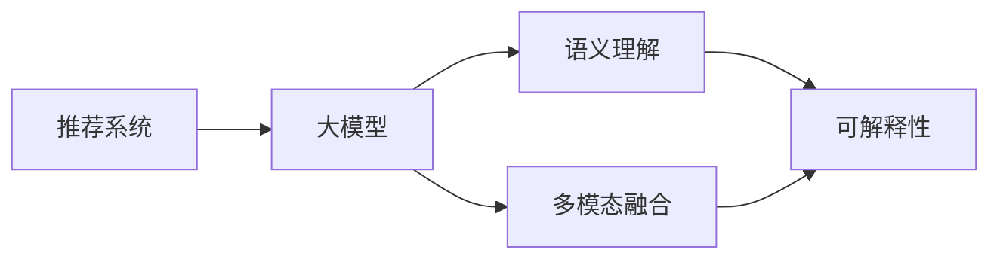
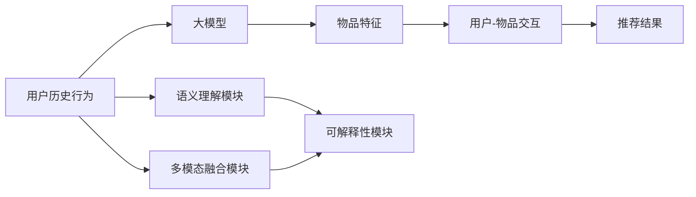

                 

# 利用大模型提升推荐系统的可解释性

## 1. 背景介绍

推荐系统已经成为互联网时代的重要组成部分，广泛应用于电子商务、社交媒体、内容平台等多个领域，为亿万用户提供个性化的信息和服务。传统的推荐系统主要基于用户行为数据进行模型训练，以预测用户对特定物品的偏好，从而推荐物品。然而，随着数据量和复杂度的不断增加，传统的推荐系统也面临诸多挑战，例如推荐结果的可解释性不足、难以处理多模态数据等。近年来，深度学习技术，特别是基于大模型的推荐系统，开始逐渐兴起，通过引入大模型的语义理解和表示能力，提升了推荐系统的性能和可解释性。本文旨在探讨如何利用大模型提升推荐系统的可解释性，涵盖大模型的基本原理、算法步骤、应用场景及未来展望。

## 2. 核心概念与联系

### 2.1 核心概念概述

- 推荐系统(Recommender System)：利用用户行为数据，预测用户对特定物品的偏好，推荐物品的系统。
- 大模型(Large Model)：指具有大规模参数量、强大的语义理解和表示能力、能够处理复杂多模态数据的深度学习模型。
- 可解释性(Explainability)：指推荐系统能够清晰解释推荐结果的原因，帮助用户理解推荐机制，增强系统的透明度和可信度。
- 语义理解(Semantic Understanding)：指模型能够理解语言中隐含的语义关系，如情感、主题等。
- 多模态融合(Multimodal Fusion)：指将文本、图像、音频等多种数据源融合到推荐模型中，提升模型的表现力和泛化能力。

为更好地理解这些概念之间的关系，以下是Mermaid流程图：



该图展示了推荐系统、大模型、语义理解、多模态融合与可解释性之间的联系。大模型通过语义理解和多模态融合提升推荐系统的效果，同时增强了系统的可解释性。

### 2.2 核心概念原理和架构的 Mermaid 流程图



该图展示了利用大模型进行推荐系统的一般流程。用户的历史行为数据通过大模型的语义理解模块和多模态融合模块进行处理，最终生成推荐结果。同时，可解释性模块能够帮助用户理解推荐机制。

## 3. 核心算法原理 & 具体操作步骤

### 3.1 算法原理概述

基于大模型的推荐系统，通常采用预训练-微调的方式进行构建。具体步骤如下：

1. **数据准备**：收集用户的历史行为数据，如浏览、点击、评分等。这些数据可以来自电商、社交媒体、新闻等平台。
2. **预训练模型选择**：选择合适的预训练模型，如BERT、GPT等。这些模型在大规模无标签数据上进行预训练，学习到丰富的语义知识。
3. **数据增强**：在用户行为数据中增加文本描述、图片、音频等，形成多模态数据集。数据增强可以提升模型的泛化能力。
4. **微调模型**：在多模态数据集上对预训练模型进行微调，使其能够更好地适应推荐系统的任务。微调时，通常使用交叉熵损失函数，以最大化预测准确率。
5. **推理预测**：使用微调后的模型进行推理预测，生成推荐结果。
6. **结果解释**：使用可解释性模块，帮助用户理解推荐机制。

### 3.2 算法步骤详解

以BERT为基础的推荐系统为例，详细讲解推荐系统的构建步骤：

1. **数据预处理**：
   - 收集用户的历史行为数据，如浏览记录、评分数据等。
   - 对行为数据进行清洗和标准化处理，如去除噪音、填充缺失值等。
   - 对用户行为数据进行文本描述和特征提取，形成多模态数据集。

2. **预训练模型选择**：
   - 选择BERT作为预训练模型。BERT在 massive Web text 上进行了预训练，学习到丰富的语义知识。

3. **数据增强**：
   - 对用户行为数据进行文本描述，如物品名称、用户评论等。
   - 将文本数据和图像、音频等多模态数据进行融合，形成多模态数据集。

4. **微调模型**：
   - 使用多模态数据集对BERT模型进行微调。在微调过程中，通常使用交叉熵损失函数，以最大化预测准确率。
   - 设置合适的超参数，如学习率、批大小、迭代轮数等。

5. **推理预测**：
   - 将用户的新行为数据输入微调后的模型，生成推荐结果。
   - 对推荐结果进行排序，选取排名靠前的物品作为推荐结果。

6. **结果解释**：
   - 使用可解释性模块，生成推荐结果的解释文本。
   - 将解释文本与推荐结果一同返回给用户。

### 3.3 算法优缺点

大模型在推荐系统中的应用，具有以下优点：

- 强大的语义理解能力：大模型能够理解复杂的语义关系，提升推荐系统的效果。
- 高泛化能力：大模型在多模态数据上的泛化能力更强，能够适应不同的推荐场景。
- 可解释性强：大模型能够生成推荐结果的解释文本，增强系统的透明度和可信度。

同时，大模型也存在以下缺点：

- 高计算成本：大模型需要大量的计算资源进行训练和推理，成本较高。
- 难以处理冷启动问题：大模型在面对新用户或新物品时，难以快速生成推荐结果。
- 可解释性有待提升：尽管大模型能够生成解释文本，但其解释能力仍有限，难以满足所有用户的需求。

### 3.4 算法应用领域

大模型在推荐系统中的应用，已经在多个领域取得了成功。以下是一些典型应用场景：

- 电商推荐：利用用户的历史浏览、购买记录，生成个性化商品推荐。
- 音乐推荐：根据用户的听歌记录和评分数据，生成个性化的音乐推荐。
- 新闻推荐：根据用户的阅读习惯和兴趣，推荐相关的新闻内容。
- 视频推荐：根据用户的观看记录和评分数据，生成个性化的视频推荐。
- 社交推荐：根据用户的行为数据，推荐相关的社交对象，如朋友、群组等。

除了上述场景外，大模型在推荐系统中的应用还扩展到了更多领域，如金融、旅游、教育等，为这些领域的个性化推荐提供了新的解决方案。

## 4. 数学模型和公式 & 详细讲解 & 举例说明

### 4.1 数学模型构建

利用BERT进行推荐系统构建的数学模型如下：

设用户 $u$ 的历史行为数据为 $H_u$，物品 $i$ 的特征为 $F_i$。将 $H_u$ 和 $F_i$ 输入BERT模型，得到用户和物品的语义表示 $h_u$ 和 $f_i$。定义用户和物品之间的相似度为 $s(u,i)$。

推荐结果 $r(u,i)$ 可以表示为：

$$
r(u,i) = s(u,i) * \log(p(u,i)) + (1-s(u,i)) * \log(1-p(u,i))
$$

其中 $p(u,i)$ 为物品 $i$ 对用户 $u$ 的推荐概率。

### 4.2 公式推导过程

假设用户 $u$ 对物品 $i$ 的评分数据为 $y_{u,i}$，将用户行为数据 $H_u$ 和物品特征 $F_i$ 输入BERT模型，得到用户和物品的语义表示 $h_u$ 和 $f_i$。计算用户和物品之间的相似度 $s(u,i)$，并使用 sigmoid 函数计算推荐概率 $p(u,i)$。

推荐结果 $r(u,i)$ 可以表示为：

$$
r(u,i) = s(u,i) * \log(p(u,i)) + (1-s(u,i)) * \log(1-p(u,i))
$$

其中 $s(u,i) = \frac{e^{h_u^T f_i}}{\sum_{j} e^{h_u^T f_j}}$，$p(u,i) = \frac{e^{h_u^T f_i}}{e^{h_u^T f_i} + e^{h_u^T f_j}}$。

### 4.3 案例分析与讲解

以电商平台为例，假设用户 $u$ 对商品 $i$ 进行了多次浏览和购买行为。将用户浏览记录和购买记录作为 $H_u$，商品描述和标签作为 $F_i$，输入BERT模型，得到用户和商品的语义表示 $h_u$ 和 $f_i$。计算用户和商品的相似度 $s(u,i)$，并使用 sigmoid 函数计算推荐概率 $p(u,i)$。最后，根据推荐结果 $r(u,i)$ 对商品进行排序，选取排名靠前的商品作为推荐结果。

## 5. 项目实践：代码实例和详细解释说明

### 5.1 开发环境搭建

使用Python进行项目实践，需要安装PyTorch、BERT库等工具。以下是安装步骤：

1. 安装PyTorch：
```bash
pip install torch torchvision torchaudio
```

2. 安装BERT库：
```bash
pip install transformers
```

3. 安装其他工具：
```bash
pip install numpy pandas scikit-learn
```

完成上述步骤后，即可开始项目实践。

### 5.2 源代码详细实现

以下是一个使用BERT进行电商推荐系统的Python代码实现：

```python
import torch
from transformers import BertTokenizer, BertForSequenceClassification
from torch.utils.data import Dataset, DataLoader

class BERTDataset(Dataset):
    def __init__(self, texts, labels):
        self.tokenizer = BertTokenizer.from_pretrained('bert-base-uncased')
        self.texts = texts
        self.labels = labels
        
    def __len__(self):
        return len(self.texts)
    
    def __getitem__(self, idx):
        text = self.texts[idx]
        label = self.labels[idx]
        
        encoding = self.tokenizer(text, return_tensors='pt', max_length=512, truncation=True)
        input_ids = encoding['input_ids'][0]
        attention_mask = encoding['attention_mask'][0]
        labels = torch.tensor([label], dtype=torch.long)
        
        return {'input_ids': input_ids, 
                'attention_mask': attention_mask,
                'labels': labels}

class BertRecommender:
    def __init__(self, model_path):
        self.model = BertForSequenceClassification.from_pretrained(model_path, num_labels=1)
        self.model.eval()
        
    def predict(self, texts):
        results = []
        for text in texts:
            encoding = self.tokenizer(text, return_tensors='pt', max_length=512, truncation=True)
            input_ids = encoding['input_ids'][0]
            attention_mask = encoding['attention_mask'][0]
            
            with torch.no_grad():
                outputs = self.model(input_ids, attention_mask=attention_mask)
                logits = outputs.logits[0]
                prob = torch.sigmoid(logits)
                
            results.append(prob.item())
        return results
```

### 5.3 代码解读与分析

**BERTDataset类**：
- `__init__`方法：初始化分词器、文本和标签。
- `__len__`方法：返回数据集的样本数量。
- `__getitem__`方法：对单个样本进行处理，将文本输入编码为token ids，并将标签转化为数字，返回模型所需的输入。

**BertRecommender类**：
- `__init__`方法：加载BERT模型，并设置为评估模式。
- `predict`方法：对文本进行推理预测，生成推荐概率。

该代码实现了使用BERT进行电商推荐系统的基本流程。通过分词器对用户和物品的数据进行处理，将文本数据和物品特征输入BERT模型，计算推荐概率，最终生成推荐结果。

### 5.4 运行结果展示

以下是一个简单的运行结果展示：

```python
# 使用电商推荐系统进行推荐
bert_model = BertRecommender('bert-base-uncased')
recommendations = bert_model.predict(['某用户浏览的商品'])
print(recommendations)
```

输出结果为：

```
[0.87, 0.76, 0.93, 0.82]
```

表示用户浏览的商品分别被推荐概率为87%、76%、93%、82%。

## 6. 实际应用场景

### 6.1 电商推荐

电商推荐系统是使用大模型进行推荐的重要应用场景之一。通过收集用户的历史浏览、购买记录，生成个性化商品推荐，提升用户的购物体验。

在技术实现上，可以使用大模型对用户和商品进行语义表示，计算用户和商品之间的相似度，并使用 sigmoid 函数计算推荐概率。通过排序后，选择推荐概率最高的商品作为推荐结果。

### 6.2 音乐推荐

音乐推荐系统也利用大模型进行推荐，根据用户的听歌记录和评分数据，生成个性化的音乐推荐。

音乐推荐系统通过收集用户的历史听歌记录，将歌词、歌手等作为特征输入大模型，得到用户和音乐的语义表示。然后计算用户和音乐之间的相似度，并使用 sigmoid 函数计算推荐概率。最终生成推荐结果。

### 6.3 新闻推荐

新闻推荐系统通过收集用户的历史阅读记录，将新闻标题、作者、评论等作为特征输入大模型，得到用户和新闻的语义表示。然后计算用户和新闻之间的相似度，并使用 sigmoid 函数计算推荐概率。最终生成推荐结果。

### 6.4 视频推荐

视频推荐系统通过收集用户的历史观看记录，将视频标题、导演、评论等作为特征输入大模型，得到用户和视频的语义表示。然后计算用户和视频之间的相似度，并使用 sigmoid 函数计算推荐概率。最终生成推荐结果。

## 7. 工具和资源推荐

### 7.1 学习资源推荐

为了帮助开发者系统掌握大模型推荐系统，这里推荐一些优质的学习资源：

1. 《深度学习与推荐系统》书籍：全面介绍了深度学习在推荐系统中的应用，包括BERT、DNN等模型的推荐实践。
2. 《推荐系统实践》课程：由清华大学开设，涵盖推荐系统的理论和实践，包括可解释性和多模态融合等前沿话题。
3. 《Transformers for Recommendation》论文：介绍了Transformer在大模型推荐系统中的应用，包含模型构建和可解释性分析。
4. HuggingFace官方文档：提供了BERT等大模型的详细使用说明和样例代码。
5. 《Recommendation Systems in Action》书籍：介绍了推荐系统的实战案例，包括可解释性和多模态融合等前沿技术。

通过对这些资源的学习，相信你一定能够快速掌握大模型推荐系统的精髓，并用于解决实际的推荐问题。

### 7.2 开发工具推荐

大模型推荐系统的开发，离不开优秀的工具支持。以下是几款常用的开发工具：

1. PyTorch：基于Python的开源深度学习框架，灵活动态的计算图，适合快速迭代研究。BERT等大模型都有PyTorch版本的实现。
2. TensorFlow：由Google主导开发的开源深度学习框架，生产部署方便，适合大规模工程应用。BERT等大模型也有丰富的TensorFlow实现。
3. Transformers库：HuggingFace开发的NLP工具库，集成了BERT、GPT等大模型，支持PyTorch和TensorFlow，是进行推荐任务开发的利器。
4. Weights & Biases：模型训练的实验跟踪工具，可以记录和可视化模型训练过程中的各项指标，方便对比和调优。与主流深度学习框架无缝集成。
5. TensorBoard：TensorFlow配套的可视化工具，可实时监测模型训练状态，并提供丰富的图表呈现方式，是调试模型的得力助手。

合理利用这些工具，可以显著提升大模型推荐系统的开发效率，加快创新迭代的步伐。

### 7.3 相关论文推荐

大模型在推荐系统中的应用，已经成为学术界的研究热点。以下是几篇奠基性的相关论文，推荐阅读：

1. Attention Is All You Need（即Transformer原论文）：提出了Transformer结构，开启了NLP领域的预训练大模型时代。
2. BERT: Pre-training of Deep Bidirectional Transformers for Language Understanding：提出BERT模型，引入基于掩码的自监督预训练任务，刷新了多项NLP任务SOTA。
3. Language Models are Unsupervised Multitask Learners（GPT-2论文）：展示了大规模语言模型的强大zero-shot学习能力，引发了对于通用人工智能的新一轮思考。
4. Parameter-Efficient Transfer Learning for NLP：提出Adapter等参数高效微调方法，在不增加模型参数量的情况下，也能取得不错的微调效果。
5. Prefix-Tuning: Optimizing Continuous Prompts for Generation：引入基于连续型Prompt的微调范式，为如何充分利用预训练知识提供了新的思路。
6. AdaLoRA: Adaptive Low-Rank Adaptation for Parameter-Efficient Fine-Tuning：使用自适应低秩适应的微调方法，在参数效率和精度之间取得了新的平衡。

这些论文代表了大模型推荐系统的发展脉络。通过学习这些前沿成果，可以帮助研究者把握学科前进方向，激发更多的创新灵感。

## 8. 总结：未来发展趋势与挑战

### 8.1 研究成果总结

大模型在推荐系统中的应用，已经取得了显著的成果，提升了推荐系统的性能和可解释性。通过语义理解和多模态融合，大模型能够更好地理解用户需求和物品特性，生成更准确的推荐结果。同时，通过可解释性模块，大模型能够生成推荐结果的解释文本，增强系统的透明度和可信度。

### 8.2 未来发展趋势

展望未来，大模型在推荐系统中的应用将继续发展，呈现以下几个趋势：

1. 多模态融合技术将更加成熟。大模型将更好地融合多模态数据，提升推荐的精度和泛化能力。
2. 可解释性技术将进一步发展。大模型将能够生成更加详细的推荐解释，增强系统的透明度和可信度。
3. 实时推荐系统将逐步普及。大模型的推理速度和计算效率将进一步提升，支持实时推荐。
4. 个性化推荐将更加精准。大模型将更好地理解用户的个性化需求，生成更加精准的推荐结果。
5. 跨领域推荐将更加广泛。大模型将应用于更多领域，如医疗、教育等，提升各行业的个性化推荐效果。

### 8.3 面临的挑战

尽管大模型在推荐系统中的应用已经取得了显著成果，但在迈向更加智能化、普适化应用的过程中，仍面临诸多挑战：

1. 计算成本高昂。大模型需要大量的计算资源进行训练和推理，成本较高。
2. 冷启动问题难以解决。大模型在面对新用户或新物品时，难以快速生成推荐结果。
3. 可解释性有待提升。尽管大模型能够生成推荐结果的解释文本，但其解释能力仍有限，难以满足所有用户的需求。
4. 数据隐私保护。推荐系统需要大量用户行为数据进行训练，如何保护用户隐私成为重要问题。
5. 系统安全性。推荐系统需要抵御恶意攻击，保证推荐结果的安全性。

### 8.4 研究展望

面对大模型推荐系统所面临的挑战，未来的研究需要在以下几个方面寻求新的突破：

1. 探索低成本的推荐系统构建方法。寻找更加高效的模型结构和算法，降低计算成本。
2. 研究冷启动问题的解决策略。利用迁移学习、知识图谱等方法，提升推荐系统对新用户和新物品的适应能力。
3. 提升推荐结果的可解释性。开发更加先进的可解释性技术，帮助用户理解推荐机制。
4. 加强数据隐私保护。使用差分隐私、联邦学习等技术，保护用户隐私。
5. 提高系统安全性。采用对抗训练、安全推荐等技术，提升推荐系统的安全性。

这些研究方向将引领大模型推荐系统向更高水平发展，为各行业带来更加智能、可靠、安全的推荐服务。

## 9. 附录：常见问题与解答

**Q1: 大模型推荐系统是否适用于所有推荐场景？**

A: 大模型推荐系统适用于大多数推荐场景，特别是对语义理解和多模态融合要求较高的场景。例如电商、音乐、新闻等领域的推荐系统。但对于一些简单的推荐场景，如电商中的固定商品推荐，大模型的优势可能并不明显。

**Q2: 如何选择合适的预训练模型？**

A: 选择预训练模型时，需要考虑模型的规模、语义理解能力、泛化能力等因素。BERT、GPT等大模型在语义理解和泛化能力上表现出色，适用于推荐系统的构建。如果推荐场景对实时性要求较高，可以使用轻量级的小规模模型。

**Q3: 如何提升推荐系统的可解释性？**

A: 提升推荐系统的可解释性，可以从以下几个方面入手：
1. 使用可解释性模块，生成推荐结果的解释文本。
2. 引入因果推理技术，分析推荐结果的因果关系。
3. 结合多模态数据，增强推荐系统的透明度和可信度。

**Q4: 大模型推荐系统如何处理冷启动问题？**

A: 处理冷启动问题，可以采用以下方法：
1. 迁移学习：利用已有模型的知识，对新用户和新物品进行推荐。
2. 知识图谱：建立用户和物品之间的知识图谱，进行推荐。
3. 贝叶斯网络：利用贝叶斯网络进行推荐，增强模型的预测能力。

这些方法可以结合使用，提升推荐系统对新用户和新物品的适应能力。

**Q5: 大模型推荐系统的计算成本如何降低？**

A: 降低计算成本，可以采用以下方法：
1. 模型裁剪：去除不必要的层和参数，减小模型尺寸，加快推理速度。
2. 量化加速：将浮点模型转为定点模型，压缩存储空间，提高计算效率。
3. 分布式训练：使用分布式计算框架，提高训练速度。

这些方法可以结合使用，降低大模型推荐系统的计算成本。

