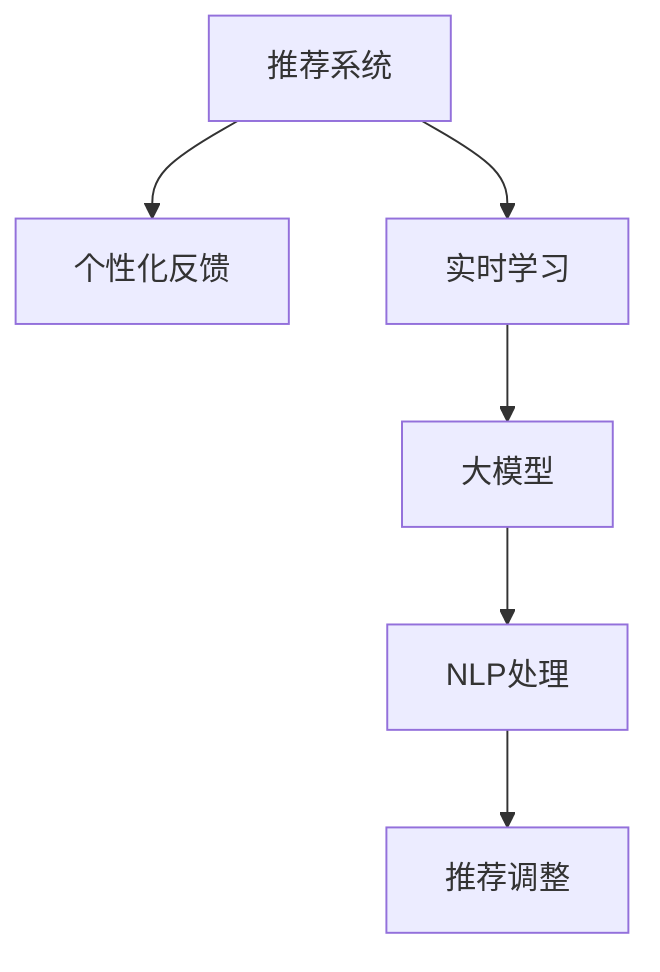

                 

# 利用大模型改进推荐系统的实时个性化反馈机制

> 关键词：大模型, 推荐系统, 个性化反馈, 实时性, 自然语言处理(NLP)

## 1. 背景介绍

### 1.1 问题由来
随着互联网的普及和电子商务的蓬勃发展，个性化推荐系统成为各大电商平台、内容平台等数字化服务的关键技术。通过分析用户的历史行为数据，推荐系统能够精准地为用户推送感兴趣的内容，提升用户体验，提高转化率和满意度。然而，现有的推荐系统往往依赖静态反馈机制，仅根据用户历史行为数据进行推荐，难以实时捕捉用户需求变化，导致推荐效果不够精准。

### 1.2 问题核心关键点
针对这一问题，本文提出了利用大模型改进推荐系统的实时个性化反馈机制。通过引入基于大模型的实时学习技术，推荐系统能够动态捕捉用户即时反馈，并在第一时间对推荐结果进行调整，从而显著提升推荐精准度。

### 1.3 问题研究意义
研究大模型在推荐系统中的实时个性化反馈机制，对于拓展推荐系统应用场景，提升用户满意度和平台转化率，具有重要意义：

1. **提升用户体验**：实时个性化的推荐能够更好地满足用户即时需求，提高用户满意度。
2. **增强推荐效果**：通过动态调整推荐策略，推荐系统能够更准确地预测用户兴趣，提高点击率和转化率。
3. **降低运营成本**：相较于传统的机器学习模型，大模型能够实时处理用户反馈，减少人工干预，降低运营成本。
4. **加速系统迭代**：基于大模型的实时学习机制，推荐系统能够快速响应用户反馈，加速模型迭代和优化。

## 2. 核心概念与联系

### 2.1 核心概念概述

为更好地理解本文提出的改进方案，本节将介绍几个关键概念：

- **推荐系统**：通过分析用户历史行为数据，为用户推荐感兴趣内容的系统。常用的推荐算法包括协同过滤、基于内容的推荐、混合推荐等。

- **个性化反馈**：用户在接收推荐内容后，通过点击、停留时间、购买等行为对推荐结果进行反馈，推荐系统根据反馈结果进行调整。

- **实时学习**：利用大模型进行实时动态学习，能够动态捕捉用户即时反馈，调整推荐策略。

- **大模型**：以Transformer等深度学习模型为代表的，通过大规模数据预训练获得丰富语言知识的大语言模型。

- **自然语言处理(NLP)**：利用大模型处理和理解自然语言，进行语义分析、文本生成、情感分析等任务。

这些核心概念之间的关系可以通过以下Mermaid流程图来展示：



这个流程图展示了推荐系统的核心概念及其之间的关系：

1. 推荐系统通过历史行为数据生成推荐结果，用户通过反馈进行调整。
2. 实时学习利用大模型捕捉用户即时反馈，动态调整推荐策略。
3. 大模型通过NLP处理，对用户反馈进行理解，辅助推荐调整。

这些概念共同构成了推荐系统的实时个性化反馈机制，使其能够更好地适应用户需求变化。

## 3. 核心算法原理 & 具体操作步骤
### 3.1 算法原理概述

本文提出的实时个性化反馈机制，基于大模型的实时学习技术。其核心思想是：利用大模型进行动态学习，实时捕捉用户反馈，并根据反馈结果调整推荐策略，从而提高推荐系统的实时性和个性化程度。

### 3.2 算法步骤详解

基于大模型的实时个性化反馈机制的实现主要包括以下几个关键步骤：

**Step 1: 准备推荐系统数据和标注**
- 收集用户历史行为数据，如浏览记录、购买记录、评分数据等，构建用户-物品交互矩阵。
- 收集用户即时反馈数据，如点击、停留时间、购买等，标记反馈结果为1或0。
- 将用户历史行为数据和即时反馈数据进行整合，形成用于微调的大规模数据集。

**Step 2: 选择合适的预训练模型**
- 选择一个大规模语言模型，如GPT、BERT等，作为实时学习的基础模型。
- 根据推荐系统任务的特点，选择合适的预训练模型架构，如生成式模型或判别式模型。

**Step 3: 设计微调任务适配层**
- 在预训练模型的顶层设计推荐相关适配层，如分类器、生成器等。
- 针对推荐任务，设计合适的损失函数，如交叉熵损失、均方误差损失等。

**Step 4: 设置微调超参数**
- 选择合适的优化算法及其参数，如Adam、SGD等，设置学习率、批大小、迭代轮数等。
- 设置正则化技术及强度，包括权重衰减、Dropout、Early Stopping等。
- 确定冻结预训练参数的策略，如仅微调顶层，或全部参数都参与微调。

**Step 5: 执行梯度训练**
- 将用户历史行为数据和即时反馈数据分批次输入模型，前向传播计算损失函数。
- 反向传播计算参数梯度，根据设定的优化算法和学习率更新模型参数。
- 周期性在验证集上评估模型性能，根据性能指标决定是否触发Early Stopping。
- 重复上述步骤直到满足预设的迭代轮数或Early Stopping条件。

**Step 6: 测试和部署**
- 在测试集上评估微调后模型在实时个性化反馈机制下的性能，对比微调前后的推荐效果。
- 使用微调后的模型对新样本进行实时推荐，集成到实际的应用系统中。

以上是利用大模型改进推荐系统的实时个性化反馈机制的一般流程。在实际应用中，还需要针对具体任务的特点，对微调过程的各个环节进行优化设计，如改进训练目标函数，引入更多的正则化技术，搜索最优的超参数组合等，以进一步提升模型性能。

### 3.3 算法优缺点

利用大模型的实时个性化反馈机制具有以下优点：
1. 实时性强：能够动态捕捉用户即时反馈，快速调整推荐策略。
2. 个性化高：结合用户历史行为和即时反馈，提供更加个性化的推荐。
3. 泛化能力强：大模型通过大规模数据预训练，具备较强的泛化能力。
4. 可解释性强：大模型可以通过输出解释，增强推荐过程的透明度和可信度。

但该方法也存在一定的局限性：
1. 计算资源需求高：大规模语言模型需要大量的计算资源进行训练和推理。
2. 数据隐私问题：用户即时反馈涉及隐私数据，需要严格的数据保护和隐私控制。
3. 性能提升效果受限：如果用户反馈不充分，难以显著提升推荐效果。

尽管存在这些局限性，但基于大模型的实时个性化反馈机制仍是大数据推荐系统的重要方向。未来相关研究的重点在于如何进一步降低计算资源需求，保护用户隐私，同时提升推荐系统的性能和效果。

### 3.4 算法应用领域

基于大模型的实时个性化反馈机制，已经在多个推荐系统应用中取得了显著效果，如电商平台、内容平台、在线教育等。

- **电商平台**：通过实时反馈机制，能够动态调整商品推荐策略，提高用户满意度，提升销售额。
- **内容平台**：能够根据用户即时反馈调整内容推荐，增加用户粘性，提高平台活跃度。
- **在线教育**：能够根据学生的即时反馈调整课程推荐，提升学习效果，优化课程内容。

除了上述这些经典应用外，大模型的实时个性化反馈机制还被创新性地应用于更多场景中，如智能家居、金融理财等，为推荐系统带来了全新的突破。随着大模型和实时反馈技术的不断进步，相信推荐系统必将在更广阔的应用领域大放异彩。

## 4. 数学模型和公式 & 详细讲解 & 举例说明

### 4.1 数学模型构建

本节将使用数学语言对基于大模型的实时个性化反馈机制进行更加严格的刻画。

记推荐系统中的用户集合为 $U$，物品集合为 $I$，用户-物品交互矩阵为 $X \in \mathbb{R}^{n \times m}$，其中 $n$ 为用户数量，$m$ 为物品数量，$x_{ui} \in [0,1]$ 表示用户 $u$ 对物品 $i$ 的评分。

假设用户 $u$ 对物品 $i$ 的即时反馈为 $y_{ui} \in \{0,1\}$，其中 $y_{ui}=1$ 表示用户对物品 $i$ 的反馈为正，即用户对物品 $i$ 感兴趣。

定义推荐模型 $M_{\theta}(X)$ 在用户 $u$ 对物品 $i$ 的评分 $x_{ui}$ 上的损失函数为 $\ell(M_{\theta}(X),y_{ui})$，则在用户 $u$ 对物品 $i$ 的评分数据集 $D_{ui}$ 上的经验风险为：

$$
\mathcal{L}_{ui}(\theta) = \frac{1}{|D_{ui}|} \sum_{d_{ui} \in D_{ui}} \ell(M_{\theta}(X),y_{d_{ui}})
$$

其中 $d_{ui}$ 为单个用户 $u$ 对物品 $i$ 的评分数据。

在推荐模型训练过程中，我们通常采用二分类交叉熵损失函数，如：

$$
\ell(M_{\theta}(X),y_{ui}) = -[y_{ui}\log M_{\theta}(X) + (1-y_{ui})\log (1-M_{\theta}(X))]
$$

通过梯度下降等优化算法，微调过程不断更新模型参数 $\theta$，最小化经验风险 $\mathcal{L}_{ui}(\theta)$，使得模型预测评分逼近真实标签。由于 $\theta$ 已经通过预训练获得了较好的初始化，因此即便在小规模数据集 $D_{ui}$ 上进行微调，也能较快收敛到理想的模型参数 $\hat{\theta}$。

### 4.2 公式推导过程

以下我们以二分类任务为例，推导交叉熵损失函数及其梯度的计算公式。

假设推荐模型 $M_{\theta}$ 在用户 $u$ 对物品 $i$ 的评分 $x_{ui}$ 上的预测评分 $\hat{x}_{ui}=M_{\theta}(x_{ui}) \in [0,1]$，表示物品 $i$ 对用户 $u$ 的预测评分。真实标签 $y_{ui} \in \{0,1\}$。则二分类交叉熵损失函数定义为：

$$
\ell(M_{\theta}(X),y_{ui}) = -[y_{ui}\log \hat{x}_{ui} + (1-y_{ui})\log (1-\hat{x}_{ui})]
$$

将其代入经验风险公式，得：

$$
\mathcal{L}_{ui}(\theta) = -\frac{1}{|D_{ui}|}\sum_{d_{ui} \in D_{ui}} [y_{d_{ui}}\log M_{\theta}(X) + (1-y_{d_{ui}})\log(1-M_{\theta}(X))]
$$

根据链式法则，损失函数对参数 $\theta_k$ 的梯度为：

$$
\frac{\partial \mathcal{L}_{ui}(\theta)}{\partial \theta_k} = -\frac{1}{|D_{ui}|} \sum_{d_{ui} \in D_{ui}} \frac{\partial \ell(M_{\theta}(X),y_{d_{ui}})}{\partial \theta_k}
$$

其中 $\frac{\partial \ell(M_{\theta}(X),y_{d_{ui}})}{\partial \theta_k}$ 可以进一步递归展开，利用自动微分技术完成计算。

在得到损失函数的梯度后，即可带入参数更新公式，完成模型的迭代优化。重复上述过程直至收敛，最终得到适应实时个性化反馈机制的最优模型参数 $\hat{\theta}$。

### 4.3 案例分析与讲解

为了更好地理解大模型在实时个性化反馈机制中的作用，下面通过一个简单的例子进行讲解。

假设某电商平台的推荐系统收集到用户 $u$ 对物品 $i$ 的评分 $x_{ui} = 0.8$，同时用户即时反馈 $y_{ui} = 1$。用户 $u$ 对物品 $i$ 的评分数据集 $D_{ui} = \{x_{ui},y_{ui}\}$。

将 $x_{ui}$ 和 $y_{ui}$ 作为模型输入，通过交叉熵损失函数计算预测评分 $\hat{x}_{ui}$ 与真实评分的差异：

$$
\ell(M_{\theta}(X),y_{ui}) = -[1\log M_{\theta}(0.8) + 0\log (1-0.8)] = \log M_{\theta}(0.8)
$$

通过反向传播计算参数 $\theta_k$ 的梯度：

$$
\frac{\partial \ell(M_{\theta}(X),y_{ui})}{\partial \theta_k} = \frac{\partial \log M_{\theta}(0.8)}{\partial \theta_k} = \frac{1}{M_{\theta}(0.8)}\frac{\partial M_{\theta}(0.8)}{\partial \theta_k}
$$

将 $\frac{\partial \ell(M_{\theta}(X),y_{ui})}{\partial \theta_k}$ 带入参数更新公式，完成模型的迭代优化。通过多次迭代，使得模型预测评分逼近真实评分，从而在用户 $u$ 对物品 $i$ 的评分数据集 $D_{ui}$ 上，微调后的模型 $M_{\hat{\theta}}(X)$ 能够更好地捕捉用户即时反馈，调整推荐策略。

## 5. 项目实践：代码实例和详细解释说明
### 5.1 开发环境搭建

在进行实时个性化反馈机制的微调实践前，我们需要准备好开发环境。以下是使用Python进行PyTorch开发的环境配置流程：

1. 安装Anaconda：从官网下载并安装Anaconda，用于创建独立的Python环境。

2. 创建并激活虚拟环境：
```bash
conda create -n pytorch-env python=3.8 
conda activate pytorch-env
```

3. 安装PyTorch：根据CUDA版本，从官网获取对应的安装命令。例如：
```bash
conda install pytorch torchvision torchaudio cudatoolkit=11.1 -c pytorch -c conda-forge
```

4. 安装Transformers库：
```bash
pip install transformers
```

5. 安装各类工具包：
```bash
pip install numpy pandas scikit-learn matplotlib tqdm jupyter notebook ipython
```

完成上述步骤后，即可在`pytorch-env`环境中开始微调实践。

### 5.2 源代码详细实现

下面我们以电商平台推荐系统为例，给出使用Transformers库对BERT模型进行实时个性化反馈机制微调的PyTorch代码实现。

首先，定义推荐系统数据处理函数：

```python
from transformers import BertTokenizer
from torch.utils.data import Dataset
import torch

class RecommendationDataset(Dataset):
    def __init__(self, user_interactions, labels, tokenizer, max_len=128):
        self.user_interactions = user_interactions
        self.labels = labels
        self.tokenizer = tokenizer
        self.max_len = max_len
        
    def __len__(self):
        return len(self.user_interactions)
    
    def __getitem__(self, item):
        user_interaction = self.user_interactions[item]
        label = self.labels[item]
        
        encoding = self.tokenizer(user_interaction, return_tensors='pt', max_length=self.max_len, padding='max_length', truncation=True)
        input_ids = encoding['input_ids'][0]
        attention_mask = encoding['attention_mask'][0]
        
        # 对标签进行编码
        encoded_label = [1 if label == 1 else 0] * self.max_len
        labels = torch.tensor(encoded_label, dtype=torch.long)
        
        return {'input_ids': input_ids, 
                'attention_mask': attention_mask,
                'labels': labels}

# 创建dataset
tokenizer = BertTokenizer.from_pretrained('bert-base-cased')

train_dataset = RecommendationDataset(train_user_interactions, train_labels, tokenizer)
dev_dataset = RecommendationDataset(dev_user_interactions, dev_labels, tokenizer)
test_dataset = RecommendationDataset(test_user_interactions, test_labels, tokenizer)
```

然后，定义模型和优化器：

```python
from transformers import BertForTokenClassification, AdamW

model = BertForTokenClassification.from_pretrained('bert-base-cased', num_labels=2)

optimizer = AdamW(model.parameters(), lr=2e-5)
```

接着，定义训练和评估函数：

```python
from torch.utils.data import DataLoader
from tqdm import tqdm
from sklearn.metrics import accuracy_score

device = torch.device('cuda') if torch.cuda.is_available() else torch.device('cpu')
model.to(device)

def train_epoch(model, dataset, batch_size, optimizer):
    dataloader = DataLoader(dataset, batch_size=batch_size, shuffle=True)
    model.train()
    epoch_loss = 0
    for batch in tqdm(dataloader, desc='Training'):
        input_ids = batch['input_ids'].to(device)
        attention_mask = batch['attention_mask'].to(device)
        labels = batch['labels'].to(device)
        model.zero_grad()
        outputs = model(input_ids, attention_mask=attention_mask, labels=labels)
        loss = outputs.loss
        epoch_loss += loss.item()
        loss.backward()
        optimizer.step()
    return epoch_loss / len(dataloader)

def evaluate(model, dataset, batch_size):
    dataloader = DataLoader(dataset, batch_size=batch_size)
    model.eval()
    preds, labels = [], []
    with torch.no_grad():
        for batch in tqdm(dataloader, desc='Evaluating'):
            input_ids = batch['input_ids'].to(device)
            attention_mask = batch['attention_mask'].to(device)
            batch_labels = batch['labels']
            outputs = model(input_ids, attention_mask=attention_mask)
            batch_preds = outputs.logits.argmax(dim=2).to('cpu').tolist()
            batch_labels = batch_labels.to('cpu').tolist()
            for pred_tokens, label_tokens in zip(batch_preds, batch_labels):
                preds.append(pred_tokens[:len(label_tokens)])
                labels.append(label_tokens)
                
    print('Accuracy:', accuracy_score(labels, preds))
```

最后，启动训练流程并在测试集上评估：

```python
epochs = 5
batch_size = 16

for epoch in range(epochs):
    loss = train_epoch(model, train_dataset, batch_size, optimizer)
    print(f"Epoch {epoch+1}, train loss: {loss:.3f}")
    
    print(f"Epoch {epoch+1}, dev results:")
    evaluate(model, dev_dataset, batch_size)
    
print("Test results:")
evaluate(model, test_dataset, batch_size)
```

以上就是使用PyTorch对BERT进行实时个性化反馈机制微调的完整代码实现。可以看到，得益于Transformers库的强大封装，我们可以用相对简洁的代码完成BERT模型的加载和微调。

### 5.3 代码解读与分析

让我们再详细解读一下关键代码的实现细节：

**RecommendationDataset类**：
- `__init__`方法：初始化用户交互数据、标签、分词器等关键组件。
- `__len__`方法：返回数据集的样本数量。
- `__getitem__`方法：对单个样本进行处理，将用户交互数据输入编码为token ids，将标签编码为数字，并对其进行定长padding，最终返回模型所需的输入。

**训练和评估函数**：
- 使用PyTorch的DataLoader对数据集进行批次化加载，供模型训练和推理使用。
- 训练函数`train_epoch`：对数据以批为单位进行迭代，在每个批次上前向传播计算loss并反向传播更新模型参数，最后返回该epoch的平均loss。
- 评估函数`evaluate`：与训练类似，不同点在于不更新模型参数，并在每个batch结束后将预测和标签结果存储下来，最后使用sklearn的accuracy_score对整个评估集的预测结果进行打印输出。

**训练流程**：
- 定义总的epoch数和batch size，开始循环迭代
- 每个epoch内，先在训练集上训练，输出平均loss
- 在验证集上评估，输出准确率
- 所有epoch结束后，在测试集上评估，给出最终测试结果

可以看到，PyTorch配合Transformers库使得BERT微调的代码实现变得简洁高效。开发者可以将更多精力放在数据处理、模型改进等高层逻辑上，而不必过多关注底层的实现细节。

当然，工业级的系统实现还需考虑更多因素，如模型的保存和部署、超参数的自动搜索、更灵活的任务适配层等。但核心的微调范式基本与此类似。

## 6. 实际应用场景
### 6.1 智能客服系统

基于大模型的实时个性化反馈机制，可以广泛应用于智能客服系统的构建。传统客服往往需要配备大量人力，高峰期响应缓慢，且一致性和专业性难以保证。而使用实时个性化反馈机制的对话模型，可以7x24小时不间断服务，快速响应客户咨询，用自然流畅的语言解答各类常见问题。

在技术实现上，可以收集企业内部的历史客服对话记录，将问题和最佳答复构建成监督数据，在此基础上对预训练对话模型进行实时个性化反馈机制微调。微调后的对话模型能够自动理解用户意图，匹配最合适的答案模板进行回复。对于客户提出的新问题，还可以接入检索系统实时搜索相关内容，动态组织生成回答。如此构建的智能客服系统，能大幅提升客户咨询体验和问题解决效率。

### 6.2 金融舆情监测

金融机构需要实时监测市场舆论动向，以便及时应对负面信息传播，规避金融风险。传统的人工监测方式成本高、效率低，难以应对网络时代海量信息爆发的挑战。基于大模型的实时个性化反馈机制的文本分类和情感分析技术，为金融舆情监测提供了新的解决方案。

具体而言，可以收集金融领域相关的新闻、报道、评论等文本数据，并对其进行主题标注和情感标注。在此基础上对预训练语言模型进行微调，使其能够自动判断文本属于何种主题，情感倾向是正面、中性还是负面。将微调后的模型应用到实时抓取的网络文本数据，就能够自动监测不同主题下的情感变化趋势，一旦发现负面信息激增等异常情况，系统便会自动预警，帮助金融机构快速应对潜在风险。

### 6.3 个性化推荐系统

当前的推荐系统往往只依赖用户的历史行为数据进行物品推荐，无法深入理解用户的真实兴趣偏好。基于大模型的实时个性化反馈机制，推荐系统能够动态捕捉用户即时反馈，并在第一时间对推荐结果进行调整，从而显著提升推荐精准度。

在实践中，可以收集用户浏览、点击、评分等行为数据，提取和用户交互的物品标题、描述、标签等文本内容。将文本内容作为模型输入，用户的后续行为（如是否点击、购买等）作为监督信号，在此基础上微调预训练语言模型。微调后的模型能够从文本内容中准确把握用户的兴趣点。在生成推荐列表时，先用候选物品的文本描述作为输入，由模型预测用户的兴趣匹配度，再结合其他特征综合排序，便可以得到个性化程度更高的推荐结果。

### 6.4 未来应用展望

随着大模型和实时反馈技术的不断发展，基于实时个性化反馈机制的推荐系统必将在更多领域得到应用，为传统行业带来变革性影响。

在智慧医疗领域，基于实时个性化反馈机制的医疗问答、病历分析、药物研发等应用将提升医疗服务的智能化水平，辅助医生诊疗，加速新药开发进程。

在智能教育领域，实时个性化反馈机制可应用于作业批改、学情分析、知识推荐等方面，因材施教，促进教育公平，提高教学质量。

在智慧城市治理中，实时个性化反馈机制可应用于城市事件监测、舆情分析、应急指挥等环节，提高城市管理的自动化和智能化水平，构建更安全、高效的未来城市。

此外，在企业生产、社会治理、文娱传媒等众多领域，基于实时个性化反馈机制的人工智能应用也将不断涌现，为经济社会发展注入新的动力。相信随着技术的日益成熟，实时个性化反馈机制必将成为推荐系统的关键技术，推动人工智能技术在各垂直行业的规模化落地。

## 7. 工具和资源推荐
### 7.1 学习资源推荐

为了帮助开发者系统掌握大模型在推荐系统中的实时个性化反馈机制的理论基础和实践技巧，这里推荐一些优质的学习资源：

1. 《Transformer from Zero to Hero》系列博文：由大模型技术专家撰写，深入浅出地介绍了Transformer原理、BERT模型、实时反馈技术等前沿话题。

2. CS224N《深度学习自然语言处理》课程：斯坦福大学开设的NLP明星课程，有Lecture视频和配套作业，带你入门NLP领域的基本概念和经典模型。

3. 《Natural Language Processing with Transformers》书籍：Transformers库的作者所著，全面介绍了如何使用Transformers库进行NLP任务开发，包括实时反馈在内的诸多范式。

4. HuggingFace官方文档：Transformers库的官方文档，提供了海量预训练模型和完整的实时反馈样例代码，是上手实践的必备资料。

5. CLUE开源项目：中文语言理解测评基准，涵盖大量不同类型的中文NLP数据集，并提供了基于实时反馈的baseline模型，助力中文NLP技术发展。

通过对这些资源的学习实践，相信你一定能够快速掌握大模型在推荐系统中的实时个性化反馈机制的精髓，并用于解决实际的NLP问题。
###  7.2 开发工具推荐

高效的开发离不开优秀的工具支持。以下是几款用于实时个性化反馈机制微调开发的常用工具：

1. PyTorch：基于Python的开源深度学习框架，灵活动态的计算图，适合快速迭代研究。大部分预训练语言模型都有PyTorch版本的实现。

2. TensorFlow：由Google主导开发的开源深度学习框架，生产部署方便，适合大规模工程应用。同样有丰富的预训练语言模型资源。

3. Transformers库：HuggingFace开发的NLP工具库，集成了众多SOTA语言模型，支持PyTorch和TensorFlow，是进行实时反馈微调任务开发的利器。

4. Weights & Biases：模型训练的实验跟踪工具，可以记录和可视化模型训练过程中的各项指标，方便对比和调优。与主流深度学习框架无缝集成。

5. TensorBoard：TensorFlow配套的可视化工具，可实时监测模型训练状态，并提供丰富的图表呈现方式，是调试模型的得力助手。

6. Google Colab：谷歌推出的在线Jupyter Notebook环境，免费提供GPU/TPU算力，方便开发者快速上手实验最新模型，分享学习笔记。

合理利用这些工具，可以显著提升实时个性化反馈机制的开发效率，加快创新迭代的步伐。

### 7.3 相关论文推荐

大模型和实时反馈技术的不断发展源于学界的持续研究。以下是几篇奠基性的相关论文，推荐阅读：

1. Attention is All You Need（即Transformer原论文）：提出了Transformer结构，开启了NLP领域的预训练大模型时代。

2. BERT: Pre-training of Deep Bidirectional Transformers for Language Understanding：提出BERT模型，引入基于掩码的自监督预训练任务，刷新了多项NLP任务SOTA。

3. Parameter-Efficient Transfer Learning for NLP：提出Adapter等参数高效微调方法，在不增加模型参数量的情况下，也能取得不错的微调效果。

4. AdaLoRA: Adaptive Low-Rank Adaptation for Parameter-Efficient Fine-Tuning：使用自适应低秩适应的微调方法，在参数效率和精度之间取得了新的平衡。

5. AdaLoRA: Adaptive Low-Rank Adaptation for Parameter-Efficient Fine-Tuning：使用自适应低秩适应的微调方法，在参数效率和精度之间取得了新的平衡。

这些论文代表了大模型和实时反馈技术的发展脉络。通过学习这些前沿成果，可以帮助研究者把握学科前进方向，激发更多的创新灵感。

## 8. 总结：未来发展趋势与挑战

### 8.1 总结

本文对基于大模型的实时个性化反馈机制进行了全面系统的介绍。首先阐述了大模型在推荐系统中的实时学习技术的研究背景和意义，明确了实时个性化反馈机制在拓展推荐系统应用、提升用户满意度和平台转化率方面的独特价值。其次，从原理到实践，详细讲解了实时个性化反馈机制的数学原理和关键步骤，给出了实时个性化反馈机制微调任务开发的完整代码实例。同时，本文还广泛探讨了实时个性化反馈机制在智能客服、金融舆情、个性化推荐等多个推荐系统应用中的实际效果，展示了实时个性化反馈机制的巨大潜力。最后，本文精选了实时个性化反馈机制的相关学习资源和开发工具，力求为读者提供全方位的技术指引。

通过本文的系统梳理，可以看到，基于大模型的实时个性化反馈机制已经成为推荐系统的重要方向，极大地拓展了推荐系统应用场景，提升了推荐精准度。未来，伴随大模型和实时反馈技术的不断进步，基于实时个性化反馈机制的推荐系统必将在更广阔的应用领域大放异彩，深刻影响人类的生产生活方式。

### 8.2 未来发展趋势

展望未来，实时个性化反馈机制将呈现以下几个发展趋势：

1. **模型规模持续增大**：随着算力成本的下降和数据规模的扩张，预训练语言模型的参数量还将持续增长。超大规模语言模型蕴含的丰富语言知识，有望支撑更加复杂多变的实时个性化反馈机制。

2. **实时反馈范式多样化**：除了传统的二分类任务外，未来会涌现更多实时反馈任务，如多标签分类、序列标注等，提高实时反馈机制的灵活性和泛化能力。

3. **多模态实时反馈**：当前的实时反馈机制主要聚焦于纯文本数据，未来会进一步拓展到图像、视频、语音等多模态数据实时反馈。多模态信息的融合，将显著提升推荐系统的表现。

4. **模型泛化能力增强**：通过引入更多先验知识、因果推理等技术，实时反馈机制将能够更好地适应不同领域的推荐需求，提升模型的泛化性和鲁棒性。

5. **实时反馈效果评估**：探索更加科学合理的实时反馈效果评估指标，如用户满意度、转化率等，为实时反馈机制的优化提供更可靠的依据。

6. **动态模型更新**：实时反馈机制将能够动态调整模型参数，适应不同场景下的推荐需求，实现模型的自适应更新。

以上趋势凸显了实时个性化反馈机制的广阔前景。这些方向的探索发展，必将进一步提升推荐系统的实时性和个性化程度，为用户带来更加优质的推荐服务。

### 8.3 面临的挑战

尽管实时个性化反馈机制已经取得了瞩目成就，但在迈向更加智能化、普适化应用的过程中，它仍面临着诸多挑战：

1. **计算资源需求高**：大规模语言模型需要大量的计算资源进行训练和推理。GPU/TPU等高性能设备是必不可少的，但即便如此，超大批次的训练和推理也可能遇到显存不足的问题。如何优化计算图、减少内存占用，将是重要的研究方向。

2. **数据隐私问题**：用户即时反馈涉及隐私数据，需要严格的数据保护和隐私控制。如何在保证用户隐私的同时，利用实时反馈提升推荐效果，还需更多技术支持。

3. **反馈数据质量**：用户即时反馈数据的质量直接关系到实时反馈机制的效果。如何提高用户反馈的主动性和准确性，收集更多高质量反馈数据，也是亟待解决的问题。

4. **模型鲁棒性不足**：实时反馈机制在面对域外数据时，泛化性能往往大打折扣。对于测试样本的微小扰动，实时反馈机制的输出也可能发生波动。如何提高实时反馈机制的鲁棒性，避免过拟合，还需要更多理论和实践的积累。

5. **反馈机制复杂性**：实时反馈机制的动态调整需要实时计算，复杂度较高。如何简化实时反馈机制，减少计算资源消耗，实现更加高效的实时反馈，将是重要的优化方向。

6. **反馈数据不一致**：不同用户之间的即时反馈可能存在不一致性，导致模型难以进行统一的处理。如何处理多源数据，消除数据不一致性，是实时反馈机制需要解决的重要问题。

这些挑战凸显了实时个性化反馈机制的复杂性，但正是这些挑战激发了更多的创新思路，推动了实时反馈技术的不断进步。相信随着技术的发展和应用场景的拓展，实时个性化反馈机制必将在推荐系统中发挥更大的作用。

### 8.4 研究展望

面对实时个性化反馈机制所面临的种种挑战，未来的研究需要在以下几个方面寻求新的突破：

1. **优化计算图**：通过优化计算图结构，减少模型推理过程中的资源消耗，实现实时反馈机制的轻量化。

2. **保护用户隐私**：探索差分隐私、联邦学习等技术，保护用户隐私数据，同时利用实时反馈提升推荐效果。

3. **提升数据质量**：引入主动学习、增量学习等技术，提高用户反馈的主动性和准确性，收集更多高质量反馈数据。

4. **增强模型鲁棒性**：通过引入对抗训练、泛化训练等技术，增强实时反馈机制的鲁棒性和泛化能力。

5. **简化反馈机制**：设计更加简洁高效的实时反馈算法，降低实时反馈机制的复杂度和计算资源消耗。

6. **处理多源数据**：利用多源数据融合技术，消除数据不一致性，实现更加统一和准确的实时反馈。

这些研究方向将有助于提升实时个性化反馈机制的性能和效果，推动其在推荐系统中的广泛应用。面向未来，实时个性化反馈机制有望成为推荐系统的关键技术，为智能推荐系统带来新的突破和变革。

## 9. 附录：常见问题与解答

**Q1：实时个性化反馈机制在推荐系统中如何保证用户隐私？**

A: 实时个性化反馈机制在推荐系统中保护用户隐私的关键在于数据匿名化和差分隐私技术。具体来说，可以采用以下措施：

1. **数据匿名化**：在用户数据上添加噪声，使原始数据无法直接关联到用户个体。例如，将用户的即时反馈数据进行匿名化处理，去除或隐藏敏感信息。

2. **差分隐私**：通过引入噪声扰动，使模型在学习和推理过程中，无法区分单个样本和整体数据集，从而保护用户隐私。差分隐私技术可以通过控制噪声方差和隐私参数，平衡隐私保护和模型性能。

3. **联邦学习**：在分布式环境中，各节点可以本地训练模型，然后将模型参数聚合得到全局模型，避免将用户数据集中存储和处理。联邦学习技术可以保护用户数据本地存储，同时实现全局模型的训练和优化。

通过这些技术手段，可以在保证用户隐私的前提下，实现实时个性化反馈机制的优化和提升。

**Q2：实时个性化反馈机制如何提升推荐系统的实时性？**

A: 实时个性化反馈机制通过动态捕捉用户即时反馈，及时调整推荐策略，从而提升推荐系统的实时性。具体来说，可以采用以下方法：

1. **实时训练**：利用GPU/TPU等高性能设备，对用户即时反馈数据进行实时训练，快速更新模型参数。

2. **在线学习**：将实时反馈数据引入在线学习算法，如在线梯度下降、在线随机梯度下降等，实现模型的持续优化和更新。

3. **增量学习**：利用增量学习技术，在已有模型的基础上，引入新的反馈数据进行快速迭代，实现模型的动态更新。

4. **流式计算**：通过流式计算框架，如Apache Flink、Apache Spark Streaming等，实时处理用户反馈数据，实现推荐模型的实时计算和推理。

通过这些方法，可以显著提高实时个性化反馈机制的实时性，实现推荐系统的快速响应和精准调整。

**Q3：实时个性化反馈机制如何处理多源数据？**

A: 实时个性化反馈机制在处理多源数据时，可以采用以下方法：

1. **数据融合**：将不同来源的数据进行融合，利用数据融合技术，如权重加权、主成分分析等，消除数据不一致性，得到更加统一和准确的反馈数据。

2. **多源数据校验**：引入多源数据校验机制，通过比对不同数据源之间的关联性，识别和消除数据冲突和噪声，确保反馈数据的真实性和一致性。

3. **协同过滤**：利用协同过滤算法，将不同数据源的信息进行融合，通过用户间的相似性度量，得到更加全面的用户兴趣模型。

4. **集成学习**：将不同数据源的反馈数据进行集成，利用集成学习技术，如Bagging、Boosting等，综合不同模型的预测结果，提升实时反馈机制的鲁棒性和泛化能力。

通过这些方法，可以处理多源数据，消除数据不一致性，实现更加全面和准确的实时反馈。

**Q4：实时个性化反馈机制如何应对不同领域的推荐需求？**

A: 实时个性化反馈机制在应对不同领域的推荐需求时，可以采用以下方法：

1. **领域特定训练**：针对不同领域的推荐需求，在预训练模型的基础上，进行领域特定训练，引入领域相关的特征和知识，提升模型在特定领域的泛化能力。

2. **多任务学习**：在实时反馈机制中，引入多任务学习技术，同时训练多个相关任务，如商品推荐、内容推荐等，实现模型的多任务泛化。

3. **跨领域迁移学习**：利用跨领域迁移学习技术，将其他领域的经验知识迁移到当前领域，提升实时反馈机制的适应性和泛化能力。

4. **动态模型更新**：根据不同领域的推荐需求，动态调整模型结构和参数，实现模型的自适应更新和优化。

通过这些方法，实时个性化反馈机制可以应对不同领域的推荐需求，提升推荐系统的表现和效果。

**Q5：实时个性化反馈机制如何优化计算图？**

A: 实时个性化反馈机制的计算图优化可以通过以下方法实现：

1. **剪枝优化**：利用剪枝技术，去除模型中冗余的参数和计算，减少计算量，提升实时反馈机制的效率。

2. **量化压缩**：通过量化技术，将浮点模型转化为定点模型，减少内存占用和计算资源消耗，提高实时反馈机制的实时性。

3. **模型并行化**：利用模型并行化技术，将大模型分成多个小模型，并行计算，提升实时反馈机制的计算效率。

4. **计算图优化器**：利用计算图优化器，如TensorFlow Graph Optimizer、PyTorch Optimizer等，自动优化计算图结构，提升实时反馈机制的性能和效率。

通过这些方法，可以优化实时个性化反馈机制的计算图，提升其计算效率和实时性，实现更加高效的实时反馈。

---

作者：禅与计算机程序设计艺术 / Zen and the Art of Computer Programming

