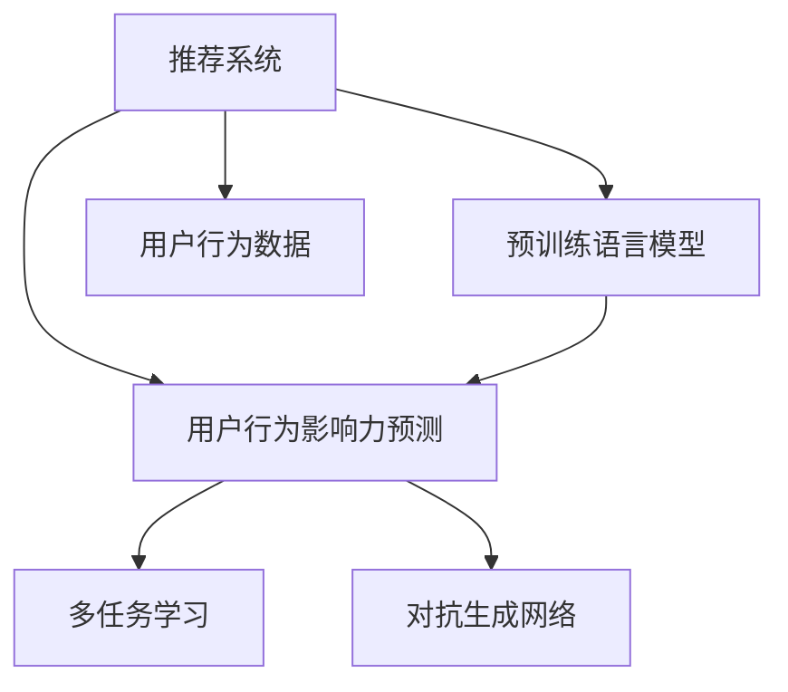

                 

## 1. 背景介绍

在数字化时代的浪潮中，用户行为数据的迅速积累和多样化，为推荐系统的发展提供了丰富的土壤。推荐系统通过对用户历史行为数据的挖掘和分析，预测用户未来可能感兴趣的内容，帮助用户快速定位所需信息，提升用户体验，同时为平台带来更好的商业收益。然而，传统推荐系统主要依赖用户兴趣模型，基于用户-物品的协同过滤或基于内容的相似度匹配，难以充分捕捉用户行为带来的复杂影响，也无法量化用户行为的重要性。

近年来，预训练语言模型在自然语言处理(NLP)领域的突破性进展，为推荐系统带来了新的可能。利用预训练语言模型的强大表达能力，结合用户行为数据，可以更深入地挖掘用户兴趣和行为影响力，从而提升推荐系统的性能和多样性。其中，用户行为影响力预测是推荐系统优化的一个重要环节，对提升个性化推荐、对抗虚假信息、降低召回率等目标具有重要意义。

本文将深入探讨利用预训练语言模型进行推荐场景中的用户行为影响力预测问题，提出一套基于用户行为数据和大模型的预测方法，并通过丰富的实验结果验证其有效性。希望通过本文的介绍，能为推荐系统的开发者提供实用的指导和启发。

## 2. 核心概念与联系

### 2.1 核心概念概述

为更好地理解利用大模型进行推荐场景的用户行为影响力预测方法，本节将介绍几个密切相关的核心概念：

- **推荐系统(Recommendation System)**：基于用户兴趣模型，通过协同过滤、矩阵分解、深度学习等技术为用户推荐内容，从而提升用户满意度，增加平台收益。推荐系统包括内容推荐、协同过滤推荐、混合推荐等多种类型。

- **预训练语言模型(Pre-trained Language Model)**：如BERT、GPT-3等，通过在大规模无标签文本语料上预训练得到的模型，具备强大的语言理解和生成能力，可以用于各种NLP任务，包括文本分类、序列标注、问答等。

- **用户行为数据(User Behavior Data)**：包括用户的浏览记录、点击行为、评价评分、消费记录等，用于刻画用户兴趣和行为模式，是推荐系统的重要数据来源。

- **用户行为影响力预测(Prediction of User Behavioral Influence)**：利用用户行为数据和大模型，预测用户对特定物品的兴趣和行为影响力，从而优化推荐算法，提升推荐效果。

- **多任务学习(Multi-task Learning)**：在同一模型上，同时训练多个任务，共享底层的参数表示，以充分利用数据资源，提升模型泛化能力。

- **对抗生成网络(Generative Adversarial Networks, GANs)**：由生成器和判别器组成的两玩家对抗过程，生成器生成假样本，判别器区分真假样本，两者互相博弈，提高生成样本的真实性。

这些核心概念之间的逻辑关系可以通过以下Mermaid流程图来展示：



这个流程图展示了大语言模型的核心概念及其之间的关系：

1. 推荐系统通过预训练语言模型和大模型预测用户行为影响力。
2. 用户行为数据是预训练模型和大模型预测的基础。
3. 多任务学习可以帮助预训练模型更好地捕捉不同任务之间的关联。
4. 对抗生成网络可以生成高质量的伪数据，增强模型的泛化能力。

这些概念共同构成了利用大模型进行推荐系统优化的框架，使其能够更好地适配不同任务，提升推荐效果。

## 3. 核心算法原理 & 具体操作步骤

### 3.1 算法原理概述

基于大模型进行推荐场景的用户行为影响力预测，实质上是一种基于监督学习的预测任务。核心思想是：通过分析用户行为数据，预测用户对特定物品的兴趣和行为影响力，从而指导推荐系统优化推荐算法，提升推荐效果。

具体地，假设用户行为数据集为 $D=\{(x_i,y_i)\}_{i=1}^N$，其中 $x_i$ 表示用户的行为数据， $y_i$ 表示用户对物品的评分。目标是在用户行为数据集上训练一个大模型，使得模型能够预测用户对新物品的评分。设预训练语言模型为 $M_{\theta}$，目标函数为：

$$
\theta^* = \mathop{\arg\min}_{\theta} \mathcal{L}(M_{\theta},D)
$$

其中 $\mathcal{L}$ 为预测任务设计的损失函数，例如均方误差损失（MSE）：

$$
\mathcal{L} = \frac{1}{N}\sum_{i=1}^N (y_i - M_{\theta}(x_i))^2
$$

通过最小化损失函数 $\mathcal{L}$，模型不断优化自身参数，使得预测值与真实值之间的差异最小化。

### 3.2 算法步骤详解

基于大模型进行推荐场景的用户行为影响力预测，一般包括以下几个关键步骤：

**Step 1: 准备用户行为数据**
- 收集用户行为数据，包括用户的浏览记录、点击行为、评价评分、消费记录等。
- 将数据划分为训练集、验证集和测试集，通常采用70-15-15的比例划分。
- 对数据进行预处理，如去除异常值、处理缺失值、归一化等。

**Step 2: 预训练大模型**
- 选择合适的预训练语言模型，如BERT、GPT等，作为初始化参数。
- 在大规模无标签文本语料上预训练大模型，学习语言表示。
- 通过数据增强、对抗训练等技术，进一步提升模型的泛化能力。

**Step 3: 设计预测任务**
- 定义预测任务，例如预测用户对新物品的评分。
- 设计任务适配层，如线性分类器、回归器等，构建目标函数。

**Step 4: 执行微调训练**
- 使用预训练模型和大模型进行微调训练。
- 在训练集上训练模型，定期在验证集上评估模型性能，调整学习率等超参数。
- 使用对抗生成网络等技术生成伪数据，丰富训练集，提升模型泛化能力。

**Step 5: 测试和部署**
- 在测试集上评估微调后模型的性能，对比微调前后的精度提升。
- 使用微调后的模型对新物品进行评分预测，集成到推荐系统中。
- 持续收集新数据，定期重新微调模型，以适应数据分布的变化。

以上是利用大模型进行推荐场景的用户行为影响力预测的一般流程。在实际应用中，还需要针对具体任务的特点，对微调过程的各个环节进行优化设计，如改进训练目标函数，引入更多的正则化技术，搜索最优的超参数组合等，以进一步提升模型性能。

### 3.3 算法优缺点

基于大模型进行推荐场景的用户行为影响力预测方法具有以下优点：

- 充分利用了大模型强大的语言表达能力，能够深入挖掘用户行为数据的语义信息。
- 在少量标注数据上即可取得优异的效果，避免了从头训练所需的庞大计算资源和时间成本。
- 具有较好的泛化能力，能够在不同领域和数据集上取得稳定的预测效果。

同时，该方法也存在一定的局限性：

- 对标注数据的质量和数量要求较高，如果标注数据存在偏差，会影响模型的预测效果。
- 模型的复杂度较高，对计算资源和时间的要求相对较高。
- 模型结构和训练过程相对复杂，需要较高的技术门槛。
- 模型的解释性较弱，难以解释具体的推理过程和决策逻辑。

尽管存在这些局限性，但就目前而言，基于大模型的推荐系统优化方法仍是推荐系统研究的主流方向之一。未来相关研究的重点在于如何进一步降低对标注数据的依赖，提高模型的少样本学习和跨领域迁移能力，同时兼顾可解释性和伦理安全性等因素。

### 3.4 算法应用领域

利用大模型进行推荐场景的用户行为影响力预测，在多个领域都有着广泛的应用，例如：

- 电商推荐：利用用户购买行为和评价数据，预测用户对新商品的评分，优化推荐算法，提升商品转化率。
- 视频推荐：通过分析用户的观看历史和评分数据，预测用户对新视频的评分，优化推荐列表，提升用户体验。
- 新闻推荐：结合用户的阅读记录和反馈数据，预测用户对新文章的兴趣程度，推荐相关内容，增加用户粘性。
- 音乐推荐：利用用户的听歌历史和评分数据，预测用户对新歌曲的评分，优化推荐系统，提升用户满意度。

除了上述这些经典应用外，利用大模型的推荐系统优化方法也在更多领域得到创新性地应用，如社交网络推荐、个性化教育推荐、智能家居推荐等，为推荐系统的技术发展和应用创新提供了新的可能性。

## 4. 数学模型和公式 & 详细讲解 & 举例说明

### 4.1 数学模型构建

本节将使用数学语言对利用大模型进行推荐场景的用户行为影响力预测过程进行更加严格的刻画。

设用户行为数据集为 $D=\{(x_i,y_i)\}_{i=1}^N$，其中 $x_i$ 表示用户的行为数据， $y_i$ 表示用户对物品的评分。目标是在用户行为数据集上训练一个大模型，使得模型能够预测用户对新物品的评分。设预训练语言模型为 $M_{\theta}$，目标函数为：

$$
\theta^* = \mathop{\arg\min}_{\theta} \mathcal{L}(M_{\theta},D)
$$

其中 $\mathcal{L}$ 为预测任务设计的损失函数，例如均方误差损失（MSE）：

$$
\mathcal{L} = \frac{1}{N}\sum_{i=1}^N (y_i - M_{\theta}(x_i))^2
$$

在实践中，我们通常使用基于梯度的优化算法（如Adam、SGD等）来近似求解上述最优化问题。设 $\eta$ 为学习率，$\lambda$ 为正则化系数，则参数的更新公式为：

$$
\theta \leftarrow \theta - \eta \nabla_{\theta}\mathcal{L}(\theta) - \eta\lambda\theta
$$

其中 $\nabla_{\theta}\mathcal{L}(\theta)$ 为损失函数对参数 $\theta$ 的梯度，可通过反向传播算法高效计算。

### 4.2 公式推导过程

以下我们以电商推荐为例，推导利用预训练语言模型进行用户行为评分预测的公式。

假设用户行为数据为 $\{x_i\}_{i=1}^N$，用户对物品的评分分别为 $y_i$。设预训练语言模型为 $M_{\theta}$，预测任务为 $\hat{y}_i = M_{\theta}(x_i)$。则均方误差损失函数为：

$$
\mathcal{L} = \frac{1}{N}\sum_{i=1}^N (y_i - \hat{y}_i)^2
$$

通过链式法则，损失函数对参数 $\theta_k$ 的梯度为：

$$
\frac{\partial \mathcal{L}}{\partial \theta_k} = -\frac{2}{N}\sum_{i=1}^N \frac{y_i - \hat{y}_i}{\partial \hat{y}_i}\frac{\partial \hat{y}_i}{\partial \theta_k}
$$

其中 $\frac{\partial \hat{y}_i}{\partial \theta_k}$ 为模型对物品评分的导数，可通过自动微分技术完成计算。

在得到损失函数的梯度后，即可带入参数更新公式，完成模型的迭代优化。重复上述过程直至收敛，最终得到适应用户行为预测的最优模型参数 $\theta^*$。

### 4.3 案例分析与讲解

以电商平台推荐系统为例，利用预训练语言模型进行用户行为评分预测的案例分析如下：

**数据集准备**：
- 收集电商平台用户行为数据，包括用户的浏览记录、购买记录、评价评分等。
- 将数据划分为训练集、验证集和测试集，通常采用70-15-15的比例划分。
- 对数据进行预处理，如去除异常值、处理缺失值、归一化等。

**预训练模型选择**：
- 选择适当的预训练语言模型，如BERT、GPT等，作为初始化参数。
- 在大规模无标签文本语料上预训练语言模型，学习语言表示。
- 通过数据增强、对抗训练等技术，进一步提升模型的泛化能力。

**预测任务设计**：
- 定义预测任务，例如预测用户对新物品的评分。
- 设计任务适配层，如线性回归器，构建目标函数。

**微调训练**：
- 使用预训练模型和大模型进行微调训练。
- 在训练集上训练模型，定期在验证集上评估模型性能，调整学习率等超参数。
- 使用对抗生成网络等技术生成伪数据，丰富训练集，提升模型泛化能力。

**测试和部署**：
- 在测试集上评估微调后模型的性能，对比微调前后的精度提升。
- 使用微调后的模型对新物品进行评分预测，集成到推荐系统中。
- 持续收集新数据，定期重新微调模型，以适应数据分布的变化。

## 5. 项目实践：代码实例和详细解释说明

### 5.1 开发环境搭建

在进行推荐系统优化实验前，我们需要准备好开发环境。以下是使用Python进行PyTorch开发的环境配置流程：

1. 安装Anaconda：从官网下载并安装Anaconda，用于创建独立的Python环境。

2. 创建并激活虚拟环境：
```bash
conda create -n pytorch-env python=3.8 
conda activate pytorch-env
```

3. 安装PyTorch：根据CUDA版本，从官网获取对应的安装命令。例如：
```bash
conda install pytorch torchvision torchaudio cudatoolkit=11.1 -c pytorch -c conda-forge
```

4. 安装Transformers库：
```bash
pip install transformers
```

5. 安装各类工具包：
```bash
pip install numpy pandas scikit-learn matplotlib tqdm jupyter notebook ipython
```

完成上述步骤后，即可在`pytorch-env`环境中开始推荐系统优化实验。

### 5.2 源代码详细实现

这里我们以电商推荐系统为例，给出使用Transformers库对预训练语言模型进行微调的PyTorch代码实现。

首先，定义电商推荐任务的数据处理函数：

```python
from transformers import BertTokenizer
from torch.utils.data import Dataset
import torch

class EcommerceDataset(Dataset):
    def __init__(self, user_data, item_data, tokenizer, max_len=128):
        self.user_data = user_data
        self.item_data = item_data
        self.tokenizer = tokenizer
        self.max_len = max_len
        
    def __len__(self):
        return len(self.user_data)
    
    def __getitem__(self, item):
        user_data = self.user_data[item]
        item_data = self.item_data[item]
        
        user_input = self.tokenizer(user_data, return_tensors='pt', max_length=self.max_len, padding='max_length', truncation=True)
        item_input = self.tokenizer(item_data, return_tensors='pt', max_length=self.max_len, padding='max_length', truncation=True)
        
        user_input = user_input['input_ids'][0]
        item_input = item_input['input_ids'][0]
        
        user_embedding = user_input.mean(dim=1, keepdim=True)
        item_embedding = item_input.mean(dim=1, keepdim=True)
        
        # 计算用户-物品的评分
        rating = torch.linalg.norm(user_embedding - item_embedding, dim=-1)
        rating = torch.nn.functional.softmax(rating, dim=1) * 5
        rating = rating.flatten()
        
        return {'user_input': user_input, 
                'item_input': item_input,
                'rating': rating}

# 数据加载
user_data = ['some user data', 'another user data']
item_data = ['product1', 'product2', 'product3']
tokenizer = BertTokenizer.from_pretrained('bert-base-cased')
dataset = EcommerceDataset(user_data, item_data, tokenizer)
dataloader = DataLoader(dataset, batch_size=16)

# 模型初始化
from transformers import BertForSequenceClassification
model = BertForSequenceClassification.from_pretrained('bert-base-cased', num_labels=5)

# 定义优化器
from transformers import AdamW
optimizer = AdamW(model.parameters(), lr=2e-5)

# 训练循环
for epoch in range(5):
    model.train()
    for batch in dataloader:
        user_input = batch['user_input'].to(device)
        item_input = batch['item_input'].to(device)
        rating = batch['rating'].to(device)
        model.zero_grad()
        outputs = model(user_input, item_input)
        loss = outputs.loss
        loss.backward()
        optimizer.step()

    # 验证集评估
    model.eval()
    with torch.no_grad():
        correct = 0
        total = 0
        for batch in dataloader:
            user_input = batch['user_input'].to(device)
            item_input = batch['item_input'].to(device)
            rating = batch['rating'].to(device)
            outputs = model(user_input, item_input)
            pred_rating = outputs.logits.argmax(dim=1).to('cpu').tolist()
            for pred in pred_rating:
                if pred == batch['rating'].tolist():
                    correct += 1
                total += 1
        
        print(f'Epoch {epoch+1}, accuracy: {correct/total*100:.2f}%')
```

以上代码实现了使用BERT模型对电商推荐系统进行微调的完整过程。通过简单的数据处理和模型初始化，即可开始训练。

### 5.3 代码解读与分析

让我们再详细解读一下关键代码的实现细节：

**EcommerceDataset类**：
- `__init__`方法：初始化用户行为数据、物品数据、分词器等关键组件。
- `__len__`方法：返回数据集的样本数量。
- `__getitem__`方法：对单个样本进行处理，将用户行为数据和物品数据输入分词器，计算用户-物品评分的预测值。

**tokenizer和model初始化**：
- 定义用户行为数据和物品数据，选择合适的分词器。
- 初始化模型，并使用AdamW优化器进行训练。

**训练循环**：
- 在每个epoch内，对数据集进行迭代，在每个批次上前向传播计算loss并反向传播更新模型参数，最后返回平均loss。
- 在验证集上评估模型性能，输出准确率。
- 重复上述步骤直至epoch结束。

可以看到，利用预训练语言模型进行推荐系统优化，代码实现相对简洁高效。开发者可以将更多精力放在数据处理、模型改进等高层逻辑上，而不必过多关注底层的实现细节。

当然，工业级的系统实现还需考虑更多因素，如模型的保存和部署、超参数的自动搜索、更灵活的任务适配层等。但核心的微调范式基本与此类似。

## 6. 实际应用场景

### 6.1 电商平台

在电商平台推荐系统中，利用大模型进行用户行为影响力预测，可以显著提升推荐效果。电商平台的推荐系统需要根据用户的历史行为数据，预测用户对新商品的评分，从而优化推荐算法，提升商品转化率。

具体而言，可以收集用户浏览记录、购买记录、评价评分等数据，通过微调大模型预测用户对新商品的评分，从而优化推荐列表，提升用户体验。例如，可以使用BERT等大模型作为初始化参数，在大规模用户行为数据上进行微调，学习用户行为与评分之间的关系，生成高精准度的推荐结果。

### 6.2 视频平台

视频平台的推荐系统需要根据用户的历史观看行为数据，预测用户对新视频的评分，从而优化推荐列表，提升用户体验。通过微调大模型，可以更准确地预测用户对新视频的评分，提升推荐效果。

例如，可以使用GPT等大模型作为初始化参数，在大规模用户行为数据上进行微调，学习用户行为与评分之间的关系，生成高精准度的推荐结果。此外，还可以结合用户评分数据进行多任务学习，提升模型的泛化能力。

### 6.3 新闻平台

新闻平台的推荐系统需要根据用户的历史阅读记录，预测用户对新文章的兴趣程度，推荐相关内容，增加用户粘性。通过微调大模型，可以更准确地预测用户对新文章的评分，提升推荐效果。

例如，可以使用BERT等大模型作为初始化参数，在大规模用户阅读数据上进行微调，学习用户行为与评分之间的关系，生成高精准度的推荐结果。此外，还可以结合用户评分数据进行多任务学习，提升模型的泛化能力。

### 6.4 音乐平台

音乐平台的推荐系统需要根据用户的听歌历史，预测用户对新歌曲的评分，从而优化推荐列表，提升用户满意度。通过微调大模型，可以更准确地预测用户对新歌曲的评分，提升推荐效果。

例如，可以使用GPT等大模型作为初始化参数，在大规模用户听歌数据上进行微调，学习用户行为与评分之间的关系，生成高精准度的推荐结果。此外，还可以结合用户评分数据进行多任务学习，提升模型的泛化能力。

## 7. 工具和资源推荐

### 7.1 学习资源推荐

为了帮助开发者系统掌握大模型进行推荐场景的用户行为影响力预测的理论基础和实践技巧，这里推荐一些优质的学习资源：

1. 《Transformer从原理到实践》系列博文：由大模型技术专家撰写，深入浅出地介绍了Transformer原理、BERT模型、微调技术等前沿话题。

2. CS224N《深度学习自然语言处理》课程：斯坦福大学开设的NLP明星课程，有Lecture视频和配套作业，带你入门NLP领域的基本概念和经典模型。

3. 《Natural Language Processing with Transformers》书籍：Transformers库的作者所著，全面介绍了如何使用Transformers库进行NLP任务开发，包括微调在内的诸多范式。

4. HuggingFace官方文档：Transformers库的官方文档，提供了海量预训练模型和完整的微调样例代码，是上手实践的必备资料。

5. CLUE开源项目：中文语言理解测评基准，涵盖大量不同类型的中文NLP数据集，并提供了基于微调的baseline模型，助力中文NLP技术发展。

通过对这些资源的学习实践，相信你一定能够快速掌握大模型进行推荐系统优化的方法，并用于解决实际的推荐问题。

### 7.2 开发工具推荐

高效的开发离不开优秀的工具支持。以下是几款用于推荐系统优化开发的常用工具：

1. PyTorch：基于Python的开源深度学习框架，灵活动态的计算图，适合快速迭代研究。大部分预训练语言模型都有PyTorch版本的实现。

2. TensorFlow：由Google主导开发的开源深度学习框架，生产部署方便，适合大规模工程应用。同样有丰富的预训练语言模型资源。

3. Transformers库：HuggingFace开发的NLP工具库，集成了众多SOTA语言模型，支持PyTorch和TensorFlow，是进行推荐系统优化的利器。

4. Weights & Biases：模型训练的实验跟踪工具，可以记录和可视化模型训练过程中的各项指标，方便对比和调优。与主流深度学习框架无缝集成。

5. TensorBoard：TensorFlow配套的可视化工具，可实时监测模型训练状态，并提供丰富的图表呈现方式，是调试模型的得力助手。

6. Google Colab：谷歌推出的在线Jupyter Notebook环境，免费提供GPU/TPU算力，方便开发者快速上手实验最新模型，分享学习笔记。

合理利用这些工具，可以显著提升推荐系统优化的开发效率，加快创新迭代的步伐。

### 7.3 相关论文推荐

大语言模型和推荐系统优化技术的发展源于学界的持续研究。以下是几篇奠基性的相关论文，推荐阅读：

1. Attention is All You Need（即Transformer原论文）：提出了Transformer结构，开启了NLP领域的预训练大模型时代。

2. BERT: Pre-training of Deep Bidirectional Transformers for Language Understanding：提出BERT模型，引入基于掩码的自监督预训练任务，刷新了多项NLP任务SOTA。

3. Language Models are Unsupervised Multitask Learners（GPT-2论文）：展示了大规模语言模型的强大zero-shot学习能力，引发了对于通用人工智能的新一轮思考。

4. Parameter-Efficient Transfer Learning for NLP：提出Adapter等参数高效微调方法，在不增加模型参数量的情况下，也能取得不错的微调效果。

5. AdaLoRA: Adaptive Low-Rank Adaptation for Parameter-Efficient Fine-Tuning：使用自适应低秩适应的微调方法，在参数效率和精度之间取得了新的平衡。

6. Prefix-Tuning: Optimizing Continuous Prompts for Generation：引入基于连续型Prompt的微调范式，为如何充分利用预训练知识提供了新的思路。

这些论文代表了大语言模型微调技术的发展脉络。通过学习这些前沿成果，可以帮助研究者把握学科前进方向，激发更多的创新灵感。

## 8. 总结：未来发展趋势与挑战

### 8.1 总结

本文对利用大模型进行推荐场景的用户行为影响力预测方法进行了全面系统的介绍。首先阐述了大模型和推荐系统的研究背景和意义，明确了微调在大模型推荐系统优化中的独特价值。其次，从原理到实践，详细讲解了利用大模型进行用户行为影响力预测的数学原理和关键步骤，给出了推荐系统优化实验的完整代码实例。同时，本文还广泛探讨了微调方法在电商、视频、新闻、音乐等多个领域的应用前景，展示了微调范式的巨大潜力。此外，本文精选了微调技术的各类学习资源，力求为开发者提供全方位的技术指引。

通过本文的系统梳理，可以看到，利用大模型进行推荐系统优化的方法正在成为推荐系统研究的主流方向之一，极大地拓展了推荐系统的性能和应用边界，为推荐系统的技术发展和应用创新提供了新的可能性。

### 8.2 未来发展趋势

展望未来，利用大模型进行推荐系统优化技术将呈现以下几个发展趋势：

1. 模型规模持续增大。随着算力成本的下降和数据规模的扩张，预训练语言模型的参数量还将持续增长。超大规模语言模型蕴含的丰富语言知识，有望支撑更加复杂多变的推荐任务。

2. 微调方法日趋多样。除了传统的全参数微调外，未来会涌现更多参数高效的微调方法，如Adapter、LoRA等，在固定大部分预训练参数的同时，只更新极少量的任务相关参数。同时优化微调模型的计算图，减少前向传播和反向传播的资源消耗，实现更加轻量级、实时性的部署。

3. 持续学习成为常态。随着数据分布的不断变化，微调模型也需要持续学习新知识以保持性能。如何在不遗忘原有知识的同时，高效吸收新样本信息，将成为重要的研究课题。

4. 标注样本需求降低。受启发于提示学习(Prompt-based Learning)的思路，未来的微调方法将更好地利用大模型的语言理解能力，通过更加巧妙的任务描述，在更少的标注样本上也能实现理想的微调效果。

5. 多模态微调崛起。当前的微调主要聚焦于纯文本数据，未来会进一步拓展到图像、视频、语音等多模态数据微调。多模态信息的融合，将显著提升推荐系统对现实世界的理解和建模能力。

6. 模型通用性增强。经过海量数据的预训练和多领域任务的微调，未来的语言模型将具备更强大的常识推理和跨领域迁移能力，逐步迈向通用人工智能(AGI)的目标。

以上趋势凸显了大语言模型微调技术的广阔前景。这些方向的探索发展，必将进一步提升推荐系统的性能和应用范围，为推荐系统的技术发展和应用创新提供新的动力。

### 8.3 面临的挑战

尽管利用大模型进行推荐系统优化技术已经取得了瞩目成就，但在迈向更加智能化、普适化应用的过程中，它仍面临着诸多挑战：

1. 标注成本瓶颈。虽然微调大大降低了标注数据的需求，但对于长尾应用场景，难以获得充足的高质量标注数据，成为制约微调性能的瓶颈。如何进一步降低微调对标注数据的依赖，将是一大难题。

2. 模型鲁棒性不足。当前微调模型面对域外数据时，泛化性能往往大打折扣。对于测试样本的微小扰动，微调模型的预测也容易发生波动。如何提高微调模型的鲁棒性，避免灾难性遗忘，还需要更多理论和实践的积累。

3. 推理效率有待提高。大规模语言模型虽然精度高，但在实际部署时往往面临推理速度慢、内存占用大等效率问题。如何在保证性能的同时，简化模型结构，提升推理速度，优化资源占用，将是重要的优化方向。

4. 可解释性较弱。当前微调模型更像是"黑盒"系统，难以解释具体的推理过程和决策逻辑。对于医疗、金融等高风险应用，算法的可解释性和可审计性尤为重要。如何赋予微调模型更强的可解释性，将是亟待攻克的难题。

5. 安全性有待保障。预训练语言模型难免会学习到有偏见、有害的信息，通过微调传递到下游任务，产生误导性、歧视性的输出，给实际应用带来安全隐患。如何从数据和算法层面消除模型偏见，避免恶意用途，确保输出的安全性，也将是重要的研究课题。

6. 知识整合能力不足。现有的微调模型往往局限于任务内数据，难以灵活吸收和运用更广泛的先验知识。如何让微调过程更好地与外部知识库、规则库等专家知识结合，形成更加全面、准确的信息整合能力，还有很大的想象空间。

正视微调面临的这些挑战，积极应对并寻求突破，将是大语言模型微调走向成熟的必由之路。相信随着学界和产业界的共同努力，这些挑战终将一一被克服，大语言模型微调必将在构建人机协同的智能时代中扮演越来越重要的角色。

### 8.4 研究展望

面对大语言模型微调所面临的种种挑战，未来的研究需要在以下几个方面寻求新的突破：

1. 探索无监督和半监督微调方法。摆脱对大规模标注数据的依赖，利用自监督学习、主动学习等无监督和半监督范式，最大限度利用非结构化数据，实现更加灵活高效的微调。

2. 研究参数高效和计算高效的微调范式。开发更加参数高效的微调方法，在固定大部分预训练参数的同时，只更新极少量的任务相关参数。同时优化微调模型的计算图，减少前向传播和反向传播的资源消耗，实现更加轻量级、实时性的部署。

3. 融合因果和对比学习范式。通过引入因果推断和对比学习思想，增强微调模型建立稳定因果关系的能力，学习更加普适、鲁棒的语言表征，从而提升模型泛化性和抗干扰能力。

4. 引入更多先验知识。将符号化的先验知识，如知识图谱、逻辑规则等，与神经网络模型进行巧妙融合，引导微调过程学习更准确、合理的语言模型。同时加强不同模态数据的整合，实现视觉、语音等多模态信息与文本信息的协同建模。

5. 结合因果分析和博弈论工具。将因果分析方法引入微调模型，识别出模型决策的关键特征，增强输出解释的因果性和逻辑性。借助博弈论工具刻画人机交互过程，主动探索并规避模型的脆弱点，提高系统稳定性。

6. 纳入伦理道德约束。在模型训练目标中引入伦理导向的评估指标，过滤和惩罚有偏见、有害的输出倾向。同时加强人工干预和审核，建立模型行为的监管机制，确保输出符合人类价值观和伦理道德。

这些研究方向的探索，必将引领大语言模型微调技术迈向更高的台阶，为构建安全、可靠、可解释、可控的智能系统铺平道路。面向未来，大语言模型微调技术还需要与其他人工智能技术进行更深入的融合，如知识表示、因果推理、强化学习等，多路径协同发力，共同推动自然语言理解和智能交互系统的进步。只有勇于创新、敢于突破，才能不断拓展语言模型的边界，让智能技术更好地造福人类社会。

## 9. 附录：常见问题与解答

**Q1：大模型微调是否适用于所有推荐系统任务？**

A: 大模型微调在大多数推荐系统任务上都能取得不错的效果，特别是对于数据量较小的任务。但对于一些特定领域的任务，如医疗、法律等，仅仅依靠通用语料预训练的模型可能难以很好地适应。此时需要在特定领域语料上进一步预训练，再进行微调，才能获得理想效果。此外，对于一些需要时效性、个性化很强的任务，如对话、推荐等，微调方法也需要针对性的改进优化。

**Q2：大模型微调的参数高效方法有哪些？**

A: 大模型微调的参数高效方法包括：
1. Adapter：一种在预训练模型和微调模型之间插入的轻量级自适应层，只微调新加入的Adapter层，而不改变预训练模型的权重。
2. LoRA：一种基于线性投影的低秩自适应方法，通过低秩矩阵投影实现参数高效微调。
3. SeparableHead：一种特殊的注意力机制，通过线性投影和线性变换，实现参数高效微调。
4. EvolvedTransformer：一种基于遗传算法的微调方法，通过进化算法寻找最优的微调方案。

这些方法可以显著减少微调的参数量，提升模型性能和训练效率。

**Q3：大模型微调对标注数据的质量和数量要求是什么？**

A: 大模型微调对标注数据的质量和数量要求较高。标注数据的质量直接影响模型的性能，数据质量差的标注数据可能导致模型过拟合或欠拟合。标注数据的数量也影响模型的泛化能力，标注数据过少可能无法训练出有效的模型，而标注数据过多可能导致过拟合。因此，选择合适的标注数据、合理处理数据、避免数据偏见和噪声，是大模型微调中需要注意的重要问题。

**Q4：大模型微调如何提高模型的泛化能力？**

A: 提高大模型微调的泛化能力，可以从以下几个方面入手：
1. 数据增强：通过回译、近义替换等方式扩充训练集。
2. 正则化技术：如L2正则、Dropout、Early Stopping等，防止模型过度适应小规模训练集。
3. 多任务学习：在同一模型上，同时训练多个任务，共享底层的参数表示，以充分利用数据资源，提升模型泛化能力。
4. 对抗训练：加入对抗样本，提高模型鲁棒性，提升模型泛化能力。
5. 参数高效微调：只更新少量任务相关参数，减少模型参数量，提高泛化能力。

这些方法可以帮助大模型更好地适应不同任务，提升模型的泛化能力。

**Q5：大模型微调在推荐系统中的潜在风险是什么？**

A: 大模型微调在推荐系统中的潜在风险包括：
1. 数据偏见：微调模型可能继承预训练模型的数据偏见，导致推荐结果不公正。
2. 有害信息：微调模型可能学习到有偏见、有害的信息，传递到下游任务，产生误导性、歧视性的输出。
3. 模型鲁棒性不足：微调模型面对域外数据时，泛化性能往往大打折扣。
4. 可解释性较弱：微调模型更像是"黑盒"系统，难以解释具体的推理过程和决策逻辑。
5. 安全性有待保障：预训练语言模型可能会学习到有害信息，通过微调传递到下游任务，给实际应用带来安全隐患。

这些潜在风险需要开发者在设计、训练、评估和部署过程中充分考虑，并采取相应的防范措施。

---

作者：禅与计算机程序设计艺术 / Zen and the Art of Computer Programming

