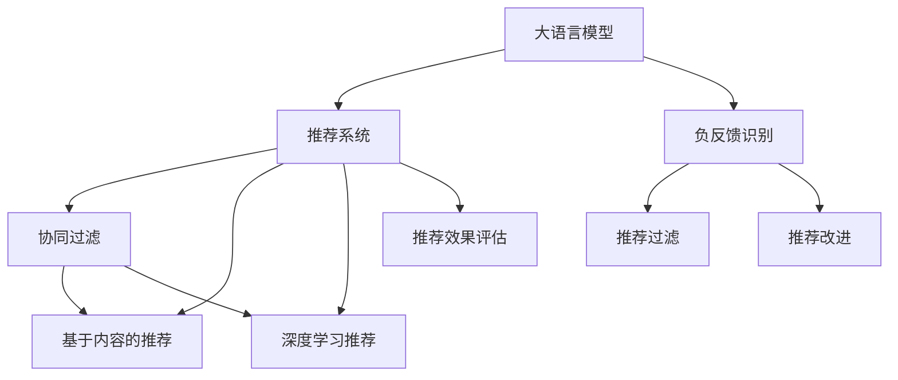

                 

# 利用大模型进行推荐负反馈的识别与处理策略

> 关键词：大语言模型,推荐系统,负反馈,推荐改进,推荐过滤,模型微调

## 1. 背景介绍

### 1.1 问题由来

推荐系统（Recommendation Systems）作为互联网时代信息爆炸的产物，通过分析用户的历史行为数据，为用户推荐感兴趣的物品，极大地提升了用户体验和商品流转效率。然而，随着用户行为的日趋复杂多变，推荐系统的个性化推荐越来越难以满足用户的个性化需求。为应对这一挑战，研究人员提出了利用大语言模型进行推荐改进的方法，其中负反馈识别与处理策略是关键的一环。

### 1.2 问题核心关键点

在推荐系统中，负反馈（Negative Feedback）是指用户对推荐结果的直接否定或拒绝。负反馈的识别与处理是优化推荐系统效果的重要环节，直接影响推荐系统的精确度和用户体验。负反馈可以进一步用于推荐过滤（Recommendation Filtering），预测用户后续的行为，降低误推荐率，提升推荐质量。

具体而言，负反馈识别指的是利用机器学习模型，识别出用户对当前推荐结果的负面评价。负反馈处理则是在识别出负反馈后，对模型进行调整，优化推荐结果，避免未来的负反馈发生。本文将系统阐述如何利用大语言模型进行负反馈的识别与处理。

## 2. 核心概念与联系

### 2.1 核心概念概述

为更好地理解基于大模型推荐系统的负反馈识别与处理策略，本节将介绍几个密切相关的核心概念：

- 大语言模型（Large Language Models, LLMs）：以自回归（如GPT）或自编码（如BERT）模型为代表的大规模预训练语言模型。通过在大规模无标签文本语料上进行预训练，学习通用的语言知识，具备强大的语言理解和生成能力。

- 推荐系统（Recommendation System）：通过分析用户行为数据，为用户推荐感兴趣物品的系统。推荐系统包括协同过滤、基于内容的推荐、深度学习推荐等。

- 推荐过滤（Recommendation Filtering）：对推荐结果进行筛选，过滤掉用户不感兴趣的物品，提升推荐效果。

- 负反馈识别（Negative Feedback Recognition）：识别用户对推荐结果的负面评价。负反馈识别可以采用传统机器学习算法或大语言模型进行。

- 推荐改进（Recommendation Improvement）：根据负反馈对推荐系统进行优化，提升推荐质量。

- 推荐效果评估（Recommendation Effect Evaluation）：通过指标如点击率（CTR）、转化率（Conversion Rate）等，评估推荐系统的性能。

这些核心概念之间的逻辑关系可以通过以下Mermaid流程图来展示：



这个流程图展示了推荐系统中各个组件之间的相互关系：

1. 大语言模型通过预训练获得基础能力。
2. 推荐系统包含多种推荐策略，如协同过滤、内容推荐、深度学习推荐等。
3. 负反馈识别利用大语言模型或机器学习模型，识别用户对推荐结果的负面评价。
4. 推荐过滤利用负反馈结果，对推荐结果进行过滤。
5. 推荐改进根据负反馈结果，对推荐系统进行优化。
6. 推荐效果评估通过指标评估推荐系统的整体性能。

这些概念共同构成了推荐系统的基本框架，使得推荐系统能够根据用户行为数据，持续优化推荐结果，提升用户体验。

## 3. 核心算法原理 & 具体操作步骤
### 3.1 算法原理概述

基于大模型的推荐负反馈识别与处理策略，本质上是一个有监督的细粒度迁移学习过程。其核心思想是：将大语言模型视作一个强大的"特征提取器"，通过在大规模用户反馈数据上进行有监督的微调，使得模型能够准确识别和处理负反馈，提升推荐系统的精确度和用户体验。

具体而言，假设推荐系统已经收集到用户对某次推荐结果的负面反馈，记为 $(x,y)$，其中 $x$ 为推荐结果，$y$ 为负反馈标签。目标是通过微调，使得模型能够从大量的负反馈数据中学习出负反馈的特征表示，从而识别新的负反馈，并进行推荐改进。

### 3.2 算法步骤详解

基于大模型的推荐负反馈识别与处理策略一般包括以下几个关键步骤：

**Step 1: 准备负反馈数据集**
- 收集用户对推荐结果的负反馈数据，通常通过用户反馈或系统日志获得。
- 将负反馈数据集划分为训练集、验证集和测试集。

**Step 2: 添加任务适配层**
- 在推荐模型的顶层设计合适的输出层和损失函数。
- 对于分类任务，通常在顶层添加线性分类器和交叉熵损失函数。
- 对于回归任务，通常使用均方误差损失函数。

**Step 3: 设置微调超参数**
- 选择合适的优化算法及其参数，如AdamW、SGD等，设置学习率、批大小、迭代轮数等。
- 设置正则化技术及强度，包括权重衰减、Dropout、Early Stopping等。
- 确定冻结预训练参数的策略，如仅微调顶层，或全部参数都参与微调。

**Step 4: 执行梯度训练**
- 将训练集数据分批次输入模型，前向传播计算损失函数。
- 反向传播计算参数梯度，根据设定的优化算法和学习率更新模型参数。
- 周期性在验证集上评估模型性能，根据性能指标决定是否触发Early Stopping。
- 重复上述步骤直到满足预设的迭代轮数或Early Stopping条件。

**Step 5: 测试和部署**
- 在测试集上评估微调后模型对负反馈的识别效果。
- 使用微调后的模型对新的推荐结果进行负反馈识别，并进行推荐改进。
- 集成到实际的应用系统中。

以上是基于大模型的推荐负反馈识别与处理策略的一般流程。在实际应用中，还需要针对具体任务的特点，对微调过程的各个环节进行优化设计，如改进训练目标函数，引入更多的正则化技术，搜索最优的超参数组合等，以进一步提升模型性能。

### 3.3 算法优缺点

基于大模型的推荐负反馈识别与处理策略具有以下优点：
1. 准确率高。大语言模型具备强大的语言理解和生成能力，可以在大量的负反馈数据上进行高效训练，从而准确识别负反馈。
2. 泛化能力强。大模型通过大规模数据预训练，学习到了通用的语言知识，可以泛化到不同的推荐场景和用户群体。
3. 可解释性强。大模型的训练过程可被解释，从而可以分析出负反馈的原因，进行针对性的推荐改进。
4. 可扩展性好。大模型可以很方便地进行迁移学习，适用于不同的推荐场景和任务。

同时，该方法也存在一定的局限性：
1. 依赖负反馈数据。推荐系统的负反馈数据稀疏，难以获得高质量的标注数据，导致模型的泛化能力受限。
2. 模型复杂度高。大语言模型参数量庞大，训练和推理开销大。
3. 可能导致过拟合。微调过程中，模型容易过拟合于特定负反馈数据集，降低模型的泛化性能。
4. 模型的实时性差。大模型推理速度较慢，难以实时处理负反馈数据。

尽管存在这些局限性，但就目前而言，基于大模型的推荐负反馈识别与处理策略仍是一种有效的推荐优化方法，特别适用于需要高效识别和处理负反馈的推荐场景。未来相关研究的重点在于如何进一步降低负反馈数据的需求，提高模型的泛化能力，同时兼顾可解释性和实时性等因素。

### 3.4 算法应用领域

基于大模型的推荐负反馈识别与处理策略，已经在电子商务、视频推荐、音乐推荐等多个领域得到了广泛应用。

1. 电子商务：电商平台可以利用用户对推荐商品的不满意反馈，及时进行调整，提升用户满意度。
2. 视频推荐：视频平台可以通过用户对视频的不满意反馈，优化推荐算法，提高用户观看体验。
3. 音乐推荐：音乐平台可以通过用户对音乐推荐的不满意反馈，推荐更加符合用户喜好的音乐。
4. 新闻推荐：新闻平台可以通过用户对推荐文章的不满意反馈，及时调整推荐策略，提高文章阅读率。

除了上述这些经典应用外，基于大模型的推荐负反馈识别与处理策略还在更多场景中得到创新性应用，如基于负反馈的推荐改进、个性化推荐、推荐过滤等，为推荐系统带来了新的突破。随着预训练模型和推荐方法的不断进步，相信基于负反馈识别与处理的方法将在更多领域得到应用，为推荐系统带来更多的价值。

## 4. 数学模型和公式 & 详细讲解  
### 4.1 数学模型构建

本节将使用数学语言对基于大模型的推荐负反馈识别与处理策略进行更加严格的刻画。

假设推荐系统已经收集到用户对某次推荐结果的负面反馈，记为 $(x,y)$，其中 $x$ 为推荐结果，$y$ 为负反馈标签。模型的输出为 $\hat{y}=M_{\theta}(x)$，其中 $\theta$ 为模型参数。定义模型 $M_{\theta}$ 在输入 $x$ 上的损失函数为 $\ell(M_{\theta}(x),y)$，则在负反馈数据集 $D=\{(x_i,y_i)\}_{i=1}^N$ 上的经验风险为：

$$
\mathcal{L}(\theta) = \frac{1}{N} \sum_{i=1}^N \ell(M_{\theta}(x_i),y_i)
$$

目标是最小化经验风险，即找到最优参数：

$$
\theta^* = \mathop{\arg\min}_{\theta} \mathcal{L}(\theta)
$$

在实践中，我们通常使用基于梯度的优化算法（如SGD、Adam等）来近似求解上述最优化问题。设 $\eta$ 为学习率，$\lambda$ 为正则化系数，则参数的更新公式为：

$$
\theta \leftarrow \theta - \eta \nabla_{\theta}\mathcal{L}(\theta) - \eta\lambda\theta
$$

其中 $\nabla_{\theta}\mathcal{L}(\theta)$ 为损失函数对参数 $\theta$ 的梯度，可通过反向传播算法高效计算。

### 4.2 公式推导过程

以下我们以二分类任务为例，推导交叉熵损失函数及其梯度的计算公式。

假设模型 $M_{\theta}$ 在输入 $x$ 上的输出为 $\hat{y}=M_{\theta}(x) \in [0,1]$，表示用户对推荐结果的兴趣程度。真实标签 $y \in \{0,1\}$。则二分类交叉熵损失函数定义为：

$$
\ell(M_{\theta}(x),y) = -[y\log \hat{y} + (1-y)\log (1-\hat{y})]
$$

将其代入经验风险公式，得：

$$
\mathcal{L}(\theta) = -\frac{1}{N}\sum_{i=1}^N [y_i\log M_{\theta}(x_i)+(1-y_i)\log(1-M_{\theta}(x_i))]
$$

根据链式法则，损失函数对参数 $\theta_k$ 的梯度为：

$$
\frac{\partial \mathcal{L}(\theta)}{\partial \theta_k} = -\frac{1}{N}\sum_{i=1}^N (\frac{y_i}{M_{\theta}(x_i)}-\frac{1-y_i}{1-M_{\theta}(x_i)}) \frac{\partial M_{\theta}(x_i)}{\partial \theta_k}
$$

其中 $\frac{\partial M_{\theta}(x_i)}{\partial \theta_k}$ 可进一步递归展开，利用自动微分技术完成计算。

在得到损失函数的梯度后，即可带入参数更新公式，完成模型的迭代优化。重复上述过程直至收敛，最终得到适应负反馈数据集的最优模型参数 $\theta^*$。

## 5. 项目实践：代码实例和详细解释说明
### 5.1 开发环境搭建

在进行推荐负反馈识别与处理实践前，我们需要准备好开发环境。以下是使用Python进行PyTorch开发的环境配置流程：

1. 安装Anaconda：从官网下载并安装Anaconda，用于创建独立的Python环境。

2. 创建并激活虚拟环境：
```bash
conda create -n pytorch-env python=3.8 
conda activate pytorch-env
```

3. 安装PyTorch：根据CUDA版本，从官网获取对应的安装命令。例如：
```bash
conda install pytorch torchvision torchaudio cudatoolkit=11.1 -c pytorch -c conda-forge
```

4. 安装TensorFlow：
```bash
pip install tensorflow==2.8
```

5. 安装各类工具包：
```bash
pip install numpy pandas scikit-learn matplotlib tqdm jupyter notebook ipython
```

完成上述步骤后，即可在`pytorch-env`环境中开始推荐负反馈识别与处理实践。

### 5.2 源代码详细实现

下面我以推荐负反馈识别为例，给出使用Transformers库对BERT模型进行微调的PyTorch代码实现。

首先，定义负反馈数据集和任务适配层：

```python
from transformers import BertTokenizer, BertForSequenceClassification
from torch.utils.data import Dataset
import torch

class NegativeFeedbackDataset(Dataset):
    def __init__(self, texts, labels, tokenizer, max_len=128):
        self.texts = texts
        self.labels = labels
        self.tokenizer = tokenizer
        self.max_len = max_len
        
    def __len__(self):
        return len(self.texts)
    
    def __getitem__(self, item):
        text = self.texts[item]
        label = self.labels[item]
        
        encoding = self.tokenizer(text, return_tensors='pt', max_length=self.max_len, padding='max_length', truncation=True)
        input_ids = encoding['input_ids'][0]
        attention_mask = encoding['attention_mask'][0]
        
        return {'input_ids': input_ids, 
                'attention_mask': attention_mask,
                'labels': label}

# 标签与id的映射
label2id = {'Negative': 0, 'Positive': 1}
id2label = {v: k for k, v in label2id.items()}

# 创建dataset
tokenizer = BertTokenizer.from_pretrained('bert-base-cased')

train_dataset = NegativeFeedbackDataset(train_texts, train_labels, tokenizer)
dev_dataset = NegativeFeedbackDataset(dev_texts, dev_labels, tokenizer)
test_dataset = NegativeFeedbackDataset(test_texts, test_labels, tokenizer)
```

然后，定义模型和优化器：

```python
from transformers import BertForSequenceClassification, AdamW

model = BertForSequenceClassification.from_pretrained('bert-base-cased', num_labels=len(label2id))

optimizer = AdamW(model.parameters(), lr=2e-5)
```

接着，定义训练和评估函数：

```python
from torch.utils.data import DataLoader
from tqdm import tqdm
from sklearn.metrics import accuracy_score, precision_recall_fscore_support

device = torch.device('cuda') if torch.cuda.is_available() else torch.device('cpu')
model.to(device)

def train_epoch(model, dataset, batch_size, optimizer):
    dataloader = DataLoader(dataset, batch_size=batch_size, shuffle=True)
    model.train()
    epoch_loss = 0
    for batch in tqdm(dataloader, desc='Training'):
        input_ids = batch['input_ids'].to(device)
        attention_mask = batch['attention_mask'].to(device)
        labels = batch['labels'].to(device)
        model.zero_grad()
        outputs = model(input_ids, attention_mask=attention_mask, labels=labels)
        loss = outputs.loss
        epoch_loss += loss.item()
        loss.backward()
        optimizer.step()
    return epoch_loss / len(dataloader)

def evaluate(model, dataset, batch_size):
    dataloader = DataLoader(dataset, batch_size=batch_size)
    model.eval()
    preds, labels = [], []
    with torch.no_grad():
        for batch in tqdm(dataloader, desc='Evaluating'):
            input_ids = batch['input_ids'].to(device)
            attention_mask = batch['attention_mask'].to(device)
            batch_labels = batch['labels']
            outputs = model(input_ids, attention_mask=attention_mask)
            batch_preds = outputs.logits.argmax(dim=2).to('cpu').tolist()
            batch_labels = batch_labels.to('cpu').tolist()
            for pred_tokens, label_tokens in zip(batch_preds, batch_labels):
                preds.append(pred_tokens[:len(label_tokens)])
                labels.append(label_tokens)
                
    print(f"Accuracy: {accuracy_score(labels, preds):.3f}")
    print(f"Precision: {precision_recall_fscore_support(labels, preds, average='macro')}")
```

最后，启动训练流程并在测试集上评估：

```python
epochs = 5
batch_size = 16

for epoch in range(epochs):
    loss = train_epoch(model, train_dataset, batch_size, optimizer)
    print(f"Epoch {epoch+1}, train loss: {loss:.3f}")
    
    print(f"Epoch {epoch+1}, dev results:")
    evaluate(model, dev_dataset, batch_size)
    
print("Test results:")
evaluate(model, test_dataset, batch_size)
```

以上就是使用PyTorch对BERT进行推荐负反馈识别任务的微调代码实现。可以看到，得益于Transformers库的强大封装，我们可以用相对简洁的代码完成BERT模型的加载和微调。

### 5.3 代码解读与分析

让我们再详细解读一下关键代码的实现细节：

**NegativeFeedbackDataset类**：
- `__init__`方法：初始化文本、标签、分词器等关键组件。
- `__len__`方法：返回数据集的样本数量。
- `__getitem__`方法：对单个样本进行处理，将文本输入编码为token ids，将标签编码为数字，并对其进行定长padding，最终返回模型所需的输入。

**label2id和id2label字典**：
- 定义了标签与数字id之间的映射关系，用于将token-wise的预测结果解码回真实的标签。

**训练和评估函数**：
- 使用PyTorch的DataLoader对数据集进行批次化加载，供模型训练和推理使用。
- 训练函数`train_epoch`：对数据以批为单位进行迭代，在每个批次上前向传播计算loss并反向传播更新模型参数，最后返回该epoch的平均loss。
- 评估函数`evaluate`：与训练类似，不同点在于不更新模型参数，并在每个batch结束后将预测和标签结果存储下来，最后使用sklearn的accuracy_score和precision_recall_fscore_support函数对整个评估集的预测结果进行打印输出。

**训练流程**：
- 定义总的epoch数和batch size，开始循环迭代
- 每个epoch内，先在训练集上训练，输出平均loss
- 在验证集上评估，输出准确率和召回率等指标
- 所有epoch结束后，在测试集上评估，给出最终测试结果

可以看到，PyTorch配合Transformers库使得BERT微调的代码实现变得简洁高效。开发者可以将更多精力放在数据处理、模型改进等高层逻辑上，而不必过多关注底层的实现细节。

当然，工业级的系统实现还需考虑更多因素，如模型的保存和部署、超参数的自动搜索、更灵活的任务适配层等。但核心的微调范式基本与此类似。

## 6. 实际应用场景
### 6.1 智能推荐系统

推荐负反馈识别与处理策略在智能推荐系统中有着广泛的应用，能够显著提升推荐系统的性能和用户体验。

在推荐系统中，负反馈信息能够帮助系统快速识别用户对推荐结果的不满意，从而及时进行调整。例如，电商平台可以收集用户对推荐商品的不满意反馈，优化推荐算法，提升商品转化率。

具体而言，可以收集用户对推荐商品的不满意反馈，将反馈信息作为负反馈数据集，在BERT等大模型上进行微调。微调后的模型能够更加准确地识别负反馈，从而指导推荐系统进行调整，避免未来的负反馈发生，提高推荐质量。

### 6.2 广告投放优化

广告投放是互联网公司的重要营收来源，通过优化广告投放效果，能够显著提升广告点击率和转化率。负反馈识别与处理策略可以应用于广告投放的优化中，提高广告投放的效果和ROI。

广告投放过程中，用户对广告的负反馈可以视为一种信号，指导广告投放平台调整投放策略。例如，某次广告投放中，用户对某类广告内容反馈较多，广告平台可以及时调整投放策略，减少该类广告的展示频率。

具体而言，广告平台可以收集用户对广告内容的不满意反馈，将反馈信息作为负反馈数据集，在BERT等大模型上进行微调。微调后的模型能够更加准确地识别负反馈，从而指导广告投放平台调整投放策略，提高广告投放的效果和ROI。

### 6.3 内容推荐系统

内容推荐系统是一种为用户提供个性化推荐内容的服务，广泛应用于视频、音乐、新闻等平台。负反馈识别与处理策略可以应用于内容推荐系统的优化中，提高推荐质量。

在内容推荐系统中，用户对推荐内容的不满意反馈可以视为一种信号，指导内容推荐平台调整推荐策略。例如，某次推荐结果中，用户对某类内容反馈较多，推荐平台可以及时调整推荐策略，减少该类内容的推荐频率。

具体而言，内容推荐平台可以收集用户对推荐内容的不满意反馈，将反馈信息作为负反馈数据集，在BERT等大模型上进行微调。微调后的模型能够更加准确地识别负反馈，从而指导内容推荐平台调整推荐策略，提高推荐质量。

### 6.4 未来应用展望

随着大语言模型和负反馈识别与处理策略的发展，未来基于负反馈的推荐系统将具有更加广阔的应用前景。

1. 内容生成与优化：负反馈可以应用于内容生成模型，指导生成器优化生成策略，生成更符合用户喜好的内容。
2. 推荐算法改进：负反馈可以应用于推荐算法改进，优化推荐算法，提升推荐效果。
3. 广告投放优化：负反馈可以应用于广告投放优化，指导广告投放平台调整投放策略，提高广告效果和ROI。
4. 个性化推荐：负反馈可以应用于个性化推荐，优化推荐策略，提升用户满意度。
5. 智能客服：负反馈可以应用于智能客服系统，指导系统优化服务策略，提高用户满意度。

总之，基于负反馈识别与处理策略的推荐系统，能够更加准确地识别用户的不满意反馈，从而指导推荐系统进行调整，提高推荐质量，优化用户体验。未来，随着负反馈识别与处理策略的不断发展，推荐系统将更加智能化、精准化，为互联网公司带来更高的营收和用户满意度。

## 7. 工具和资源推荐
### 7.1 学习资源推荐

为了帮助开发者系统掌握大语言模型推荐负反馈的识别与处理策略的理论基础和实践技巧，这里推荐一些优质的学习资源：

1. 《深度学习推荐系统：原理与实践》书籍：系统介绍了推荐系统的基础原理和经典模型，适合初学者和进阶者阅读。

2. 《推荐系统实战》课程：斯坦福大学开设的推荐系统实战课程，涵盖推荐系统算法和实践案例，适合动手实践。

3. CS224N《深度学习自然语言处理》课程：斯坦福大学开设的NLP明星课程，涵盖NLP的基本概念和经典模型，适合NLP领域的学习者。

4. Natural Language Processing with Transformers书籍：Transformers库的作者所著，全面介绍了如何使用Transformers库进行NLP任务开发，包括负反馈识别在内的诸多范式。

5. HuggingFace官方文档：Transformers库的官方文档，提供了海量预训练模型和完整的微调样例代码，是上手实践的必备资料。

通过对这些资源的学习实践，相信你一定能够快速掌握大语言模型负反馈识别与处理策略的精髓，并用于解决实际的推荐系统问题。
###  7.2 开发工具推荐

高效的开发离不开优秀的工具支持。以下是几款用于大语言模型负反馈识别与处理开发的常用工具：

1. PyTorch：基于Python的开源深度学习框架，灵活动态的计算图，适合快速迭代研究。大部分预训练语言模型都有PyTorch版本的实现。

2. TensorFlow：由Google主导开发的开源深度学习框架，生产部署方便，适合大规模工程应用。同样有丰富的预训练语言模型资源。

3. Transformers库：HuggingFace开发的NLP工具库，集成了众多SOTA语言模型，支持PyTorch和TensorFlow，是进行负反馈识别与处理任务开发的利器。

4. Weights & Biases：模型训练的实验跟踪工具，可以记录和可视化模型训练过程中的各项指标，方便对比和调优。与主流深度学习框架无缝集成。

5. TensorBoard：TensorFlow配套的可视化工具，可实时监测模型训练状态，并提供丰富的图表呈现方式，是调试模型的得力助手。

6. Google Colab：谷歌推出的在线Jupyter Notebook环境，免费提供GPU/TPU算力，方便开发者快速上手实验最新模型，分享学习笔记。

合理利用这些工具，可以显著提升大语言模型负反馈识别与处理任务的开发效率，加快创新迭代的步伐。

### 7.3 相关论文推荐

大语言模型和负反馈识别与处理策略的发展源于学界的持续研究。以下是几篇奠基性的相关论文，推荐阅读：

1. Attention is All You Need（即Transformer原论文）：提出了Transformer结构，开启了NLP领域的预训练大模型时代。

2. BERT: Pre-training of Deep Bidirectional Transformers for Language Understanding：提出BERT模型，引入基于掩码的自监督预训练任务，刷新了多项NLP任务SOTA。

3. Revisiting Recommendation Algorithms with Neural Network Factorization：提出神经网络推荐算法，将神经网络应用于推荐系统中，取得了良好的效果。

4. Matrix Factorization Techniques for Recommender Systems：系统介绍了矩阵分解技术，用于推荐系统的建模和优化。

5. Exploring the Limits of Deep Learning in Recommendation Systems：探讨了深度学习在推荐系统中的应用，提出了基于自编码器的推荐模型。

这些论文代表了大语言模型负反馈识别与处理策略的发展脉络。通过学习这些前沿成果，可以帮助研究者把握学科前进方向，激发更多的创新灵感。

## 8. 总结：未来发展趋势与挑战
### 8.1 总结

本文对基于大模型的推荐负反馈识别与处理策略进行了全面系统的介绍。首先阐述了基于大模型的推荐负反馈识别与处理策略的研究背景和意义，明确了负反馈识别与处理在优化推荐系统效果中的重要性。其次，从原理到实践，详细讲解了负反馈识别与处理的核心算法和操作步骤，给出了负反馈识别与处理任务开发的完整代码实例。同时，本文还广泛探讨了负反馈识别与处理策略在智能推荐、广告投放、内容推荐等多个领域的应用前景，展示了负反馈识别与处理范式的巨大潜力。此外，本文精选了负反馈识别与处理技术的各类学习资源，力求为读者提供全方位的技术指引。

通过本文的系统梳理，可以看到，基于大模型的推荐负反馈识别与处理策略正在成为推荐系统的重要范式，极大地拓展了预训练语言模型的应用边界，催生了更多的落地场景。受益于大规模语料的预训练，负反馈识别与处理模型在负反馈数据稀疏的情况下仍能取得不错的效果，极大地提升了推荐系统的精确度和用户体验。未来，伴随预训练模型和负反馈识别与处理方法的不断进步，基于负反馈识别与处理的方法将在更多领域得到应用，为推荐系统带来更多的价值。

### 8.2 未来发展趋势

展望未来，基于大模型的推荐负反馈识别与处理策略将呈现以下几个发展趋势：

1. 模型规模持续增大。随着算力成本的下降和数据规模的扩张，预训练语言模型的参数量还将持续增长。超大规模语言模型蕴含的丰富语言知识，有望支撑更加复杂多变的推荐场景。

2. 负反馈识别算法多样。除了传统的机器学习算法外，未来将涌现更多基于深度学习和大语言模型的负反馈识别方法，如BERT、GPT等模型在负反馈识别中的应用。

3. 推荐过滤策略丰富。推荐过滤策略将更加多样化，包括基于负反馈的推荐过滤、基于内容的推荐过滤、基于协同过滤的推荐过滤等。

4. 推荐系统泛化能力强。大语言模型能够泛化到不同的推荐场景和用户群体，具有更强的跨领域迁移能力。

5. 推荐系统实时性好。推荐系统能够实时处理负反馈数据，快速调整推荐策略，提高推荐效率。

6. 推荐系统精准度高。推荐系统能够更加精准地识别负反馈，从而提高推荐效果。

以上趋势凸显了基于大模型的推荐负反馈识别与处理策略的广阔前景。这些方向的探索发展，必将进一步提升推荐系统的性能和应用范围，为人工智能技术在推荐领域的应用带来新的突破。

### 8.3 面临的挑战

尽管基于大模型的推荐负反馈识别与处理策略已经取得了一定的成果，但在迈向更加智能化、普适化应用的过程中，仍面临诸多挑战：

1. 负反馈数据稀缺。推荐系统的负反馈数据稀疏，难以获得高质量的标注数据，导致模型的泛化能力受限。

2. 模型复杂度高。大语言模型参数量庞大，训练和推理开销大。

3. 推荐系统实时性差。大语言模型推理速度较慢，难以实时处理负反馈数据。

4. 推荐系统可解释性差。基于大语言模型的推荐系统，通常是一个"黑盒"系统，难以解释其内部工作机制和决策逻辑。

5. 推荐系统安全性差。预训练语言模型可能学习到有害信息，通过负反馈传递到推荐系统，导致误导性输出。

尽管存在这些挑战，但就目前而言，基于大模型的推荐负反馈识别与处理策略仍是一种有效的推荐优化方法，特别适用于需要高效识别和处理负反馈的推荐场景。未来相关研究的重点在于如何进一步降低负反馈数据的需求，提高模型的泛化能力，同时兼顾可解释性和实时性等因素。

### 8.4 研究展望

面对大语言模型推荐负反馈识别与处理所面临的挑战，未来的研究需要在以下几个方面寻求新的突破：

1. 探索无监督和半监督负反馈识别方法。摆脱对大规模负反馈数据的依赖，利用自监督学习、主动学习等无监督和半监督范式，最大限度利用非结构化数据，实现更加灵活高效的负反馈识别。

2. 研究参数高效和计算高效的负反馈识别算法。开发更加参数高效的负反馈识别算法，在固定大部分预训练参数的同时，只更新极少量的任务相关参数。同时优化负反馈识别算法的计算图，减少前向传播和反向传播的资源消耗，实现更加轻量级、实时性的部署。

3. 融合因果和对比学习范式。通过引入因果推断和对比学习思想，增强负反馈识别模型建立稳定因果关系的能力，学习更加普适、鲁棒的语言表征，从而提升模型泛化性和抗干扰能力。

4. 引入更多先验知识。将符号化的先验知识，如知识图谱、逻辑规则等，与神经网络模型进行巧妙融合，引导负反馈识别过程学习更准确、合理的语言模型。

5. 结合因果分析和博弈论工具。将因果分析方法引入负反馈识别模型，识别出模型决策的关键特征，增强输出解释的因果性和逻辑性。借助博弈论工具刻画人机交互过程，主动探索并规避模型的脆弱点，提高系统稳定性。

6. 纳入伦理道德约束。在负反馈识别模型训练目标中引入伦理导向的评估指标，过滤和惩罚有偏见、有害的输出倾向。同时加强人工干预和审核，建立模型行为的监管机制，确保输出符合人类价值观和伦理道德。

这些研究方向的探索，必将引领基于大语言模型的推荐负反馈识别与处理技术迈向更高的台阶，为推荐系统带来更多的价值。面向未来，大语言模型推荐负反馈识别与处理技术还需要与其他人工智能技术进行更深入的融合，如知识表示、因果推理、强化学习等，多路径协同发力，共同推动推荐系统的进步。只有勇于创新、敢于突破，才能不断拓展语言模型的边界，让智能技术更好地造福人类社会。

## 9. 附录：常见问题与解答

**Q1：推荐负反馈识别是否适用于所有推荐场景？**

A: 推荐负反馈识别方法适用于大部分推荐场景，特别是需要实时反馈的推荐场景。但对于一些无需实时反馈的推荐场景，如个性化广告推荐，可能需要其他优化方法，如基于协同过滤的推荐算法。

**Q2：负反馈识别过程中应如何选择负反馈数据？**

A: 负反馈数据的选择应考虑其代表性、多样性和覆盖率。应选择用户对推荐结果的负面反馈数据，涵盖不同类型的负反馈场景。同时，负反馈数据应具有代表性，能够反映用户对推荐结果的真实感受。

**Q3：推荐系统如何利用负反馈数据进行优化？**

A: 推荐系统可以利用负反馈数据进行推荐过滤，筛选出用户不感兴趣的推荐结果。同时，可以利用负反馈数据对推荐模型进行微调，提升推荐效果。

**Q4：推荐系统如何避免负反馈数据的过拟合？**

A: 推荐系统应采用多种数据增强技术，如回译、近义词替换等，扩充负反馈数据集。同时，应采用正则化技术，如L2正则、Dropout等，避免模型过拟合于特定负反馈数据集。

**Q5：推荐系统如何应对负反馈数据的多样性？**

A: 推荐系统应采用多样化的负反馈识别算法，如基于深度学习的负反馈识别算法，提高负反馈识别的准确率和泛化能力。同时，应建立负反馈识别模型对多种负反馈场景进行适应性训练，提升负反馈识别模型的鲁棒性。

这些问题的解答，希望能帮助读者更好地理解负反馈识别与处理策略的实现细节和应用场景。

---

作者：禅与计算机程序设计艺术 / Zen and the Art of Computer Programming

