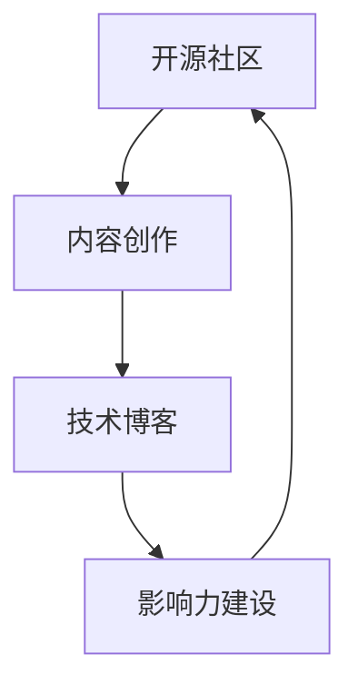

                 

# 利用开源影响力获得技术专栏作者机会

> 关键词：开源社区,技术博客,影响力建设,个人品牌,内容创作

## 1. 背景介绍

在当前互联网时代，开源社区成为了技术分享和交流的重要平台。无论是对个人技术提升，还是对公司产品的推广，开源社区都提供了得天独厚的舞台。然而，如何有效地利用开源影响力，吸引更多的关注，成为技术博客作者，是一个值得探讨的问题。本文将从开源影响力构建、个人品牌塑造、内容创作技巧三个方面，为您提供一份详尽的指南，帮助您成功转型为技术专栏作者。

## 2. 核心概念与联系

### 2.1 核心概念概述

- **开源社区**：指一个以共享代码、文档、技术和资源为目的的互联网平台。开发者可以在开源社区上传代码，获取代码，交流技术。

- **技术博客**：指专门分享技术、产品、项目、经验等内容的博客或平台。技术博客可以为开发者提供展示自己技术能力、分享技术见解、建立专业形象的渠道。

- **影响力建设**：指通过各种方式提升个人或项目在开源社区中的知名度和认可度。影响力建设不仅有助于提升个人品牌价值，还能促进项目的推广和合作。

- **个人品牌**：指个人在某一领域内被广泛认可的独特形象和声誉。个人品牌不仅能够增强个人的职业竞争力，还能为技术博客带来更多的读者。

- **内容创作**：指创作技术内容的过程，包括文章撰写、视频制作、代码分享等。内容创作是技术博客的核心，也是吸引读者和建立影响力的关键。

这些核心概念通过开源社区连接，形成了一个技术传播与个人成长相互促进的闭环。开源社区为内容创作提供了丰富的素材，技术博客为影响力建设提供了展示平台，而内容创作和技术分享又进一步增强了个人品牌的价值。

### 2.2 核心概念原理和架构的 Mermaid 流程图(Mermaid 流程节点中不要有括号、逗号等特殊字符)



开源社区、内容创作、技术博客、影响力建设通过内容创作连接，形成了一条高效的技术传播链。开源社区中的优质内容可以转化为技术博客的素材，而技术博客的分享又进一步提升了开源社区的影响力。

## 3. 核心算法原理 & 具体操作步骤

### 3.1 算法原理概述

利用开源影响力获得技术专栏作者机会，实质上是一个多步骤的算法优化问题。其核心在于通过在开源社区中的活跃表现，积累个人品牌，从而获得技术博客的邀请和关注。

### 3.2 算法步骤详解

**Step 1: 选择合适的开源项目**
- 根据个人兴趣和专长，选择适合自己的开源项目。可以从个人项目或参与的社区项目中选择，也可以自主启动新项目。

**Step 2: 贡献代码和文档**
- 定期提交高质量的代码和详细的使用文档，以展示自己的技术能力。在开源社区中贡献代码是提升影响力的关键步骤。

**Step 3: 参与社区讨论**
- 积极参与社区讨论，回答其他开发者的问题，分享自己的技术见解。通过与社区成员的互动，建立良好的人际关系和信任。

**Step 4: 维护个人项目**
- 定期更新和维护自己的开源项目，保持项目的活跃度和质量。高质量的维护项目能够吸引更多的关注和合作机会。

**Step 5: 建设个人品牌**
- 利用社交媒体和博客平台，定期发布与开源项目相关的技术文章、视频等内容，展示个人专业形象和技术见解。

**Step 6: 寻找技术博客邀请**
- 在开源社区和社交媒体上积极展示自己的影响力，通过邮件、社交媒体等方式联系技术博客编辑，争取成为专栏作者的机会。

### 3.3 算法优缺点

#### 优点

- **曝光度高**：开源社区拥有大量的活跃用户，通过贡献代码、参与讨论，可以迅速提升自己的知名度。
- **技术交流**：开源社区提供了丰富的技术交流机会，有助于技术积累和创新。
- **平台优势**：技术博客平台通常有较为稳定的读者群体，有助于快速提升影响力。

#### 缺点

- **时间投入大**：开源社区和博客创作需要持续的时间投入，且短期内可能看不到明显的成果。
- **竞争激烈**：技术社区和博客平台竞争激烈，需要不断创新和优化。
- **维护难度高**：开源项目和博客内容的维护需要持续的关注和管理，避免项目的停滞。

### 3.4 算法应用领域

利用开源影响力获得技术专栏作者机会的方法，不仅适用于软件工程师和技术开发者，还适用于产品经理、项目经理等需要技术背景的职业。在开源社区中活跃的表现，可以提升个人在技术领域的权威性和影响力，为职业发展带来更多机遇。

## 4. 数学模型和公式 & 详细讲解 & 举例说明

### 4.1 数学模型构建

假设在开源社区中的影响力为 $I$，技术博客阅读量为 $R$，个人品牌价值为 $V$。则影响力和个人品牌价值的数学模型可以表示为：

$$
I = f(C, D, P)
$$

其中 $C$ 为代码贡献量，$D$ 为讨论活跃度，$P$ 为个人博客内容质量。

### 4.2 公式推导过程

根据上述模型，我们可以得到以下推导公式：

$$
\frac{\partial I}{\partial C} > 0, \quad \frac{\partial I}{\partial D} > 0, \quad \frac{\partial I}{\partial P} > 0
$$

这表明，代码贡献量、讨论活跃度、博客内容质量对影响力的提升都是正向的。

### 4.3 案例分析与讲解

以GitHub为例，分析一名开源项目贡献者如何通过代码贡献和社区互动提升影响力。

1. **代码贡献**：通过定期提交高质量的代码和文档，提升项目的活跃度。例如，每月提交10次代码，每次提交100行代码，并附上详细的使用说明。

2. **社区互动**：在开源社区的Issue和PR讨论中积极参与，回答问题，提出优化建议。例如，每月参与10次讨论，发表20条评论。

3. **个人博客**：在个人博客中发布与开源项目相关的技术文章，分享技术见解。例如，每月发布1篇高质量文章，阅读量达到5000次。

通过上述三步，逐步提升影响力，最终获得技术博客的邀请和关注。

## 5. 项目实践：代码实例和详细解释说明

### 5.1 开发环境搭建

1. **安装GitHub Desktop**：从官网下载安装GitHub Desktop，用于管理代码仓库和提交PR。
2. **创建GitHub仓库**：在GitHub上创建一个新的代码仓库，并将项目克隆到本地。
3. **配置GitHub代码**：配置GitHub的账号信息和代码仓库路径，使用Git命令进行代码提交和PR创建。

### 5.2 源代码详细实现

假设你参与了一个名为 "MyProject" 的开源项目。以下是一个简单的Python代码示例，展示如何提交代码贡献：

```python
import requests

# 获取GitHub API的访问令牌
access_token = 'your_access_token'

# 创建PR的URL
url = 'https://api.github.com/repos/owner/repository/pulls'

# 请求头
headers = {'Authorization': f'token {access_token}'}

# 提交PR
data = {
    'title': 'Add feature X',
    'body': 'Implement feature X to improve the project',
    'base': 'master',
    'head': 'my-feature'
}
response = requests.post(url, headers=headers, json=data)
```

### 5.3 代码解读与分析

以上代码通过Python的requests库，向GitHub API发送POST请求，创建一个新的PR。其中，`access_token`是你的GitHub访问令牌，`owner`和`repository`是你的仓库信息。请求头中的`Authorization`字段用于验证身份。`title`和`body`分别表示PR的标题和描述。`base`和`head`分别表示合并的目标分支和提交的分支。

### 5.4 运行结果展示

运行上述代码后，GitHub会创建一个新的PR，提交代码并触发社区讨论。通过不断提交高质量的代码和参与社区讨论，逐渐提升在开源社区中的影响力。

## 6. 实际应用场景

### 6.1 软件开发

在软件开发领域，利用开源影响力获得技术专栏作者机会尤为重要。开源项目不仅能够展示技术能力，还能提升项目的知名度，吸引更多的合作和贡献。

**应用示例**：假设你开发了一个名为 "MyFramework" 的Web框架，通过定期提交代码和文档，积极参与社区讨论，吸引了大量用户和贡献者。最终，你通过GitHub的贡献统计数据和个人博客展示，成功吸引了技术博客编辑，获得了专栏作者的机会。

### 6.2 产品管理

在产品管理领域，开源影响力同样可以发挥重要作用。通过开源项目展示产品设计和实现思路，能够提升产品的影响力和竞争力。

**应用示例**：假设你负责一款数据分析产品的管理，开发了一款开源工具 "MyDataTool"。通过定期更新和维护工具，积极参与开源社区的讨论和互动，成功提升了产品的影响力和知名度。最终，你通过GitHub的贡献数据和个人博客内容，获得了技术博客的专栏作者机会。

## 7. 工具和资源推荐

### 7.1 学习资源推荐

1. **GitHub官方文档**：GitHub是全球最大的开源社区，其官方文档详细介绍了GitHub的使用和API调用方法，是学习和实践开源社区互动的基础。

2. **GitHub Learning Lab**：GitHub Learning Lab提供了丰富的在线学习资源，帮助开发者掌握GitHub的使用技巧。

3. **博客写作指南**：如《技术博客的写作技巧》、《如何写出高质量的博客文章》等，能够帮助开发者提升博客写作水平。

4. **SEO优化教程**：如《如何优化博客SEO》、《提升博客阅读量的技巧》等，帮助开发者提升博客的曝光度和访问量。

### 7.2 开发工具推荐

1. **GitHub Desktop**：便捷的GitHub客户端，帮助开发者轻松管理代码仓库和提交PR。

2. **Git**：分布式版本控制系统，是开源社区中常用的代码管理工具。

3. **GitHub Learning Lab**：GitHub官方提供的在线学习平台，帮助开发者掌握Git和GitHub的使用技巧。

4. **Jekyll**：一种开源的静态博客生成工具，能够帮助开发者快速搭建个人博客平台。

### 7.3 相关论文推荐

1. **《开源社区中的技术传播》**：深入分析开源社区中的技术传播机制，探讨如何通过开源活动提升个人影响力。

2. **《开源项目与个人品牌建设》**：详细介绍了开源项目与个人品牌之间的关系，强调了在开源社区中展示技术能力和建立个人形象的重要性。

3. **《技术博客写作与SEO优化》**：分析技术博客写作和SEO优化的技巧，提升博客的阅读量和影响力。

4. **《开源社区的演化与未来趋势》**：探讨开源社区的演化过程和未来发展趋势，帮助开发者把握开源社区的最新动态。

## 8. 总结：未来发展趋势与挑战

### 8.1 研究成果总结

本文详细介绍了利用开源影响力获得技术专栏作者机会的方法和步骤，通过数学模型和实际案例，展示了开源社区和博客创作对个人技术提升和影响力建设的重要作用。开源社区和博客创作不仅是展示技术能力的平台，更是建立专业形象和提升职业竞争力的重要手段。

### 8.2 未来发展趋势

1. **开源社区的深度融合**：随着开源社区的发展，更多的新型协作工具和技术将涌现，开源社区将进一步融入技术博客和社交媒体，提升开发者之间的互动和协作效率。

2. **技术博客的多元化发展**：未来技术博客将更加多元化和个性化，涵盖更多的技术领域和主题，满足不同读者的需求。

3. **开源影响力的全球化**：开源社区和博客创作将不再局限于某一地区或语言，全球化的技术和知识共享将进一步提升开源影响力。

### 8.3 面临的挑战

1. **时间和精力的投入**：开源社区和博客创作需要持续的时间和精力投入，且短期内可能看不到明显的成果。

2. **竞争的加剧**：开源社区和博客平台竞争激烈，需要不断创新和优化。

3. **维护的难度**：开源项目和博客内容的维护需要持续的关注和管理，避免项目的停滞。

### 8.4 研究展望

1. **跨平台协作工具的开发**：开发跨平台、功能强大的开源协作工具，提升开源社区和博客创作的效率和质量。

2. **个性化内容推荐**：通过AI技术，实现技术博客内容的个性化推荐，提升读者的阅读体验。

3. **开源影响力的量化评估**：研究如何量化评估开源社区和技术博客的影响力，为开发者提供科学指导。

## 9. 附录：常见问题与解答

**Q1：如何在开源社区中提升代码贡献量？**

A: 定期提交高质量的代码和详细的使用文档，积极参与社区讨论和问题解答。通过建立良好的开发者关系，提升代码贡献量。

**Q2：如何提升个人博客阅读量？**

A: 撰写高质量的博客文章，定期更新内容，优化SEO和标题，使用社交媒体和邮件列表推广博客。

**Q3：如何选择适合自己的开源项目？**

A: 根据个人兴趣和专长，选择适合自己的开源项目。可以从个人项目或参与的社区项目中选择，也可以自主启动新项目。

**Q4：如何有效地参与开源社区讨论？**

A: 积极参与社区讨论，回答其他开发者的问题，分享自己的技术见解。通过与社区成员的互动，建立良好的人际关系和信任。

**Q5：如何在开源社区中展示技术能力？**

A: 通过提交高质量的代码和详细的使用文档，展示自己的技术能力。积极参与社区讨论和问题解答，提升技术影响力。

---

作者：禅与计算机程序设计艺术 / Zen and the Art of Computer Programming

