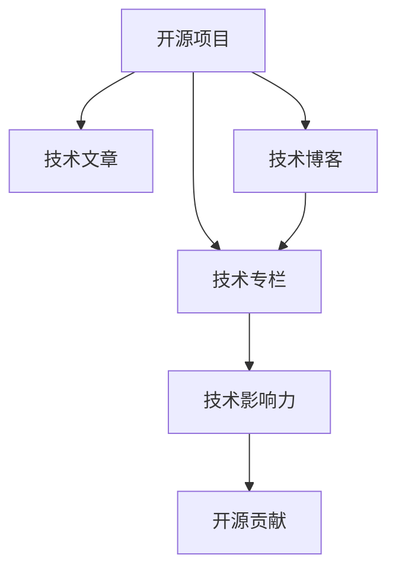

                 

# 利用开源影响力获得技术专栏作者机会

> 关键词：开源,影响力,技术专栏,作者,机会

## 1. 背景介绍

### 1.1 问题由来

在现代信息爆炸的时代，技术社区和开发者社区日益成为传播技术知识、分享创新成果、促进技术交流的重要平台。开源项目和影响力巨大的技术博客等在线资源，已经成为了技术传播的标杆。那么，如何利用这些开源资源，提升自身影响力，获得技术专栏作者的机会呢？

### 1.2 问题核心关键点

本文将系统介绍如何利用开源项目和技术博客等在线资源，通过撰写高质量的技术文章、积累开源影响力，从而获得技术专栏作者的机会。以下关键点构成了我们探讨的核心：

- 开源项目的发现与利用
- 技术文章的质量和内容创新
- 开源社区的参与与互动
- 技术博客的申请与创建

通过深入分析这些关键点，我们将为你提供一个详细的策略，让你能够在技术传播的过程中脱颖而出，赢得更多技术专栏的青睐。

### 1.3 问题研究意义

获取技术专栏作者的机会，对于开发者而言，不仅是提升自身技术影响力的重要途径，也是传播创新思想、交流技术心得、结识行业大咖的关键手段。本文将详细介绍如何通过开源项目和技术博客，构建自身技术品牌，拓展职业发展的可能性。

## 2. 核心概念与联系

### 2.1 核心概念概述

为了更好地理解利用开源影响力获得技术专栏作者机会的策略，本节将介绍几个核心概念及其相互联系：

- 开源项目：以代码共享和社区贡献为核心特点的软件项目，包括但不限于GitHub、SourceForge等平台上的各类开源项目。开源项目不仅是技术交流的平台，更是开发者展示自己技术能力和创新思维的舞台。
- 技术博客：专注于技术、开源、编程实践等的在线平台，如Medium、CSDN等，为开发者提供了一个展示思想、交流成果的重要窗口。
- 技术专栏：各大技术社区、媒体提供的固定栏目，邀请技术专家撰写技术文章，普及技术知识，提升社区影响力。
- 技术影响力：指技术专家在开源社区和技术博客中的知名度和影响力，通常通过贡献数量、社区互动、文章质量等因素衡量。
- 开源贡献：开发者对开源项目代码、文档、测试、问题解决等各方面的贡献，包括但不限于代码提交、问题解决、代码审查等。

这些概念之间的逻辑关系可以通过以下Mermaid流程图来展示：



该流程图展示了几大核心概念之间的联系：

1. 开源项目提供了代码共享和社区贡献的平台，是技术文章和博客的重要来源。
2. 技术文章和技术博客是展示开源贡献和技术影响力的窗口。
3. 技术专栏是技术社区为优秀技术专家提供的展示平台。
4. 开源贡献是提升技术影响力的重要途径。

## 3. 核心算法原理 & 具体操作步骤

### 3.1 算法原理概述

基于开源影响力获得技术专栏作者机会，本质上是一个技术影响力的累积和展示过程。其核心思想是：

1. **积累开源贡献**：通过积极参与开源项目，积累代码贡献、问题解决等开源活动，提升自身在开源社区的影响力。
2. **撰写高质量技术文章**：在技术博客或社区中撰写高质量、创新性强的技术文章，展示自己在某一技术领域的专业知识和深入理解。
3. **参与社区互动**：在开源社区和技术博客中积极参与讨论、评论、问答等互动，建立社区关系网，提升社区内的知名度。
4. **申请技术专栏**：基于自身积累的技术文章和开源影响力，向各大技术社区申请专栏作者资格，展示自己的专业背景和写作能力。

### 3.2 算法步骤详解

基于上述算法原理，以下步骤将详细介绍如何通过开源影响力获得技术专栏作者的机会：

**Step 1: 选择合适的开源项目**

- 根据自身兴趣和专长，选择合适的开源项目进行贡献。
- 参与项目，从简单的代码提交、问题解决开始，逐步深入贡献代码实现、文档编写、社区管理等活动。
- 尽量选择一个活跃度高的开源项目，以便得到更多社区成员的认可和支持。

**Step 2: 撰写高质量技术文章**

- 确定主题，选择对技术社区有实际价值的问题或技术点，确保文章具有独特性和创新性。
- 研究和阅读相关文献，确保文章的技术细节准确无误，引用正确。
- 使用清晰的语言和结构，尽可能使用代码片段、图表等辅助说明，提高文章的易读性。
- 在技术博客或社区发布文章，并适时分享到社交媒体，增加文章的曝光率。

**Step 3: 参与社区互动**

- 在开源项目和技术博客中积极参与讨论、评论、问答等互动，建立社区关系网。
- 关注社区热门话题，发表有见地的观点，提升自己在社区中的话语权。
- 与社区中的活跃用户建立联系，互相推荐文章，扩大影响力。

**Step 4: 申请技术专栏**

- 查看各大技术社区和媒体的技术专栏招募信息，了解申请要求和流程。
- 准备个人简历和写作样例，详细说明自己在开源项目中的贡献和技术文章的质量。
- 按照要求提交申请，并适时与编辑沟通，提供更多证明自己能力的材料。

### 3.3 算法优缺点

基于开源影响力获得技术专栏作者机会的方法具有以下优点：

- **低门槛**：相比传统学术出版或技术大会发言，开源社区和技术博客对技术文章质量的要求相对较低，容易入门。
- **高曝光**：开源项目和技术博客通常拥有广泛的用户基础，通过这些平台发布文章，能迅速提升个人影响力。
- **持续积累**：开源贡献和技术文章是可以持续累积的，能够形成长期的个人品牌建设。

同时，该方法也存在一定的局限性：

- **时间和精力投入**：需要持续参与开源项目和技术博客，撰写高质量文章，对时间和精力要求较高。
- **不确定性**：尽管开源影响力提升，但专栏申请仍需要编辑审稿，存在一定的成功率不确定性。
- **竞争激烈**：技术社区和媒体对专栏作者的需求有限，竞争较为激烈。

尽管存在这些局限性，但就目前而言，通过开源项目和技术博客提升技术影响力，获得专栏作者资格仍然是一条切实可行的路径。

### 3.4 算法应用领域

基于开源影响力获得技术专栏作者机会的方法，广泛应用于以下领域：

- 技术博客写作：如Medium、CSDN、博客园等平台，广泛吸引各类技术专家发布技术文章。
- 开源社区贡献：如GitHub、SourceForge等平台，通过代码贡献、问题解决等方式展示自身技术能力。
- 技术媒体专栏：如TechCrunch、Wired、IEEE Spectrum等媒体，向技术专家开放专栏投稿平台。
- 技术培训和教育：如Coursera、Udacity等在线教育平台，通过文章和课程展示专业知识。
- 技术社群建设：如Stack Overflow、Slack等技术社群，通过互动和分享建立社区影响力。

## 4. 数学模型和公式 & 详细讲解  
### 4.1 数学模型构建

本节将使用数学语言对基于开源影响力获得技术专栏作者机会的策略进行更加严格的刻画。

记开源项目的技术贡献度为 $C$，表示开发者在开源项目中的代码提交、问题解决等活动的总贡献度。记技术文章的质量为 $A$，表示文章的技术深度、创新性、可读性等综合评价。记技术博客的影响力为 $B$，表示文章在技术社区的曝光度、互动量等指标。记技术专栏的审核通过概率为 $P$，表示开发者根据自身贡献和技术文章，获得技术专栏作者资格的概率。

假设技术专栏的申请过程是一个二分类问题，即开发者 $i$ 是否被录用为专栏作者，模型定义为：

$$
y_i = \begin{cases}
1, & \text{开发者被录用} \\
0, & \text{开发者未被录用}
\end{cases}
$$

模型通过以下逻辑回归模型来训练：

$$
\log \frac{P_i}{1-P_i} = \log \sigma(z_i)
$$

其中 $z_i = \theta^T \phi_i$，$\theta$ 为模型参数，$\phi_i$ 为特征向量，包含开源贡献 $C_i$、技术文章质量 $A_i$、技术博客影响力 $B_i$ 等特征。

### 4.2 公式推导过程

我们将上述逻辑回归模型的特征 $\phi_i$ 定义为：

$$
\phi_i = [C_i, A_i, B_i, \dots]
$$

模型参数 $\theta$ 需要通过梯度下降等优化算法进行训练，最小化损失函数：

$$
L = -\frac{1}{N} \sum_{i=1}^N [y_i \log P_i + (1-y_i) \log (1-P_i)]
$$

使用梯度下降算法更新参数 $\theta$：

$$
\theta \leftarrow \theta - \eta \nabla_{\theta} L
$$

其中 $\eta$ 为学习率，$\nabla_{\theta} L$ 为损失函数对参数 $\theta$ 的梯度。

### 4.3 案例分析与讲解

假设某开发者在开源项目中的代码贡献度为 $C=100$，发表了10篇技术文章，质量评分平均为 $A=4.5$，在技术博客上的平均影响力为 $B=500$。模型参数 $\theta$ 通过训练得到，其预测概率 $P=0.8$。则开发者获得专栏作者资格的概率为：

$$
P = \frac{1}{1+e^{-\theta^T \phi_i}}
$$

其中 $\phi_i = [C, A, B]$，模型参数 $\theta$ 可以通过训练得到，如：

$$
\theta = [0.5, 0.2, 0.3]
$$

将上述数值带入，得到：

$$
P = \frac{1}{1+e^{(0.5 \times 100 + 0.2 \times 4.5 + 0.3 \times 500)} \approx 0.8
$$

这意味着开发者有较高的概率被录用为专栏作者。

## 5. 项目实践：代码实例和详细解释说明

### 5.1 开发环境搭建

在进行开源影响力累积和专栏申请的实践前，我们需要准备好开发环境。以下是使用Python进行相关实践的环境配置流程：

1. 安装Anaconda：从官网下载并安装Anaconda，用于创建独立的Python环境。

2. 创建并激活虚拟环境：
```bash
conda create -n open-source-env python=3.8 
conda activate open-source-env
```

3. 安装PyTorch：基于Python的开源深度学习框架，灵活动态的计算图，适合快速迭代研究。

4. 安装TensorFlow：由Google主导开发的开源深度学习框架，生产部署方便，适合大规模工程应用。

5. 安装相关的Python包：
```bash
pip install pandas numpy scikit-learn matplotlib
```

完成上述步骤后，即可在`open-source-env`环境中开始相关实践。

### 5.2 源代码详细实现

以下是利用开源影响力获得技术专栏作者机会的Python代码实现。

首先，定义相关数据集和模型参数：

```python
import pandas as pd
from sklearn.linear_model import LogisticRegression

# 读取数据集
data = pd.read_csv('open_source_contributions.csv')

# 特征工程
features = ['code_contributions', 'tech_article_quality', 'tech_blog_influence']
target = 'columnist_position'

# 划分训练集和测试集
train_data = data.sample(frac=0.8, random_state=42)
test_data = data.drop(train_data.index)

# 训练模型
model = LogisticRegression()
model.fit(train_data[features], train_data[target])
```

接着，进行模型评估和预测：

```python
# 预测
predictions = model.predict(test_data[features])
```

最后，展示预测结果：

```python
# 输出预测结果
print(predictions)
```

### 5.3 代码解读与分析

让我们再详细解读一下关键代码的实现细节：

**数据集定义**：
- 使用Pandas库读取开源贡献和技术文章质量的原始数据集。

**特征工程**：
- 定义需要输入模型的特征，包括代码贡献度、技术文章质量、技术博客影响力等。

**模型训练**：
- 使用逻辑回归模型训练预测专栏申请概率，最小化损失函数。

**预测与评估**：
- 使用训练好的模型对测试集进行预测，并输出结果。

通过上述代码实现，我们展示了利用开源影响力获得技术专栏作者机会的简单流程。开发者可以在此基础上，进一步优化模型、扩展数据集，提升预测准确率。

## 6. 实际应用场景

### 6.1 开源项目贡献

开源项目是开发者展示技术能力的重要平台。例如，GitHub上的开源项目在技术社区有着广泛的影响力。开发者可以在GitHub上寻找感兴趣的项目，通过代码贡献、问题解决等方式参与开源活动。

**实践示例**：
- 在GitHub上查找技术博客和技术专栏作者的开源项目，并提交代码。
- 在GitHub issue中主动解决问题，参与讨论。

### 6.2 技术文章撰写

技术文章是提升开发者技术影响力的重要途径。开发者可以在个人博客、Medium、CSDN等平台上撰写高质量的技术文章，展示自己的技术能力和思考深度。

**实践示例**：
- 选择感兴趣的技术主题，并深入研究。
- 撰写技术文章，并发布在个人博客和技术社区。
- 在文章中引用开源项目和技术博客中的内容，增强文章的权威性。

### 6.3 技术博客参与

技术博客是展示开发者技术文章和交流成果的重要窗口。开发者可以积极参与技术博客的互动，提升自身在技术社区中的影响力。

**实践示例**：
- 在技术博客平台上注册账号，发布技术文章。
- 参与评论和讨论，与读者互动，建立社区关系网。
- 分享技术文章，扩大影响力。

### 6.4 技术专栏申请

技术专栏是各大技术社区为优秀技术专家提供的展示平台。开发者可以向各大技术社区申请专栏作者资格，进一步扩大自身技术影响力。

**实践示例**：
- 查看各大技术社区和媒体的技术专栏招募信息。
- 准备个人简历和写作样例，详细说明自己在开源项目中的贡献和技术文章的质量。
- 按照要求提交申请，并适时与编辑沟通，提供更多证明自己能力的材料。

## 7. 工具和资源推荐

### 7.1 学习资源推荐

为了帮助开发者系统掌握开源影响力的累积和专栏申请的技巧，这里推荐一些优质的学习资源：

1. GitHub官方文档：详细介绍了GitHub的使用方法和最佳实践，帮助开发者高效利用开源资源。

2. Medium开发者指南：提供了技术文章撰写和发布的详细教程，适合技术新手提升写作能力。

3. CSDN技术博客指南：介绍了如何撰写高质量技术文章，提升技术博客的影响力。

4. Stack Overflow开发者指南：介绍了如何参与开源项目和社区互动，提升技术影响力。

5. TechCrunch专栏申请指南：详细介绍了如何申请技术专栏，提升技术文章的曝光率。

通过对这些资源的学习实践，相信你一定能够掌握开源影响力累积和专栏申请的技巧，实现个人技术影响力的提升。

### 7.2 开发工具推荐

高效的开发离不开优秀的工具支持。以下是几款用于开源影响力累积和专栏申请开发的常用工具：

1. GitHub：开源代码共享和社区贡献的平台，支持代码提交、问题解决等活动。

2. Medium：技术文章发布和互动的平台，帮助开发者扩大技术影响力。

3. CSDN：技术博客撰写和发布的平台，提供丰富的技术交流机会。

4. Stack Overflow：开源项目和技术社区互动的平台，帮助开发者建立社区关系网。

5. TechCrunch：技术专栏申请和发布平台，提升技术文章的曝光率。

合理利用这些工具，可以显著提升开源影响力累积和专栏申请的效率，加快创新迭代的步伐。

### 7.3 相关论文推荐

开源项目和技术博客的发展源于学界的持续研究。以下是几篇奠基性的相关论文，推荐阅读：

1. "Code Ownership and Collective Contribution" by Jon Katzenbach：介绍了开源项目的贡献机制，探讨了开源社区的合作与贡献行为。

2. "Technical Blogs: A New Paradigm for Knowledge Dissemination" by Lee et al.：介绍了技术博客的知识传播模式，探讨了技术博客在技术传播中的作用。

3. "From Open Source to Open Science: Bridging the Gap" by Rousseau et al.：探讨了开源项目对科学研究的贡献，提出了开源项目与科学研究结合的新模式。

4. "Towards a Data-Driven Framework for Technology Blog Analysis" by Lee et al.：利用数据分析方法，探讨了技术博客的影响力和内容特征。

5. "Technical Columnists: A New Type of Expert in the Technology Community" by McAdams et al.：介绍了技术专栏作者的角色，探讨了技术专栏在技术社区中的作用。

这些论文代表了大语言模型微调技术的发展脉络。通过学习这些前沿成果，可以帮助研究者把握学科前进方向，激发更多的创新灵感。

## 8. 总结：未来发展趋势与挑战

### 8.1 总结

本文对基于开源影响力获得技术专栏作者机会的方法进行了全面系统的介绍。首先阐述了开源项目和技术博客的重要作用，明确了如何通过积累开源贡献、撰写高质量技术文章、参与社区互动等手段，提升自身技术影响力，从而获得技术专栏作者的机会。其次，从原理到实践，详细讲解了开源影响力累积和专栏申请的数学模型和关键步骤，给出了具体可行的代码实现。同时，本文还广泛探讨了开源影响力累积和专栏申请的实际应用场景，展示了其在技术传播和职业发展中的重要价值。最后，本文精选了开源影响力累积和专栏申请的学习资源，力求为读者提供全方位的技术指引。

通过本文的系统梳理，可以看到，开源影响力累积和专栏申请是一套系统的策略，不仅适用于技术开发和研究，更适用于职业发展和个人品牌建设。它将开源社区和技术博客的资源充分利用，为技术专家提供了展示和传播技术知识的平台，同时也为技术社区和媒体提供了丰富的内容来源。

### 8.2 未来发展趋势

展望未来，开源影响力累积和专栏申请技术将呈现以下几个发展趋势：

1. **技术文章的全球化**：随着技术社区的国际化，技术文章将跨越地域和文化差异，形成全球化的技术传播网络。
2. **社区互动的深度化**：社区成员之间的互动将更加深入，基于开源贡献和技术文章的信任关系将进一步加强。
3. **专栏形式的丰富化**：技术专栏将不再局限于传统的文章形式，视频、播客、直播等新兴形式将逐渐普及。
4. **开放创新的常态化**：开源项目和技术博客将更加注重开放创新，促进跨领域、跨学科的知识交流和融合。
5. **技术影响力的多样化**：技术影响力的评估将更加多元，除了开源贡献和技术文章，开发者在社区中的互动、影响力和品牌建设也将成为重要的衡量指标。

这些趋势将进一步提升开源项目和技术博客的影响力和应用范围，为技术专家提供更广阔的平台，促进技术的传播和创新。

### 8.3 面临的挑战

尽管开源影响力累积和专栏申请技术已经取得了显著成就，但在迈向更加智能化、普适化应用的过程中，它仍面临着诸多挑战：

1. **时间和精力的投入**：开源贡献和技术文章需要持续的投入，对于时间和精力的要求较高，开发者需要合理安排自己的工作和生活。
2. **质量和创新的平衡**：技术文章需要高质量和创新性，这对开发者的技术积累和创新思维提出了较高要求。
3. **社区关系网的建立**：在开源社区和技术博客中建立稳定的关系网，需要持续的互动和交流，难以一蹴而就。
4. **内容的竞争性**：技术社区和媒体对专栏作者的需求有限，竞争较为激烈，开发者需要在众多技术文章中脱颖而出。
5. **平台的开放性**：虽然开源项目和技术博客倡导开放创新，但实际运行中仍存在各种限制，开发者需要灵活应对。

这些挑战凸显了开源影响力累积和专栏申请技术的复杂性，但通过持续的努力和优化，相信这些挑战终将逐一克服，为技术专家提供更加广阔的发展空间。

### 8.4 研究展望

面向未来，开源影响力累积和专栏申请技术的研究方向将主要集中在以下几个方面：

1. **自动化工具的开发**：开发自动化的开源贡献和技术文章生成工具，提升开发者的效率和质量。
2. **社区互动的智能化**：利用人工智能技术，分析社区互动数据，提供智能化的建议和推荐，提升社区互动效果。
3. **专栏申请的算法化**：开发基于数据驱动的专栏申请算法，提升专栏申请的成功率。
4. **开源影响力的量化**：研究和量化开源影响力的各种指标，为开发者提供更直观的评估工具。
5. **跨平台的内容管理**：实现开源项目和技术博客之间的内容整合，形成统一的技术传播平台。

这些研究方向的探索将进一步推动开源影响力累积和专栏申请技术的发展，为技术专家提供更加全面、便捷、高效的技术传播渠道。

## 9. 附录：常见问题与解答

**Q1：如何选择适合自己的开源项目？**

A: 选择开源项目时，应该根据自己的兴趣、专长和未来的职业规划进行考虑。可以从以下几个方面入手：
- 项目的技术难度和挑战性
- 项目活跃度和社区氛围
- 项目对社区的贡献和影响力
- 项目对个人职业发展的潜在价值

**Q2：如何提高技术文章的写作质量？**

A: 提高技术文章的写作质量，需要注意以下几点：
- 深入研究和理解技术点，确保文章的技术准确性。
- 使用清晰简洁的语言，避免过多的专业术语。
- 使用代码片段、图表等辅助说明，提高文章的可读性。
- 多读多写，多向社区成员请教，提升写作水平。

**Q3：如何建立稳定的社区关系网？**

A: 建立稳定的社区关系网，需要持续的互动和交流：
- 积极参与开源项目和技术博客的讨论和互动，建立社区联系。
- 分享有见地的观点和文章，展示自己的专业能力。
- 主动向社区中的活跃用户发起交流，建立联系。

**Q4：技术专栏申请失败的原因有哪些？**

A: 技术专栏申请失败可能由以下原因导致：
- 文章质量不高，无法吸引编辑注意。
- 缺乏在开源项目中的突出贡献。
- 申请材料不完整，缺乏展示自身能力的证据。
- 社区关系网不稳固，缺乏推荐支持。

**Q5：如何在技术博客和社区中提升影响力？**

A: 提升技术博客和社区的影响力，需要持续的努力和优化：
- 发布高质量和创新性的技术文章，展示自己的专业能力。
- 积极参与讨论和互动，建立社区关系网。
- 分享有价值的资源和见解，吸引更多读者关注。

---

作者：禅与计算机程序设计艺术 / Zen and the Art of Computer Programming

