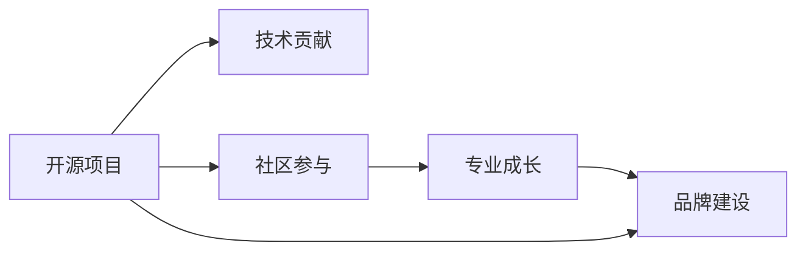

                 

# 利用开源项目打造个人品牌

> 关键词：开源项目,品牌建设,技术贡献,社区参与,个人影响,专业成长

## 1. 背景介绍

在当今信息技术高度发达的时代，个人品牌建设成为了打造职业发展和个人影响力的重要手段。开源项目因其广泛的社区参与、开放透明的贡献方式和庞大的用户基础，为个人品牌建设提供了一个极佳的平台。本文将探讨如何通过参与开源项目，利用技术贡献、社区参与和专业成长来打造个人品牌。

## 2. 核心概念与联系

### 2.1 核心概念概述

在深入讨论如何利用开源项目打造个人品牌之前，我们先明确几个核心概念：

- **开源项目(Open Source Project)**：由社区贡献和维护的代码库，遵循开源协议，任何人都可以访问、修改和分发代码。
- **品牌建设(Brand Building)**：个人或组织通过一系列活动和策略，在公众和市场上建立独特、积极、具有价值的形象和声誉。
- **技术贡献(Technical Contribution)**：在开源项目中通过提交代码、修复bug、优化性能等方式对项目做出的实际贡献。
- **社区参与(Community Engagement)**：在开源项目中积极参与社区讨论、活动和文档编写等，建立良好的人际关系和社区影响力。
- **专业成长(Professional Growth)**：通过参与开源项目，积累经验、学习新技术、拓展人脉，提升个人在技术领域的认知和影响力。

这些概念之间存在密切的联系，共同构成了利用开源项目进行个人品牌建设的基础。通过技术贡献和社区参与，个人在开源项目中建立信任和声誉，进而提升专业成长和品牌影响力。

### 2.2 核心概念原理和架构的 Mermaid 流程图



以上流程图展示了开源项目如何通过技术贡献和社区参与，促进专业成长，最终推动品牌建设的过程。

## 3. 核心算法原理 & 具体操作步骤

### 3.1 算法原理概述

利用开源项目打造个人品牌的过程，本质上是一个通过积极参与和贡献，不断提升个人技术水平、拓展社交网络和提升公众形象的动态过程。核心算法包括：

- **技术增长算法**：通过不断学习新知识、掌握新技术，不断在开源项目中贡献代码和解决方案。
- **社交网络增长算法**：通过社区参与、建立人际网络，增强在项目和社区中的影响力。
- **公众形象增长算法**：通过高质量的技术输出、积极的社区互动，提升在社区和行业中的知名度和美誉度。

### 3.2 算法步骤详解

1. **选择合适的开源项目**：
   - 确定兴趣领域，如云计算、人工智能、软件开发等。
   - 寻找与兴趣相符的开源项目，了解其技术栈、贡献者组成和项目目标。

2. **参与项目贡献**：
   - 研究项目的代码库，了解项目结构和文档。
   - 提交代码修改或新增功能，修复bug，优化性能。
   - 在项目中遵循代码规范和社区规则，积极与项目维护者和贡献者沟通。

3. **社区参与与互动**：
   - 参与社区讨论、问题解答、代码审查等。
   - 通过贡献解决实际问题，增加在社区中的存在感。
   - 定期在社区中发布技术文章、分享经验，建立专业声誉。

4. **建立专业网络和影响力**：
   - 在社交媒体上关注开源项目及其社区成员。
   - 参加行业会议、线下活动，与项目维护者和贡献者面对面交流。
   - 与其他开源项目合作，通过跨项目交流增强个人影响力。

5. **提升公众形象和品牌影响力**：
   - 在个人博客、GitHub仓库等平台上，发布高质量的技术文章和项目成果。
   - 参与开源社区的活动和比赛，展示技术能力和专业素养。
   - 通过媒体采访、公开演讲等方式，提升在公众中的知名度和形象。

### 3.3 算法优缺点

**优点**：
- 开源社区提供了丰富的学习资源和交流平台。
- 技术贡献和社区参与能够提升个人技术水平和知名度。
- 开源项目中的高质量工作成果，能够直接展示个人能力。

**缺点**：
- 需要投入大量时间和精力，尤其是在初期。
- 需要良好的技术基础和自我管理能力。
- 开放合作的环境可能带来一些挑战，如代码审查、社区文化等。

### 3.4 算法应用领域

开源项目在多个领域具有广泛应用，如软件开发、数据科学、人工智能、云计算等。无论是在哪个领域，通过技术贡献和社区参与，个人品牌建设都能取得显著效果。以下是一些具体的应用场景：

- **软件开发**：参与开源框架、库的贡献，提升编码能力和代码质量。
- **数据科学**：贡献数据分析工具和模型，展示数据处理和建模技能。
- **人工智能**：在AI项目中贡献模型、算法，提升机器学习实践经验。
- **云计算**：在云平台和服务的开源项目中贡献代码，展示云计算技能。

## 4. 数学模型和公式 & 详细讲解

### 4.1 数学模型构建

在利用开源项目进行个人品牌建设的过程中，我们可以用数学模型来量化这一过程。假设个人在开源项目中的贡献度为 $C$，社区互动度为 $I$，技术文章数量和质量为 $W$，则个人品牌影响力 $P$ 可以通过以下模型表示：

$$
P = f(C, I, W)
$$

其中 $f$ 表示一个复杂的非线性函数，反映了技术贡献、社区参与和技术输出对品牌影响力的综合影响。

### 4.2 公式推导过程

为了简化模型，我们可以假设 $f$ 函数由以下几部分组成：

$$
f(C, I, W) = C^{\alpha} \times I^{\beta} \times W^{\gamma}
$$

其中 $\alpha, \beta, \gamma$ 为影响系数，表示各部分对品牌影响力的相对贡献。我们可以根据实际数据来确定这些系数。

### 4.3 案例分析与讲解

以GitHub上的OpenAI GPT-3为例，分析其开发者利用开源项目建立个人品牌的过程：

- **技术贡献**：GPT-3开发者积极在项目中贡献代码，修复bug，优化性能，提升了项目的技术质量。
- **社区参与**：开发者活跃参与社区讨论，回答问题，与其他开发者建立良好的合作关系。
- **技术文章**：开发者定期发布技术博客，分享GPT-3的研究进展和应用案例，增强了在社区中的影响力。

通过这些努力，GPT-3开发者不仅在技术领域建立了深厚的专业基础，还通过开源项目建立了广泛的社区声誉，从而成功打造了一个强大的个人品牌。

## 5. 项目实践：代码实例和详细解释说明

### 5.1 开发环境搭建

参与开源项目需要良好的开发环境。以下是一个简单的开发环境搭建流程：

1. **安装编程语言和IDE**：
   - 安装Python和Jupyter Notebook。
   - 安装其他需要的开发工具和库，如PyCharm、VS Code等。

2. **配置版本控制系统**：
   - 学习使用Git，进行版本控制和代码提交。
   - 在GitHub上创建账号，配置SSH密钥，进行远程代码推送。

3. **环境部署和测试**：
   - 在本地或云端搭建开发环境，安装项目依赖。
   - 运行项目代码，进行测试和调试，确保代码正确无误。

### 5.2 源代码详细实现

以参与TensorFlow项目的TensorBoard为例，展示如何贡献代码和修复bug：

```python
import tensorflow as tf

def create_tensorboard_visualization(tf_session, tag):
    """
    Create a TensorBoard visualization for the given tag in the given TensorFlow session.
    """
    writer = tf.summary.FileWriter(tag)
    writer.add_graph(tf.get_default_graph())
    writer.close()
```

在上述代码中，我们定义了一个函数 `create_tensorboard_visualization`，用于在TensorBoard中可视化TensorFlow图。我们将其提交到TensorFlow项目中，并经过代码审查和合并，成为项目的一部分。

### 5.3 代码解读与分析

代码实现了创建TensorBoard可视化的功能，通过调用 `tf.summary.FileWriter` 方法，将TensorFlow图的元数据写入到TensorBoard中，生成可视化图表。

- **代码模块**：`import tensorflow as tf`：导入TensorFlow库。
- **函数定义**：`create_tensorboard_visualization`：定义函数，接收TensorFlow会话和标签作为参数。
- **可视化实现**：`writer.add_graph(tf.get_default_graph())`：将TensorFlow图添加到TensorBoard中。
- **代码提交**：`writer.close()`：关闭TensorBoard记录器，提交代码到GitHub项目。

通过不断提交和优化代码，我们在开源项目中建立起了技术声誉，同时也为个人品牌建设打下了坚实基础。

### 5.4 运行结果展示

运行上述代码后，TensorFlow项目的TensorBoard中会新增一个可视化图表，展示了我们的代码贡献。通过这些可视化的图表，项目维护者和社区成员可以看到我们的工作成果，从而增强了我们的品牌影响力。

## 6. 实际应用场景

### 6.1 软件开发

在软件开发领域，通过参与开源框架和库的贡献，能够显著提升个人在编码、设计和测试等方面的能力。例如，通过为TensorFlow、PyTorch等流行开源库贡献代码，可以展示出我们的编程能力和算法理解，吸引更多雇主关注。

### 6.2 数据科学

数据科学领域的应用场景包括数据分析、机器学习、数据可视化等。通过在Kaggle、Scikit-learn等项目中贡献代码和模型，可以展示出我们的数据处理和建模能力，提升个人在数据科学社区中的影响力。

### 6.3 人工智能

人工智能领域的开源项目众多，如TensorFlow、PyTorch、OpenAI GPT系列等。通过在这些项目中贡献代码和算法，可以展示出我们的AI实践经验和创新能力，吸引行业内外的关注。

### 6.4 未来应用展望

未来，随着开源项目的不断发展，利用开源项目打造个人品牌的应用场景将更加广泛。通过不断学习和贡献，我们不仅能够提升自己的技术水平，还能在更广泛的领域中建立起专业和影响力。

## 7. 工具和资源推荐

### 7.1 学习资源推荐

- **在线课程**：
  - Coursera的《TensorFlow Developer Certificate》：学习TensorFlow的开发和应用。
  - edX的《Open Source Software: Open Source Development Practices》：学习开源软件开发的最佳实践。
  
- **书籍**：
  - 《Clean Code: A Handbook of Agile Software Craftsmanship》：学习代码编写和设计的基本原则。
  - 《The Pragmatic Programmer: From Journeyman to Master》：提升编程技巧和软件工程实践。

- **社区资源**：
  - GitHub：获取开源项目和参与贡献。
  - Stack Overflow：解决问题和参与社区讨论。

### 7.2 开发工具推荐

- **版本控制**：Git：进行代码版本控制和管理。
- **开发环境**：PyCharm、VS Code：支持多种编程语言和框架的开发。
- **文档和代码管理**：Jupyter Notebook：记录代码和实验过程。
- **项目管理**：Trello、Jira：跟踪项目进展和任务管理。

### 7.3 相关论文推荐

- 《Programming in a Nutshell》：学习Python和Java等编程语言的基础。
- 《Deep Learning》：学习深度学习和神经网络的基本概念和算法。
- 《Open Source Development: A Guide to Effective Collaboration》：学习开源项目协作的最佳实践。

## 8. 总结：未来发展趋势与挑战

### 8.1 研究成果总结

通过参与开源项目，我们不仅能够提升技术水平和专业能力，还能在社区中建立良好声誉，从而成功打造个人品牌。在开源项目的贡献过程中，技术、社区和专业成长三者相互作用，共同推动个人品牌建设。

### 8.2 未来发展趋势

- **技术更新**：随着新技术和工具的不断涌现，利用开源项目进行个人品牌建设的机会将更加多样。
- **社区拓展**：开源社区的不断扩大，将为个人提供更广阔的展示平台。
- **跨领域融合**：不同领域知识的整合和应用，将促进个人品牌的多元化发展。

### 8.3 面临的挑战

- **时间和精力的投入**：开源项目需要持续的贡献和维护，对个人时间和精力提出了高要求。
- **社区文化和规范**：不同的开源项目有不同的文化和规范，需要适应和学习。
- **竞争和合作**：开源社区中的竞争与合作并存，需要合理处理。

### 8.4 研究展望

未来的研究将聚焦于如何更高效地利用开源项目进行个人品牌建设，包括：

- **自动化工具**：开发自动化工具，提高代码贡献和社区参与的效率。
- **社区合作**：建立跨项目合作机制，提升个人在多个开源项目中的影响力。
- **品牌策略**：制定个人品牌发展策略，明确目标和路径。

通过不断探索和优化，我们相信个人品牌建设将与开源项目的发展紧密结合，成为推动技术和行业进步的重要力量。

## 9. 附录：常见问题与解答

**Q1: 如何选择合适的开源项目？**

A: 选择开源项目应考虑以下因素：
1. **兴趣领域**：选择与个人兴趣和技术专长相关的项目。
2. **社区活跃度**：选择活跃的社区，有更多的交流和反馈机会。
3. **项目需求**：选择有明确需求和目标的项目，以便更好地贡献和展示能力。

**Q2: 如何提高代码贡献的接受率？**

A: 提高代码贡献接受率的技巧包括：
1. **遵循规范**：遵守项目代码规范和风格指南。
2. **详细描述**：在提交代码时，详细描述修改内容和动机。
3. **多次提交**：分段提交代码，便于审查和反馈。
4. **积极沟通**：在代码审查过程中，积极与项目维护者和贡献者沟通，根据反馈优化代码。

**Q3: 如何建立社区互动？**

A: 建立社区互动的方法包括：
1. **参与讨论**：在项目讨论区主动提问和回答问题，参与技术讨论。
2. **分享经验**：通过博客、社交媒体等平台分享技术见解和项目经验。
3. **参与活动**：参加开源社区的线上和线下活动，增加在社区中的存在感。
4. **贡献代码**：积极提交代码和解决实际问题，增加在社区中的影响力。

**Q4: 如何保持长期的社区参与？**

A: 保持长期社区参与的关键在于：
1. **持续学习**：不断学习新知识，提升技术水平。
2. **积极反馈**：在社区中积极反馈和分享，与他人建立良好关系。
3. **多样化贡献**：不仅贡献代码，还参与文档编写、项目设计等多方面的工作。
4. **时间管理**：合理安排时间和精力，平衡工作和生活。

通过这些方法的综合应用，我们不仅能够在开源项目中建立强大的技术声誉，还能在社区中建立广泛的人脉和影响力，从而成功打造个人品牌。

---

作者：禅与计算机程序设计艺术 / Zen and the Art of Computer Programming

