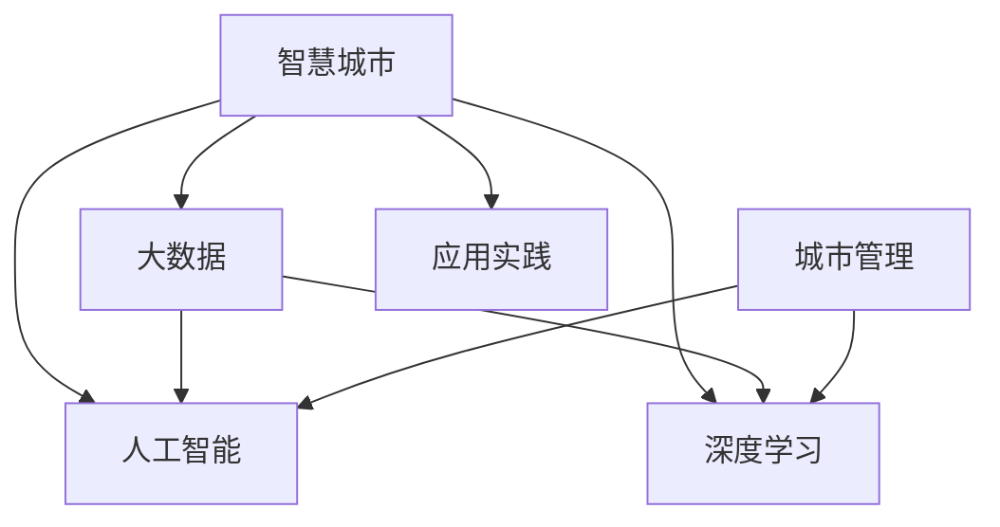

                 

# 利用技术优势进行智慧城市解决方案创新

> 关键词：智慧城市, 大数据, 人工智能, 深度学习, 城市管理, 应用实践

## 1. 背景介绍

### 1.1 问题由来
随着城市化进程的加快，人口密集、资源紧张、环境污染等问题愈发突出。传统城市管理手段和技术已难以应对日益增长的城市复杂性。智慧城市（Smart City）的概念应运而生，其旨在通过新一代信息技术和深度学习技术，实现城市运行的数据化和智能化，提升城市管理效率，改善居民生活质量。

### 1.2 问题核心关键点
智慧城市的核心在于数据的整合、处理和智能决策。当前，智慧城市构建面临诸多挑战，包括：
- 数据源多样且海量：城市运行涉及交通、环境、公共安全等多个领域，数据源分散且规模庞大。
- 数据质量参差不齐：数据采集设备种类繁多，数据格式和质量参差不齐，导致数据一致性和准确性问题。
- 数据价值密度低：海量数据中真正有价值的信息占比低，数据清洗和特征提取难度大。
- 系统集成复杂：不同系统间数据格式、接口标准不一，集成难度大，难以构建高效、协调的系统。

这些问题不仅对城市管理提出了新的挑战，也为智慧城市的应用和发展带来了巨大机遇。如何利用现有技术优势，高效整合和分析城市数据，构建智能决策支持系统，将成为推动智慧城市发展的关键。

## 2. 核心概念与联系

### 2.1 核心概念概述

为了更好地理解智慧城市解决方案的创新思路，本节将介绍几个关键概念：

- **智慧城市（Smart City）**：通过现代信息技术和深度学习技术，将城市基础设施、公共服务、环境监测等信息数字化、智能化，实现城市管理的精细化和智能化。
- **大数据（Big Data）**：指规模大、类型多、速度快的海量数据，涉及城市交通、公共安全、环境保护等多个领域。
- **人工智能（AI）**：利用机器学习、深度学习等技术，使计算机能够模拟和延伸人类智能，实现复杂任务的自动化和智能化。
- **深度学习（Deep Learning）**：一种基于神经网络的机器学习方法，通过多层次的特征提取和表示学习，能够从数据中自动抽取高级特征，实现模式识别和决策支持。
- **城市管理（Urban Management）**：涉及交通、环境、公共安全等多个领域的综合管理，旨在提高城市运行效率，改善居民生活质量。
- **应用实践（Application Practice）**：指将人工智能技术应用于智慧城市建设的实际场景中，解决具体的城市管理问题。

这些概念之间的逻辑关系可以通过以下Mermaid流程图来展示：



这个流程图展示了智慧城市构建过程中，大数据、人工智能和深度学习的技术架构。智慧城市作为顶层目标，需要大数据为支撑，人工智能和深度学习为手段，最终通过应用实践实现城市管理的智能化。

## 3. 核心算法原理 & 具体操作步骤
### 3.1 算法原理概述

智慧城市解决方案的核心在于数据驱动的智能决策。通过整合和分析海量城市数据，利用深度学习等技术，构建智能模型，进行实时决策和预测，从而提升城市管理效率，改善居民生活质量。

形式化地，假设城市运行数据集为 $D=\{(x_i, y_i)\}_{i=1}^N$，其中 $x_i$ 表示城市运行的状态特征，$y_i$ 表示对应的管理决策。构建智慧城市模型的目标是通过训练模型，学习 $x_i$ 和 $y_i$ 之间的映射关系，即找到最优模型参数 $\theta$，使得模型 $M_{\theta}(x_i) \approx y_i$。

智慧城市解决方案包括数据采集、数据处理、模型训练和应用部署等多个环节。其关键步骤如下：

1. **数据采集**：通过各类传感器、监控设备、公开数据接口等方式，收集城市运行状态数据和历史决策数据。
2. **数据预处理**：对原始数据进行清洗、去噪、特征提取等处理，转换为模型输入。
3. **模型训练**：使用深度学习等技术，构建智能模型，对预处理后的数据进行训练，优化模型参数。
4. **模型部署**：将训练好的模型部署到实际应用场景中，进行实时预测和决策。

### 3.2 算法步骤详解

智慧城市解决方案的实施步骤如下：

**Step 1: 数据采集与预处理**
- 集成各类数据源：包括传感器数据、交通数据、环境监测数据、公共服务数据等，通过API接口或文件读取等方式，获取数据。
- 数据清洗与标准化：对数据进行去重、去噪、缺失值处理等，确保数据质量和一致性。
- 特征提取与选择：通过PCA、LDA、特征工程等方法，提取和选择有价值的数据特征。

**Step 2: 构建智能模型**
- 选择模型架构：根据实际需求，选择适当的深度学习模型架构，如卷积神经网络（CNN）、循环神经网络（RNN）、图神经网络（GNN）等。
- 数据划分与分布式训练：将数据划分为训练集、验证集和测试集，使用分布式训练框架，加快模型训练速度。
- 模型训练与优化：通过梯度下降等优化算法，训练模型，最小化损失函数，提升模型精度。

**Step 3: 模型部署与监控**
- 模型部署：将训练好的模型部署到生产环境，进行实时预测和决策。
- 模型监控与调优：通过实时监控系统性能，及时调整模型参数和数据输入，确保模型稳定性。
- 反馈与优化：根据模型预测结果和实际效果，进行反馈与优化，持续提升模型性能。

**Step 4: 应用场景实现**
- 交通管理：通过交通传感器数据，预测交通流量，优化信号灯控制。
- 环境监测：通过空气质量监测数据，预测污染指数，提出治理建议。
- 公共安全：通过视频监控数据，识别异常行为，及时预警。
- 服务管理：通过服务数据，评估公共服务效果，优化资源配置。

### 3.3 算法优缺点

智慧城市解决方案利用深度学习等技术，具有以下优点：
1. 高效处理海量数据：深度学习模型能够自动提取数据中的高级特征，处理大规模数据集效率高。
2. 实时决策与预测：基于深度学习模型的智能决策系统，能够实现实时预测和决策，提升城市管理响应速度。
3. 适应性强：深度学习模型具有良好的泛化能力，能够适应不同领域的城市管理需求。
4. 自动化与智能化：深度学习模型能够自动化地进行数据分析和处理，减轻人工负担。

同时，该方法也存在以下局限性：
1. 数据依赖性强：深度学习模型依赖高质量、大规模的数据，数据采集和清洗难度大。
2. 模型复杂度高：深度学习模型的训练和部署需要较强的计算资源和技术支持，成本较高。
3. 模型可解释性差：深度学习模型通常是黑盒模型，难以解释其内部工作机制和决策逻辑。
4. 鲁棒性不足：面对异常数据和噪声，深度学习模型容易出现过拟合或性能下降。
5. 安全性问题：深度学习模型容易受到对抗样本攻击，存在安全隐患。

尽管存在这些局限性，但总体而言，智慧城市解决方案在提升城市管理智能化和效率方面具有显著优势，未来有望进一步优化和完善。

### 3.4 算法应用领域

智慧城市解决方案在多个领域得到了广泛应用，例如：

- **交通管理**：通过智能交通系统，实时监控交通流量，优化信号灯控制，减少交通拥堵。
- **环境监测**：利用传感器数据，监测空气、水质等环境指标，提供环境治理建议。
- **公共安全**：通过视频监控和行为分析，识别异常行为，及时预警安全事件。
- **服务管理**：通过公共服务数据分析，优化资源配置，提升服务效率。
- **智能家居**：利用传感器数据，实现智能控制和自动化管理，提升居住体验。
- **智慧医疗**：通过电子健康记录数据，预测疾病风险，提供个性化医疗建议。

这些应用展示了智慧城市解决方案在城市管理中的广泛应用前景，未来有望进一步拓展到更多领域，为城市发展注入新的活力。

## 4. 数学模型和公式 & 详细讲解  
### 4.1 数学模型构建

智慧城市解决方案的核心在于构建智能模型，实现数据的智能分析与决策。这里假设使用的深度学习模型为神经网络 $M_{\theta}(x)$，其中 $x$ 表示城市运行状态特征，$\theta$ 表示模型参数。假设训练集为 $D=\{(x_i, y_i)\}_{i=1}^N$，其中 $x_i$ 表示第 $i$ 个样本的城市运行状态特征，$y_i$ 表示对应的管理决策。

智慧城市模型的训练目标是最小化经验风险，即找到最优参数 $\theta$，使得模型预测结果与真实标签尽可能一致。常用的损失函数包括均方误差（MSE）、交叉熵（CE）、对数损失（Log Loss）等。以均方误差损失函数为例，其定义为：

$$
\mathcal{L}(\theta) = \frac{1}{N}\sum_{i=1}^N (y_i - M_{\theta}(x_i))^2
$$

智慧城市模型在训练过程中，通过反向传播算法，计算损失函数对模型参数 $\theta$ 的梯度，并使用优化算法（如随机梯度下降、Adam等）更新模型参数，最小化损失函数。具体步骤如下：

1. 数据前向传播：将城市运行状态特征 $x_i$ 输入模型 $M_{\theta}(x)$，得到预测结果 $M_{\theta}(x_i)$。
2. 计算损失函数：将预测结果与真实标签 $y_i$ 的差异，计算均方误差损失函数。
3. 反向传播梯度：根据链式法则，计算损失函数对模型参数 $\theta$ 的梯度。
4. 模型参数更新：使用优化算法，更新模型参数，迭代优化模型。

### 4.2 公式推导过程

以均方误差损失函数为例，推导其具体形式。假设城市运行状态特征 $x_i$ 和对应的管理决策 $y_i$，模型 $M_{\theta}(x)$ 的输出为 $M_{\theta}(x_i)$。则均方误差损失函数为：

$$
\mathcal{L}(\theta) = \frac{1}{N}\sum_{i=1}^N (y_i - M_{\theta}(x_i))^2
$$

将其展开，得：

$$
\mathcal{L}(\theta) = \frac{1}{N}\sum_{i=1}^N (y_i^2 + M_{\theta}(x_i)^2 - 2y_iM_{\theta}(x_i))
$$

假设模型为神经网络，则其输出 $M_{\theta}(x_i)$ 可以表示为：

$$
M_{\theta}(x_i) = \sum_{j=1}^{H}w_{j}^{(1)}f_{j-1}^{(1)}(x_i) + b_{1}^{(1)}
$$

其中 $w_{j}^{(1)}$ 为第 $j$ 层的权重，$f_{j-1}^{(1)}(x_i)$ 为第 $j-1$ 层的激活函数，$b_{1}^{(1)}$ 为偏置项。

将上述输出代入均方误差损失函数，并展开，得：

$$
\begin{aligned}
\mathcal{L}(\theta) &= \frac{1}{N}\sum_{i=1}^N \left[ y_i^2 + \left( \sum_{j=1}^{H}w_{j}^{(1)}f_{j-1}^{(1)}(x_i) + b_{1}^{(1)} \right)^2 - 2y_i\left( \sum_{j=1}^{H}w_{j}^{(1)}f_{j-1}^{(1)}(x_i) + b_{1}^{(1)} \right) \right] \\
&= \frac{1}{N}\sum_{i=1}^N \left[ y_i^2 + \left( \sum_{j=1}^{H}w_{j}^{(1)}f_{j-1}^{(1)}(x_i) + b_{1}^{(1)} \right)^2 - 2y_i\left( \sum_{j=1}^{H}w_{j}^{(1)}f_{j-1}^{(1)}(x_i) + b_{1}^{(1)} \right) \right] \\
&= \frac{1}{N}\sum_{i=1}^N \left[ y_i^2 + \left( \sum_{j=1}^{H}w_{j}^{(1)}f_{j-1}^{(1)}(x_i) + b_{1}^{(1)} \right)^2 - 2y_i\left( \sum_{j=1}^{H}w_{j}^{(1)}f_{j-1}^{(1)}(x_i) + b_{1}^{(1)} \right) \right]
\end{aligned}
$$

将上述表达式进一步展开，得：

$$
\mathcal{L}(\theta) = \frac{1}{N}\sum_{i=1}^N \left[ y_i^2 + \left( \sum_{j=1}^{H}w_{j}^{(1)}f_{j-1}^{(1)}(x_i) + b_{1}^{(1)} \right)^2 - 2y_i\left( \sum_{j=1}^{H}w_{j}^{(1)}f_{j-1}^{(1)}(x_i) + b_{1}^{(1)} \right) \right]
$$

通过上述推导，可以清晰地理解均方误差损失函数的构成和作用，指导智慧城市解决方案中的模型构建和训练过程。

## 5. 项目实践：代码实例和详细解释说明
### 5.1 开发环境搭建

在进行智慧城市解决方案开发前，我们需要准备好开发环境。以下是使用Python进行PyTorch开发的环境配置流程：

1. 安装Anaconda：从官网下载并安装Anaconda，用于创建独立的Python环境。

2. 创建并激活虚拟环境：
```bash
conda create -n pytorch-env python=3.8 
conda activate pytorch-env
```

3. 安装PyTorch：根据CUDA版本，从官网获取对应的安装命令。例如：
```bash
conda install pytorch torchvision torchaudio cudatoolkit=11.1 -c pytorch -c conda-forge
```

4. 安装各类工具包：
```bash
pip install numpy pandas scikit-learn matplotlib tqdm jupyter notebook ipython
```

完成上述步骤后，即可在`pytorch-env`环境中开始智慧城市解决方案的开发。

### 5.2 源代码详细实现

这里我们以智慧城市中的智能交通管理系统为例，给出使用PyTorch进行模型开发的PyTorch代码实现。

首先，定义模型架构：

```python
import torch
import torch.nn as nn
import torch.nn.functional as F

class TrafficModel(nn.Module):
    def __init__(self, input_dim, hidden_dim, output_dim):
        super(TrafficModel, self).__init__()
        self.fc1 = nn.Linear(input_dim, hidden_dim)
        self.fc2 = nn.Linear(hidden_dim, output_dim)
    
    def forward(self, x):
        x = F.relu(self.fc1(x))
        x = self.fc2(x)
        return x
```

然后，定义数据处理函数：

```python
import pandas as pd
import numpy as np

def load_data(path):
    data = pd.read_csv(path)
    features = data[['traffic_volume', 'weather', 'road_condition']]
    labels = data['signal']
    features = features.values
    labels = labels.values
    features = np.expand_dims(features, axis=1)
    labels = np.expand_dims(labels, axis=1)
    return features, labels

features, labels = load_data('traffic.csv')
```

接着，定义模型训练函数：

```python
from torch.utils.data import TensorDataset, DataLoader

def train_model(model, features, labels, batch_size, epochs, learning_rate):
    dataset = TensorDataset(torch.FloatTensor(features), torch.LongTensor(labels))
    dataloader = DataLoader(dataset, batch_size=batch_size, shuffle=True)
    optimizer = torch.optim.Adam(model.parameters(), lr=learning_rate)
    loss_fn = nn.MSELoss()
    
    for epoch in range(epochs):
        model.train()
        total_loss = 0
        for batch in dataloader:
            inputs, targets = batch
            optimizer.zero_grad()
            outputs = model(inputs)
            loss = loss_fn(outputs, targets)
            loss.backward()
            optimizer.step()
            total_loss += loss.item()
        print(f'Epoch {epoch+1}, Loss: {total_loss/len(dataloader)}')
    
    return model
```

最后，启动模型训练流程：

```python
model = TrafficModel(input_dim=3, hidden_dim=64, output_dim=1)
model = train_model(model, features, labels, batch_size=32, epochs=100, learning_rate=0.001)
```

以上就是使用PyTorch构建智慧城市解决方案中的智能交通管理系统的完整代码实现。可以看到，得益于PyTorch的强大封装，我们可以用相对简洁的代码完成模型的加载和训练。

### 5.3 代码解读与分析

让我们再详细解读一下关键代码的实现细节：

**TrafficModel类**：
- `__init__`方法：初始化模型参数和层结构，包括两个全连接层。
- `forward`方法：定义模型前向传播过程，通过两个全连接层进行特征提取和分类输出。

**load_data函数**：
- 从CSV文件中加载数据，将其转换为特征和标签矩阵。
- 使用Pandas和NumPy库对数据进行处理和转换，确保数据格式一致，方便模型训练。

**train_model函数**：
- 定义数据集和批次大小，准备数据加载器。
- 定义优化器和损失函数，进行模型训练。
- 在每个epoch内，对每个批次进行前向传播和反向传播，更新模型参数。
- 打印每个epoch的平均损失值，并在训练结束后返回模型。

**训练流程**：
- 定义模型的架构和超参数，构建模型实例。
- 调用训练函数，启动模型训练过程。
- 在训练过程中，实时打印损失值，监控模型训练状态。

可以看到，PyTorch配合深度学习框架，使得智慧城市解决方案的开发变得简洁高效。开发者可以将更多精力放在数据处理、模型改进等高层逻辑上，而不必过多关注底层的实现细节。

当然，工业级的系统实现还需考虑更多因素，如模型的保存和部署、超参数的自动搜索、更灵活的任务适配层等。但核心的模型构建和训练过程基本与此类似。

## 6. 实际应用场景
### 6.1 智慧交通

智慧交通是智慧城市的重要组成部分。通过智能交通管理系统，可以实现交通流量的实时监测和预测，优化信号灯控制，减少交通拥堵，提高通行效率。

具体而言，可以部署交通传感器和摄像头，实时采集交通流量、车速、交通事故等信息，输入到智能交通管理模型中进行分析和决策。模型输出信号灯控制策略，实时调整信号灯状态，优化交通流量。

### 6.2 智能停车

智能停车系统是智慧城市中解决城市停车难问题的有效手段。通过智能停车管理平台，可以实现停车位动态分配、实时监控、信息推送等功能。

具体而言，可以部署传感器和摄像头，实时监控停车位的占用情况，输入到智能停车管理模型中进行分析和决策。模型输出停车位推荐策略，指导车主停车，减少找车位时间，提高停车效率。

### 6.3 智能照明

智能照明系统可以大大提升城市夜间照明的安全性和节能性。通过智能照明管理平台，可以实现路灯开关控制、照明强度调节、故障检测等功能。

具体而言，可以部署环境传感器和路灯监控设备，实时采集环境数据和路灯状态信息，输入到智能照明管理模型中进行分析和决策。模型输出路灯开关和照明强度策略，实现路灯的智能控制，节约能源消耗，提高照明效率。

### 6.4 未来应用展望

随着智慧城市解决方案的不断发展和完善，未来在更多领域将得到应用，为城市发展注入新的活力。

在智慧医疗领域，智能医疗系统可以实现病患监测、疾病预测、治疗方案推荐等功能，提升医疗服务质量，降低医疗成本。

在智慧能源领域，智能电网系统可以实现能源消耗监测、优化调度、故障预警等功能，提升能源利用效率，保障能源安全。

在智慧旅游领域，智能旅游系统可以实现景区流量监测、智能导览、游览推荐等功能，提升旅游体验，促进旅游经济发展。

此外，在智慧农业、智慧教育、智慧社区等领域，智慧城市解决方案也将发挥重要作用，推动城市数字化、智能化进程，提升城市管理效率，改善居民生活质量。

## 7. 工具和资源推荐
### 7.1 学习资源推荐

为了帮助开发者系统掌握智慧城市解决方案的理论基础和实践技巧，这里推荐一些优质的学习资源：

1. 《深度学习：AI时代的技术与挑战》系列博文：由深度学习领域专家撰写，全面介绍了深度学习技术在智慧城市中的应用。

2. 斯坦福大学CS229课程：深度学习与优化课程，由斯坦福大学教授讲授，深入浅出地讲解了深度学习的基本概念和前沿技术。

3. 《Python深度学习》书籍：清华大学教授李沐所著，介绍了深度学习的基本原理和实践方法，适合初学者学习。

4. Udacity深度学习纳米学位：提供深度学习技术在智慧城市中的应用案例，通过项目实战提升实战能力。

5. HuggingFace官方文档：深度学习模型和框架的官方文档，提供了丰富的模型资源和代码样例，方便开发者学习和实践。

通过对这些资源的学习实践，相信你一定能够快速掌握智慧城市解决方案的理论基础和实践技巧，应用于实际项目开发。

### 7.2 开发工具推荐

高效的开发离不开优秀的工具支持。以下是几款用于智慧城市解决方案开发的常用工具：

1. PyTorch：基于Python的深度学习框架，灵活动态，适合研究型项目开发。

2. TensorFlow：由Google主导开发的深度学习框架，生产部署方便，适合大规模工程应用。

3. HuggingFace Transformers库：深度学习模型和框架的封装库，支持多种预训练模型，方便模型集成和微调。

4. Jupyter Notebook：交互式编程环境，支持代码编写、数据可视化、模型训练等功能。

5. Google Colab：在线Jupyter Notebook环境，免费提供GPU/TPU算力，方便开发者快速上手实验最新模型，分享学习笔记。

合理利用这些工具，可以显著提升智慧城市解决方案的开发效率，加速创新迭代的步伐。

### 7.3 相关论文推荐

智慧城市解决方案的不断进步源于学界的持续研究。以下是几篇奠基性的相关论文，推荐阅读：

1. Traffic Signal Control by Deep Reinforcement Learning：通过深度强化学习优化交通信号控制，提出基于深度Q网络的信号控制策略。

2. Smart City Big Data Analytics for Smart City Services：介绍了智慧城市中的大数据分析技术，讨论了如何利用大数据提升智慧城市服务质量。

3. Smart City Computing Systems: Architectural and Design Considerations for Smart City Applications：探讨了智慧城市中计算系统的架构和设计，提出了智慧城市应用中需要考虑的关键因素。

4. AI in Smart City：介绍了AI技术在智慧城市中的应用，包括智能交通、智能照明、智能停车等领域。

5. Smart City: Smart Cities-The Digital Future of Urban Life：总结了智慧城市的定义和主要应用领域，探讨了智慧城市未来的发展方向。

这些论文代表了大语言模型微调技术的发展脉络。通过学习这些前沿成果，可以帮助研究者把握学科前进方向，激发更多的创新灵感。

## 8. 总结：未来发展趋势与挑战

### 8.1 总结

本文对智慧城市解决方案的理论基础和实践技巧进行了全面系统的介绍。首先阐述了智慧城市构建的背景和核心挑战，明确了数据驱动的智能决策在智慧城市中的重要地位。其次，从原理到实践，详细讲解了智慧城市解决方案的核心算法和操作步骤，给出了智慧交通管理系统的代码实例和详细解释。同时，本文还探讨了智慧城市解决方案在智慧交通、智能停车、智能照明等多个实际场景中的应用前景，展示了智慧城市解决方案的广阔应用空间。最后，本文推荐了相关的学习资源、开发工具和研究论文，力求为读者提供全方位的技术指引。

通过本文的系统梳理，可以看到，智慧城市解决方案在提升城市管理智能化和效率方面具有显著优势，未来有望进一步优化和完善。

### 8.2 未来发展趋势

展望未来，智慧城市解决方案将呈现以下几个发展趋势：

1. 数据驱动的智能决策：通过整合和分析海量城市数据，构建智能模型，实现实时决策和预测，提升城市管理响应速度和效率。
2. 深度学习模型的进一步优化：深度学习模型的架构和算法将不断优化，提升模型的精度和鲁棒性，适应更多城市管理场景。
3. 联邦学习的应用：通过分布式训练和数据联邦技术，实现多节点间的模型合作学习，提升模型性能和泛化能力。
4. 多模态数据的融合：利用多模态数据融合技术，实现视觉、语音、文本等多种数据源的协同建模，提升智慧城市解决方案的综合能力。
5. 边缘计算的引入：通过在城市边缘设备上部署模型，实现数据就地处理和分析，减少数据传输，提高智慧城市解决方案的实时性和可靠性。
6. 安全性和隐私保护：随着智慧城市解决方案的广泛应用，数据安全性和隐私保护将成为重要研究方向，如何设计安全的模型架构和算法，保障城市数据的安全和隐私，将是未来研究的重要课题。

以上趋势凸显了智慧城市解决方案的广阔前景。这些方向的探索发展，必将进一步提升智慧城市的管理效率和智能化水平，为城市发展注入新的动力。

### 8.3 面临的挑战

尽管智慧城市解决方案在提升城市管理智能化和效率方面具有显著优势，但在实施过程中仍面临诸多挑战：

1. 数据源的多样性和复杂性：智慧城市涉及交通、环境、公共安全等多个领域，数据源分散且复杂，数据采集和清洗难度大。
2. 数据量的不确定性：城市运行数据往往具有波动性，如何设计鲁棒的数据处理和模型训练方法，应对数据波动，是未来研究的重点。
3. 模型的可解释性和透明度：深度学习模型通常是黑盒模型，难以解释其内部工作机制和决策逻辑，如何提高模型的可解释性和透明度，将是未来的重要课题。
4. 模型的安全性和隐私保护：智慧城市解决方案涉及大量敏感数据，如何设计安全的模型架构和算法，保障城市数据的安全和隐私，是未来研究的重要方向。
5. 多模态数据的融合与协同：不同模态的数据具有不同的特性和格式，如何实现多模态数据的融合与协同，提升智慧城市解决方案的综合能力，是未来的重要研究方向。

这些挑战将伴随智慧城市解决方案的不断发展，需要研究者不断探索和突破。只有克服这些挑战，才能充分发挥智慧城市解决方案的优势，实现智能城市的全面建设。

### 8.4 研究展望

面对智慧城市解决方案面临的挑战，未来的研究需要在以下几个方面寻求新的突破：

1. 数据整合与清洗技术：开发更加高效的数据整合和清洗技术，提高数据质量和一致性，减少数据采集和清洗的复杂度。
2. 鲁棒性与泛化能力：研究鲁棒性更强、泛化能力更广的深度学习模型，提升模型对数据波动和异常情况的适应能力。
3. 模型可解释性与透明度：开发更加透明、可解释的深度学习模型，增强模型的可解释性和透明度，提升用户信任度。
4. 数据安全与隐私保护：设计安全的模型架构和算法，保障城市数据的安全和隐私，提升智慧城市解决方案的可靠性和可信度。
5. 多模态数据的融合与协同：研究多模态数据融合与协同技术，提升智慧城市解决方案的综合能力，实现跨领域智能决策。

这些研究方向将引领智慧城市解决方案的不断进步，推动智能城市的全面建设，为城市发展注入新的活力。相信随着研究的不断深入和技术的不断进步，智慧城市解决方案将进一步优化和完善，为城市智能化管理带来更多创新和突破。

## 9. 附录：常见问题与解答

**Q1：智慧城市解决方案中的数据依赖性强，数据采集和清洗难度大，如何解决这一问题？**

A: 解决数据依赖性问题，可以从以下几个方面入手：

1. 数据共享与合作：与政府、企业等机构合作，共享数据资源，减少数据采集和清洗的复杂度。
2. 数据治理与标准化：制定数据标准和治理规范，提升数据质量和一致性，减少数据源差异带来的影响。
3. 数据预处理技术：使用数据清洗、去噪、特征提取等预处理技术，提升数据处理效率和质量。
4. 数据增强与生成：利用数据增强和生成技术，扩充数据集，减少数据样本不足的问题。

**Q2：智慧城市解决方案中的深度学习模型难以解释，如何解决这一问题？**

A: 解决深度学习模型可解释性问题，可以从以下几个方面入手：

1. 模型简化与透明化：设计更加透明、可解释的模型架构，减少模型的复杂度，增强模型的可解释性。
2. 特征可解释性技术：使用特征重要性评估和可视化技术，帮助用户理解模型的决策逻辑。
3. 模型解释工具：使用模型解释工具，如LIME、SHAP等，对模型进行解释和可视化，提升用户信任度。
4. 数据驱动的模型设计：设计数据驱动的模型设计方法，利用数据特征和模型输出，提升模型的可解释性。

**Q3：智慧城市解决方案中的模型面临安全性和隐私保护问题，如何解决这一问题？**

A: 解决智慧城市解决方案中的安全性和隐私保护问题，可以从以下几个方面入手：

1. 数据加密与匿名化：使用数据加密和匿名化技术，保护用户隐私和数据安全。
2. 联邦学习技术：利用联邦学习技术，在多节点间实现分布式训练，减少数据泄露的风险。
3. 安全模型架构：设计安全的模型架构，防止模型被恶意攻击和篡改。
4. 数据访问控制：使用数据访问控制技术，限制模型对数据的访问权限，保护数据隐私。
5. 合规性与规范：制定数据安全与隐私保护规范，确保模型设计和应用符合法律法规和伦理标准。

这些方法可以有效提升智慧城市解决方案的安全性和隐私保护水平，保障城市数据的安全和隐私。

---

作者：禅与计算机程序设计艺术 / Zen and the Art of Computer Programming

