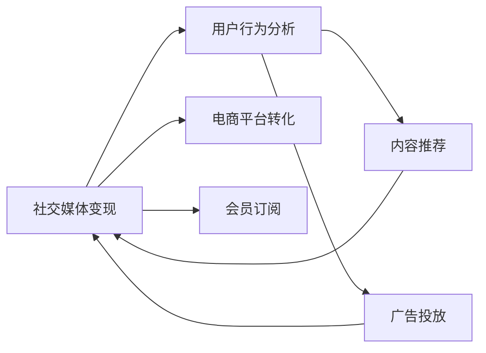

                 

# 利用技术优势进行社交媒体变现

## 1. 背景介绍

在社交媒体日益繁荣的今天，如何利用技术优势，实现社交媒体变现，已经成为各大平台和内容创作者关注的焦点。社交媒体变现方式多样，从广告收入、会员订阅到电商平台转化，每一种方式都离不开技术的支撑。本文将系统探讨社交媒体变现的技术路径，从数据收集、用户行为分析、内容推荐、广告投放等多个方面，阐明如何利用技术优势，提升社交媒体变现效率，打造高效变现的社交媒体生态。

## 2. 核心概念与联系

### 2.1 核心概念概述

在讨论社交媒体变现的技术路径之前，首先需要明确几个核心概念及其相互联系：

- **社交媒体变现**：指通过社交媒体平台，实现商业化收入的过程，包括广告收入、电商销售、会员订阅等多种形式。
- **用户行为分析**：通过数据分析技术，对用户行为进行深度挖掘，理解用户兴趣、需求和行为模式。
- **内容推荐**：基于用户行为和兴趣，进行精准的内容推荐，提升用户黏性和转化率。
- **广告投放**：针对目标用户群，通过算法优化投放精准广告，提升广告效果和ROI。
- **电商平台转化**：通过社交媒体平台内置或合作电商功能，将用户引流到电商平台，促进销售转化。
- **会员订阅**：基于社交媒体平台内容订阅服务，提升用户粘性和平台收入。

这些概念之间相互关联，共同构成了一个完整的社交媒体变现体系。以下是一个描述这些概念关系的Mermaid流程图：



从上述流程图中可以看到，用户行为分析是整个变现体系的核心，通过分析用户行为数据，可以进一步优化内容推荐和广告投放，同时提升电商平台转化率和会员订阅率。

## 3. 核心算法原理 & 具体操作步骤

### 3.1 算法原理概述

社交媒体变现的核心在于精准识别用户需求，进行个性化的内容推荐和精准的广告投放。因此，社交媒体变现的技术路径可以归纳为以下几个步骤：

1. **数据收集**：收集用户的浏览、互动、购买等行为数据，构建用户行为图谱。
2. **用户行为分析**：通过机器学习算法，对用户行为数据进行建模分析，提取用户兴趣、偏好和行为模式。
3. **内容推荐**：利用推荐算法，对用户进行个性化内容推荐，提升用户互动率和转化率。
4. **广告投放**：通过算法优化广告投放策略，确保广告精准触达目标用户群，提升广告效果和ROI。
5. **电商平台转化**：通过社交媒体平台内置电商功能或合作电商平台，将用户引流至电商，促进销售转化。
6. **会员订阅**：利用订阅服务，提升用户粘性和平台收入。

### 3.2 算法步骤详解

以下是社交媒体变现技术路径的具体操作步骤：

**Step 1: 数据收集**

- **行为数据收集**：通过SDK或API获取用户在社交媒体上的行为数据，如浏览记录、点赞、评论、分享等。
- **用户画像构建**：对行为数据进行聚类分析，构建用户画像，形成用户兴趣、行为偏好等特征。

**Step 2: 用户行为分析**

- **用户行为建模**：通过机器学习算法，如协同过滤、内容推荐算法、情感分析等，对用户行为数据进行建模，提取用户兴趣和行为模式。
- **用户分组与画像**：根据用户行为特征，进行用户分组，并进一步细化用户画像，形成更精准的用户标签。

**Step 3: 内容推荐**

- **推荐算法选择**：选择合适的推荐算法，如协同过滤、基于深度学习的推荐系统、基于图谱的推荐算法等。
- **推荐系统构建**：根据用户画像和内容特征，构建推荐系统，实现个性化内容推荐。

**Step 4: 广告投放**

- **广告投放模型**：通过CTR预测、广告排序算法、A/B测试等技术，构建广告投放模型。
- **广告优化**：利用广告投放模型，实时调整投放策略，确保广告精准触达目标用户群。

**Step 5: 电商平台转化**

- **电商平台集成**：将社交媒体平台与电商合作，或内置电商功能，实现无缝对接。
- **用户引流与转化**：利用社交媒体平台的流量优势，将用户引流至电商平台，促进销售转化。

**Step 6: 会员订阅**

- **订阅服务设计**：设计具有吸引力的会员订阅方案，如优惠活动、专属内容等。
- **会员管理与收入提升**：利用会员管理工具，提升用户粘性和平台收入。

### 3.3 算法优缺点

社交媒体变现技术路径的优点包括：

- **个性化推荐**：通过精准的用户行为分析，实现个性化内容推荐，提升用户互动率和转化率。
- **广告效果优化**：利用广告投放模型，实现精准广告投放，提升广告效果和ROI。
- **电商转化提升**：通过社交媒体平台引流，实现电商转化，提高销售业绩。
- **会员粘性增强**：通过优质内容和专属服务，增强用户粘性和平台收入。

然而，这一技术路径也存在一些缺点：

- **数据隐私问题**：用户行为数据收集和使用需要遵守隐私保护法规，避免数据泄露。
- **用户行为数据稀疏**：部分用户可能行为数据稀疏，影响用户画像和推荐准确性。
- **算法复杂度**：推荐和广告投放算法复杂，需要较高的计算资源和专业技能。
- **投入成本高**：社交媒体平台和广告投放需要投入大量资源，且效果受多种因素影响。

### 3.4 算法应用领域

社交媒体变现技术不仅限于社交媒体平台，还可以应用于更多领域，如电商平台、视频平台、教育平台等。具体应用场景包括：

- **电商网站**：通过社交媒体引流，提升电商网站的销售业绩。
- **视频平台**：通过个性化推荐和精准广告，提升用户观看时长和广告效果。
- **教育平台**：通过会员订阅和个性化推荐，提升教育平台的用户粘性和内容付费率。

## 4. 数学模型和公式 & 详细讲解 & 举例说明

### 4.1 数学模型构建

社交媒体变现技术的数学模型构建主要基于用户行为数据的分析和推荐算法的设计。以下是一个简化版的用户行为分析模型：

设用户行为数据为 $D=\{(x_i, y_i)\}_{i=1}^N$，其中 $x_i$ 为用户行为特征向量，$y_i$ 为用户标签。

通过机器学习算法，可以构建用户行为分析模型 $M(x_i)$，将用户行为特征映射为用户标签：

$$
M(x_i) = \arg\min_{y_i \in \{0,1\}} \|x_i - y_i\|
$$

其中 $\|.\|$ 表示欧几里得距离。

### 4.2 公式推导过程

以下是用户行为分析模型的详细推导过程：

假设用户行为特征 $x_i$ 和标签 $y_i$ 之间存在线性关系：

$$
y_i = \beta_0 + \sum_{j=1}^k \beta_j x_{ij}
$$

其中 $\beta_0$ 为截距，$\beta_j$ 为特征系数。

通过最小二乘法求解 $\beta$：

$$
\beta = (X^TX)^{-1}X^TY
$$

其中 $X$ 为特征矩阵，$Y$ 为用户标签向量。

### 4.3 案例分析与讲解

以Facebook为例，其广告投放和内容推荐系统采用了基于CTR（Click-Through Rate，点击率）的推荐和投放算法。CTR模型通常使用线性回归或逻辑回归进行建模，预测用户点击广告的概率。

在Facebook的广告投放中，CTR模型会根据用户的浏览历史、兴趣标签、互动行为等因素，预测用户点击某一广告的概率。通过最大化广告点击率（CTR）和转化率（Conversion Rate，CR）的组合指标（CPCR），优化广告投放策略，确保广告精准触达目标用户群。

## 5. 项目实践：代码实例和详细解释说明

### 5.1 开发环境搭建

社交媒体变现的开发环境搭建需要考虑多种技术和工具，以下是一个典型的开发环境搭建流程：

1. **环境配置**：选择适合的操作系统和编程语言，如Linux、Python等。
2. **数据收集**：使用SDK或API收集用户行为数据，存储于数据库或数据仓库中。
3. **数据分析工具**：安装和配置数据分析工具，如Apache Spark、Pandas等。
4. **推荐系统框架**：选择合适的推荐系统框架，如TensorFlow、PyTorch等。
5. **广告投放平台**：接入广告投放平台，如Google Ads、Facebook Ads等。
6. **电商系统集成**：集成社交媒体平台和电商系统，实现用户引流和销售转化。

### 5.2 源代码详细实现

以下是Facebook广告投放和内容推荐系统的代码实现：

```python
# 导入必要的库
import pandas as pd
from sklearn.linear_model import LogisticRegression
from sklearn.metrics import roc_auc_score

# 加载数据
data = pd.read_csv('user_behavior_data.csv')

# 数据预处理
X = data[['browsing_history', 'interest_labels', 'interaction_behavior']]
y = data['clicks']

# 训练CTR模型
model = LogisticRegression()
model.fit(X, y)

# 预测CTR
predictions = model.predict_proba(X)

# 计算AUC
auc = roc_auc_score(y, predictions[:, 1])
print('AUC: ', auc)
```

### 5.3 代码解读与分析

以上代码展示了Facebook广告投放中CTR模型的训练和评估过程。关键步骤如下：

1. **数据加载**：使用Pandas库加载用户行为数据。
2. **数据预处理**：选择影响CTR的相关特征，构建特征矩阵 $X$。
3. **CTR模型训练**：使用逻辑回归模型，训练CTR预测模型。
4. **CTR预测**：使用训练好的模型进行CTR预测。
5. **AUC评估**：计算模型预测的AUC值，评估模型性能。

### 5.4 运行结果展示

运行上述代码，输出AUC值，评估模型的预测性能。假设输出AUC值为0.85，表明模型具有较高的点击率预测能力。

## 6. 实际应用场景

### 6.1 广告投放

广告投放是社交媒体变现的重要环节，通过精准的广告投放，能够显著提升广告效果和ROI。以下是Facebook广告投放的实际应用场景：

**场景一：品牌推广**：针对目标用户群，投放品牌广告，提升品牌知名度和曝光度。

**场景二：产品销售**：针对潜在客户，投放产品广告，促进销售转化。

**场景三：流量引导**：引导用户访问特定网站或电商平台，提升电商转化率。

### 6.2 内容推荐

内容推荐是提升用户粘性和平台收入的重要手段。以下是Instagram内容推荐的实际应用场景：

**场景一：个性化推荐**：根据用户兴趣和行为，推荐相关内容，提升用户互动率和平台留存率。

**场景二：热门内容推荐**：推荐热门话题和事件，提升平台流量和用户参与度。

**场景三：用户生成内容推荐**：推荐用户生成内容，增强社区互动和用户粘性。

### 6.3 电商平台转化

电商平台转化是社交媒体变现的另一重要方向。以下是电商平台转化的实际应用场景：

**场景一：平台引流**：通过社交媒体平台引流，增加平台流量和用户访问量。

**场景二：商品展示**：利用社交媒体平台展示商品信息，提升商品曝光率和销售转化。

**场景三：用户互动**：通过社交媒体平台进行互动，增强用户粘性和购买意愿。

### 6.4 未来应用展望

未来，社交媒体变现技术将朝着以下几个方向发展：

1. **多模态数据融合**：将文本、图像、音频等多模态数据融合，提升用户行为分析和内容推荐精度。
2. **AI技术应用**：引入AI技术，如深度学习、强化学习、因果推理等，提升推荐和广告投放效果。
3. **实时数据分析**：通过实时数据分析技术，实现动态调整推荐和广告策略，提升用户互动率和平台收入。
4. **隐私保护**：加强隐私保护，确保用户数据安全和合规使用。
5. **个性化体验**：通过个性化推荐和服务，提升用户粘性和平台满意度。

## 7. 工具和资源推荐

### 7.1 学习资源推荐

为了帮助开发者系统掌握社交媒体变现的技术路径，这里推荐一些优质的学习资源：

1. **《社交媒体数据分析与推荐系统》**：系统介绍了社交媒体数据分析和推荐系统的工作原理和实现方法，适合初学者入门。
2. **《广告投放与优化》**：详细讲解了广告投放的策略和优化方法，适合广告从业者学习。
3. **《电商平台运营与营销》**：介绍了电商平台的运营和营销策略，适合电商从业者参考。
4. **《深度学习理论与实践》**：深入讲解了深度学习算法在社交媒体变现中的应用，适合技术人员深入学习。

### 7.2 开发工具推荐

高效的开发离不开优秀的工具支持。以下是几款用于社交媒体变现开发的常用工具：

1. **Hadoop/Spark**：大数据处理平台，适用于大规模数据存储和处理。
2. **TensorFlow/PyTorch**：深度学习框架，适用于推荐系统和广告投放算法开发。
3. **Apache Kafka**：分布式消息队列，适用于实时数据流处理。
4. **Kibana/ELK Stack**：日志和监控分析工具，适用于数据可视化和性能监控。

### 7.3 相关论文推荐

社交媒体变现技术的发展源于学界的持续研究。以下是几篇奠基性的相关论文，推荐阅读：

1. **《A Large-Scale In-Memory Recommender System》**：介绍了大规模内存推荐系统的实现方法。
2. **《Click-Through Rate Prediction and Advertising》**：详细讲解了CTR预测和广告投放的算法。
3. **《Social Media Analytics and Recommendation Systems》**：系统介绍了社交媒体数据分析和推荐系统的工作原理。

## 8. 总结：未来发展趋势与挑战

### 8.1 总结

本文对社交媒体变现的技术路径进行了全面系统的介绍。首先阐述了社交媒体变现的重要性和主要技术路径，明确了推荐、广告投放、电商平台转化等关键环节的工作原理。其次，从原理到实践，详细讲解了社交媒体变现的数学模型和算法步骤，给出了具体的代码实现和运行结果。同时，本文还广泛探讨了社交媒体变现在多个行业领域的应用前景，展示了社交媒体变现技术的广阔前景。

通过本文的系统梳理，可以看到，社交媒体变现技术正在成为社交媒体平台的重要变现手段，极大地提升了平台和内容创作者的收入。未来，伴随技术和算法的不断进步，社交媒体变现将迎来更多创新应用，为内容创作者和平台带来更高的商业价值。

### 8.2 未来发展趋势

展望未来，社交媒体变现技术将呈现以下几个发展趋势：

1. **数据融合**：通过将不同模态的数据进行融合，提升用户行为分析和内容推荐的精度。
2. **AI技术应用**：引入AI技术，如深度学习、强化学习、因果推理等，进一步提升推荐和广告投放的效果。
3. **实时分析**：通过实时数据分析技术，实现动态调整推荐和广告策略，提升用户互动率和平台收入。
4. **隐私保护**：加强隐私保护，确保用户数据安全和合规使用。
5. **个性化体验**：通过个性化推荐和服务，提升用户粘性和平台满意度。

以上趋势凸显了社交媒体变现技术的广阔前景。这些方向的探索发展，必将进一步提升社交媒体平台的商业价值，推动社交媒体变现技术的持续进步。

### 8.3 面临的挑战

尽管社交媒体变现技术已经取得了瞩目成就，但在迈向更加智能化、普适化应用的过程中，它仍面临着诸多挑战：

1. **数据隐私问题**：用户行为数据收集和使用需要遵守隐私保护法规，避免数据泄露。
2. **数据稀疏性**：部分用户行为数据稀疏，影响用户画像和推荐准确性。
3. **算法复杂度**：推荐和广告投放算法复杂，需要较高的计算资源和专业技能。
4. **投入成本高**：社交媒体平台和广告投放需要投入大量资源，且效果受多种因素影响。

### 8.4 研究展望

面对社交媒体变现所面临的挑战，未来的研究需要在以下几个方面寻求新的突破：

1. **数据隐私保护**：探索如何在保障用户隐私的同时，充分利用用户行为数据。
2. **数据稀疏性解决**：研究如何处理数据稀疏性，提升用户画像和推荐准确性。
3. **算法优化**：开发更高效、更灵活的推荐和广告投放算法。
4. **低成本变现**：探索低成本的社交媒体变现模式，降低平台和内容创作者的投入成本。

这些研究方向将推动社交媒体变现技术迈向更高的台阶，为社交媒体平台和内容创作者带来更多的商业价值。

## 9. 附录：常见问题与解答

**Q1：社交媒体变现需要投入大量资源，如何降低成本？**

A: 社交媒体变现技术需要投入大量资源，但可以通过以下几种方式降低成本：

1. **多平台合作**：与多家社交媒体平台合作，共享用户数据和广告资源，降低投入成本。
2. **自动化工具**：使用自动化工具进行数据收集、分析、推荐和广告投放，提升效率，降低人工成本。
3. **算法优化**：优化推荐和广告投放算法，减少计算资源消耗，提升效果，降低成本。

**Q2：社交媒体变现过程中如何平衡用户隐私和平台收益？**

A: 在社交媒体变现过程中，平衡用户隐私和平台收益是关键。以下是一些策略：

1. **隐私保护技术**：采用先进的隐私保护技术，如差分隐私、联邦学习等，保护用户隐私。
2. **透明政策**：制定透明的隐私保护政策，明确用户数据使用范围和方式，获取用户信任。
3. **用户选择权**：提供用户隐私设置的选项，让用户自行选择是否分享数据，增强用户控制权。

**Q3：推荐系统如何处理数据稀疏性？**

A: 推荐系统通常面临数据稀疏性问题，以下是一些解决策略：

1. **协同过滤**：利用用户之间的相似性，推荐相似用户喜欢的内容，提升推荐效果。
2. **深度学习**：引入深度学习技术，通过神经网络模型处理稀疏数据，提升推荐精度。
3. **矩阵分解**：使用矩阵分解技术，如奇异值分解（SVD），处理稀疏矩阵，提升推荐效果。

**Q4：如何评估推荐系统的性能？**

A: 推荐系统的性能评估通常从以下几个方面进行：

1. **精确率和召回率**：评估推荐系统推荐的准确性和覆盖率。
2. **点击率和转化率**：评估推荐内容的用户互动和销售转化效果。
3. **用户满意度**：通过用户反馈和行为数据，评估推荐系统的用户满意度。

总之，社交媒体变现技术需要不断优化和改进，才能在保障用户隐私的同时，提升平台收益和用户满意度。通过多维度、多层次的优化，相信社交媒体变现技术必将在未来更加智能化、普适化，推动社交媒体平台的商业价值不断提升。

---

作者：禅与计算机程序设计艺术 / Zen and the Art of Computer Programming

