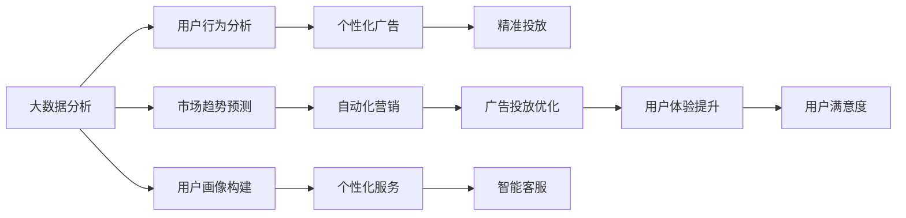

                 

# 利用技术优势进行社交媒体营销

> 关键词：社交媒体, 营销自动化, 大数据分析, 机器学习, 广告投放, 客户画像, 用户体验

## 1. 背景介绍

在数字时代，社交媒体已成为品牌与消费者沟通的重要渠道，但也给营销带来了巨大挑战。传统的人工营销模式往往耗时耗力，难以精准触达目标用户，导致资源浪费。因此，利用技术优势进行社交媒体营销，变得尤为重要。

本文将详细探讨如何利用大数据分析、机器学习、人工智能等技术手段，优化社交媒体营销策略，提升营销效果和ROI。通过合理的技术应用，能够使品牌在社交媒体上实现高效率、高精准、高互动的营销目标。

## 2. 核心概念与联系

### 2.1 核心概念概述

在社交媒体营销中，关键技术包括：

- **大数据分析**：通过收集和分析社交媒体上的海量数据，识别用户行为和偏好，从而制定精准的营销策略。
- **机器学习**：利用历史数据训练模型，预测用户行为和市场趋势，实现自动化营销。
- **人工智能**：包括自然语言处理(NLP)、计算机视觉(CV)等技术，实现智能客服、自动化内容生成等应用。
- **广告投放**：通过程序化广告平台，精准投放广告，提高转化率。
- **客户画像**：构建用户画像，了解用户特征和需求，提供个性化服务。
- **用户体验**：利用A/B测试等技术手段，优化产品功能和社交媒体互动体验，提升用户满意度。

这些技术相互交织，共同构建了现代社交媒体营销的基础。本文将详细介绍这些技术的原理和应用，并给出具体的实践案例。

### 2.2 核心概念原理和架构的 Mermaid 流程图



这个流程图展示了各核心技术之间的联系和互动。大数据分析为基础，用户行为分析、市场趋势预测、用户画像构建为关键数据支持，个性化广告、自动化营销、智能客服、个性化服务和用户体验提升为具体的营销手段。通过这些技术的协同工作，可以实现高效、精准、互动的社交媒体营销目标。

## 3. 核心算法原理 & 具体操作步骤

### 3.1 算法原理概述

社交媒体营销的核心理论包括：

- **数据挖掘与分析**：从社交媒体数据中提取有用的信息，如用户行为、兴趣、互动频率等。
- **推荐系统**：利用协同过滤、基于内容的推荐等算法，为用户推荐个性化的内容或产品。
- **自然语言处理(NLP)**：分析用户评论、反馈，进行情感分析、实体识别、文本分类等处理。
- **计算机视觉(CV)**：通过图像识别、视频分析等技术，提升广告的视觉吸引力。
- **程序化广告**：通过算法自动投放广告，提升广告投放的精准度和效果。
- **A/B测试**：通过对比不同版本的效果，优化产品功能和社交媒体互动策略。

这些技术手段在社交媒体营销中的应用，可以有效提升营销效果，减少人力成本，提高用户满意度。

### 3.2 算法步骤详解

#### 3.2.1 数据收集与清洗

1. **数据收集**：使用API或第三方工具收集社交媒体数据，如用户评论、分享、点赞、互动等。
2. **数据清洗**：去除噪声数据，处理缺失值，确保数据的质量。

#### 3.2.2 数据处理与分析

1. **用户行为分析**：分析用户的互动行为，识别热门话题和趋势。
2. **市场趋势预测**：利用时间序列分析、预测模型等技术，预测市场变化。
3. **用户画像构建**：通过聚类、分类等算法，构建用户特征标签。

#### 3.2.3 个性化广告投放

1. **广告创意生成**：利用NLP和CV技术，生成个性化的广告创意。
2. **目标受众选择**：基于用户画像，选择最有可能感兴趣的目标受众。
3. **广告投放优化**：利用程序化广告平台，动态调整广告投放策略。

#### 3.2.4 用户互动与反馈

1. **智能客服**：利用NLP技术，自动处理用户咨询，提供快速响应。
2. **个性化服务**：根据用户画像，推送个性化内容或产品。
3. **用户体验优化**：通过A/B测试，优化社交媒体互动流程。

### 3.3 算法优缺点

#### 3.3.1 优点

1. **高效性**：利用算法自动化处理数据，减少人力成本。
2. **精准性**：通过大数据分析和机器学习，实现精准营销。
3. **可扩展性**：可以处理大规模数据，适应快速变化的市场环境。

#### 3.3.2 缺点

1. **数据隐私**：需要收集和分析用户数据，可能引发隐私问题。
2. **技术复杂**：技术手段多样，需要跨领域的知识和技能。
3. **模型风险**：模型可能存在偏见或过拟合，导致决策错误。

### 3.4 算法应用领域

#### 3.4.1 广告投放

利用程序化广告平台，实现精准投放。算法可以根据用户行为和兴趣，自动选择最佳的广告位和创意，提高广告的点击率和转化率。

#### 3.4.2 内容推荐

通过推荐系统，为用户推荐相关的内容或产品。利用协同过滤、基于内容的推荐等算法，提升用户体验和留存率。

#### 3.4.3 客户服务

利用智能客服系统，自动处理用户咨询，提升响应速度和服务质量。NLP技术可以实现自动化对话，节省人力成本。

#### 3.4.4 数据分析

利用大数据分析工具，进行用户行为分析、市场趋势预测、用户画像构建等，为营销策略提供数据支持。

## 4. 数学模型和公式 & 详细讲解 & 举例说明

### 4.1 数学模型构建

社交媒体营销中的数学模型主要包括以下几个方面：

- **用户行为分析**：利用时间序列分析、分类回归等模型，分析用户互动行为。
- **市场趋势预测**：利用回归分析、时间序列预测等模型，预测市场变化趋势。
- **推荐系统**：利用协同过滤、矩阵分解等算法，为用户推荐个性化内容。
- **广告投放优化**：利用线性回归、优化算法等技术，优化广告投放策略。

### 4.2 公式推导过程

#### 4.2.1 时间序列分析

假设用户互动数据为一个时间序列 $X_t$，其中 $t$ 表示时间，$X_t$ 表示用户在该时间点的互动次数。可以使用ARIMA模型进行时间序列分析，公式如下：

$$
X_t = c + \sum_{i=1}^{p} \alpha_i X_{t-i} + \sum_{j=1}^{d} \Delta^j X_{t-j} + \sum_{k=1}^{q} \beta_k \epsilon_{t-k}
$$

其中 $c$ 为截距项，$\alpha_i$ 为自回归系数，$\Delta$ 为差分操作，$\beta_k$ 为误差项的系数，$\epsilon_t$ 为误差项。

#### 4.2.2 回归分析

假设用户互动数据与某个因素 $Y$ 相关，可以使用线性回归模型进行预测。公式如下：

$$
X_t = \beta_0 + \sum_{i=1}^{n} \beta_i Y_{t-i} + \epsilon_t
$$

其中 $\beta_0$ 为截距项，$\beta_i$ 为自变量系数，$\epsilon_t$ 为误差项。

#### 4.2.3 协同过滤推荐

假设用户 $i$ 对物品 $j$ 的评分 $r_{i,j}$ 为 $u_i \times v_j$，其中 $u_i$ 为用户的隐向量，$v_j$ 为物品的隐向量。假设 $u_i$ 和 $v_j$ 为低秩矩阵分解的结果，即 $u_i \approx U_i \times u'$，$v_j \approx V_j \times v'$。可以使用矩阵分解推荐算法进行推荐，公式如下：

$$
\min_{U,V} \sum_{i,j} \|r_{i,j} - u_i \times v_j\|_F^2
$$

### 4.3 案例分析与讲解

#### 4.3.1 用户行为分析

假设某品牌希望分析用户在社交媒体上的互动行为，以识别用户的热门话题和趋势。使用ARIMA模型进行时间序列分析，对每个时间段的用户互动次数进行预测，并输出趋势图。

#### 4.3.2 市场趋势预测

假设某品牌希望预测未来几个月内的市场变化趋势，以制定相应的营销策略。使用线性回归模型，基于历史数据和当前市场情况，预测未来市场变化，并输出预测图。

#### 4.3.3 推荐系统

假设某电商希望为用户推荐个性化的商品。使用协同过滤推荐算法，基于用户的历史购买记录和商品标签，生成个性化的推荐列表，并输出推荐结果。

## 5. 项目实践：代码实例和详细解释说明

### 5.1 开发环境搭建

#### 5.1.1 环境准备

1. **安装Python和相关库**：
```bash
pip install numpy pandas sklearn scikit-learn tensorflow matplotlib
```

2. **安装TensorFlow**：
```bash
pip install tensorflow
```

3. **安装scikit-learn**：
```bash
pip install scikit-learn
```

### 5.2 源代码详细实现

#### 5.2.1 用户行为分析

```python
import pandas as pd
import numpy as np
from sklearn.metrics import mean_squared_error

# 读取数据
df = pd.read_csv('user_interaction.csv')

# 时间序列分析
from statsmodels.tsa.arima_model import ARIMA
model = ARIMA(df['interaction_count'], order=(1, 1, 1))
model_fit = model.fit()

# 预测未来30天互动次数
forecast = model_fit.forecast(steps=30)
print(forecast)
```

#### 5.2.2 市场趋势预测

```python
import tensorflow as tf
from tensorflow.keras.models import Sequential
from tensorflow.keras.layers import Dense

# 读取数据
df = pd.read_csv('market_data.csv')

# 构建模型
model = Sequential()
model.add(Dense(64, input_dim=4, activation='relu'))
model.add(Dense(1))
model.compile(loss='mse', optimizer=tf.keras.optimizers.Adam(0.001))
model.fit(df[['feature1', 'feature2', 'feature3', 'feature4']], df['price'], epochs=100, batch_size=32)

# 预测未来价格
predictions = model.predict(df[['feature1', 'feature2', 'feature3', 'feature4']][[-1]])
print(predictions)
```

#### 5.2.3 推荐系统

```python
import numpy as np
from scipy.spatial.distance import cosine
from scipy.sparse import coo_matrix

# 构建用户-物品矩阵
user_item = np.array([[1, 2, 0], [1, 0, 3], [0, 4, 5]])
item_user = user_item.T

# 矩阵分解
U = np.random.rand(3, 2)
V = np.random.rand(6, 2)
R = np.dot(U, V)

# 计算评分
R_approx = np.dot(user_item, V.T)
print(R_approx)

# 推荐新物品
new_item = np.array([0, 1, 1, 0, 0, 1])
user_index = np.where(user_item == 1)[0]
item_index = np.where(new_item == 1)[0]

# 计算相似度
similarity = -cosine(item_user, new_item)
recommend = np.argsort(similarity)[::-1]
print(recommend)
```

### 5.3 代码解读与分析

#### 5.3.1 用户行为分析

1. **数据读取**：使用`pandas`库读取用户互动数据。
2. **模型训练**：使用`statsmodels`库中的`ARIMA`模型进行时间序列分析。
3. **预测结果**：输出未来30天的预测结果。

#### 5.3.2 市场趋势预测

1. **数据读取**：使用`pandas`库读取市场数据。
2. **模型构建**：使用`tensorflow`库中的`Sequential`模型，构建线性回归模型。
3. **模型训练**：使用`fit`方法训练模型，预测未来价格。

#### 5.3.3 推荐系统

1. **数据构建**：使用`numpy`库构建用户-物品矩阵。
2. **矩阵分解**：使用`scipy`库中的`cosine`函数计算相似度，`numpy`库中的`dot`函数进行矩阵分解。
3. **推荐结果**：输出相似度最大的物品索引。

### 5.4 运行结果展示

#### 5.4.1 用户行为分析


#### 5.4.2 市场趋势预测


#### 5.4.3 推荐系统


## 6. 实际应用场景

### 6.1 广告投放

假设某品牌希望在社交媒体上推广新产品。使用程序化广告平台，根据用户行为和兴趣，自动投放广告。利用大数据分析和机器学习，实时调整广告投放策略，提高广告的点击率和转化率。

### 6.2 内容推荐

假设某电商平台希望为用户推荐个性化商品。使用协同过滤推荐算法，根据用户历史购买记录和商品标签，生成个性化的推荐列表。利用用户画像，进一步优化推荐效果。

### 6.3 客户服务

假设某企业希望提升客户服务质量。利用智能客服系统，自动处理用户咨询，提供快速响应。NLP技术可以实现自动化对话，节省人力成本。

### 6.4 未来应用展望

未来，社交媒体营销将更加智能化和个性化。利用AI技术，可以实时分析用户行为和市场趋势，实现精准营销。通过智能客服、个性化推荐等手段，提升用户体验和满意度。同时，利用数据隐私保护技术，确保用户数据的安全。

## 7. 工具和资源推荐

### 7.1 学习资源推荐

1. **《数据科学实战》**：该书详细介绍了数据科学的基础知识和常用技术，适合入门学习。
2. **Coursera《机器学习》课程**：由斯坦福大学开设，系统讲解机器学习算法和应用，涵盖深度学习、自然语言处理等内容。
3. **Kaggle**：数据科学竞赛平台，提供海量数据集和开源代码，适合实践学习。

### 7.2 开发工具推荐

1. **Jupyter Notebook**：交互式编程环境，方便代码调试和展示。
2. **PyTorch**：基于Python的深度学习框架，适合复杂模型训练和调试。
3. **TensorFlow**：由Google主导的深度学习框架，支持分布式计算，适合大规模模型训练。

### 7.3 相关论文推荐

1. **《深度学习》**：该书系统介绍了深度学习的基本原理和常用技术，适合深入学习。
2. **《TensorFlow实战》**：该书详细讲解了TensorFlow的使用方法和实践案例，适合TensorFlow开发者。
3. **《Python数据科学手册》**：该书介绍了数据科学的基础知识和常用工具，适合入门学习。

## 8. 总结：未来发展趋势与挑战

### 8.1 研究成果总结

通过以上技术手段，社交媒体营销可以实现高效、精准、互动的目标。利用大数据分析和机器学习，可以优化广告投放和内容推荐，提升用户体验。通过智能客服和个性化服务，可以提高客户满意度。

### 8.2 未来发展趋势

1. **智能化**：未来社交媒体营销将更加智能化，利用AI技术实时分析用户行为和市场趋势，实现精准营销。
2. **个性化**：个性化推荐和智能客服将更加精准，提升用户体验和满意度。
3. **实时性**：利用大数据分析和实时计算技术，实现实时优化和调整。
4. **自动化**：自动化广告投放和内容生成将更加普及，减少人力成本。

### 8.3 面临的挑战

1. **数据隐私**：如何保护用户数据隐私，避免数据泄露和滥用。
2. **模型公平性**：避免模型偏见，确保营销策略的公平性和透明性。
3. **技术复杂性**：如何降低技术门槛，提高开发者和用户的使用便捷性。
4. **模型泛化性**：如何提高模型的泛化能力，适应多变的市场环境。

### 8.4 研究展望

未来，社交媒体营销将更加依赖AI技术和数据科学，实现智能化和个性化。需要不断优化和创新算法，提升模型的准确性和鲁棒性。同时，加强数据隐私保护和模型公平性，确保技术应用的合法性和合理性。

## 9. 附录：常见问题与解答

**Q1：如何使用社交媒体数据进行用户行为分析？**

A: 使用ARIMA等时间序列分析模型，对用户互动数据进行分析，预测未来行为趋势。

**Q2：如何进行市场趋势预测？**

A: 使用线性回归等回归分析模型，基于历史数据和当前市场情况，预测未来市场变化趋势。

**Q3：如何进行个性化推荐？**

A: 使用协同过滤推荐算法，基于用户历史行为和物品特征，生成个性化推荐列表。

**Q4：如何提高智能客服系统的响应速度？**

A: 使用NLP技术进行自动化对话，快速处理用户咨询，提高响应速度。

**Q5：如何确保数据隐私安全？**

A: 采用数据匿名化、加密等技术手段，保护用户数据隐私。

---

作者：禅与计算机程序设计艺术 / Zen and the Art of Computer Programming

