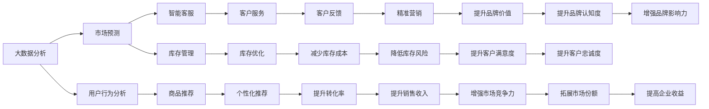

                 

## 1. 背景介绍

在当今全球化深入发展的背景下，跨境电商已成为推动经济全球化、促进贸易自由化和便利化、促进消费升级的新引擎。随着5G、物联网、人工智能等技术的不断进步，跨境电商市场迎来了新的发展机遇。利用技术优势进行跨境电商创业，成为众多创业者和企业关注的焦点。

### 1.1 问题由来

随着电子商务的迅猛发展，传统的线下购物方式逐渐被线上购物所取代，而跨境电商更是成为了新兴的销售渠道。与传统电商相比，跨境电商更注重品牌和产品海外市场的拓展。然而，跨境电商面临的挑战也更为复杂，包括物流、支付、合规等。因此，如何利用技术优势，提升跨境电商的效率和竞争力，是众多创业者关注的焦点。

### 1.2 问题核心关键点

在进行跨境电商创业时，技术优势主要体现在以下几个方面：

1. **大数据分析**：利用大数据分析，可以精确地了解目标市场的需求和消费者行为，从而进行精准的市场定位和产品推广。

2. **人工智能**：人工智能技术，如机器学习、自然语言处理、计算机视觉等，可以用于智能客服、商品推荐、库存管理等环节，提升运营效率。

3. **区块链技术**：区块链可以用于跨境支付和物流追踪，提高交易的安全性和透明度。

4. **云计算**：云计算可以提供稳定的计算资源和存储服务，降低企业成本。

5. **物联网**：物联网技术可以用于智能仓储和物流管理，提高运营效率和客户体验。

6. **人工智能与大数据结合**：通过将人工智能和大数据分析结合，可以更好地进行需求预测和库存管理。

这些技术优势的综合应用，可以帮助跨境电商创业企业更高效地运营，从而获得更大的市场份额。

## 2. 核心概念与联系

### 2.1 核心概念概述

为了更好地理解利用技术优势进行跨境电商创业的方法，本节将介绍几个密切相关的核心概念：

1. **大数据分析**：利用大规模数据集进行统计、分析和挖掘的过程，通常用于市场预测、用户行为分析等。

2. **人工智能**：利用计算机技术模拟人类智能，包括机器学习、深度学习、自然语言处理、计算机视觉等，广泛应用于智能客服、商品推荐、库存管理等。

3. **区块链技术**：一种分布式账本技术，具有去中心化、不可篡改、透明性等特点，通常用于跨境支付和物流追踪。

4. **云计算**：通过网络提供计算资源、存储服务，降低企业硬件成本，提高资源利用率。

5. **物联网**：将各种物品通过网络进行连接，实现智能化管理，应用于智能仓储和物流管理。

6. **人工智能与大数据结合**：通过将人工智能和大数据分析结合，进行需求预测、库存管理等，提升企业运营效率。

这些核心概念之间的逻辑关系可以通过以下Mermaid流程图来展示：



这个流程图展示了大数据分析、人工智能、区块链、云计算、物联网等技术在跨境电商创业中的应用，以及这些技术如何通过相互协作提升企业的运营效率和竞争力。

## 3. 核心算法原理 & 具体操作步骤
### 3.1 算法原理概述

利用技术优势进行跨境电商创业，核心在于将大数据分析、人工智能、区块链、云计算、物联网等技术综合应用，以提高运营效率和竞争力。以下是这些技术在跨境电商中的应用原理：

1. **大数据分析**：利用数据挖掘和分析技术，进行市场细分和用户画像构建，预测市场需求，制定精准的营销策略。

2. **人工智能**：通过机器学习和自然语言处理技术，实现智能客服、商品推荐、库存管理等，提高运营效率。

3. **区块链技术**：通过去中心化的分布式账本技术，实现跨境支付和物流追踪，提高交易的安全性和透明度。

4. **云计算**：利用云服务提供的计算和存储资源，降低硬件成本，提高资源利用率。

5. **物联网**：通过物联网技术，实现智能仓储和物流管理，提高运营效率和客户体验。

6. **人工智能与大数据结合**：通过将人工智能和大数据分析结合，进行需求预测和库存管理，提升运营效率。

### 3.2 算法步骤详解

利用技术优势进行跨境电商创业，通常包括以下几个关键步骤：

**Step 1: 大数据采集与预处理**

1. **数据来源**：
   - 市场调研数据：通过问卷调查、网络爬虫等方式收集市场数据。
   - 用户行为数据：通过电商平台、社交媒体等平台收集用户行为数据。
   - 供应链数据：通过供应商、物流公司等收集供应链数据。

2. **数据清洗**：
   - 去重：去除重复数据。
   - 缺失值处理：填补或删除缺失数据。
   - 异常值处理：识别和处理异常数据。

3. **特征工程**：
   - 特征提取：从原始数据中提取有用的特征。
   - 特征选择：选择最相关的特征。
   - 特征变换：对特征进行标准化、归一化等处理。

**Step 2: 模型训练与优化**

1. **模型选择**：
   - 分类模型：如逻辑回归、支持向量机等，用于市场细分和用户画像构建。
   - 聚类模型：如K-means、层次聚类等，用于市场细分和用户行为分析。
   - 预测模型：如线性回归、随机森林等，用于需求预测和库存管理。

2. **模型训练**：
   - 数据划分：将数据划分为训练集、验证集和测试集。
   - 模型训练：使用训练集数据进行模型训练。
   - 模型调优：使用验证集数据进行模型调优，选择最优模型。

3. **模型评估**：
   - 性能指标：如准确率、召回率、F1值等，评估模型性能。
   - 模型测试：使用测试集数据进行模型测试，评估模型泛化能力。

**Step 3: 应用部署与监控**

1. **模型部署**：
   - 模型封装：将训练好的模型封装成API服务，便于应用调用。
   - 容器化：将模型部署到Docker容器中，提高部署效率和稳定性。

2. **实时监控**：
   - 实时数据收集：实时收集模型预测结果。
   - 性能监控：监控模型预测性能和资源消耗。
   - 异常检测：检测模型异常行为，及时进行修复。

### 3.3 算法优缺点

利用技术优势进行跨境电商创业，有以下优点：

1. **高效性**：
   - 大数据分析可以帮助企业快速了解市场趋势，制定精准的营销策略。
   - 人工智能技术可以提升运营效率，减少人工成本。

2. **安全性和透明度**：
   - 区块链技术可以提供去中心化的跨境支付和物流追踪，提高交易的安全性和透明度。

3. **灵活性和可扩展性**：
   - 云计算和物联网技术可以提供灵活的计算和存储资源，满足企业不断变化的业务需求。

然而，也存在一些缺点：

1. **数据隐私和安全**：
   - 在收集和处理用户数据时，需要严格遵守数据隐私保护法规，确保用户数据安全。

2. **高成本**：
   - 初期投入大量的资金用于技术研发和设备采购，可能面临高成本风险。

3. **技术复杂度**：
   - 需要企业具备较强的技术实力，进行技术选型和系统集成。

4. **依赖外部供应商**：
   - 云计算和物联网技术需要依赖外部供应商，可能面临供应商稳定性和服务水平的问题。

### 3.4 算法应用领域

利用技术优势进行跨境电商创业，广泛应用于以下领域：

1. **智能客服**：
   - 利用自然语言处理技术，实现智能客服机器人，提高客户服务效率和质量。

2. **商品推荐**：
   - 利用机器学习技术，根据用户行为和偏好，进行个性化商品推荐，提高用户满意度和转化率。

3. **库存管理**：
   - 利用预测模型，进行需求预测和库存管理，减少库存成本，提高运营效率。

4. **物流追踪**：
   - 利用区块链技术，实现跨境物流的透明化管理和追踪，提高物流效率和客户满意度。

5. **市场预测**：
   - 利用大数据分析技术，进行市场细分和用户画像构建，预测市场需求，制定精准的营销策略。

6. **客户行为分析**：
   - 利用数据分析技术，进行用户行为分析，制定个性化营销方案，提升用户黏性。

以上应用领域展示了利用技术优势进行跨境电商创业的广泛场景，通过综合应用大数据分析、人工智能、区块链、云计算、物联网等技术，企业可以大幅提升运营效率和竞争力。

## 4. 数学模型和公式 & 详细讲解  
### 4.1 数学模型构建

在利用技术优势进行跨境电商创业中，涉及到多个数学模型。以下是几个核心模型的构建：

1. **市场细分模型**：
   - 使用K-means聚类算法，将市场分为多个细分市场。
   - 市场细分模型的目标函数为：
     \[
     minimize \sum_{i=1}^{k} \sum_{x \in C_i} ||x - \mu_i||^2
     \]
     其中 \(C_i\) 为第 \(i\) 个聚类，\(\mu_i\) 为聚类中心。

2. **需求预测模型**：
   - 使用时间序列分析方法，如ARIMA模型，进行需求预测。
   - 需求预测模型的目标函数为：
     \[
     minimize ||y - \hat{y}||^2
     \]
     其中 \(y\) 为实际需求，\(\hat{y}\) 为预测需求。

3. **商品推荐模型**：
   - 使用协同过滤算法，如基于矩阵分解的推荐算法。
   - 推荐模型的目标函数为：
     \[
     maximize \sum_{i=1}^{n} \sum_{j=1}^{m} p_{ij} \cdot r_{ij}
     \]
     其中 \(p_{ij}\) 为商品 \(i\) 和用户 \(j\) 的相似度，\(r_{ij}\) 为推荐评分。

### 4.2 公式推导过程

1. **K-means聚类算法**：
   - 目标函数为：
     \[
     minimize \sum_{i=1}^{k} \sum_{x \in C_i} ||x - \mu_i||^2
     \]
   - 使用梯度下降算法进行优化，具体推导过程如下：
     \[
     \frac{\partial J}{\partial \mu_i} = -2 \sum_{x \in C_i} (x - \mu_i)
     \]
     \[
     \frac{\partial J}{\partial \sigma_i} = -2 \sum_{x \in C_i} ||x - \mu_i||
     \]

2. **ARIMA模型**：
   - 目标函数为：
     \[
     minimize ||y - \hat{y}||^2
     \]
   - 使用最小二乘法进行优化，具体推导过程如下：
     \[
     \hat{\theta} = (X^TX)^{-1}X^Ty
     \]
     其中 \(\hat{\theta}\) 为模型参数，\(X\) 为特征矩阵，\(y\) 为实际需求。

3. **协同过滤算法**：
   - 目标函数为：
     \[
     maximize \sum_{i=1}^{n} \sum_{j=1}^{m} p_{ij} \cdot r_{ij}
     \]
   - 使用矩阵分解技术进行优化，具体推导过程如下：
     \[
     \hat{P} = \mathrm{matvec}(X^TX)^{-1}X^Ty
     \]
     \[
     \hat{R} = \mathrm{matvec}(X^TX)^{-1}X^Ty
     \]

### 4.3 案例分析与讲解

**案例一：智能客服系统**

- 采用自然语言处理技术，实现智能客服机器人。
- 使用BERT模型进行用户意图识别和回答生成。
- 具体步骤如下：
  1. 数据预处理：将用户对话数据进行清洗和标准化处理。
  2. 特征提取：使用BERT模型提取对话特征。
  3. 意图识别：使用BERT模型进行用户意图分类。
  4. 回答生成：根据用户意图生成回答。
  5. 系统部署：将系统部署到生产环境中，进行实时监控和调优。

**案例二：需求预测系统**

- 采用时间序列分析方法，进行需求预测。
- 使用ARIMA模型进行需求预测。
- 具体步骤如下：
  1. 数据预处理：将历史需求数据进行清洗和标准化处理。
  2. 特征提取：提取需求的时间序列特征。
  3. 模型训练：使用ARIMA模型进行需求预测。
  4. 模型评估：使用验证集数据评估模型性能。
  5. 系统部署：将系统部署到生产环境中，进行实时预测和监控。

**案例三：智能仓储系统**

- 采用物联网技术，实现智能仓储管理。
- 使用IoT设备和传感器进行仓储状态监控。
- 具体步骤如下：
  1. 数据采集：使用IoT设备和传感器采集仓储状态数据。
  2. 数据处理：对采集数据进行清洗和标准化处理。
  3. 状态监控：使用IoT设备监控仓储状态。
  4. 库存管理：根据监控数据进行库存优化。
  5. 系统部署：将系统部署到生产环境中，进行实时监控和调优。

## 5. 项目实践：代码实例和详细解释说明
### 5.1 开发环境搭建

在进行跨境电商创业技术实践前，我们需要准备好开发环境。以下是使用Python进行Django开发的环境配置流程：

1. 安装Python：从官网下载并安装Python，选择最新版本。
2. 安装虚拟环境工具：安装`virtualenv`工具，用于创建独立的Python环境。
3. 创建虚拟环境：
   ```bash
   virtualenv env
   source env/bin/activate
   ```
4. 安装必要的Python包：
   ```bash
   pip install django psycopg2-binary Pillow
   ```

5. 安装Django框架：
   ```bash
   pip install django
   ```

6. 安装数据库：
   ```bash
   sudo apt-get install postgresql postgresql-contrib
   ```

### 5.2 源代码详细实现

下面我们以需求预测系统为例，给出使用Python和Django进行需求预测的代码实现。

首先，定义需求预测模型：

```python
from django.db import models

class DemandPrediction(models.Model):
    date = models.DateField()
    demand = models.FloatField()
    prediction = models.FloatField()

    def save(self, *args, **kwargs):
        # 使用ARIMA模型进行需求预测
        # 具体的ARIMA模型实现和数据处理代码省略
        super().save(*args, **kwargs)
```

然后，定义Django视图：

```python
from django.shortcuts import render
from .models import DemandPrediction

def index(request):
    if request.method == 'POST':
        # 获取用户输入的需求数据
        date = request.POST.get('date')
        demand = request.POST.get('demand')

        # 使用ARIMA模型进行需求预测
        # 具体的ARIMA模型实现和数据处理代码省略
        prediction = arima_model.demand(date, demand)

        # 保存预测结果到数据库
        DemandPrediction.objects.create(date=date, demand=demand, prediction=prediction)

    # 获取历史需求预测数据
    data = DemandPrediction.objects.all().values('date', 'prediction')

    # 渲染页面
    return render(request, 'index.html', {'data': data})
```

最后，编写HTML页面：

```html
<!DOCTYPE html>
<html>
<head>
    <title>需求预测系统</title>
</head>
<body>
    <h1>需求预测系统</h1>
    <form method="post">
        
        <label for="date">日期：</label>
        <input type="date" id="date" name="date" required>
        <label for="demand">需求：</label>
        <input type="number" id="demand" name="demand" required>
        <button type="submit">提交预测</button>
    </form>
    <table>
        <thead>
            <tr>
                <th>日期</th>
                <th>需求</th>
                <th>预测</th>
            </tr>
        </thead>
        <tbody>
            
            <tr>
                <td>{{ item.date }}</td>
                <td>{{ item.demand }}</td>
                <td>{{ item.prediction }}</td>
            </tr>
            
        </tbody>
    </table>
</body>
</html>
```

### 5.3 代码解读与分析

让我们再详细解读一下关键代码的实现细节：

**DemandPrediction模型**：
- `DateField`：用于存储日期类型的数据。
- `FloatField`：用于存储浮点数类型的数据。
- `save`方法：在保存模型时，使用ARIMA模型进行需求预测，并将预测结果保存到模型中。

**Django视图**：
- `index`函数：处理POST请求，获取用户输入的需求数据，使用ARIMA模型进行需求预测，并将预测结果保存到数据库中。
- `index.html`页面：展示历史需求预测数据，并提供用户输入需求数据的表单。

**需求预测系统的代码实现**：
- 数据采集：通过Django视图获取用户输入的需求数据。
- 数据处理：使用ARIMA模型对需求数据进行预测，并将预测结果保存到数据库中。
- 数据展示：通过Django视图渲染页面，展示历史需求预测数据。

## 6. 实际应用场景

### 6.1 智能客服系统

智能客服系统通过自然语言处理技术，实现与用户的自然语言交互。在跨境电商中，智能客服系统可以处理客户咨询、订单查询、售后服务等问题，提高客户满意度。

在技术实现上，可以采用以下步骤：

1. 数据采集：通过电商平台、社交媒体等渠道，采集用户的咨询和反馈数据。
2. 数据清洗：对采集数据进行去重、去噪、标准化处理。
3. 意图识别：使用自然语言处理技术，对用户的咨询进行意图分类。
4. 回答生成：根据用户意图，生成相应的回答。
5. 系统部署：将系统部署到生产环境中，进行实时监控和调优。

智能客服系统可以大幅提升跨境电商企业的客户服务效率，降低人工成本，提升用户满意度。

### 6.2 需求预测系统

需求预测系统通过时间序列分析方法，预测未来的市场需求，帮助企业进行库存管理和采购决策。

在技术实现上，可以采用以下步骤：

1. 数据采集：通过电商平台、供应商等渠道，采集历史需求数据。
2. 数据清洗：对采集数据进行去重、去噪、标准化处理。
3. 特征提取：提取需求的时间序列特征。
4. 模型训练：使用ARIMA模型进行需求预测。
5. 模型评估：使用验证集数据评估模型性能。
6. 系统部署：将系统部署到生产环境中，进行实时预测和监控。

需求预测系统可以帮助企业精准预测未来的市场需求，减少库存成本，提升运营效率。

### 6.3 智能仓储系统

智能仓储系统通过物联网技术，实现仓储状态的实时监控和管理。

在技术实现上，可以采用以下步骤：

1. 数据采集：通过IoT设备和传感器，采集仓储状态数据。
2. 数据处理：对采集数据进行清洗、标准化处理。
3. 状态监控：使用IoT设备监控仓储状态。
4. 库存管理：根据监控数据进行库存优化。
5. 系统部署：将系统部署到生产环境中，进行实时监控和调优。

智能仓储系统可以大幅提高跨境电商企业的物流效率，降低运营成本，提升客户满意度。

### 6.4 未来应用展望

随着技术的发展，利用技术优势进行跨境电商创业的应用场景将更加广泛。

1. **智能推荐系统**：通过推荐算法，为用户推荐个性化的商品，提高用户满意度和转化率。
2. **实时监控系统**：通过实时监控技术，实时掌握跨境电商的运营状态，及时发现和解决问题。
3. **区块链应用**：利用区块链技术，提高跨境支付和物流的安全性和透明度。
4. **智能营销系统**：通过智能营销技术，进行精准的市场营销，提升品牌认知度和市场份额。
5. **多语言支持**：利用自然语言处理技术，实现多语言支持，拓展全球市场。
6. **智能物流系统**：通过物联网技术，实现智能物流管理，提升物流效率和客户满意度。

利用技术优势进行跨境电商创业，将为企业的全球化发展提供强有力的支持，帮助企业在激烈的市场竞争中取得优势。

## 7. 工具和资源推荐
### 7.1 学习资源推荐

为了帮助开发者系统掌握跨境电商创业的技术优势，这里推荐一些优质的学习资源：

1. **《Python数据分析与处理》**：详细介绍Python在数据采集、清洗、处理中的应用。
2. **《深度学习实战》**：介绍深度学习技术在跨境电商中的应用。
3. **《区块链技术与应用》**：详细介绍区块链技术在跨境电商中的应用。
4. **《物联网技术与应用》**：详细介绍物联网技术在跨境电商中的应用。
5. **《人工智能与机器学习》**：详细介绍人工智能和机器学习在跨境电商中的应用。

通过学习这些资源，相信你一定能够快速掌握跨境电商创业的技术优势，并用于解决实际的NLP问题。
### 7.2 开发工具推荐

高效的开发离不开优秀的工具支持。以下是几款用于跨境电商创业开发的常用工具：

1. **Python**：Python语言简单易学，具备丰富的第三方库，适用于数据分析、机器学习等领域。
2. **Django**：Django是Python中最流行的Web框架之一，适用于快速开发Web应用。
3. **ARIMA模型**：用于时间序列分析，进行需求预测和库存管理。
4. **IoT设备**：用于实时监控仓储状态，采集仓储数据。
5. **自然语言处理库**：如NLTK、spaCy等，用于处理自然语言文本。
6. **推荐算法库**：如Scikit-learn、TensorFlow等，用于协同过滤推荐。

合理利用这些工具，可以显著提升跨境电商创业的开发效率，加快创新迭代的步伐。

### 7.3 相关论文推荐

跨境电商创业技术的发展源于学界的持续研究。以下是几篇奠基性的相关论文，推荐阅读：

1. **《深度学习在电子商务中的应用》**：介绍深度学习在电子商务中的应用，包括智能客服、需求预测等。
2. **《物联网技术在供应链中的应用》**：介绍物联网技术在供应链中的应用，包括智能仓储、智能物流等。
3. **《区块链技术在跨境支付中的应用》**：介绍区块链技术在跨境支付中的应用，提高支付的安全性和透明度。
4. **《人工智能在电子商务中的应用》**：介绍人工智能技术在电子商务中的应用，包括智能推荐、实时监控等。

这些论文代表了大语言模型微调技术的发展脉络，通过学习这些前沿成果，可以帮助研究者把握学科前进方向，激发更多的创新灵感。

## 8. 总结：未来发展趋势与挑战
### 8.1 研究成果总结

本文对利用技术优势进行跨境电商创业的方法进行了全面系统的介绍。首先阐述了技术优势在跨境电商创业中的重要性，明确了大数据分析、人工智能、区块链、云计算、物联网等技术在跨境电商创业中的应用。其次，从原理到实践，详细讲解了大数据分析、人工智能、区块链、云计算、物联网等技术在跨境电商中的应用原理和操作步骤。

### 8.2 未来发展趋势

展望未来，利用技术优势进行跨境电商创业将呈现以下几个发展趋势：

1. **技术融合与创新**：
   - 大数据、人工智能、区块链、云计算、物联网等技术的深度融合，将带来更多的创新应用。
   - 多模态数据融合、智能推荐系统、实时监控系统等新技术将进一步提升跨境电商的运营效率和用户体验。

2. **数据驱动决策**：
   - 通过大数据分析，企业可以更加精准地制定营销策略，进行库存管理和需求预测。
   - 数据驱动的决策过程将使企业更加灵活应对市场变化，提高运营效率。

3. **区块链技术的普及**：
   - 区块链技术将广泛应用于跨境支付和物流追踪，提高交易的安全性和透明度。
   - 基于区块链的去中心化交易模式，将降低交易成本，提高交易效率。

4. **物联网技术的普及**：
   - 物联网技术将广泛应用于智能仓储和物流管理，提高运营效率和客户体验。
   - 通过IoT设备采集和处理数据，企业可以更好地掌握仓储状态和物流信息。

5. **人工智能的普及**：
   - 人工智能技术将广泛应用于智能客服、商品推荐、库存管理等环节，提高运营效率。
   - 基于AI的推荐算法和智能客服系统，将提升客户满意度和转化率。

### 8.3 面临的挑战

尽管利用技术优势进行跨境电商创业已经取得了显著的成效，但在迈向更加智能化、普适化应用的过程中，仍面临诸多挑战：

1. **技术复杂度**：
   - 跨境电商创业涉及多种先进技术的综合应用，需要较高的技术水平和专业人才。
   - 技术选型和系统集成难度较大，可能面临技术风险。

2. **数据隐私和安全**：
   - 在收集和处理用户数据时，需要严格遵守数据隐私保护法规，确保用户数据安全。
   - 数据隐私和安全问题可能成为跨境电商创业的重大障碍。

3. **高成本**：
   - 初期投入大量的资金用于技术研发和设备采购，可能面临高成本风险。
   - 技术优势的实现需要大量的硬件和软件投入，可能难以承受。

4. **依赖外部供应商**：
   - 云计算和物联网技术需要依赖外部供应商，可能面临供应商稳定性和服务水平的问题。
   - 对供应商的依赖增加了系统的风险，可能影响跨境电商的稳定运营。

5. **技术集成难度**：
   - 多种技术的综合应用需要复杂的系统集成，可能面临技术集成难度较大的问题。
   - 系统集成过程需要协调多个技术模块，可能存在协同问题。

### 8.4 研究展望

面对跨境电商创业所面临的挑战，未来的研究需要在以下几个方面寻求新的突破：

1. **降低技术复杂度**：
   - 开发更加易用的技术工具和框架，降低技术选型和系统集成的难度。
   - 简化系统架构，提高系统的可维护性和可扩展性。

2. **提高数据隐私和安全**：
   - 研究数据隐私保护技术，确保用户数据安全。
   - 开发安全可靠的数据处理和存储技术，保障数据隐私和安全。

3. **降低成本**：
   - 研究成本优化技术，降低技术研发和设备采购的成本。
   - 采用开源技术和云计算资源，降低技术优势的实现成本。

4. **减少对供应商的依赖**：
   - 研究自建云计算和物联网基础设施的方法，减少对外部供应商的依赖。
   - 开发可靠的自建技术平台，确保系统的稳定性和安全性。

5. **提高技术集成能力**：
   - 研究技术集成工具和方法，提高系统的可集成性和可扩展性。
   - 采用模块化设计和API接口，简化系统集成过程。

## 9. 附录：常见问题与解答

**Q1：跨境电商创业需要哪些核心技术？**

A: 跨境电商创业需要以下核心技术：
1. 大数据分析：通过大数据分析技术，了解市场趋势和用户需求。
2. 人工智能：利用人工智能技术，进行智能客服、商品推荐、库存管理等。
3. 区块链技术：利用区块链技术，提高跨境支付和物流的安全性和透明度。
4. 云计算：利用云计算技术，提供稳定的计算和存储资源。
5. 物联网技术：利用物联网技术，实现智能仓储和物流管理。

这些核心技术可以综合应用，提升跨境电商企业的运营效率和竞争力。

**Q2：如何选择合适的技术工具和框架？**

A: 选择合适的技术工具和框架，需要考虑以下几个因素：
1. 技术成熟度：选择成熟稳定、具备广泛应用的技术工具和框架。
2. 技术复杂度：选择易学易用的技术工具和框架，降低技术选型和系统集成的难度。
3. 技术生态：选择具有良好生态支持的技术工具和框架，方便获取技术支持和资源。
4. 技术成本：选择成本较低的技术工具和框架，降低技术优势的实现成本。
5. 技术可扩展性：选择具备良好可扩展性的技术工具和框架，支持未来的技术升级和扩展。

综合考虑这些因素，可以选择适合企业需求的技术工具和框架。

**Q3：如何提高跨境电商创业的运营效率？**

A: 提高跨境电商创业的运营效率，可以通过以下几个方面：
1. 利用大数据分析技术，进行市场细分和用户画像构建，制定精准的营销策略。
2. 利用人工智能技术，进行智能客服、商品推荐、库存管理等，提高运营效率。
3. 利用区块链技术，提高跨境支付和物流的安全性和透明度。
4. 利用云计算技术，提供稳定的计算和存储资源，降低运营成本。
5. 利用物联网技术，实现智能仓储和物流管理，提高物流效率。

通过综合应用这些技术，企业可以大幅提升运营效率，降低运营成本，提高市场竞争力。

**Q4：如何保障跨境电商创业的数据隐私和安全？**

A: 保障跨境电商创业的数据隐私和安全，可以通过以下几个方面：
1. 严格遵守数据隐私保护法规，确保用户数据安全。
2. 采用数据加密和访问控制技术，保护数据隐私。
3. 进行安全漏洞扫描和测试，发现并修复安全漏洞。
4. 采用数据备份和灾难恢复技术，保障数据安全。
5. 定期进行安全审计和风险评估，确保数据安全。

通过这些措施，企业可以保障数据隐私和安全，提高用户信任度和市场竞争力。

**Q5：如何降低跨境电商创业的技术成本？**

A: 降低跨境电商创业的技术成本，可以通过以下几个方面：
1. 采用开源技术和云计算资源，降低技术优势的实现成本。
2. 选择成熟稳定、具备良好生态支持的技术工具和框架，降低技术选型和系统集成的难度。
3. 进行技术选型和系统集成的优化，减少不必要的硬件和软件投入。
4. 采用模块化设计和API接口，提高系统的可扩展性和可维护性，降低未来的技术升级成本。
5. 采用成本优化技术，如自动化的部署和监控工具，降低运维成本。

通过这些措施，企业可以降低技术成本，提高技术优势的实现效率和效果。

**Q6：如何减少跨境电商创业对供应商的依赖？**

A: 减少跨境电商创业对供应商的依赖，可以通过以下几个方面：
1. 自建云计算和物联网基础设施，减少对外部供应商的依赖。
2. 开发可靠的自建技术平台，确保系统的稳定性和安全性。
3. 采用模块化设计和API接口，简化系统集成过程，降低对供应商的依赖。
4. 开发可靠的自建技术工具和框架，提高系统的可扩展性和可维护性，减少对供应商的依赖。
5. 定期进行技术评估和供应商评估，确保技术优势的实现效果。

通过这些措施，企业可以减少对供应商的依赖，提高系统的稳定性和安全性，降低技术优势的实现风险。

---

作者：禅与计算机程序设计艺术 / Zen and the Art of Computer Programming

