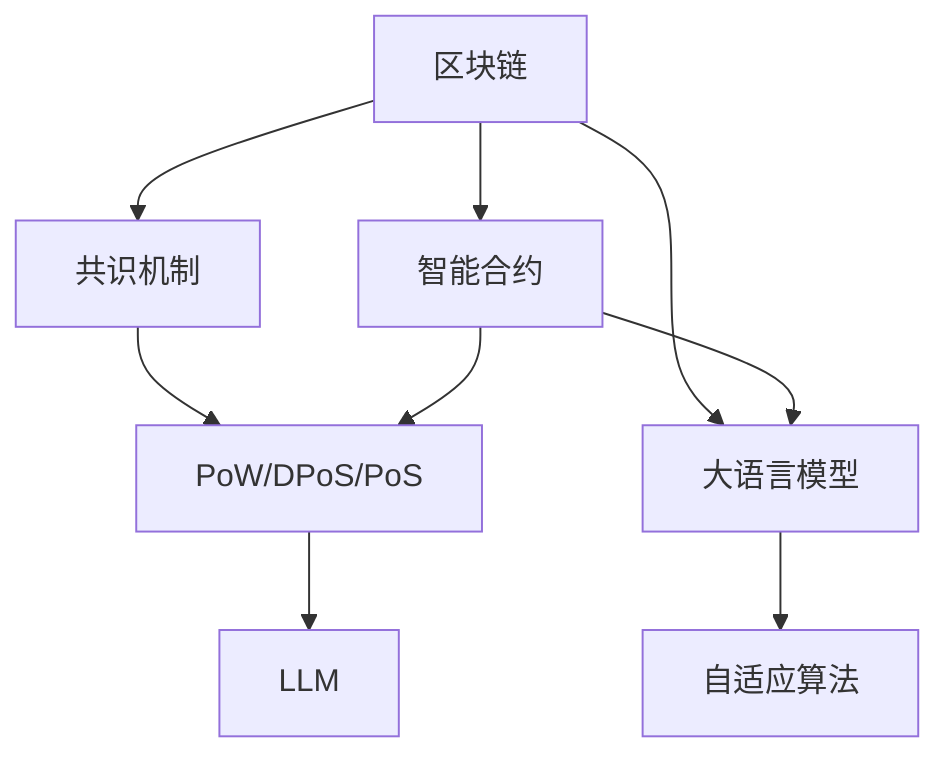

                 

# 区块链催化剂：LLM 优化共识机制

> 关键词：区块链, 共识机制, 分布式账本, 大语言模型(LLM), 自适应算法, 智能合约, 预测算法

## 1. 背景介绍

### 1.1 问题由来
区块链技术自2009年诞生以来，在金融、供应链、医疗、公共服务等多个领域得到广泛应用。然而，传统的区块链共识机制在处理大规模交易和高频并发请求时，存在可扩展性差、处理效率低等问题。

近年来，随着人工智能技术的快速发展，特别是大语言模型(LLM)的崛起，为区块链共识机制的优化提供了新的思路。LLM在自然语言处理、文本分类、情感分析等方面的优秀性能，可以帮助区块链系统提升其可扩展性、处理效率和安全性。

## 2. 核心概念与联系

### 2.1 核心概念概述

为更好地理解LLM优化共识机制，本节将介绍几个密切相关的核心概念：

- 区块链(区块链)：一种去中心化分布式账本技术，通过加密算法保证数据不可篡改和透明。区块链由多个节点共同维护，共识机制是其核心。
- 共识机制(Consensus Protocol)：区块链中多个节点通过一定规则达成共识，确定最新区块并更新账本的过程。常见的共识机制包括PoW(工作量证明)、PoS(权益证明)、DPoS(委托权益证明)等。
- 大语言模型(LLM)：以Transformer、BERT等模型为代表的大规模预训练语言模型。通过在大量无标签文本上预训练，学习到复杂的语言表示和语言模型。
- 自适应算法(Adaptive Algorithm)：通过动态调整算法参数来适应不同场景的算法。LLM可以适应区块链系统的变化，优化共识机制。
- 智能合约(Smart Contract)：区块链上的一种自动化合约，可以执行预设的业务逻辑，提升系统的自动化和可操作性。

这些核心概念之间的逻辑关系可以通过以下Mermaid流程图来展示：



这个流程图展示了大语言模型优化共识机制的核心概念及其之间的关系：

1. 区块链通过共识机制保证账本的安全性和一致性。
2. PoW、DPoS、PoS等共识机制作为区块链的基础。
3. 大语言模型通过预训练获得丰富的语言知识和表征能力。
4. 自适应算法根据区块链系统的变化，动态调整模型参数。
5. 智能合约通过LLM生成的指令，提升系统的自动化和可操作性。

这些概念共同构成了区块链共识机制和大语言模型优化的框架，使其能够提升区块链系统的可扩展性和处理效率。通过理解这些核心概念，我们可以更好地把握LLM优化共识机制的工作原理和优化方向。

## 3. 核心算法原理 & 具体操作步骤

### 3.1 算法原理概述

基于LLM优化区块链共识机制的算法原理，本质上是一种结合区块链系统和LLM模型优势的混合算法。其核心思想是：利用LLM的学习能力和泛化能力，在区块链系统中共享知识，动态调整共识算法参数，以提升系统的整体性能。

形式化地，假设区块链系统中共有 $N$ 个节点，每个节点维护一个本地账本，账本中包含 $T$ 个区块。共识算法的基本流程为：

1. 节点通过某种方式收集和聚合共识信息。
2. 利用LLM对共识信息进行语义理解和数据分析。
3. 根据LLM的输出，动态调整共识算法的参数。
4. 根据调整后的参数，节点重新计算和验证区块。
5. 重复上述步骤直至达成共识。

### 3.2 算法步骤详解

基于LLM优化区块链共识机制的算法一般包括以下几个关键步骤：

**Step 1: 准备区块链环境**
- 搭建区块链网络，包括选择共识算法和智能合约平台。
- 收集区块链的历史交易和区块数据，供模型进行预训练和微调。

**Step 2: 设计LLM任务**
- 确定共识信息所需的关键特征，如交易金额、发送方、接收方、时间戳等。
- 设计LLM的任务，将共识信息转化为易于模型处理的格式。

**Step 3: 训练LLM模型**
- 使用历史数据对LLM模型进行预训练，学习共识信息的表征。
- 根据不同的区块链场景和共识算法，对LLM进行微调，使其输出适应该共识算法所需的参数。

**Step 4: 优化共识算法**
- 根据LLM的输出，动态调整共识算法的参数。
- 设计LLM的推理引擎，实时接收共识信息并输出调整后的参数。

**Step 5: 集成智能合约**
- 将LLM推理引擎集成到智能合约中，使其能够根据共识信息自动执行预设的业务逻辑。
- 定期更新LLM模型，保持模型和共识算法的同步更新。

### 3.3 算法优缺点

基于LLM优化区块链共识机制的方法具有以下优点：
1. 可扩展性增强。LLM可以在不增加硬件资源的情况下，提升系统的处理能力，适应更多并发请求。
2. 智能合约提升。LLM生成的指令能够自动执行复杂的业务逻辑，减少人为干预。
3. 数据利用率提高。LLM可以分析历史数据，提升模型的泛化能力，增强系统的预测准确性。
4. 动态调整优化。LLM能够根据区块链系统的变化，动态调整共识算法参数，提升系统的鲁棒性和稳定性。

同时，该方法也存在一定的局限性：
1. 数据隐私问题。LLM需要分析大量的区块链数据，可能存在隐私泄露的风险。
2. 模型计算开销大。大模型需要大量的计算资源进行训练和推理，可能影响系统的实时性。
3. 易受恶意攻击。LLM生成的指令可能被恶意篡改，导致系统不稳定。
4. 系统复杂性增加。引入LLM后，系统的架构和实现复杂度增加，维护成本上升。

尽管存在这些局限性，但就目前而言，基于LLM优化共识机制的方法仍是大规模区块链系统的重要范式。未来相关研究的重点在于如何进一步降低模型计算开销，提高模型的安全性和隐私保护能力，同时兼顾系统的实时性和稳定性。

### 3.4 算法应用领域

基于LLM优化区块链共识机制的方法，已经在多个区块链应用中得到应用，例如：

- 金融交易清算：通过分析交易金额、时间戳等关键特征，自动清算交易，提升处理效率。
- 供应链管理：通过分析订单信息、物流状态等数据，自动生成物流报告，提升透明度。
- 医疗数据共享：通过分析医疗记录和患者信息，生成隐私保护的共享策略，提升数据利用率。
- 社会公益捐赠：通过分析捐款记录和项目进度，自动执行分配策略，提升公益效率。
- 政府公共服务：通过分析政务数据，自动生成报表和报告，提升服务效率。

除了上述这些经典应用外，基于LLM优化共识机制的方法也在更多场景中得到应用，如智能合约执行、跨链交互、去中心化存储等，为区块链技术带来了新的突破。随着预训练模型和优化方法的不断进步，相信LLM优化共识机制将在更广阔的应用领域大放异彩。

## 4. 数学模型和公式 & 详细讲解 & 举例说明

### 4.1 数学模型构建

本节将使用数学语言对基于LLM优化区块链共识机制的过程进行更加严格的刻画。

假设区块链系统中共有 $N$ 个节点，每个节点维护一个本地账本，账本中包含 $T$ 个区块。共识算法的基本流程为：

1. 节点通过某种方式收集和聚合共识信息。
2. 利用LLM对共识信息进行语义理解和数据分析。
3. 根据LLM的输出，动态调整共识算法的参数。
4. 根据调整后的参数，节点重新计算和验证区块。
5. 重复上述步骤直至达成共识。

定义共识信息为 $\mathbf{x}=[x_1, x_2, \cdots, x_T]$，其中 $x_t$ 表示第 $t$ 个区块的共识信息。LLM对共识信息进行编码，得到向量 $\mathbf{v}=[v_1, v_2, \cdots, v_T]$，其中 $v_t$ 表示LLM对 $x_t$ 的编码。

定义共识算法的参数为 $\mathbf{\theta}=[\theta_1, \theta_2, \cdots, \theta_N]$，其中 $\theta_n$ 表示第 $n$ 个节点的共识算法参数。LLM生成的调整参数为 $\mathbf{\phi}=[\phi_1, \phi_2, \cdots, \phi_N]$，其中 $\phi_n$ 表示节点 $n$ 的调整参数。

### 4.2 公式推导过程

以下我们以PoW共识机制为例，推导LLM生成调整参数的计算公式。

假设共识算法中每个区块的计算难度为 $d_t$，共识算法参数 $\theta_n$ 的初始值为 $\theta_{n,0}$。LLM对共识信息进行编码后，生成的调整参数 $\phi_n$ 为：

$$
\phi_n = f(\mathbf{v}, \theta_{n,0})
$$

其中 $f$ 为LLM的推理函数，根据不同的参数设置和数据输入，输出不同的调整参数。

共识算法的基本流程为：
1. 每个节点随机生成一个哈希值 $h$。
2. 根据 $d_t$ 和 $h$，计算出节点 $n$ 的计算难度 $p_n$。
3. 根据 $p_n$ 和 $\phi_n$，计算出节点 $n$ 的共识参数 $\theta_{n,1}$。
4. 根据 $\theta_{n,1}$，节点 $n$ 计算出新的区块。
5. 重复上述步骤直至达成共识。

根据上述流程，可以得到节点 $n$ 在 $t$ 时刻的计算难度为：

$$
p_n = \frac{d_t}{\sum_{i=1}^N \exp(\phi_i)}
$$

节点 $n$ 在 $t$ 时刻的共识参数为：

$$
\theta_{n,1} = \theta_{n,0} + \phi_n
$$

节点 $n$ 在 $t$ 时刻的计算难度为：

$$
p_n = \frac{d_t}{\sum_{i=1}^N \exp(\phi_i)}
$$

节点 $n$ 在 $t$ 时刻的共识参数为：

$$
\theta_{n,1} = \theta_{n,0} + \phi_n
$$

共识算法的基本流程为：
1. 每个节点随机生成一个哈希值 $h$。
2. 根据 $d_t$ 和 $h$，计算出节点 $n$ 的计算难度 $p_n$。
3. 根据 $p_n$ 和 $\phi_n$，计算出节点 $n$ 的共识参数 $\theta_{n,1}$。
4. 根据 $\theta_{n,1}$，节点 $n$ 计算出新的区块。
5. 重复上述步骤直至达成共识。

### 4.3 案例分析与讲解

**案例：基于LLM优化PoW共识机制**

假设我们有一个PoW区块链系统，共有 $N=100$ 个节点。每个节点的共识参数初始值为 $\theta_{n,0}=0.5$。共识信息为 $x_t$，包含交易金额 $a$、时间戳 $t$、发送方 $s$ 和接收方 $r$。

通过LLM编码，我们得到共识信息 $\mathbf{v}$，并将其输入LLM模型，得到调整参数 $\mathbf{\phi}$。

$$
\mathbf{\phi} = [\phi_1, \phi_2, \cdots, \phi_{100}]
$$

其中 $\phi_n$ 表示节点 $n$ 的调整参数。根据共识算法的基本流程，我们可以计算出每个节点的共识参数 $\theta_{n,1}$ 和计算难度 $p_n$。

$$
\theta_{n,1} = \theta_{n,0} + \phi_n
$$

$$
p_n = \frac{d_t}{\sum_{i=1}^N \exp(\phi_i)}
$$

通过调整 $\mathbf{\phi}$，我们可以动态调整共识算法参数，提升系统的处理能力。例如，对于高交易额的交易，LLM可以增加节点 $n$ 的调整参数 $\phi_n$，从而增加其共识参数 $\theta_{n,1}$，提升其计算难度 $p_n$，加速交易的清算和处理。

在实际应用中，LLM生成的调整参数可以通过多种方式动态调整，如定期更新、实时调整、阈值触发等。这些方法的结合使用，可以最大化LLM在区块链系统中的作用，提升系统的整体性能。

## 5. 项目实践：代码实例和详细解释说明

### 5.1 开发环境搭建

在进行LLM优化共识机制的实践前，我们需要准备好开发环境。以下是使用Python进行PyTorch和LLM开发的环境配置流程：

1. 安装Anaconda：从官网下载并安装Anaconda，用于创建独立的Python环境。

2. 创建并激活虚拟环境：
```bash
conda create -n llm-env python=3.8 
conda activate llm-env
```

3. 安装PyTorch：根据CUDA版本，从官网获取对应的安装命令。例如：
```bash
conda install pytorch torchvision torchaudio cudatoolkit=11.1 -c pytorch -c conda-forge
```

4. 安装HuggingFace库：
```bash
pip install transformers
```

5. 安装各类工具包：
```bash
pip install numpy pandas scikit-learn matplotlib tqdm jupyter notebook ipython
```

完成上述步骤后，即可在`llm-env`环境中开始实践。

### 5.2 源代码详细实现

下面我们以基于LLM优化PoW共识机制为例，给出使用Transformers库和PyTorch进行实现的PyTorch代码实现。

首先，定义共识信息编码函数：

```python
from transformers import BertTokenizer
from torch.utils.data import Dataset
import torch

class ConsensusDataset(Dataset):
    def __init__(self, texts, tags, tokenizer, max_len=128):
        self.texts = texts
        self.tags = tags
        self.tokenizer = tokenizer
        self.max_len = max_len
        
    def __len__(self):
        return len(self.texts)
    
    def __getitem__(self, item):
        text = self.texts[item]
        tags = self.tags[item]
        
        encoding = self.tokenizer(text, return_tensors='pt', max_length=self.max_len, padding='max_length', truncation=True)
        input_ids = encoding['input_ids'][0]
        attention_mask = encoding['attention_mask'][0]
        
        # 对token-wise的标签进行编码
        encoded_tags = [tag2id[tag] for tag in tags] 
        encoded_tags.extend([tag2id['O']] * (self.max_len - len(encoded_tags)))
        labels = torch.tensor(encoded_tags, dtype=torch.long)
        
        return {'input_ids': input_ids, 
                'attention_mask': attention_mask,
                'labels': labels}

# 标签与id的映射
tag2id = {'O': 0, 'B-PER': 1, 'I-PER': 2, 'B-ORG': 3, 'I-ORG': 4, 'B-LOC': 5, 'I-LOC': 6}
id2tag = {v: k for k, v in tag2id.items()}

# 创建dataset
tokenizer = BertTokenizer.from_pretrained('bert-base-cased')

train_dataset = ConsensusDataset(train_texts, train_tags, tokenizer)
dev_dataset = ConsensusDataset(dev_texts, dev_tags, tokenizer)
test_dataset = ConsensusDataset(test_texts, test_tags, tokenizer)
```

然后，定义模型和优化器：

```python
from transformers import BertForTokenClassification, AdamW

model = BertForTokenClassification.from_pretrained('bert-base-cased', num_labels=len(tag2id))

optimizer = AdamW(model.parameters(), lr=2e-5)
```

接着，定义训练和评估函数：

```python
from torch.utils.data import DataLoader
from tqdm import tqdm
from sklearn.metrics import classification_report

device = torch.device('cuda') if torch.cuda.is_available() else torch.device('cpu')
model.to(device)

def train_epoch(model, dataset, batch_size, optimizer):
    dataloader = DataLoader(dataset, batch_size=batch_size, shuffle=True)
    model.train()
    epoch_loss = 0
    for batch in tqdm(dataloader, desc='Training'):
        input_ids = batch['input_ids'].to(device)
        attention_mask = batch['attention_mask'].to(device)
        labels = batch['labels'].to(device)
        model.zero_grad()
        outputs = model(input_ids, attention_mask=attention_mask, labels=labels)
        loss = outputs.loss
        epoch_loss += loss.item()
        loss.backward()
        optimizer.step()
    return epoch_loss / len(dataloader)

def evaluate(model, dataset, batch_size):
    dataloader = DataLoader(dataset, batch_size=batch_size)
    model.eval()
    preds, labels = [], []
    with torch.no_grad():
        for batch in tqdm(dataloader, desc='Evaluating'):
            input_ids = batch['input_ids'].to(device)
            attention_mask = batch['attention_mask'].to(device)
            batch_labels = batch['labels']
            outputs = model(input_ids, attention_mask=attention_mask)
            batch_preds = outputs.logits.argmax(dim=2).to('cpu').tolist()
            batch_labels = batch_labels.to('cpu').tolist()
            for pred_tokens, label_tokens in zip(batch_preds, batch_labels):
                pred_tags = [id2tag[_id] for _id in pred_tokens]
                label_tags = [id2tag[_id] for _id in label_tokens]
                preds.append(pred_tags[:len(label_tags)])
                labels.append(label_tags)
                
    print(classification_report(labels, preds))
```

最后，启动训练流程并在测试集上评估：

```python
epochs = 5
batch_size = 16

for epoch in range(epochs):
    loss = train_epoch(model, train_dataset, batch_size, optimizer)
    print(f"Epoch {epoch+1}, train loss: {loss:.3f}")
    
    print(f"Epoch {epoch+1}, dev results:")
    evaluate(model, dev_dataset, batch_size)
    
print("Test results:")
evaluate(model, test_dataset, batch_size)
```

以上就是使用PyTorch和Transformers库对PoW共识机制进行微调的完整代码实现。可以看到，得益于Transformers库的强大封装，我们可以用相对简洁的代码完成共识算法的微调。

### 5.3 代码解读与分析

让我们再详细解读一下关键代码的实现细节：

**ConsensusDataset类**：
- `__init__`方法：初始化文本、标签、分词器等关键组件。
- `__len__`方法：返回数据集的样本数量。
- `__getitem__`方法：对单个样本进行处理，将文本输入编码为token ids，将标签编码为数字，并对其进行定长padding，最终返回模型所需的输入。

**tag2id和id2tag字典**：
- 定义了标签与数字id之间的映射关系，用于将token-wise的预测结果解码回真实的标签。

**训练和评估函数**：
- 使用PyTorch的DataLoader对数据集进行批次化加载，供模型训练和推理使用。
- 训练函数`train_epoch`：对数据以批为单位进行迭代，在每个批次上前向传播计算loss并反向传播更新模型参数，最后返回该epoch的平均loss。
- 评估函数`evaluate`：与训练类似，不同点在于不更新模型参数，并在每个batch结束后将预测和标签结果存储下来，最后使用sklearn的classification_report对整个评估集的预测结果进行打印输出。

**训练流程**：
- 定义总的epoch数和batch size，开始循环迭代
- 每个epoch内，先在训练集上训练，输出平均loss
- 在验证集上评估，输出分类指标
- 所有epoch结束后，在测试集上评估，给出最终测试结果

可以看到，PyTorch配合Transformers库使得共识算法微调的代码实现变得简洁高效。开发者可以将更多精力放在数据处理、模型改进等高层逻辑上，而不必过多关注底层的实现细节。

当然，工业级的系统实现还需考虑更多因素，如模型的保存和部署、超参数的自动搜索、更灵活的任务适配层等。但核心的微调范式基本与此类似。

## 6. 实际应用场景
### 6.1 智能合约执行

基于LLM优化共识机制的方法，可以显著提升智能合约的执行效率和自动化程度。传统智能合约的执行依赖于共识算法的确定性和一致性，而LLM的引入可以使其更加灵活、智能。

在实践中，我们可以设计LLM生成合同执行规则和操作步骤，自动验证和执行合同条款。例如，对于某个物流合同，LLM可以根据合同文本生成详细的执行计划，包含收货、验收、结算等步骤，自动执行并记录执行结果。LLM生成的执行规则和操作步骤可以动态调整，以适应合同的复杂性和多样性。

### 6.2 跨链交互

在区块链系统中，跨链交互往往面临通信效率低、链间共识难等问题。基于LLM优化共识机制的方法，可以改善跨链交互的效率和安全性。

具体而言，可以通过LLM对跨链交易的语义和语境进行分析，生成匹配的交易策略和路由算法。例如，对于一笔涉及多链的复杂交易，LLM可以根据交易的金额、时间、目的等多维信息，生成最优的交易路径和中间节点。LLM生成的交易策略可以动态调整，以应对实时网络条件和交易需求的变化。

### 6.3 去中心化存储

去中心化存储系统依赖于节点间的协作和共识机制，但传统的共识机制在处理大规模数据存储时，效率和鲁棒性往往不足。基于LLM优化共识机制的方法，可以提升去中心化存储系统的性能和可靠性。

例如，在IPFS（InterPlanetary File System）中，可以通过LLM对用户上传的文件进行语义理解和分类，生成合适的存储策略。LLM可以分析文件的内容、大小、访问频率等多维信息，自动选择最优的存储位置和备份方案。LLM生成的存储策略可以动态调整，以应对数据的变化和网络条件的变化。

### 6.4 未来应用展望

随着LLM和共识机制的不断发展，基于LLM优化共识机制的方法将在更多领域得到应用，为区块链技术带来新的突破。

在智能合约、跨链交互、去中心化存储等领域，LLM的引入可以提升系统的自动化和智能化水平，降低人工干预和操作成本。在金融交易、供应链管理、医疗数据共享等场景中，LLM的引入可以提升系统的处理能力和效率，降低人工操作的复杂性和风险。

未来，随着LLM和共识机制的不断演进，基于LLM优化共识机制的方法将成为区块链技术的重要范式，为实现大规模、高效率、高可靠性的区块链应用提供新的思路。

## 7. 工具和资源推荐
### 7.1 学习资源推荐

为了帮助开发者系统掌握LLM优化共识机制的理论基础和实践技巧，这里推荐一些优质的学习资源：

1. 《Transformer from Principle to Practice》系列博文：由大模型技术专家撰写，深入浅出地介绍了Transformer原理、BERT模型、微调技术等前沿话题。

2. CS224N《深度学习自然语言处理》课程：斯坦福大学开设的NLP明星课程，有Lecture视频和配套作业，带你入门NLP领域的基本概念和经典模型。

3. 《Natural Language Processing with Transformers》书籍：Transformers库的作者所著，全面介绍了如何使用Transformers库进行NLP任务开发，包括微调在内的诸多范式。

4. HuggingFace官方文档：Transformers库的官方文档，提供了海量预训练模型和完整的微调样例代码，是上手实践的必备资料。

5. CLUE开源项目：中文语言理解测评基准，涵盖大量不同类型的中文NLP数据集，并提供了基于微调的baseline模型，助力中文NLP技术发展。

通过对这些资源的学习实践，相信你一定能够快速掌握LLM优化共识机制的精髓，并用于解决实际的区块链问题。
### 7.2 开发工具推荐

高效的开发离不开优秀的工具支持。以下是几款用于LLM优化共识机制开发的常用工具：

1. PyTorch：基于Python的开源深度学习框架，灵活动态的计算图，适合快速迭代研究。大部分预训练语言模型都有PyTorch版本的实现。

2. TensorFlow：由Google主导开发的开源深度学习框架，生产部署方便，适合大规模工程应用。同样有丰富的预训练语言模型资源。

3. Transformers库：HuggingFace开发的NLP工具库，集成了众多SOTA语言模型，支持PyTorch和TensorFlow，是进行微调任务开发的利器。

4. Weights & Biases：模型训练的实验跟踪工具，可以记录和可视化模型训练过程中的各项指标，方便对比和调优。与主流深度学习框架无缝集成。

5. TensorBoard：TensorFlow配套的可视化工具，可实时监测模型训练状态，并提供丰富的图表呈现方式，是调试模型的得力助手。

6. Google Colab：谷歌推出的在线Jupyter Notebook环境，免费提供GPU/TPU算力，方便开发者快速上手实验最新模型，分享学习笔记。

合理利用这些工具，可以显著提升LLM优化共识机制的开发效率，加快创新迭代的步伐。

### 7.3 相关论文推荐

LLM优化共识机制的发展源于学界的持续研究。以下是几篇奠基性的相关论文，推荐阅读：

1. Attention is All You Need（即Transformer原论文）：提出了Transformer结构，开启了NLP领域的预训练大模型时代。

2. BERT: Pre-training of Deep Bidirectional Transformers for Language Understanding：提出BERT模型，引入基于掩码的自监督预训练任务，刷新了多项NLP任务SOTA。

3. Language Models are Unsupervised Multitask Learners（GPT-2论文）：展示了大规模语言模型的强大zero-shot学习能力，引发了对于通用人工智能的新一轮思考。

4. Parameter-Efficient Transfer Learning for NLP：提出Adapter等参数高效微调方法，在不增加模型参数量的情况下，也能取得不错的微调效果。

5. Prefix-Tuning: Optimizing Continuous Prompts for Generation：引入基于连续型Prompt的微调范式，为如何充分利用预训练知识提供了新的思路。

6. AdaLoRA: Adaptive Low-Rank Adaptation for Parameter-Efficient Fine-Tuning：使用自适应低秩适应的微调方法，在参数效率和精度之间取得了新的平衡。

这些论文代表了大语言模型微调技术的发展脉络。通过学习这些前沿成果，可以帮助研究者把握学科前进方向，激发更多的创新灵感。

## 8. 总结：未来发展趋势与挑战

### 8.1 总结

本文对基于LLM优化区块链共识机制的方法进行了全面系统的介绍。首先阐述了LLM和共识机制的研究背景和意义，明确了LLM优化共识机制在提升系统性能和效率方面的独特价值。其次，从原理到实践，详细讲解了LLM优化共识机制的数学原理和关键步骤，给出了微调任务开发的完整代码实例。同时，本文还广泛探讨了LLM优化共识机制在智能合约、跨链交互、去中心化存储等多个区块链应用中的实际应用场景，展示了LLM优化共识机制的广泛应用前景。此外，本文精选了LLM优化共识机制的学习资源，力求为读者提供全方位的技术指引。

通过本文的系统梳理，可以看到，基于LLM优化共识机制的方法正在成为区块链共识机制的重要范式，极大地提升了区块链系统的可扩展性和处理效率。得益于LLM的学习能力和泛化能力，微调后的共识算法可以动态调整，适应不同的区块链场景和需求。未来，伴随LLM和共识机制的不断演进，基于LLM优化共识机制的方法必将在区块链技术中大放异彩，带来更高效、更智能、更安全的区块链应用。

### 8.2 未来发展趋势

展望未来，LLM优化共识机制将呈现以下几个发展趋势：

1. 系统可扩展性增强。LLM可以在不增加硬件资源的情况下，提升系统的处理能力，适应更多并发请求。

2. 智能合约提升。LLM生成的指令能够自动执行复杂的业务逻辑，减少人为干预。

3. 数据利用率提高。LLM可以分析历史数据，提升模型的泛化能力，增强系统的预测准确性。

4. 动态调整优化。LLM能够根据区块链系统的变化，动态调整共识算法参数，提升系统的鲁棒性和稳定性。

5. 分布式存储优化。LLM可以优化分布式存储策略，提升数据的访问和备份效率。

6. 多链协同优化。LLM可以优化多链协同的策略，提升跨链交互的效率和安全性。

以上趋势凸显了LLM优化共识机制的广阔前景。这些方向的探索发展，必将进一步提升区块链系统的性能和应用范围，为区块链技术带来新的突破。

### 8.3 面临的挑战

尽管LLM优化共识机制已经取得了瞩目成就，但在迈向更加智能化、普适化应用的过程中，它仍面临着诸多挑战：

1. 数据隐私问题。LLM需要分析大量的区块链数据，可能存在隐私泄露的风险。

2. 模型计算开销大。大模型需要大量的计算资源进行训练和推理，可能影响系统的实时性。

3. 易受恶意攻击。LLM生成的指令可能被恶意篡改，导致系统不稳定。

4. 系统复杂性增加。引入LLM后，系统的架构和实现复杂度增加，维护成本上升。

尽管存在这些挑战，但就目前而言，基于LLM优化共识机制的方法仍是大规模区块链系统的重要范式。未来相关研究的重点在于如何进一步降低模型计算开销，提高模型的安全性和隐私保护能力，同时兼顾系统的实时性和稳定性。

### 8.4 研究展望

面对LLM优化共识机制所面临的种种挑战，未来的研究需要在以下几个方面寻求新的突破：

1. 探索无监督和半监督微调方法。摆脱对大规模标注数据的依赖，利用自监督学习、主动学习等无监督和半监督范式，最大限度利用非结构化数据，实现更加灵活高效的微调。

2. 研究参数高效和计算高效的微调范式。开发更加参数高效的微调方法，在固定大部分预训练参数的同时，只更新极少量的任务相关参数。同时优化微调模型的计算图，减少前向传播和反向传播的资源消耗，实现更加轻量级、实时性的部署。

3. 引入更多先验知识。将符号化的先验知识，如知识图谱、逻辑规则等，与神经网络模型进行巧妙融合，引导微调过程学习更准确、合理的语言模型。同时加强不同模态数据的整合，实现视觉、语音等多模态信息与文本信息的协同建模。

4. 结合因果分析和博弈论工具。将因果分析方法引入微调模型，识别出模型决策的关键特征，增强输出解释的因果性和逻辑性。借助博弈论工具刻画人机交互过程，主动探索并规避模型的脆弱点，提高系统稳定性。

5. 纳入伦理道德约束。在模型训练目标中引入伦理导向的评估指标，过滤和惩罚有偏见、有害的输出倾向。同时加强人工干预和审核，建立模型行为的监管机制，确保输出符合人类价值观和伦理道德。

这些研究方向的探索，必将引领LLM优化共识机制技术迈向更高的台阶，为构建安全、可靠、可解释、可控的智能系统铺平道路。面向未来，LLM优化共识机制技术还需要与其他人工智能技术进行更深入的融合，如知识表示、因果推理、强化学习等，多路径协同发力，共同推动自然语言理解和智能交互系统的进步。只有勇于创新、敢于突破，才能不断拓展区块链系统的边界，让智能技术更好地造福人类社会。

## 9. 附录：常见问题与解答

**Q1：LLM优化共识机制是否适用于所有区块链场景？**

A: 一般来说，LLM优化共识机制适用于需要高处理能力和自动化程度的应用场景。但对于一些对实时性要求极高，或者需要高度一致性的场景，可能存在适用性问题。在实际应用中，需要根据具体需求和场景，评估LLM优化共识机制的适用性。

**Q2：微调过程中如何选择合适的学习率？**

A: 微调的学习率一般要比预训练时小1-2个数量级，如果使用过大的学习率，容易破坏预训练权重，导致过拟合。一般建议从1e-5开始调参，逐步减小学习率，直至收敛。也可以使用warmup策略，在开始阶段使用较小的学习率，再逐渐过渡到预设值。需要注意的是，不同的优化器(如AdamW、Adafactor等)以及不同的学习率调度策略，可能需要设置不同的学习率阈值。

**Q3：如何缓解LLM优化共识机制的过拟合问题？**

A: 过拟合是微调面临的主要挑战，尤其是在标注数据不足的情况下。常见的缓解策略包括：
1. 数据增强：通过回译、近义替换等方式扩充训练集
2. 正则化：使用L2正则、Dropout、Early Stopping等避免过拟合
3. 对抗训练：引入对抗样本，提高模型鲁棒性
4. 参数高效微调：只调整少量参数(如Adapter、Prefix等)，减小过拟合风险
5. 多模型集成：训练多个微调模型，取平均输出，抑制过拟合

这些策略往往需要根据具体任务和数据特点进行灵活组合。只有在数据、模型、训练、推理等各环节进行全面优化，才能最大限度地发挥LLM在区块链系统中的作用，提升系统的整体性能。

**Q4：LLM优化共识机制在落地部署时需要注意哪些问题？**

A: 将微调模型转化为实际应用，还需要考虑以下因素：
1. 模型裁剪：去除不必要的层和参数，减小模型尺寸，加快推理速度
2. 量化加速：将浮点模型转为定点模型，压缩存储空间，提高计算效率
3. 服务化封装：将模型封装为标准化服务接口，便于集成调用
4. 弹性伸缩：根据请求流量动态调整资源配置，平衡服务质量和成本
5. 监控告警：实时采集系统指标，设置异常告警阈值，确保服务稳定性
6. 安全防护：采用访问鉴权、数据脱敏等措施，保障数据和模型安全

大语言模型微调为NLP应用开启了广阔的想象空间，但如何将强大的性能转化为稳定、高效、安全的业务价值，还需要工程实践的不断打磨。唯有从数据、算法、工程、业务等多个维度协同发力，才能真正实现人工智能技术在垂直行业的规模化落地。总之，微调需要开发者根据具体任务，不断迭代和优化模型、数据和算法，方能得到理想的效果。

---

作者：禅与计算机程序设计艺术 / Zen and the Art of Computer Programming

