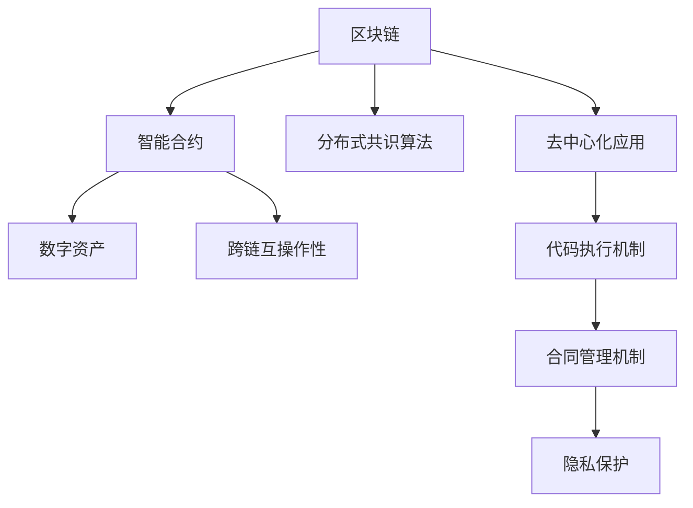
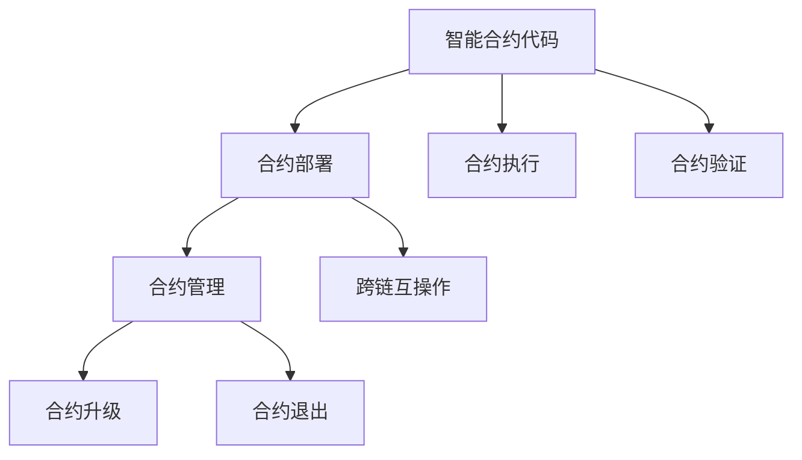

                 

# 区块链智能合约：去中心化应用的核心

## 1. 背景介绍

### 1.1 问题由来
区块链技术自2009年诞生以来，逐渐成为全球范围内被广泛研究和应用的热点。它以去中心化、透明性、不可篡改性等特点，为各行各业带来了深刻变革。特别是智能合约（Smart Contracts）的提出，更是将区块链技术从纯粹的加密货币领域，扩展到金融、供应链、政府、医疗等更广泛的领域，为去中心化应用（DApps，Decentralized Applications）的开发提供了强有力的技术支撑。

智能合约是一种无需人工干预即可自动执行的合约，由代码构成，能在区块链上运行。它们基于区块链的去中心化特性，具备高度的可信度和自治性。智能合约的成功部署，为自动化的去中心化应用提供了可能性，标志着去中心化经济（DeFi，Decentralized Finance）等新型应用模式的崛起。

然而，尽管智能合约具有众多优势，但也面临着诸如代码安全漏洞、执行效率低、治理问题等诸多挑战。如何安全高效地开发、部署和维护智能合约，一直是区块链技术研究的热点问题。本文将系统性地介绍区块链智能合约的原理与技术，特别是如何通过智能合约实现去中心化应用，并为智能合约的开发与部署提供实际操作指南。

### 1.2 问题核心关键点
智能合约的核心关键点包括以下几个方面：

- 分布式共识机制：如何保证交易的安全性和不可篡改性，是智能合约首先需要解决的问题。
- 代码执行机制：如何高效安全地执行合约代码，是智能合约开发的关键。
- 合同管理机制：如何对智能合约进行管理、升级、退出等，是智能合约维护的重点。
- 跨链互操作性：如何实现不同区块链之间的互操作，是智能合约技术发展的方向。
- 隐私保护：如何在保证公开透明的同时，保护合约和用户的隐私信息，是智能合约需要考虑的重要问题。

这些关键点共同构成了智能合约的框架，决定了其功能性和实用性。通过理解这些核心概念，我们可以更好地把握智能合约的开发方向和技术细节。

## 2. 核心概念与联系

### 2.1 核心概念概述

为了更好地理解智能合约的原理和架构，本节将介绍几个关键概念及其相互联系：

- 区块链（Blockchain）：一种分布式账本技术，通过去中心化的节点共识，实现数据的不可篡改性和透明性。
- 智能合约（Smart Contracts）：一种在区块链上运行的代码，当满足预设条件时，可以自动执行一系列操作。
- 分布式共识算法（Consensus Algorithm）：一种算法，用于在去中心化的网络中达成一致，保证数据的正确性和完整性。
- 去中心化应用（DApps，Decentralized Applications）：一种基于智能合约的分布式应用，能够在区块链上实现自治和去中心化。
- 数字资产（Digital Assets）：基于区块链或智能合约生成的可交易的数字权益，如加密货币、代币等。

这些概念之间的逻辑关系可以通过以下Mermaid流程图来展示：



这个流程图展示了几大关键概念及其之间的联系：

1. 区块链是智能合约和DApps的基础，通过分布式共识算法保障数据安全和透明性。
2. 智能合约利用区块链上的代码执行机制，实现自动化合约功能。
3. 去中心化应用依托智能合约，能够在区块链上实现自治和去中心化。
4. 数字资产由智能合约生成，能够在DApps中自由流通。
5. 合同管理机制确保智能合约的安全、升级和退出。
6. 跨链互操作性扩展了智能合约的应用场景。
7. 隐私保护在保证公开透明的同时，保护了合约和用户的隐私信息。

这些概念共同构成了智能合约的核心技术框架，为去中心化应用的开发提供了基础支撑。

## 3. 核心算法原理 & 具体操作步骤
### 3.1 算法原理概述

智能合约的核心算法原理主要围绕以下几个方面展开：

- 合约编码与部署：编写智能合约的代码，并部署到区块链上。
- 合约执行与验证：根据预设条件，自动执行合约代码，并验证其正确性。
- 合约管理与升级：在满足特定条件时，对智能合约进行管理、升级和退出。
- 跨链互操作：实现不同区块链之间的互操作，扩展智能合约的应用场景。

智能合约的原理图可表示如下：



智能合约的部署和执行过程，需要利用区块链的网络特性，结合具体的算法实现。

### 3.2 算法步骤详解

以下详细介绍智能合约的部署和执行过程：

**Step 1: 编写合约代码**

智能合约代码通常使用Solidity、SCALE等区块链编程语言编写。编写合约代码需要考虑安全性、可执行性、互操作性等方面。以Solidity为例，基本结构包括`pragma solidity`定义语言版本、合约名称和描述、变量声明、函数定义等部分。例如：

```solidity
pragma solidity ^0.8.0;

contract Example {
    uint256 public balance;

    function setBalance(uint256 _value) public {
        balance = _value;
    }

    function getBalance() public view returns (uint256) {
        return balance;
    }
}
```

**Step 2: 合约部署**

合约代码编写完成后，需要将其部署到区块链上。部署过程通常涉及以下步骤：

- 选择适合的区块链平台，如以太坊、Binance Smart Chain等。
- 利用区块链客户端（如Ganache、Truffle等）构建和测试部署环境。
- 通过区块链网络上传部署合约，生成合约地址。

例如，在以太坊上部署合约的命令为：

```bash
echo '0x{CONTRACT_ADDRESS}' > contract_address.txt
```

**Step 3: 合约执行**

智能合约部署成功后，可以通过调用合约函数来执行其功能。合约执行过程包括：

- 发送交易至合约地址，指定函数名和参数。
- 合约函数被执行，验证交易合法性。
- 执行合约函数，并返回执行结果。

例如，在以太坊上调用上例中的`setBalance`函数的命令为：

```bash
eth_call --from 0x{YOUR_ACCOUNT} --gas 5000000 --data 0xa9059cbb000000000000000000000000000000000000000000000000000000000000000000000000000000000000000000000000000000000000000000000000000000000000000000000000000000000000000000000000000000000000000000000000000000000000000000000000000000000000000000000000000000000000000000000000000000000000000000000000000000000000000000000000000000000000000000000000000000000000000000000000000000000000000000000000000000000000000000000000000000000000000000000000000000000000000000000000000000000000000000000000000000000000000000000000000000000000000000000000000000000000000000000000000000000000000000000000000000000000000000000000000000000000000000000000000000000000000000000000000000000000000000000000000000000000000000000000000000000000000000000000000000000000000000000000000000000000000000000000000000000000000000000000000000000000000000000000000000000000000000000000000000000000000000000000000000000000000000000000000000000000000000000000000000000000000000000000000000000000000000000000000000000000000000000000000000000000000000000000000000000000000000000000000000000000000000000000000000000000000000000000000000000000000000000000000000000000000000000000000000000000000000000000000000000000000000000000000000000000000000000000000000000000000000000000000000000000000000000000000000000000000000000000000000000000000000000000000000000000000000000000000000000000000000000000000000000000000000000000000000000000000000000000000000000000000000000000000000000000000000000000000000000000000000000000000000000000000000000000000000000000000000000000000000000000000000000000000000000000000000000000000000000000000000000000000000000000000000000000000000000000000000000000000000000000000000000000000000000000000000000000000000000000000000000000000000000000000000000000000000000000000000000000000000000000000000000000000000000000000000000000000000000000000000000000000000000000000000000000000000000000000000000000000000000000000000000000000000000000000000000000000000000000000000000000000000000000000000000000000000000000000000000000000000000000000000000000000000000000000000000000000000000000000000000000000000000000000000000000000000000000000000000000000000000000000000000000000000000000000000000000000000000000000000000000000000000000000000000000000000000000000000000000000000000000000000000000000000000000000000000000000000000000000000000000000000000000000000000000000000000000000000000000000000000000000000000000000000000000000000000000000000000000000000000000000000000000000000000000000000000000000000000000000000000000000000000000000000000000000000000000000000000000000000000000000000000000000000000000000000000000000000000000000000000000000000000000000000000000000000000000000000000000000000000000000000000000000000000000000000000000000000000000000000000000000000000000000000000000000000000000000000000000000000000000000000000000000000000000000000000000000000000000000000000000000000000000000000000000000000000000000000000000000000000000000000000000000000000000000000000000000000000000000000000000000000000000000000000000000000000000000000000000000000000000000000000000000000000000000000000000000000000000000000000000000000000000000000000000000000000000000000000000000000000000000000000000000000000000000000000000000000000000000000000000000000000000000000000000000000000000000000000000000000000000000000000000000000000000000000000000000000000000000000000000000000000000000000000000000000000000000000000000000000000000000000000000000000000000000000000000000000000000000000000000000000000000000000000000000000000000000000000000000000000000000000000000000000000000000000000000000000000000000000000000000000000000000000000000000000000000000000000000000000000000000000000000000000000000000000000000000000000000000000000000000000000000000000000000000000000000000000000000000000000000000000000000000000000000000000000000000000000000000000000000000000000000000000000000000000000000000000000000000000000000000000000000000000000000000000000000000000000000000000000000000000000000000000000000000000000000000000000000000000000000000000000000000000000000000000000000000000000000000000000000000000000000000000000000000000000000000000000000000000000000000000000000000000000000000000000000000000000000000000000000000000000000000000000000000000000000000000000000000000000000000000000000000000000000000000000000000000000000000000000000000000000000000000000000000000000000000000000000000000000000000000000000000000000000000000000000000000000000000000000000000000000000000000000000000000000000000000000000000000000000000000000000000000000000000000000000000000000000000000000000000000000000000000000000000000000000000000000000000000000000000000000000000000000000000000000000000000000000000000000000000000000000000000000000000000000000000000000000000000000000000000000000000000000000000000000000000000000000000000000000000000000000000000000000000000000000000000000000000000000000000000000000000000000000000000000000000000000000000000000000000000000000000000000000000000000000000000000000000000000000000000000000000000000000000000000000000000000000000000000000000000000000000000000000000000000000000000000000000000000000000000000000000000000000000000000000000000000000000000000000000000000000000000000000000000000000000000000000000000000000000000000000000000000000000000000000000000000000000000000000000000000000000000000000000000000000000000000000000000000000000000000000000000000000000000000000000000000000000000000000000000000000000000000000000000000000000000000000000000000000000000000000000000000000000000000000000000000000000000000000000000000000000000000000000000000000000000000000000000000000000000000000000000000000000000000000000000000000000000000000000000000000000000000000000000000000000000000000000000000000000000000000000000000000000000000000000000000000000000000000000000000000000000000000000000000000000000000000000000000000000000000000000000000000000000000000000000000000000000000000000000000000000000000000000000000000000000000000000000000000000000000000000000000000000000000000000000000000000000000000000000000000000000000000000000000000000000000000000000000000000000000000000000000000000000000000000000000000000000000000000000000000000000000000000000000000000000000000000000000000000000000000000000000000000000000000000000000000000000000000000000000000000000000000000000000000000000000000000000000000000000000000000000000000000000000000000000000000000000000000000000000000000000000000000000000000000000000000000000000000000000000000000000000000000000000000000000000000000000000000000000000000000000000000000000000000000000000000000000000000000000000000000000000000000000000000000000000000000000000000000000000000000000000000000000000000000000000000000000000000000000000000000000000000000000000000000000000000000000000000000000000000000000000000000000000000000000000000000000000000000000000000000000000000000000000000000000000000000000000000000000000000000000000000000000000000000000000000000000000000000000000000000000000000000000000000000000000000000000000000000000000000000000000000000000000000000000000000000000000000000000000000000000000000000000000000000000000000000000000000000000000000000000000000000000000000000000000000000000000000000000000000000000000000000000000000000000000000000000000000000000000000000000000000000000000000000000000000000000000000000000000000000000000000000000000000000000000000000000000000000000000000000000000000000000000000000000000000000000000000000000000000000000000000000000000000000000000000000000000000000000000000000000000000000000000000000000000000000000000000000000000000000000000000000000000000000000000000000000000000000000000000000000000000000000000000000000000000000000000000000000000000000000000000000000000000000000000000000000000000000000000000000000000000000000000000000000000000000000000000000000000000000000000000000000000000000000000000000000000000000000000000000000000000000000000000000000000000000000000000000000000000000000000000000000000000000000000000000000000000000000000000000000000000000000000000000000000000000000000000000000000000000000000000000000000000000000000000000000000000000000000000000000000000000000000000000000000000000000000000000000000000000000000000000000000000000000000000000000000000000000000000000000000000000000000000000000000000000000000000000000000000000000000000000000000000000000000000000000000000000000000000000000000000000000000000000000000000000000000000000000000000000000000000000000000000000000000000000000000000000000000000000000000000000000000000000000000000000000000000000000000000000000000000000000000000000000000000000000000000000000000000000000000000000000000000000000000000000000000000000000000000000000000000000000000000000000000000000000000000000000000000000000000000000000000000000000000000000000000000000000000000000000000000000000000000000000000000000000000000000000000000000000000000000000000000000000000000000000000000000000000000000000000000000000000000000000000000000000000000000000000000000000000000000000000000000000000000000000000000000000000000000000000000000000000000000000000000000000000000000000000000000000000000000000000000000000000000000000000000000000000000000000000000000000000000000000000000000000000000000000000000000000000000000000000000000000000000000000000000000000000000000000000000000000000000000000000000000000000000000000000000000000000000000000000000000000000000000000000000000000000000000000000000000000000000000000000000000000000000000000000000000000000000000000000000000000000000000000000000000000000000000000000000000000000000000000000000000000000000000000000000000000000000000000000000000000000000000000000000000000000000000000000000000000000000000000000000000000000000000000000000000000000000000000000000000000000000000000000000000000000000000000000000000000000000000000000000000000000000000000000000000000000000000000000000000000000000000000000000000000000000000000000000000000000000000000000000000000000000000000000000000000000000000000000000000000000000000000000000000000000000000000000000000000000000000000000000000000000000000000000000000000000000000000000000000000000000000000000000000000000000000000000000000000000000000000000000000000000000000000000000000000000000000000000000000000000000000000000000000000000000000000000000000000000000000000000000000000000000000000000000000000000000000000000000000000000000000000000000000000000000000000000000000000000000000000000000000000000000000000000000000000000000000000000000000000000000000000000000000000000000000000000000000000000000000000000000000000000000000000000000000000000000000000000000000000000000000000000000000000000000000000000000000000000000000000000000000000000000000000000000000000000000000000000000000000000000000000000000000000000000000000000000000000000000000000000000000000000000000000000000000000000000000000000000000000000000000000000000000000000000000000000000000000000000000000000000000000000000000000000000000000000000000000000000000000000000000000000000000000000000000000000000000000000000000000000000000000000000000000000000000000000000000000000000000000000000000000000000000000000000000000000000000000000000000000000000000000000000000000000000000000000000000000000000000000000000000000000000000000000000000000000000000000000000000000000000000000000000000000000000000000000000000000000000000000000000000000000000000000000000000000000000000000000000000000000000000000000000000000000000000000000000000000000000000000000000000000000000000000000000000000000000000000000000000000000000000000000000000000000000000000000000000000000000000000000000000000000000000000000000000000000000000000000000000000000000000000000000000000000000000000000000000000000000000000000000000000000000000000000000000000000000000000000000000000000000000000000000000000000000000000000000000000000000000000000000000000000000000000000000000000000000000000000000000000000000000000000000000000000000000000000000000000000000000000000000000000000000000000000000000000000000000000000000000000000000000000000000000000000000000000000000000000000000000000000000000000000000000000000000000000000000000000000000000000000000000000000000000000000000000000000000000000000000000000000000000000000000000000000000000000000000000000000000000000000000000000000000000000000000000000000000000000000000000000000000000000000000000000000000000000000000000000000000000000000000000000000000000000000000000000000000000000000000000000000000000000000000000000000000000000000000000000000000000000000000000000000000000000000000000000000000000000000000000000000000000000000000000000000000000000000000000000000000000000000000000000000000000000000000000000000000000000000000000000000000000000000000000000000000000000000000000000000000000000000000000000000000000000000000000000000000000000000000000000000000000000000000000000000000000000000000000000000000000000000000000000000000000000000000000000000000000000000000000000000000000000000000000000000000000000000000000000000000000000000000000000000000000000000000000000000000000000000000000000000000000000000000000000000000000000000000000000000000000000000000000000000000000000000000000000000000000000000000000000000000000000000000000000000000000000000000000000000000000000000000000000000000000000000000000000000000000000000000000000000000000000000000000000000000000000000000000000000000000000000000000000000000000000000000000000000000000000000000000000000000000000000000000000000000000000000000000000000000000000000000000000000000000000000000000000000000000000000000000000000000000000000000000000000000000000000000000000000000000000000000000000000000000000000000000000000000000000000000000000000000000000000000000000000000000000000000000000000000000000000000000000000000000000000000000000000000000000000000000000000000000000000000000000000000000000000000000000000000000000000000000000000000000000000000000000000000000000000000000000000000000000000000000000000000000000000000000000000000000000000000000000000000000000000000000000000000000000000000000000000000000000000000000000000000000000000000000000000000000000000000000000000000000000000000000000000000000000000000000000000000000000000000000000000000000000000000000000000000000000000000000000000000000000000000000000000000000000000000000000000000000000000000000000000000000000000000000000000000000000000000000000000000000000000000000000000000000000000000000000000000000000000000000000000000000000000000000000000000000000000000000000000000000000000000000000000000000000000000000000000000000000000000000000000000000000000000000000000000000000000000000000000000000000000000000000000000000000000000000000000000000000000000000000000000000000000000000000000000000000000000000000000000000000000000000000000000000000000000000000000000000000000000000000000000000000000000000000000000000000000000000000000000000000000000000000000000000000000000000000000000000000000000000000000000000000000000000000000000000000000000000000000000000000000000000000000000000000000000000000000000000000000000000000000000000000000000000000000000000000000000000000000000000000000000000000000000000000000000000000000000000000000000000000000000000000000000000000000000000000000000000000000000000000000000000000000000000000000000000000000000000000000000000000000000000000000000000000000000000000000000000000000000000000000000000000000000000000000000000000000000000000000000000000000000000000000000000000000000000000000000000000000000000000000000000000000000000000000000000000000000000000000000000000000000000000000000000000000000000000000000000000000000000000000000000000000000000000000000000000000000000000000000000000000000000000000000000000000000000000000000000000000000000000000000000000000000000000000000000000000000000000000000000000000000

