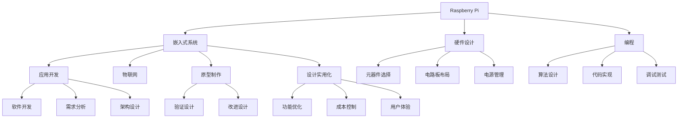

                 

# 单板计算机项目：Raspberry Pi 和 Arduino 的应用

> 关键词：Raspberry Pi, Arduino, 单板计算机, 嵌入式系统, 应用开发, 电子产品创新, 硬件设计, 编程, 物联网, 原型制作, 设计实用化

## 1. 背景介绍

### 1.1 问题由来

在当前数字化、智能化的时代背景下，各种小型化、低成本的智能硬件设备层出不穷。其中，单板计算机（Single Board Computer, SBC）作为嵌入式系统中的重要一员，因其小巧便携、成本低廉、易于集成等特点，受到了广泛关注和应用。尤其是开源硬件平台如Raspberry Pi和Arduino，因其强大的社区支持和丰富的开发资源，成为了单板计算机项目开发的首选。

### 1.2 问题核心关键点

选择适合的单板计算机平台、开发高性能的应用程序、实现硬件与软件的完美融合、优化产品设计和用户体验，是单板计算机项目开发的核心关键点。本文将系统介绍Raspberry Pi和Arduino在单板计算机项目中的应用，涵盖从硬件设计到软件开发，以及最终的产品实现和创新，帮助读者全面掌握单板计算机项目的开发流程和方法。

## 2. 核心概念与联系

### 2.1 核心概念概述

为更好地理解Raspberry Pi和Arduino在单板计算机项目中的应用，本节将介绍几个密切相关的核心概念：

- **Raspberry Pi**：一种基于ARM架构的、用于学习和实验的低成本单板计算机，由英国Raspberry Pi基金会开发，支持Linux系统，搭载了包括处理器、内存、存储、网络接口等在内的完整计算平台。
- **Arduino**：一种基于开源硬件平台，以单片机为核心的，支持多种编程语言的通用嵌入式开发平台，广泛应用于物联网、智能硬件等领域。
- **嵌入式系统**：指集成在各种设备中的计算机系统，具有专门的硬件、软件和操作系统，用于执行特定任务。
- **应用开发**：指为特定需求或目标开发的软件应用程序，涵盖从需求分析、架构设计、编码实现到测试部署的全过程。
- **电子产品创新**：指通过新材料、新技术、新设计等方式，提升电子产品的功能、性能和用户体验的过程。
- **硬件设计**：指在单板计算机等嵌入式系统中，对电路板布局、元器件选择、电源管理等方面的设计和优化。
- **编程**：指使用特定编程语言实现软件功能的过程，涵盖算法设计、代码实现、调试测试等环节。
- **物联网**：指将各类物理设备通过互联网进行连接和通信，实现智能化的信息感知、传输和处理。
- **原型制作**：指通过快速制作硬件原型，验证设计思想、改进产品设计的迭代过程。
- **设计实用化**：指将设计理念转化为实际产品的过程，涵盖功能优化、成本控制、用户体验提升等方面。

这些核心概念之间的逻辑关系可以通过以下Mermaid流程图来展示：



这个流程图展示了两款单板计算机平台Raspberry Pi和Arduino的开发流程和核心概念：

1. Raspberry Pi作为嵌入式系统，涉及硬件设计、编程和应用开发。
2. Arduino同样涉及嵌入式系统和应用开发，但其重点是硬件设计和编程。
3. 两者共同关联的物联网和原型制作，以及最终的设计实用化，体现了单板计算机项目从概念验证到市场化应用的完整过程。

## 3. 核心算法原理 & 具体操作步骤

### 3.1 算法原理概述

Raspberry Pi和Arduino在单板计算机项目中的应用，本质上是嵌入式系统开发和应用开发的结合。其核心算法原理包括：

- **嵌入式系统编程**：使用特定硬件平台的编程语言和工具，实现硬件设备的控制和数据处理。
- **应用软件开发**：使用通用编程语言和框架，实现应用程序的逻辑和功能，满足用户需求。
- **硬件接口通信**：实现硬件设备和软件程序之间的数据传输和控制。

### 3.2 算法步骤详解

#### 3.2.1 硬件设计

- **元器件选择**：根据项目需求选择合适的元器件，如处理器、存储、接口芯片等。
- **电路板布局**：设计电路板布局，包括元器件的排列、连接方式、布线等。
- **电源管理**：设计电源方案，确保系统稳定运行，并进行电源管理。

#### 3.2.2 嵌入式系统编程

- **编程语言选择**：选择适合的编程语言，如Raspberry Pi的Python、C/C++等，Arduino的C++和高级库。
- **硬件控制**：使用编程语言实现对硬件设备的控制，如GPIO控制、SPI通信等。
- **数据处理**：使用编程语言实现数据处理功能，如传感器数据采集、处理和存储。

#### 3.2.3 应用软件开发

- **需求分析**：明确应用需求，定义功能模块和接口。
- **架构设计**：设计应用架构，包括模块划分、通信协议、数据流等。
- **编码实现**：实现应用功能，编写代码，进行调试和测试。

#### 3.2.4 硬件接口通信

- **通信协议**：选择合适的通信协议，如I2C、UART、Wi-Fi等，实现硬件和软件之间的数据传输。
- **接口驱动**：编写硬件接口驱动，支持应用软件对硬件设备的访问和控制。

### 3.3 算法优缺点

Raspberry Pi和Arduino在单板计算机项目中的应用具有以下优点：

- **开发成本低**：开源硬件平台易于获得，开发成本较低。
- **社区支持强大**：两大平台拥有庞大的开发者社区，提供丰富的开发资源和支持。
- **灵活性强**：可以根据需求自由设计和扩展硬件，实现个性化应用。
- **应用广泛**：适用于多种应用场景，包括智能家居、工业控制、物联网等。

同时，这些平台也存在一些缺点：

- **性能有限**：相比于高性能计算机，Raspberry Pi和Arduino的处理能力和存储性能有限，可能无法满足某些高负载需求。
- **功耗较大**：单板计算机设备通常电池供电，高功耗会导致电池寿命缩短。
- **安全性较低**：开源平台和低成本设备的安全性可能不如商业系统。

### 3.4 算法应用领域

Raspberry Pi和Arduino在单板计算机项目中的应用涵盖了多个领域：

- **智能家居**：用于家庭自动化控制，如智能门锁、智能照明、智能安防等。
- **工业控制**：用于工业自动化和设备监控，如温度控制、设备状态监控等。
- **物联网**：用于连接各类传感器和设备，实现智能化信息采集和处理。
- **电子产品创新**：用于设计和实现新型电子产品，如智能穿戴设备、智能玩具等。
- **原型制作**：用于快速制作硬件原型，验证设计理念和改进设计。

## 4. 数学模型和公式 & 详细讲解 & 举例说明

### 4.1 数学模型构建

在单板计算机项目中，涉及的数学模型主要集中在嵌入式系统编程和应用软件开发中。以Raspberry Pi的嵌入式系统编程为例，其数学模型构建过程如下：

- **输入输出模型**：定义输入输出数据流，包括传感器输入和执行器输出。
- **信号处理模型**：设计信号处理算法，对传感器数据进行滤波、放大、编码等处理。
- **控制算法模型**：设计控制算法，实现对执行器的控制，如PID控制、状态机等。

### 4.2 公式推导过程

以Arduino的I2C通信为例，介绍嵌入式系统编程中常见的公式推导过程：

假设Arduino通过I2C与一个温度传感器通信，传感器的地址为0x48，数据的长度为2字节，数据的最高位为温度的高8位，最低位为温度的低8位。则I2C通信的公式推导如下：

1. **传感器寻址**：将传感器地址写入I2C总线，以建立通信。
   - 发送起始信号（SCL高，SDA高）。
   - 发送地址位，SCL由高到低，SDA由低到高。
   - 发送停止位，SCL高，SDA高。

2. **数据读取**：从传感器读取数据。
   - 读取数据高位，SCL由高到低，SDA从传感器拉高。
   - 读取数据低位，SCL由高到低，SDA从传感器拉高。
   - 读取停止位，SCL高，SDA高。

3. **温度计算**：根据读取的数据计算温度值。
   - 高位字节左移4位，与低位字节按位或运算，得到完整的温度值。
   - 将温度值转换为摄氏度或华氏度。

### 4.3 案例分析与讲解

#### 案例分析：智能温控器开发

- **需求分析**：实现室内温度的智能控制，支持用户设置温度范围和模式。
- **架构设计**：设计嵌入式系统、应用软件和硬件接口的架构。
- **硬件设计**：选择合适的处理器、传感器和通信模块。
- **嵌入式系统编程**：实现传感器数据采集、温度控制算法、I2C通信等功能。
- **应用软件开发**：实现用户界面、温度控制逻辑和远程控制功能。

## 5. 项目实践：代码实例和详细解释说明

### 5.1 开发环境搭建

1. **硬件平台选择**：根据项目需求选择合适的硬件平台，如Raspberry Pi或Arduino。
2. **开发环境配置**：安装交叉编译器和开发工具链，如GCC、Make等。
3. **开发环境测试**：确保硬件平台和开发环境能够正常运行。

### 5.2 源代码详细实现

#### Raspberry Pi项目：智能温控器

- **硬件设计**：选择Raspberry Pi Zero作为处理器，连接温度传感器和显示模块。
- **嵌入式系统编程**：编写I2C通信代码，实现传感器数据的读取和温度控制。
- **应用软件开发**：使用Python开发用户界面和温度控制逻辑。

#### Arduino项目：智能门锁

- **硬件设计**：选择Arduino Uno作为处理器，连接门锁电机、传感器和通信模块。
- **嵌入式系统编程**：编写GPIO控制代码，实现门锁开合控制和状态监控。
- **应用软件开发**：使用Arduino IDE编写远程控制代码，支持手机App控制。

### 5.3 代码解读与分析

#### Raspberry Pi项目：智能温控器

- **I2C通信代码**：
  ```python
  import smbus

  bus = smbus.SMBus(1)
  address = 0x48
  length = 2

  bus.write_i2c_block_data(address, 0x00, [1, 1]) # 发送起始信号和地址
  data = bus.read_i2c_block_data(address, 0x01, length) # 读取数据
  temperature = (data[0] << 4) | data[1] # 计算温度值
  ```

- **温度控制代码**：
  ```python
  # 设定目标温度
  target_temp = 25

  # 读取当前温度
  current_temp = read_temperature()

  # 计算温差
  delta_temp = target_temp - current_temp

  # 根据温差调整加热器功率
  if delta_temp > 0:
      set_heater_power(1) # 开启加热器
  else:
      set_heater_power(0) # 关闭加热器
  ```

#### Arduino项目：智能门锁

- **GPIO控制代码**：
  ```cpp
  const int motorPin = 13;
  const int lockPin = 10;

  void setup() {
      pinMode(motorPin, OUTPUT);
      pinMode(lockPin, INPUT);
  }

  void loop() {
      // 读取锁状态
      int state = digitalRead(lockPin);

      // 控制门锁开合
      if (state == HIGH) {
          digitalWrite(motorPin, HIGH);
      } else {
          digitalWrite(motorPin, LOW);
      }
  }
  ```

- **远程控制代码**：
  ```cpp
  const char* apn = "APN";
  const char* token = "TOKEN";
  const char* url = "https://api.example.com/door";

  void sendCommand(int command) {
      char payload[20];
      sprintf(payload, "command=%d", command);

      // 构建请求头
      const char* headers[] = {
          "Content-Type: application/json",
          "Authorization: Bearer " token,
          "APN: " apn
      };

      // 发送请求
      WiFiClient client;
      client.connect("api.example.com", 80);
      client.beginRequest("POST", "/door");
      for (int i = 0; i < 3; i++) {
          client.addHeader(headers[i]);
      }
      client.addHeader("Content-Length: 20");
      client.addHeader("Connection: close");
      client.addHeader("Host: api.example.com");
      client.print(payload);
      client.endRequest();
      client.flush();
      client.stop();
  }
  ```

### 5.4 运行结果展示

- **智能温控器**：通过Python开发的应用软件显示当前温度和设定温度，根据实时温度自动调整加热器功率，实现室内温度的智能控制。
- **智能门锁**：通过Arduino IDE编写的远程控制代码，支持手机App控制门锁开合，提高了门锁的安全性和便利性。

## 6. 实际应用场景

### 6.1 智能家居

#### 场景描述

智能家居系统通过Raspberry Pi或Arduino等单板计算机平台，实现对家庭设备的智能控制，包括照明、安防、环境监测等功能，提升用户的生活质量和居住体验。

#### 应用示例

- **智能灯光控制**：使用Raspberry Pi连接传感器和执行器，根据环境光强自动调整室内灯光亮度和色温。
- **智能安防监控**：使用Arduino连接摄像头和报警器，实现入侵检测和报警功能。

### 6.2 工业控制

#### 场景描述

工业控制系统中，单板计算机作为嵌入式设备，实现对生产线的监控和控制，提高生产效率和质量。

#### 应用示例

- **温度控制系统**：使用Raspberry Pi连接传感器和执行器，实现生产线的温度控制，保证生产质量。
- **设备状态监控**：使用Arduino连接传感器和通信模块，实时监测设备状态，及时发现和处理故障。

### 6.3 物联网

#### 场景描述

物联网系统通过单板计算机平台，连接各类传感器和设备，实现数据采集和智能处理，提升数据的管理和利用效率。

#### 应用示例

- **环境监测系统**：使用Raspberry Pi连接各类传感器，实时监测环境参数，如空气质量、温度、湿度等。
- **智能交通系统**：使用Arduino连接传感器和通信模块，实现交通流量监测和实时数据分析。

## 7. 工具和资源推荐

### 7.1 学习资源推荐

1. **《Raspberry Pi用户手册》**：详细介绍Raspberry Pi硬件和软件开发，涵盖从硬件设计到应用开发的全过程。
2. **《Arduino官方文档》**：Arduino官方提供的详细文档和教程，涵盖编程语言和库的使用，以及各类硬件的连接方法。
3. **《嵌入式系统设计与开发》**：介绍嵌入式系统设计的基本原理和开发方法，涵盖硬件设计、软件编程和系统集成等方面。
4. **《物联网技术与应用》**：介绍物联网系统的设计原理和开发方法，涵盖传感器、通信协议、数据处理等方面。
5. **《单板计算机项目开发实战》**：基于实际项目开发的实战教程，涵盖从需求分析到原型制作的全过程，适合初学者和进阶开发者。

### 7.2 开发工具推荐

1. **Raspberry Pi Desktop**：Raspberry Pi官方的图形化开发环境，方便开发者进行硬件设计和应用开发。
2. **Arduino IDE**：Arduino官方提供的开发环境，支持各类硬件的编程和调试。
3. **GCC和Make**：开源编译器和构建工具，支持嵌入式系统编程和应用开发。
4. **WiFi Shield和GSM模块**：用于连接互联网和GSM网络的硬件模块，方便开发者实现远程控制和数据通信。
5. **Serial Monitor和IDE Monitor**：用于调试和监视硬件设备的串口工具，方便开发者进行硬件调试和数据监控。

### 7.3 相关论文推荐

1. **《A Survey on the Integration of Raspberry Pi Computing and Programming in Education》**：介绍Raspberry Pi在教育中的应用，涵盖硬件设计、编程教学和应用开发等方面。
2. **《Design and Implementation of a Smart Home System Based on Arduino》**：介绍基于Arduino的智能家居系统设计，涵盖硬件选型、编程实现和系统集成等方面。
3. **《Embedded System Design and Implementation》**：介绍嵌入式系统设计的基本原理和开发方法，涵盖硬件设计、软件编程和系统集成等方面。
4. **《IoT Application Development with Raspberry Pi and Arduino》**：介绍基于Raspberry Pi和Arduino的物联网系统开发，涵盖数据采集、通信协议和数据处理等方面。
5. **《Single Board Computer Projects Development Practical Guide》**：基于实际项目开发的实战教程，涵盖从需求分析到原型制作的全过程，适合初学者和进阶开发者。

## 8. 总结：未来发展趋势与挑战

### 8.1 研究成果总结

本文介绍了Raspberry Pi和Arduino在单板计算机项目中的应用，涵盖了从硬件设计到应用开发，以及最终的产品实现和创新。通过详细讲解Raspberry Pi和Arduino的开发流程和核心概念，帮助读者全面掌握单板计算机项目的开发方法和实践经验。

### 8.2 未来发展趋势

1. **硬件平台多样化**：未来的单板计算机平台将更加多样化，涵盖更广泛的硬件选择和设计方案，满足不同应用场景的需求。
2. **软件生态完善化**：未来的单板计算机平台将拥有更完善的软件生态，提供更多的开发工具和资源，支持更多应用场景的开发。
3. **智能化水平提升**：未来的单板计算机平台将具备更高的智能化水平，支持更复杂的算法和数据处理，实现更智能的应用功能。
4. **人机交互优化**：未来的单板计算机平台将优化人机交互界面，提升用户体验，支持更多的输入输出方式。
5. **应用场景拓展**：未来的单板计算机平台将拓展到更多应用场景，涵盖医疗、教育、农业等领域，推动各行各业的数字化转型。

### 8.3 面临的挑战

尽管单板计算机平台在单板计算机项目开发中具有诸多优势，但未来的发展仍面临一些挑战：

1. **性能瓶颈**：单板计算机平台处理能力和存储性能有限，可能无法满足某些高负载需求。
2. **安全性问题**：开源平台和低成本设备的安全性较低，容易受到网络攻击和数据泄露的威胁。
3. **兼容性问题**：不同平台和设备的兼容性问题可能影响系统的稳定性和可靠性。
4. **开发门槛**：单板计算机项目开发需要一定的硬件和软件基础，可能对初学者存在一定的门槛。
5. **资源消耗**：单板计算机设备通常电池供电，高功耗会导致电池寿命缩短。

### 8.4 研究展望

未来，单板计算机平台的发展需要在以下几个方面进行深入研究：

1. **优化硬件设计**：研究更高效、更经济的硬件设计方案，提升单板计算机平台的功能和性能。
2. **开发更通用的编程语言**：研究通用的编程语言和工具，降低开发门槛，提高开发效率。
3. **提升安全性**：研究更安全、更可靠的硬件和软件安全技术，提升系统的安全性。
4. **拓展应用场景**：研究单板计算机平台在更多应用场景中的应用，推动各行各业的数字化转型。
5. **提升用户体验**：研究更智能、更人性化的用户界面和交互方式，提升用户体验。

总之，单板计算机平台在嵌入式系统开发和应用开发中具有广泛的应用前景，未来的发展需要不断探索和创新，克服面临的挑战，拓展应用场景，推动技术进步。

## 9. 附录：常见问题与解答

**Q1: 如何选择合适的单板计算机平台？**

A: 根据项目需求和预算选择合适的单板计算机平台。Raspberry Pi适用于需要Linux系统的应用，Arduino适用于需要快速原型开发和扩展的应用。

**Q2: 单板计算机平台上的编程语言有哪些？**

A: 常用的编程语言包括Python、C/C++、Java等。Raspberry Pi支持Python和C/C++，Arduino支持C++和高级库。

**Q3: 单板计算机平台的开发工具有哪些？**

A: 常用的开发工具包括Raspberry Pi Desktop、Arduino IDE、GCC和Make等。

**Q4: 单板计算机平台上的通信协议有哪些？**

A: 常用的通信协议包括I2C、UART、Wi-Fi等。Raspberry Pi和Arduino都支持多种通信协议。

**Q5: 如何优化单板计算机平台的性能？**

A: 优化硬件设计，选择高效元器件和电源管理方案；优化软件编程，使用高效的算法和数据结构；优化通信协议，减少数据传输和处理开销。

作者：禅与计算机程序设计艺术 / Zen and the Art of Computer Programming

