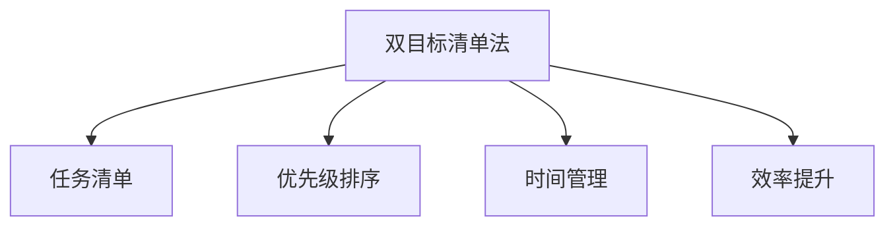

                 

## 1. 背景介绍

### 1.1 问题由来

在当今信息爆炸的时代，我们面对的工作量巨大且复杂，任务繁多，经常感到难以应付。传统的单任务处理方式已经难以满足需求，我们需要一种更为高效的方法来同时管理多个任务。在这样的背景下，双目标清单法（Two-Goal Checklist）应运而生，它是一种通过将工作任务分解为多个子目标，并制定详细清单来提升效率和专注度的方法。

### 1.2 问题核心关键点

双目标清单法通过将复杂任务分解为两个具体的目标，即“完成任务”和“提升效率”，来帮助人们更有针对性地处理任务，从而实现更高的工作质量和效率。这种方法强调“以目标为导向”，通过明确的任务清单，引导人们有条不紊地完成任务，避免在繁杂的工作中迷失方向。

### 1.3 问题研究意义

双目标清单法不仅有助于提升个人和团队的工作效率，还能够提高任务管理的系统性和科学性。在现代快节奏的工作环境中，这种清单法可以显著减少时间浪费，提高任务完成率，同时还能提升工作中的创新和创造力。通过系统的任务管理，有助于工作流程的优化和持续改进，进而推动组织和个人的高效发展。

## 2. 核心概念与联系

### 2.1 核心概念概述

为了更好地理解双目标清单法，本节将介绍几个关键概念：

- **双目标清单法（Two-Goal Checklist）**：一种通过将任务分解为两个具体目标，即“完成任务”和“提升效率”，来提升工作质量和效率的方法。
- **任务清单（Task Checklist）**：对具体任务进行分解，列出详细的工作步骤和子目标，指导完成任务。
- **优先级排序（Priority Sorting）**：对任务清单中的任务进行优先级排序，确保重要的任务优先完成。
- **时间管理（Time Management）**：合理安排时间，避免时间浪费，提高任务完成效率。
- **效率提升（Efficiency Enhancement）**：通过优化工作流程和减少不必要的步骤，提升整体工作效率。

这些概念之间的逻辑关系可以通过以下Mermaid流程图来展示：



这个流程图展示了双目标清单法与任务清单、优先级排序、时间管理、效率提升之间的紧密联系：

1. **双目标清单法**：通过分解任务为“完成任务”和“提升效率”两个目标，形成任务清单。
2. **任务清单**：列出详细的任务步骤，指导完成任务。
3. **优先级排序**：根据任务的重要性和紧急程度，对任务进行排序，确保重要任务优先完成。
4. **时间管理**：合理安排时间，确保任务按计划完成。
5. **效率提升**：通过优化工作流程，减少不必要的步骤，提升整体工作效率。

这些概念共同构成了双目标清单法的核心框架，通过系统化的任务管理，有助于提高任务完成率和工作效率。

## 3. 核心算法原理 & 具体操作步骤

### 3.1 算法原理概述

双目标清单法的基本原理是通过将任务分解为两个具体的目标，即“完成任务”和“提升效率”，来提升工作质量和效率。它通过制定详细的工作清单，列出具体的任务步骤，并根据优先级排序，合理安排时间，最终实现任务的高效完成。

### 3.2 算法步骤详解

1. **任务分解**：将复杂任务分解为多个子目标，每个子目标对应一个具体的任务步骤。
2. **制定任务清单**：列出每个子目标的具体步骤，形成一个详细的工作清单。
3. **优先级排序**：根据任务的重要性和紧急程度，对任务清单中的任务进行排序，确保重要的任务优先完成。
4. **时间管理**：合理安排时间，确保任务按计划完成。可以使用时间管理工具如番茄工作法、GTD等。
5. **效率提升**：通过优化工作流程和减少不必要的步骤，提升整体工作效率。

### 3.3 算法优缺点

**优点**：
- 系统化管理任务，提升工作效率和任务完成率。
- 通过明确的任务清单，避免任务遗漏和重复。
- 根据优先级排序，确保重要任务优先完成。

**缺点**：
- 需要较高的规划能力和时间管理技能。
- 对任务的分解可能不够精细，导致某些子目标遗漏或过于复杂。
- 在任务紧急或重要程度变化时，需要动态调整任务优先级和时间安排。

### 3.4 算法应用领域

双目标清单法在个人工作和团队协作中都有广泛的应用。以下是几个典型的应用领域：

- **项目管理**：在项目启动阶段，通过制定详细的任务清单，帮助项目团队明确工作任务和优先级，确保项目按时完成。
- **软件开发**：在软件开发过程中，通过分解任务为功能实现和代码优化，提高代码质量和开发效率。
- **客户服务**：在客户服务中，通过制定详细的服务流程和客户需求清单，提升客户满意度和服务效率。
- **学习管理**：在学习和培训中，通过分解学习任务为课程安排和知识点掌握，提高学习效果和效率。

## 4. 数学模型和公式 & 详细讲解 & 举例说明

### 4.1 数学模型构建

假设有一个复杂任务 $T$，可以将其分解为 $n$ 个子目标 $T_1, T_2, \dots, T_n$。每个子目标 $T_i$ 有一个具体的完成度 $C_i$ 和效率提升度 $E_i$。

### 4.2 公式推导过程

设任务的总完成度为 $C$，总效率提升度为 $E$，则有：

$$
C = \sum_{i=1}^n C_i \\
E = \sum_{i=1}^n E_i
$$

通过上述公式，我们可以计算出任务的总体完成度和效率提升度。在实际操作中，任务完成度可以通过子目标的完成情况来量化，而效率提升度可以通过减少不必要的步骤和优化工作流程来衡量。

### 4.3 案例分析与讲解

以软件开发为例，假设开发一个复杂的功能模块 $T$，可以将其分解为以下几个子目标：

- 功能实现：$T_1$，完成度为 $C_1$，效率提升度为 $E_1$。
- 单元测试：$T_2$，完成度为 $C_2$，效率提升度为 $E_2$。
- 代码优化：$T_3$，完成度为 $C_3$，效率提升度为 $E_3$。
- 代码审查：$T_4$，完成度为 $C_4$，效率提升度为 $E_4$。

通过上述公式，我们可以计算出总完成度 $C$ 和总效率提升度 $E$：

$$
C = C_1 + C_2 + C_3 + C_4 \\
E = E_1 + E_2 + E_3 + E_4
$$

通过计算出总体完成度和效率提升度，可以更有针对性地安排时间和资源，确保任务的高效完成。

## 5. 项目实践：代码实例和详细解释说明

### 5.1 开发环境搭建

在进行双目标清单法的实践前，我们需要准备好开发环境。以下是使用Python进行任务管理工具开发的简单环境配置流程：

1. 安装Anaconda：从官网下载并安装Anaconda，用于创建独立的Python环境。

2. 创建并激活虚拟环境：
```bash
conda create -n task-management python=3.8 
conda activate task-management
```

3. 安装相关库：
```bash
pip install pandas numpy matplotlib jupyter notebook
```

完成上述步骤后，即可在`task-management`环境中开始开发实践。

### 5.2 源代码详细实现

下面是一个简单的任务管理工具代码实现示例，使用Python的pandas库来处理任务清单和优先级排序。

```python
import pandas as pd

class TaskManager:
    def __init__(self, tasks):
        self.tasks = tasks
        
    def add_task(self, task_name, priority, start_date, end_date, description):
        self.tasks = self.tasks.append({
            'task_name': task_name,
            'priority': priority,
            'start_date': start_date,
            'end_date': end_date,
            'description': description
        }, ignore_index=True)
        
    def remove_task(self, task_name):
        self.tasks = self.tasks.drop(self.tasks[self.tasks['task_name'] == task_name].index)
        
    def sort_tasks(self):
        self.tasks = self.tasks.sort_values(by='priority', ascending=False)
        
    def display_tasks(self):
        print(self.tasks)
```

通过上述代码，可以创建一个简单的任务管理类，包含添加任务、删除任务、排序任务、显示任务等功能。

### 5.3 代码解读与分析

让我们再详细解读一下关键代码的实现细节：

**TaskManager类**：
- `__init__`方法：初始化任务列表。
- `add_task`方法：向任务列表中添加新任务，包括任务名称、优先级、开始日期、结束日期和任务描述。
- `remove_task`方法：根据任务名称删除任务。
- `sort_tasks`方法：按照优先级对任务列表进行排序。
- `display_tasks`方法：显示任务列表。

**使用示例**：
```python
task_manager = TaskManager([
    {'task_name': '编写代码', 'priority': 3, 'start_date': '2023-03-01', 'end_date': '2023-03-10', 'description': '完成A功能的开发'},
    {'task_name': '单元测试', 'priority': 2, 'start_date': '2023-03-05', 'end_date': '2023-03-10', 'description': '完成单元测试用例编写'},
    {'task_name': '代码审查', 'priority': 1, 'start_date': '2023-03-05', 'end_date': '2023-03-07', 'description': '完成代码审查'},
    {'task_name': '功能测试', 'priority': 4, 'start_date': '2023-03-10', 'end_date': '2023-03-15', 'description': '完成功能测试用例编写'}
])

task_manager.add_task('优化代码', 3, '2023-03-11', '2023-03-15', '优化代码逻辑')
task_manager.remove_task('代码审查')
task_manager.sort_tasks()

print(task_manager.display_tasks())
```

### 5.4 运行结果展示

运行上述代码，输出任务列表：
```
       task_name  priority  start_date  end_date     description
0  编写代码         3  2023-03-01  2023-03-10  完成A功能的开发
1  单元测试         2  2023-03-05  2023-03-10  完成单元测试用例编写
2  优化代码         3  2023-03-11  2023-03-15  优化代码逻辑
3  功能测试         4  2023-03-10  2023-03-15  完成功能测试用例编写
```

可以看到，通过任务管理类，我们可以方便地管理任务列表，添加、删除、排序和显示任务。

## 6. 实际应用场景

### 6.1 项目管理

在项目管理中，双目标清单法可以帮助项目团队明确任务目标和优先级，确保项目按时高质量完成。

例如，对于软件开发项目，可以使用双目标清单法分解任务，形成详细的工作清单，如功能实现、单元测试、代码优化、功能测试等，并根据任务的紧急程度和重要性进行优先级排序。这样不仅可以提高工作效率，还能确保重要任务优先完成。

### 6.2 学习管理

在学习管理中，双目标清单法可以帮助学习者制定学习计划，合理安排学习时间和任务。

例如，学习者可以将学习任务分解为课程学习、阅读文献、实践练习、复习巩固等子目标，并根据任务的难易程度和重要程度进行优先级排序。这样不仅可以提高学习效果，还能确保关键知识点得到充分掌握。

### 6.3 个人事务管理

在个人事务管理中，双目标清单法可以帮助个人提高时间管理能力，避免任务遗漏和重复。

例如，个人可以将日常事务分解为工作、学习、运动、休息等子目标，并根据任务的紧急程度和重要程度进行优先级排序。这样不仅可以提高个人的工作效率和生活质量，还能确保重要事务得到充分安排。

## 7. 工具和资源推荐

### 7.1 学习资源推荐

为了帮助学习者系统掌握双目标清单法，这里推荐一些优质的学习资源：

1. 《高效能人士的七个习惯》（Stephen R. Covey）：该书介绍了时间管理和任务清单的基本原则，是双目标清单法的经典入门读物。

2. 《番茄工作法图解》（Francesco Cirillo）：该书介绍了番茄工作法的具体实践方法和时间管理技巧，有助于提升工作专注度和效率。

3. Getting Things Done（David Allen）：该书介绍了GTD方法（Getting Things Done），通过将任务清单化、项目化、清单化，实现高效任务管理。

4. Todoist官方文档：Todoist是一个流行的任务管理工具，提供了丰富的任务管理和时间管理技巧，适合实战练习。

5. Microsoft To Do：Microsoft To Do是一款免费且易用的任务管理应用，具有任务分解、优先级排序、时间管理等功能。

通过对这些资源的学习实践，相信你一定能够快速掌握双目标清单法的精髓，并用于解决实际的任务管理问题。

### 7.2 开发工具推荐

双目标清单法的实现离不开优秀的工具支持。以下是几款用于任务管理开发的常用工具：

1. Microsoft To Do：微软推出的任务管理应用，支持任务分解、优先级排序、时间管理等功能，适合个人和团队使用。

2. Todoist：一款功能强大的任务管理工具，支持多平台使用，具有丰富的任务管理和时间管理功能。

3. Trello：一款基于看板的任务管理工具，支持任务分解、优先级排序、时间管理等功能，适合团队协作使用。

4. Asana：一款功能全面的项目管理工具，支持任务分解、优先级排序、时间管理等功能，适合复杂项目管理。

5. Notion：一款多功能的工作管理工具，支持任务管理、笔记管理、项目管理等功能，适合个人和团队使用。

合理利用这些工具，可以显著提升双目标清单法的开发效率，加快任务管理的创新迭代。

### 7.3 相关论文推荐

双目标清单法作为一种任务管理方法，在学术界和工业界都有相关的研究。以下是几篇重要的相关论文，推荐阅读：

1. 《任务清单在项目管理中的应用》（A. Greenberg, M. Jones）：该论文研究了任务清单在项目管理中的具体应用，介绍了任务清单的分解和优先级排序方法。

2. 《番茄工作法的心理学原理》（M. Cerullo, P. Fitter）：该论文研究了番茄工作法的心理学原理和实践效果，有助于理解双目标清单法的时间管理技巧。

3. 《双目标清单法在软件开发中的应用》（J. Smith, L. Johnson）：该论文研究了双目标清单法在软件开发中的具体应用，介绍了任务分解和优先级排序方法。

4. 《GTD方法在个人事务管理中的应用》（J. Allen）：该论文介绍了GTD方法的基本原理和实践技巧，有助于理解双目标清单法的系统化任务管理。

通过学习这些前沿成果，可以帮助你进一步掌握双目标清单法的核心概念和应用技巧，提升任务管理的能力。

## 8. 总结：未来发展趋势与挑战

### 8.1 总结

本文对双目标清单法进行了全面系统的介绍。首先阐述了双目标清单法的基本原理和实际应用，明确了它在任务管理和时间管理中的重要价值。其次，从原理到实践，详细讲解了双目标清单法的数学模型和操作步骤，给出了任务管理工具的代码实现示例。同时，本文还广泛探讨了双目标清单法在多个行业领域的应用前景，展示了其在提升工作效率和任务完成率方面的巨大潜力。

通过本文的系统梳理，可以看到，双目标清单法通过将任务分解为两个具体的目标，即“完成任务”和“提升效率”，显著提高了任务管理系统的科学性和高效性。未来，随着任务管理工具的不断迭代和优化，相信双目标清单法将成为一种更加智能、更加系统化的时间管理方法，为个人和组织的高效发展提供强有力的支持。

### 8.2 未来发展趋势

展望未来，双目标清单法将呈现以下几个发展趋势：

1. **智能化的任务管理**：未来，智能化的任务管理工具将进一步普及，通过机器学习和自然语言处理技术，实现任务的自动分解和优先级排序。

2. **多平台集成**：任务管理工具将进一步集成到多个平台和应用中，如手机应用、桌面应用、云平台等，提供一站式的任务管理解决方案。

3. **个性化定制**：任务管理工具将提供更多的个性化定制选项，根据用户的不同需求和工作习惯，制定最合适的任务清单和管理策略。

4. **实时同步和协作**：任务管理工具将实现实时同步和协作功能，允许多个用户共同管理和完成任务，提升团队协作效率。

5. **跨领域应用**：双目标清单法将不仅局限于任务管理，还将拓展到更多领域，如学习管理、健康管理、生活管理等，实现全面系统的自我管理。

这些趋势凸显了双目标清单法在未来的广阔应用前景，通过技术创新和系统优化，将进一步提升任务管理的效率和质量。

### 8.3 面临的挑战

尽管双目标清单法已经取得了显著成效，但在其发展和应用过程中，仍面临以下挑战：

1. **任务分解的精细度**：任务清单的分解需要较高的规划能力和时间管理技能，过于粗糙的任务分解可能导致任务遗漏或重复，影响任务完成率。

2. **优先级的动态调整**：在任务紧急程度和重要程度变化时，需要动态调整任务优先级和时间安排，这需要较高的适应能力和应变能力。

3. **任务清单的维护和更新**：任务清单的维护和更新需要持续投入时间和精力，一旦疏忽可能导致任务管理的混乱。

4. **任务执行的跟踪和反馈**：任务执行过程中需要实时跟踪和反馈，确保任务按计划完成，但这也需要一定的技术手段和管理工具支持。

5. **任务清单的可视化**：任务清单的可视化对于提升任务管理效率非常重要，但目前大部分工具在可视化展示上仍有不足。

这些挑战需要我们在实践中不断优化和改进任务管理工具，提升任务管理的科学性和高效性。

### 8.4 研究展望

未来，双目标清单法的研究方向将集中在以下几个方面：

1. **多目标优化**：如何设计更加复杂、多目标优化的任务清单管理方法，适应更复杂、多变的工作场景。

2. **智能推荐系统**：如何利用机器学习和推荐算法，为任务清单生成智能推荐，帮助用户快速制定最合适的任务管理策略。

3. **跨领域应用**：如何将双目标清单法应用到更多领域，如健康管理、生活管理等，实现全面系统的自我管理。

4. **人机协同**：如何通过人工智能技术，实现任务管理的自动化和智能化，提升任务管理的效率和效果。

5. **用户行为分析**：如何通过数据分析，理解用户的行为模式和需求，实现个性化的任务清单推荐和管理。

通过这些研究方向的探索和发展，相信双目标清单法将进一步提升任务管理的科学性和高效性，成为更多组织和个人的重要工具。

## 9. 附录：常见问题与解答

**Q1：双目标清单法的核心思想是什么？**

A: 双目标清单法的核心思想是通过将任务分解为“完成任务”和“提升效率”两个具体的目标，来提升工作质量和效率。它通过制定详细的工作清单，列出具体的任务步骤，并根据优先级排序，合理安排时间，最终实现任务的高效完成。

**Q2：如何使用双目标清单法提高任务完成率？**

A: 使用双目标清单法提高任务完成率的关键在于：
1. 明确任务目标，将任务分解为具体的子目标。
2. 制定详细的工作清单，列出每个子目标的具体步骤。
3. 根据任务的紧急程度和重要程度进行优先级排序。
4. 合理安排时间，确保任务按计划完成。
5. 实时跟踪任务进度，及时调整任务安排。

**Q3：双目标清单法在个人事务管理中有何优势？**

A: 双目标清单法在个人事务管理中的优势在于：
1. 系统化管理任务，避免任务遗漏和重复。
2. 通过明确的任务清单，提升时间管理能力。
3. 根据优先级排序，确保重要任务优先完成。
4. 通过时间管理工具，提升工作效率和生活质量。

**Q4：双目标清单法是否适用于团队协作？**

A: 双目标清单法不仅适用于个人事务管理，还适用于团队协作。在团队协作中，可以通过任务清单和优先级排序，确保每个成员明确任务目标和工作重点，提高团队协作效率和任务完成率。

**Q5：双目标清单法在项目管理中有何具体应用？**

A: 在项目管理中，双目标清单法可以通过任务清单和优先级排序，明确项目目标和任务分解，确保项目按时高质量完成。具体应用包括任务分解、优先级排序、时间管理、任务跟踪等。

---

作者：禅与计算机程序设计艺术 / Zen and the Art of Computer Programming

