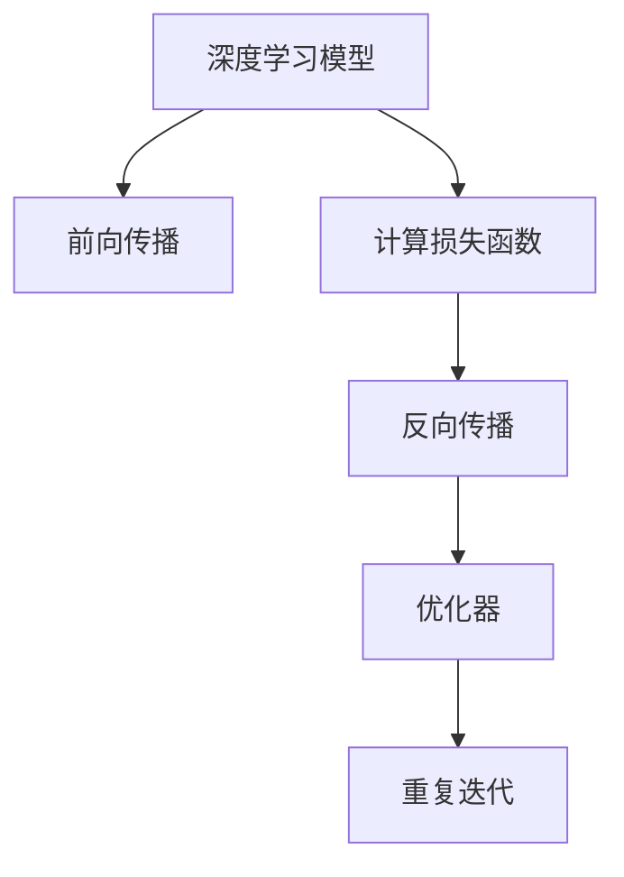

                 

# 反向传播算法详解：深度学习的核心

> 关键词：反向传播,梯度下降,深度学习,损失函数,激活函数,神经网络,优化器

## 1. 背景介绍

### 1.1 问题由来

深度学习是当前人工智能领域最为热门的研究方向之一。它通过构建多层次的神经网络结构，对数据进行逐层抽象，并以此为基础进行分类、回归、聚类等各种任务。这种模型结构具有很强的泛化能力和自适应能力，可以处理非常复杂的数据模式，因此在图像识别、语音识别、自然语言处理等众多领域取得了突破性的进展。

然而，尽管深度学习模型在理论和实践上都有显著的进步，但在训练过程中仍存在一些关键问题。例如，如何高效地更新模型参数，使得模型在大量数据上进行训练时仍能有效收敛，并获得最优的性能表现。这一问题正是反向传播算法所要解决的核心。

### 1.2 问题核心关键点

反向传播算法是深度学习模型中的一种关键算法，用于更新模型参数，最小化损失函数。其核心思想是利用链式法则，对模型输出与损失函数之间的梯度进行反向传递，并通过梯度下降等优化算法，更新模型的参数，使得模型输出逼近真实值。

反向传播算法的大致流程如下：
1. 前向传播：将输入数据通过神经网络，计算出最终的输出结果。
2. 计算损失函数：将输出结果与真实值进行比较，计算损失函数的值。
3. 反向传播：利用链式法则，将损失函数对各个参数的梯度反向传递回去，更新模型参数。
4. 重复迭代：多次重复上述步骤，直至模型收敛。

反向传播算法的高效性和通用性，使得其成为了深度学习模型训练的核心算法之一。但如何优化反向传播算法的各个环节，仍然是一个值得深入研究的问题。

## 2. 核心概念与联系

### 2.1 核心概念概述

为更好地理解反向传播算法，本节将介绍几个密切相关的核心概念：

- **深度学习模型（Deep Learning Model）**：由多个层次的神经元组成的模型结构，通过逐层抽象学习数据的高层次特征。
- **神经网络（Neural Network）**：深度学习模型的主要组成部分，由输入层、隐藏层和输出层组成，通过连接权重实现数据传递和特征提取。
- **损失函数（Loss Function）**：用于衡量模型输出与真实值之间的差异，通常为均方误差、交叉熵等。
- **激活函数（Activation Function）**：对神经元输出进行非线性变换的函数，如ReLU、Sigmoid、Tanh等。
- **优化器（Optimizer）**：用于更新模型参数的算法，如SGD、Adam、Adagrad等。
- **反向传播（Backpropagation）**：通过链式法则将损失函数对模型参数的梯度反向传递，并根据优化器进行参数更新。

这些核心概念之间的逻辑关系可以通过以下Mermaid流程图来展示：



这个流程图展示了大语言模型的核心概念及其之间的关系：

1. 深度学习模型通过前向传播计算输出结果。
2. 损失函数用于评估输出结果与真实值之间的差异。
3. 反向传播算法将损失函数的梯度反向传递，用于更新模型参数。
4. 通过优化器进行参数更新，并重复迭代，直至模型收敛。

这些概念共同构成了深度学习模型的训练框架，使得模型能够从数据中学习到复杂的特征表示，并通过不断优化提高性能。

## 3. 核心算法原理 & 具体操作步骤
### 3.1 算法原理概述

反向传播算法是一种基于梯度下降的优化算法，其核心思想是通过链式法则计算损失函数对模型参数的梯度，并利用梯度下降更新模型参数，使得模型输出逼近真实值。

具体来说，反向传播算法的计算过程如下：
1. 前向传播：输入数据通过神经网络，计算出最终的输出结果。
2. 计算损失函数：将输出结果与真实值进行比较，计算损失函数的值。
3. 反向传播：利用链式法则，将损失函数对各个参数的梯度反向传递回去，更新模型参数。
4. 重复迭代：多次重复上述步骤，直至模型收敛。

反向传播算法的核心是链式法则，它通过将损失函数对各个参数的梯度进行反向传递，使得每一层参数的更新都基于上一层的梯度信息，从而实现全局最优解的求解。

### 3.2 算法步骤详解

以下是反向传播算法的基本步骤：

**Step 1: 定义模型结构**

首先，需要定义神经网络的模型结构，包括输入层、隐藏层和输出层，以及各层之间的连接权重和激活函数。例如，一个简单的全连接神经网络可以表示为：

$$
\begin{aligned}
&h_1 = W_1x + b_1 \\
&h_2 = W_2h_1 + b_2 \\
&y = W_3h_2 + b_3
\end{aligned}
$$

其中 $x$ 为输入数据，$h_1, h_2$ 为隐藏层的输出，$y$ 为最终输出，$W_1, W_2, W_3$ 为连接权重，$b_1, b_2, b_3$ 为偏置项，$x, y$ 为向量，$W, b$ 为矩阵和向量。

**Step 2: 定义损失函数**

损失函数用于衡量模型输出与真实值之间的差异，通常是均方误差、交叉熵等。例如，二分类任务的交叉熵损失函数可以表示为：

$$
L(y, \hat{y}) = -\frac{1}{N}\sum_{i=1}^N[y_i\log \hat{y}_i + (1-y_i)\log (1-\hat{y}_i)]
$$

其中 $y, \hat{y}$ 分别为真实值和模型预测值，$N$ 为样本数量。

**Step 3: 前向传播**

前向传播过程用于计算模型输出。例如，对于一个简单的全连接神经网络，前向传播过程可以表示为：

$$
\begin{aligned}
&h_1 = W_1x + b_1 \\
&h_2 = W_2h_1 + b_2 \\
&y = W_3h_2 + b_3
\end{aligned}
$$

其中 $x$ 为输入数据，$h_1, h_2$ 为隐藏层的输出，$y$ 为最终输出，$W_1, W_2, W_3$ 为连接权重，$b_1, b_2, b_3$ 为偏置项，$x, y$ 为向量，$W, b$ 为矩阵和向量。

**Step 4: 反向传播**

反向传播过程用于计算损失函数对各个参数的梯度，并利用梯度下降更新模型参数。例如，对于一个简单的全连接神经网络，反向传播过程可以表示为：

$$
\begin{aligned}
&\frac{\partial L}{\partial W_3} = \frac{\partial L}{\partial y}\frac{\partial y}{\partial h_2}\frac{\partial h_2}{\partial W_3} \\
&\frac{\partial L}{\partial W_2} = \frac{\partial L}{\partial h_2}\frac{\partial h_2}{\partial h_1}\frac{\partial h_1}{\partial W_2} \\
&\frac{\partial L}{\partial W_1} = \frac{\partial L}{\partial h_1}\frac{\partial h_1}{\partial x}\frac{\partial x}{\partial W_1}
\end{aligned}
$$

其中 $\frac{\partial L}{\partial W}$ 为损失函数对权重 $W$ 的梯度，$\frac{\partial y}{\partial h_2}$ 为输出对隐藏层输出的导数，$\frac{\partial h_2}{\partial W_3}$ 为隐藏层输出对权重的导数，$\frac{\partial h_1}{\partial W_2}$ 为隐藏层输出对权重的导数，$\frac{\partial h_1}{\partial x}$ 为隐藏层输出对输入的导数。

**Step 5: 优化器更新参数**

利用反向传播计算得到的梯度，通过优化器更新模型参数。例如，使用Adam优化器更新模型参数的过程可以表示为：

$$
\theta = \theta - \eta \frac{\partial L}{\partial \theta}
$$

其中 $\eta$ 为学习率，$\theta$ 为模型参数。

**Step 6: 重复迭代**

重复上述步骤，直至模型收敛或达到预设的迭代次数。通常，当损失函数的值不再显著下降时，模型即可认为已经收敛。

### 3.3 算法优缺点

反向传播算法具有以下优点：

1. 高效性：通过链式法则，反向传播算法可以高效计算损失函数对各个参数的梯度，使得模型参数的更新具有全局最优性。
2. 通用性：反向传播算法适用于各种类型的神经网络，包括全连接网络、卷积神经网络、循环神经网络等。
3. 可扩展性：反向传播算法的计算过程可以扩展到大规模并行计算环境中，进一步提高计算效率。

同时，反向传播算法也存在一些局限性：

1. 计算复杂度较高：反向传播算法需要计算链式法则中的梯度，计算复杂度较高，特别是在大规模模型上。
2. 数值稳定性问题：链式法则中的梯度传递过程容易出现数值不稳定的现象，导致模型无法收敛。
3. 依赖于优化器选择：不同的优化器对反向传播算法的收敛速度和稳定性有不同的影响。

尽管存在这些局限性，但反向传播算法仍是深度学习模型训练的核心算法之一，广泛应用于各种深度学习任务中。

### 3.4 算法应用领域

反向传播算法在深度学习模型的训练中具有广泛的应用，包括但不限于以下几个领域：

- **图像识别**：通过反向传播算法训练卷积神经网络，实现图像的分类和识别。
- **语音识别**：通过反向传播算法训练循环神经网络，实现语音的转录和识别。
- **自然语言处理**：通过反向传播算法训练长短期记忆网络或变换器，实现语言的翻译、文本生成、问答等任务。
- **游戏智能**：通过反向传播算法训练强化学习模型，实现游戏中的决策和学习。
- **医学诊断**：通过反向传播算法训练神经网络，实现疾病的诊断和预测。

这些应用领域展示了反向传播算法的广泛性和重要性，成为了深度学习模型的基础算法之一。

## 4. 数学模型和公式 & 详细讲解 & 举例说明
### 4.1 数学模型构建

反向传播算法的核心是链式法则，其数学模型可以表示为：

$$
\frac{\partial L}{\partial W} = \frac{\partial L}{\partial y}\frac{\partial y}{\partial h_2}\frac{\partial h_2}{\partial W_3}\frac{\partial W_3}{\partial W}
$$

其中 $W$ 为权重矩阵，$y$ 为输出结果，$h_2$ 为隐藏层输出，$L$ 为损失函数。

通过链式法则，反向传播算法可以高效计算损失函数对各个参数的梯度。

### 4.2 公式推导过程

反向传播算法的核心是链式法则，其公式推导过程如下：

1. 定义损失函数：假设损失函数为 $L(y, \hat{y})$，其中 $y$ 为真实值，$\hat{y}$ 为模型预测值。
2. 计算输出结果：假设模型输出为 $y$，则有 $y = W_3h_2 + b_3$，其中 $h_2$ 为隐藏层输出。
3. 计算梯度：假设隐藏层输出为 $h_2$，则有 $h_2 = W_2h_1 + b_2$，其中 $h_1$ 为输入数据。
4. 反向传播：利用链式法则，计算损失函数对权重 $W_3, W_2, W_1$ 的梯度。

### 4.3 案例分析与讲解

假设一个简单的全连接神经网络，其中 $x$ 为输入数据，$h_1$ 为隐藏层输出，$y$ 为最终输出，$W_1, W_2, W_3$ 为连接权重，$b_1, b_2, b_3$ 为偏置项。则其反向传播算法的计算过程如下：

1. 前向传播：

$$
\begin{aligned}
&h_1 = W_1x + b_1 \\
&h_2 = W_2h_1 + b_2 \\
&y = W_3h_2 + b_3
\end{aligned}
$$

2. 计算损失函数：

$$
L(y, \hat{y}) = -\frac{1}{N}\sum_{i=1}^N[y_i\log \hat{y}_i + (1-y_i)\log (1-\hat{y}_i)]
$$

3. 反向传播：

$$
\begin{aligned}
&\frac{\partial L}{\partial W_3} = \frac{\partial L}{\partial y}\frac{\partial y}{\partial h_2}\frac{\partial h_2}{\partial W_3} \\
&\frac{\partial L}{\partial W_2} = \frac{\partial L}{\partial h_2}\frac{\partial h_2}{\partial h_1}\frac{\partial h_1}{\partial W_2} \\
&\frac{\partial L}{\partial W_1} = \frac{\partial L}{\partial h_1}\frac{\partial h_1}{\partial x}\frac{\partial x}{\partial W_1}
\end{aligned}
$$

其中 $\frac{\partial L}{\partial y}$ 为损失函数对输出的梯度，$\frac{\partial y}{\partial h_2}$ 为输出对隐藏层输出的导数，$\frac{\partial h_2}{\partial W_3}$ 为隐藏层输出对权重的导数，$\frac{\partial h_1}{\partial W_2}$ 为隐藏层输出对权重的导数，$\frac{\partial h_1}{\partial x}$ 为隐藏层输出对输入的导数。

4. 优化器更新参数：

$$
\begin{aligned}
&\theta_1 = \theta_1 - \eta \frac{\partial L}{\partial W_1} \\
&\theta_2 = \theta_2 - \eta \frac{\partial L}{\partial W_2} \\
&\theta_3 = \theta_3 - \eta \frac{\partial L}{\partial W_3}
\end{aligned}
$$

其中 $\theta_1, \theta_2, \theta_3$ 为权重矩阵和偏置项，$\eta$ 为学习率。

## 5. 项目实践：代码实例和详细解释说明
### 5.1 开发环境搭建

在进行反向传播算法实践前，我们需要准备好开发环境。以下是使用Python进行PyTorch开发的环境配置流程：

1. 安装Anaconda：从官网下载并安装Anaconda，用于创建独立的Python环境。

2. 创建并激活虚拟环境：
```bash
conda create -n pytorch-env python=3.8 
conda activate pytorch-env
```

3. 安装PyTorch：根据CUDA版本，从官网获取对应的安装命令。例如：
```bash
conda install pytorch torchvision torchaudio cudatoolkit=11.1 -c pytorch -c conda-forge
```

4. 安装Transformers库：
```bash
pip install transformers
```

5. 安装各类工具包：
```bash
pip install numpy pandas scikit-learn matplotlib tqdm jupyter notebook ipython
```

完成上述步骤后，即可在`pytorch-env`环境中开始反向传播算法的实践。

### 5.2 源代码详细实现

下面我们以MNIST手写数字识别任务为例，给出使用PyTorch实现反向传播算法的代码。

首先，定义网络结构：

```python
import torch.nn as nn
import torch.nn.functional as F

class Net(nn.Module):
    def __init__(self):
        super(Net, self).__init__()
        self.fc1 = nn.Linear(784, 256)
        self.fc2 = nn.Linear(256, 10)
        
    def forward(self, x):
        x = x.view(-1, 784)
        x = F.relu(self.fc1(x))
        x = F.softmax(self.fc2(x), dim=1)
        return x
```

然后，定义损失函数和优化器：

```python
import torch
import torch.optim as optim

net = Net()
criterion = nn.CrossEntropyLoss()
optimizer = optim.Adam(net.parameters(), lr=0.001)
```

接着，定义训练和评估函数：

```python
def train(model, train_loader, optimizer, device):
    model.train()
    train_loss = 0
    for data, target in train_loader:
        data, target = data.to(device), target.to(device)
        optimizer.zero_grad()
        output = model(data)
        loss = criterion(output, target)
        loss.backward()
        optimizer.step()
        train_loss += loss.item()
    return train_loss / len(train_loader)

def test(model, test_loader, device):
    model.eval()
    test_loss = 0
    correct = 0
    with torch.no_grad():
        for data, target in test_loader:
            data, target = data.to(device), target.to(device)
            output = model(data)
            test_loss += criterion(output, target).item()
            pred = output.argmax(dim=1, keepdim=True)
            correct += pred.eq(target.view_as(pred)).sum().item()
    return test_loss / len(test_loader), correct / len(test_loader.dataset)

```

最后，启动训练流程并在测试集上评估：

```python
device = torch.device("cuda" if torch.cuda.is_available() else "cpu")

train_loader = torch.utils.data.DataLoader(train_data, batch_size=64, shuffle=True)
test_loader = torch.utils.data.DataLoader(test_data, batch_size=64, shuffle=False)

for epoch in range(10):
    train_loss = train(net, train_loader, optimizer, device)
    test_loss, accuracy = test(net, test_loader, device)
    print(f"Epoch {epoch+1}, train loss: {train_loss:.3f}, test loss: {test_loss:.3f}, accuracy: {accuracy:.3f}")
```

以上就是使用PyTorch实现反向传播算法的完整代码实现。可以看到，得益于PyTorch的封装，我们可以用相对简洁的代码完成反向传播算法的实现。

### 5.3 代码解读与分析

让我们再详细解读一下关键代码的实现细节：

**Net类**：
- `__init__`方法：定义网络结构，包含全连接层。
- `forward`方法：前向传播过程，通过连接权重和激活函数计算输出结果。

**训练和评估函数**：
- 训练函数 `train`：在训练集上前向传播计算损失函数，反向传播更新模型参数。
- 评估函数 `test`：在测试集上前向传播计算损失函数，评估模型性能。

**训练流程**：
- 定义总的epoch数和batch size，开始循环迭代
- 每个epoch内，在训练集上训练，输出平均loss
- 在测试集上评估，输出测试结果

可以看到，PyTorch配合TensorFlow库使得反向传播算法的实现变得简洁高效。开发者可以将更多精力放在数据处理、模型改进等高层逻辑上，而不必过多关注底层的实现细节。

当然，工业级的系统实现还需考虑更多因素，如模型的保存和部署、超参数的自动搜索、更灵活的任务适配层等。但核心的反向传播范式基本与此类似。

## 6. 实际应用场景
### 6.1 机器学习竞赛

在机器学习竞赛中，反向传播算法被广泛应用于构建和优化深度学习模型。例如，Kaggle中的图像分类、文本分类、推荐系统等竞赛，常常使用反向传播算法训练卷积神经网络、长短期记忆网络等模型，通过不断调整模型参数和优化算法，争取获得最优的模型性能。

### 6.2 自动驾驶

在自动驾驶领域，反向传播算法被用于训练神经网络模型，实现车辆的视觉识别、路径规划、决策制定等功能。通过反向传播算法训练的模型，能够实时处理复杂的交通场景，实现智能驾驶。

### 6.3 医疗影像分析

在医疗影像分析中，反向传播算法被用于训练神经网络模型，实现疾病的早期筛查、病理诊断等功能。通过反向传播算法训练的模型，能够对医疗影像进行高效准确的分析，提升医疗服务水平。

### 6.4 未来应用展望

随着反向传播算法的不断发展，其将在更多领域得到应用，为深度学习技术带来新的突破。

在智慧医疗领域，反向传播算法将用于构建医疗影像分析、疾病预测等模型，辅助医生进行精准诊疗，提升医疗服务质量。

在智能教育领域，反向传播算法将用于构建个性化推荐、智能评估等模型，因材施教，提升教学质量。

在智慧城市治理中，反向传播算法将用于构建城市事件监测、舆情分析等模型，提高城市管理的自动化和智能化水平，构建更安全、高效的未来城市。

此外，在企业生产、社会治理、文娱传媒等众多领域，反向传播算法也将不断涌现，为人工智能技术带来新的应用场景，推动社会的数字化转型。

## 7. 工具和资源推荐
### 7.1 学习资源推荐

为了帮助开发者系统掌握反向传播算法的理论基础和实践技巧，这里推荐一些优质的学习资源：

1. 《深度学习》书籍：由Ian Goodfellow、Yoshua Bengio和Aaron Courville合著，全面介绍了深度学习的基本概念和算法，包括反向传播算法。

2. CS231n《卷积神经网络》课程：斯坦福大学开设的计算机视觉课程，涵盖深度学习的基础知识和卷积神经网络等内容，包括反向传播算法的应用。

3. Deep Learning Specialization系列课程：由Andrew Ng主讲的深度学习课程，涵盖了反向传播算法、神经网络、优化器等内容，适合初学者学习。

4. PyTorch官方文档：PyTorch的官方文档，提供了丰富的学习资源和实践样例，包括反向传播算法的详细解释和代码实现。

5. TensorFlow官方文档：TensorFlow的官方文档，提供了深度学习模型的构建和优化方法，包括反向传播算法的应用。

通过对这些资源的学习实践，相信你一定能够快速掌握反向传播算法的精髓，并用于解决实际的深度学习问题。

### 7.2 开发工具推荐

高效的开发离不开优秀的工具支持。以下是几款用于反向传播算法开发的常用工具：

1. PyTorch：基于Python的开源深度学习框架，灵活动态的计算图，适合快速迭代研究。大多数深度学习模型都有PyTorch版本的实现。

2. TensorFlow：由Google主导开发的开源深度学习框架，生产部署方便，适合大规模工程应用。同样有丰富的深度学习模型资源。

3. Keras：由François Chollet开发的深度学习框架，提供了简洁易用的API，适合快速构建和训练深度学习模型。

4. Theano：由蒙特利尔大学开发的深度学习框架，适合高性能计算，但已被TensorFlow和PyTorch取代。

5. MXNet：由亚马逊开发的深度学习框架，支持多种编程语言和硬件平台，适合分布式计算。

合理利用这些工具，可以显著提升反向传播算法的开发效率，加快创新迭代的步伐。

### 7.3 相关论文推荐

反向传播算法在深度学习模型的训练中具有重要地位，相关论文的研究也在不断深入。以下是几篇奠基性的相关论文，推荐阅读：

1. Deep Learning：Ian Goodfellow、Yoshua Bengio和Aaron Courville合著的深度学习经典教材，详细介绍了深度学习的基本概念和算法，包括反向传播算法。

2. Backpropagation through time: what it does and how to do it efficiently：由Graves等人提出的时间反向传播算法，用于训练循环神经网络，是深度学习领域的重要突破。

3. Efficient Backprop：由LeCun、Bengio、Hinton等人提出的反向传播算法的高效实现方法，使得深度学习模型能够在大规模数据上进行训练。

4. Accelerating Deep Network Training using Projected Gradients：由Ruder等人提出的投影梯度算法，用于加速深度学习模型的训练。

5. Sparse Backpropagation for Convolutional Networks：由Sutskever等人提出的稀疏反向传播算法，用于加速卷积神经网络的训练。

这些论文代表了大语言模型反向传播算法的进步，通过学习这些前沿成果，可以帮助研究者更好地理解反向传播算法的原理和应用。

## 8. 总结：未来发展趋势与挑战

### 8.1 总结

本文对反向传播算法进行了全面系统的介绍。首先阐述了反向传播算法的背景和意义，明确了其在深度学习模型训练中的核心地位。其次，从原理到实践，详细讲解了反向传播算法的数学原理和操作步骤，给出了反向传播算法的完整代码实现。同时，本文还广泛探讨了反向传播算法在机器学习竞赛、自动驾驶、医疗影像分析等多个领域的应用前景，展示了其广泛性和重要性。此外，本文精选了反向传播算法的各类学习资源，力求为读者提供全方位的技术指引。

通过本文的系统梳理，可以看到，反向传播算法作为深度学习模型的核心算法之一，具有极高的重要性和实用性。它通过链式法则高效计算损失函数对模型参数的梯度，使得模型参数的更新具有全局最优性，是深度学习模型的基础。未来，随着反向传播算法的不断发展和优化，必将进一步提升深度学习模型的性能和应用范围，为人工智能技术的落地应用提供更强大的技术支持。

### 8.2 未来发展趋势

展望未来，反向传播算法将呈现以下几个发展趋势：

1. 更高效的分层训练方法：通过引入分层训练、预训练等技术，进一步优化反向传播算法的训练过程，提高训练效率。

2. 更稳定的数值计算方法：通过引入数值稳定化技术，如BatchNorm、残差连接等，提高反向传播算法的数值稳定性，避免模型无法收敛。

3. 更灵活的模型结构设计：通过引入更灵活的模型结构设计，如残差网络、自注意力机制等，提高反向传播算法的可扩展性和泛化能力。

4. 更智能的超参数优化：通过引入智能优化算法，如神经网络优化器、进化算法等，提高反向传播算法的超参数优化效率，加速模型收敛。

5. 更普适的模型融合方法：通过引入模型融合、迁移学习等技术，提高反向传播算法的鲁棒性和泛化能力，适应更广泛的实际应用场景。

6. 更完善的模型训练监控：通过引入模型训练监控工具，如TensorBoard、Weights & Biases等，实时监控模型训练过程，确保模型能够快速收敛。

以上趋势凸显了反向传播算法的广阔前景，展示了其在深度学习模型训练中的重要地位。这些方向的探索发展，必将进一步提升反向传播算法的性能和应用范围，为人工智能技术的落地应用提供更强大的技术支持。

### 8.3 面临的挑战

尽管反向传播算法在深度学习模型训练中具有重要地位，但在迈向更加智能化、普适化应用的过程中，它仍面临着诸多挑战：

1. 计算资源需求高：反向传播算法需要大量的计算资源进行模型训练，对于大规模深度学习模型，往往需要高性能的GPU或TPU等硬件设备。

2. 模型训练时间长：反向传播算法需要多次迭代训练，模型训练时间较长，难以满足实时性的要求。

3. 模型鲁棒性不足：反向传播算法容易受到数据分布变化的影响，模型鲁棒性有待提高。

4. 模型泛化能力有限：反向传播算法通常依赖大规模标注数据进行训练，对于小样本数据或长尾数据，模型泛化能力有限。

5. 数值计算稳定性差：反向传播算法中的梯度传递过程容易出现数值不稳定的现象，导致模型无法收敛。

6. 模型可解释性不足：反向传播算法中的神经网络模型通常难以解释，难以理解模型的决策过程。

这些挑战凸显了反向传播算法在深度学习模型训练中的复杂性，需要进一步的研究和优化。

### 8.4 研究展望

面对反向传播算法所面临的挑战，未来的研究需要在以下几个方面寻求新的突破：

1. 引入更多优化算法：研究更高效、更稳定的优化算法，如Adam、Adagrad、RMSprop等，以提高反向传播算法的训练效率和数值稳定性。

2. 引入更多训练技巧：研究更有效的模型训练技巧，如学习率调度、正则化、Dropout等，以提高反向传播算法的模型泛化能力和鲁棒性。

3. 引入更多先验知识：研究如何引入更多的先验知识，如知识图谱、逻辑规则等，以提高反向传播算法的模型可解释性和决策能力。

4. 引入更多模型结构：研究更灵活的模型结构设计，如残差网络、自注意力机制等，以提高反向传播算法的模型泛化能力和可扩展性。

5. 引入更多计算资源：研究更高效的计算资源利用技术，如模型压缩、稀疏化存储等，以提高反向传播算法的计算效率和资源利用率。

这些研究方向的探索，必将进一步提升反向传播算法的性能和应用范围，为人工智能技术的落地应用提供更强大的技术支持。

## 9. 附录：常见问题与解答

**Q1：反向传播算法中为什么要进行梯度下降？**

A: 反向传播算法的核心是链式法则，利用梯度下降算法更新模型参数，使得模型输出逼近真实值。梯度下降算法可以高效地计算损失函数对模型参数的梯度，从而优化模型参数，提高模型的性能。

**Q2：反向传播算法中为什么要进行正则化？**

A: 反向传播算法中容易发生过拟合现象，特别是在训练数据较少的情况下。正则化技术可以通过惩罚模型复杂度，防止过拟合，提高模型的泛化能力。

**Q3：反向传播算法中为什么要引入激活函数？**

A: 反向传播算法中的神经网络通常是非线性的，引入激活函数可以增强模型的表达能力，提高模型的泛化能力。

**Q4：反向传播算法中为什么要进行前向传播？**

A: 前向传播过程用于计算模型输出，是反向传播算法的第一步。只有通过前向传播计算出模型输出，才能计算损失函数，并进行反向传播。

**Q5：反向传播算法中为什么要进行反向传播？**

A: 反向传播过程用于计算损失函数对模型参数的梯度，是反向传播算法的核心步骤。只有通过反向传播计算出梯度，才能利用梯度下降算法更新模型参数。

综上所述，反向传播算法是深度学习模型训练的核心算法之一，通过链式法则高效计算损失函数对模型参数的梯度，使得模型参数的更新具有全局最优性。本文对其原理和操作步骤进行了详细讲解，并通过代码实例展示了其在实际应用中的实现。希望通过本文的学习，你能更好地理解反向传播算法的本质，并应用于深度学习模型的训练中。

---

作者：禅与计算机程序设计艺术 / Zen and the Art of Computer Programming

