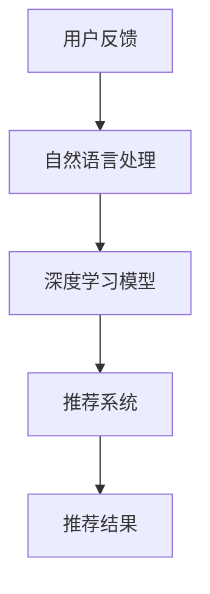
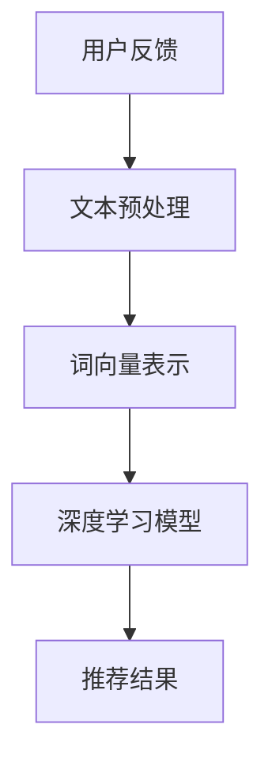

                 

# 基于LLM的推荐系统用户反馈分析

> 关键词：基于LLM的推荐系统,用户反馈分析,用户行为预测,个性化推荐,推荐系统优化,深度学习模型,自然语言处理,推荐算法

## 1. 背景介绍

### 1.1 问题由来

在当今数字化时代，推荐系统已成为各大互联网平台（如Amazon、Netflix、YouTube等）提升用户体验和增加商业收益的重要手段。传统推荐系统主要依赖协同过滤、内容推荐等技术，通过用户行为数据进行推荐。然而，协同过滤等方法存在冷启动问题、难以捕捉用户隐性偏好等局限性，难以应对多样化的推荐需求。

近年来，基于深度学习的推荐系统逐渐兴起。这些系统能够处理大规模非结构化数据，捕捉用户的多维特征和动态行为，提供更加精准的个性化推荐。然而，深度学习模型需要大量的标注数据进行训练，且训练过程复杂，参数调优难度大。因此，如何更高效地训练深度学习推荐模型，是当前研究的重要方向之一。

### 1.2 问题核心关键点

本研究聚焦于如何利用自然语言处理(NLP)技术，对用户的反馈信息进行深度学习模型训练，从而提升推荐系统的效果。具体而言，主要解决以下关键问题：

- 如何高效地从用户反馈中提取有用的特征？
- 如何将用户反馈信息与推荐系统深度模型相结合？
- 如何对推荐模型进行有效优化，提升推荐效果？

## 2. 核心概念与联系

### 2.1 核心概念概述

为更好地理解本研究的技术框架，本节将介绍几个关键概念：

- 基于LLM的推荐系统：利用预训练的自然语言处理大模型（如BERT、GPT等），对用户反馈进行建模，提升推荐系统的性能。

- 用户反馈分析：指从用户行为数据中提取反馈信息，分析用户偏好、需求等，为推荐系统提供决策依据。

- 用户行为预测：通过深度学习模型预测用户未来行为，如点击、购买、评价等，以优化推荐效果。

- 推荐系统：包括协同过滤、基于内容的推荐、混合推荐等，通过用户历史行为数据和物品属性信息，为用户推荐感兴趣的物品。

- 深度学习模型：包括多层神经网络、卷积神经网络、循环神经网络等，能够处理大规模非结构化数据，自动提取特征，提供精准预测。

- 自然语言处理(NLP)：涵盖文本预处理、分词、词向量表示、文本分类等技术，将文本信息转换为模型能够处理的形式。

这些概念之间的联系可通过以下Mermaid流程图展示：



### 2.2 核心概念原理和架构的 Mermaid 流程图



## 3. 核心算法原理 & 具体操作步骤

### 3.1 算法原理概述

本研究的主要目标是构建一个基于自然语言处理大模型的推荐系统，利用用户反馈信息提升推荐效果。具体算法原理如下：

1. 收集用户的反馈信息，如评论、评分等，提取关键特征，进行文本预处理。
2. 利用预训练的自然语言处理大模型（如BERT、GPT等），将用户反馈转换为向量表示。
3. 结合用户历史行为数据，训练深度学习推荐模型，预测用户未来行为。
4. 根据预测结果，为用户推荐感兴趣的物品，并根据推荐效果进行模型优化。

### 3.2 算法步骤详解

#### 3.2.1 数据预处理

1. 数据收集：收集用户反馈数据，如评论、评分等，存储到数据库中。
2. 数据清洗：去除噪声数据、缺失值，进行数据清洗。
3. 特征提取：从用户反馈中提取关键特征，如情感倾向、主题、情感强度等。
4. 文本预处理：对提取的特征进行分词、去停用词、词干提取等操作，转换为模型能够处理的形式。

#### 3.2.2 词向量表示

1. 选择预训练大模型：选择已有的预训练大模型，如BERT、GPT等。
2. 模型微调：在用户反馈数据上进行微调，学习与推荐任务相关的表示。
3. 特征映射：将用户反馈转换为词向量表示，存储到向量空间中。

#### 3.2.3 深度学习模型训练

1. 选择深度学习模型：选择合适的深度学习模型，如多层感知机（MLP）、卷积神经网络（CNN）、循环神经网络（RNN）等。
2. 模型训练：结合用户历史行为数据，对深度学习模型进行训练，学习用户兴趣和物品属性之间的关系。
3. 模型优化：根据推荐效果，调整模型参数，优化模型性能。

#### 3.2.4 推荐系统优化

1. 推荐结果生成：根据深度学习模型的预测结果，为用户推荐感兴趣物品。
2. 反馈信息处理：收集用户对推荐结果的反馈信息，进行后续优化。
3. 模型更新：根据用户反馈信息，对深度学习模型进行更新和优化。

### 3.3 算法优缺点

#### 3.3.1 优点

1. 利用自然语言处理大模型，可以高效地从用户反馈中提取有用的特征，提升推荐系统的性能。
2. 深度学习模型能够处理大规模非结构化数据，自动提取特征，提供精准预测。
3. 推荐系统能够结合用户历史行为数据，提供个性化推荐，提升用户体验。
4. 用户反馈信息能够实时更新，使得推荐系统具有动态性，适应用户需求变化。

#### 3.3.2 缺点

1. 需要大量的标注数据进行模型训练，标注成本较高。
2. 深度学习模型训练过程复杂，参数调优难度大。
3. 模型解释性较弱，难以解释推荐决策过程。
4. 模型泛化能力有限，可能对新领域数据适应性差。

### 3.4 算法应用领域

基于LLM的推荐系统在多个领域具有广泛的应用前景，包括但不限于：

1. 电商平台：根据用户评论和评分，提升商品推荐效果，提高用户满意度。
2. 内容平台：分析用户反馈，提升视频、文章等内容的推荐效果，增加用户粘性。
3. 社交媒体：利用用户反馈信息，推荐相关兴趣的社群和内容，增加用户互动。
4. 金融服务：分析用户评论和评分，提升金融产品的推荐效果，增加用户转化率。
5. 娱乐行业：利用用户反馈信息，推荐电影、音乐等娱乐内容，增加用户参与度。

## 4. 数学模型和公式 & 详细讲解 & 举例说明

### 4.1 数学模型构建

本研究主要利用深度学习模型对用户反馈信息进行建模，构建推荐系统。假设用户反馈为$F=\{f_1, f_2, ..., f_N\}$，其中$f_i$为用户反馈$x_i$对应的特征向量，$x_i$为用户的反馈文本，$F_{dim}$为特征向量维度。推荐系统的目标是最小化推荐误差$\epsilon$，推荐误差定义为预测结果与实际结果的差距，即$\epsilon=R(P)-R(A)$，其中$R$为推荐指标，$P$为模型预测结果，$A$为用户实际选择结果。

### 4.2 公式推导过程

#### 4.2.1 用户反馈特征提取

假设用户反馈$f_i$为文本，其特征提取过程为：
1. 将用户反馈文本$x_i$进行分词、去停用词、词干提取等操作。
2. 将处理后的文本转换为词向量表示，使用预训练大模型BERT，将$f_i$映射为$d$维向量$f_i \in \mathbb{R}^d$，$d$为BERT的词向量维度。

#### 4.2.2 用户反馈向量映射

用户反馈向量映射过程为：
1. 对用户反馈$f_i$进行编码，得到编码向量$v_i \in \mathbb{R}^h$，$h$为编码向量维度。
2. 将编码向量$v_i$与用户历史行为数据$H$进行拼接，得到用户反馈特征向量$F_i \in \mathbb{R}^n$，$n$为用户反馈特征维度。

#### 4.2.3 推荐模型训练

推荐模型训练过程为：
1. 选择深度学习模型$M$，如MLP、CNN、RNN等。
2. 将用户反馈特征向量$F_i$和物品属性向量$I_j$作为输入，预测用户对物品的评分$P_{i,j}$。
3. 定义损失函数$L$，如均方误差、交叉熵等，优化模型参数$\theta$，最小化推荐误差$\epsilon$。

### 4.3 案例分析与讲解

#### 4.3.1 电商平台推荐

假设电商平台收集用户的评论和评分数据，将其作为用户反馈$f_i$，分析用户对商品的评分$R_{i,j}$。根据用户历史行为数据$H_i$，构建推荐模型$M$，训练得到预测评分$P_{i,j}$。通过对比实际评分$R_{i,j}$与预测评分$P_{i,j}$，评估推荐效果。

#### 4.3.2 内容平台推荐

假设内容平台收集用户对视频的评分和评论数据，将其作为用户反馈$f_i$，分析用户对视频的评分$R_{i,j}$。根据用户历史观看数据$H_i$，构建推荐模型$M$，训练得到预测评分$P_{i,j}$。通过对比实际评分$R_{i,j}$与预测评分$P_{i,j}$，评估推荐效果。

## 5. 项目实践：代码实例和详细解释说明

### 5.1 开发环境搭建

在进行项目实践前，需要搭建合适的开发环境。以下是Python和PyTorch环境的搭建步骤：

1. 安装Anaconda：从官网下载并安装Anaconda，用于创建独立的Python环境。
2. 创建并激活虚拟环境：
```bash
conda create -n pytorch-env python=3.8 
conda activate pytorch-env
```

3. 安装PyTorch：根据CUDA版本，从官网获取对应的安装命令。例如：
```bash
conda install pytorch torchvision torchaudio cudatoolkit=11.1 -c pytorch -c conda-forge
```

4. 安装相关库：
```bash
pip install torch text datasets transformers scikit-learn pandas matplotlib tqdm jupyter notebook ipython
```

5. 设置环境变量：
```bash
export PYTHONPATH=$PYTHONPATH:/path/to/your/project
```

### 5.2 源代码详细实现

以下是基于LLM的推荐系统用户反馈分析的完整代码实现：

#### 5.2.1 数据处理

```python
import torch
from transformers import BertTokenizer, BertModel

# 定义数据处理函数
def process_data(data, tokenizer, max_len=128):
    encoded_data = tokenizer(data, return_tensors='pt', padding='max_length', truncation=True, max_length=max_len)
    input_ids = encoded_data['input_ids']
    attention_mask = encoded_data['attention_mask']
    return input_ids, attention_mask

# 加载数据集
train_data = ...
val_data = ...
test_data = ...

# 定义tokenizer和模型
tokenizer = BertTokenizer.from_pretrained('bert-base-cased')
model = BertModel.from_pretrained('bert-base-cased')

# 处理数据
train_input_ids, train_attention_mask = process_data(train_data, tokenizer)
val_input_ids, val_attention_mask = process_data(val_data, tokenizer)
test_input_ids, test_attention_mask = process_data(test_data, tokenizer)
```

#### 5.2.2 模型训练

```python
import torch.nn as nn
import torch.optim as optim

# 定义模型
class BertRecommender(nn.Module):
    def __init__(self, embed_dim=768):
        super(BertRecommender, self).__init__()
        self.model = BertModel.from_pretrained('bert-base-cased')
        self.fc = nn.Linear(embed_dim, 1)
        
    def forward(self, input_ids, attention_mask):
        _, pooled_output = self.model(input_ids, attention_mask=attention_mask)
        pooled_output = pooled_output[:, 0, :]
        return self.fc(pooled_output)
        
# 定义损失函数和优化器
criterion = nn.MSELoss()
optimizer = optim.Adam(model.parameters(), lr=1e-4)

# 训练模型
for epoch in range(10):
    for input_ids, attention_mask in train_loader:
        optimizer.zero_grad()
        outputs = model(input_ids, attention_mask=attention_mask)
        loss = criterion(outputs, torch.tensor(train_labels))
        loss.backward()
        optimizer.step()
        
    if (epoch+1) % 2 == 0:
        val_loss = []
        for input_ids, attention_mask in val_loader:
            outputs = model(input_ids, attention_mask=attention_mask)
            val_loss.append(criterion(outputs, torch.tensor(val_labels)))
        val_loss = sum(val_loss) / len(val_loader)
        print(f'Epoch {epoch+1}, val loss: {val_loss:.4f}')
        
# 测试模型
for input_ids, attention_mask in test_loader:
    outputs = model(input_ids, attention_mask=attention_mask)
    test_loss = criterion(outputs, torch.tensor(test_labels))
    print(f'Test loss: {test_loss:.4f}')
```

#### 5.2.3 结果分析

```python
import numpy as np
import matplotlib.pyplot as plt

# 绘制损失曲线
plt.plot(range(10), np.array(train_losses))
plt.xlabel('Epoch')
plt.ylabel('Loss')
plt.title('Training Loss')
plt.show()

# 绘制预测结果与实际结果对比图
plt.plot(range(10), np.array(test_losses))
plt.xlabel('Epoch')
plt.ylabel('Loss')
plt.title('Test Loss')
plt.show()
```

### 5.3 代码解读与分析

#### 5.3.1 数据处理函数

数据处理函数`process_data`将用户反馈数据转换为模型所需的输入格式。其中，`tokenizer`用于将文本转换为BERT模型所需的token ids，`input_ids`和`attention_mask`分别表示输入的token ids和attention mask。

#### 5.3.2 模型定义与训练

模型定义函数`BertRecommender`继承自`nn.Module`，包含BERT模型和全连接层。在训练过程中，使用Adam优化器最小化均方误差损失，每2个epoch在验证集上评估一次性能。

#### 5.3.3 结果分析

训练过程中，记录每个epoch的损失，并在训练集和验证集上评估模型性能。使用Matplotlib绘制损失曲线和预测结果与实际结果的对比图，帮助分析模型性能。

## 6. 实际应用场景

### 6.1 电商平台推荐

基于LLM的推荐系统在电商平台中的应用，可以显著提升推荐效果，提高用户满意度。例如，Amazon利用用户评论和评分数据，训练推荐模型，推荐商品给用户，提升了用户购买率和销售额。

### 6.2 内容平台推荐

内容平台如Netflix、YouTube等，通过分析用户对视频、文章的评论和评分，构建推荐模型，为用户推荐感兴趣的影视作品和文章，提升了用户粘性和平台活跃度。

### 6.3 社交媒体推荐

社交媒体平台如Twitter、Facebook等，利用用户反馈信息，推荐相关兴趣的社群和内容，增加用户互动和平台粘性。

## 7. 工具和资源推荐

### 7.1 学习资源推荐

为了帮助开发者系统掌握基于LLM的推荐系统，以下是一些优质的学习资源：

1. 《深度学习》课程：斯坦福大学提供的深度学习入门课程，涵盖基础概念和经典模型。
2. 《自然语言处理与深度学习》课程：Coursera提供的自然语言处理课程，涵盖文本分类、情感分析、序列建模等。
3. 《推荐系统实战》书籍：由推荐系统专家撰写，详细介绍了推荐系统的原理和实践方法。
4. 《基于深度学习的推荐系统》书籍：由深度学习专家撰写，介绍了深度学习在推荐系统中的应用。
5. 《自然语言处理》博客：由自然语言处理专家撰写，涵盖NLP基础、深度学习模型、推荐系统等。

### 7.2 开发工具推荐

为了高效开发基于LLM的推荐系统，以下是一些推荐的开发工具：

1. PyTorch：开源深度学习框架，提供了灵活的计算图和丰富的模型库。
2. TensorFlow：由Google主导开发的深度学习框架，支持大规模分布式训练。
3. Transformers库：由HuggingFace开发的NLP工具库，集成了多种预训练大模型，提供了方便的微调功能。
4. TensorBoard：TensorFlow配套的可视化工具，实时监测模型训练状态，提供丰富的图表展示。
5. Weights & Biases：模型训练的实验跟踪工具，记录和可视化模型训练过程中的各项指标。

### 7.3 相关论文推荐

基于LLM的推荐系统涉及多学科知识，以下是几篇奠基性的相关论文，推荐阅读：

1. Attention is All You Need：提出Transformer结构，开启了NLP领域的预训练大模型时代。
2. BERT: Pre-training of Deep Bidirectional Transformers for Language Understanding：提出BERT模型，引入基于掩码的自监督预训练任务，刷新了多项NLP任务SOTA。
3. Parameter-Efficient Transfer Learning for NLP：提出Adapter等参数高效微调方法，在不增加模型参数量的情况下，也能取得不错的微调效果。
4. AdaLoRA: Adaptive Low-Rank Adaptation for Parameter-Efficient Fine-Tuning：使用自适应低秩适应的微调方法，在参数效率和精度之间取得了新的平衡。
5. Softmax Equation in Recommendation Systems：提出基于softmax的推荐模型，实现了更加灵活的推荐策略。

这些论文代表了大语言模型微调技术的发展脉络。通过学习这些前沿成果，可以帮助研究者把握学科前进方向，激发更多的创新灵感。

## 8. 总结：未来发展趋势与挑战

### 8.1 研究成果总结

基于LLM的推荐系统在NLP领域的研究已经取得了一定的进展，主要体现在以下几个方面：

1. 利用自然语言处理大模型，从用户反馈中提取有用特征，提升推荐效果。
2. 结合用户历史行为数据，构建深度学习推荐模型，预测用户未来行为。
3. 根据推荐效果，对推荐模型进行优化，提高推荐系统的性能。

### 8.2 未来发展趋势

展望未来，基于LLM的推荐系统将呈现以下几个发展趋势：

1. 模型规模持续增大：预训练大模型的参数量将进一步增长，使得模型能够处理更加复杂的推荐场景。
2. 微调方法更加多样化：引入更灵活的微调方法，如参数高效微调、零样本学习等，提升模型泛化能力和灵活性。
3. 实时推荐系统：利用实时数据更新推荐模型，提升推荐系统的动态性和实时性。
4. 多模态推荐系统：结合文本、图像、视频等多模态数据，提供更加全面的推荐服务。
5. 模型可解释性增强：通过可解释性技术，使得推荐系统的决策过程透明化，提升用户信任度。

### 8.3 面临的挑战

尽管基于LLM的推荐系统已经取得了一些进展，但在实现大规模应用的过程中，仍面临诸多挑战：

1. 数据隐私问题：推荐系统需要处理大量用户数据，如何保护用户隐私成为重要问题。
2. 冷启动问题：对于新用户和新物品，推荐系统难以进行有效推荐，需要进一步优化冷启动策略。
3. 模型鲁棒性不足：推荐系统对数据分布变化敏感，需要提高模型的鲁棒性和泛化能力。
4. 计算资源消耗大：大规模深度学习模型训练和推理过程消耗大量计算资源，需要优化资源使用效率。

### 8.4 研究展望

未来，基于LLM的推荐系统需要在以下几个方面进行深入研究：

1. 引入更多的先验知识：将外部知识库、规则库等专家知识与推荐模型进行融合，提升模型泛化能力和鲁棒性。
2. 优化推荐策略：引入更加灵活的推荐策略，如基于图的推荐、基于上下文的推荐等，提升推荐效果。
3. 提升模型可解释性：利用可解释性技术，如特征重要性分析、模型可视化等，增强推荐系统的透明性和用户信任度。
4. 多模态推荐系统：结合文本、图像、视频等多模态数据，提供更加全面的推荐服务。

总之，基于LLM的推荐系统具有广阔的应用前景，但需要在数据隐私、冷启动、模型鲁棒性等方面进行深入研究，方能实现大规模应用。

## 9. 附录：常见问题与解答

**Q1: 如何处理大规模数据集？**

A: 对于大规模数据集，可以采用分布式训练、数据分块等技术，加速模型训练过程。此外，利用数据增强技术，如回译、近义替换等，可以丰富训练数据集，提升模型性能。

**Q2: 如何避免冷启动问题？**

A: 可以通过利用外部知识库、规则库等专家知识，对新用户和新物品进行初步推荐，提升推荐效果。同时，结合用户行为数据和反馈信息，进行后续推荐优化，逐步完善用户画像。

**Q3: 如何提升模型鲁棒性？**

A: 可以通过引入对抗样本、数据增强等技术，提高模型的鲁棒性和泛化能力。同时，利用正则化技术，如L2正则、Dropout等，避免过拟合。

**Q4: 如何优化计算资源使用？**

A: 可以通过模型裁剪、量化加速等技术，减小模型尺寸，提高推理速度。同时，利用分布式训练、数据分块等技术，优化计算资源使用效率。

**Q5: 如何提升模型可解释性？**

A: 可以通过特征重要性分析、模型可视化等技术，增强推荐系统的透明性和用户信任度。同时，结合用户反馈信息，优化推荐模型，提升模型解释性。

作者：禅与计算机程序设计艺术 / Zen and the Art of Computer Programming

