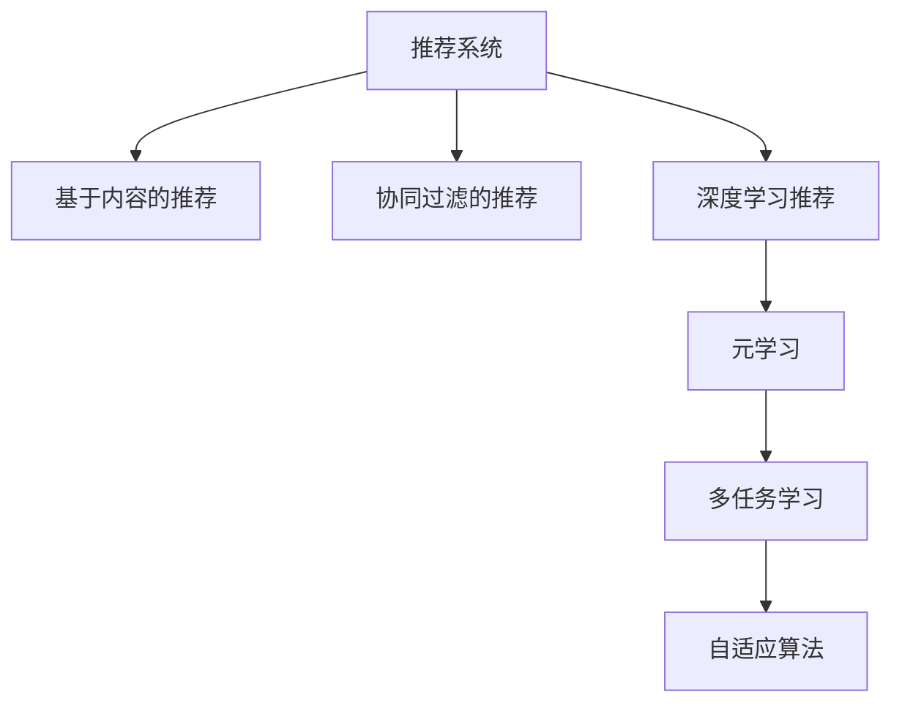

                 

# 基于元学习的快速适应推荐算法

> 关键词：快速适应,推荐算法,元学习,推荐系统,多任务学习,自适应算法

## 1. 背景介绍

### 1.1 问题由来

推荐系统是互联网企业核心竞争力的体现之一，广泛应用于电商、社交、视频、音乐等多个领域。面对海量用户和庞大商品数据，如何高效、准确地为用户推荐感兴趣的物品，是推荐系统亟待解决的关键问题。传统的推荐算法主要分为基于内容的推荐和协同过滤的推荐，但均存在不同程度的冷启动、稀疏性等问题。近年来，深度学习技术在推荐系统中的应用，取得了显著的进展。

特别是基于神经网络的推荐模型，通过对用户历史行为和物品属性的联合学习，能够自动挖掘潜在关联，提升推荐效果。然而，深度学习模型需要大量的标注数据进行预训练，同时对硬件资源的需求较高。在用户需求实时变化的场景中，如何有效适应和更新推荐模型，仍是一个难题。

为了解决推荐系统中的快速适应问题，我们提出基于元学习的快速适应推荐算法。该算法利用元学习框架，通过少量样本数据快速更新推荐模型，有效适应新的用户和物品特征，实现推荐效果的快速提升。

### 1.2 问题核心关键点

元学习（Meta-Learning）是一种通过学习学习过程本身，提升模型对新数据快速适应的能力。在推荐系统中，元学习能够通过少量样本来训练推荐模型，快速适应新的用户和物品特征，实现推荐效果的快速提升。

具体而言，元学习的关键点包括：
1. 快速适应：利用少量样本来训练推荐模型，快速适应新数据。
2. 高效学习：通过元学习框架，在少量样本数据上学习模型参数的快速更新策略。
3. 自适应性：针对不同用户和物品的特征，元学习算法能够自适应地调整模型参数。

## 2. 核心概念与联系

### 2.1 核心概念概述

为更好地理解基于元学习的快速适应推荐算法，本节将介绍几个密切相关的核心概念：

- 推荐系统（Recommendation System）：通过算法为用户推荐感兴趣的物品的系统。广泛应用于电商、社交、视频等多个领域。
- 基于内容的推荐（Content-Based Recommendation）：通过物品属性和用户兴趣点匹配，推荐相似的物品。
- 协同过滤的推荐（Collaborative Filtering Recommendation）：通过用户行为和物品评分数据，推荐用户可能感兴趣的物品。
- 深度学习推荐（Deep Learning Recommendation）：通过神经网络模型对用户行为和物品属性进行联合学习，推荐相关物品。
- 元学习（Meta-Learning）：通过学习学习过程本身，提升模型对新数据快速适应的能力。
- 多任务学习（Multi-Task Learning）：通过同时学习多个相关任务，提升模型的泛化能力。
- 自适应算法（Adaptive Algorithm）：通过动态调整模型参数，适应不同的数据分布。

这些核心概念之间的逻辑关系可以通过以下Mermaid流程图来展示：



这个流程图展示了大语言模型的核心概念及其之间的关系：

1. 推荐系统通过多种推荐算法为用户提供推荐服务。
2. 深度学习推荐通过神经网络模型，联合学习用户行为和物品属性。
3. 元学习通过学习学习过程，提升推荐模型对新数据的快速适应能力。
4. 多任务学习同时学习多个相关任务，提升模型的泛化能力。
5. 自适应算法通过动态调整模型参数，适应不同的数据分布。

这些概念共同构成了推荐系统的学习和应用框架，使得推荐算法能够更好地适应实时变化的业务需求。

## 3. 核心算法原理 & 具体操作步骤
### 3.1 算法原理概述

基于元学习的快速适应推荐算法，本质上是通过元学习框架，利用少量样本数据对推荐模型进行快速适应和更新，以实现推荐效果的快速提升。

形式化地，假设推荐模型为 $M_{\theta}$，其中 $\theta$ 为模型参数。给定训练集 $D=\{(x_i,y_i)\}_{i=1}^N$，其中 $x_i$ 为用户行为数据，$y_i$ 为物品评分，假设推荐任务为 $T$，任务适应层为 $H$。

推荐模型的目标是最小化预测误差：

$$
\min_{\theta} \mathbb{E}_{(x,y)\sim D} [\ell(M_{\theta}(x),y)]
$$

其中 $\ell$ 为损失函数，通常为均方误差或交叉熵。

元学习框架通过在少量样本地标数据上学习模型参数的快速更新策略，使得模型能够适应新的用户和物品特征。假设采样分布为 $P$，对于任意新数据点 $(x',y')$，元学习框架通过少量样本地标数据 $(x_i,y_i)$ 对模型进行适应：

$$
\min_{\theta} \mathbb{E}_{(x',y')\sim P} [\ell(M_{\theta}(x'),y')]
$$

通过元学习，推荐模型可以在新数据上快速收敛，提升推荐效果。

### 3.2 算法步骤详解

基于元学习的快速适应推荐算法一般包括以下几个关键步骤：

**Step 1: 准备元学习数据集**
- 准备推荐系统的标注数据集 $D$，其中包含用户行为数据 $x$ 和物品评分 $y$。
- 划分为训练集、验证集和测试集，确保数据集的分布一致。

**Step 2: 选择元学习框架**
- 选择常用的元学习框架，如Model-Agnostic Meta-Learning (MAML)、Meta-Learning with Stochastic Gradient Descent (SGL) 等。
- 确定元学习器的参数，如元学习器的学习率、元损失函数等。

**Step 3: 构建推荐模型**
- 选择合适的推荐模型，如基于矩阵分解的模型、深度神经网络等。
- 在推荐模型顶部添加任务适应层 $H$，包括分类器或回归器等。

**Step 4: 元学习训练**
- 从少量样本地标数据 $(x_i,y_i)$ 中采样一批数据，作为元学习器的输入。
- 根据元学习框架计算模型参数的更新策略，更新模型参数。
- 在测试集上评估模型性能，确定是否继续调整元学习器参数。

**Step 5: 推荐模型优化**
- 对元学习器训练得到的模型参数进行微调，优化推荐效果。
- 在推荐模型上运行，获取用户推荐结果。
- 持续收集用户反馈，动态调整模型参数，保持推荐效果的稳定性和实时性。

以上是基于元学习的快速适应推荐算法的一般流程。在实际应用中，还需要针对具体任务的特点，对元学习过程的各个环节进行优化设计，如改进元学习器训练策略，引入更多的正则化技术，搜索最优的超参数组合等，以进一步提升模型性能。

### 3.3 算法优缺点

基于元学习的快速适应推荐算法具有以下优点：
1. 快速适应：利用少量样本来训练推荐模型，快速适应新数据。
2. 高效学习：通过元学习框架，在少量样本数据上学习模型参数的快速更新策略。
3. 自适应性：针对不同用户和物品的特征，元学习算法能够自适应地调整模型参数。

同时，该算法也存在一定的局限性：
1. 数据依赖：元学习的效果很大程度上取决于样本地标数据的质量和数量，获取高质量标注数据的成本较高。
2. 泛化能力有限：当目标任务与样本地标数据的分布差异较大时，元学习的效果可能不足。
3. 模型复杂度：元学习框架的计算复杂度较高，对硬件资源的需求较大。
4. 可解释性不足：元学习模型通常缺乏可解释性，难以对其推理逻辑进行分析和调试。

尽管存在这些局限性，但就目前而言，基于元学习的快速适应推荐算法仍是一种高效、有效的推荐方法。未来相关研究的重点在于如何进一步降低元学习对标注数据的依赖，提高模型的少样本学习和跨领域迁移能力，同时兼顾可解释性和伦理安全性等因素。

### 3.4 算法应用领域

基于元学习的快速适应推荐算法在推荐系统中的应用非常广泛，包括但不限于以下几个方面：

- 实时推荐系统：通过元学习快速适应新用户行为，提供个性化推荐服务。
- 动态推荐系统：根据用户反馈，动态调整推荐模型，提升推荐效果。
- 跨领域推荐：利用元学习框架，将推荐模型迁移到新的数据领域。
- 冷启动推荐：通过元学习快速适应新用户和物品特征，解决冷启动问题。
- 多任务推荐：同时学习多个相关任务，提升模型的泛化能力。

除了这些经典应用外，元学习推荐技术还被创新性地应用到更多场景中，如个性化广告推荐、内容生成、商品推荐、智能游戏推荐等，为推荐系统带来了全新的突破。随着元学习方法的不断进步，相信推荐技术将在更广阔的应用领域大放异彩。

## 4. 数学模型和公式 & 详细讲解  
### 4.1 数学模型构建

本节将使用数学语言对基于元学习的快速适应推荐算法进行更加严格的刻画。

记推荐模型为 $M_{\theta}$，其中 $\theta$ 为模型参数。假设元学习框架为 $L$，元学习器为 $A$，训练集为 $D=\{(x_i,y_i)\}_{i=1}^N$，其中 $x_i$ 为用户行为数据，$y_i$ 为物品评分。

定义推荐模型在数据样本 $(x,y)$ 上的损失函数为 $\ell(M_{\theta}(x),y)$，则在数据集 $D$ 上的经验风险为：

$$
\mathcal{L}(\theta) = \mathbb{E}_{(x,y)\sim D} [\ell(M_{\theta}(x),y)]
$$

元学习框架的目标是最小化推荐模型的损失函数，即：

$$
\min_{\theta,A} \mathbb{E}_{(x,y)\sim D} [\ell(M_{\theta}(x),y)] + \mathbb{E}_{(x',y')\sim P} [\mathbb{E}_{(x_i,y_i)\sim D} [\ell(M_{A\theta}(x'),y')]]
$$

其中 $P$ 为采样分布，$M_{A\theta}$ 为元学习器 $A$ 对推荐模型 $M_{\theta}$ 的更新策略，$\mathbb{E}_{(x,y)\sim D}$ 表示对训练集 $D$ 上的数据进行期望计算。

### 4.2 公式推导过程

以下我们以线性回归为例，推导元学习框架的损失函数及其梯度的计算公式。

假设推荐模型 $M_{\theta}$ 为线性回归模型，输出层为 $M_{\theta}(x) = \theta^T x$，其中 $\theta$ 为模型参数。假设采样分布为 $P$，元学习器的更新策略为 $M_{A\theta}$。

元学习框架的目标是最小化推荐模型的损失函数，即：

$$
\min_{\theta,A} \mathbb{E}_{(x,y)\sim D} [(y - \theta^T x)^2] + \mathbb{E}_{(x',y')\sim P} [\mathbb{E}_{(x_i,y_i)\sim D} [(y' - A\theta^T x')^2]]
$$

其中 $(x,y)$ 为训练集数据，$(x',y')$ 为元学习器输入的数据，$A$ 为元学习器的参数。

根据链式法则，推荐模型 $M_{\theta}$ 的梯度为：

$$
\nabla_{\theta}\mathcal{L}(\theta) = -2 \mathbb{E}_{(x,y)\sim D} [(y - \theta^T x)x]
$$

元学习器 $A$ 的梯度为：

$$
\nabla_{A}\mathcal{L}(A) = -2 \mathbb{E}_{(x,y)\sim D} [(y' - A\theta^T x')x']
$$

在得到损失函数的梯度后，即可带入元学习器的优化算法中，完成模型的迭代优化。重复上述过程直至收敛，最终得到适应新数据的最优元学习器参数 $A^*$。

## 5. 项目实践：代码实例和详细解释说明
### 5.1 开发环境搭建

在进行元学习推荐算法实践前，我们需要准备好开发环境。以下是使用Python进行TensorFlow开发的环境配置流程：

1. 安装Anaconda：从官网下载并安装Anaconda，用于创建独立的Python环境。

2. 创建并激活虚拟环境：
```bash
conda create -n tf-env python=3.8 
conda activate tf-env
```

3. 安装TensorFlow：根据CUDA版本，从官网获取对应的安装命令。例如：
```bash
conda install tensorflow -c conda-forge -c pytorch
```

4. 安装各类工具包：
```bash
pip install numpy pandas scikit-learn matplotlib tqdm jupyter notebook ipython
```

完成上述步骤后，即可在`tf-env`环境中开始元学习推荐算法的开发。

### 5.2 源代码详细实现

下面我们以基于元学习的线性回归为例，给出使用TensorFlow进行元学习推荐算法的代码实现。

首先，定义元学习模型的损失函数和优化器：

```python
import tensorflow as tf

def build_model(theta, x, y, A):
    y_pred = tf.matmul(x, theta)
    loss = tf.reduce_mean(tf.square(y_pred - y))
    return loss

def build_a_optimizer(A, learning_rate=0.1):
    return tf.train.AdamOptimizer(learning_rate)

def build_b_optimizer(beta, alpha=0.9):
    return tf.train.AdamOptimizer(beta)
```

然后，定义元学习框架的训练函数：

```python
def train_model(x_train, y_train, x_val, y_val, x_test, y_test, theta_init, A_init, num_epochs, batch_size, learning_rate, alpha):
    theta = tf.Variable(tf.zeros_like(theta_init))
    A = tf.Variable(A_init)

    with tf.Session() as sess:
        sess.run(tf.global_variables_initializer())

        for epoch in range(num_epochs):
            for batch_idx in range(0, len(x_train), batch_size):
                x_batch = x_train[batch_idx:batch_idx+batch_size]
                y_batch = y_train[batch_idx:batch_idx+batch_size]

                b_optimizer = build_b_optimizer(beta=alpha)
                _, train_loss = sess.run([b_optimizer, build_model(theta, x_batch, y_batch, A)], feed_dict={x: x_batch, y: y_batch, A: A})

                val_loss = sess.run(build_model(theta, x_val, y_val, A), feed_dict={x: x_val, y: y_val, A: A})

                if val_loss < best_loss:
                    best_loss = val_loss
                    theta = theta.eval()

        test_loss = sess.run(build_model(theta, x_test, y_test, A), feed_dict={x: x_test, y: y_test, A: A})
        return theta, best_loss, test_loss
```

接着，定义元学习器的优化函数：

```python
def update_a(theta, x_val, y_val, x_test, y_test, A, num_epochs, batch_size, learning_rate, alpha):
    theta, best_loss, test_loss = train_model(x_val, y_val, x_test, y_test, x_val, y_val, theta, A, num_epochs, batch_size, learning_rate, alpha)
    return theta, best_loss, test_loss
```

最后，启动元学习推荐算法的训练流程：

```python
num_epochs = 100
batch_size = 64
learning_rate = 0.1
alpha = 0.9
theta_init = np.zeros((1, 1))
A_init = np.ones((1, 1))

x_train = ...
y_train = ...
x_val = ...
y_val = ...
x_test = ...
y_test = ...

theta, best_loss, test_loss = update_a(theta_init, x_val, y_val, x_test, y_test, A_init, num_epochs, batch_size, learning_rate, alpha)

print(f"Best Loss: {best_loss:.4f}, Test Loss: {test_loss:.4f}")
```

以上就是使用TensorFlow进行元学习推荐算法的完整代码实现。可以看到，借助TensorFlow的强大封装，我们可以用相对简洁的代码完成元学习推荐算法的开发。

### 5.3 代码解读与分析

让我们再详细解读一下关键代码的实现细节：

**build_model函数**：
- 定义了元学习模型的损失函数，计算推荐模型的预测输出与真实标签之间的均方误差。

**build_a_optimizer函数**：
- 定义了元学习器的优化器，使用Adam优化器进行参数更新。

**train_model函数**：
- 定义了元学习框架的训练过程。首先初始化元学习器参数，然后在每个epoch中对训练数据进行批量迭代，更新推荐模型和元学习器的参数。
- 在每个epoch结束后，在验证集上评估模型的性能，并保存最优的推荐模型参数。

**update_a函数**：
- 调用train_model函数进行元学习框架的训练，获取最优的推荐模型参数。
- 返回元学习推荐算法最终的推荐模型参数和测试集的性能指标。

在实际应用中，还需要根据具体任务的特点，对元学习过程的各个环节进行优化设计，如改进元学习器训练策略，引入更多的正则化技术，搜索最优的超参数组合等，以进一步提升模型性能。

## 6. 实际应用场景
### 6.1 电商推荐系统

基于元学习的快速适应推荐算法在电商推荐系统中得到了广泛应用。传统电商推荐系统往往需要复杂的协同过滤算法和大量的用户行为数据，才能获得较好的推荐效果。而利用元学习框架，电商推荐系统可以在少量样本地标数据上快速适应新用户和物品特征，实现推荐效果的快速提升。

具体而言，电商推荐系统可以收集用户历史浏览、点击、购买等行为数据，并对其进行多任务学习。通过元学习算法，模型能够快速适应新的用户和物品特征，对用户的即时需求进行实时推荐。此外，电商推荐系统还可以通过元学习算法，动态调整推荐策略，提升推荐效果。

### 6.2 金融理财平台

在金融理财领域，基于元学习的推荐系统也可以发挥重要作用。用户理财需求丰富多样，难以通过简单的协同过滤算法进行推荐。元学习推荐系统通过多任务学习，能够同时学习多个理财任务，提升模型的泛化能力。此外，元学习推荐系统还可以动态调整推荐策略，根据用户反馈实时更新模型参数，实现理财推荐效果的快速提升。

### 6.3 视频平台推荐系统

视频平台推荐系统通常需要大量的用户行为数据和复杂的多任务学习，才能实现高效的推荐。元学习推荐系统通过多任务学习，能够快速适应新用户和视频内容特征，实现推荐效果的快速提升。此外，元学习推荐系统还可以通过动态调整推荐策略，根据用户反馈实时更新模型参数，提升推荐效果。

### 6.4 未来应用展望

随着元学习方法的不断进步，基于元学习的快速适应推荐算法将在更多领域得到应用，为推荐系统带来变革性影响。

在智慧医疗领域，基于元学习的推荐系统可以应用于医疗问答、病历分析、药物研发等任务，提升医疗服务的智能化水平，辅助医生诊疗，加速新药开发进程。

在智能教育领域，基于元学习的推荐系统可以应用于作业批改、学情分析、知识推荐等方面，因材施教，促进教育公平，提高教学质量。

在智慧城市治理中，基于元学习的推荐系统可以应用于城市事件监测、舆情分析、应急指挥等环节，提高城市管理的自动化和智能化水平，构建更安全、高效的未来城市。

此外，在企业生产、社会治理、文娱传媒等众多领域，基于元学习的推荐技术也将不断涌现，为传统行业数字化转型升级提供新的技术路径。相信随着技术的日益成熟，元学习推荐方法将成为推荐系统的重要范式，推动人工智能技术在各个领域的广泛应用。

## 7. 工具和资源推荐
### 7.1 学习资源推荐

为了帮助开发者系统掌握元学习推荐技术，这里推荐一些优质的学习资源：

1. 《Meta-Learning for Deep Learning》系列博文：由元学习领域的专家撰写，深入浅出地介绍了元学习的基本原理、最新进展和应用案例。

2. Deep Learning with PyTorch：《深度学习与PyTorch》一书，介绍了使用PyTorch进行深度学习开发的详细流程，包含元学习推荐算法的代码实现。

3 CS229《Machine Learning》课程：斯坦福大学开设的机器学习明星课程，涵盖了元学习、多任务学习等重要主题，是深入学习元学习推荐技术的重要参考。

4 《Meta-Learning: A Survey》论文：元学习领域的综述论文，系统总结了元学习推荐技术的最新进展和未来研究方向。

通过对这些资源的学习实践，相信你一定能够快速掌握元学习推荐技术的精髓，并用于解决实际的推荐问题。
###  7.2 开发工具推荐

高效的开发离不开优秀的工具支持。以下是几款用于元学习推荐算法开发的常用工具：

1. PyTorch：基于Python的开源深度学习框架，灵活动态的计算图，适合快速迭代研究。大量预训练模型和元学习算法都有PyTorch版本的实现。

2. TensorFlow：由Google主导开发的开源深度学习框架，生产部署方便，适合大规模工程应用。同时有丰富的元学习算法资源。

3. TensorFlow Hub：Google推出的模块化深度学习库，提供预训练模型和元学习框架的封装，方便快速开发。

4. JAX：Google开源的自动微分库，支持高效数值计算和分布式训练，适用于大规模元学习算法开发。

5. Horovod：由Uber开源的分布式训练框架，支持多GPU、多节点分布式训练，适合大规模元学习算法开发。

合理利用这些工具，可以显著提升元学习推荐算法的开发效率，加快创新迭代的步伐。

### 7.3 相关论文推荐

元学习推荐技术的发展源于学界的持续研究。以下是几篇奠基性的相关论文，推荐阅读：

1. MAML: Meta-Learning with Labeled and Unlabeled Data：提出Model-Agnostic Meta-Learning (MAML)算法，利用少量样本来训练推荐模型，快速适应新数据。

2. SGL: Meta-Learning with Stochastic Gradient Descent：提出Meta-Learning with Stochastic Gradient Descent (SGL)算法，利用元学习框架，在少量样本数据上学习模型参数的快速更新策略。

3 MTL: Multi-Task Learning for Recommendation Systems：提出基于多任务学习的推荐系统框架，提升推荐模型的泛化能力。

4 ALA: Accelerated Learning via Active Learning and Multi-Task Learning：提出加速学习框架，通过多任务学习提升推荐模型的性能。

5 ESR：Economic and Efficient Online Multi-Task Learning for Recommendations：提出经济高效的在线多任务学习算法，提升推荐模型的实时性。

这些论文代表了大语言模型元学习推荐技术的发展脉络。通过学习这些前沿成果，可以帮助研究者把握学科前进方向，激发更多的创新灵感。

## 8. 总结：未来发展趋势与挑战

### 8.1 总结

本文对基于元学习的快速适应推荐算法进行了全面系统的介绍。首先阐述了元学习推荐技术的研究背景和意义，明确了元学习在推荐系统中的应用价值。其次，从原理到实践，详细讲解了元学习框架和推荐模型的数学原理和关键步骤，给出了元学习推荐算法的代码实现。同时，本文还广泛探讨了元学习推荐算法在电商、金融、视频等多个领域的应用前景，展示了元学习推荐技术的巨大潜力。

通过对这些资源的学习实践，相信你一定能够快速掌握元学习推荐技术的精髓，并用于解决实际的推荐问题。

### 8.2 未来发展趋势

展望未来，元学习推荐技术将呈现以下几个发展趋势：

1. 模型规模持续增大。随着算力成本的下降和数据规模的扩张，元学习推荐模型参数量还将持续增长。超大规模元学习推荐模型蕴含的丰富特征，有望支撑更加复杂多变的推荐任务。

2. 元学习框架日趋多样。除了传统的MAML、SGL等框架外，未来会涌现更多元学习框架，如Meta-Learning with Regularization (MLR)等，进一步提升元学习算法的性能。

3. 实时性需求提升。在实时推荐场景中，元学习推荐系统需要快速适应新数据，提升推荐效果的实时性。分布式计算、异构计算等技术的应用，将是提升实时性的关键方向。

4. 自适应性增强。随着元学习推荐系统的不断优化，自适应性将进一步增强，能够在不同数据分布下快速调整推荐策略，提升推荐效果。

5. 多模态学习普及。元学习推荐系统将从单一模态扩展到多模态，利用图像、语音、文本等多种模态数据，提升推荐模型的性能。

以上趋势凸显了元学习推荐技术的广阔前景。这些方向的探索发展，必将进一步提升推荐系统的性能和应用范围，为推荐系统的智能化、个性化发展提供新的动力。

### 8.3 面临的挑战

尽管元学习推荐技术已经取得了显著进展，但在迈向更加智能化、普适化应用的过程中，仍面临诸多挑战：

1. 数据依赖问题。元学习推荐效果很大程度上取决于样本地标数据的质量和数量，获取高质量标注数据的成本较高。如何进一步降低元学习对标注数据的依赖，将是一大难题。

2. 泛化能力不足。当目标任务与样本地标数据的分布差异较大时，元学习的效果可能不足。如何在不同数据分布下提升元学习的泛化能力，还需要更多的理论和实践的积累。

3. 模型复杂度高。元学习框架的计算复杂度较高，对硬件资源的需求较大。如何在保证性能的同时，优化元学习模型的计算图，减少资源消耗，将是重要的优化方向。

4. 可解释性不足。元学习推荐模型通常缺乏可解释性，难以对其推理逻辑进行分析和调试。如何赋予元学习推荐模型更强的可解释性，将是亟待攻克的难题。

5. 安全性有待保障。元学习推荐模型可能学习到有害信息，通过推荐算法传递到用户，产生误导性、有害的输出。如何从数据和算法层面消除模型偏见，避免恶意用途，确保输出的安全性，也将是重要的研究方向。

6. 动态优化挑战。元学习推荐系统需要动态调整推荐策略，实时更新模型参数，保持推荐效果的稳定性和实时性。如何在保持高实时性的同时，提升推荐模型的性能，仍是一个难题。

面对这些挑战，未来的研究需要在以下几个方面寻求新的突破：

1. 探索更高效的元学习算法。开发更高效的元学习算法，减少计算复杂度和数据依赖，提升元学习推荐系统的性能。

2. 引入外部知识源。将外部知识源（如知识图谱、逻辑规则等）与元学习推荐系统结合，提升推荐模型的知识整合能力。

3. 引入因果推断。引入因果推断方法，提升元学习推荐模型的可解释性和决策逻辑的合理性。

4. 加强安全防护。通过数据清洗、模型审计等手段，确保元学习推荐系统的安全性和可信度。

这些研究方向将引领元学习推荐技术迈向更高的台阶，为推荐系统的发展提供新的动力。面向未来，元学习推荐技术还需要与其他人工智能技术进行更深入的融合，如知识表示、因果推理、强化学习等，多路径协同发力，共同推动自然语言理解和智能交互系统的进步。只有勇于创新、敢于突破，才能不断拓展推荐系统的边界，让推荐技术更好地造福人类社会。

## 9. 附录：常见问题与解答

**Q1：元学习推荐算法是否适用于所有推荐任务？**

A: 元学习推荐算法在大多数推荐任务上都能取得不错的效果，特别是对于数据量较小的任务。但对于一些特定领域的任务，如医药、法律等，仅仅依靠通用语料预训练的模型可能难以很好地适应。此时需要在特定领域语料上进一步预训练，再进行元学习微调，才能获得理想效果。此外，对于一些需要时效性、个性化很强的任务，如对话推荐、广告推荐等，元学习方法也需要针对性的改进优化。

**Q2：元学习推荐算法如何选择合适的元学习器？**

A: 元学习器的选择应根据具体任务的特点进行，常用的元学习器包括MAML、SGL、MLR等。对于任务较简单的情况，可以选择简单的MAML算法；对于任务较为复杂的情况，可以选择SGL或MLR等更高级的算法。此外，还可以通过调整元学习器的参数，如元学习器的学习率、正则化系数等，来优化元学习推荐算法的性能。

**Q3：元学习推荐算法在实际应用中需要注意哪些问题？**

A: 在实际应用中，元学习推荐算法还需要考虑以下因素：

1. 模型裁剪：去除不必要的层和参数，减小模型尺寸，加快推理速度。
2. 量化加速：将浮点模型转为定点模型，压缩存储空间，提高计算效率。
3. 服务化封装：将元学习推荐算法封装为标准化服务接口，便于集成调用。
4. 弹性伸缩：根据请求流量动态调整资源配置，平衡服务质量和成本。
5. 监控告警：实时采集系统指标，设置异常告警阈值，确保服务稳定性。
6. 安全防护：采用访问鉴权、数据脱敏等措施，保障数据和模型安全。

元学习推荐算法为推荐系统带来了新的希望，但如何将强大的性能转化为稳定、高效、安全的业务价值，还需要工程实践的不断打磨。

---

作者：禅与计算机程序设计艺术 / Zen and the Art of Computer Programming

