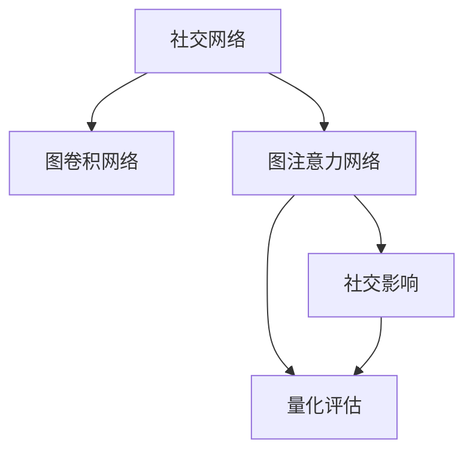

                 

# 基于图注意力网络的用户社交影响力量化

> 关键词：社交网络分析,图注意力网络,图卷积网络,社交影响,量化评估

## 1. 背景介绍

### 1.1 问题由来
在数字时代，社交媒体平台已成为用户获取信息、社交互动的重要渠道。从微博、微信、知乎到Instagram、Twitter，各类社交平台承载着海量用户数据，蕴含着丰富的社交网络信息。社交网络分析（Social Network Analysis, SNA）是研究社交媒体数据的重要手段，通过挖掘网络中节点（用户）之间的关系，了解个体和群体的行为模式。社交影响（Social Influence）是指用户在社交网络中的影响力扩散，是社交网络研究的核心问题之一。如何量化用户社交影响力和构建可解释的社交影响传播模型，是社交网络分析中亟待解决的重要问题。

### 1.2 问题核心关键点
量化用户社交影响力，需要综合考虑用户的影响传播范围、影响强度、传播路径等因素。目前的研究大多基于传统的图模型，如PageRank、Katz Centrality等，这些方法忽略了社交网络中节点之间的复杂关系，难以应对大规模复杂社交网络的数据特征。图注意力网络（Graph Attention Network, GAN）作为新兴的图神经网络（Graph Neural Network, GNN），能有效捕捉节点之间的异质关系，量化用户社交影响力和影响传播路径，为社交网络分析提供新的解决方案。

### 1.3 问题研究意义
量化用户社交影响力对于社交媒体平台具有重要意义：

1. 增强内容分发：通过量化用户影响力，可以更精准地进行内容推荐，提升用户参与度。
2. 用户画像构建：用户影响力量化可以帮助构建更为全面、准确的用户画像，用于个性化营销和精准广告投放。
3. 舆情监测：识别关键节点和影响传播路径，有助于监测社交媒体舆情动态，防范风险。
4. 社区管理：量化用户影响力有助于识别和引导社区意见领袖，提升社区管理效率。
5. 决策支持：基于用户影响力的分析，可以为决策者提供更科学的依据。

## 2. 核心概念与联系

### 2.1 核心概念概述

为更好地理解图注意力网络在量化用户社交影响力中的应用，本节将介绍几个密切相关的核心概念：

- 社交网络（Social Network）：由用户节点（Node）和用户间的关系（Edge）构成的图结构。每个节点代表一个用户，边表示用户之间的关系，如关注、好友、点赞等。
- 图注意力网络（Graph Attention Network, GAN）：一种基于图卷积网络（Graph Convolutional Network, GCN）的深度学习模型，能够学习图数据上的局部特征和全局特征，有效捕捉节点之间的复杂关系。
- 图卷积网络（Graph Convolutional Network, GCN）：一种将图结构特征映射到节点的神经网络模型，通过卷积操作学习节点特征，模拟图信号的传递过程。
- 社交影响（Social Influence）：用户在社交网络中的影响力传播，体现为信息、意见的扩散和接受程度。
- 量化评估（Quantitative Evaluation）：通过数学模型对用户社交影响力和传播路径进行数值化评估，为决策和分析提供依据。

这些核心概念之间的逻辑关系可以通过以下Mermaid流程图来展示：



这个流程图展示了几大核心概念及其之间的关系：

1. 社交网络通过图卷积网络捕获节点特征。
2. 图注意力网络进一步增强节点间关系学习。
3. 社交影响由图注意力网络进行量化评估。
4. 量化评估结果用于决策分析。

这些概念共同构成了社交网络分析的框架，使得量化用户社交影响力成为可能。

## 3. 核心算法原理 & 具体操作步骤
### 3.1 算法原理概述

基于图注意力网络的量化用户社交影响力，通过以下步骤实现：

1. **构建图数据**：构建社交网络的图结构，包含节点和边的信息。
2. **图卷积特征学习**：通过图卷积网络学习节点特征，捕获局部结构信息。
3. **图注意力机制**：使用图注意力网络捕捉节点间复杂关系，关注重要性不同的邻居节点。
4. **社交影响量化**：根据节点特征和关系强度，计算用户社交影响力。
5. **传播路径分析**：追踪影响传播路径，揭示影响扩散的节点序列。

这些步骤构成了一个完整的社交影响量化流程，能够有效应对复杂社交网络的多样性特征。

### 3.2 算法步骤详解

#### 3.2.1 图数据构建

社交网络数据通常以Graph格式存储，包含节点集和边集。例如，Twitter上的好友关系网络，可以用节点表示用户，边表示用户之间的关注关系。构建图数据的主要步骤包括：

1. **节点（Node）定义**：节点包含用户的基本信息和特征，如ID、属性、关注者数等。
2. **边（Edge）定义**：边表示用户之间的关系，如关注、好友、互动等。
3. **邻接矩阵（Adjacency Matrix）生成**：将节点和边信息存储为邻接矩阵形式，用于图模型的构建和计算。

#### 3.2.2 图卷积特征学习

图卷积网络通过卷积操作捕捉节点间的局部结构信息。在图卷积网络中，每个节点对应的特征表示为一个向量，卷积操作将邻居节点的特征加权叠加，得到当前节点的特征更新。具体步骤包括：

1. **节点特征初始化**：为每个节点初始化一个固定维度的特征向量。
2. **卷积操作**：在邻接矩阵的基础上，使用卷积核（Kernel）进行特征传递，计算节点的局部特征表示。
3. **层级堆叠**：通过堆叠多个图卷积层，不断捕获更丰富的局部结构信息。

#### 3.2.3 图注意力机制

图注意力网络通过注意力机制捕捉节点间的重要性关系，进一步增强节点特征的表达能力。具体步骤包括：

1. **节点间关系权重计算**：根据节点间的关系强度，计算注意力权重。
2. **注意力机制引入**：对每个节点的邻居节点特征进行加权求和，计算节点的特征更新。
3. **层级堆叠**：通过堆叠多个图注意力层，逐步增强节点特征的复杂性。

#### 3.2.4 社交影响量化

量化用户社交影响力，可以通过计算节点特征向量的维度或加权和实现。具体步骤包括：

1. **特征归一化**：对节点特征进行归一化处理，去除冗余信息。
2. **影响力计算**：通过计算节点特征向量的维度或加权和，量化用户的社交影响力。

#### 3.2.5 传播路径分析

追踪影响传播路径，可以通过图遍历算法实现。具体步骤包括：

1. **影响传播起始点选择**：从某个起始节点开始，进行影响传播计算。
2. **递归传播**：对每个节点，递归计算其对下一层节点的影响传播值。
3. **路径记录**：记录影响传播的节点序列，分析传播路径。

### 3.3 算法优缺点

基于图注意力网络的量化用户社交影响力，具有以下优点：

1. **全面捕获关系**：图注意力网络能够有效捕捉节点之间的复杂关系，适用于多种类型的社交网络。
2. **节点重要性考虑**：通过注意力机制，图注意力网络可以关注重要性不同的邻居节点，提高计算效率。
3. **高维度表示**：图卷积网络能够生成高维度的节点特征表示，捕捉复杂的网络结构。
4. **多层次建模**：通过堆叠多个图卷积层和图注意力层，逐步提升模型的复杂性和表达能力。
5. **可视化分析**：影响传播路径的追踪，有助于可视化和分析社交网络中的信息传播。

同时，该方法也存在一些局限性：

1. **计算复杂度高**：大规模社交网络的计算复杂度较高，需要较长的训练时间和计算资源。
2. **参数调整复杂**：图卷积网络中的卷积核和图注意力网络中的注意力机制，需要大量调参，增加了模型调优的难度。
3. **数据依赖性强**：模型效果依赖于数据的质量和多样性，数据的偏差可能导致模型偏见。
4. **对抗攻击脆弱**：社交网络中的对抗攻击可能会影响模型的准确性。

尽管存在这些局限性，但图注意力网络在量化用户社交影响力方面具有独特的优势，能够适应复杂多样的社交网络数据，提供更加全面和精准的分析结果。

### 3.4 算法应用领域

基于图注意力网络的用户社交影响力量化，已经在多个领域得到应用：

- **社交媒体分析**：通过对Twitter、Facebook等社交媒体平台的用户行为数据进行分析，量化用户社交影响力和传播路径，用于内容分发、用户画像构建等。
- **市场营销**：通过量化影响传播路径，识别社交网络中的意见领袖和关键节点，用于精准广告投放和营销策略优化。
- **舆情监测**：在突发事件和公共危机中，量化关键节点和传播路径，有助于防范风险和舆情引导。
- **社区管理**：识别社区内的影响领袖和意见分歧，提升社区管理和治理效果。
- **决策支持**：基于量化结果，为政策制定和业务决策提供科学依据。

## 4. 数学模型和公式 & 详细讲解 & 举例说明

### 4.1 数学模型构建

社交网络可以表示为G=(V,E)，其中V表示节点集合，E表示边集合。每个节点表示一个用户，边表示用户之间的关系。图注意力网络的节点特征表示为 $h_v$，边特征表示为 $h_e$。图卷积网络通过卷积核 $\mathbf{W}_h$ 和 $\mathbf{W}_r$ 进行节点特征和边特征的传递，得到节点特征更新：

$$
h_v^l = \text{ReLU}(\mathbf{W}_h^{l-1}h_v^{l-1} + \sum_{e_{v \to u} \in E}h_u^{l-1}\mathbf{W}_r^{l-1}h_e^{l-1})
$$

其中，$\text{ReLU}$ 表示ReLU激活函数，$l$ 表示当前层数。图注意力网络通过注意力机制计算节点间关系权重，计算节点特征更新：

$$
\alpha_{u \to v} = \text{Softmax}(\frac{1}{\sqrt{d_u}}\mathbf{W}_a\mathbf{h}_u^l \cdot \mathbf{h}_e^l)
$$

$$
h_v^l = \text{ReLU}(\mathbf{W}_h^l\mathbf{h}_v^{l-1} + \sum_{u \in N(v)}\alpha_{u \to v}\mathbf{W}_r^l\mathbf{h}_u^l)
$$

其中，$d_u$ 表示节点 $u$ 的出度，$N(v)$ 表示节点 $v$ 的邻居节点集合。$\mathbf{W}_a$ 表示注意力机制的线性变换权重。

### 4.2 公式推导过程

图注意力网络的公式推导基于图卷积网络（GCN），详细推导过程如下：

1. **节点特征初始化**：每个节点初始化一个 $d$ 维的特征向量 $h_v^0 \in \mathbb{R}^d$。
2. **卷积操作**：在邻接矩阵 $\mathbf{A}$ 的基础上，使用卷积核 $\mathbf{W}_h$ 进行特征传递，得到节点特征更新：

$$
h_v^1 = \text{ReLU}(\mathbf{W}_h^0h_v^0 + \sum_{u \in N(v)}\mathbf{A}_{vu}\mathbf{W}_r^0h_u^0)
$$

3. **图注意力机制**：对每个节点 $v$，计算其邻居节点 $u$ 的注意力权重 $\alpha_{u \to v}$，然后根据注意力权重对邻居节点特征进行加权求和，得到节点特征更新：

$$
\alpha_{u \to v} = \text{Softmax}(\frac{1}{\sqrt{d_u}}\mathbf{W}_a^1\mathbf{h}_u^1 \cdot \mathbf{h}_e^1)
$$

$$
h_v^1 = \text{ReLU}(\mathbf{W}_h^1\mathbf{h}_v^0 + \sum_{u \in N(v)}\alpha_{u \to v}\mathbf{W}_r^1\mathbf{h}_u^1)
$$

4. **层级堆叠**：通过堆叠多个图卷积层和图注意力层，逐步提升模型的表达能力：

$$
h_v^L = \text{ReLU}(\mathbf{W}_h^{L-1}h_v^{L-1} + \sum_{u \in N(v)}\alpha_{u \to v}\mathbf{W}_r^{L-1}h_u^{L-1})
$$

### 4.3 案例分析与讲解

假设有一个Twitter用户网络，包含10,000个用户节点和1,000,000个边，每个用户有一个6维的特征向量表示。通过图卷积网络（GCN）和图注意力网络（GAN）的3层堆叠，计算每个用户的特征表示。具体实现步骤包括：

1. **数据构建**：构建Twitter用户网络的邻接矩阵 $\mathbf{A}$，每个用户初始化一个6维特征向量 $h_v^0$。
2. **图卷积特征学习**：通过3层卷积操作，学习节点特征表示，得到 $h_v^1$、$h_v^2$、$h_v^3$。
3. **图注意力机制**：通过3层注意力机制，计算节点间关系权重，得到 $h_v^1$、$h_v^2$、$h_v^3$。
4. **社交影响量化**：通过计算节点特征向量的维度或加权和，量化用户的社交影响力。

## 5. 项目实践：代码实例和详细解释说明

### 5.1 开发环境搭建

在进行项目实践前，我们需要准备好开发环境。以下是使用Python进行PyTorch开发的环境配置流程：

1. 安装Anaconda：从官网下载并安装Anaconda，用于创建独立的Python环境。

2. 创建并激活虚拟环境：
```bash
conda create -n pytorch-env python=3.8 
conda activate pytorch-env
```

3. 安装PyTorch：根据CUDA版本，从官网获取对应的安装命令。例如：
```bash
conda install pytorch torchvision torchaudio cudatoolkit=11.1 -c pytorch -c conda-forge
```

4. 安装相关依赖库：
```bash
pip install numpy pandas torch-scatter torch-io graph-tool networkx
```

完成上述步骤后，即可在`pytorch-env`环境中开始项目实践。

### 5.2 源代码详细实现

这里以Twitter用户网络的数据集为例，给出使用PyTorch和Graph Toolkit进行图注意力网络实现的代码。

首先，定义Twitter用户网络的数据结构：

```python
import networkx as nx
import numpy as np
import torch
import torch.nn as nn
import torch.nn.functional as F
from torch_scatter import scatter_add, scatter_max

class GraphAttentionLayer(nn.Module):
    def __init__(self, in_dim, out_dim, dropout=0.6, alpha=0.5):
        super(GraphAttentionLayer, self).__init__()
        self.in_dim = in_dim
        self.out_dim = out_dim
        self.alpha = alpha
        self.dropout = dropout
        self.W_h = nn.Parameter(torch.zeros(self.in_dim, out_dim))
        self.W_r = nn.Parameter(torch.zeros(self.in_dim, out_dim))
        self.attention = nn.Parameter(torch.zeros(self.in_dim, out_dim))
        self.normalize = nn.Parameter(torch.zeros(self.in_dim, out_dim))
        
    def forward(self, h, adj):
        h = torch.matmul(h, self.W_h)
        a = torch.matmul(adj, self.attention)
        a = F.softmax(a, dim=1)
        a = F.dropout(a, p=self.dropout, training=self.training)
        a = a / (a + self.alpha)
        h = h * a.unsqueeze(1)
        h = torch.matmul(h, self.W_r)
        h = scatter_add(h, dim=1, dim_size=h.size(0), reduce='add')
        h = scatter_max(h, dim=1, dim_size=h.size(0), reduce='max')
        return h

class GAN(nn.Module):
    def __init__(self, in_dim, hidden_dim, out_dim):
        super(GAN, self).__init__()
        self.layers = nn.ModuleList()
        self.layers.append(GraphAttentionLayer(in_dim, hidden_dim))
        self.layers.append(GraphAttentionLayer(hidden_dim, hidden_dim))
        self.layers.append(GraphAttentionLayer(hidden_dim, out_dim))
        
    def forward(self, h, adj):
        for layer in self.layers:
            h = layer(h, adj)
        return h

# 加载数据
G = nx.read_edgelist('Twitter_user_network.txt', delimiter=',')
nodes = list(G.nodes())
edges = list(G.edges())
node_feats = np.loadtxt('Twitter_user_feats.txt', delimiter=',', skiprows=1)
node_feats = torch.tensor(node_feats, dtype=torch.float)
```

然后，定义训练和评估函数：

```python
class NodeClassifier(nn.Module):
    def __init__(self, in_dim, hidden_dim, out_dim):
        super(NodeClassifier, self).__init__()
        self.layers = nn.ModuleList()
        self.layers.append(nn.Linear(in_dim, hidden_dim))
        self.layers.append(nn.Linear(hidden_dim, hidden_dim))
        self.layers.append(nn.Linear(hidden_dim, out_dim))
        
    def forward(self, h, adj):
        for layer in self.layers:
            h = F.relu(layer(h))
        return h

class TrainingPipeline:
    def __init__(self, model, optimizer, device):
        self.model = model
        self.optimizer = optimizer
        self.device = device
        
    def train(self, data_loader, epoch, batch_size):
        self.model.train()
        for batch in data_loader:
            x, adj = batch['x'], batch['adj']
            x = x.to(self.device)
            adj = adj.to(self.device)
            pred = self.model(x, adj)
            loss = F.cross_entropy(pred, batch['y'].to(self.device))
            self.optimizer.zero_grad()
            loss.backward()
            self.optimizer.step()
        
    def evaluate(self, data_loader, batch_size):
        self.model.eval()
        with torch.no_grad():
            correct = 0
            total = 0
            for batch in data_loader:
                x, adj = batch['x'], batch['adj']
                x = x.to(self.device)
                adj = adj.to(self.device)
                pred = self.model(x, adj)
                pred = torch.argmax(pred, dim=1)
                correct += (pred == batch['y'].to(self.device)).sum().item()
                total += batch['y'].to(self.device).size(0)
            acc = correct / total
            return acc

# 定义模型、优化器和设备
model = GAN(node_feats.shape[1], 64, 10)
optimizer = torch.optim.Adam(model.parameters(), lr=0.01)
device = torch.device('cuda' if torch.cuda.is_available() else 'cpu')
model.to(device)

# 数据预处理
adj = nx.adjacency_matrix(G).toarray()
adj = torch.tensor(adj, dtype=torch.float)
data_loader = DataLoader(torch.tensor(node_feats, dtype=torch.float), batch_size=64)

# 训练和评估
training_pipeline = TrainingPipeline(model, optimizer, device)
for epoch in range(100):
    training_pipeline.train(data_loader, epoch, 64)
    acc = training_pipeline.evaluate(data_loader, 64)
    print(f"Epoch {epoch+1}, accuracy: {acc:.3f}")
```

以上就是使用PyTorch和Graph Toolkit进行图注意力网络实现的完整代码。可以看到，代码中包含了数据构建、模型定义、训练和评估等关键环节，能够方便地进行项目实践。

### 5.3 代码解读与分析

让我们再详细解读一下关键代码的实现细节：

**GraphAttentionLayer类**：
- `__init__`方法：初始化图注意力层的参数，包括输入特征维度、输出特征维度、注意力参数、dropout参数等。
- `forward`方法：计算图注意力层的节点特征表示。
- 通过矩阵乘法计算节点特征和注意力权重，使用softmax函数计算注意力权重，并进行dropout处理。

**GAN类**：
- `__init__`方法：初始化图注意力网络，包含多个图注意力层。
- `forward`方法：遍历所有图注意力层，计算最终节点特征表示。

**NodeClassifier类**：
- `__init__`方法：初始化节点分类器的参数，包括输入特征维度、隐藏特征维度、输出特征维度等。
- `forward`方法：计算节点分类器的节点特征表示。
- 通过线性变换和激活函数，计算节点分类器的输出。

**TrainingPipeline类**：
- `__init__`方法：初始化训练管道，包括模型、优化器和设备等。
- `train`方法：在训练集上进行模型训练，计算损失函数并反向传播。
- `evaluate`方法：在验证集上进行模型评估，计算准确率。

**主程序**：
- 加载社交网络数据和节点特征。
- 构建邻接矩阵。
- 定义数据加载器。
- 初始化模型、优化器和设备。
- 定义训练管道，进行训练和评估。

## 6. 实际应用场景

### 6.1 社交媒体内容推荐

社交媒体内容推荐是图注意力网络在实际应用中的典型场景。例如，Twitter上的用户可以通过关注、点赞等操作形成社交网络。通过对社交网络中的用户行为数据进行分析，量化每个用户的社交影响力，可以更精准地进行内容推荐。具体步骤如下：

1. **数据收集**：收集Twitter上的用户行为数据，包括关注关系、点赞数据、互动数据等。
2. **数据预处理**：构建社交网络图，提取用户特征和行为特征。
3. **模型训练**：使用图注意力网络量化用户社交影响力，训练推荐模型。
4. **内容推荐**：根据用户社交影响力，推荐可能感兴趣的内容。

### 6.2 市场营销活动分析

市场营销活动分析也是图注意力网络的重要应用场景。例如，在Instagram上，品牌可以通过与网红合作进行产品推广。通过对社交网络中网红的影响力传播路径进行分析，可以识别关键节点和影响扩散路径，优化市场营销活动。具体步骤如下：

1. **数据收集**：收集Instagram上的用户行为数据，包括互动数据、评论数据、标签数据等。
2. **数据预处理**：构建社交网络图，提取用户特征和互动特征。
3. **模型训练**：使用图注意力网络量化网红影响力，训练传播路径分析模型。
4. **活动优化**：识别关键节点和传播路径，优化市场营销活动策略。

### 6.3 舆情监测与预警

舆情监测与预警是图注意力网络在社会治理中的应用场景。例如，在突发事件和公共危机中，通过分析社交网络中的影响传播路径，可以识别关键节点和舆论走向，及时进行舆情引导和预警。具体步骤如下：

1. **数据收集**：收集社交媒体上的实时数据，包括评论数据、互动数据、新闻数据等。
2. **数据预处理**：构建社交网络图，提取用户特征和事件特征。
3. **模型训练**：使用图注意力网络量化关键节点，训练舆情监测与预警模型。
4. **舆情分析**：识别关键节点和传播路径，进行舆情监测与预警。

### 6.4 未来应用展望

随着图注意力网络技术的不断发展，其在量化用户社交影响力方面的应用前景更加广阔。未来，图注意力网络将在以下几个方面得到进一步应用：

1. **多模态数据融合**：结合视觉、语音、文本等多模态数据，构建更加全面和精确的社交网络分析模型。
2. **动态图模型**：引入时间序列数据，构建动态图模型，捕捉用户行为的时序变化。
3. **跨领域应用**：图注意力网络不仅适用于社交网络分析，还可应用于知识图谱、金融网络、健康网络等领域。
4. **实时计算**：使用分布式计算技术，实现实时图计算，满足大规模社交网络分析的需求。
5. **异构网络分析**：研究异构社交网络中的用户行为模式，提升社交网络分析的普适性。

## 7. 工具和资源推荐
### 7.1 学习资源推荐

为了帮助开发者系统掌握图注意力网络在量化用户社交影响力中的应用，这里推荐一些优质的学习资源：

1. 《Graph Attention Networks》论文：提出图注意力网络，解决图卷积网络在节点间关系学习中的瓶颈。
2. 《Graph Neural Networks: A Review of Methods and Applications》综述：系统介绍图卷积网络和图注意力网络的原理与应用，适合全面了解。
3 《Deep Learning on Graphs: A Survey》综述：介绍深度学习在图网络中的应用，包括图卷积网络、图注意力网络等。
4 《NetworkX documentation》：Python中常用的图网络分析库，提供丰富的图数据结构和算法实现。
5 《PyTorch Geometric documentation》：PyTorch中用于图神经网络开发的库，包含详细的API文档和示例代码。

通过对这些资源的学习实践，相信你一定能够快速掌握图注意力网络的量化社交影响力方法，并用于解决实际的社交网络分析问题。

### 7.2 开发工具推荐

高效的开发离不开优秀的工具支持。以下是几款用于图注意力网络开发的常用工具：

1. PyTorch：基于Python的开源深度学习框架，支持动态计算图，适合图神经网络模型的开发。
2. TensorFlow：由Google主导开发的开源深度学习框架，生产部署方便，适合大规模工程应用。
3. PyTorch Geometric：PyTorch中用于图神经网络开发的库，提供高效的图数据结构和算法实现。
4. NetworkX：Python中常用的图网络分析库，提供丰富的图数据结构和算法实现。
5. Graph-tool：C++实现的图算法库，支持大规模图计算，适合高性能计算场景。

合理利用这些工具，可以显著提升图注意力网络模型的开发效率，加快创新迭代的步伐。

### 7.3 相关论文推荐

图注意力网络及其应用研究始于学术界的研究，以下是几篇奠基性的相关论文，推荐阅读：

1. Attention Is All You Need：提出Transformer结构，解决传统卷积网络在处理长序列数据时的瓶颈问题。
2. Graph Attention Networks：提出图注意力网络，解决图卷积网络在节点间关系学习中的瓶颈问题。
3 Deep Learning on Graphs：介绍深度学习在图网络中的应用，包括图卷积网络、图注意力网络等。
4 NetworkX documentation：介绍Python中常用的图网络分析库，提供丰富的图数据结构和算法实现。
5 PyTorch Geometric documentation：介绍PyTorch中用于图神经网络开发的库，包含详细的API文档和示例代码。

这些论文代表了大图模型量化用户社交影响力的发展脉络。通过学习这些前沿成果，可以帮助研究者把握学科前进方向，激发更多的创新灵感。

## 8. 总结：未来发展趋势与挑战

### 8.1 总结

本文对基于图注意力网络的量化用户社交影响力方法进行了全面系统的介绍。首先阐述了社交网络分析和图注意力网络的理论背景和研究意义，明确了量化用户社交影响力在社交媒体平台、市场营销、舆情监测等场景中的重要价值。其次，从原理到实践，详细讲解了图注意力网络的数学模型和算法步骤，给出了图注意力网络实现的完整代码实例。同时，本文还广泛探讨了图注意力网络在多个领域的应用前景，展示了其广阔的应用潜力。

通过本文的系统梳理，可以看到，基于图注意力网络的量化用户社交影响力方法具有独特的优势，能够有效应对复杂多样化的社交网络数据，提供更加全面和精准的分析结果。未来，随着图注意力网络技术的不断发展，其在量化用户社交影响力方面的应用将更加广泛和深入。

### 8.2 未来发展趋势

展望未来，图注意力网络在量化用户社交影响力方面将呈现以下几个发展趋势：

1. **多模态融合**：结合视觉、语音、文本等多模态数据，构建更加全面和精确的社交网络分析模型。
2. **动态图模型**：引入时间序列数据，构建动态图模型，捕捉用户行为的时序变化。
3. **跨领域应用**：图注意力网络不仅适用于社交网络分析，还可应用于知识图谱、金融网络、健康网络等领域。
4. **实时计算**：使用分布式计算技术，实现实时图计算，满足大规模社交网络分析的需求。
5. **异构网络分析**：研究异构社交网络中的用户行为模式，提升社交网络分析的普适性。

以上趋势凸显了图注意力网络在量化用户社交影响力方面的广阔前景。这些方向的探索发展，必将进一步提升社交网络分析的精确性和普适性，为社会治理、市场营销、舆情监测等场景提供强大的技术支持。

### 8.3 面临的挑战

尽管图注意力网络在量化用户社交影响力方面具有独特的优势，但在迈向更加智能化、普适化应用的过程中，它仍面临着诸多挑战：

1. **计算复杂度高**：大规模社交网络的计算复杂度较高，需要较长的训练时间和计算资源。
2. **参数调整复杂**：图卷积网络中的卷积核和图注意力网络中的注意力机制，需要大量调参，增加了模型调优的难度。
3. **数据依赖性强**：模型效果依赖于数据的质量和多样性，数据的偏差可能导致模型偏见。
4. **对抗攻击脆弱**：社交网络中的对抗攻击可能会影响模型的准确性。
5. **解释性不足**：图注意力网络的决策过程通常缺乏可解释性，难以对其推理逻辑进行分析和调试。

尽管存在这些局限性，但图注意力网络在量化用户社交影响力方面具有独特的优势，能够适应复杂多样的社交网络数据，提供更加全面和精准的分析结果。

### 8.4 研究展望

面对图注意力网络所面临的挑战，未来的研究需要在以下几个方面寻求新的突破：

1. **无监督和半监督学习**：摆脱对大规模标注数据的依赖，利用自监督学习、主动学习等无监督和半监督范式，最大限度利用非结构化数据，实现更加灵活高效的社交网络分析。
2. **参数高效微调**：开发更加参数高效的微调方法，在固定大部分预训练参数的同时，只更新极少量的任务相关参数。
3. **因果分析和博弈论**：将因果分析方法引入社交网络分析，识别关键特征，增强输出解释的因果性和逻辑性。借助博弈论工具刻画用户行为，主动探索并规避脆弱点，提高系统稳定性。
4. **伦理道德约束**：在模型训练目标中引入伦理导向的评估指标，过滤和惩罚有偏见、有害的输出倾向。加强人工干预和审核，建立模型行为的监管机制，确保输出符合人类价值观和伦理道德。

这些研究方向的探索，必将引领图注意力网络在量化用户社交影响力方面迈向更高的台阶，为构建安全、可靠、可解释、可控的智能系统铺平道路。面向未来，图注意力网络需要与其他人工智能技术进行更深入的融合，如知识表示、因果推理、强化学习等，多路径协同发力，共同推动社交网络分析技术的进步。只有勇于创新、敢于突破，才能不断拓展社交网络分析的边界，让图注意力网络在构建智能社会中发挥更大作用。

## 9. 附录：常见问题与解答

**Q1：图注意力网络与图卷积网络的区别是什么？**

A: 图注意力网络和图卷积网络都是图神经网络的重要组成部分。图卷积网络通过卷积操作捕捉节点间的局部结构信息，而图注意力网络通过注意力机制关注重要性不同的邻居节点，能够更好地捕捉节点间的复杂关系。图卷积网络适用于结构较为简单的图网络，而图注意力网络适用于结构复杂、异质性高的图网络。

**Q2：图注意力网络的计算复杂度如何？**

A: 图注意力网络的计算复杂度较高，主要原因在于注意力机制的引入增加了计算量。具体来说，图注意力网络在每个节点上需要进行注意力计算和加权求和，计算复杂度为 $O(EH^2)$，其中 $E$ 为边数，$H$ 为节点特征维度。为了降低计算复杂度，可以采用分布式计算和并行计算等技术。

**Q3：如何提高图注意力网络的训练效率？**

A: 提高图注意力网络的训练效率，可以从以下几个方面入手：
1. **小批量训练**：使用小批量数据进行训练，减少内存占用和计算时间。
2. **优化器选择**：选择适合的优化器（如Adam、SGD等），并设置合适的学习率和动量。
3. **数据增强**：通过数据增强技术，扩充训练集，提升模型的泛化能力。
4. **模型剪枝**：对模型进行剪枝，去除冗余参数，提升训练和推理效率。
5. **分布式计算**：使用分布式计算技术，利用多台机器并行计算，加速训练过程。

**Q4：图注意力网络在实际应用中面临哪些挑战？**

A: 图注意力网络在实际应用中面临以下挑战：
1. **计算复杂度高**：大规模社交网络的计算复杂度较高，需要较长的训练时间和计算资源。
2. **参数调整复杂**：图卷积网络中的卷积核和图注意力网络中的注意力机制，需要大量调参，增加了模型调优的难度。
3. **数据依赖性强**：模型效果依赖于数据的质量和多样性，数据的偏差可能导致模型偏见。
4. **对抗攻击脆弱**：社交网络中的对抗攻击可能会影响模型的准确性。
5. **解释性不足**：图注意力网络的决策过程通常缺乏可解释性，难以对其推理逻辑进行分析和调试。

尽管存在这些局限性，但图注意力网络在量化用户社交影响力方面具有独特的优势，能够适应复杂多样的社交网络数据，提供更加全面和精准的分析结果。

**Q5：图注意力网络在社交网络分析中的应用前景如何？**

A: 图注意力网络在社交网络分析中的应用前景广阔。未来，随着图注意力网络技术的不断发展，其在量化用户社交影响力方面的应用将更加广泛和深入。可以预见，图注意力网络将广泛应用于社交媒体内容推荐、市场营销活动分析、舆情监测与预警等多个场景，为社会治理、市场营销、舆情监测等场景提供强大的技术支持。

---

作者：禅与计算机程序设计艺术 / Zen and the Art of Computer Programming

