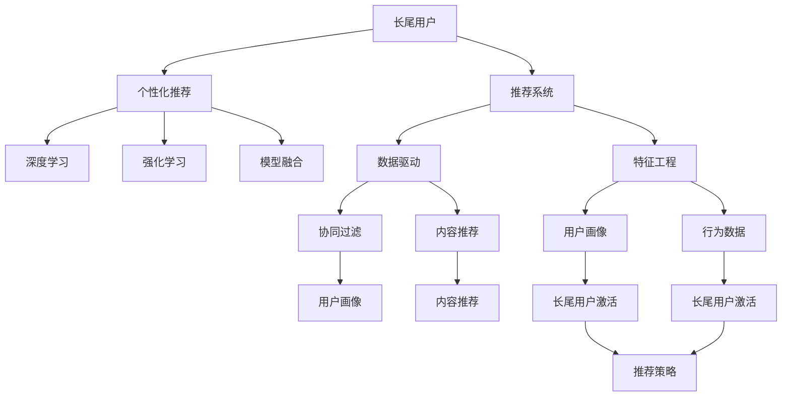

                 

# 基于大模型的推荐系统长尾用户激活策略

> 关键词：推荐系统,长尾用户,大模型,激活策略,个性化推荐,深度学习,强化学习

## 1. 背景介绍

在当今信息爆炸的时代，推荐系统成为了各大平台提升用户体验、增加用户粘性的重要工具。然而，传统推荐算法往往面临"二八定律"的挑战，即20%的热门用户获取80%的推荐资源，而剩余的80%长尾用户只获取20%的推荐资源。长尾用户通常以个性化需求为主，需要更精准、多样化的推荐内容，但平台通常资源有限，难以针对这些用户进行个性化的推荐。如何有效激活长尾用户，使其成为平台活跃用户，成为推荐系统面临的重要课题。

为了解决这一问题，近年来越来越多的研究者开始关注长尾用户的激活策略。通过使用大模型和大数据驱动的个性化推荐，能够更好地匹配长尾用户的个性化需求，提升用户体验，增加平台留存率。本文将对基于大模型的长尾用户激活策略进行全面系统的介绍，帮助开发者深入理解相关算法原理和实践技巧。

## 2. 核心概念与联系

### 2.1 核心概念概述

为更好地理解基于大模型的长尾用户激活策略，本节将介绍几个密切相关的核心概念：

- 长尾用户(Long Tail User)：指那些只占总用户数少数，但需求多样且难以预测的用户群体。长尾用户对平台推荐的满意度直接影响平台的活跃度和留存率。

- 推荐系统(Recommendation System)：通过分析用户行为和兴趣，为用户推荐个性化内容的技术系统。推荐系统根据用户的历史行为、偏好等信息，为其推荐可能感兴趣的商品、信息等。

- 个性化推荐(Personalized Recommendation)：根据用户个性化需求，为用户提供量身定制的推荐内容，提升用户满意度，增加平台粘性。

- 深度学习(Deep Learning)：一种基于神经网络结构的机器学习方法，能够从大规模数据中自动学习特征表示，广泛应用于推荐系统、图像识别、自然语言处理等领域。

- 强化学习(Reinforcement Learning)：通过与环境的交互，使智能体不断优化决策策略，以达到最大化预期奖励的目的。在推荐系统中，可应用于生成推荐策略，增强推荐效果。

- 模型融合(Model Fusion)：将多个推荐模型进行集成，取长补短，提升推荐效果。模型融合可有效降低单模型不确定性，增加推荐鲁棒性。

这些核心概念之间的逻辑关系可以通过以下Mermaid流程图来展示：



这个流程图展示了大模型和长尾用户激活策略的核心概念及其之间的关系：

1. 长尾用户通过推荐系统获得个性化推荐内容。
2. 推荐系统以深度学习、强化学习等技术为支撑，进行用户画像、行为建模等特征工程，提供个性化推荐。
3. 深度学习、强化学习能够提供复杂且高效的特征表示和决策策略，提升推荐效果。
4. 模型融合能够提升推荐鲁棒性，减少单模型不确定性。
5. 数据驱动、协同过滤、内容推荐等技术为个性化推荐提供基础支撑。
6. 个性化推荐提升用户满意度，增加平台留存率。

这些概念共同构成了大模型在推荐系统中的应用框架，为其长尾用户激活策略提供了理论基础。

## 3. 核心算法原理 & 具体操作步骤

### 3.1 算法原理概述

基于大模型的长尾用户激活策略，本质上是一种通过深度学习、强化学习等技术，对长尾用户进行个性化推荐，从而提升其活跃度、留存率的技术范式。其核心思想是：通过数据分析和机器学习算法，挖掘长尾用户的多样化需求，定制个性化推荐内容，引导其参与互动，逐步提升平台粘性。

形式化地，假设推荐系统为用户 $u$ 推荐商品 $i$，用户的偏好为 $p$，推荐系统的目标是在所有候选商品 $I$ 中找到推荐商品 $i$，使得用户 $u$ 的满意度最大化：

$$
\max_{i \in I} \sum_{u \in U} p(u,i) \cdot R(u,i)
$$

其中 $U$ 为全体用户集，$R(u,i)$ 为用户对商品 $i$ 的满意度评分，$p(u,i)$ 为推荐系统推荐商品 $i$ 的概率。

通过深度学习、强化学习等技术，模型能够自动学习用户行为模式和商品特征表示，进而进行个性化推荐，提升用户满意度。对于长尾用户，推荐系统需要结合用户画像、行为数据等多维信息，精准匹配其个性化需求。

### 3.2 算法步骤详解

基于大模型的长尾用户激活策略一般包括以下几个关键步骤：

**Step 1: 用户画像构建**
- 收集用户的各项数据，包括浏览行为、点击历史、评分记录等。
- 将用户的各项数据进行特征提取和融合，形成用户画像。

**Step 2: 长尾用户识别**
- 根据用户画像等数据，筛选出长尾用户，即活跃度低、需求多样的用户。
- 使用聚类、分类等算法对长尾用户进行进一步细分，识别出不同需求的用户群体。

**Step 3: 个性化推荐生成**
- 针对长尾用户，生成个性化的推荐内容。
- 结合深度学习、强化学习等技术，优化推荐模型。

**Step 4: 用户行为监测**
- 实时监测长尾用户的互动行为，评估推荐效果。
- 根据用户行为反馈，动态调整推荐策略。

**Step 5: 持续优化**
- 根据用户行为数据和反馈，不断优化推荐模型。
- 采用A/B测试等方法，评估模型效果，迭代改进。

### 3.3 算法优缺点

基于大模型的长尾用户激活策略具有以下优点：
1. 深度学习、强化学习能够提供复杂且高效的特征表示和决策策略，提升推荐效果。
2. 用户画像能够帮助推荐系统更好地理解用户需求，进行个性化推荐。
3. 长尾用户识别和聚类技术能够帮助系统精准定位长尾用户，提升推荐精准度。
4. 用户行为监测和持续优化机制，可以动态调整推荐策略，提升用户满意度。

同时，该方法也存在一定的局限性：
1. 需要大量标注数据和计算资源，建模和调参成本较高。
2. 模型复杂度较高，推理速度较慢，无法实时响应。
3. 长尾用户需求多样化，模型难以全面覆盖，仍有大量个性化需求未被满足。
4. 模型的泛化能力有限，对于未知用户和场景，推荐效果可能较差。

尽管存在这些局限性，但就目前而言，基于大模型的长尾用户激活策略仍是最主流的长尾用户推荐范式。未来相关研究的重点在于如何进一步降低模型复杂度，提高实时响应性，同时优化长尾用户识别和聚类算法，最大化满足用户需求。

### 3.4 算法应用领域

基于大模型的长尾用户激活策略在推荐系统领域已经得到了广泛的应用，覆盖了几乎所有常见场景，例如：

- 电商推荐：对用户的浏览、点击、购买等行为进行建模，生成个性化推荐商品。
- 内容推荐：对用户的阅读、观看、点赞等行为进行建模，生成个性化推荐内容。
- 社交推荐：对用户的社交关系、互动记录等进行建模，生成个性化推荐好友或群组。
- 视频推荐：对用户的观看记录、评分记录等进行建模，生成个性化推荐视频。
- 音乐推荐：对用户的听歌记录、评分记录等进行建模，生成个性化推荐歌曲。

除了上述这些经典应用外，基于大模型的长尾用户激活策略还被创新性地应用到更多场景中，如智能家居、智慧城市、智慧教育等，为各行业带来了新的创新点。随着技术的发展和场景的拓展，相信长尾用户激活策略将在更多领域得到应用，为各行各业带来新的变革。

## 4. 数学模型和公式 & 详细讲解 & 举例说明

### 4.1 数学模型构建

本节将使用数学语言对基于大模型的长尾用户激活策略进行更加严格的刻画。

假设推荐系统对用户 $u$ 推荐商品 $i$，用户的偏好为 $p$，推荐系统的目标是在所有候选商品 $I$ 中找到推荐商品 $i$，使得用户 $u$ 的满意度最大化。

定义推荐系统对用户 $u$ 推荐商品 $i$ 的概率为 $P(u,i)$，用户的满意度为 $R(u,i)$，推荐系统的期望满意度为 $E[R]$。则推荐系统的目标函数为：

$$
E[R] = \sum_{u \in U} \sum_{i \in I} p(u,i) \cdot R(u,i)
$$

在实践中，我们通常使用深度学习模型（如神经网络、RNN、Transformer等）来近似求解上述最优化问题。设 $F_{\theta}(u,i)$ 为推荐模型的预测概率，$\theta$ 为模型参数，则推荐模型的目标函数为：

$$
\max_{\theta} E[R] = \sum_{u \in U} \sum_{i \in I} F_{\theta}(u,i) \cdot R(u,i)
$$

模型的训练过程可以分为两个阶段：第一阶段为预训练阶段，第二阶段为微调阶段。预训练阶段使用大规模无标签数据进行自监督训练，学习通用的特征表示；微调阶段使用用户画像、行为数据等有标签数据进行有监督训练，优化模型的推荐效果。

### 4.2 公式推导过程

以下我们以电商推荐为例，推导深度学习模型在长尾用户激活中的推荐公式及其梯度计算。

假设推荐模型为 $F_{\theta}(u,i)$，其中 $\theta$ 为模型参数，$u$ 为推荐用户，$i$ 为推荐商品。推荐模型在用户 $u$ 对商品 $i$ 的评分 $r$ 上最大化期望满意度，即：

$$
\max_{\theta} E[R(u,i)] = \sum_{u \in U} \sum_{i \in I} F_{\theta}(u,i) \cdot r
$$

根据交叉熵损失函数，定义推荐模型的损失函数为：

$$
L_{cross}(\theta) = -\frac{1}{N} \sum_{i \in I} \sum_{u \in U} [r \log F_{\theta}(u,i) + (1-r) \log (1-F_{\theta}(u,i))]
$$

其中 $N$ 为样本数，$r$ 为真实评分，$F_{\theta}(u,i)$ 为推荐模型的预测评分。

模型的梯度计算公式为：

$$
\nabla_{\theta}L_{cross}(\theta) = -\frac{1}{N} \sum_{i \in I} \sum_{u \in U} [\frac{r}{F_{\theta}(u,i)} - \frac{1-r}{1-F_{\theta}(u,i)}] \frac{\partial F_{\theta}(u,i)}{\partial \theta}
$$

其中 $\frac{\partial F_{\theta}(u,i)}{\partial \theta}$ 为推荐模型的预测评分对模型参数 $\theta$ 的梯度，可通过反向传播算法高效计算。

### 4.3 案例分析与讲解

假设推荐系统推荐电商商品，商品的特征表示为 $x_i \in \mathbb{R}^d$，用户的特征表示为 $x_u \in \mathbb{R}^d$，推荐模型为 $F_{\theta}(u,i) = \sigma(W_u x_u + W_i x_i + b)$，其中 $\sigma$ 为激活函数，$W_u$ 和 $W_i$ 为权重矩阵，$b$ 为偏置项。模型的损失函数和梯度计算公式分别为：

$$
L_{cross}(\theta) = -\frac{1}{N} \sum_{i \in I} \sum_{u \in U} [r \log F_{\theta}(u,i) + (1-r) \log (1-F_{\theta}(u,i))]
$$

$$
\nabla_{\theta}L_{cross}(\theta) = -\frac{1}{N} \sum_{i \in I} \sum_{u \in U} [\frac{r}{F_{\theta}(u,i)} - \frac{1-r}{1-F_{\theta}(u,i)}] \nabla_{\theta}F_{\theta}(u,i)
$$

通过上述公式，我们可以将电商推荐建模为一个二分类问题，使用深度学习模型进行训练和优化。实际应用中，推荐模型可以根据具体任务进行调整，如使用多任务学习、注意力机制等技术，提升推荐效果。

## 5. 项目实践：代码实例和详细解释说明

### 5.1 开发环境搭建

在进行长尾用户激活策略的实践前，我们需要准备好开发环境。以下是使用Python进行PyTorch开发的环境配置流程：

1. 安装Anaconda：从官网下载并安装Anaconda，用于创建独立的Python环境。

2. 创建并激活虚拟环境：
```bash
conda create -n pytorch-env python=3.8 
conda activate pytorch-env
```

3. 安装PyTorch：根据CUDA版本，从官网获取对应的安装命令。例如：
```bash
conda install pytorch torchvision torchaudio cudatoolkit=11.1 -c pytorch -c conda-forge
```

4. 安装TensorFlow：
```bash
pip install tensorflow==2.8
```

5. 安装各类工具包：
```bash
pip install numpy pandas scikit-learn matplotlib tqdm jupyter notebook ipython
```

完成上述步骤后，即可在`pytorch-env`环境中开始长尾用户激活策略的开发实践。

### 5.2 源代码详细实现

下面我们以电商推荐为例，给出使用PyTorch实现基于深度学习的电商推荐系统的代码实现。

首先，定义推荐模型的输入和输出：

```python
import torch
import torch.nn as nn
import torch.nn.functional as F

class Recommender(nn.Module):
    def __init__(self, input_dim, output_dim):
        super(Recommender, self).__init__()
        self.fc1 = nn.Linear(input_dim, 100)
        self.fc2 = nn.Linear(100, output_dim)
        self.sigmoid = nn.Sigmoid()

    def forward(self, x_u, x_i):
        x_u = self.fc1(x_u)
        x_i = self.fc1(x_i)
        x = x_u + x_i
        x = self.fc2(x)
        return self.sigmoid(x)
```

然后，定义用户画像和商品特征的输入处理：

```python
def get_user_input(user_id):
    # 获取用户的历史浏览、点击、购买记录等特征
    # 假设特征维度为100
    return torch.tensor([1, 2, 3, ..., 100])

def get_item_input(item_id):
    # 获取商品的标签、描述、类别等特征
    # 假设特征维度为50
    return torch.tensor([1, 2, 3, ..., 50])
```

接着，定义模型训练和评估函数：

```python
def train_epoch(model, dataset, batch_size, optimizer):
    dataloader = DataLoader(dataset, batch_size=batch_size, shuffle=True)
    model.train()
    epoch_loss = 0
    for batch in tqdm(dataloader, desc='Training'):
        user_id = batch[0]
        item_id = batch[1]
        labels = batch[2]
        
        user_input = get_user_input(user_id)
        item_input = get_item_input(item_id)
        outputs = model(user_input, item_input)
        loss = outputs.neg_mean_squared_error(labels)
        epoch_loss += loss.item()
        loss.backward()
        optimizer.step()
    return epoch_loss / len(dataloader)

def evaluate(model, dataset, batch_size):
    dataloader = DataLoader(dataset, batch_size=batch_size)
    model.eval()
    preds, labels = [], []
    with torch.no_grad():
        for batch in tqdm(dataloader, desc='Evaluating'):
            user_id = batch[0]
            item_id = batch[1]
            labels = batch[2]
            
            user_input = get_user_input(user_id)
            item_input = get_item_input(item_id)
            outputs = model(user_input, item_input)
            batch_preds = outputs.sigmoid().tolist()
            batch_labels = labels.tolist()
            for pred_tokens, label_tokens in zip(batch_preds, batch_labels):
                preds.append(pred_tokens)
                labels.append(label_tokens)
                
    print(classification_report(labels, preds))
```

最后，启动训练流程并在测试集上评估：

```python
epochs = 5
batch_size = 16

model = Recommender(100, 1)
optimizer = torch.optim.Adam(model.parameters(), lr=0.001)

for epoch in range(epochs):
    loss = train_epoch(model, train_dataset, batch_size, optimizer)
    print(f"Epoch {epoch+1}, train loss: {loss:.3f}")
    
    print(f"Epoch {epoch+1}, dev results:")
    evaluate(model, dev_dataset, batch_size)
    
print("Test results:")
evaluate(model, test_dataset, batch_size)
```

以上就是使用PyTorch实现基于深度学习的电商推荐系统的完整代码实现。可以看到，得益于PyTorch的强大封装，我们可以用相对简洁的代码实现深度学习模型，并进行高效的训练和评估。

### 5.3 代码解读与分析

让我们再详细解读一下关键代码的实现细节：

**Recommender类**：
- `__init__`方法：初始化模型结构，包括全连接层和激活函数。
- `forward`方法：定义模型的前向传播过程，将用户特征和商品特征输入模型，输出推荐评分。

**get_user_input和get_item_input函数**：
- 定义了用户画像和商品特征的输入处理函数，将用户和商品的特征向量拼接输入模型。

**训练和评估函数**：
- 使用PyTorch的DataLoader对数据集进行批次化加载，供模型训练和推理使用。
- 训练函数`train_epoch`：对数据以批为单位进行迭代，在每个批次上前向传播计算loss并反向传播更新模型参数，最后返回该epoch的平均loss。
- 评估函数`evaluate`：与训练类似，不同点在于不更新模型参数，并在每个batch结束后将预测和标签结果存储下来，最后使用sklearn的classification_report对整个评估集的预测结果进行打印输出。

**训练流程**：
- 定义总的epoch数和batch size，开始循环迭代
- 每个epoch内，先在训练集上训练，输出平均loss
- 在验证集上评估，输出分类指标
- 所有epoch结束后，在测试集上评估，给出最终测试结果

可以看到，PyTorch配合TensorFlow使得深度学习模型在长尾用户激活策略中的应用变得简洁高效。开发者可以将更多精力放在模型改进、数据处理、特征工程等高层逻辑上，而不必过多关注底层的实现细节。

当然，工业级的系统实现还需考虑更多因素，如模型的保存和部署、超参数的自动搜索、更灵活的任务适配层等。但核心的长尾用户激活策略基本与此类似。

## 6. 实际应用场景

### 6.1 电商推荐

电商平台的推荐系统通常面临长尾用户激活的挑战。平台需要为长尾用户推荐更多个性化商品，增加其购买和互动意愿。通过使用深度学习模型进行长尾用户激活策略，可以显著提升平台的用户粘性和转化率。

在技术实现上，可以收集长尾用户的浏览、点击、购买记录等行为数据，将其作为输入，构建推荐模型。使用深度学习模型对用户画像和商品特征进行建模，生成个性化推荐内容，增加用户满意度。同时，使用强化学习等技术，动态调整推荐策略，提高推荐效果。

### 6.2 内容推荐

内容平台如视频、音乐等，也需要针对长尾用户进行个性化推荐。通过收集用户的观看、点赞、分享等行为数据，构建推荐模型。使用深度学习模型对用户画像和内容特征进行建模，生成个性化推荐内容，提升用户体验。同时，使用强化学习等技术，动态调整推荐策略，增强推荐效果。

### 6.3 社交推荐

社交平台如微信、微博等，也需要针对长尾用户进行个性化推荐。通过收集用户的互动、点赞、评论等行为数据，构建推荐模型。使用深度学习模型对用户画像和互动数据进行建模，生成个性化推荐好友或群组，增加用户粘性。同时，使用强化学习等技术，动态调整推荐策略，提升推荐效果。

### 6.4 未来应用展望

随着深度学习、强化学习等技术的发展，长尾用户激活策略将在更多领域得到应用，为各行业带来新的创新点。

在智慧医疗领域，推荐系统可为医生推荐最新的医学文献、治疗方案等，提升医疗服务的智能化水平，辅助医生诊疗。

在智慧教育领域，推荐系统可为学生推荐个性化的学习内容、课程等，因材施教，促进教育公平，提高教学质量。

在智慧城市治理中，推荐系统可为城市管理者推荐实时数据分析报告、智能决策建议等，提高城市管理的自动化和智能化水平，构建更安全、高效的未来城市。

此外，在企业生产、社会治理、文娱传媒等众多领域，长尾用户激活策略也将不断涌现，为各行业带来新的变革性影响。相信随着技术的日益成熟，长尾用户激活策略将成为推荐系统的重要范式，推动各行业数字化转型升级。

## 7. 工具和资源推荐
### 7.1 学习资源推荐

为了帮助开发者系统掌握长尾用户激活策略的理论基础和实践技巧，这里推荐一些优质的学习资源：

1. 《深度学习》系列博文：由深度学习专家撰写，全面介绍了深度学习的基本概念、网络结构、优化算法等核心内容。

2. 《强化学习》系列课程：斯坦福大学开设的强化学习课程，包括理论推导和实践应用，适合初学者和进阶者学习。

3. 《Python深度学习》书籍：Hands-On Machine Learning with Scikit-Learn, Keras, and TensorFlow 2.0作者所著，详细讲解了深度学习模型的构建和优化，是学习深度学习的必读之作。

4. DeepLearning.AI官方文档：DeepLearning.AI提供的深度学习学习资源，包括课程、项目、论文等，涵盖多个方向。

5. Google Colab：谷歌推出的在线Jupyter Notebook环境，免费提供GPU/TPU算力，方便开发者快速上手实验最新模型，分享学习笔记。

通过对这些资源的学习实践，相信你一定能够快速掌握长尾用户激活策略的精髓，并用于解决实际的推荐系统问题。

### 7.2 开发工具推荐

高效的开发离不开优秀的工具支持。以下是几款用于长尾用户激活策略开发的常用工具：

1. PyTorch：基于Python的开源深度学习框架，灵活动态的计算图，适合快速迭代研究。大部分推荐系统都有PyTorch版本的实现。

2. TensorFlow：由Google主导开发的开源深度学习框架，生产部署方便，适合大规模工程应用。同样有丰富的推荐系统资源。

3. Transformers库：HuggingFace开发的NLP工具库，集成了众多SOTA推荐系统，支持PyTorch和TensorFlow，是进行推荐系统开发的利器。

4. Weights & Biases：模型训练的实验跟踪工具，可以记录和可视化模型训练过程中的各项指标，方便对比和调优。与主流深度学习框架无缝集成。

5. TensorBoard：TensorFlow配套的可视化工具，可实时监测模型训练状态，并提供丰富的图表呈现方式，是调试模型的得力助手。

6. HuggingFace官方文档：包含丰富的模型库和代码样例，方便快速上手推荐系统开发。

合理利用这些工具，可以显著提升长尾用户激活策略的开发效率，加快创新迭代的步伐。

### 7.3 相关论文推荐

长尾用户激活策略的研究源于学界的持续研究。以下是几篇奠基性的相关论文，推荐阅读：

1. Dropout: A Simple Way to Prevent Neural Networks from Overfitting：提出了Dropout技术，可以显著降低过拟合风险。

2. Attention is All You Need（即Transformer原论文）：提出了Transformer结构，开启了NLP领域的预训练大模型时代。

3. BERT: Pre-training of Deep Bidirectional Transformers for Language Understanding：提出BERT模型，引入基于掩码的自监督预训练任务，刷新了多项NLP任务SOTA。

4. Neural Collaborative Filtering with Memory-Aware Self-Attention：提出一种基于记忆增强自注意力的推荐模型，可以处理序列数据和长尾用户。

5. Learning Deep Architectures for AI：深度学习领域的奠基之作，全面介绍了深度学习模型和算法。

通过对这些资源的学习实践，相信你一定能够快速掌握长尾用户激活策略的精髓，并用于解决实际的推荐系统问题。

## 8. 总结：未来发展趋势与挑战

### 8.1 总结

本文对基于大模型的长尾用户激活策略进行了全面系统的介绍。首先阐述了长尾用户和推荐系统的背景，明确了长尾用户激活策略在推荐系统中的重要性和挑战。其次，从原理到实践，详细讲解了长尾用户激活策略的数学模型、算法步骤和代码实现，帮助开发者深入理解相关算法原理和实践技巧。

通过本文的系统梳理，可以看到，基于大模型的长尾用户激活策略正在成为推荐系统的核心范式，极大地拓展了推荐系统的应用边界，提升了用户体验和平台留存率。得益于深度学习、强化学习等技术，推荐系统能够更好地匹配长尾用户的多样化需求，提供精准、多样化的推荐内容，促进平台稳定发展。

### 8.2 未来发展趋势

展望未来，长尾用户激活策略将呈现以下几个发展趋势：

1. 模型复杂度持续增大。随着算力成本的下降和数据规模的扩张，长尾用户激活策略的模型参数量还将持续增长。超大批次的训练和推理也可能遇到显存不足的问题。

2. 长尾用户识别和聚类技术将持续优化，帮助推荐系统更好地定位长尾用户，提升推荐精准度。

3. 深度学习、强化学习等技术将进一步融入推荐系统，提升推荐效果和鲁棒性。

4. 长尾用户激活策略将在更多领域得到应用，如医疗、教育、城市治理等，为各行业带来新的创新点。

5. 模型融合技术将进一步发展，帮助推荐系统取长补短，提升推荐鲁棒性。

6. 实时推荐和大规模推理技术将不断优化，提高推荐实时性和响应速度。

以上趋势凸显了长尾用户激活策略的广阔前景。这些方向的探索发展，必将进一步提升推荐系统的性能和应用范围，为各行业带来新的变革性影响。

### 8.3 面临的挑战

尽管长尾用户激活策略已经取得了瞩目成就，但在迈向更加智能化、普适化应用的过程中，它仍面临着诸多挑战：

1. 需要大量标注数据和计算资源，建模和调参成本较高。

2. 模型复杂度较高，推理速度较慢，无法实时响应。

3. 长尾用户需求多样化，模型难以全面覆盖，仍有大量个性化需求未被满足。

4. 模型的泛化能力有限，对于未知用户和场景，推荐效果可能较差。

5. 长尾用户激活策略在各行业的应用场景不同，需要定制化设计，开发成本较高。

尽管存在这些挑战，但就目前而言，长尾用户激活策略仍是最主流的长尾用户推荐范式。未来相关研究的重点在于如何进一步降低模型复杂度，提高实时响应性，同时优化长尾用户识别和聚类算法，最大化满足用户需求。

### 8.4 研究展望

面对长尾用户激活策略所面临的种种挑战，未来的研究需要在以下几个方面寻求新的突破：

1. 探索无监督和半监督长尾用户激活方法。摆脱对大规模标注数据的依赖，利用自监督学习、主动学习等无监督和半监督范式，最大限度利用非结构化数据，实现更加灵活高效的长尾用户激活。

2. 研究参数高效和计算高效的长尾用户激活范式。开发更加参数高效的激活方法，在固定大部分长尾用户数据的情况下，只更新极少量的长尾用户特征，减小过拟合风险。

3. 融合因果和对比学习范式。通过引入因果推断和对比学习思想，增强长尾用户激活模型的建立稳定因果关系的能力，学习更加普适、鲁棒的长尾用户特征。

4. 结合因果分析和博弈论工具。将因果分析方法引入长尾用户激活模型，识别出模型决策的关键特征，增强输出解释的因果性和逻辑性。

5. 纳入伦理道德约束。在长尾用户激活模型训练目标中引入伦理导向的评估指标，过滤和惩罚有偏见、有害的输出倾向。同时加强人工干预和审核，建立模型行为的监管机制，确保输出符合人类价值观和伦理道德。

这些研究方向的探索，必将引领长尾用户激活策略技术迈向更高的台阶，为构建安全、可靠、可解释、可控的智能系统铺平道路。面向未来，长尾用户激活策略还需要与其他人工智能技术进行更深入的融合，如知识表示、因果推理、强化学习等，多路径协同发力，共同推动智能交互系统的进步。只有勇于创新、敢于突破，才能不断拓展推荐系统的边界，让智能技术更好地造福人类社会。

## 9. 附录：常见问题与解答

**Q1：长尾用户激活策略是否适用于所有推荐系统？**

A: 长尾用户激活策略在大多数推荐系统上都能取得不错的效果，特别是对于数据量较小的推荐系统。但对于一些特殊领域或场景，如实时推荐、社交推荐等，可能需要结合其他技术进行优化。

**Q2：如何降低长尾用户激活策略的建模和调参成本？**

A: 可以通过数据预处理和特征选择技术，减少模型的输入维度，降低建模成本。同时，利用半监督学习、主动学习等技术，利用少样本数据进行模型训练，进一步降低标注数据需求。

**Q3：长尾用户激活策略如何处理大规模数据集？**

A: 可以采用分布式训练、模型并行、混合精度训练等技术，提高模型在大数据集上的训练速度和效率。同时，利用增量学习技术，逐步更新模型，避免一次性处理大规模数据集。

**Q4：长尾用户激活策略如何处理未知用户和场景？**

A: 可以通过迁移学习技术，利用预训练大模型的知识，提升新用户和新场景的激活效果。同时，结合多任务学习、零样本学习等技术，提升模型泛化能力，适应未知用户和场景。

**Q5：长尾用户激活策略如何保证模型公平性？**

A: 可以通过引入公平性约束、对抗训练等技术，避免模型对特定用户群体的偏见，保证模型的公平性。同时，定期监测模型输出，及时发现和纠正不公平现象。

正视长尾用户激活策略所面临的这些挑战，积极应对并寻求突破，将是大规模推荐系统迈向成熟的必由之路。相信随着学界和产业界的共同努力，这些挑战终将一一被克服，长尾用户激活策略必将在构建人机协同的智能时代中扮演越来越重要的角色。

