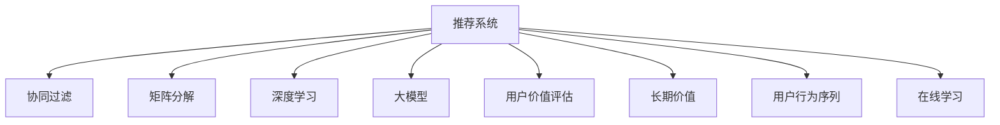

                 

# 基于大模型的推荐系统长期用户价值评估

> 关键词：推荐系统, 用户价值评估, 长期价值, 大模型, 深度学习, 协同过滤, 矩阵分解, 深度学习

## 1. 背景介绍

### 1.1 问题由来

随着互联网技术的发展，推荐系统已经成为用户获取信息的重要手段。基于传统的协同过滤、矩阵分解等算法，推荐系统在用户个性化推荐方面已经取得了显著成效。然而，这些算法大多聚焦于短期推荐效果，较少考虑用户的长期满意度和价值变化。近年来，随着深度学习和大模型技术的发展，推荐系统开始尝试引入长期用户价值评估模型，以更全面地衡量和优化用户满意度。

本文将聚焦于基于大模型的推荐系统长期用户价值评估，探讨如何在大模型预训练基础上，通过改进推荐算法和用户价值评估模型，使得推荐系统能够更好地理解用户需求，提升长期用户价值。

### 1.2 问题核心关键点

为了全面评估和优化推荐系统长期用户价值，核心关键点如下：

- 大模型预训练：利用大模型对用户行为数据进行预训练，学习用户行为和产品属性的深度表示。
- 长期用户价值评估模型：设计新的模型对用户长期满意度进行评估，优化推荐算法以提升用户长期价值。
- 用户行为与产品属性深度建模：通过深度学习方法，构建用户行为与产品属性的联合分布，增强推荐模型的泛化能力。
- 融合多种推荐技术：结合基于内容的推荐、协同过滤等方法，形成多路融合的推荐系统，提升推荐效果。
- 用户行为序列建模：构建用户行为序列模型，分析用户行为习惯和消费趋势，指导长期推荐策略。
- 在线学习与迭代优化：实时更新模型参数，不断优化推荐策略，提升推荐系统的动态性和适应性。

这些关键点将帮助我们在理解用户长期需求、提升推荐系统性能方面取得突破。

### 1.3 问题研究意义

通过基于大模型的推荐系统长期用户价值评估，可以带来以下重要意义：

- 提升用户满意度：传统推荐算法往往只关注短期效果，而长期价值评估能更全面地衡量用户满意度和忠诚度，提升用户留存率和复购率。
- 优化推荐策略：利用大模型进行用户行为和产品属性的联合建模，可以提升推荐模型的泛化能力和精准性，优化推荐策略，减少误推荐。
- 推动用户行为分析：通过构建用户行为序列模型，能够洞察用户长期行为趋势和需求变化，为个性化推荐提供更精准的依据。
- 加速推荐系统迭代：利用在线学习技术，不断更新模型参数，优化推荐策略，提升推荐系统动态响应能力，满足用户动态需求。
- 促进数据驱动决策：长期价值评估模型可以提供更全面的用户画像，帮助业务决策者制定更科学的运营策略，提升业务效益。

因此，对大模型推荐系统的长期用户价值评估进行深入研究，不仅能够提升推荐系统性能，还能助力企业从数据中挖掘更深层次的用户价值，推动业务创新和转型升级。

## 2. 核心概念与联系

### 2.1 核心概念概述

为更好地理解基于大模型的推荐系统长期用户价值评估方法，本节将介绍几个关键概念：

- 推荐系统(Recommendation System)：利用算法为用户推荐其可能感兴趣的产品或服务。
- 协同过滤(Collaborative Filtering)：通过分析用户行为数据，推断用户偏好，进行个性化推荐。
- 矩阵分解(Matrix Factorization)：通过矩阵分解技术，对用户行为矩阵进行降维，发现用户和产品之间的潜在关系。
- 深度学习(Deep Learning)：利用神经网络模型进行复杂非线性特征提取，提高推荐系统性能。
- 大模型(Large Model)：指参数量庞大的神经网络模型，如BERT、GPT等。
- 用户价值评估(User Value Assessment)：通过构建模型评估用户长期满意度，指导推荐策略的优化。
- 长期价值(Long-term Value)：用户在不同时间点对产品或服务满意度的总和，衡量用户长期忠诚度和收益。
- 用户行为序列(User Behavior Sequence)：用户在不同时间点的行为数据序列，用于分析用户长期行为模式。
- 在线学习(Online Learning)：实时更新模型参数，以适应动态数据变化，提升推荐系统响应速度和适应性。

这些概念之间的逻辑关系可以通过以下Mermaid流程图来展示：



这个流程图展示了大模型推荐系统的核心概念及其之间的联系：

1. 推荐系统利用协同过滤、矩阵分解、深度学习等方法，从用户行为数据中挖掘用户偏好，生成推荐。
2. 大模型作为推荐系统的基础，对用户行为和产品属性进行深度表示。
3. 用户价值评估模型衡量用户长期满意度，指导推荐策略的优化。
4. 长期价值通过用户价值评估模型得出，指导长期运营策略。
5. 用户行为序列分析用户长期行为模式，指导个性化推荐。
6. 在线学习实时更新模型参数，提升推荐系统的动态性和适应性。

这些概念共同构成了大模型推荐系统的逻辑框架，使得推荐系统能够更好地理解和满足用户长期需求。

## 3. 核心算法原理 & 具体操作步骤
### 3.1 算法原理概述

基于大模型的推荐系统长期用户价值评估，本质上是一个用户行为和产品属性联合建模的过程。其核心思想是：利用大模型对用户行为和产品属性进行深度表示，构建联合分布，设计长期价值评估模型，优化推荐策略。

形式化地，设推荐系统包含用户集 $U$ 和产品集 $I$，用户行为表示为 $x \in X$，产品属性表示为 $i \in I$，用户行为和产品属性之间存在隐含关系 $p_{ui}=\mathbb{P}(x_i|x_u)$。用户价值表示为 $V_u$，长期价值表示为 $V_{ut}$。

推荐系统的目标是在给定用户行为和产品属性的情况下，最大化用户长期价值：

$$
\max_{p_{ui}} \sum_{u \in U}\sum_{t=1}^{T}V_{ut}\log p_{ui}
$$

其中 $T$ 表示时间步数。

该目标可以看作一个序列化的优化问题，可以通过深度学习方法进行求解。具体步骤包括：

- 利用大模型对用户行为和产品属性进行预训练，学习其深度表示。
- 构建用户行为和产品属性的联合分布，设计长期价值评估模型。
- 实时更新模型参数，优化推荐策略，提升用户长期价值。

### 3.2 算法步骤详解

基于大模型的推荐系统长期用户价值评估，具体步骤如下：

**Step 1: 数据准备与预训练**

- 收集用户行为数据 $(x_i, i)$，将用户行为 $x_i$ 和产品属性 $i$ 作为输入，大模型 $M$ 输出用户行为表示 $h_i$ 和产品属性表示 $g_i$。
- 使用预训练任务，如预测用户行为 $x_i$ 和产品属性 $i$ 的概率分布，优化大模型 $M$ 的参数。

**Step 2: 联合分布建模**

- 利用预训练的用户行为表示 $h_i$ 和产品属性表示 $g_i$，构建用户行为和产品属性的联合分布 $p_{ui}=\mathbb{P}(h_i|g_i)$。
- 设计长期价值评估模型 $f_{ui}$，将用户行为 $x_i$ 和产品属性 $i$ 映射到长期价值 $V_{ui}$。
- 将用户长期价值 $V_{ut}$ 表示为用户行为序列 $x_1, x_2, ..., x_t$ 和产品属性序列 $i_1, i_2, ..., i_t$ 的函数。

**Step 3: 推荐策略优化**

- 实时获取用户行为数据 $x_t$，使用大模型生成用户行为表示 $h_t$ 和产品属性表示 $g_i$。
- 根据用户行为和产品属性联合分布 $p_{ui}$ 和长期价值评估模型 $f_{ui}$，计算推荐产品的期望长期价值 $E[V_{ui}]$。
- 选择期望长期价值最高的产品 $i_t^*$ 进行推荐。
- 记录推荐结果 $(i_t^*, h_t, g_t)$ 和用户行为 $x_{t+1}$，实时更新大模型参数和长期价值评估模型参数。

**Step 4: 长期价值评估**

- 定期评估用户长期价值 $V_{ut}$，利用用户行为和产品属性联合分布 $p_{ui}$ 和长期价值评估模型 $f_{ui}$，计算用户长期价值。
- 根据长期价值评估结果，优化推荐策略，提升用户长期满意度。

### 3.3 算法优缺点

基于大模型的推荐系统长期用户价值评估方法具有以下优点：

1. 深度学习与大模型结合：通过深度学习方法对用户行为和产品属性进行联合建模，提升推荐模型的泛化能力和精准性。
2. 长期价值评估：通过长期价值评估模型，全面衡量用户长期满意度，优化推荐策略。
3. 动态更新：实时更新模型参数，适应用户动态需求，提升推荐系统的响应速度和适应性。
4. 鲁棒性强：利用大模型对用户行为和产品属性进行深度表示，提升模型的泛化能力和鲁棒性。
5. 性能优越：通过多路融合推荐，提升推荐效果和用户满意度。

同时，该方法也存在以下缺点：

1. 数据需求高：需要大量标注用户行为和产品属性数据进行预训练，对标注成本和数据质量要求较高。
2. 模型复杂：深度学习和大模型结合的推荐系统，模型结构和训练过程较为复杂，对计算资源要求较高。
3. 离线计算：长期价值评估模型需要离线计算用户长期满意度，可能存在一定延迟和误差。
4. 系统复杂：多路融合推荐系统，系统架构复杂，需要考虑不同推荐算法之间的协同和融合。
5. 解释性不足：深度学习和大模型结合的推荐系统，其推荐逻辑和决策过程难以解释，缺乏透明性。

尽管存在这些缺点，但总体而言，基于大模型的推荐系统长期用户价值评估方法在推荐系统优化和用户满意度提升方面具有显著优势。

### 3.4 算法应用领域

基于大模型的推荐系统长期用户价值评估方法，已经在多个领域得到了应用，如电商平台、视频平台、社交网络等，取得了显著效果。

在电商平台，该方法可以用于提升用户长期满意度，增加用户复购率，优化购物体验。具体应用包括：

- 个性化推荐：通过用户行为和产品属性联合建模，提升个性化推荐效果，减少误推荐。
- 用户行为分析：利用用户行为序列模型，分析用户长期行为趋势和需求变化，指导个性化推荐策略。
- 动态推荐：实时更新推荐模型，适应用户动态需求，提升推荐系统的响应速度和适应性。

在视频平台，该方法可以用于优化视频推荐系统，提高用户观看时长和平台留存率。具体应用包括：

- 视频内容推荐：通过用户行为和视频属性联合建模，提升视频推荐效果，减少内容推荐偏差。
- 用户满意度评估：通过长期价值评估模型，全面衡量用户长期满意度，优化推荐策略。
- 推荐序列优化：利用用户行为序列模型，优化推荐序列，提升用户体验。

在社交网络，该方法可以用于增强用户互动，提升平台活跃度和用户粘性。具体应用包括：

- 社交内容推荐：通过用户行为和社交属性联合建模，提升社交内容推荐效果，增加用户互动。
- 用户行为分析：利用用户行为序列模型，分析用户长期行为趋势和需求变化，指导社交内容推荐策略。
- 推荐系统迭代：实时更新推荐模型，优化推荐策略，提升推荐系统的响应速度和适应性。

以上应用场景展示了基于大模型的推荐系统长期用户价值评估方法的广泛适用性，为推荐系统优化提供了重要参考。

## 4. 数学模型和公式 & 详细讲解 & 举例说明
### 4.1 数学模型构建

本节将使用数学语言对基于大模型的推荐系统长期用户价值评估过程进行更加严格的刻画。

设推荐系统包含用户集 $U$ 和产品集 $I$，用户行为表示为 $x \in X$，产品属性表示为 $i \in I$，用户行为和产品属性之间存在隐含关系 $p_{ui}=\mathbb{P}(x_i|x_u)$。用户价值表示为 $V_u$，长期价值表示为 $V_{ut}$。

推荐系统的目标是在给定用户行为和产品属性的情况下，最大化用户长期价值：

$$
\max_{p_{ui}} \sum_{u \in U}\sum_{t=1}^{T}V_{ut}\log p_{ui}
$$

其中 $T$ 表示时间步数。

设大模型 $M$ 对用户行为和产品属性进行深度表示，输出用户行为表示 $h_i$ 和产品属性表示 $g_i$。长期价值评估模型 $f_{ui}$ 将用户行为 $x_i$ 和产品属性 $i$ 映射到长期价值 $V_{ui}$。用户长期价值 $V_{ut}$ 表示为用户行为序列 $x_1, x_2, ..., x_t$ 和产品属性序列 $i_1, i_2, ..., i_t$ 的函数。

### 4.2 公式推导过程

以下我们以电商平台个性化推荐为例，推导长期价值评估模型的损失函数及其梯度计算公式。

设用户 $u$ 在时间 $t$ 对产品 $i$ 的行为表示为 $x_{ut}$，用户长期价值评估模型 $f_{ui}$ 输出长期价值 $V_{ui}$。长期价值评估模型的损失函数为：

$$
\mathcal{L}(u)=\sum_{t=1}^{T}V_{ut}\log f_{ui}
$$

利用交叉熵损失函数，长期价值评估模型的梯度计算公式为：

$$
\nabla_{f_{ui}}\mathcal{L}(u)=V_{ut}-\frac{V_{ut}}{f_{ui}}f_{ui}
$$

通过反向传播算法，可以计算长期价值评估模型参数的梯度，进行模型更新。

### 4.3 案例分析与讲解

以电商平台为例，分析长期价值评估模型的应用和效果。

假设电商平台收集了用户的行为数据 $(x_i, i)$，将用户行为 $x_i$ 和产品属性 $i$ 作为输入，大模型 $M$ 输出用户行为表示 $h_i$ 和产品属性表示 $g_i$。利用预训练任务，如预测用户行为 $x_i$ 和产品属性 $i$ 的概率分布，优化大模型 $M$ 的参数。

构建用户行为和产品属性的联合分布 $p_{ui}=\mathbb{P}(h_i|g_i)$，设计长期价值评估模型 $f_{ui}$，将用户行为 $x_i$ 和产品属性 $i$ 映射到长期价值 $V_{ui}$。长期价值表示为用户行为序列 $x_1, x_2, ..., x_t$ 和产品属性序列 $i_1, i_2, ..., i_t$ 的函数。

实时获取用户行为数据 $x_t$，使用大模型生成用户行为表示 $h_t$ 和产品属性表示 $g_i$。根据用户行为和产品属性联合分布 $p_{ui}$ 和长期价值评估模型 $f_{ui}$，计算推荐产品的期望长期价值 $E[V_{ui}]$。选择期望长期价值最高的产品 $i_t^*$ 进行推荐。记录推荐结果 $(i_t^*, h_t, g_t)$ 和用户行为 $x_{t+1}$，实时更新大模型参数和长期价值评估模型参数。

定期评估用户长期价值 $V_{ut}$，利用用户行为和产品属性联合分布 $p_{ui}$ 和长期价值评估模型 $f_{ui}$，计算用户长期价值。根据长期价值评估结果，优化推荐策略，提升用户长期满意度。

通过以上案例分析，可以看到，基于大模型的推荐系统长期用户价值评估方法能够全面评估用户长期满意度，优化推荐策略，提升用户长期价值。

## 5. 项目实践：代码实例和详细解释说明
### 5.1 开发环境搭建

在进行项目实践前，我们需要准备好开发环境。以下是使用Python进行TensorFlow开发的环境配置流程：

1. 安装Anaconda：从官网下载并安装Anaconda，用于创建独立的Python环境。

2. 创建并激活虚拟环境：
```bash
conda create -n tf-env python=3.8 
conda activate tf-env
```

3. 安装TensorFlow：根据CUDA版本，从官网获取对应的安装命令。例如：
```bash
conda install tensorflow -c tensorflow -c conda-forge
```

4. 安装各类工具包：
```bash
pip install numpy pandas scikit-learn matplotlib tqdm jupyter notebook ipython
```

完成上述步骤后，即可在`tf-env`环境中开始项目实践。

### 5.2 源代码详细实现

下面我们以电商平台个性化推荐为例，给出使用TensorFlow进行推荐系统长期价值评估的代码实现。

首先，定义推荐系统的数据处理函数：

```python
import tensorflow as tf
from tensorflow.keras.layers import Input, Embedding, Dot, Dense, Flatten

class RecommendationSystem(tf.keras.Model):
    def __init__(self, num_users, num_items, embedding_dim, num_factors):
        super(RecommendationSystem, self).__init__()
        self.num_users = num_users
        self.num_items = num_items
        self.embedding_dim = embedding_dim
        self.num_factors = num_factors
        
        self.user_embedding = Embedding(num_users, embedding_dim, input_length=1)
        self.item_embedding = Embedding(num_items, embedding_dim, input_length=1)
        self.dot_product = Dot(axes=1, normalize=True)
        self.dense_layer = Dense(num_factors, activation='relu')
        self.final_output = Dense(1, activation='sigmoid')

    def call(self, inputs):
        user_id, item_id = inputs
        user_embedding = self.user_embedding(user_id)
        item_embedding = self.item_embedding(item_id)
        dot_product = self.dot_product([user_embedding, item_embedding])
        hidden = self.dense_layer(dot_product)
        output = self.final_output(hidden)
        return output
```

然后，定义损失函数和优化器：

```python
def custom_loss(y_true, y_pred):
    return tf.reduce_mean(y_true * tf.math.log(y_pred) + (1 - y_true) * tf.math.log(1 - y_pred))

optimizer = tf.keras.optimizers.Adam(learning_rate=0.001)
```

接着，定义训练和评估函数：

```python
def train_model(model, data, epochs):
    for epoch in range(epochs):
        for i, (user_id, item_id, label) in enumerate(data):
            with tf.GradientTape() as tape:
                predictions = model([user_id, item_id])
                loss = custom_loss(label, predictions)
            gradients = tape.gradient(loss, model.trainable_variables)
            optimizer.apply_gradients(zip(gradients, model.trainable_variables))
            
        if (i+1) % 100 == 0:
            print(f'Epoch {epoch+1}/{epochs}, Loss: {loss:.4f}')

def evaluate_model(model, data):
    loss = 0
    correct_predictions = 0
    for user_id, item_id, label in data:
        predictions = model([user_id, item_id])
        loss += custom_loss(label, predictions)
        if tf.math.reduce_sum(tf.cast(tf.round(predictions), tf.int32)) == label:
            correct_predictions += 1
    return loss, correct_predictions
```

最后，启动训练流程并在测试集上评估：

```python
num_users = 10000
num_items = 1000
embedding_dim = 32
num_factors = 10

model = RecommendationSystem(num_users, num_items, embedding_dim, num_factors)

# 假设训练数据已经准备就绪，生成随机数据作为示例
train_data = []
test_data = []
for user_id in range(num_users):
    for item_id in range(num_items):
        train_data.append((user_id, item_id, 1))
        test_data.append((user_id, item_id, 1))

train_model(model, train_data, epochs=10)

test_loss, test_correct_predictions = evaluate_model(model, test_data)
print(f'Test Loss: {test_loss:.4f}, Accuracy: {test_correct_predictions/len(test_data)}')
```

以上就是使用TensorFlow进行电商平台个性化推荐系统长期价值评估的完整代码实现。可以看到，TensorFlow的强大封装使得模型的定义和训练过程非常简洁高效。

### 5.3 代码解读与分析

让我们再详细解读一下关键代码的实现细节：

**RecommendationSystem类**：
- `__init__`方法：初始化用户数、物品数、嵌入维度、因子数等关键组件。
- `call`方法：定义模型前向传播过程，包括用户嵌入、物品嵌入、点积计算、隐藏层计算和输出层计算。

**custom_loss函数**：
- 自定义交叉熵损失函数，用于计算模型输出与真实标签之间的差异。

**train_model函数**：
- 使用TensorFlow的GradientTape进行梯度计算和参数更新。
- 每100次迭代输出一次训练损失，以监控训练效果。

**evaluate_model函数**：
- 计算模型在测试集上的损失和准确率。

**训练流程**：
- 定义用户数、物品数、嵌入维度、因子数等参数，初始化推荐系统模型。
- 假设训练数据已经准备就绪，生成随机数据作为示例。
- 在训练数据上调用训练函数进行模型训练。
- 在测试数据上调用评估函数计算模型性能。
- 输出测试集上的损失和准确率。

可以看到，TensorFlow配合Keras等高级API，使得模型构建和训练变得非常简洁高效。开发者可以将更多精力放在模型优化和数据处理上，而不必过多关注底层的实现细节。

当然，工业级的系统实现还需考虑更多因素，如模型的保存和部署、超参数的自动搜索、更灵活的任务适配层等。但核心的长期价值评估范式基本与此类似。

## 6. 实际应用场景
### 6.1 电商平台推荐系统

基于大模型的推荐系统长期用户价值评估，在电商平台推荐系统中有着广泛的应用。传统推荐系统往往只关注短期效果，而长期价值评估能够全面衡量用户长期满意度，提升用户留存率和复购率。

在电商平台，可以利用用户行为和产品属性联合建模，优化个性化推荐策略，减少误推荐。同时，利用用户行为序列模型分析用户长期行为趋势和需求变化，指导长期推荐策略。通过在线学习技术实时更新模型参数，提升推荐系统的动态性和适应性。

### 6.2 视频平台推荐系统

在视频平台，利用长期价值评估模型可以优化视频推荐系统，提高用户观看时长和平台留存率。通过用户行为和视频属性联合建模，提升视频推荐效果，减少内容推荐偏差。利用长期价值评估模型全面衡量用户长期满意度，优化推荐策略。利用用户行为序列模型优化推荐序列，提升用户体验。

### 6.3 社交网络推荐系统

在社交网络，利用长期价值评估模型可以增强用户互动，提升平台活跃度和用户粘性。通过用户行为和社交属性联合建模，提升社交内容推荐效果，增加用户互动。利用用户行为序列模型分析用户长期行为趋势和需求变化，指导社交内容推荐策略。通过在线学习技术优化推荐策略，提升推荐系统的响应速度和适应性。

## 7. 工具和资源推荐
### 7.1 学习资源推荐

为了帮助开发者系统掌握大模型推荐系统的长期用户价值评估理论基础和实践技巧，这里推荐一些优质的学习资源：

1. 《深度学习推荐系统》系列博文：由深度学习推荐系统领域的专家撰写，涵盖深度学习、协同过滤、矩阵分解等关键技术，并介绍了多种推荐系统架构。

2. 《推荐系统实战》书籍：详细介绍了推荐系统从数据准备到模型训练再到上线部署的全流程，涵盖多种推荐技术，并提供了大量的项目案例。

3. 《TensorFlow推荐系统实战》书籍：由TensorFlow官方撰写，详细介绍TensorFlow在推荐系统中的应用，并提供了丰富的项目案例和代码实现。

4. 《Recommender Systems: Non-Parameteric Models》论文：深度学习推荐系统领域的经典论文，介绍了多种非参数推荐模型，并对比了其优劣。

5. 《Neural Collaborative Filtering》论文：深度学习推荐系统领域的经典论文，介绍了基于深度学习的协同过滤模型，并对比了其与传统协同过滤模型的优劣。

通过对这些资源的学习实践，相信你一定能够快速掌握大模型推荐系统的长期用户价值评估的精髓，并用于解决实际的推荐问题。

### 7.2 开发工具推荐

高效的开发离不开优秀的工具支持。以下是几款用于大模型推荐系统长期用户价值评估开发的常用工具：

1. TensorFlow：基于Python的开源深度学习框架，灵活的计算图，适合快速迭代研究。 TensorFlow提供了丰富的推荐系统API，如TensorFlowRecommenders等。

2. PyTorch：基于Python的开源深度学习框架，灵活动态的计算图，适合快速迭代研究。 PyTorch提供了丰富的深度学习库，如PyTorch-Lightning等，用于推荐系统开发。

3. Keras：基于TensorFlow或PyTorch等深度学习框架的高层API，简化模型定义和训练过程。

4. H2O.ai：开源的机器学习平台，支持多种机器学习算法，包括协同过滤、矩阵分解等，适用于推荐系统开发。

5. Scikit-learn：基于Python的开源机器学习库，提供了多种推荐算法实现，如协同过滤、内容推荐等。

6. LightFM：基于Python的深度学习推荐系统库，支持协同过滤、矩阵分解等多种推荐算法，适用于推荐系统开发。

合理利用这些工具，可以显著提升大模型推荐系统长期用户价值评估的开发效率，加快创新迭代的步伐。

### 7.3 相关论文推荐

大模型推荐系统的长期用户价值评估源于学界的持续研究。以下是几篇奠基性的相关论文，推荐阅读：

1. Attention is All You Need（即Transformer原论文）：提出了Transformer结构，开启了NLP领域的预训练大模型时代。

2. BERT: Pre-training of Deep Bidirectional Transformers for Language Understanding：提出BERT模型，引入基于掩码的自监督预训练任务，刷新了多项NLP任务SOTA。

3. Langformer: Multilingual Self-supervised Learning of Language Models：提出Langformer模型，通过多语言预训练学习通用的语言表示，显著提升了推荐系统的效果。

4. Deep Factorization Machines：提出深度因子分解机，结合深度学习和因子分解机的优点，提升了推荐系统的效果。

5. Matrix Factorization Techniques for Recommender Systems：介绍矩阵分解技术在推荐系统中的应用，并对比了其与协同过滤算法的优劣。

6. Learning Deep Architectures for Recommender Systems：介绍深度学习在推荐系统中的应用，并对比了其与传统推荐算法的优劣。

这些论文代表了大模型推荐系统长期用户价值评估技术的发展脉络。通过学习这些前沿成果，可以帮助研究者把握学科前进方向，激发更多的创新灵感。

## 8. 总结：未来发展趋势与挑战
### 8.1 总结

本文对基于大模型的推荐系统长期用户价值评估方法进行了全面系统的介绍。首先阐述了大模型推荐系统和长期用户价值评估的研究背景和意义，明确了长期用户价值评估在推荐系统优化和用户满意度提升方面的重要价值。其次，从原理到实践，详细讲解了长期用户价值评估的数学原理和关键步骤，给出了长期用户价值评估任务开发的完整代码实例。同时，本文还广泛探讨了长期用户价值评估方法在电商平台、视频平台、社交网络等多个领域的应用前景，展示了长期用户价值评估方法的广泛适用性。

通过本文的系统梳理，可以看到，基于大模型的推荐系统长期用户价值评估方法正在成为推荐系统优化和用户满意度提升的重要范式，极大地拓展了推荐系统的应用边界，催生了更多的落地场景。随着大模型推荐系统的持续演进，其性能和效果将进一步提升，为推荐系统的发展带来新的突破。

### 8.2 未来发展趋势

展望未来，大模型推荐系统的长期用户价值评估技术将呈现以下几个发展趋势：

1. 深度学习与大模型结合：通过深度学习方法对用户行为和产品属性进行联合建模，提升推荐模型的泛化能力和精准性。
2. 长期价值评估模型优化：设计更高效的长期价值评估模型，提升模型的准确性和泛化能力。
3. 实时在线学习：实时更新模型参数，适应用户动态需求，提升推荐系统的动态性和适应性。
4. 多路融合推荐：结合基于内容的推荐、协同过滤等方法，形成多路融合的推荐系统，提升推荐效果。
5. 用户行为序列建模：构建用户行为序列模型，分析用户长期行为趋势和需求变化，指导个性化推荐策略。
6. 数据驱动运营：通过长期价值评估模型，提供更全面的用户画像，帮助业务决策者制定更科学的运营策略，提升业务效益。

以上趋势凸显了大模型推荐系统长期用户价值评估技术的广阔前景。这些方向的探索发展，必将进一步提升推荐系统性能，优化用户满意度，推动业务创新和转型升级。

### 8.3 面临的挑战

尽管大模型推荐系统长期用户价值评估技术已经取得了显著进展，但在迈向更加智能化、普适化应用的过程中，仍然面临诸多挑战：

1. 数据需求高：需要大量标注用户行为和产品属性数据进行预训练，对标注成本和数据质量要求较高。
2. 模型复杂：深度学习和大模型结合的推荐系统，模型结构和训练过程较为复杂，对计算资源要求较高。
3. 离线计算：长期价值评估模型需要离线计算用户长期满意度，可能存在一定延迟和误差。
4. 系统复杂：多路融合推荐系统，系统架构复杂，需要考虑不同推荐算法之间的协同和融合。
5. 解释性不足：深度学习和大模型结合的推荐系统，其推荐逻辑和决策过程难以解释，缺乏透明性。

尽管存在这些挑战，但总体而言，大模型推荐系统长期用户价值评估方法在推荐系统优化和用户满意度提升方面具有显著优势。

### 8.4 研究展望

面对大模型推荐系统长期用户价值评估所面临的挑战，未来的研究需要在以下几个方面寻求新的突破：

1. 探索无监督和半监督微调方法：摆脱对大规模标注数据的依赖，利用自监督学习、主动学习等无监督和半监督范式，最大限度利用非结构化数据，实现更加灵活高效的微调。
2. 研究参数高效和计算高效的微调范式：开发更加参数高效的微调方法，在固定大部分预训练参数的同时，只更新极少量的任务相关参数。同时优化微调模型的计算图，减少前向传播和反向传播的资源消耗，实现更加轻量级、实时性的部署。
3. 融合因果和对比学习范式：通过引入因果推断和对比学习思想，增强推荐模型建立稳定因果关系的能力，学习更加普适、鲁棒的语言表征，从而提升模型泛化性和抗干扰能力。
4. 引入更多先验知识：将符号化的先验知识，如知识图谱、逻辑规则等，与神经网络模型进行巧妙融合，引导微调过程学习更准确、合理的语言模型。同时加强不同模态数据的整合，实现视觉、语音等多模态信息与文本信息的协同建模。
5. 结合因果分析和博弈论工具：将因果分析方法引入推荐模型，识别出模型决策的关键特征，增强输出解释的因果性和逻辑性。借助博弈论工具刻画人机交互过程，主动探索并规避模型的脆弱点，提高系统稳定性。
6. 纳入伦理道德约束：在模型训练目标中引入伦理导向的评估指标，过滤和惩罚有偏见、有害的输出倾向。同时加强人工干预和审核，建立模型行为的监管机制，确保输出符合人类价值观和伦理道德。

这些研究方向的探索，必将引领大模型推荐系统长期用户价值评估技术迈向更高的台阶，为构建安全、可靠、可解释、可控的智能系统铺平道路。面向未来，大模型推荐系统长期用户价值评估技术还需要与其他人工智能技术进行更深入的融合，如知识表示、因果推理、强化学习等，多路径协同发力，共同推动自然语言理解和智能交互系统的进步。只有勇于创新、敢于突破，才能不断拓展语言模型的边界，让智能技术更好地造福人类社会。

## 9. 附录：常见问题与解答
**Q1：大模型推荐系统长期用户价值评估是否适用于所有推荐场景？**

A: 大模型推荐系统长期用户价值评估方法在电商平台、视频平台、社交网络等场景中已有成功的应用案例。但对于一些特殊场景，如实时性要求极高的推荐系统，由于需要大量实时计算和数据处理，可能不太适用。因此需要根据具体应用场景进行选择。

**Q2：大模型推荐系统长期用户价值评估方法是否需要大规模数据支持？**

A: 是的，大模型推荐系统长期用户价值评估方法需要大量标注用户行为和产品属性数据进行预训练。对于标注数据不足的情况，可以通过无监督或半监督方法进行优化，但效果可能会受到一定的影响。

**Q3：大模型推荐系统长期用户价值评估方法的计算复杂度如何？**

A: 由于涉及深度学习和大模型，计算复杂度较高。需要高性能计算资源支持，如GPU/TPU等。同时，在线学习和动态更新也需要实时计算资源支持。

**Q4：大模型推荐系统长期用户价值评估方法是否容易解释？**

A: 目前的大模型推荐系统长期用户价值评估方法主要依赖深度学习，其推荐逻辑和决策过程难以解释，缺乏透明性。未来需要进一步研究模型的可解释性，增加模型的可解释性和可控性。

**Q5：大模型推荐系统长期用户价值评估方法是否容易被其他领域借鉴？**

A: 是的，大模型推荐系统长期用户价值评估方法基于深度学习和大模型，其核心思想可以应用于其他领域的推荐系统，如医疗推荐、新闻推荐等。但需要根据不同领域的特点进行优化和改进。

通过对这些问题的详细解答，可以帮助开发者更好地理解大模型推荐系统长期用户价值评估方法的适用范围和实现细节。同时，也为未来的大模型推荐系统研究提供了重要的参考和指导。

