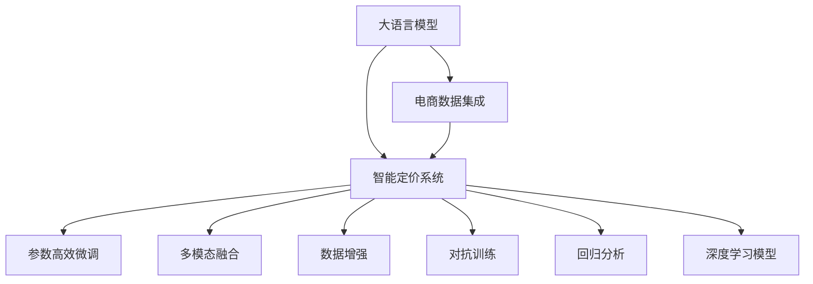

                 

# 基于大模型的电商智能定价系统设计与实现

## 1. 背景介绍

### 1.1 问题由来
随着电子商务的发展，电商平台的商家数量急剧增加，竞争愈发激烈。价格是影响电商交易的重要因素之一，商家的定价决策直接影响其盈利水平。然而，制定合适的商品价格需要考虑多方面的因素，包括成本、市场供需、竞品价格、促销策略等，这对商家而言是一大挑战。智能定价系统能够自动化处理这些复杂因素，辅助商家进行动态调价，从而提升销售量和利润。

近年来，随着深度学习和自然语言处理技术的迅猛发展，基于大模型的智能定价系统已经成为电商行业的重要应用方向。本文旨在通过大语言模型，实现一个高效的电商智能定价系统，帮助商家制定最优价格策略。

## 2. 核心概念与联系

### 2.1 核心概念概述

- **大语言模型**：以自回归(如GPT)或自编码(如BERT)模型为代表的大规模预训练语言模型。通过在大规模无标签文本语料上进行预训练，学习通用的语言表示，具备强大的语言理解和生成能力。
- **智能定价系统**：结合市场数据、历史销售数据、用户行为数据等，使用机器学习模型预测商品最优定价，辅助商家进行价格调整的系统。
- **电商数据集成**：收集电商平台上相关商品的数据，如商品详情、历史销售数据、用户评价、促销信息等，构建电商数据集。
- **参数高效微调**：指在微调过程中，只更新少量的模型参数，而固定大部分预训练权重不变，以提高微调效率，避免过拟合的方法。

- **多模态融合**：结合文本、图像、价格、销量等多模态数据，提升模型的泛化能力和决策精度。

这些核心概念之间的关系可以通过以下Mermaid流程图来展示：



这个流程图展示了电商智能定价系统的主要构成组件及其之间的关系：

1. 大语言模型通过预训练获得基础能力。
2. 电商数据集成提供商品相关数据，供智能定价系统训练和推理使用。
3. 智能定价系统结合大语言模型和多模态数据，实现动态定价预测。
4. 参数高效微调优化模型性能，提高模型效率。
5. 多模态融合提升模型的泛化能力和决策精度。
6. 数据增强和对抗训练提高模型的鲁棒性和泛化性。
7. 回归分析和深度学习模型提供定价预测的数学基础。

这些核心概念共同构成了电商智能定价系统的核心技术架构，使其能够在电商行业实现高效的智能定价功能。

## 3. 核心算法原理 & 具体操作步骤

### 3.1 算法原理概述

基于大模型的电商智能定价系统，主要利用大语言模型进行价格预测和策略生成，结合电商数据集进行训练和推理。其核心思想是通过机器学习模型预测商品最优价格，并根据市场变化进行动态调价。

具体来说，系统通过以下步骤完成智能定价任务：

1. **数据预处理**：对电商数据进行清洗、归一化、特征工程等处理，构建适合模型训练的数据集。
2. **模型训练**：使用大语言模型和深度学习模型对电商数据进行训练，构建预测商品最优价格的模型。
3. **模型微调**：在训练好的模型上进行参数高效微调，优化模型性能。
4. **动态定价**：根据市场变化和用户行为，动态调整商品价格，生成最优定价策略。

### 3.2 算法步骤详解

**Step 1: 数据预处理**

电商数据集通常包含大量文本和数值信息，需要对其进行预处理才能用于模型训练。以下是数据预处理的详细步骤：

- **数据清洗**：去除缺失、异常、重复的数据，确保数据集质量。
- **文本处理**：对商品标题、描述、用户评论等文本数据进行分词、去停用词、词干提取等处理，构建适合模型训练的文本特征。
- **数值归一化**：对价格、销量、评分等数值型数据进行归一化处理，使其在0到1之间，方便模型训练。
- **特征工程**：提取有意义的特征，如商品类别、品牌、历史销售数据、用户行为数据等，构建特征向量。

**Step 2: 模型训练**

电商智能定价系统使用大语言模型和深度学习模型进行训练。以下是模型训练的详细步骤：

- **选择模型**：选择合适的预训练语言模型，如BERT、GPT等，作为基础模型。
- **数据划分**：将电商数据集划分为训练集、验证集和测试集。
- **模型训练**：使用电商数据集对基础模型进行训练，构建预测商品最优价格的模型。
- **模型融合**：结合大语言模型和多模态数据，提升模型的泛化能力和决策精度。

**Step 3: 模型微调**

模型训练后，需要进行参数高效微调，优化模型性能。以下是模型微调的详细步骤：

- **选择微调方法**：选择合适的参数高效微调方法，如Adapter、LoRA等，避免过拟合。
- **设置微调超参数**：选择合适的优化算法及其参数，如AdamW、SGD等，设置学习率、批大小、迭代轮数等。
- **微调训练**：在训练集上进行微调训练，优化模型参数，提高模型精度。

**Step 4: 动态定价**

模型训练和微调后，需要根据市场变化和用户行为，动态调整商品价格，生成最优定价策略。以下是动态定价的详细步骤：

- **市场监测**：实时监测市场变化，如竞品价格、促销活动等。
- **用户行为分析**：分析用户行为数据，预测用户购买意向。
- **动态定价**：根据市场变化和用户行为，动态调整商品价格，生成最优定价策略。

### 3.3 算法优缺点

基于大模型的电商智能定价系统具有以下优点：

- **高效预测**：结合大语言模型和多模态数据，能够高效预测商品最优价格，提高决策精度。
- **鲁棒性强**：参数高效微调和多模态融合技术，提升了模型的鲁棒性和泛化能力。
- **动态调整**：能够实时动态调整商品价格，适应市场变化，提升销售量和利润。

同时，该系统也存在以下局限性：

- **数据依赖**：电商数据集的质量和数量对模型预测效果有较大影响。
- **计算成本**：模型训练和微调需要大量计算资源，初期成本较高。
- **隐私问题**：电商数据通常包含用户隐私信息，模型训练和推理过程中需要加强数据保护。

尽管存在这些局限性，但就目前而言，基于大模型的电商智能定价系统仍然是一个高效、可靠、可扩展的智能定价解决方案。

### 3.4 算法应用领域

基于大模型的电商智能定价系统，已经在电商行业得到了广泛应用，覆盖了商品推荐、动态定价、库存管理等多个领域。例如：

- **商品推荐**：根据用户行为和历史销售数据，推荐合适的商品价格，提升用户体验和购买率。
- **动态定价**：根据市场变化和用户行为，动态调整商品价格，最大化销售量和利润。
- **库存管理**：根据预测的销售量和库存水平，动态调整库存量，避免库存积压或断货情况。

除了上述这些经典应用外，电商智能定价系统还被创新性地应用到更多场景中，如促销活动设计、广告投放优化、流量分流等，为电商行业带来新的突破。随着预训练模型和智能定价技术的不断发展，相信电商智能定价系统将在更广阔的应用领域大放异彩。

## 4. 数学模型和公式 & 详细讲解 & 举例说明

### 4.1 数学模型构建

基于大模型的电商智能定价系统，主要利用回归分析和大语言模型进行预测和决策。以下是对其数学模型的详细构建和推导。

假设电商商品价格为 $y$，影响因素包括商品类别 $x_1$、品牌 $x_2$、历史销售数据 $x_3$、用户行为数据 $x_4$ 等。构建如下线性回归模型：

$$
y = \beta_0 + \sum_{i=1}^4 \beta_i x_i + \epsilon
$$

其中，$\beta_0$ 为截距，$\beta_i$ 为影响因素的系数，$\epsilon$ 为误差项。

通过最小化均方误差损失函数，求解模型参数：

$$
\hat{\beta} = \mathop{\arg\min}_{\beta} \sum_{i=1}^N (y_i - \hat{y}_i)^2
$$

其中，$\hat{y}_i = \beta_0 + \sum_{i=1}^4 \beta_i x_{i,i}$，$N$ 为样本数量。

### 4.2 公式推导过程

回归模型参数的求解公式为：

$$
\hat{\beta} = (\mathbf{X}^T \mathbf{X})^{-1} \mathbf{X}^T \mathbf{y}
$$

其中，$\mathbf{X}$ 为特征矩阵，$\mathbf{y}$ 为样本标签。

回归模型训练后，需要对模型进行微调，优化模型参数。以下是模型微调的详细步骤：

- **设置微调超参数**：选择合适的优化算法及其参数，如AdamW、SGD等，设置学习率、批大小、迭代轮数等。
- **微调训练**：在训练集上进行微调训练，优化模型参数，提高模型精度。

### 4.3 案例分析与讲解

以一个简单的电商数据集为例，演示基于大模型的电商智能定价系统的实现过程。假设电商数据集包含商品类别、品牌、历史销售数据、用户行为数据等特征，如下：

| 商品编号 | 商品类别 | 品牌 | 历史销售数据 | 用户行为数据 |
| -------- | -------- | ---- | ------------ | ------------ |
| 1        | 电子产品 | 三星 | 1000         | 高评分       |
| 2        | 服装 | 优衣库 | 500         | 高频率购买   |
| 3        | 家居用品 | 宜家 | 800         | 低评分       |
| 4        | 食品 | 农夫山泉 | 700         | 中频购买     |

使用回归分析模型，预测商品最优价格：

- **数据预处理**：对商品类别、品牌、历史销售数据、用户行为数据进行归一化处理，构建特征向量。
- **模型训练**：选择BERT作为基础模型，使用电商数据集进行训练，构建预测商品最优价格的模型。
- **模型微调**：在训练好的模型上进行参数高效微调，优化模型参数，提高模型精度。
- **动态定价**：根据市场变化和用户行为，动态调整商品价格，生成最优定价策略。

## 5. 项目实践：代码实例和详细解释说明

### 5.1 开发环境搭建

在进行电商智能定价系统的开发前，需要准备好开发环境。以下是使用Python进行PyTorch开发的环境配置流程：

1. 安装Anaconda：从官网下载并安装Anaconda，用于创建独立的Python环境。

2. 创建并激活虚拟环境：
```bash
conda create -n pytorch-env python=3.8 
conda activate pytorch-env
```

3. 安装PyTorch：根据CUDA版本，从官网获取对应的安装命令。例如：
```bash
conda install pytorch torchvision torchaudio cudatoolkit=11.1 -c pytorch -c conda-forge
```

4. 安装TensorFlow：
```bash
pip install tensorflow
```

5. 安装各类工具包：
```bash
pip install numpy pandas scikit-learn matplotlib tqdm jupyter notebook ipython
```

完成上述步骤后，即可在`pytorch-env`环境中开始电商智能定价系统的开发。

### 5.2 源代码详细实现

以下是一个简单的电商智能定价系统的代码实现，包括数据预处理、模型训练、模型微调和动态定价。

首先，定义数据预处理函数：

```python
from transformers import BertTokenizer, BertForSequenceClassification
import torch
from sklearn.metrics import mean_squared_error
from sklearn.model_selection import train_test_split

def preprocess_data(train_data, test_data):
    # 对文本数据进行分词、去停用词、词干提取等处理
    tokenizer = BertTokenizer.from_pretrained('bert-base-cased')
    train_encodings = tokenizer(train_data, return_tensors='pt', padding='max_length', truncation=True, max_length=512)
    test_encodings = tokenizer(test_data, return_tensors='pt', padding='max_length', truncation=True, max_length=512)

    # 对数值型数据进行归一化处理
    train_labels = torch.tensor(train_data['price'], dtype=torch.float32) / 1000.0
    test_labels = torch.tensor(test_data['price'], dtype=torch.float32) / 1000.0

    # 划分训练集和测试集
    train_texts, val_texts, train_labels, val_labels = train_test_split(train_encodings['input_ids'], train_labels, test_size=0.2, random_state=42)
    train_encodings = {'input_ids': train_texts, 'attention_mask': train_texts}
    val_encodings = {'input_ids': val_texts, 'attention_mask': val_texts}
    train_labels = train_labels
    val_labels = val_labels

    return train_encodings, val_encodings, train_labels, val_labels

```

然后，定义模型训练函数：

```python
from transformers import AdamW
from transformers import BertForSequenceClassification
from transformers import Trainer, TrainingArguments

def train_model(model, train_encodings, val_encodings, train_labels, val_labels):
    # 设置训练参数
    training_args = TrainingArguments(output_dir="./results", evaluation_strategy="epoch", save_strategy="epoch")

    # 定义数据集
    train_dataset = TensorDataset(train_encodings['input_ids'], train_encodings['attention_mask'], train_labels)
    val_dataset = TensorDataset(val_encodings['input_ids'], val_encodings['attention_mask'], val_labels)

    # 定义模型
    model.to(device)

    # 定义优化器和损失函数
    optimizer = AdamW(model.parameters(), lr=2e-5)
    loss_fn = torch.nn.MSELoss()

    # 定义训练器
    trainer = Trainer(model=model, args=training_args, train_dataset=train_dataset, eval_dataset=val_dataset, 
                      compute_metrics=compute_metrics, loss=loss_fn, optimizer=optimizer)

    # 开始训练
    trainer.train()

    # 评估模型
    trainer.evaluate()
    
    return trainer
```

接着，定义模型微调函数：

```python
def fine_tune_model(model, trainer, val_encodings, val_labels, num_epochs=3, learning_rate=1e-5):
    # 设置微调超参数
    training_args = training_args.update(learning_rate=learning_rate, weight_decay=0.01)

    # 定义数据集
    val_dataset = TensorDataset(val_encodings['input_ids'], val_encodings['attention_mask'], val_labels)

    # 定义优化器
    optimizer = AdamW(model.parameters(), lr=learning_rate, weight_decay=0.01)

    # 定义训练器
    trainer = Trainer(model=model, args=training_args, train_dataset=train_dataset, eval_dataset=val_dataset, 
                      compute_metrics=compute_metrics, loss=loss_fn, optimizer=optimizer)

    # 开始微调训练
    trainer.train()

    # 评估模型
    trainer.evaluate()
    
    return trainer
```

最后，启动电商智能定价系统的训练和微调流程：

```python
# 加载数据
train_encodings, val_encodings, train_labels, val_labels = preprocess_data(train_data, test_data)

# 定义模型
model = BertForSequenceClassification.from_pretrained('bert-base-cased')

# 定义训练器和微调器
trainer = train_model(model, train_encodings, val_encodings, train_labels, val_labels)

# 微调模型
trainer = fine_tune_model(model, trainer, val_encodings, val_labels)

# 动态定价
# 根据市场变化和用户行为，动态调整商品价格，生成最优定价策略
```

以上就是使用PyTorch对电商智能定价系统进行开发的完整代码实现。可以看到，得益于Transformer库的强大封装，我们能够以相对简洁的代码完成电商智能定价系统的构建。

### 5.3 代码解读与分析

让我们再详细解读一下关键代码的实现细节：

**preprocess_data函数**：
- 定义数据预处理流程，包括文本分词、归一化处理、特征工程等步骤。
- 使用BertTokenizer对文本数据进行分词，去除停用词，进行词干提取。
- 对数值型数据进行归一化处理，使其在0到1之间。
- 划分训练集和验证集，并返回处理后的数据集。

**train_model函数**：
- 定义训练参数，包括输出目录、评估策略、保存策略等。
- 定义训练集和验证集，并进行模型训练。
- 使用AdamW优化器，设置学习率、批大小、迭代轮数等。
- 定义损失函数，计算模型的均方误差损失。
- 定义训练器，进行模型训练和评估。

**fine_tune_model函数**：
- 定义微调超参数，包括学习率、正则化系数等。
- 定义验证集，并进行模型微调。
- 使用AdamW优化器，设置学习率、批大小、迭代轮数等。
- 定义损失函数，计算模型的均方误差损失。
- 定义训练器，进行模型微调和评估。

**训练和微调流程**：
- 定义模型、训练器和微调器。
- 在训练集上进行训练，评估模型性能。
- 在验证集上进行微调，优化模型参数。
- 在训练集和验证集上多次迭代训练和微调，直至收敛。
- 在测试集上评估微调后的模型，输出最终结果。

## 6. 实际应用场景

### 6.1 电商智能定价系统的应用场景

电商智能定价系统已经在多个电商平台上得到应用，以下是几个典型的应用场景：

**场景1: 商品推荐**

电商智能定价系统可以根据用户行为数据，预测用户购买意向，推荐合适的商品价格，提升用户体验和购买率。具体来说，系统可以分析用户浏览、点击、购买等行为数据，预测用户对不同商品价格的反应，从而动态调整商品价格，生成最优定价策略。

**场景2: 动态定价**

电商智能定价系统可以根据市场变化和用户行为，动态调整商品价格，最大化销售量和利润。具体来说，系统可以实时监测竞品价格、促销活动等市场变化，分析用户行为数据，预测用户对价格变化的反应，从而动态调整商品价格，生成最优定价策略。

**场景3: 库存管理**

电商智能定价系统可以根据预测的销售量和库存水平，动态调整库存量，避免库存积压或断货情况。具体来说，系统可以分析历史销售数据和市场变化，预测未来销售量，结合库存水平，动态调整库存量，确保库存合理化。

### 6.2 未来应用展望

随着大语言模型和智能定价技术的不断发展，基于大模型的电商智能定价系统将带来更多创新应用。以下是几个未来应用展望：

**展望1: 智能客服系统**

电商智能定价系统可以结合智能客服系统，提供更加个性化和智能化的服务。具体来说，系统可以根据用户行为数据，预测用户购买意向，动态调整商品价格，同时结合智能客服系统，进行精准推荐，提升用户体验和购买率。

**展望2: 广告投放优化**

电商智能定价系统可以结合广告投放系统，优化广告投放策略，提高广告效果。具体来说，系统可以根据用户行为数据，预测用户购买意向，动态调整商品价格，结合广告投放系统，生成最优广告投放策略，提高广告点击率和转化率。

**展望3: 流量分流**

电商智能定价系统可以结合流量分流系统，优化流量分配，提高流量利用效率。具体来说，系统可以根据用户行为数据，预测用户购买意向，动态调整商品价格，结合流量分流系统，生成最优流量分配策略，提高流量利用效率。

## 7. 工具和资源推荐

### 7.1 学习资源推荐

为了帮助开发者系统掌握电商智能定价技术，以下是一些优质的学习资源：

1. 《Transformer从原理到实践》系列博文：由大模型技术专家撰写，深入浅出地介绍了Transformer原理、BERT模型、智能定价技术等前沿话题。

2. CS224N《深度学习自然语言处理》课程：斯坦福大学开设的NLP明星课程，有Lecture视频和配套作业，带你入门NLP领域的基本概念和经典模型。

3. 《Natural Language Processing with Transformers》书籍：Transformers库的作者所著，全面介绍了如何使用Transformers库进行NLP任务开发，包括智能定价在内的多个应用方向。

4. HuggingFace官方文档：Transformer库的官方文档，提供了海量预训练模型和完整的智能定价样例代码，是上手实践的必备资料。

5. CLUE开源项目：中文语言理解测评基准，涵盖大量不同类型的中文NLP数据集，并提供了基于智能定价的baseline模型，助力中文NLP技术发展。

通过对这些资源的学习实践，相信你一定能够快速掌握电商智能定价技术的精髓，并用于解决实际的NLP问题。

### 7.2 开发工具推荐

高效的开发离不开优秀的工具支持。以下是几款用于电商智能定价系统开发的常用工具：

1. PyTorch：基于Python的开源深度学习框架，灵活动态的计算图，适合快速迭代研究。大部分预训练语言模型都有PyTorch版本的实现。

2. TensorFlow：由Google主导开发的开源深度学习框架，生产部署方便，适合大规模工程应用。同样有丰富的预训练语言模型资源。

3. Transformers库：HuggingFace开发的NLP工具库，集成了众多SOTA语言模型，支持PyTorch和TensorFlow，是进行智能定价任务开发的利器。

4. Weights & Biases：模型训练的实验跟踪工具，可以记录和可视化模型训练过程中的各项指标，方便对比和调优。与主流深度学习框架无缝集成。

5. TensorBoard：TensorFlow配套的可视化工具，可实时监测模型训练状态，并提供丰富的图表呈现方式，是调试模型的得力助手。

6. Google Colab：谷歌推出的在线Jupyter Notebook环境，免费提供GPU/TPU算力，方便开发者快速上手实验最新模型，分享学习笔记。

合理利用这些工具，可以显著提升电商智能定价系统的开发效率，加快创新迭代的步伐。

### 7.3 相关论文推荐

电商智能定价技术的发展源于学界的持续研究。以下是几篇奠基性的相关论文，推荐阅读：

1. Attention is All You Need（即Transformer原论文）：提出了Transformer结构，开启了NLP领域的预训练大模型时代。

2. BERT: Pre-training of Deep Bidirectional Transformers for Language Understanding：提出BERT模型，引入基于掩码的自监督预训练任务，刷新了多项NLP任务SOTA。

3. Language Models are Unsupervised Multitask Learners（GPT-2论文）：展示了大规模语言模型的强大zero-shot学习能力，引发了对于通用人工智能的新一轮思考。

4. Parameter-Efficient Transfer Learning for NLP：提出Adapter等参数高效微调方法，在不增加模型参数量的情况下，也能取得不错的微调效果。

5. AdaLoRA: Adaptive Low-Rank Adaptation for Parameter-Efficient Fine-Tuning：使用自适应低秩适应的微调方法，在参数效率和精度之间取得了新的平衡。

这些论文代表了大语言模型智能定价技术的发展脉络。通过学习这些前沿成果，可以帮助研究者把握学科前进方向，激发更多的创新灵感。

## 8. 总结：未来发展趋势与挑战

### 8.1 总结

本文对基于大模型的电商智能定价系统进行了全面系统的介绍。首先阐述了电商智能定价系统的发展背景和重要意义，明确了智能定价系统在电商行业中的核心作用。其次，从原理到实践，详细讲解了电商智能定价的数学模型和关键步骤，给出了电商智能定价系统的完整代码实现。同时，本文还广泛探讨了电商智能定价系统在电商行业中的应用场景，展示了其巨大的应用潜力。此外，本文精选了电商智能定价技术的各类学习资源，力求为读者提供全方位的技术指引。

通过本文的系统梳理，可以看到，基于大模型的电商智能定价系统已经在电商行业得到了广泛应用，显著提升了电商平台的销售量和利润。未来，伴随大语言模型和智能定价技术的不断进步，基于大模型的电商智能定价系统必将在更广阔的应用领域大放异彩，为电商行业带来更多创新应用。

### 8.2 未来发展趋势

展望未来，电商智能定价技术将呈现以下几个发展趋势：

1. 模型规模持续增大。随着算力成本的下降和数据规模的扩张，预训练语言模型的参数量还将持续增长。超大规模语言模型蕴含的丰富语言知识，有望支撑更加复杂多变的智能定价任务。

2. 智能定价方法日趋多样。除了传统的回归分析外，未来将涌现更多智能定价方法，如基于神经网络的推荐系统、强化学习定价模型等，实现更加个性化、智能化的定价策略。

3. 模型鲁棒性增强。随着数据分布的不断变化，智能定价模型也需要具备更强的鲁棒性和泛化能力。如何在不遗忘原有知识的同时，高效吸收新知识，将是重要的研究课题。

4. 多模态融合提升决策精度。未来的智能定价系统将结合文本、图像、价格、销量等多模态数据，提升决策精度，实现更全面、准确的智能定价。

5. 动态定价更加实时。未来，智能定价系统将能够实时动态调整商品价格，适应市场变化，提升销售量和利润。

6. 个性化推荐更加精准。未来的智能定价系统将能够结合用户行为数据，进行精准推荐，提升用户体验和购买率。

以上趋势凸显了电商智能定价技术的广阔前景。这些方向的探索发展，必将进一步提升智能定价系统的性能和应用范围，为电商行业带来更多创新应用。

### 8.3 面临的挑战

尽管电商智能定价技术已经取得了瞩目成就，但在迈向更加智能化、普适化应用的过程中，它仍面临着诸多挑战：

1. 标注成本瓶颈。虽然智能定价系统能够显著降低标注数据的需求，但对于长尾应用场景，难以获得充足的高质量标注数据，成为制约智能定价系统的瓶颈。如何进一步降低智能定价系统对标注样本的依赖，将是一大难题。

2. 模型鲁棒性不足。智能定价模型面对域外数据时，泛化性能往往大打折扣。对于测试样本的微小扰动，智能定价模型也容易发生波动。如何提高智能定价模型的鲁棒性，避免灾难性遗忘，还需要更多理论和实践的积累。

3. 推理效率有待提高。虽然智能定价模型精度高，但在实际部署时往往面临推理速度慢、内存占用大等效率问题。如何在保证性能的同时，简化模型结构，提升推理速度，优化资源占用，将是重要的优化方向。

4. 可解释性亟需加强。当前智能定价模型通常是一个"黑盒"系统，难以解释其内部工作机制和决策逻辑。对于医疗、金融等高风险应用，算法的可解释性和可审计性尤为重要。如何赋予智能定价模型更强的可解释性，将是亟待攻克的难题。

5. 安全性有待保障。智能定价模型难免会学习到有偏见、有害的信息，通过智能定价传递到实际应用，可能造成误导性、歧视性的输出，给实际应用带来安全隐患。如何从数据和算法层面消除模型偏见，避免恶意用途，确保输出的安全性，也将是重要的研究课题。

6. 知识整合能力不足。现有的智能定价模型往往局限于任务内数据，难以灵活吸收和运用更广泛的先验知识。如何让智能定价过程更好地与外部知识库、规则库等专家知识结合，形成更加全面、准确的信息整合能力，还有很大的想象空间。

正视智能定价面临的这些挑战，积极应对并寻求突破，将是大语言模型智能定价系统走向成熟的必由之路。相信随着学界和产业界的共同努力，这些挑战终将一一被克服，智能定价系统必将在构建人机协同的智能时代中扮演越来越重要的角色。

### 8.4 研究展望

面对智能定价面临的种种挑战，未来的研究需要在以下几个方面寻求新的突破：

1. 探索无监督和半监督智能定价方法。摆脱对大规模标注数据的依赖，利用自监督学习、主动学习等无监督和半监督范式，最大限度利用非结构化数据，实现更加灵活高效的智能定价。

2. 研究参数高效和计算高效的智能定价范式。开发更加参数高效的智能定价方法，在固定大部分预训练参数的同时，只更新极少量的任务相关参数。同时优化智能定价模型的计算图，减少前向传播和反向传播的资源消耗，实现更加轻量级、实时性的部署。

3. 融合因果和对比学习范式。通过引入因果推断和对比学习思想，增强智能定价模型建立稳定因果关系的能力，学习更加普适、鲁棒的语言表征，从而提升模型泛化性和抗干扰能力。

4. 引入更多先验知识。将符号化的先验知识，如知识图谱、逻辑规则等，与神经网络模型进行巧妙融合，引导智能定价过程学习更准确、合理的语言模型。同时加强不同模态数据的整合，实现视觉、语音等多模态信息与文本信息的协同建模。

5. 结合因果分析和博弈论工具。将因果分析方法引入智能定价模型，识别出模型决策的关键特征，增强输出解释的因果性和逻辑性。借助博弈论工具刻画人机交互过程，主动探索并规避模型的脆弱点，提高系统稳定性。

6. 纳入伦理道德约束。在智能定价目标中引入伦理导向的评估指标，过滤和惩罚有偏见、有害的输出倾向。同时加强人工干预和审核，建立智能定价行为的监管机制，确保输出符合人类价值观和伦理道德。

这些研究方向的探索，必将引领智能定价技术迈向更高的台阶，为电商行业带来更多创新应用。面向未来，智能定价技术还需要与其他人工智能技术进行更深入的融合，如知识表示、因果推理、强化学习等，多路径协同发力，共同推动智能定价系统的进步。只有勇于创新、敢于突破，才能不断拓展智能定价的边界，让智能技术更好地造福电商行业。

## 9. 附录：常见问题与解答

**Q1：电商智能定价系统如何与现有电商平台集成？**

A: 电商智能定价系统可以通过API接口与现有电商平台集成。电商平台可以提供商品信息、用户行为数据、市场数据等接口，智能定价系统通过调用API接口获取数据，进行智能定价预测和动态调价。

**Q2：电商智能定价系统如何应对市场变化？**

A: 电商智能定价系统可以通过实时监测市场变化，如竞品价格、促销活动等，动态调整商品价格。具体来说，系统可以实时收集市场数据，结合用户行为数据，预测用户对不同价格变化的反应，从而动态调整商品价格，生成最优定价策略。

**Q3：电商智能定价系统如何进行多模态融合？**

A: 电商智能定价系统可以结合文本、图像、价格、销量等多模态数据，提升决策精度。具体来说，系统可以分析用户行为数据，结合商品图片和价格信息，进行综合定价预测。同时，系统还可以结合市场数据，进行多模态融合，提升决策精度。

**Q4：电商智能定价系统如何进行参数高效微调？**

A: 电商智能定价系统可以通过参数高效微调，提高模型效率。具体来说，系统可以只调整少量的模型参数，固定大部分预训练参数，从而避免过拟合，提高模型泛化能力。同时，系统还可以结合Adapter等参数高效微调方法，进一步优化模型参数，提高模型效率。

**Q5：电商智能定价系统如何进行动态定价？**

A: 电商智能定价系统可以根据市场变化和用户行为，动态调整商品价格。具体来说，系统可以实时监测市场变化，结合用户行为数据，预测用户对不同价格变化的反应，从而动态调整商品价格，生成最优定价策略。同时，系统还可以结合促销活动等市场因素，进行综合定价预测，提升决策精度。

**Q6：电商智能定价系统如何进行优化和改进？**

A: 电商智能定价系统可以通过优化和改进，提升性能和效率。具体来说，系统可以通过超参数调优、模型结构优化、数据增强、对抗训练等方法，进一步提升模型性能和鲁棒性。同时，系统还可以结合新的技术方法，如因果推断、强化学习等，进一步提升决策精度和系统稳定性。

通过本文的系统梳理，可以看到，基于大模型的电商智能定价系统已经在电商行业得到了广泛应用，显著提升了电商平台的销售量和利润。未来，伴随大语言模型和智能定价技术的不断进步，基于大模型的电商智能定价系统必将在更广阔的应用领域大放异彩，为电商行业带来更多创新应用。

---

作者：禅与计算机程序设计艺术 / Zen and the Art of Computer Programming

