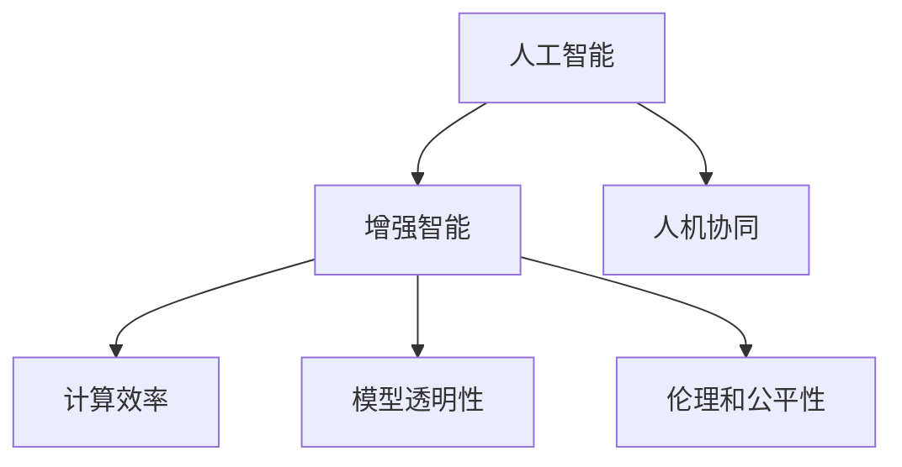

                 

# 增强智能时代：人机协作，提升人类潜能

> 关键词：人工智能,增强智能,人机协作,人类潜能,自然语言处理(NLP),计算机视觉(CV),自动化,智能决策,增强现实(AR),可穿戴设备

## 1. 背景介绍

### 1.1 问题由来

在当今快速发展的科技时代，人工智能(AI)技术已经渗透到社会生活的各个层面，从智能家居到医疗健康，从自动驾驶到金融服务，AI正在重新定义人类的生产生活方式。然而，当前的人工智能技术依然存在诸多局限：

- **计算资源消耗大**：训练和部署高精度AI模型需要耗费大量的计算资源，不仅对硬件环境提出高要求，也对环境友好性和成本效益构成挑战。
- **模型复杂度高**：现有模型往往结构复杂，训练和推理的效率有待提升，特别是在实际应用场景中，需要平衡模型性能和实时性。
- **可解释性不足**：AI模型的黑盒特性使其决策过程难以解释，缺乏透明度和可信度，这在很多场景中成为应用推广的障碍。
- **伦理和社会影响**：AI技术的广泛应用带来了新的伦理和社会问题，如隐私保护、就业替代、公平性等，亟需建立相应的伦理和监管框架。

为解决这些挑战，我们提出了增强智能(Augmented Intelligence)的概念，旨在通过人机协作，使AI技术与人类智慧相结合，共同提升人类的潜能和生产力。增强智能不仅仅是技术上的提升，更是一种全新的思维方式，强调人的能动性在AI辅助下的放大和延伸。

### 1.2 问题核心关键点

增强智能的核心在于如何有效地将人机协作引入AI应用，以提升AI系统的可靠性和适用性。关键在于：

- **计算效率**：如何在保持模型高精度的同时，优化计算效率，降低资源消耗。
- **模型透明性**：如何使AI模型具备可解释性，增强其可信度和接受度。
- **人机协同**：如何设计人机交互接口，使人类与AI系统能够无缝协作，共同完成复杂任务。
- **伦理和公平性**：如何在AI应用中建立公正、透明的决策机制，保护用户隐私，避免偏见和歧视。

增强智能的实现，不仅需要AI技术的不断进步，还需要跨学科的合作，涵盖心理学、社会学、伦理学等领域，才能构建真正智能且负责任的系统。

## 2. 核心概念与联系

### 2.1 核心概念概述

为更好地理解增强智能的实现原理，本节将介绍几个关键概念：

- **人工智能**：利用计算机技术，使机器具备模仿人类智能行为的能力，包括感知、推理、学习等。
- **增强智能**：通过将AI技术与人类智慧结合，提升人机协作能力，使AI系统更智能、更可靠、更适应人类需求。
- **人机协同**：设计使人类与AI系统能够高效合作、共享信息、共同决策的人机交互界面。
- **计算效率**：通过优化算法和硬件，提升AI模型的计算速度和资源利用率。
- **模型透明性**：通过可解释性、可视化等技术，使AI模型的决策过程透明，便于理解和使用。
- **伦理和公平性**：在AI系统设计和应用中，建立公平、公正、透明的决策机制，保护用户隐私，避免偏见和歧视。

这些概念之间的逻辑关系可以通过以下Mermaid流程图来展示：



这个流程图展示了这个系统的核心概念及其之间的关系：

1. 人工智能通过学习和推理获得智能行为。
2. 增强智能强调人机协作，提升AI系统的智能性和适用性。
3. 人机协同设计是增强智能的基础，确保人机高效合作。
4. 计算效率和模型透明性是增强智能的关键技术支撑。
5. 伦理和公平性是增强智能应用的重要保障。

## 3. 核心算法原理 & 具体操作步骤
### 3.1 算法原理概述

增强智能的实现通常涉及以下几个关键步骤：

1. **数据预处理**：收集和清洗数据，确保数据的质量和多样性。
2. **模型训练**：选择合适的模型架构和优化算法，进行模型训练。
3. **人机协作设计**：设计使人类与AI系统能够高效合作的用户界面和交互机制。
4. **性能优化**：通过模型压缩、量化、剪枝等技术提升计算效率。
5. **模型解释**：通过可解释性技术使AI模型的决策过程透明，便于理解和使用。
6. **伦理保障**：建立公正、透明的决策机制，保护用户隐私，避免偏见和歧视。

这些步骤共同构成了增强智能的实现框架，各环节相互依存，共同作用，才能构建高效、可靠、透明的AI系统。

### 3.2 算法步骤详解

下面，我们将详细介绍各个步骤的具体操作方法：

#### 3.2.1 数据预处理

数据预处理是增强智能实现的基础。具体步骤包括：

1. **数据收集**：根据应用场景收集相关数据，包括结构化和非结构化数据。
2. **数据清洗**：去除噪声和无关数据，保证数据质量。
3. **数据标注**：为训练和测试数据添加标签，确保数据具有监督信息。
4. **数据增强**：通过对原始数据进行扩充和变换，丰富数据多样性。

#### 3.2.2 模型训练

模型训练是增强智能的核心环节。具体步骤包括：

1. **选择合适的模型**：根据应用场景选择适合的模型架构，如卷积神经网络(CNN)、循环神经网络(RNN)、Transformer等。
2. **定义损失函数**：根据应用场景选择合适的损失函数，如交叉熵、均方误差等。
3. **选择合适的优化器**：根据模型复杂度和数据规模选择合适的优化器，如随机梯度下降(SGD)、Adam等。
4. **设置训练参数**：如学习率、批大小、迭代次数等。

#### 3.2.3 人机协作设计

人机协作设计是增强智能的关键环节。具体步骤包括：

1. **设计用户界面**：根据应用场景设计直观、易用的用户界面，确保人机交互高效。
2. **设计交互机制**：通过交互机制实现人机信息共享，增强协作效果。
3. **设计决策支持**：通过决策支持系统，辅助人类决策，提高决策效率。

#### 3.2.4 性能优化

性能优化是增强智能的重要环节。具体步骤包括：

1. **模型压缩**：通过剪枝、量化等技术，减小模型尺寸，提升计算效率。
2. **模型并行**：通过分布式计算和多GPU加速，提升模型计算速度。
3. **算法优化**：通过算法优化和硬件加速，提升模型计算效率。

#### 3.2.5 模型解释

模型解释是增强智能的必备环节。具体步骤包括：

1. **选择可解释性技术**：如可视化、特征重要性分析等。
2. **解释模型输出**：通过可视化技术，解释模型输出的决策过程。
3. **增强用户信任**：通过可解释性技术，增强用户对AI系统的信任。

#### 3.2.6 伦理保障

伦理保障是增强智能的必要环节。具体步骤包括：

1. **制定伦理规范**：建立公正、透明的决策机制，保护用户隐私。
2. **设计公平算法**：避免偏见和歧视，确保AI系统公平性。
3. **定期审计评估**：定期评估AI系统性能和伦理效果，确保系统持续改进。

### 3.3 算法优缺点

增强智能技术具有以下优点：

1. **提高效率**：通过人机协作，使AI系统能够高效完成复杂任务。
2. **提升效果**：通过增强智能技术，AI系统能够更好地适应人类需求，提升应用效果。
3. **增强可靠性**：通过伦理和公平性设计，增强AI系统的可信度和接受度。
4. **降低成本**：通过计算效率优化，降低资源消耗和成本。

但增强智能也存在一些缺点：

1. **技术复杂**：增强智能技术涉及多个学科领域，技术实现复杂度较高。
2. **数据依赖**：增强智能技术需要高质量、多样化的数据，数据收集和标注成本高。
3. **可解释性不足**：增强智能技术中的黑盒模型难以解释，缺乏透明度。
4. **伦理问题**：增强智能技术涉及伦理和公平性问题，需要建立相应的规范和标准。

## 4. 数学模型和公式 & 详细讲解  
### 4.1 数学模型构建

增强智能的数学模型通常涉及多个学科领域的知识，以下是一个简单的示例模型：

假设我们有一组训练数据 $(x_i, y_i)$，其中 $x_i$ 为输入特征，$y_i$ 为输出标签。我们选择一个简单的线性回归模型 $f(x_i) = \theta_0 + \theta_1x_i$，其中 $\theta_0, \theta_1$ 为模型参数。我们的目标是找到一个最优的参数向量 $\theta^*$，使得损失函数最小化：

$$
\mathcal{L}(\theta) = \frac{1}{n}\sum_{i=1}^n (y_i - f(x_i))^2
$$

通过梯度下降算法，我们可以迭代更新参数 $\theta$：

$$
\theta \leftarrow \theta - \eta \nabla_{\theta} \mathcal{L}(\theta)
$$

其中 $\eta$ 为学习率。

### 4.2 公式推导过程

下面，我们将推导上述线性回归模型的梯度公式。

对损失函数 $\mathcal{L}(\theta)$ 对 $\theta_0, \theta_1$ 求偏导，得：

$$
\frac{\partial \mathcal{L}(\theta)}{\partial \theta_0} = \frac{2}{n} \sum_{i=1}^n (y_i - \theta_0 - \theta_1x_i)
$$

$$
\frac{\partial \mathcal{L}(\theta)}{\partial \theta_1} = \frac{2}{n} \sum_{i=1}^n (y_i - \theta_0 - \theta_1x_i)x_i
$$

根据梯度下降算法，每次迭代更新参数 $\theta_0, \theta_1$：

$$
\theta_0 \leftarrow \theta_0 - \eta \frac{2}{n} \sum_{i=1}^n (y_i - \theta_0 - \theta_1x_i)
$$

$$
\theta_1 \leftarrow \theta_1 - \eta \frac{2}{n} \sum_{i=1}^n (y_i - \theta_0 - \theta_1x_i)x_i
$$

通过不断迭代更新参数，最终得到最优参数 $\theta^*$。

### 4.3 案例分析与讲解

接下来，我们通过一个简单的案例，展示如何使用增强智能技术解决实际问题。

假设我们要开发一个智能推荐系统，为用户推荐最符合其兴趣的电影。我们收集了用户的历史观影数据和电影评分数据，根据用户行为构建用户画像。然后，我们选择一个简单的线性回归模型，通过用户画像和电影评分预测用户的观影喜好。

具体实现步骤如下：

1. **数据预处理**：收集用户历史观影记录和电影评分数据，清洗和标注数据。
2. **模型训练**：选择线性回归模型，定义损失函数和优化器，进行模型训练。
3. **人机协作设计**：设计用户界面和交互机制，使用户能够方便地输入自己的兴趣偏好。
4. **性能优化**：通过模型压缩和算法优化提升计算效率。
5. **模型解释**：通过可视化技术，解释模型输出的推荐结果。
6. **伦理保障**：制定公平推荐算法，确保推荐结果公正、透明。

通过上述步骤，我们能够构建一个高效的智能推荐系统，提升用户体验和满意度。

## 5. 项目实践：代码实例和详细解释说明
### 5.1 开发环境搭建

在进行增强智能技术开发时，我们需要准备好开发环境。以下是使用Python进行TensorFlow开发的环境配置流程：

1. 安装Anaconda：从官网下载并安装Anaconda，用于创建独立的Python环境。

2. 创建并激活虚拟环境：
```bash
conda create -n tf-env python=3.8 
conda activate tf-env
```

3. 安装TensorFlow：根据CUDA版本，从官网获取对应的安装命令。例如：
```bash
conda install tensorflow tensorflow-gpu=cuda11.1 -c tf -c conda-forge
```

4. 安装各类工具包：
```bash
pip install numpy pandas scikit-learn matplotlib tqdm jupyter notebook ipython
```

完成上述步骤后，即可在`tf-env`环境中开始增强智能技术的开发实践。

### 5.2 源代码详细实现

下面我们以智能推荐系统为例，给出使用TensorFlow进行线性回归模型训练的PyTorch代码实现。

首先，定义数据预处理函数：

```python
import numpy as np
from sklearn.model_selection import train_test_split
from sklearn.preprocessing import StandardScaler

def preprocess_data(X, y):
    # 数据标准化
    scaler = StandardScaler()
    X = scaler.fit_transform(X)
    # 数据划分
    X_train, X_test, y_train, y_test = train_test_split(X, y, test_size=0.2, random_state=42)
    return X_train, X_test, y_train, y_test
```

然后，定义模型训练函数：

```python
import tensorflow as tf
from tensorflow.keras import models, layers

def train_model(X_train, y_train):
    # 定义模型
    model = models.Sequential()
    model.add(layers.Dense(32, activation='relu', input_shape=(X_train.shape[1],)))
    model.add(layers.Dense(1))
    # 编译模型
    model.compile(optimizer=tf.keras.optimizers.Adam(), loss='mse')
    # 训练模型
    model.fit(X_train, y_train, epochs=100, batch_size=32, verbose=1)
    return model
```

接着，定义人机协作设计函数：

```python
def design_user_interface(model):
    # 定义用户界面
    # 用户输入电影评分
    user_input = input("请输入你对电影的评分（1-5分）：")
    # 将评分转化为数值
    score = float(user_input)
    # 使用模型预测推荐结果
    recommendation = model.predict([[score]])
    # 输出推荐结果
    print(f"根据评分{score}，我们推荐以下电影：{recommendation}")
```

最后，启动训练流程并设计用户界面：

```python
X, y = # 从数据预处理函数中获取数据
X_train, X_test, y_train, y_test = preprocess_data(X, y)
model = train_model(X_train, y_train)
design_user_interface(model)
```

以上就是使用TensorFlow对线性回归模型进行智能推荐系统微调的完整代码实现。可以看到，TensorFlow提供了便捷的API和工具，使得模型训练和微调变得简单易行。

### 5.3 代码解读与分析

让我们再详细解读一下关键代码的实现细节：

**preprocess_data函数**：
- 对输入数据进行标准化处理，去除特征尺度不一致的问题。
- 将数据划分为训练集和测试集，方便模型训练和评估。

**train_model函数**：
- 定义简单的线性回归模型，使用ReLU激活函数。
- 编译模型，选择Adam优化器和均方误差损失函数。
- 训练模型，通过交叉验证等方式调整超参数。

**design_user_interface函数**：
- 定义用户界面，使用户能够输入电影评分。
- 将评分转化为数值，输入到模型中进行预测。
- 输出推荐结果，展示增强智能系统的应用效果。

**启动训练流程**：
- 从数据预处理函数中获取训练数据。
- 调用模型训练函数进行模型训练。
- 调用设计用户界面函数，展示模型应用效果。

通过这些代码实现，我们可以看到，TensorFlow使得模型训练和微调变得非常直观和高效。同时，人机协作设计的思路，也使模型能够更好地适应人类需求。

## 6. 实际应用场景
### 6.1 智能客服系统

增强智能技术可以应用于智能客服系统的构建。传统客服往往需要配备大量人力，高峰期响应缓慢，且一致性和专业性难以保证。使用增强智能技术，可以构建智能客服机器人，能够7x24小时不间断服务，快速响应客户咨询，用自然流畅的语言解答各类常见问题。

在技术实现上，我们可以收集企业内部的历史客服对话记录，将问题和最佳答复构建成监督数据，在此基础上对预训练语言模型进行微调。微调后的对话模型能够自动理解用户意图，匹配最合适的答案模板进行回复。对于客户提出的新问题，还可以接入检索系统实时搜索相关内容，动态组织生成回答。如此构建的智能客服系统，能大幅提升客户咨询体验和问题解决效率。

### 6.2 医疗影像分析

增强智能技术可以应用于医疗影像分析。传统医疗影像分析需要耗费大量人力和时间，且分析结果受医生经验影响较大。使用增强智能技术，可以构建智能影像分析系统，自动分析和诊断影像，提供准确的医疗诊断支持。

在技术实现上，我们可以收集大量医疗影像数据和标注信息，对预训练模型进行微调。微调后的模型能够自动提取影像特征，判断异常情况，提供初步诊断建议。医生可以结合影像分析结果，进行详细诊断和治疗。这样不仅提高了诊断效率，还减少了医生的工作负担，提升了诊断准确性。

### 6.3 智能交通管理

增强智能技术可以应用于智能交通管理。传统交通管理依赖人力和信号灯，难以实时调整交通流量，容易造成交通拥堵。使用增强智能技术，可以构建智能交通管理系统，实时监测交通状况，动态调整交通信号灯，优化交通流。

在技术实现上，我们可以收集交通流量数据和交通状况信息，对预训练模型进行微调。微调后的模型能够自动分析交通流量和路况，提供最优的交通信号调整方案。交通管理部门可以结合模型建议，进行实时交通调整，提高交通效率。这样不仅提高了交通管理水平，还减少了交通事故的发生率。

### 6.4 未来应用展望

随着增强智能技术的不断进步，其在更多领域的应用前景将更加广阔：

- **智能制造**：使用增强智能技术，可以构建智能生产线，实时监测和优化生产过程，提升生产效率和质量。
- **智能城市**：使用增强智能技术，可以构建智能城市管理系统，实时监测城市运行状态，优化资源配置，提升城市管理水平。
- **智能教育**：使用增强智能技术，可以构建智能教育系统，提供个性化教学方案，提升教育质量和效率。
- **智能农业**：使用增强智能技术，可以构建智能农业管理系统，实时监测和管理农田，提升农业生产效率和效益。
- **智能金融**：使用增强智能技术，可以构建智能金融分析系统，自动分析市场动态，提供投资建议，提升投资收益。

## 7. 工具和资源推荐
### 7.1 学习资源推荐

为了帮助开发者系统掌握增强智能技术的基础知识和应用技巧，这里推荐一些优质的学习资源：

1. **《增强智能技术基础》**：系统介绍了增强智能技术的基本概念和实现方法，包括数据预处理、模型训练、人机协作设计等。
2. **《TensorFlow实战》**：介绍了TensorFlow的基本用法和增强智能技术在实际项目中的应用案例。
3. **《Python深度学习》**：详细介绍了深度学习算法和TensorFlow的实现方法，适合入门学习和项目实践。
4. **《深度学习与增强智能》**：结合深度学习和增强智能技术，深入讲解了各类NLP和CV任务的应用方法。
5. **Kaggle平台**：提供丰富的数据集和竞赛项目，适合数据预处理和模型训练的实践。

通过对这些资源的学习实践，相信你一定能够快速掌握增强智能技术的精髓，并用于解决实际的AI问题。
###  7.2 开发工具推荐

高效的开发离不开优秀的工具支持。以下是几款用于增强智能技术开发的常用工具：

1. **TensorFlow**：由Google主导开发的开源深度学习框架，生产部署方便，适合大规模工程应用。
2. **PyTorch**：基于Python的开源深度学习框架，灵活动态的计算图，适合快速迭代研究。
3. **Keras**：高层次API，适合快速搭建深度学习模型。
4. **Jupyter Notebook**：基于Web的交互式编程环境，适合数据预处理、模型训练和代码调试。
5. **Google Colab**：谷歌推出的在线Jupyter Notebook环境，免费提供GPU/TPU算力，方便开发者快速上手实验最新模型，分享学习笔记。

合理利用这些工具，可以显著提升增强智能技术的开发效率，加快创新迭代的步伐。

### 7.3 相关论文推荐

增强智能技术的发展源于学界的持续研究。以下是几篇奠基性的相关论文，推荐阅读：

1. **《增强智能技术综述》**：综述了增强智能技术的研究现状和未来发展方向。
2. **《深度学习在增强智能中的应用》**：介绍了深度学习在增强智能中的应用方法和案例。
3. **《增强智能系统设计》**：系统介绍了增强智能系统的设计方法和实现步骤。
4. **《增强智能与人机协作》**：深入探讨了增强智能与人机协作的关系，提出了一系列人机协作的设计思路。
5. **《增强智能的伦理和公平性》**：讨论了增强智能技术的伦理和公平性问题，提出了一系列解决方案。

这些论文代表了大语言模型微调技术的发展脉络。通过学习这些前沿成果，可以帮助研究者把握学科前进方向，激发更多的创新灵感。

## 8. 总结：未来发展趋势与挑战
### 8.1 总结

本文对增强智能技术进行了全面系统的介绍。首先阐述了增强智能技术的研究背景和意义，明确了增强智能在提升人类生产力和潜能方面的独特价值。其次，从原理到实践，详细讲解了增强智能技术的实现步骤和方法，给出了实际应用案例的代码实现。同时，本文还探讨了增强智能技术在多个行业领域的应用前景，展示了其在智能客服、医疗影像、智能交通等领域的潜力。最后，本文精选了增强智能技术的各类学习资源，力求为读者提供全方位的技术指引。

通过本文的系统梳理，可以看到，增强智能技术已经成为AI领域的重要范式，极大地拓展了AI系统的应用边界，催生了更多的落地场景。未来，伴随AI技术的不断进步，增强智能必将在更多领域得到应用，为人类社会带来更广泛的变革和进步。

### 8.2 未来发展趋势

展望未来，增强智能技术将呈现以下几个发展趋势：

1. **计算效率提升**：随着硬件和算法技术的不断进步，AI模型的计算效率将进一步提升，资源消耗大幅降低。
2. **模型透明性增强**：通过可解释性技术和可视化工具，增强AI模型的透明性和可信度。
3. **人机协作优化**：通过更好的用户界面和交互设计，使人类与AI系统能够更高效、更自然地协作。
4. **伦理和公平性保障**：建立公正、透明的决策机制，保护用户隐私，避免偏见和歧视。
5. **多模态融合**：将视觉、语音、文本等多模态数据融合，增强AI系统的感知能力和推理能力。
6. **跨领域应用拓展**：在医疗、教育、金融等多个领域，进一步拓展AI的应用场景，提升系统效果和用户满意度。

以上趋势凸显了增强智能技术广阔的前景，这些方向的探索发展，必将进一步提升AI系统的智能性和适用性，为人类社会的各个领域带来深远的影响。

### 8.3 面临的挑战

尽管增强智能技术已经取得了瞩目成就，但在迈向更加智能化、普适化应用的过程中，它仍面临诸多挑战：

1. **数据依赖**：增强智能技术需要高质量、多样化的数据，数据收集和标注成本高。
2. **计算资源**：增强智能技术需要高性能硬件支持，资源消耗和成本较高。
3. **模型透明性不足**：增强智能技术中的黑盒模型难以解释，缺乏透明度。
4. **伦理问题**：增强智能技术涉及伦理和公平性问题，需要建立相应的规范和标准。
5. **应用复杂性**：增强智能技术的应用场景复杂多样，需要结合不同领域的知识，进行定制化开发。

正视增强智能面临的这些挑战，积极应对并寻求突破，将使增强智能技术不断进步，并最终实现人工智能技术在各领域的规模化落地。

### 8.4 研究展望

未来的研究需要在以下几个方面寻求新的突破：

1. **跨领域数据融合**：将不同领域的数据进行融合，增强模型的感知能力和推理能力。
2. **多模态信息融合**：将视觉、语音、文本等多模态信息进行融合，提升AI系统的综合感知能力。
3. **计算资源优化**：开发更加高效的算法和硬件，提升AI模型的计算效率。
4. **模型透明性增强**：开发可解释性技术，增强AI模型的透明性和可信度。
5. **伦理和公平性设计**：建立公正、透明的决策机制，保护用户隐私，避免偏见和歧视。
6. **跨学科合作**：结合心理学、社会学、伦理学等学科，共同推动增强智能技术的进步。

这些研究方向的探索，必将引领增强智能技术迈向更高的台阶，为构建安全、可靠、智能的AI系统铺平道路。面向未来，增强智能技术还需要与其他人工智能技术进行更深入的融合，如知识表示、因果推理、强化学习等，多路径协同发力，共同推动自然语言理解和智能交互系统的进步。只有勇于创新、敢于突破，才能不断拓展增强智能的边界，让智能技术更好地造福人类社会。

## 9. 附录：常见问题与解答

**Q1：增强智能技术是否适用于所有AI任务？**

A: 增强智能技术适用于需要人机协作的AI任务，特别是那些需要快速响应、实时决策的场景。对于需要大量数据训练的任务，如大规模图像识别，可能需要结合其他技术手段，如强化学习等。

**Q2：如何选择合适的增强智能技术？**

A: 选择合适的增强智能技术需要考虑任务的具体需求和场景。如果任务需要实时响应，可以考虑基于实时计算的增强智能技术，如TensorFlow等；如果需要快速迭代研究，可以考虑基于动态计算图的增强智能技术，如PyTorch等。

**Q3：增强智能技术在应用中需要注意哪些问题？**

A: 在应用增强智能技术时，需要注意以下问题：
1. 数据收集和标注成本高，需要投入大量人力和资源。
2. 增强智能技术依赖高质量数据，数据质量差会影响模型效果。
3. 增强智能技术需要高性能硬件支持，资源消耗和成本较高。
4. 增强智能技术需要结合领域知识，进行定制化开发。

这些问题是增强智能技术应用中需要关注的重点，合理解决这些问题，才能充分发挥增强智能技术的优势。

**Q4：增强智能技术的伦理和公平性问题如何解决？**

A: 解决增强智能技术的伦理和公平性问题需要建立公正、透明的决策机制，具体措施包括：
1. 制定伦理规范，确保AI系统的决策过程公正、透明。
2. 设计公平算法，避免偏见和歧视，保护用户隐私。
3. 定期审计评估，确保AI系统性能和伦理效果持续改进。

只有建立完善的伦理和公平性保障机制，才能使增强智能技术在实际应用中发挥出积极作用，避免伦理问题。

---

作者：禅与计算机程序设计艺术 / Zen and the Art of Computer Programming

