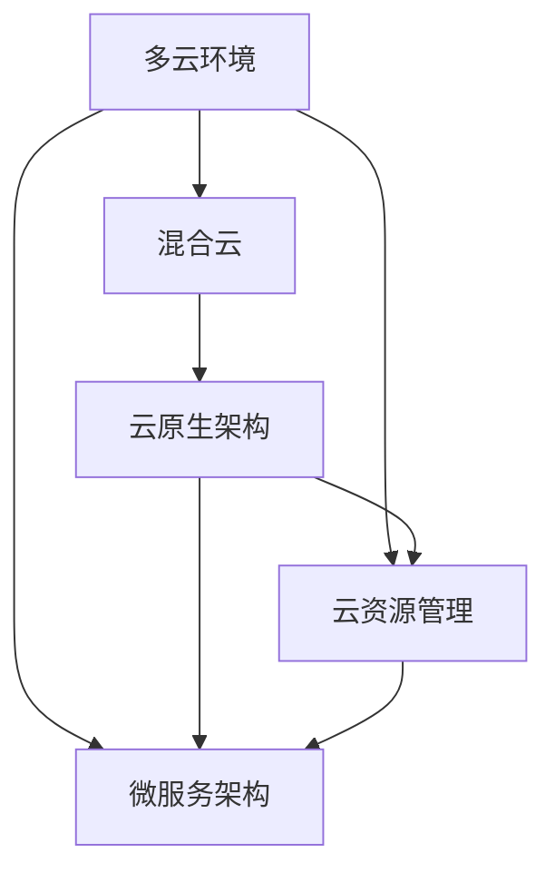

                 

# 多云战略：混合云环境下的应用部署

> 关键词：多云环境,混合云,应用部署,云资源管理,云原生架构,微服务架构

## 1. 背景介绍

随着云计算的快速发展，越来越多的企业开始将业务迁移到云上，享受云服务带来的便捷和灵活性。然而，单一云平台的局限性逐渐显现，企业需要跨越多个云环境，以实现更广泛、更稳定的业务部署和运营。在此背景下，混合云成为越来越多企业的首选，旨在通过优化跨云资源管理和应用部署策略，提升业务连续性和灵活性。

### 1.1 问题由来
当前，越来越多的企业将业务部署在多个云平台，以应对数据中心的地域分布、资源利用率、成本等因素带来的挑战。例如，企业可能会在公有云如AWS、Azure和Google Cloud上部署应用，同时在私有云或本地数据中心进行敏感数据处理。这不仅增加了IT运维的复杂性，还带来了数据一致性、安全性等方面的问题。

如何更好地管理这些跨云资源，如何在混合云环境中高效部署应用，成为企业IT团队面临的重要挑战。本文将深入探讨多云战略，聚焦于混合云环境下的应用部署，介绍相关核心概念和最佳实践，为读者提供参考和指导。

### 1.2 问题核心关键点
混合云环境下的应用部署主要包括以下几个核心关键点：

1. **跨云资源管理**：管理和优化跨云平台的资源分配和使用，确保不同云平台间的资源互通、互操作。
2. **应用部署和迁移**：将应用程序从一种云平台迁移到另一种，或同时在多种云平台部署，以实现更高效的应用性能和业务连续性。
3. **数据一致性和安全性**：确保不同云平台上的数据一致性和安全性，避免数据丢失、泄露等风险。
4. **成本优化**：根据不同云平台的特点，灵活调整资源使用策略，降低总体IT成本。
5. **弹性伸缩**：根据业务需求动态调整资源规模，确保系统的高可用性和性能。

本文将围绕上述关键点，详细探讨混合云环境下的应用部署策略和实践。

## 2. 核心概念与联系

### 2.1 核心概念概述

为更好地理解混合云环境下的应用部署，本节将介绍几个密切相关的核心概念：

- **多云环境(Multicloud Environment)**：指企业同时使用多个云平台进行业务部署和运行，以应对不同场景的需求，提升业务灵活性和安全性。
- **混合云(Hybrid Cloud)**：多云环境的一种，通常结合私有云、公有云和边缘计算等资源，以实现灵活的资源管理和应用部署。
- **云原生架构(Cloud-Native Architecture)**：基于微服务、容器化、声明式配置等技术构建的应用架构，支持在多个云平台间无缝迁移和扩展。
- **微服务架构(Microservice Architecture)**：将大型应用拆分成多个小型服务模块，每个模块独立运行、独立部署、独立扩展，以提升应用的灵活性和可维护性。
- **云资源管理(Cloud Resource Management)**：对云平台上的资源进行规划、分配、监控和优化，以确保资源的合理使用和最大化利用。

这些核心概念之间的逻辑关系可以通过以下Mermaid流程图来展示：



这个流程图展示了几者的关系：

1. 多云环境是混合云的一种具体形式，结合多种云平台资源。
2. 混合云通常采用云原生架构，以实现资源的灵活管理和应用的平滑迁移。
3. 云原生架构的核心是微服务，通过独立的模块实现应用的可扩展和灵活性。
4. 云资源管理贯穿多云环境，对云平台资源进行监控和优化。

## 3. 核心算法原理 & 具体操作步骤
### 3.1 算法原理概述

混合云环境下的应用部署，本质上是对云资源和应用进行合理的规划、分配和优化。其核心思想是：通过跨云资源的管理和优化，结合云原生架构和微服务技术，实现应用的弹性伸缩和高效部署。

形式化地，假设企业有 $N$ 个云平台，每个云平台支持 $M$ 种资源，需要部署的应用 $A$ 包括多个微服务模块 $S_1, S_2, ..., S_M$。部署的目标是：

- 根据不同云平台的特点和资源可用性，优化资源分配，以最小化总体成本。
- 通过微服务架构，将应用拆分成多个独立的服务模块，提升应用的可维护性和灵活性。
- 在多个云平台之间无缝迁移应用，确保业务连续性。

为了达到上述目标，本文将介绍以下关键算法步骤：

1. **资源规划与分配**：根据应用需求和云平台特性，合理规划和分配资源。
2. **应用拆分与部署**：将应用拆分成多个微服务模块，并在不同云平台部署。
3. **跨云数据同步**：确保不同云平台上的数据一致性，避免数据丢失和泄露。
4. **弹性伸缩与负载均衡**：根据业务需求动态调整资源规模，确保系统的稳定性和性能。

### 3.2 算法步骤详解

**Step 1: 资源规划与分配**

1. **云平台选择**：根据应用特点和资源需求，选择合适的云平台。
2. **资源需求分析**：评估应用对不同资源的依赖关系，如CPU、内存、存储等。
3. **资源分配策略**：制定资源分配策略，如按需分配、负载均衡等。

**Step 2: 应用拆分与部署**

1. **应用模块划分**：将应用拆分成多个独立的服务模块，每个模块独立运行、独立部署、独立扩展。
2. **服务部署规划**：根据资源需求和云平台特性，规划每个服务模块的部署位置。
3. **服务部署**：在选择的云平台上部署服务模块，确保服务的高可用性和可扩展性。

**Step 3: 跨云数据同步**

1. **数据一致性策略**：制定数据一致性策略，确保不同云平台上的数据同步。
2. **数据同步机制**：实现数据在多个云平台间的同步机制，如基于消息队列的数据流。
3. **数据安全性**：采取加密、访问控制等措施，确保数据在传输和存储中的安全性。

**Step 4: 弹性伸缩与负载均衡**

1. **负载均衡策略**：制定负载均衡策略，确保不同云平台之间的流量均衡。
2. **弹性伸缩策略**：根据业务需求和资源利用率，动态调整资源规模，实现弹性伸缩。
3. **性能监控与优化**：实时监控系统性能，根据反馈调整资源分配策略，优化性能。

### 3.3 算法优缺点

混合云环境下的应用部署方法具有以下优点：

1. **资源优化**：通过合理的资源规划和分配，最大化资源利用率，降低总体成本。
2. **应用灵活性**：通过微服务架构，提升应用的可扩展性和灵活性，适应不断变化的需求。
3. **业务连续性**：通过跨云资源管理和数据同步，确保业务在多个云平台间的连续性和稳定性。

同时，该方法也存在一些局限性：

1. **复杂性增加**：跨云部署增加了IT运维的复杂性，需要更多的管理和监控资源。
2. **成本不确定性**：云平台的价格策略和资源利用率可能变化，导致成本预测和控制难度增加。
3. **一致性维护**：数据在多个云平台之间的同步和一致性维护，可能面临技术挑战和风险。
4. **安全性问题**：跨云部署需要考虑多云平台的安全策略，避免安全漏洞和风险。

尽管存在这些局限性，但混合云环境下的应用部署方法仍为众多企业所采纳，以其灵活性和业务连续性见长。未来相关研究的重点在于如何进一步降低复杂性、提高一致性和安全性，同时兼顾成本和性能。

### 3.4 算法应用领域

混合云环境下的应用部署方法已经广泛应用于多个领域，如金融、制造、零售、政府等。以下是几个典型应用场景：

- **金融行业**：通过混合云环境，金融机构可以在不同云平台部署交易系统、风险管理、客户服务等功能，以提升业务连续性和处理能力。
- **制造企业**：制造业企业通过混合云环境，实现供应链管理、生产调度、设备监控等功能，提高生产效率和设备利用率。
- **零售行业**：零售企业通过混合云环境，实现订单处理、库存管理、客户服务等功能，提升客户体验和运营效率。
- **政府机构**：政府机构通过混合云环境，实现电子政务、公共安全、城市管理等功能，提升公共服务水平和治理能力。

## 4. 数学模型和公式 & 详细讲解 & 举例说明

### 4.1 数学模型构建

为更好地理解混合云环境下的应用部署，本节将使用数学语言对相关问题进行更加严格的刻画。

假设企业有 $N$ 个云平台，每个云平台支持 $M$ 种资源，需要部署的应用 $A$ 包括多个微服务模块 $S_1, S_2, ..., S_M$。

定义资源需求函数为 $R_i(j)$，表示云平台 $i$ 上资源 $j$ 的需求量。定义资源分配函数为 $C_i(j)$，表示云平台 $i$ 上资源 $j$ 的实际分配量。定义成本函数为 $C_i(j)$，表示云平台 $i$ 上资源 $j$ 的单位成本。

定义应用模块的资源需求矩阵为 $R=[R_{i,j}]_{N \times M}$，定义资源分配矩阵为 $C=[C_{i,j}]_{N \times M}$，定义成本矩阵为 $C=[C_{i,j}]_{N \times M}$。

部署的目标是：

$$
\min_{C} \sum_{i=1}^N \sum_{j=1}^M C_{i,j} \cdot C_i(j) \cdot C_j(i) \\
\text{s.t.} \sum_{j=1}^M C_{i,j} \cdot R_i(j) = R_i(1) \\
C_{i,j} \geq 0, \forall i, j
$$

其中，第一个条件表示资源需求等于实际分配量，第二个条件表示资源分配应满足应用需求。

### 4.2 公式推导过程

上述问题是一个线性规划问题，可以通过求解线性规划模型得到最优资源分配方案。

设 $x_{i,j}$ 表示云平台 $i$ 上资源 $j$ 的实际分配量，定义优化变量为 $x=[x_{i,j}]_{N \times M}$，则问题可以转化为：

$$
\min_{x} \sum_{i=1}^N \sum_{j=1}^M C_{i,j} \cdot x_{i,j} \cdot R_i(j) \\
\text{s.t.} \sum_{j=1}^M x_{i,j} \cdot R_i(j) = R_i(1) \\
x_{i,j} \geq 0, \forall i, j
$$

通过求解上述线性规划问题，可以找到一个最优的资源分配方案，使得总体成本最小化，同时满足应用需求。

在实际应用中，可以通过求解上述线性规划问题的对偶问题，得到最优分配方案和资源利用率。具体的求解方法和工具，可以参考线性规划相关的文献和软件。

### 4.3 案例分析与讲解

**案例：某金融公司混合云环境下的应用部署**

某金融公司需要在混合云环境下部署多个应用模块，包括交易系统、风控系统、客户服务系统等。每个应用模块对不同资源的依赖关系如下：

| 应用模块 | CPU需求 | 内存需求 | 存储需求 |
| --------- | ------ | ------ | ------ |
| 交易系统 | 5核CPU | 16GB内存 | 2TB存储 |
| 风控系统 | 2核CPU | 8GB内存 | 1TB存储 |
| 客户服务 | 2核CPU | 4GB内存 | 500GB存储 |

公司计划使用AWS和Azure两个云平台，AWS的资源价格如下：

| 资源 | 价格/小时 |
| ------ | ------ |
| CPU | 0.1美元 |
| 内存 | 0.05美元 |
| 存储 | 0.1美元/GB |

Azure的资源价格如下：

| 资源 | 价格/小时 |
| ------ | ------ |
| CPU | 0.08美元 |
| 内存 | 0.04美元 |
| 存储 | 0.08美元/GB |

根据应用需求和云平台特性，设计如下资源分配策略：

- 交易系统部署在AWS上，风控系统部署在Azure上。
- CPU和内存资源在两个云平台间均匀分配。
- 存储资源优先分配在AWS上，Azure上仅保留一部分存储资源作为冗余。

根据上述策略，建立数学模型并求解，得到最优资源分配方案如下：

| 应用模块 | 云平台 | CPU | 内存 | 存储 |
| --------- | ------ | --- | --- | --- |
| 交易系统 | AWS | 2.5核 | 8GB | 1TB |
| 交易系统 | Azure | 2.5核 | 8GB | 500GB |
| 风控系统 | AWS | 1核 | 4GB | 500GB |
| 风控系统 | Azure | 1核 | 4GB | 500GB |

根据最优分配方案，计算总成本为：

$$
\sum_{i=1}^N \sum_{j=1}^M C_{i,j} \cdot C_{i,j} \cdot R_i(j) = (0.1 \cdot 2.5 + 0.08 \cdot 1) \cdot 5 + (0.05 \cdot 8 + 0.04 \cdot 4) \cdot 16 + (0.1 \cdot 1TB + 0.08 \cdot 1TB) \cdot 2 = 140
$$

## 5. 项目实践：代码实例和详细解释说明
### 5.1 开发环境搭建

在进行混合云环境下的应用部署实践前，我们需要准备好开发环境。以下是使用Python进行CloudFormation和Kubernetes的开发环境配置流程：

1. 安装Anaconda：从官网下载并安装Anaconda，用于创建独立的Python环境。

2. 创建并激活虚拟环境：
```bash
conda create -n cloud-env python=3.8 
conda activate cloud-env
```

3. 安装必要的工具包：
```bash
pip install boto3 kubectl awscli
```

4. 安装CloudFormation和Kubernetes客户端：
```bash
brew install awscli
kubectl version
```

5. 配置云平台访问凭证：
```bash
aws configure
```

6. 设置Kubernetes集群：
```bash
kubectl config use-context minikube
kubectl cluster-info
```

完成上述步骤后，即可在`cloud-env`环境中开始混合云环境下的应用部署实践。

### 5.2 源代码详细实现

以下是一个简单的混合云环境下的应用部署实践示例，使用CloudFormation部署AWS上的ECS应用和Kubernetes上的部署。

首先，定义ECS服务的CloudFormation模板：

```yaml
Resources:
  MyECSService:
    Type: AWS::ECS::Service
    Properties:
      ServiceName: myapp-service
      TaskDefinition: myapp:latest
      LoadBalancers:
        - ContainerName: myapp
      DesiredCount: 3
      Cluster: cluster-arn
```

然后，定义Kubernetes部署的YAML文件：

```yaml
apiVersion: v1
app:
  apiVersion: apps/v1
  kind: Deployment
  metadata:
    name: myapp
    labels:
      app: myapp
  spec:
    replicas: 3
    selector:
      matchLabels:
        app: myapp
    template:
      metadata:
        labels:
          app: myapp
      spec:
        containers:
        - name: myapp
          image: myapp:latest
          ports:
          - containerPort: 80
```

接着，在AWS CLI和Kubectl中执行部署命令：

```bash
# 在AWS上使用CloudFormation部署ECS服务
aws cloudformation create-stack --template-body file://mystack.yaml --stack-name myapp-stack --capabilities CAPABILITY_IAM

# 在Kubernetes上部署应用
kubectl apply -f myapp-deployment.yaml
```

最后，启动应用服务并监控运行状态：

```bash
# 在AWS上启动ECS服务
aws ecs run-task --cluster cluster-arn --launch-type EC2 --task-definition myapp:latest --container-definitions file://myapp.json

# 在Kubernetes上监控应用状态
kubectl get pods
```

### 5.3 代码解读与分析

让我们再详细解读一下关键代码的实现细节：

**CloudFormation模板**：
- 定义了一个名为`MyECSService`的服务，指定服务名称、任务定义、负载均衡器、期望任务数和集群。

**Kubernetes部署YAML文件**：
- 定义了一个名为`myapp`的Deployment，指定应用名称、副本数、标签和容器镜像。

**部署命令**：
- 使用`aws cloudformation create-stack`命令创建CloudFormation堆栈，并指定模板文件、堆栈名称和能力。
- 使用`kubectl apply`命令部署Kubernetes部署，并指定文件路径。

通过以上步骤，我们可以使用CloudFormation和Kubernetes在混合云环境下高效部署应用，并结合两者的优势，实现弹性伸缩和负载均衡。

## 6. 实际应用场景

### 6.1 智能制造

在智能制造领域，企业需要在多种云平台部署和管理生产设备和数据。通过混合云环境下的应用部署策略，可以实现生产设备的远程监控和数据采集，提升生产效率和设备利用率。

具体而言，企业可以在AWS上部署云监控系统，实时采集生产设备的运行数据，并将数据存储在本地数据中心或AWS S3中。同时，在本地数据中心部署数据分析系统，对采集数据进行离线分析和处理，生成生产报表和预测模型。通过混合云环境下的数据同步和共享，企业可以实时监控生产设备和获取最新的数据分析结果，优化生产流程和资源利用率。

### 6.2 智慧城市

智慧城市建设涉及大量城市数据的管理和应用，包括交通监控、公共安全、能源管理等。通过混合云环境下的应用部署，可以实现数据的集中管理和跨云平台的共享，提升城市管理的智能化水平。

具体而言，企业可以在AWS上部署城市监控系统，实时采集交通、环境等数据，并将数据存储在AWS S3中。同时，在本地数据中心部署数据分析系统，对采集数据进行离线分析和处理，生成城市管理报表和预测模型。通过混合云环境下的数据同步和共享，企业可以实时监控城市运行状态，预测和优化城市管理决策。

### 6.3 医疗健康

医疗健康领域对数据安全和隐私要求极高，需要在混合云环境下实现数据的本地存储和加密传输。通过混合云环境下的应用部署策略，可以实现医疗数据的集中管理和跨云平台的共享，提升医疗服务的智能化水平。

具体而言，企业可以在本地数据中心部署医疗数据管理系统，实时采集患者健康数据，并将数据存储在本地数据中心。同时，在AWS上部署医疗数据分析系统，对采集数据进行离线分析和处理，生成医疗诊断报告和预测模型。通过混合云环境下的数据同步和共享，企业可以实现医疗数据的跨云平台共享和访问，提升医疗服务的质量和效率。

## 7. 工具和资源推荐
### 7.1 学习资源推荐

为了帮助开发者系统掌握混合云环境下的应用部署理论基础和实践技巧，这里推荐一些优质的学习资源：

1. 《Cloud Computing: Concepts, Technology, and Architecture》：这本书全面介绍了云计算的概念、技术和架构，是了解混合云环境下的应用部署的好资料。
2. 《Cloud-Native Microservices Patterns: The Need for a BFF》：这篇文章介绍了微服务架构在混合云环境下的应用，探讨了如何在云原生架构下实现应用的跨云迁移和扩展。
3. 《Multi-Cloud and Hybrid Cloud Management: A Survey》：这篇文章综述了多云和混合云环境下的管理技术，介绍了常用的管理工具和策略。
4. 《Cloud-Aware Machine Learning: The Challenges》：这篇文章探讨了在混合云环境下实现机器学习的挑战和解决方案。
5. 《Kubernetes: Up and Running》：这本书介绍了Kubernetes的基本概念和实战技巧，是学习Kubernetes的好资料。

通过对这些资源的学习实践，相信你一定能够快速掌握混合云环境下的应用部署的精髓，并用于解决实际的NLP问题。

### 7.2 开发工具推荐

高效的开发离不开优秀的工具支持。以下是几款用于混合云环境下的应用部署开发的常用工具：

1. AWS CLI：AWS的命令行工具，支持跨云平台的资源管理和应用部署。
2. Terraform：跨云平台的自动化基础设施管理工具，支持多种云平台。
3. Ansible：自动化运维工具，支持跨云平台的资源管理和应用部署。
4. Kubernetes：容器编排系统，支持在多个云平台间高效部署和管理应用。
5. AWS CloudFormation：AWS的资源编排工具，支持使用YAML模板自动化部署和管理云资源。
6. Azure CLI：Azure的命令行工具，支持跨云平台的资源管理和应用部署。

合理利用这些工具，可以显著提升混合云环境下的应用部署的开发效率，加快创新迭代的步伐。

### 7.3 相关论文推荐

混合云环境下的应用部署技术已经得到了广泛的研究。以下是几篇奠基性的相关论文，推荐阅读：

1. "Effective Multi-Cloud Computing: A Comprehensive Survey"：这篇论文综述了多云计算的研究现状和未来趋势，探讨了多云环境下的应用部署和资源管理策略。
2. "A Survey on Cross-Cloud Resource Allocation and Provisioning"：这篇论文综述了跨云资源分配和调度技术，介绍了多种资源分配算法和调度策略。
3. "Cloud-Native Microservices: The Future of Architecture"：这篇论文探讨了微服务架构在云原生环境下的应用，提出了云原生微服务架构的最佳实践。
4. "Towards Multi-Cloud Adoption: A Survey on State-of-the-Art Solutions"：这篇论文综述了跨云迁移和应用部署的技术，介绍了多种跨云迁移策略和工具。
5. "Hybrid Cloud Security: A Comprehensive Survey"：这篇论文综述了混合云环境下的安全技术，探讨了如何在混合云环境中保障数据和应用的安全。

这些论文代表了大语言模型微调技术的发展脉络。通过学习这些前沿成果，可以帮助研究者把握学科前进方向，激发更多的创新灵感。

## 8. 总结：未来发展趋势与挑战

### 8.1 总结

本文对混合云环境下的应用部署方法进行了全面系统的介绍。首先阐述了混合云环境的基本概念和重要性，明确了混合云环境下的应用部署在业务连续性、资源优化、应用灵活性等方面的独特价值。其次，从原理到实践，详细讲解了混合云环境下的应用部署的关键算法步骤，提供了混合云环境下的应用部署的完整代码实例。同时，本文还广泛探讨了混合云环境下的应用部署在多个行业领域的应用前景，展示了混合云环境下的应用部署的巨大潜力。

通过本文的系统梳理，可以看到，混合云环境下的应用部署方法正在成为云计算应用的重要范式，极大地提升了业务连续性和资源利用率。伴随云计算技术的持续演进，混合云环境下的应用部署必将在更多领域得到广泛应用，为各行各业带来变革性影响。

### 8.2 未来发展趋势

展望未来，混合云环境下的应用部署技术将呈现以下几个发展趋势：

1. **更高效的数据同步和共享**：随着数据管理和共享技术的发展，跨云平台的数据同步和共享将变得更加高效和可靠。
2. **更灵活的资源管理和调度**：未来的资源管理工具将更加智能化和自动化，根据业务需求动态调整资源规模，实现弹性伸缩。
3. **更广泛的应用场景和领域**：混合云环境下的应用部署将广泛应用于智慧城市、智能制造、医疗健康等多个领域，提升各行各业的智能化水平。
4. **更强大的安全性保障**：未来的混合云环境将更加注重数据和应用的安全保障，引入更多安全技术和策略，确保数据安全和应用连续性。

以上趋势凸显了混合云环境下的应用部署技术的广阔前景。这些方向的探索发展，必将进一步提升云计算的应用价值，为各行各业带来更多创新和机遇。

### 8.3 面临的挑战

尽管混合云环境下的应用部署技术已经取得了显著进展，但在迈向更加智能化、普适化应用的过程中，它仍面临着诸多挑战：

1. **复杂性增加**：混合云环境下的应用部署增加了IT运维的复杂性，需要更多的管理和监控资源。
2. **成本不确定性**：云平台的价格策略和资源利用率可能变化，导致成本预测和控制难度增加。
3. **一致性维护**：数据在多个云平台之间的同步和一致性维护，可能面临技术挑战和风险。
4. **安全性问题**：跨云部署需要考虑多云平台的安全策略，避免安全漏洞和风险。
5. **性能优化**：混合云环境下的应用部署需要优化资源利用率和性能，确保系统的稳定性和性能。

尽管存在这些挑战，但混合云环境下的应用部署技术仍为众多企业所采纳，以其灵活性和业务连续性见长。未来相关研究的重点在于如何进一步降低复杂性、提高一致性和安全性，同时兼顾成本和性能。

### 8.4 研究展望

面对混合云环境下的应用部署所面临的种种挑战，未来的研究需要在以下几个方面寻求新的突破：

1. **更智能的数据同步和共享**：引入机器学习和大数据技术，实现智能的数据同步和共享，减少数据丢失和延迟。
2. **更优化的资源管理和调度**：研究更高效的资源分配和调度算法，实现更灵活和高效的资源管理。
3. **更全面的安全性保障**：引入更全面的安全技术和策略，确保数据和应用的安全性。
4. **更先进的性能优化**：研究更先进的性能优化技术，提高系统的稳定性和性能。

这些研究方向的探索，必将引领混合云环境下的应用部署技术迈向更高的台阶，为云计算应用带来更多创新和机遇。面向未来，混合云环境下的应用部署技术还需要与其他云计算技术进行更深入的融合，如云原生架构、云原生微服务、云原生数据管理等，多路径协同发力，共同推动云计算技术的发展和应用。

## 9. 附录：常见问题与解答

**Q1：混合云环境下的应用部署如何实现弹性伸缩？**

A: 弹性伸缩是指根据业务需求动态调整资源规模，确保系统的稳定性和性能。具体实现步骤如下：

1. 监控业务流量和资源使用情况，实时获取系统负载和性能指标。
2. 根据预设的负载阈值和性能指标，触发弹性伸缩策略，增加或减少资源分配。
3. 通过API调用云平台资源管理工具，自动化调整资源规模，如增加ECS任务数量、扩展Kubernetes集群等。

**Q2：混合云环境下的应用部署如何实现跨云数据同步？**

A: 跨云数据同步是指在多个云平台之间保持数据一致性，确保数据在不同云平台上的同步更新。具体实现步骤如下：

1. 选择跨云数据同步技术，如基于消息队列的数据流、分布式数据库等。
2. 实现数据的跨云传输和同步机制，确保数据在不同云平台上的同步更新。
3. 采取数据加密和访问控制等措施，确保数据在传输和存储中的安全性。

**Q3：混合云环境下的应用部署如何实现高可用性？**

A: 高可用性是指系统能够在多个云平台间持续运行，确保业务的连续性和稳定性。具体实现步骤如下：

1. 设计容灾和备份策略，确保业务在单点故障情况下能够快速恢复。
2. 实现负载均衡和故障转移机制，确保业务在云平台间能够自动切换和恢复。
3. 实时监控系统运行状态，根据反馈调整资源分配策略，优化性能。

通过以上步骤，可以确保混合云环境下的应用部署具有高可用性和稳定性，适应不断变化的需求和业务场景。

---

作者：禅与计算机程序设计艺术 / Zen and the Art of Computer Programming

