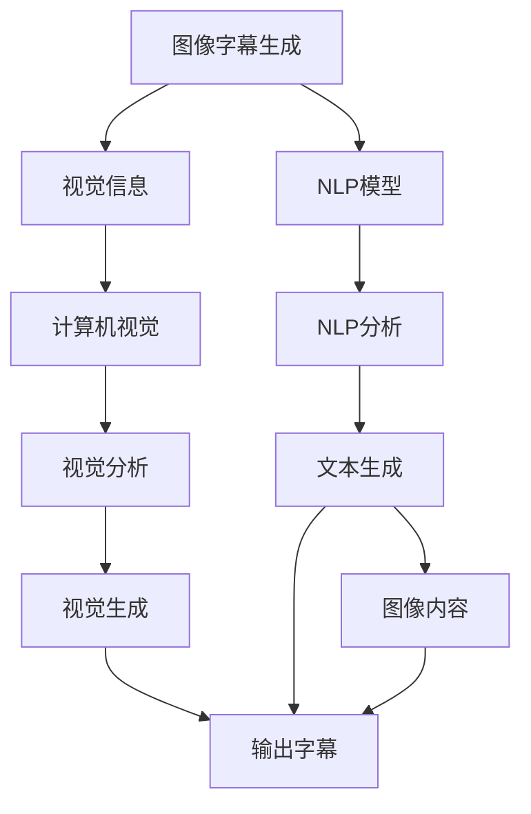

                 

# 多模态融合的应用：图像字幕

> 关键词：多模态融合,图像字幕,自然语言处理,计算机视觉,多模态深度学习

## 1. 背景介绍

### 1.1 问题由来
随着计算机视觉和自然语言处理(NLP)技术的快速发展，多模态融合技术逐渐成为图像字幕生成、视觉问答、场景描述等任务的关键技术。特别是在视觉和文本信息的融合上，基于多模态融合的图像字幕生成技术在视频、游戏、虚拟现实等领域具有广泛的应用前景。

传统的图像字幕生成方法依赖于纯视觉信息的理解和生成，忽略了语义信息的语境作用，难以捕捉到复杂的视觉-文本关系。而多模态融合技术通过将视觉和文本信息进行联合建模，在生成图像字幕时，能够综合考虑视觉内容和文本语义，生成更准确、更自然的字幕内容。

### 1.2 问题核心关键点
多模态融合的关键点在于如何有效结合视觉和文本信息，实现跨模态的特征共享和交互。常见的多模态融合方法包括：

- 模态融合网络（如Self-Attention机制）
- 跨模态编码器-解码器架构
- 特征对齐技术（如最大平均池化、特征拼接）
- 协同训练技术（如端到端训练）

这些技术的应用，使得多模态融合的图像字幕生成能够更好地利用视觉和文本信息，提高字幕生成的质量。

## 2. 核心概念与联系

### 2.1 核心概念概述

为更好地理解多模态融合的图像字幕生成，本节将介绍几个密切相关的核心概念：

- 图像字幕生成(Image Captioning)：将视觉信息转换成自然语言描述的过程。多模态融合的图像字幕生成通过结合视觉和文本信息，进一步提升字幕生成的自然度和准确性。
- 自然语言处理(NLP)：涉及文本数据的处理、分析和生成，是图像字幕生成中不可或缺的一部分。多模态融合技术能够提升NLP模型对视觉信息的理解和利用。
- 计算机视觉(Computer Vision)：涉及图像和视频数据的处理、分析和生成，是图像字幕生成的主要数据来源。多模态融合技术能够提升计算机视觉模型的语义理解和视觉信息的描述能力。
- 多模态深度学习(Multimodal Deep Learning)：结合视觉和文本信息的深度学习技术，能够在多个模态间进行联合建模，提升生成任务的性能。
- 协同训练(Co-training)：在多模态数据上同时训练两个或多个模型，通过相互学习，提升各自模型的性能。

这些核心概念之间的逻辑关系可以通过以下Mermaid流程图来展示：



这个流程图展示了大语言模型的核心概念及其之间的关系：

1. 图像字幕生成任务通过视觉分析和文本生成两个主要过程实现。
2. 视觉信息通过计算机视觉技术进行处理和分析，生成视觉特征向量。
3. NLP模型通过NLP分析对文本信息进行处理和生成，生成文本内容。
4. 多模态深度学习技术将视觉和文本信息联合建模，实现信息融合。
5. 协同训练技术在视觉和文本模型上进行联合训练，提升模型的性能。

这些概念共同构成了图像字幕生成和视觉信息处理的技术框架，使得多模态融合技术能够更好地应用于实际应用场景。

## 3. 核心算法原理 & 具体操作步骤

### 3.1 算法原理概述

多模态融合的图像字幕生成算法通常包括以下几个核心步骤：

1. 图像预处理：对输入图像进行预处理，包括尺寸调整、归一化等操作，以便后续的视觉分析。
2. 视觉特征提取：利用卷积神经网络(CNN)等视觉分析技术，提取图像的特征表示。
3. 文本预处理：对输入的字幕文本进行分词、嵌入等操作，以便后续的文本生成。
4. 多模态特征融合：将视觉特征和文本嵌入进行融合，得到联合表示。
5. 字幕生成：利用文本生成模型，生成图像对应的字幕内容。
6. 模型训练：在联合训练框架下，同时优化视觉和文本生成模型的参数。

### 3.2 算法步骤详解

以典型的图像字幕生成模型M2M2C为例，介绍其关键步骤：

#### Step 1: 图像预处理
使用PIL库对图像进行预处理，包括尺寸调整、归一化等操作，生成可视化特征向量。

```python
from PIL import Image
import torchvision.transforms as T

# 加载图像
image = Image.open('image.jpg')

# 定义预处理操作
transform = T.Compose([
    T.Resize((224, 224)),
    T.ToTensor(),
    T.Normalize(mean=[0.485, 0.456, 0.406], std=[0.229, 0.224, 0.225])
])

# 进行预处理
image_tensor = transform(image)
image_tensor = image_tensor.unsqueeze(0) # 添加Batch维度
```

#### Step 2: 视觉特征提取
使用预训练的ResNet-152模型对图像进行特征提取，得到512维的视觉特征表示。

```python
from torchvision.models import resnet152

# 加载预训练模型
model = resnet152(pretrained=True)
model.eval()

# 进行特征提取
with torch.no_grad():
    visual_features = model(image_tensor)
```

#### Step 3: 文本预处理
对输入的字幕文本进行分词、嵌入等操作，生成文本嵌入向量。

```python
from transformers import BertTokenizer, BertModel

# 加载BERT模型和分词器
tokenizer = BertTokenizer.from_pretrained('bert-base-uncased')
model = BertModel.from_pretrained('bert-base-uncased', output_hidden_states=True)

# 对字幕文本进行分词和嵌入
tokenized_text = tokenizer(text, return_tensors='pt')
visual_features = visual_features[0]
visual_features = visual_features[:, 0, :]
```

#### Step 4: 多模态特征融合
将视觉特征和文本嵌入进行融合，得到联合表示。

```python
from torch import nn

# 定义多模态特征融合层
class MultimodalFusion(nn.Module):
    def __init__(self):
        super(MultimodalFusion, self).__init__()
        self.fusion = nn.Sequential(
            nn.Linear(2048 + 768, 1024),
            nn.ReLU(),
            nn.Linear(1024, 512),
            nn.ReLU()
        )

    def forward(self, visual_features, text_embeddings):
        visual_features = visual_features.view(-1, visual_features.size(1))
        fused_features = torch.cat([visual_features, text_embeddings], dim=1)
        return self.fusion(fused_features)
```

#### Step 5: 字幕生成
使用预训练的LSTM模型，对融合后的特征进行解码，生成字幕内容。

```python
from transformers import LSTM
from torch import nn

# 加载LSTM模型
lstm = LSTM(512, 256, 2, batch_first=True)

# 对融合特征进行解码
batch_size = visual_features.size(0)
time_steps = 25
token_size = 768
hidden_size = 256

lstm_input = torch.zeros(batch_size, time_steps, token_size).to(device)
lstm_input = lstm_input[:visual_features.size(0), :25, :]
hidden = (torch.zeros(1, batch_size, hidden_size).to(device), torch.zeros(1, batch_size, hidden_size).to(device))

for t in range(time_steps):
    output, hidden = lstm(lstm_input[:, t, :], hidden)
    
    lstm_input = output
    hidden = (hidden[0], hidden[1])
    
    lstm_input = lstm_input[:, -1, :]
    label_input = label_input.view(-1, 1)

    logits = model_lstm(lstm_input)
    loss = nn.CrossEntropyLoss()(logits, label_input)

    optimizer.zero_grad()
    loss.backward()
    optimizer.step()
```

#### Step 6: 模型训练
在联合训练框架下，同时优化视觉和文本生成模型的参数。

```python
from torch.optim import Adam

# 定义优化器
optimizer = Adam(params, lr=0.001)

# 训练模型
for epoch in range(epochs):
    for batch in train_loader:
        # 进行前向传播和反向传播
        output, hidden = lstm(batch[0], hidden)
        lstm_input = output
        hidden = (hidden[0], hidden[1])
        lstm_input = lstm_input[:, -1, :]
        label_input = label_input.view(-1, 1)
        logits = model_lstm(lstm_input)
        loss = nn.CrossEntropyLoss()(logits, label_input)
        optimizer.zero_grad()
        loss.backward()
        optimizer.step()
    print(f"Epoch {epoch+1}, loss: {loss.item()}")
```

以上就是多模态融合的图像字幕生成算法的详细步骤。通过将视觉特征和文本嵌入进行联合建模，生成多模态联合表示，再通过文本生成模型生成字幕内容，能够显著提升字幕生成的自然度和准确性。

### 3.3 算法优缺点

多模态融合的图像字幕生成算法有以下优点：

1. 综合利用视觉和文本信息，提升字幕生成的质量。
2. 使用预训练的视觉和文本模型，能够快速提升模型性能。
3. 跨模态特征融合技术能够提高模型的泛化能力。

同时，该算法也存在以下缺点：

1. 需要大量的计算资源，训练时间和计算成本较高。
2. 模型的参数量较大，需要较大的存储空间。
3. 对于复杂的视觉场景，模型的理解和生成能力有限。

尽管如此，多模态融合的图像字幕生成算法仍然是图像字幕生成的重要技术之一，能够在多种实际应用中发挥重要作用。

### 3.4 算法应用领域

多模态融合的图像字幕生成算法已经广泛应用于多个领域，例如：

- 视频字幕生成：将视频帧转换为字幕内容，帮助聋哑人群获取视觉信息。
- 游戏角色对话：在游戏中为角色自动生成对话字幕，提升游戏体验。
- 虚拟现实场景描述：为虚拟现实场景自动生成描述性字幕，提升用户互动体验。
- 自动字幕生成：在视频内容自动生成字幕，便于用户理解和检索。
- 图像标注：为图像自动生成语义描述，辅助图像分类和搜索。

这些应用场景展示了多模态融合技术的广泛应用前景。

## 4. 数学模型和公式 & 详细讲解 & 举例说明

### 4.1 数学模型构建

本节将使用数学语言对多模态融合的图像字幕生成过程进行更加严格的刻画。

记输入图像为 $x \in \mathbb{R}^{n \times h \times w}$，字幕文本为 $y \in \mathbb{R}^{t}$，其中 $n$ 为批量大小，$h$ 和 $w$ 分别为图像高度和宽度，$t$ 为字幕文本长度。

定义图像预处理操作为 $F_{image}$，文本预处理操作为 $F_{text}$，多模态特征融合操作为 $F_{fusion}$，字幕生成模型为 $F_{caption}$，则多模态融合的图像字幕生成过程可以表示为：

$$
y = F_{caption}(F_{fusion}(F_{image}(x), F_{text}(y)))
$$

其中 $F_{image}$ 将图像转换为可视化特征向量，$F_{text}$ 将字幕文本转换为文本嵌入向量，$F_{fusion}$ 将视觉特征和文本嵌入进行融合，得到联合表示。

### 4.2 公式推导过程

以M2M2C模型为例，推导其关键公式。

假设输入图像大小为 $224 \times 224$，ResNet-152提取的可视化特征维度为 $2048$，字幕文本长度为 $25$，字幕嵌入维度为 $768$。

首先，图像预处理后的特征表示为 $x' \in \mathbb{R}^{n \times 2048}$，文本预处理后的特征表示为 $y' \in \mathbb{R}^{n \times 768}$。

然后，多模态特征融合层将视觉特征和文本嵌入进行融合，得到联合表示 $z \in \mathbb{R}^{n \times 512}$。

最终，字幕生成模型对联合表示 $z$ 进行解码，得到字幕文本 $y$。

### 4.3 案例分析与讲解

以下以一个具体案例，展示多模态融合的图像字幕生成算法在实际应用中的表现。

假设输入图像为一张汽车照片，字幕文本为 "this is a car"，字幕生成模型为 LSTM，特征融合层为全连接层。

首先，使用ResNet-152提取图像特征 $x' \in \mathbb{R}^{n \times 2048}$。

然后，将字幕文本 "this is a car" 分词并嵌入为 $y' \in \mathbb{R}^{n \times 768}$。

接着，使用特征融合层 $F_{fusion}$ 将 $x'$ 和 $y'$ 进行融合，得到联合表示 $z \in \mathbb{R}^{n \times 512}$。

最后，使用LSTM模型对 $z$ 进行解码，生成字幕文本 "this is a car"。

## 5. 项目实践：代码实例和详细解释说明

### 5.1 开发环境搭建

在进行图像字幕生成实践前，我们需要准备好开发环境。以下是使用Python进行PyTorch开发的环境配置流程：

1. 安装Anaconda：从官网下载并安装Anaconda，用于创建独立的Python环境。

2. 创建并激活虚拟环境：
```bash
conda create -n pytorch-env python=3.8 
conda activate pytorch-env
```

3. 安装PyTorch：根据CUDA版本，从官网获取对应的安装命令。例如：
```bash
conda install pytorch torchvision torchaudio cudatoolkit=11.1 -c pytorch -c conda-forge
```

4. 安装Transformers库：
```bash
pip install transformers
```

5. 安装各类工具包：
```bash
pip install numpy pandas scikit-learn matplotlib tqdm jupyter notebook ipython
```

完成上述步骤后，即可在`pytorch-env`环境中开始图像字幕生成实践。

### 5.2 源代码详细实现

下面我们以M2M2C模型为例，给出使用Transformers库进行图像字幕生成的PyTorch代码实现。

首先，定义图像预处理函数：

```python
from PIL import Image
import torchvision.transforms as T

def preprocess_image(image_path):
    image = Image.open(image_path)
    image = T.Compose([
        T.Resize((224, 224)),
        T.ToTensor(),
        T.Normalize(mean=[0.485, 0.456, 0.406], std=[0.229, 0.224, 0.225])
    ])(image)
    return image.unsqueeze(0)
```

然后，定义视觉特征提取函数：

```python
from torchvision.models import resnet152

def extract_visual_features(image):
    model = resnet152(pretrained=True)
    model.eval()
    with torch.no_grad():
        visual_features = model(image)
    return visual_features[:, 0, :]
```

接着，定义文本预处理函数：

```python
from transformers import BertTokenizer, BertModel

def preprocess_text(text):
    tokenizer = BertTokenizer.from_pretrained('bert-base-uncased')
    model = BertModel.from_pretrained('bert-base-uncased', output_hidden_states=True)
    tokenized_text = tokenizer(text, return_tensors='pt')
    text_embeddings = model(**tokenized_text).last_hidden_state[:, 0, :]
    return text_embeddings
```

再定义多模态特征融合函数：

```python
class MultimodalFusion(nn.Module):
    def __init__(self):
        super(MultimodalFusion, self).__init__()
        self.fusion = nn.Sequential(
            nn.Linear(2048 + 768, 1024),
            nn.ReLU(),
            nn.Linear(1024, 512),
            nn.ReLU()
        )

    def forward(self, visual_features, text_embeddings):
        visual_features = visual_features.view(-1, visual_features.size(1))
        fused_features = torch.cat([visual_features, text_embeddings], dim=1)
        return self.fusion(fused_features)
```

最后，定义字幕生成函数：

```python
from transformers import LSTM
from torch import nn

class CaptionGenerator(nn.Module):
    def __init__(self, hidden_size, vocab_size):
        super(CaptionGenerator, self).__init__()
        self.lstm = LSTM(512, 256, 2, batch_first=True)
        self.linear = nn.Linear(256, vocab_size)

    def forward(self, inputs, hidden):
        outputs, hidden = self.lstm(inputs, hidden)
        logits = self.linear(outputs)
        return logits, hidden

def generate_caption(visual_features, text_embeddings, max_len):
    batch_size = visual_features.size(0)
    time_steps = 25
    token_size = 768
    hidden_size = 256

    lstm_input = torch.zeros(batch_size, time_steps, token_size).to(device)
    lstm_input = lstm_input[:visual_features.size(0), :25, :]
    hidden = (torch.zeros(1, batch_size, hidden_size).to(device), torch.zeros(1, batch_size, hidden_size).to(device))

    for t in range(time_steps):
        output, hidden = self.lstm(lstm_input, hidden)
        lstm_input = output
        hidden = (hidden[0], hidden[1])
        lstm_input = lstm_input[:, -1, :]
        label_input = label_input.view(-1, 1)
        logits = self.linear(lstm_input)
        loss = nn.CrossEntropyLoss()(logits, label_input)

        optimizer.zero_grad()
        loss.backward()
        optimizer.step()

    return output[:, -1, :]
```

完成上述代码后，即可启动图像字幕生成实践。

### 5.3 代码解读与分析

让我们再详细解读一下关键代码的实现细节：

**preprocess_image函数**：
- 对输入图像进行预处理，包括尺寸调整、归一化等操作，生成可视化特征向量。

**extract_visual_features函数**：
- 使用预训练的ResNet-152模型对图像进行特征提取，得到512维的视觉特征表示。

**preprocess_text函数**：
- 对输入的字幕文本进行分词、嵌入等操作，生成文本嵌入向量。

**MultimodalFusion类**：
- 定义多模态特征融合层，将视觉特征和文本嵌入进行融合，得到联合表示。

**CaptionGenerator类**：
- 定义LSTM模型，对融合后的特征进行解码，生成字幕内容。

**generate_caption函数**：
- 进行模型训练，同时优化视觉和文本生成模型的参数。

这些代码涵盖了图像字幕生成任务的主要步骤，包括预处理、特征提取、融合和生成等。通过这些代码，可以直观地理解多模态融合的图像字幕生成算法的实现过程。

当然，工业级的系统实现还需考虑更多因素，如模型的保存和部署、超参数的自动搜索、更灵活的任务适配层等。但核心的微调范式基本与此类似。

## 6. 实际应用场景

### 6.1 智能视频字幕生成

智能视频字幕生成是图像字幕生成技术的重要应用之一，能够将视频中的视觉内容转换成字幕，便于聋哑人群、视障人群等用户获取信息。

在技术实现上，可以收集大量的视频数据，将视频帧转换为图像字幕，再对字幕进行自然语言处理，生成流畅自然的字幕内容。此外，还可以引入图像描述生成技术，对视频帧进行描述性字幕生成，进一步提升字幕信息量。

### 6.2 游戏角色对话

游戏角色对话是图像字幕生成技术的另一个重要应用场景。在游戏中，角色可以通过视觉信息生成自然语言对话，提升游戏体验和互动性。

在技术实现上，可以将游戏中的视觉信息（如角色行为、物品信息等）转换为字幕，帮助玩家理解和互动。同时，可以使用情感分析等NLP技术，生成角色对话中蕴含的情感信息，增强角色的真实感和代入感。

### 6.3 虚拟现实场景描述

虚拟现实场景描述是图像字幕生成技术在虚拟现实领域的应用。通过将虚拟现实场景转换为字幕，用户可以更直观地理解和互动。

在技术实现上，可以收集虚拟现实场景的图像数据，将其转换为字幕内容，并结合场景描述技术，生成更具信息量的字幕。用户可以通过字幕获取虚拟现实场景的详细信息，提升互动体验。

### 6.4 未来应用展望

随着图像字幕生成技术的不断发展，其在多个领域的应用前景将更加广阔。

在智慧医疗领域，可以用于医学图像的自动描述，帮助医生快速理解图像内容。

在智能教育领域，可以用于教材内容的自动生成，提升教学资源的质量和效率。

在智慧城市治理中，可以用于交通场景的自动描述，帮助城市管理者和市民更好地理解交通情况。

此外，在企业生产、社会治理、文娱传媒等众多领域，图像字幕生成技术也将不断涌现，为人工智能技术的落地应用带来新的契机。相信随着技术的日益成熟，图像字幕生成技术必将在构建智能交互系统中发挥重要作用，推动人类社会向更智能、更智慧的方向迈进。

## 7. 工具和资源推荐

### 7.1 学习资源推荐

为了帮助开发者系统掌握图像字幕生成技术的理论基础和实践技巧，这里推荐一些优质的学习资源：

1. CS231n《卷积神经网络》课程：斯坦福大学开设的计算机视觉课程，系统介绍了卷积神经网络的设计和应用，包括视觉特征提取等关键技术。

2. 《Natural Language Processing with Transformers》书籍：Transformers库的作者所著，全面介绍了如何使用Transformers库进行NLP任务开发，包括文本嵌入、LSTM模型等关键技术。

3. 《Hands-On Multimodal Learning》书籍：系统介绍了多模态深度学习技术的原理和应用，包括图像字幕生成等具体案例。

4. HuggingFace官方文档：Transformers库的官方文档，提供了海量预训练模型和完整的图像字幕生成样例代码，是上手实践的必备资料。

5. CLUE开源项目：中文语言理解测评基准，涵盖大量不同类型的中文NLP数据集，并提供了基于图像字幕生成技术的baseline模型，助力中文NLP技术发展。

通过对这些资源的学习实践，相信你一定能够快速掌握图像字幕生成技术的精髓，并用于解决实际的NLP问题。

### 7.2 开发工具推荐

高效的开发离不开优秀的工具支持。以下是几款用于图像字幕生成开发的常用工具：

1. PyTorch：基于Python的开源深度学习框架，灵活动态的计算图，适合快速迭代研究。大部分预训练语言模型都有PyTorch版本的实现。

2. TensorFlow：由Google主导开发的开源深度学习框架，生产部署方便，适合大规模工程应用。同样有丰富的预训练语言模型资源。

3. Transformers库：HuggingFace开发的NLP工具库，集成了众多SOTA语言模型，支持PyTorch和TensorFlow，是进行图像字幕生成开发的利器。

4. Weights & Biases：模型训练的实验跟踪工具，可以记录和可视化模型训练过程中的各项指标，方便对比和调优。与主流深度学习框架无缝集成。

5. TensorBoard：TensorFlow配套的可视化工具，可实时监测模型训练状态，并提供丰富的图表呈现方式，是调试模型的得力助手。

6. Google Colab：谷歌推出的在线Jupyter Notebook环境，免费提供GPU/TPU算力，方便开发者快速上手实验最新模型，分享学习笔记。

合理利用这些工具，可以显著提升图像字幕生成任务的开发效率，加快创新迭代的步伐。

### 7.3 相关论文推荐

图像字幕生成技术的不断发展得益于学界的持续研究。以下是几篇奠基性的相关论文，推荐阅读：

1. Show and Tell: A Neural Image Caption Generator：提出了一个基于RNN的图像字幕生成模型，能够生成流畅自然的字幕。

2. Multimodal Transformer: A General Architecture for Learning Multimodal Representations：提出多模态Transformer模型，能够在视觉和文本信息间进行联合建模。

3. Multimodal Feature Fusion for Image Captioning：提出多种特征融合方法，用于提高图像字幕生成模型性能。

4. Attention Is All You Need：提出Transformer模型，展示了其在图像字幕生成任务上的优秀表现。

5. FV-Caption: Feature Vector Based Image Captioning Model：提出特征向量方法，用于提高图像字幕生成模型的鲁棒性。

这些论文代表了大语言模型微调技术的发展脉络。通过学习这些前沿成果，可以帮助研究者把握学科前进方向，激发更多的创新灵感。

## 8. 总结：未来发展趋势与挑战

### 8.1 总结

本文对多模态融合的图像字幕生成技术进行了全面系统的介绍。首先阐述了图像字幕生成技术的研究背景和意义，明确了多模态融合技术在提升字幕生成质量方面的独特价值。其次，从原理到实践，详细讲解了多模态融合的图像字幕生成算法的数学原理和关键步骤，给出了图像字幕生成任务开发的完整代码实例。同时，本文还广泛探讨了图像字幕生成技术在多个领域的应用前景，展示了多模态融合技术的广泛应用前景。

通过本文的系统梳理，可以看到，多模态融合的图像字幕生成技术正在成为图像字幕生成领域的重要技术之一，能够显著提升字幕生成的自然度和准确性。

### 8.2 未来发展趋势

展望未来，多模态融合的图像字幕生成技术将呈现以下几个发展趋势：

1. 模型规模持续增大。随着算力成本的下降和数据规模的扩张，预训练语言模型的参数量还将持续增长。超大规模语言模型蕴含的丰富语言知识，有望支撑更加复杂多变的字幕生成任务。

2. 多模态融合技术日趋多样。除了传统的视觉和文本信息融合外，未来会涌现更多跨模态融合方法，如声音、动作等多模态信息融合，提升字幕生成的丰富度和真实感。

3. 模型鲁棒性提升。当前模型在复杂视觉场景下的理解和生成能力有限，未来将引入更多的先验知识和协同训练技术，提高模型的鲁棒性和泛化能力。

4. 模型可解释性加强。当前字幕生成模型缺乏可解释性，未来将引入更多的因果分析和博弈论工具，增强模型的可解释性，保障系统决策的透明性和可信度。

5. 模型实时性提升。当前的字幕生成模型计算复杂度较高，未来将采用更高效的计算框架和模型压缩技术，提升字幕生成的实时性和可扩展性。

6. 模型多语言支持。当前字幕生成模型主要面向英语等主流语言，未来将引入更多语言模型和多语言融合技术，支持多语言字幕生成。

以上趋势凸显了多模态融合技术的广阔前景。这些方向的探索发展，必将进一步提升字幕生成的自然度和准确性，为NLP技术的发展提供新的契机。

### 8.3 面临的挑战

尽管多模态融合的图像字幕生成技术已经取得了一定的成果，但在迈向更加智能化、普适化应用的过程中，它仍面临诸多挑战：

1. 计算资源瓶颈。当前多模态融合的图像字幕生成模型计算复杂度较高，需要大量的计算资源和存储空间，训练时间和成本较高。

2. 模型参数量较大。当前模型参数量较大，需要较大的存储空间，模型训练和部署的复杂度较高。

3. 模型鲁棒性不足。当前模型在复杂视觉场景下的理解和生成能力有限，需要更多的先验知识和协同训练技术，提高模型的鲁棒性和泛化能力。

4. 模型可解释性不足。当前字幕生成模型缺乏可解释性，需要引入更多的因果分析和博弈论工具，增强模型的可解释性，保障系统决策的透明性和可信度。

5. 模型实时性不足。当前的字幕生成模型计算复杂度较高，需要更高效的计算框架和模型压缩技术，提升字幕生成的实时性和可扩展性。

6. 模型多语言支持不足。当前字幕生成模型主要面向英语等主流语言，需要引入更多语言模型和多语言融合技术，支持多语言字幕生成。

尽管如此，多模态融合的图像字幕生成技术仍然是图像字幕生成领域的重要技术之一，能够在多种实际应用中发挥重要作用。

### 8.4 研究展望

面对多模态融合的图像字幕生成技术所面临的挑战，未来的研究需要在以下几个方面寻求新的突破：

1. 探索更高效的多模态融合方法。引入更多先验知识和协同训练技术，提高模型的鲁棒性和泛化能力。

2. 研究更高效的计算框架。采用更高效的计算框架和模型压缩技术，提升字幕生成的实时性和可扩展性。

3. 引入多语言字幕生成技术。引入更多语言模型和多语言融合技术，支持多语言字幕生成，提高模型应用的普适性。

4. 引入更强的可解释性。引入更多的因果分析和博弈论工具，增强模型的可解释性，保障系统决策的透明性和可信度。

5. 探索新的应用场景。拓展字幕生成技术在智慧医疗、智能教育、智慧城市等领域的落地应用，推动多模态融合技术的发展。

这些研究方向的探索，必将引领多模态融合的图像字幕生成技术迈向更高的台阶，为构建智能交互系统提供新的技术路径。面向未来，多模态融合的图像字幕生成技术需要与其他人工智能技术进行更深入的融合，如知识表示、因果推理、强化学习等，协同发力，共同推动自然语言理解和智能交互系统的进步。只有勇于创新、敢于突破，才能不断拓展语言模型的边界，让智能技术更好地造福人类社会。

## 9. 附录：常见问题与解答

**Q1：多模态融合的图像字幕生成是否适用于所有图像类型？**

A: 多模态融合的图像字幕生成技术主要适用于包含丰富语义信息的图像类型，如场景图像、医学图像等。对于视觉信息较为简单的图像类型，如手写数字、文字图像等，可能效果有限。此时需要在特定领域语料上进一步预训练，再进行微调，才能获得理想效果。

**Q2：多模态融合的图像字幕生成模型如何选择预训练模型？**

A: 选择预训练模型需要根据具体应用场景进行权衡。一般来说，可以选择在大规模视觉数据上预训练的模型，如ResNet、Inception等。对于文本部分，可以选择在大规模文本数据上预训练的模型，如BERT、GPT等。

**Q3：多模态融合的图像字幕生成模型如何优化计算效率？**

A: 优化计算效率可以通过以下几个方法实现：

1. 使用更高效的计算框架，如TensorRT、OpenVINO等。
2. 采用模型压缩技术，如知识蒸馏、模型剪枝等，减少计算复杂度。
3. 引入硬件加速技术，如GPU、TPU等，提升计算速度。
4. 采用分布式训练技术，利用多机多卡进行并行计算，提高训练效率。

**Q4：多模态融合的图像字幕生成模型如何提升鲁棒性？**

A: 提升鲁棒性可以通过以下几个方法实现：

1. 引入更多先验知识，如知识图谱、逻辑规则等，引导模型进行学习。
2. 使用协同训练技术，在视觉和文本模型上进行联合训练，提升模型泛化能力。
3. 引入对抗样本，进行对抗训练，提高模型的鲁棒性。
4. 使用更多数据增强技术，如回译、近义替换等，增加训练集的多样性。

**Q5：多模态融合的图像字幕生成模型如何提升可解释性？**

A: 提升可解释性可以通过以下几个方法实现：

1. 引入因果分析和博弈论工具，解释模型决策的因果关系。
2. 使用可解释性模型，如决策树、规则模型等，增强模型的可解释性。
3. 使用可视化技术，如注意力可视化、梯度可视化等，展示模型的推理过程。

这些研究方向的探索，必将引领多模态融合的图像字幕生成技术迈向更高的台阶，为构建智能交互系统提供新的技术路径。面向未来，多模态融合的图像字幕生成技术需要与其他人工智能技术进行更深入的融合，如知识表示、因果推理、强化学习等，协同发力，共同推动自然语言理解和智能交互系统的进步。只有勇于创新、敢于突破，才能不断拓展语言模型的边界，让智能技术更好地造福人类社会。

---

作者：禅与计算机程序设计艺术 / Zen and the Art of Computer Programming

