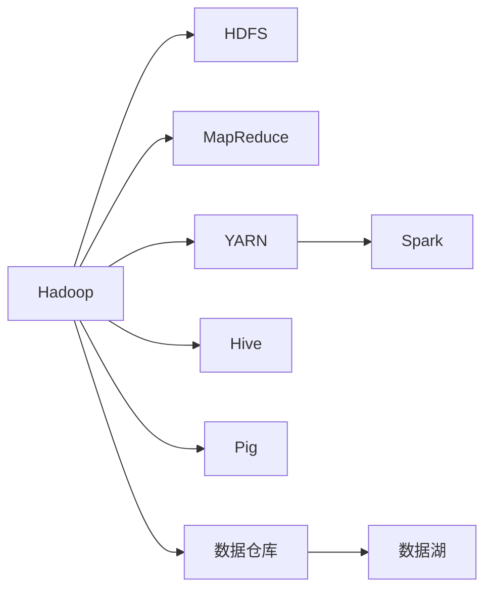

                 

# 大数据处理：Hadoop生态系统深度解析

> 关键词：大数据处理, Hadoop, HDFS, MapReduce, YARN, Spark, Hive, Pig, 数据仓库, 数据湖

## 1. 背景介绍

### 1.1 问题由来

在当今数字化时代，数据已经成为了企业最重要的资产之一。各行各业都在产生海量数据，如交易记录、用户行为、传感器数据等。如何高效、可靠地处理和分析这些数据，成为了各个企业面临的重大挑战。

大数据技术的发展，尤其是Hadoop生态系统的广泛应用，为解决这些问题提供了全新的思路和方法。Hadoop是由Apache基金会推出的一套开源框架，用于大规模数据存储、处理和分析。

通过Hadoop，企业可以在低成本、高可扩展性的基础上，快速构建大规模数据处理平台，实现数据的有效管理和分析，为业务决策提供有力支持。

## 2. 核心概念与联系

### 2.1 核心概念概述

为了深入理解Hadoop生态系统，首先介绍几个关键概念：

- **Hadoop**：由Apache基金会推出的大数据处理框架，主要包含两个核心组件：分布式文件系统HDFS和分布式计算框架MapReduce。

- **HDFS（Hadoop Distributed File System）**：用于存储海量数据的文件系统，通过分片存储和冗余备份，实现数据的可靠性和高可用性。

- **MapReduce**：一种基于“分而治之”思想的分布式计算模型，通过将任务分解为Map和Reduce两个步骤，实现大规模数据的高效处理。

- **YARN（Yet Another Resource Negotiator）**：用于资源管理和调度的框架，支持多种计算引擎（如Hadoop、Spark等），实现资源的高效利用。

- **Spark**：一种基于内存计算的高性能计算引擎，支持Hadoop生态系统中的多种计算任务，如批处理、流处理、机器学习等。

- **Hive、Pig**：基于Hadoop的SQL查询工具，提供了更加便捷的数据分析方式。

- **数据仓库、数据湖**：用于存储和管理企业级数据的平台，支持高效的数据存储和分析，提升决策支持的效率。

这些概念之间的逻辑关系可以通过以下Mermaid流程图来展示：



这个流程图展示了大数据处理框架Hadoop的核心组件及其之间的关系：

1. Hadoop通过HDFS和MapReduce完成数据存储和计算。
2. YARN框架用于资源管理和调度，支持Spark等多种计算引擎。
3. Hive和Pig提供了便捷的数据分析方式。
4. 数据仓库、数据湖用于存储和管理企业级数据，支持高效的数据存储和分析。

这些组件通过相互协作，共同构建了Hadoop生态系统，使其能够高效、可靠地处理和分析大规模数据。

## 3. 核心算法原理 & 具体操作步骤

### 3.1 算法原理概述

Hadoop生态系统的主要算法原理基于MapReduce模型和HDFS文件系统。以下是详细解释：

**MapReduce模型**：
MapReduce是一种“分而治之”的分布式计算模型，将大任务分解为多个小任务进行处理。每个小任务称为“Map”任务，负责将输入数据分割成小块，并对每个小块进行初步处理；所有Map任务的输出结果再通过“Reduce”任务进行汇总和计算，最终得到整个任务的输出结果。

**HDFS文件系统**：
HDFS是一个高度容错的分布式文件系统，由NameNode和DataNode组成。NameNode负责管理文件系统命名空间和存储位置，DataNode负责存储数据块。通过多个DataNode的冗余备份，实现数据的可靠性和高可用性。

### 3.2 算法步骤详解

Hadoop的算法流程主要分为数据预处理、Map任务、Reduce任务、数据合并等步骤。以下详细介绍：

1. **数据预处理**：首先，将大规模数据集分割成多个小块，称为分片（Block），每个分片大小为128MB或256MB。

2. **Map任务**：将每个分片作为输入，通过Map函数将其分割成多个小键值对，并并行处理这些小键值对。

3. **Reduce任务**：Map任务的所有输出结果通过网络传输到Reduce任务，通过Reduce函数对相同键的键值对进行汇总计算，得到最终结果。

4. **数据合并**：将多个Reduce任务的输出结果进行合并，得到最终的输出结果。

### 3.3 算法优缺点

**优点**：
- 高可扩展性：Hadoop可以处理PB级别的数据，支持数百甚至数千个节点，具有极高的可扩展性。
- 高可用性：通过HDFS的冗余备份和容错机制，保证数据的可靠性和高可用性。
- 高效率：通过MapReduce的并行处理，实现大规模数据的高效处理。
- 易于使用：提供了丰富的API和工具，支持多种编程语言和框架，易于使用和部署。

**缺点**：
- 延迟高：MapReduce任务的中间过程需要进行数据传输和网络通信，导致整体延迟较高。
- 性能瓶颈：由于依赖于磁盘IO，数据读写速度较慢，成为性能瓶颈。
- 资源浪费：由于MapReduce的静态分片策略，可能导致某些分片数据量较小，资源利用率较低。
- 学习曲线陡峭：需要一定的编程和系统管理经验，学习曲线较陡峭。

### 3.4 算法应用领域

Hadoop生态系统在众多领域中得到了广泛应用，以下是几个典型应用场景：

- **大数据分析**：通过Hadoop处理海量数据，提取有价值的信息，为企业决策提供支持。
- **流处理**：通过Spark Streaming等工具，实时处理海量流数据，支持实时分析和实时决策。
- **机器学习**：利用Hadoop处理大规模数据集，进行机器学习模型的训练和推理。
- **日志分析**：通过Hadoop处理海量日志数据，提取有用信息，支持运维监控和故障排查。
- **物联网**：通过Hadoop处理海量传感器数据，实现数据存储和分析，支持智慧城市、智慧农业等应用。

## 4. 数学模型和公式 & 详细讲解

### 4.1 数学模型构建

在Hadoop生态系统中，数学模型主要应用于数据处理和分析过程中。以下是一些常见的数学模型及其构建方法：

**数据分布模型**：
假设数据集D的分布为P(x)，其中x为数据样本，P(x)为数据分布概率。在Hadoop中，可以通过MapReduce模型对数据进行采样和统计，得到样本分布的估计值。

**回归模型**：
假设数据集D的输出为y，输入为x，回归模型可以表示为：y=f(x)+ε。在Hadoop中，可以通过MapReduce模型对数据进行特征提取和回归计算，得到拟合曲线。

**分类模型**：
假设数据集D的输出为y，输入为x，分类模型可以表示为：P(y|x)。在Hadoop中，可以通过MapReduce模型对数据进行特征提取和分类计算，得到分类结果。

### 4.2 公式推导过程

**线性回归模型**：
假设数据集D的输出为y，输入为x，回归模型可以表示为：y=wx+b。其中w为回归系数，b为截距。通过MapReduce模型对数据进行特征提取和回归计算，可以得到回归系数w和截距b的估计值。

**随机森林模型**：
假设数据集D的输出为y，输入为x，分类模型可以表示为：y=∑αf(x)，其中f(x)为决策树模型，α为权重系数。通过MapReduce模型对数据进行特征提取和分类计算，可以得到决策树模型和权重系数α的估计值。

### 4.3 案例分析与讲解

**案例1：数据分布估计**
假设有一个大型电商网站，每天产生数十万的用户行为数据，用于分析用户购买行为。在Hadoop中，可以使用MapReduce模型对数据进行采样和统计，得到用户行为分布的估计值。具体步骤如下：
1. 将数据集D分割成多个小块，每个分片大小为128MB或256MB。
2. 通过Map任务对每个分片进行采样，得到样本数据集D'。
3. 通过Reduce任务对样本数据集D'进行统计，得到样本分布的估计值。

**案例2：线性回归分析**
假设有一个大型房地产公司，需要根据历史房价数据预测未来的房价。在Hadoop中，可以使用线性回归模型对数据进行处理，得到预测结果。具体步骤如下：
1. 将历史房价数据集D分割成多个小块，每个分片大小为128MB或256MB。
2. 通过Map任务对每个分片进行特征提取，得到特征矩阵X和目标向量y。
3. 通过Reduce任务对特征矩阵X和目标向量y进行线性回归计算，得到回归系数w和截距b的估计值。
4. 使用回归模型进行房价预测。

## 5. 项目实践：代码实例和详细解释说明

### 5.1 开发环境搭建

在进行Hadoop项目开发前，需要准备好开发环境。以下是一些常用的开发环境搭建方法：

1. **安装JDK**：Hadoop依赖JDK，请确保系统上已安装JDK 1.8或以上版本。
2. **安装Hadoop**：可以从Apache官网下载安装包，或者使用Docker镜像进行安装。
3. **安装Hive、Pig等工具**：可以从Apache官网下载安装包，或者使用Maven或POM文件进行配置。
4. **配置环境变量**：设置Hadoop、Hive、Pig等工具的环境变量，以便顺利运行。

完成上述步骤后，即可在Hadoop平台上进行开发。

### 5.2 源代码详细实现

以下是一个简单的Hadoop MapReduce程序示例，用于统计数据集D中每个单词出现的次数：

```python
from pyhdfs import HdfsClient

# 连接HDFS文件系统
hdfs = HdfsClient(hosts='hdfs-host:port', user='hdfs-user')

# 读取数据文件
with open('data.txt', 'r') as f:
    data = f.read()

# 分割单词
words = data.split()

# 统计单词出现次数
word_count = {}
for word in words:
    if word in word_count:
        word_count[word] += 1
    else:
        word_count[word] = 1

# 写入结果文件
with hdfs.write_file('word_count.txt') as w:
    for word, count in word_count.items():
        w.write(f'{word} {count}\n')
```

### 5.3 代码解读与分析

以上代码实现了Hadoop MapReduce程序的基本流程：

1. 通过HdfsClient连接到HDFS文件系统。
2. 读取数据文件，将数据存储在变量data中。
3. 将数据分割成单词，并统计每个单词出现的次数，存储在字典word_count中。
4. 将统计结果写入HDFS文件系统中，存储在变量word_count.txt中。

该程序通过Map任务将数据分割成单词，统计单词出现次数；通过Reduce任务将统计结果写入HDFS文件系统中。通过这种方式，Hadoop可以高效地处理和分析大规模数据集。

### 5.4 运行结果展示

在执行上述程序后，可以通过HDFS文件系统查看结果文件word_count.txt，其中每行记录一个单词及其出现次数，格式为“单词 出现次数”。

例如，如果数据文件中包含“apple banana orange”，那么运行程序后，结果文件可能包含以下内容：
```
apple 1
banana 1
orange 1
```

## 6. 实际应用场景

### 6.1 金融风控

金融行业每天产生海量交易数据，需要实时进行风控和风险评估。通过Hadoop生态系统，可以对实时交易数据进行实时处理和分析，及时发现异常交易，防范金融风险。具体流程如下：

1. 通过HDFS存储实时交易数据。
2. 使用MapReduce模型对数据进行实时处理和分析，提取交易特征。
3. 使用机器学习模型进行风险评估，输出风险等级。
4. 实时监控风险等级，触发报警机制。

### 6.2 医疗健康

医疗行业每天产生大量医疗数据，包括患者记录、影像数据、基因数据等。通过Hadoop生态系统，可以对这些数据进行存储和分析，支持医疗决策和疾病预测。具体流程如下：

1. 通过HDFS存储医疗数据。
2. 使用MapReduce模型对数据进行预处理和特征提取，提取患者特征。
3. 使用机器学习模型进行疾病预测，输出疾病概率。
4. 实时监控疾病概率，提供预警和干预措施。

### 6.3 社交媒体分析

社交媒体平台每天产生大量用户数据，包括用户行为、言论、舆情等。通过Hadoop生态系统，可以对这些数据进行实时处理和分析，支持舆情监测和用户行为分析。具体流程如下：

1. 通过HDFS存储用户数据。
2. 使用MapReduce模型对数据进行实时处理和分析，提取用户行为特征。
3. 使用机器学习模型进行舆情监测，输出舆情分析结果。
4. 实时监控舆情分析结果，提供预警和干预措施。

## 7. 工具和资源推荐

### 7.1 学习资源推荐

为了帮助开发者系统掌握Hadoop生态系统的技术，这里推荐一些优质的学习资源：

1. **《Hadoop权威指南》**：由Hadoop之父Doug Cutting和Mike chickering合著，详细介绍了Hadoop生态系统的各个组件和应用场景。
2. **《Hadoop高级教程》**：由Carrick Hertel撰写，介绍了Hadoop生态系统的高级特性和应用实践。
3. **《Spark实战》**：由Rodrigo Medina和Anne Marie Rosati合著，介绍了Spark生态系统的各个组件和应用场景。
4. **《Hive快速入门》**：由Alessio Micheli撰写，介绍了Hive生态系统的基本用法和高级特性。
5. **《Pig实战》**：由Eugene Prodanov撰写，介绍了Pig生态系统的基本用法和高级特性。

通过学习这些资源，相信你一定能够全面掌握Hadoop生态系统的技术，并用于解决实际的业务问题。

### 7.2 开发工具推荐

Hadoop生态系统的开发工具种类繁多，以下是几款常用的工具：

1. **Hadoop**：Apache基金会推出的开源框架，用于大规模数据存储和处理。
2. **Spark**：Apache基金会推出的内存计算框架，支持实时处理和机器学习任务。
3. **Hive、Pig**：基于Hadoop的SQL查询工具，提供了便捷的数据分析方式。
4. **Hadoop生态系统监控工具**：如Ganglia、Nagios等，用于监控Hadoop集群的健康状态和性能指标。
5. **Hadoop资源管理系统**：如YARN、Ambari等，用于管理Hadoop集群的资源分配和调度。

合理利用这些工具，可以显著提升Hadoop生态系统的开发效率和性能，降低系统管理的复杂度。

### 7.3 相关论文推荐

Hadoop生态系统的发展源于学界的持续研究。以下是几篇奠基性的相关论文，推荐阅读：

1. **MapReduce: Simplified Data Processing on Large Clusters**：由Google的Jeff Dean和Suggy Bailis等撰写，介绍了MapReduce模型的基本原理和应用场景。
2. **Hadoop: A Distributed File System for Fault-Tolerant and Accessible Storage**：由Hadoop之父Doug Cutting和Mike chickering合著，介绍了HDFS文件系统的基本原理和实现细节。
3. **YARN: Yet Another Resource Negotiator**：由YARN项目组撰写，介绍了YARN框架的基本原理和应用场景。
4. **Spark: Cluster Computing with Fault Tolerance**：由Spark项目组撰写，介绍了Spark框架的基本原理和实现细节。
5. **Hive: A Data-Warehousing Approach to Querying Sparse and Semi-structured Data**：由Hive项目组撰写，介绍了Hive工具的基本用法和高级特性。
6. **Pig Latin: A Platform for Fast, Easy, and Extensible Data Analysis**：由Pig项目组撰写，介绍了Pig工具的基本用法和高级特性。

这些论文代表了大数据处理技术的发展脉络。通过学习这些前沿成果，可以帮助研究者把握学科前进方向，激发更多的创新灵感。

## 8. 总结：未来发展趋势与挑战

### 8.1 研究成果总结

Hadoop生态系统自诞生以来，已经广泛应用于各行各业，成为了大数据处理的主流框架。通过Hadoop生态系统，企业可以高效、可靠地处理和分析大规模数据，实现数据的价值挖掘和应用落地。

### 8.2 未来发展趋势

展望未来，Hadoop生态系统将继续向着以下几个方向发展：

1. **云原生化**：Hadoop生态系统将向云原生化方向发展，支持容器化部署和微服务架构，提升系统的灵活性和可扩展性。
2. **边缘计算**：Hadoop生态系统将向边缘计算方向发展，支持数据在本地进行处理和分析，提升数据处理的时效性。
3. **流处理和实时分析**：Hadoop生态系统将向流处理和实时分析方向发展，支持大规模实时数据处理和分析，提升数据处理的实时性。
4. **人工智能和机器学习**：Hadoop生态系统将向人工智能和机器学习方向发展，支持机器学习模型的训练和推理，提升数据处理智能化水平。

### 8.3 面临的挑战

尽管Hadoop生态系统在许多方面已经取得了重要进展，但在迈向更加智能化、普适化应用的过程中，仍然面临着一些挑战：

1. **数据质量问题**：由于大规模数据来源复杂，数据质量参差不齐，可能导致数据处理和分析的准确性受到影响。
2. **性能瓶颈问题**：由于Hadoop依赖磁盘IO，数据读写速度较慢，成为性能瓶颈。
3. **资源管理问题**：由于Hadoop集群规模庞大，资源管理复杂，可能导致资源利用率较低。
4. **跨平台兼容性问题**：由于Hadoop生态系统依赖多种开源软件，跨平台兼容性问题仍需解决。
5. **用户体验问题**：由于Hadoop生态系统技术复杂，用户体验较差，可能导致开发效率较低。

### 8.4 研究展望

面对Hadoop生态系统所面临的挑战，未来的研究需要在以下几个方面寻求新的突破：

1. **数据质量保障**：引入数据清洗和数据预处理技术，提升数据处理和分析的准确性。
2. **性能优化**：引入内存计算和内存本地化技术，提升数据处理速度，减少数据传输和IO开销。
3. **资源管理优化**：引入智能资源管理和调度技术，提升资源利用率，降低资源管理复杂度。
4. **跨平台兼容性提升**：引入跨平台兼容技术，提升Hadoop生态系统的跨平台支持能力。
5. **用户体验提升**：引入用户界面和开发工具，提升Hadoop生态系统的用户体验，降低开发难度。

通过这些方向的探索发展，相信Hadoop生态系统必将在未来实现更大的突破，为大数据处理带来新的发展机遇。

## 9. 附录：常见问题与解答

**Q1：Hadoop的优势和劣势是什么？**

A: Hadoop的优势在于其高可扩展性、高可靠性和高可用性，可以处理大规模数据。其劣势在于处理小规模数据时性能较差，中间过程延迟较高，资源浪费较大，学习曲线较陡峭。

**Q2：如何优化Hadoop的性能？**

A: 优化Hadoop性能可以从以下几个方面入手：
1. 优化数据存储和读写，引入内存计算和内存本地化技术。
2. 优化数据分割和并行计算，减少数据传输和IO开销。
3. 优化资源管理和调度，提升资源利用率，降低资源管理复杂度。
4. 优化代码编写和优化算法，减少计算开销，提升计算效率。

**Q3：如何使用Hadoop进行实时处理？**

A: 使用Hadoop进行实时处理可以通过Spark Streaming等工具实现。具体步骤如下：
1. 将实时数据流存储在HDFS中。
2. 使用Spark Streaming对数据流进行实时处理和分析，提取实时特征。
3. 使用机器学习模型进行实时预测，输出实时结果。
4. 实时监控预测结果，提供预警和干预措施。

**Q4：Hadoop和Spark的区别是什么？**

A: Hadoop和Spark的主要区别在于计算模式和处理方式。Hadoop主要使用MapReduce模型进行批处理计算，适合处理大规模数据。Spark主要使用内存计算和流计算模型，支持实时处理和机器学习任务，适合处理小规模和大规模数据。

**Q5：Hadoop和Hive、Pig的区别是什么？**

A: Hadoop、Hive、Pig的主要区别在于数据处理方式和查询方式。Hadoop主要使用MapReduce模型进行数据处理，适合批处理计算。Hive和Pig主要使用SQL查询语言进行数据处理，适合大规模数据处理和复杂数据建模。

通过这些常见问题的解答，相信你一定能够更全面地理解Hadoop生态系统的技术，并用于解决实际的业务问题。

