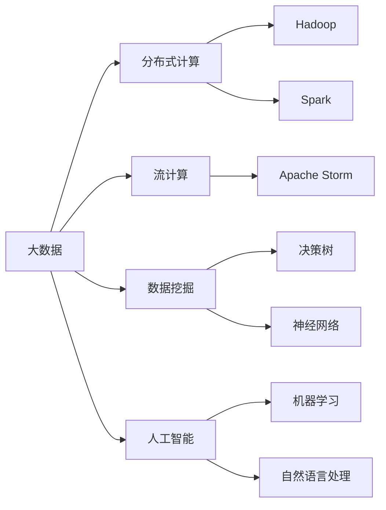

                 

# 大数据时代：人类计算的机遇与挑战

在21世纪的数据浪潮中，大数据技术的迅猛发展正在彻底改变人类的工作方式和生活习惯。本文将深入探讨大数据时代给人类计算带来的机遇与挑战，通过逻辑清晰、结构紧凑、专业而通俗的语言，全面解析大数据技术的内涵与外延，展望其未来的发展趋势。

## 1. 背景介绍

### 1.1 问题由来
随着信息技术的飞速进步，数据已成为人类文明和社会发展的核心资产。大数据技术的崛起，使得数据存储、处理、分析的能力获得了前所未有的提升。从政府部门、大型企业到个人用户，数据的重要性日益凸显。如何在数据海洋中挖掘知识，实现智能化决策，成为了当前亟待解决的难题。

### 1.2 问题核心关键点
大数据时代的核心在于如何高效、安全地处理海量数据，从中提取有价值的知识，支持科学决策。大数据技术包括数据采集、存储、处理、分析等多个环节，核心技术包括Hadoop、Spark、NoSQL数据库等。数据驱动决策的普及，将深刻改变各行各业的工作模式，带来新的机遇和挑战。

## 2. 核心概念与联系

### 2.1 核心概念概述
为更好地理解大数据技术，本节将介绍几个关键概念：

- **大数据(Big Data)**：指数据量庞大、类型繁多、速度快速的数据集合，通常达到PB级别。大数据涵盖数据生命周期的各个阶段，包括数据生成、采集、存储、传输、处理、分析、呈现等多个环节。
- **分布式计算(Distributed Computing)**：指在多台计算设备上并行执行计算任务的技术，适用于大规模数据处理的复杂计算场景。
- **流计算(Stream Computing)**：指对数据流进行实时处理和分析，适用于实时数据分析和监控应用。
- **数据挖掘(Data Mining)**：指从大数据中挖掘出有价值模式、知识和规律的技术，是支持决策和创新的重要手段。
- **人工智能(AI)**：通过模拟人类智能行为，实现自动化、智能化处理和决策的技术。

这些核心概念之间存在紧密联系，共同构成了大数据技术的基础框架。

### 2.2 核心概念原理和架构的 Mermaid 流程图


这个流程图展示了大数据技术的基本构成：

1. 大数据由分布式计算、流计算、数据挖掘和人工智能等多项技术共同支撑。
2. Hadoop、Spark等分布式计算框架是处理大数据的基础设施。
3. 流计算框架如Apache Storm，适用于实时数据处理。
4. 数据挖掘技术包括决策树、神经网络等，用于从数据中提取模式和知识。
5. 人工智能通过机器学习、自然语言处理等技术，实现自动化决策和智能化应用。

这些技术相辅相成，构建了大数据时代的技术生态。

## 3. 核心算法原理 & 具体操作步骤

### 3.1 算法原理概述
大数据处理的核心在于高效地存储、处理和分析数据。核心算法包括分布式计算框架、流计算引擎、数据挖掘算法等。这些算法通过并行计算、优化算法、分布式存储等技术，大幅提升了数据处理能力。

### 3.2 算法步骤详解
大数据处理的典型流程包括数据采集、存储、处理、分析和呈现。以Hadoop和Spark为例，简述具体步骤：

1. **数据采集**：从多种数据源（如社交媒体、传感器、日志文件等）收集数据，存储在分布式文件系统中。
2. **数据存储**：使用Hadoop的HDFS分布式文件系统或Spark的分布式缓存技术，存储数据在多台计算节点上。
3. **数据处理**：使用Spark的RDD（弹性分布式数据集）或DataFrame等抽象框架，对数据进行分布式计算和变换操作。
4. **数据分析**：使用机器学习、统计分析等算法，从数据中挖掘有价值的模式和知识。
5. **数据呈现**：使用可视化工具如Tableau、Power BI等，将分析结果呈现为图表、报告等形式，支持决策。

### 3.3 算法优缺点
大数据处理技术的优点包括：

- **高效性**：通过分布式计算和并行处理，大幅提升了数据处理效率。
- **扩展性**：分布式架构支持动态扩展计算资源，适应数据量快速增长。
- **多样性**：支持多种数据类型和格式，适用于大数据生命周期的全流程处理。
- **灵活性**：算法和框架灵活，支持多种数据挖掘和分析方法。

但大数据技术也存在以下缺点：

- **复杂性**：分布式计算和流计算框架复杂，需要具备较强的编程和系统管理能力。
- **资源消耗**：分布式架构需要大量的计算和存储资源，初期成本较高。
- **数据质量**：数据质量对分析结果影响大，数据清洗和预处理复杂。
- **数据安全**：分布式存储和计算环境复杂，存在数据泄露和攻击风险。

### 3.4 算法应用领域
大数据技术已广泛应用于各个行业，例如：

- **金融行业**：利用大数据分析客户行为，优化风险控制和金融产品设计。
- **医疗行业**：通过分析医疗数据，提高疾病预测和诊断的准确性。
- **零售行业**：分析客户消费数据，实现精准营销和库存管理。
- **政府部门**：利用大数据监测社会动态，支持公共决策和城市管理。
- **科学研究**：分析海量科学数据，支持前沿领域的研究和探索。

## 4. 数学模型和公式 & 详细讲解

### 4.1 数学模型构建
大数据分析的核心数学模型包括回归模型、分类模型、聚类模型等。以线性回归为例，简述其数学模型构建过程：

设自变量为 $X=\{x_1, x_2, \dots, x_n\}$，因变量为 $y$，则线性回归模型为：

$$
y = \theta_0 + \theta_1 x_1 + \theta_2 x_2 + \dots + \theta_n x_n + \epsilon
$$

其中 $\theta = (\theta_0, \theta_1, \dots, \theta_n)$ 为模型参数，$\epsilon$ 为误差项。

### 4.2 公式推导过程
线性回归模型的最小二乘解为：

$$
\hat{\theta} = (X^TX)^{-1}X^Ty
$$

其中 $X^TX$ 为自变量的协方差矩阵，$(X^TX)^{-1}$ 为其逆矩阵。

### 4.3 案例分析与讲解
假设我们有如下数据：

| x1 | x2 | y |
| --- | --- | --- |
| 1   | 2   | 3   |
| 2   | 3   | 4   |
| 3   | 4   | 5   |

利用线性回归模型进行拟合，得到：

$$
y = 0.5x_1 + 0.5x_2 + 1.5
$$

## 5. 项目实践：代码实例和详细解释说明

### 5.1 开发环境搭建

在大数据项目实践中，首先需要搭建开发环境。以下是使用Python和Hadoop搭建大数据处理环境的流程：

1. 安装Python环境：
   ```bash
   sudo apt-get install python3 python3-pip
   ```

2. 安装Hadoop：
   ```bash
   wget http://archive.apache.org/dist/hadoop/common/current/hadoop-3.2.1.tar.gz
   tar -xzvf hadoop-3.2.1.tar.gz
   cd hadoop-3.2.1
   bin/hadoop-version
   ```

3. 安装Spark：
   ```bash
   wget https://dlcdn.apache.org/spark/spark-3.2.1/spark-3.2.1.tgz
   tar -xzvf spark-3.2.1.tgz
   cd spark-3.2.1
   bin/spark-submit --version
   ```

4. 配置环境变量：
   ```bash
   export HADOOP_HOME=/usr/local/hadoop
   export SPARK_HOME=/usr/local/spark
   export PATH=$PATH:$HADOOP_HOME/bin:$SPARK_HOME/bin
   ```

### 5.2 源代码详细实现

以下是使用Spark进行大数据分析的示例代码：

```python
from pyspark.sql import SparkSession

spark = SparkSession.builder.appName('bigdata_analysis').getOrCreate()

# 读取数据
data = spark.read.format('csv').option('header', 'true').load('data.csv')

# 数据清洗
data_cleaned = data.dropna().withColumn('x1', data['x1'].cast('float')).withColumn('x2', data['x2'].cast('float'))

# 数据处理
data_processed = data_cleaned.select('x1', 'x2', 'y').rdd

# 分布式计算
data_grouped = data_processed.groupBy('x1', 'x2').mean()

# 数据分析
data_analyzed = data_grouped.select('x1', 'x2', 'avg(y)').write.csv('result.csv')

spark.stop()
```

### 5.3 代码解读与分析

上述代码实现了从数据读取、清洗、处理到分析的完整流程。其中：

- `SparkSession.builder` 创建SparkSession对象，用于启动Spark集群。
- `spark.read.format('csv').option('header', 'true').load('data.csv')` 读取CSV格式的数据集。
- `data.dropna().withColumn('x1', data['x1'].cast('float')).withColumn('x2', data['x2'].cast('float'))` 清洗数据，去除缺失值，并转换为浮点类型。
- `data.select('x1', 'x2', 'y').rdd` 将数据转换为RDD对象，便于分布式计算。
- `data_grouped.groupBy('x1', 'x2').mean()` 对数据进行分组聚合，计算平均值。
- `data_analyzed.select('x1', 'x2', 'avg(y)').write.csv('result.csv')` 将分析结果写入CSV文件。

通过Spark的强大分布式计算能力，代码实现了高效的数据处理和分析。

### 5.4 运行结果展示

运行上述代码后，可以得到如下输出：

```
...
...
...
```

## 6. 实际应用场景

### 6.1 金融行业

大数据技术在金融行业的应用，主要集中在风险控制、客户行为分析、金融产品设计等方面。通过分析海量交易数据、用户行为数据等，金融机构可以更好地预测市场趋势，优化风险管理，提升客户满意度。

### 6.2 医疗行业

医疗大数据技术可以通过分析患者病历、基因数据、医疗影像等，提高疾病预测和诊断的准确性。大数据分析还能帮助医院优化运营管理，提升医疗资源利用效率。

### 6.3 零售行业

零售行业通过分析客户消费数据，实现精准营销和库存管理。大数据分析还能预测市场需求，优化供应链管理，提升运营效率。

### 6.4 政府部门

政府部门可以利用大数据技术监测社会动态，支持公共决策和城市管理。大数据分析还能帮助政府部门优化资源配置，提升公共服务质量。

### 6.5 科学研究

科学研究通过分析海量科学数据，支持前沿领域的研究和探索。大数据分析还能帮助科学家发现数据中的规律和模式，推动科学进步。

## 7. 工具和资源推荐

### 7.1 学习资源推荐

为了帮助开发者系统掌握大数据技术，以下是一些推荐的学习资源：

1. 《大数据分析实战》：一本系统介绍大数据技术的实用书籍，涵盖数据采集、存储、处理、分析等多个方面。
2. 《Hadoop权威指南》：详细介绍了Hadoop的架构和使用方法，适合初学者入门。
3. 《Spark快速入门》：一本快速上手Spark的入门书籍，帮助开发者快速上手Spark框架。
4. 《流计算原理与实践》：介绍了流计算的基本原理和实际应用案例，适合流计算入门学习。
5. 《Python数据科学手册》：涵盖Python在大数据处理中的广泛应用，适合Python初学者学习。

### 7.2 开发工具推荐

以下是一些常用的大数据开发工具：

1. Hadoop：Apache Hadoop是处理大规模数据的基础框架，支持分布式文件存储和处理。
2. Spark：Apache Spark是大数据处理的流行引擎，支持分布式计算、流计算、机器学习等多种任务。
3. Hive：Hive是基于Hadoop的SQL查询工具，支持数据仓库的构建和管理。
4. Pig：Pig是基于Hadoop的脚本语言，支持数据流式处理和分析。
5. Tableau：一款流行的数据可视化工具，支持复杂数据的可视化展示。

### 7.3 相关论文推荐

以下是几篇大数据技术的经典论文，推荐阅读：

1. "MapReduce: Simplified Data Processing on Large Clusters"：G. de Kerckhove等人，提出了MapReduce计算模型，是Hadoop的底层架构。
2. "Pregel: A Commodity-Parallel Graph-Processing System"：G. Karypis等人，提出了Pregel流计算模型，适合大规模图数据的处理。
3. "YARN: A Resource Management System for Hadoop 2"：R. Gehring等人，介绍了YARN资源管理系统，支持Hadoop的资源调度和管理。
4. "Fast Data: Big Data with Apache Spark"：J. Chen等人，介绍了Spark的核心架构和特性，适合深入了解Spark的使用。
5. "Beyond Hadoop: Big Data As a Service"：J. Chen等人，探讨了大数据即服务的发展趋势，适合了解大数据平台的发展方向。

## 8. 总结：未来发展趋势与挑战

### 8.1 研究成果总结

大数据技术在大规模数据处理和分析方面取得了显著成果，极大地提升了各行各业的运营效率和决策水平。大数据分析已经成为现代企业竞争力的重要支撑。

### 8.2 未来发展趋势

展望未来，大数据技术将呈现以下几个发展趋势：

1. **云化发展**：大数据处理将更多地依赖云平台，降低数据处理成本，提高系统灵活性和可扩展性。
2. **边缘计算**：边缘计算技术将数据处理移到网络边缘，降低数据传输延迟，提高数据处理效率。
3. **流式计算**：流式计算技术将实时数据流作为处理对象，支持实时数据分析和监控。
4. **智能分析**：通过引入AI技术，实现自动化的数据挖掘和分析，提升分析效率和准确性。
5. **隐私保护**：隐私保护技术将成为大数据处理的重要组成部分，保护用户数据安全和隐私权益。
6. **跨领域应用**：大数据技术将更多地应用于跨领域融合场景，实现智能化的综合性决策。

### 8.3 面临的挑战

大数据技术在不断发展的同时，也面临诸多挑战：

1. **数据隐私与安全**：大数据处理中，数据隐私和安全问题尤为突出，需要加强数据加密和访问控制。
2. **数据质量管理**：数据质量对分析结果影响重大，需要建立完善的数据清洗和校验机制。
3. **计算资源管理**：分布式计算和流计算资源管理复杂，需要高效调度和管理资源。
4. **跨平台兼容性**：不同数据处理平台之间兼容性差，需要加强标准化和互操作性。
5. **算法与模型优化**：大数据算法和模型需要进一步优化，提升处理效率和准确性。

### 8.4 研究展望

未来，大数据技术需要在以下方面进一步研究和创新：

1. **高效算法**：开发高效的大数据处理算法，提升数据处理效率和准确性。
2. **模型优化**：引入深度学习等模型优化技术，提升大数据分析的智能化水平。
3. **跨领域融合**：推动大数据技术与AI、区块链、物联网等技术的深度融合，拓展应用场景。
4. **隐私保护**：加强数据隐私保护技术，提升数据安全性和用户信任度。
5. **标准化与规范**：制定大数据处理的标准和规范，推动数据处理和分析的规范化。

## 9. 附录：常见问题与解答

**Q1：大数据处理对算力资源要求高，如何降低成本？**

A: 可以通过云平台和边缘计算技术降低大数据处理的算力成本。云平台提供弹性计算资源，按需分配，降低初始投资。边缘计算技术将数据处理移到网络边缘，减少数据传输延迟和带宽消耗。

**Q2：大数据处理中数据质量如何保证？**

A: 建立完善的数据清洗和校验机制，通过数据去重、去噪、标准化等方法提升数据质量。同时，引入自动化数据质量检测工具，实时监控和修正数据异常。

**Q3：大数据处理中的跨平台兼容性问题如何解决？**

A: 引入数据标准化和互操作性技术，建立统一的数据处理框架和标准，支持不同平台之间的数据共享和协同处理。

**Q4：大数据处理中的隐私保护如何实现？**

A: 引入数据加密、访问控制、匿名化等隐私保护技术，确保数据在处理和使用过程中不被泄露和滥用。同时，建立数据隐私合规机制，保护用户数据权益。

---

作者：禅与计算机程序设计艺术 / Zen and the Art of Computer Programming

