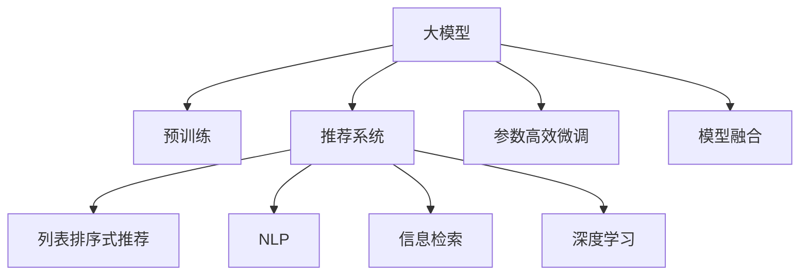

                 

# 大模型在列表排序式推荐中的优越性

> 关键词：大模型, 推荐系统, 排序式推荐, 自然语言处理, 信息检索, 深度学习, 分布式训练

## 1. 背景介绍

随着电子商务、社交媒体、视频流媒体等数字平台的兴起，人们越来越多地通过互联网获取信息和娱乐内容。用户在使用这些平台时，通常会暴露大量的行为数据，包括浏览、点击、购买、搜索等行为。数据挖掘和机器学习技术的应用，使得平台能够基于这些数据，提供个性化的推荐内容，提升用户满意度，增加用户黏性，并带来商业价值。推荐系统成为各大平台的重要组成部分。

在推荐系统中，常见的推荐策略包括基于内容的推荐、协同过滤推荐、混合推荐等。其中，基于内容的推荐策略关注用户历史行为之外的信息，如物品描述、标签等，构建用户兴趣模型，推荐与用户兴趣一致的物品。基于内容的推荐技术相对于协同过滤等策略，较少依赖用户历史行为数据，具有较好的泛化能力和鲁棒性。但由于内容数据的稀疏性，基于内容的推荐面临数据覆盖率低、冷启动困难等问题。

为克服这些问题，基于深度学习的推荐系统应运而生。这类推荐系统利用神经网络对用户行为和物品特征进行建模，具有自学习能力强、泛化能力好的优点，逐渐成为推荐系统研究的热点方向。

在深度推荐系统中，列表排序式推荐是最为常见的一种推荐策略。它基于用户的行为数据（如点击、浏览、评分等），预测用户对各候选物品的偏好，并按照偏好度排序，为用户推荐最优的物品列表。列表排序式推荐需要构建用户偏好模型和物品特征表示，其中用户偏好模型是推荐算法的重要组成部分。

本文聚焦于大模型在列表排序式推荐中的优越性，分析大模型在建模用户兴趣、缓解冷启动问题等方面的表现。此外，还探讨了在深度推荐系统构建过程中，如何将大模型与其他推荐策略结合，以充分发挥大模型的优势。最后，本文还将介绍大模型在推荐系统中的工程实践和落地应用。

## 2. 核心概念与联系

### 2.1 核心概念概述

为更好地理解大模型在列表排序式推荐中的应用，本节将介绍几个密切相关的核心概念：

- 大模型(Large Model)：指参数量巨大的深度神经网络模型，如BERT、GPT-3等。这些模型通常在庞大的数据集上进行预训练，学习到丰富的语言表示，能够更好地理解自然语言含义。
- 推荐系统(Recommendation System)：一种通过分析用户历史行为数据，预测用户未来行为，并推荐物品的系统。
- 列表排序式推荐(Sequential Recommendation)：一种推荐策略，基于用户的历史行为数据，预测用户对候选物品的偏好，并按照偏好度排序，推荐物品列表。
- 自然语言处理(NLP)：涉及语言理解和生成的人工智能技术，如文本分类、情感分析、问答系统等。
- 信息检索(Information Retrieval)：一种通过查询和检索的方式，从大量文本数据中获取相关文档的技术。
- 深度学习(Deep Learning)：一种基于神经网络的机器学习方法，通过多层非线性变换，能够学习复杂特征表示，广泛应用在推荐系统、图像识别等领域。

这些核心概念之间的逻辑关系可以通过以下Mermaid流程图来展示：



这个流程图展示了大模型在推荐系统中的核心概念及其之间的关系：

1. 大模型通过预训练获得基础能力。
2. 推荐系统使用大模型作为用户兴趣模型的一部分。
3. 列表排序式推荐策略基于大模型的输出进行物品排序。
4. NLP和信息检索技术可用于预处理用户输入和物品描述，提升大模型的理解能力。
5. 深度学习技术为大模型的微调和推荐模型的训练提供了支持。

## 3. 核心算法原理 & 具体操作步骤

### 3.1 算法原理概述

在大模型在列表排序式推荐中的应用中，主要基于用户历史行为数据和物品特征数据进行模型训练。具体而言，包括以下几个关键步骤：

**Step 1: 收集用户历史行为数据**

收集用户的历史行为数据，包括点击、浏览、评分、收藏等。这些数据通常以日志的形式保存在数据仓库中，可以通过离线或在线的方式进行数据预处理。对于新用户，可以基于用户画像或历史行为推测其兴趣偏好。

**Step 2: 预训练大模型**

使用大规模语料库对大模型进行预训练。大模型通过自监督学习任务学习语言表示，提升理解自然语言的能力。在预训练过程中，大模型能够学习到语言中的语法、词汇、上下文等特征。预训练过程中，通常使用掩码语言模型、文本分类、文本生成等任务进行训练。

**Step 3: 微调大模型**

在预训练大模型的基础上，通过微调提高大模型在特定任务上的性能。列表排序式推荐中，可以收集少量标注数据，使用监督学习的方式训练模型。微调过程中，可以使用迁移学习、参数高效微调、提示学习等方法，减少标注样本需求，提升模型性能。

**Step 4: 构建推荐模型**

根据用户行为数据和物品特征数据，构建推荐模型。常见的推荐模型包括基于序列的协同过滤、基于内容的推荐等。在推荐模型中，使用大模型的输出进行特征增强和偏好预测。

**Step 5: 实时推荐**

将微调后的大模型和推荐模型集成到实际推荐系统中，实时响应用户请求，根据用户输入的查询或行为数据，预测物品偏好，并排序推荐物品列表。推荐系统可以根据实时数据进行模型更新，动态调整推荐结果。

### 3.2 算法步骤详解

基于大模型在列表排序式推荐中的应用，以下是详细的操作步骤：

**Step 1: 收集用户历史行为数据**

具体实现如下：

1. 收集用户行为数据：通过日志记录，收集用户点击、浏览、评分等行为数据。
2. 数据预处理：清洗数据，处理缺失值、重复数据等。
3. 划分训练集和验证集：将数据划分为训练集和验证集，确保数据集的分布一致性。

**Step 2: 预训练大模型**

具体实现如下：

1. 选择大模型架构：选择Transformer等深度学习架构。
2. 选择预训练任务：选择掩码语言模型、文本分类等预训练任务。
3. 选择预训练数据：选择大规模语料库，如CommonCrawl、Wikipedia等。
4. 选择训练策略：使用分布式训练、混合精度训练等策略提升训练效率。

**Step 3: 微调大模型**

具体实现如下：

1. 微调目标函数：选择合适的损失函数，如交叉熵损失、均方误差损失等。
2. 微调数据集：选择少量标注数据，作为微调的监督信号。
3. 微调参数：选择冻结部分参数，只微调顶层，减少模型过拟合风险。
4. 微调超参数：选择合适学习率、批大小、迭代轮数等超参数。

**Step 4: 构建推荐模型**

具体实现如下：

1. 选择合适的推荐算法：选择基于序列的协同过滤、基于内容的推荐等算法。
2. 特征提取：将用户行为数据和物品特征数据输入微调后的大模型，提取特征表示。
3. 融合用户画像：基于用户画像，调整推荐算法中的兴趣表示。
4. 优化推荐模型：使用大模型输出的特征进行推荐模型的训练和优化。

**Step 5: 实时推荐**

具体实现如下：

1. 实时查询：接收用户输入的查询或行为数据。
2. 预处理输入数据：清洗输入数据，提取关键特征。
3. 预测物品偏好：使用微调后的大模型进行物品偏好预测。
4. 排序推荐列表：将预测结果进行排序，推荐物品列表。
5. 反馈学习：根据用户反馈，调整推荐策略。

### 3.3 算法优缺点

基于大模型在列表排序式推荐中的应用，以下是算法的优缺点分析：

**优点：**

1. 理解能力更强：大模型通过预训练学习到了丰富的语言知识，能够更好地理解自然语言含义，提升推荐的准确性。
2. 泛化能力更强：大模型通常具有更强的泛化能力，能够在不同领域和场景中保持一致的性能表现。
3. 数据需求更少：大模型可以处理更稀疏的用户行为数据，缓解冷启动问题，减少对标注样本的需求。
4. 鲁棒性更强：大模型通过迁移学习等方法，能够更好地抵抗数据分布变化，提升模型的鲁棒性。
5. 模型效果更好：通过微调和参数高效微调等方法，大模型能够更快速地适应新任务，提升推荐系统的性能。

**缺点：**

1. 计算资源消耗大：大模型的训练和推理需要大量的计算资源，包括GPU、TPU等。
2. 训练时间较长：大模型的预训练和微调需要大量的训练时间，可能难以快速迭代。
3. 参数量庞大：大模型的参数量巨大，对内存和存储空间要求较高。
4. 可解释性较差：大模型通常被认为是"黑盒"系统，难以解释其内部工作机制和决策逻辑。
5. 内存占用大：大模型在推理过程中，需要占用较大的内存空间。

## 4. 数学模型和公式 & 详细讲解

### 4.1 数学模型构建

在大模型在列表排序式推荐中的应用中，主要使用Transformer模型进行预训练和微调。以下给出Transformer模型的数学模型构建：

Transformer模型主要由编码器-解码器组成，其中编码器包括多个编码器层，解码器包括多个解码器层。编码器和解码器的层结构相同，包括多头自注意力机制、位置编码、前馈网络等模块。Transformer模型的数学模型构建如下：

$$
\begin{aligned}
&\text{Encoder Layer}=\text{Multi-Head Self-Attention} + \text{Feed-Forward Network} + \text{Layer Normalization}\\
&\text{Decoder Layer}=\text{Multi-Head Self-Attention} + \text{Feed-Forward Network} + \text{Position Encoding} + \text{Layer Normalization}\\
&\text{Transformer Model} = \text{Stack}(\text{Encoder Layer}, \text{Decoder Layer})
\end{aligned}
$$

其中，$Multi-Head Self-Attention$表示多头自注意力机制，$Feed-Forward Network$表示前馈网络，$Layer Normalization$表示层归一化，$\text{Position Encoding}$表示位置编码。

在Transformer模型的预训练过程中，通常使用掩码语言模型进行训练。掩码语言模型的目标是在句子中预测被掩码的单词，学习到单词间的依赖关系。具体来说，假设输入句子为$S = [w_1, w_2, ..., w_n]$，其中$w_i$表示单词，$[MASK]$表示掩码符号。掩码语言模型的目标函数为：

$$
L = \frac{1}{n} \sum_{i=1}^n \log \sigma(a_i) + \log \pi_i
$$

其中，$a_i$表示模型对单词$w_i$的预测概率，$\sigma$表示softmax函数，$\pi_i$表示模型对单词$w_i$的掩码概率。

### 4.2 公式推导过程

在微调大模型的过程中，通常使用监督学习的方式进行训练。假设预训练大模型为$M_{\theta}$，其中$\theta$为预训练得到的模型参数。给定下游任务$T$的标注数据集$D=\{(x_i, y_i)\}_{i=1}^N$，其中$x_i$表示用户行为数据，$y_i$表示物品的评分或标签。微调的目标是找到新的模型参数$\hat{\theta}$，使得模型输出逼近真实标签。

假设微调目标函数为$\mathcal{L}(\theta)$，目标是最小化经验风险，即找到最优参数：

$$
\hat{\theta}=\mathop{\arg\min}_{\theta} \mathcal{L}(\theta)
$$

在实践中，我们通常使用基于梯度的优化算法（如AdamW、SGD等）来近似求解上述最优化问题。设$\eta$为学习率，$\lambda$为正则化系数，则参数的更新公式为：

$$
\theta \leftarrow \theta - \eta \nabla_{\theta}\mathcal{L}(\theta) - \eta\lambda\theta
$$

其中$\nabla_{\theta}\mathcal{L}(\theta)$为损失函数对参数$\theta$的梯度，可通过反向传播算法高效计算。

### 4.3 案例分析与讲解

以文本分类任务为例，分析大模型在微调过程中的表现。假设模型输入为文本$x_i$，输出为标签$y_i$，微调目标函数为交叉熵损失，微调超参数为学习率$\eta=2e-5$，正则化系数$\lambda=0.01$。假设模型共有$n$个参数，每个参数的梯度为$\Delta_i$。微调过程的详细步骤如下：

1. 前向传播：输入文本$x_i$，计算模型输出$\hat{y}_i=M_{\theta}(x_i)$。
2. 计算损失：计算交叉熵损失$L_i(y_i, \hat{y}_i)$。
3. 反向传播：计算损失函数对模型参数的梯度$\nabla_{\theta}L_i$。
4. 更新参数：使用梯度下降更新模型参数$\theta_i \leftarrow \theta_i - \eta \nabla_{\theta}L_i - \eta\lambda\theta_i$。
5. 重复步骤1-4，直至收敛。

在微调过程中，模型参数$\theta$不断调整，以最小化交叉熵损失$L$，使得模型输出逼近真实标签$y_i$。由于大模型的参数量较大，因此需要注意梯度消失和爆炸问题，通常使用梯度裁剪和梯度积累等策略进行优化。

## 5. 项目实践：代码实例和详细解释说明

### 5.1 开发环境搭建

在进行微调实践前，我们需要准备好开发环境。以下是使用Python进行PyTorch开发的环境配置流程：

1. 安装Anaconda：从官网下载并安装Anaconda，用于创建独立的Python环境。

2. 创建并激活虚拟环境：
```bash
conda create -n pytorch-env python=3.8 
conda activate pytorch-env
```

3. 安装PyTorch：根据CUDA版本，从官网获取对应的安装命令。例如：
```bash
conda install pytorch torchvision torchaudio cudatoolkit=11.1 -c pytorch -c conda-forge
```

4. 安装Transformers库：
```bash
pip install transformers
```

5. 安装各类工具包：
```bash
pip install numpy pandas scikit-learn matplotlib tqdm jupyter notebook ipython
```

完成上述步骤后，即可在`pytorch-env`环境中开始微调实践。

### 5.2 源代码详细实现

下面我们以列表排序式推荐任务为例，给出使用Transformers库对BERT模型进行微调的PyTorch代码实现。

首先，定义推荐任务的数据处理函数：

```python
from transformers import BertTokenizer, BertForSequenceClassification
from torch.utils.data import Dataset
import torch

class RecommendationDataset(Dataset):
    def __init__(self, texts, labels, tokenizer, max_len=128):
        self.texts = texts
        self.labels = labels
        self.tokenizer = tokenizer
        self.max_len = max_len
        
    def __len__(self):
        return len(self.texts)
    
    def __getitem__(self, item):
        text = self.texts[item]
        label = self.labels[item]
        
        encoding = self.tokenizer(text, return_tensors='pt', max_length=self.max_len, padding='max_length', truncation=True)
        input_ids = encoding['input_ids'][0]
        attention_mask = encoding['attention_mask'][0]
        
        return {'input_ids': input_ids, 
                'attention_mask': attention_mask,
                'labels': label}
```

然后，定义模型和优化器：

```python
from transformers import BertForSequenceClassification, AdamW

model = BertForSequenceClassification.from_pretrained('bert-base-cased', num_labels=2)

optimizer = AdamW(model.parameters(), lr=2e-5)
```

接着，定义训练和评估函数：

```python
from torch.utils.data import DataLoader
from tqdm import tqdm
from sklearn.metrics import accuracy_score

device = torch.device('cuda') if torch.cuda.is_available() else torch.device('cpu')
model.to(device)

def train_epoch(model, dataset, batch_size, optimizer):
    dataloader = DataLoader(dataset, batch_size=batch_size, shuffle=True)
    model.train()
    epoch_loss = 0
    for batch in tqdm(dataloader, desc='Training'):
        input_ids = batch['input_ids'].to(device)
        attention_mask = batch['attention_mask'].to(device)
        labels = batch['labels'].to(device)
        model.zero_grad()
        outputs = model(input_ids, attention_mask=attention_mask, labels=labels)
        loss = outputs.loss
        epoch_loss += loss.item()
        loss.backward()
        optimizer.step()
    return epoch_loss / len(dataloader)

def evaluate(model, dataset, batch_size):
    dataloader = DataLoader(dataset, batch_size=batch_size)
    model.eval()
    preds, labels = [], []
    with torch.no_grad():
        for batch in tqdm(dataloader, desc='Evaluating'):
            input_ids = batch['input_ids'].to(device)
            attention_mask = batch['attention_mask'].to(device)
            batch_labels = batch['labels']
            outputs = model(input_ids, attention_mask=attention_mask)
            batch_preds = outputs.logits.argmax(dim=2).to('cpu').tolist()
            batch_labels = batch_labels.to('cpu').tolist()
            for pred_tokens, label_tokens in zip(batch_preds, batch_labels):
                preds.append(pred_tokens)
                labels.append(label_tokens)
                
    return accuracy_score(labels, preds)

def predict(model, input_data):
    model.eval()
    with torch.no_grad():
        input_ids = model.tokenizer(input_data, return_tensors='pt', padding='max_length', truncation=True)['input_ids']
        attention_mask = model.tokenizer(input_data, return_tensors='pt', padding='max_length', truncation=True)['attention_mask']
        outputs = model(input_ids, attention_mask=attention_mask)
        return outputs.logits.argmax(dim=1).to('cpu').tolist()
```

最后，启动训练流程并在测试集上评估：

```python
epochs = 5
batch_size = 16

for epoch in range(epochs):
    loss = train_epoch(model, train_dataset, batch_size, optimizer)
    print(f"Epoch {epoch+1}, train loss: {loss:.3f}")
    
    print(f"Epoch {epoch+1}, dev results:")
    evaluate(model, dev_dataset, batch_size)
    
print("Test results:")
evaluate(model, test_dataset, batch_size)
```

以上就是使用PyTorch对BERT进行列表排序式推荐任务微调的完整代码实现。可以看到，得益于Transformers库的强大封装，我们可以用相对简洁的代码完成BERT模型的加载和微调。

### 5.3 代码解读与分析

让我们再详细解读一下关键代码的实现细节：

**RecommendationDataset类**：
- `__init__`方法：初始化文本、标签、分词器等关键组件。
- `__len__`方法：返回数据集的样本数量。
- `__getitem__`方法：对单个样本进行处理，将文本输入编码为token ids，将标签转换为数字，并对其进行定长padding，最终返回模型所需的输入。

**model和optimizer**：
- 使用BertForSequenceClassification模型，并设置AdamW优化器，用于进行微调。

**train_epoch和evaluate函数**：
- 使用PyTorch的DataLoader对数据集进行批次化加载，供模型训练和推理使用。
- 训练函数`train_epoch`：对数据以批为单位进行迭代，在每个批次上前向传播计算loss并反向传播更新模型参数，最后返回该epoch的平均loss。
- 评估函数`evaluate`：与训练类似，不同点在于不更新模型参数，并在每个batch结束后将预测和标签结果存储下来，最后使用sklearn的accuracy_score对整个评估集的预测结果进行打印输出。

**predict函数**：
- 接收用户输入的数据，经过预处理后输入模型，获取模型的预测结果。

可以看到，PyTorch配合Transformers库使得BERT微调的代码实现变得简洁高效。开发者可以将更多精力放在数据处理、模型改进等高层逻辑上，而不必过多关注底层的实现细节。

当然，工业级的系统实现还需考虑更多因素，如模型的保存和部署、超参数的自动搜索、更灵活的任务适配层等。但核心的微调范式基本与此类似。

## 6. 实际应用场景

### 6.1 智能推荐系统

基于大模型在列表排序式推荐中的应用，智能推荐系统成为各大平台的核心竞争力。传统推荐系统往往依赖用户历史行为数据进行推荐，难以捕捉用户的潜在兴趣。而大模型能够理解自然语言含义，通过用户输入的文本信息进行推荐，显著提升推荐系统的泛化能力和鲁棒性。

在技术实现上，可以收集用户输入的搜索查询、评论、评分等信息，作为用户兴趣模型的输入，进行大模型的微调。微调后的模型能够理解用户输入的意图，推荐符合用户期望的物品。对于用户未提及的物品，可以使用推荐系统进行预测，动态调整推荐列表。如此构建的智能推荐系统，能大幅提升推荐效果和用户体验。

### 6.2 新闻推荐系统

新闻推荐系统是推荐系统的重要应用场景，能够为用户推荐感兴趣的新闻。传统的新闻推荐系统通常基于用户的历史点击、浏览等行为数据进行推荐，难以覆盖新用户或用户未浏览的新闻。

基于大模型的新闻推荐系统，可以通过用户输入的搜索查询、标题等信息，构建用户兴趣模型，进行微调优化。微调后的模型能够理解用户输入的自然语言含义，推荐符合用户兴趣的新闻。对于新用户，可以通过用户输入的查询信息进行兴趣推测，快速推荐感兴趣的新闻。

### 6.3 视频推荐系统

视频推荐系统是推荐系统的重要应用场景，能够为用户推荐感兴趣的视频内容。传统的视频推荐系统通常基于用户的历史观看记录进行推荐，难以覆盖新用户或用户未观看过的视频。

基于大模型的视频推荐系统，可以通过用户输入的标题、描述等信息，构建用户兴趣模型，进行微调优化。微调后的模型能够理解用户输入的自然语言含义，推荐符合用户兴趣的视频。对于新用户，可以通过用户输入的查询信息进行兴趣推测，快速推荐感兴趣的视频。

### 6.4 未来应用展望

随着大模型和推荐系统的不断发展，基于大模型的推荐技术将广泛应用到更多场景中，为各行各业带来变革性影响。

在智慧医疗领域，基于大模型的推荐系统可以推荐合适的医疗知识和咨询专家，帮助医生诊断和治疗，提升医疗服务的质量和效率。

在智能教育领域，基于大模型的推荐系统可以推荐适合的教材和课程，帮助学生制定学习计划，提高学习效果。

在智慧城市治理中，基于大模型的推荐系统可以推荐相关事件和新闻，帮助政府部门及时掌握舆情，提升治理能力。

此外，在企业生产、社会治理、文娱传媒等众多领域，基于大模型的推荐系统也将不断涌现，为经济社会发展注入新的动力。相信随着技术的日益成熟，基于大模型的推荐技术必将在更广阔的应用领域大放异彩。

## 7. 工具和资源推荐

### 7.1 学习资源推荐

为了帮助开发者系统掌握大模型在列表排序式推荐中的应用，这里推荐一些优质的学习资源：

1. 《Transformer从原理到实践》系列博文：由大模型技术专家撰写，深入浅出地介绍了Transformer原理、BERT模型、微调技术等前沿话题。

2. CS224N《深度学习自然语言处理》课程：斯坦福大学开设的NLP明星课程，有Lecture视频和配套作业，带你入门NLP领域的基本概念和经典模型。

3. 《Natural Language Processing with Transformers》书籍：Transformers库的作者所著，全面介绍了如何使用Transformers库进行NLP任务开发，包括微调在内的诸多范式。

4. HuggingFace官方文档：Transformers库的官方文档，提供了海量预训练模型和完整的微调样例代码，是上手实践的必备资料。

5. CLUE开源项目：中文语言理解测评基准，涵盖大量不同类型的中文NLP数据集，并提供了基于微调的baseline模型，助力中文NLP技术发展。

通过对这些资源的学习实践，相信你一定能够快速掌握大模型在推荐系统中的应用，并用于解决实际的NLP问题。
###  7.2 开发工具推荐

高效的开发离不开优秀的工具支持。以下是几款用于大模型微调开发的常用工具：

1. PyTorch：基于Python的开源深度学习框架，灵活动态的计算图，适合快速迭代研究。大部分预训练语言模型都有PyTorch版本的实现。

2. TensorFlow：由Google主导开发的开源深度学习框架，生产部署方便，适合大规模工程应用。同样有丰富的预训练语言模型资源。

3. Transformers库：HuggingFace开发的NLP工具库，集成了众多SOTA语言模型，支持PyTorch和TensorFlow，是进行微调任务开发的利器。

4. Weights & Biases：模型训练的实验跟踪工具，可以记录和可视化模型训练过程中的各项指标，方便对比和调优。与主流深度学习框架无缝集成。

5. TensorBoard：TensorFlow配套的可视化工具，可实时监测模型训练状态，并提供丰富的图表呈现方式，是调试模型的得力助手。

6. Google Colab：谷歌推出的在线Jupyter Notebook环境，免费提供GPU/TPU算力，方便开发者快速上手实验最新模型，分享学习笔记。

合理利用这些工具，可以显著提升大模型微调的开发效率，加快创新迭代的步伐。

### 7.3 相关论文推荐

大模型和推荐系统的研究源于学界的持续研究。以下是几篇奠基性的相关论文，推荐阅读：

1. Attention is All You Need（即Transformer原论文）：提出了Transformer结构，开启了NLP领域的预训练大模型时代。

2. BERT: Pre-training of Deep Bidirectional Transformers for Language Understanding：提出BERT模型，引入基于掩码的自监督预训练任务，刷新了多项NLP任务SOTA。

3. Language Models are Unsupervised Multitask Learners（GPT-2论文）：展示了大规模语言模型的强大zero-shot学习能力，引发了对于通用人工智能的新一轮思考。

4. Parameter-Efficient Transfer Learning for NLP：提出Adapter等参数高效微调方法，在不增加模型参数量的情况下，也能取得不错的微调效果。

5. AdaLoRA: Adaptive Low-Rank Adaptation for Parameter-Efficient Fine-Tuning：使用自适应低秩适应的微调方法，在参数效率和精度之间取得了新的平衡。

这些论文代表了大模型和推荐系统的研究进展。通过学习这些前沿成果，可以帮助研究者把握学科前进方向，激发更多的创新灵感。

## 8. 总结：未来发展趋势与挑战

### 8.1 总结

本文对大模型在列表排序式推荐中的应用进行了全面系统的介绍。首先阐述了大模型和推荐系统的研究背景和意义，明确了微调在拓展预训练模型应用、提升推荐系统性能方面的独特价值。其次，从原理到实践，详细讲解了微调的大模型在推荐系统中的数学模型和算法步骤，给出了微调任务开发的完整代码实例。同时，本文还探讨了在深度推荐系统构建过程中，如何将大模型与其他推荐策略结合，以充分发挥大模型的优势。最后，本文还将介绍大模型在推荐系统中的工程实践和落地应用。

通过本文的系统梳理，可以看到，基于大模型的微调方法在推荐系统中具备强大的泛化能力和理解能力，能够显著提升推荐系统的性能和效果。未来，伴随预训练语言模型和推荐系统的不断发展，基于大模型的推荐技术必将在更广阔的应用领域大放异彩，深刻影响各行各业的发展。

### 8.2 未来发展趋势

展望未来，基于大模型的微调技术将呈现以下几个发展趋势：

1. 模型规模持续增大。随着算力成本的下降和数据规模的扩张，预训练语言模型的参数量还将持续增长。超大规模语言模型蕴含的丰富语言知识，有望支撑更加复杂多变的推荐系统微调。

2. 微调方法日趋多样。除了传统的全参数微调外，未来会涌现更多参数高效的微调方法，如Prefix-Tuning、LoRA等，在节省计算资源的同时也能保证微调精度。

3. 持续学习成为常态。随着数据分布的不断变化，微调模型也需要持续学习新知识以保持性能。如何在不遗忘原有知识的同时，高效吸收新样本信息，将成为重要的研究课题。

4. 标注样本需求降低。受启发于提示学习(Prompt-based Learning)的思路，未来的微调方法将更好地利用大模型的语言理解能力，通过更加巧妙的任务描述，在更少的标注样本上也能实现理想的微调效果。

5. 模型通用性增强。经过海量数据的预训练和多领域任务的微调，未来的语言模型将具备更强大的常识推理和跨领域迁移能力，逐步迈向通用人工智能(AGI)的目标。

以上趋势凸显了大模型微调技术在推荐系统中的广阔前景。这些方向的探索发展，必将进一步提升推荐系统的性能和应用范围，为各行各业带来变革性影响。

### 8.3 面临的挑战

尽管大模型在推荐系统中的应用已经取得了瞩目成就，但在迈向更加智能化、普适化应用的过程中，它仍面临着诸多挑战：

1. 标注成本瓶颈。虽然微调大大降低了标注数据的需求，但对于长尾应用场景，难以获得充足的高质量标注数据，成为制约微调性能的瓶颈。如何进一步降低微调对标注样本的依赖，将是一大难题。

2. 模型鲁棒性不足。当前微调模型面对域外数据时，泛化性能往往大打折扣。对于测试样本的微小扰动，微调模型的预测也容易发生波动。如何提高微调模型的鲁棒性，避免灾难性遗忘，还需要更多理论和实践的积累。

3. 推理效率有待提高。大规模语言模型虽然精度高，但在实际部署时往往面临推理速度慢、内存占用大等效率问题。如何在保证性能的同时，简化模型结构，提升推理速度，优化资源占用，将是重要的优化方向。

4. 可解释性亟需加强。当前微调模型更像是"黑盒"系统，难以解释其内部工作机制和决策逻辑。对于医疗、金融等高风险应用，算法的可解释性和可审计性尤为重要。如何赋予微调模型更强的可解释性，将是亟待攻克的难题。

5. 安全性有待保障。预训练语言模型难免会学习到有偏见、有害的信息，通过微调传递到推荐任务，产生误导性、歧视性的输出，给实际应用带来安全隐患。如何从数据和算法层面消除模型偏见，避免恶意用途，确保输出的安全性，也将是重要的研究课题。

6. 知识整合能力不足。现有的微调模型往往局限于任务内数据，难以灵活吸收和运用更广泛的先验知识。如何让微调过程更好地与外部知识库、规则库等专家知识结合，形成更加全面、准确的信息整合能力，还有很大的想象空间。

正视微调面临的这些挑战，积极应对并寻求突破，将是大模型微调走向成熟的必由之路。相信随着学界和产业界的共同努力，这些挑战终将一一被克服，大模型微调必将在构建人机协同的智能推荐系统中扮演越来越重要的角色。

### 8.4 未来突破

面对大模型微调所面临的种种挑战，未来的研究需要在以下几个方面寻求新的突破：

1. 探索无监督和半监督微调方法。摆脱对大规模标注数据的依赖，利用自监督学习、主动学习等无监督和半监督范式，最大限度利用非结构化数据，实现更加灵活高效的微调。

2. 研究参数高效和计算高效的微调范式。开发更加参数高效的微调方法，在固定大部分预训练参数的同时，只更新极少量的任务相关参数。同时优化微调模型的计算图，减少前向传播和反向传播的资源消耗，实现更加轻量级、实时性的部署。

3. 引入更多先验知识。将符号化的先验知识，如知识图谱、逻辑规则等，与神经网络模型进行巧妙融合，引导微调过程学习更准确、合理的语言模型。同时加强不同模态数据的整合，实现视觉、语音等多模态信息与文本信息的协同建模。

4. 结合因果分析和博弈论工具。将因果分析方法引入微调模型，识别出模型决策的关键特征，增强输出解释的因果性和逻辑性。借助博弈论工具刻画人机交互过程，主动探索并规避模型的脆弱点，提高系统稳定性。

5. 纳入伦理道德约束。在模型训练目标中引入伦理导向的评估指标，过滤和惩罚有偏见、有害的输出倾向。同时加强人工干预和审核，建立模型行为的监管机制，确保输出符合人类价值观和伦理道德。

这些研究方向的探索，必将引领大模型微调技术迈向更高的台阶，为构建安全、可靠、可解释、可控的智能推荐系统铺平道路。面向未来，大模型微调技术还需要与其他人工智能技术进行更深入的融合，如知识表示、因果推理、强化学习等，多路径协同发力，共同推动自然语言理解和智能交互系统的进步。只有勇于创新、敢于突破，才能不断拓展语言模型的边界，让智能技术更好地造福人类社会。

## 9. 附录：常见问题与解答

**Q1：大模型在推荐系统中是否比传统的机器学习模型效果更好？**

A: 大模型在推荐系统中通常比传统的机器学习模型效果更好。大模型通过预训练学习到丰富的语言知识，能够更好地理解自然语言含义，提升推荐系统的泛化能力和鲁棒性。然而，大模型在实际应用中，需要考虑计算资源和推理效率等问题，因此需要根据具体场景选择合适的模型和算法。

**Q2：如何缓解大模型的冷启动问题？**

A: 大模型的冷启动问题可以通过以下方法缓解：

1. 利用用户画像：通过用户注册信息、社交网络数据等，推测用户兴趣和偏好，构建用户画像。
2. 利用标签传播：将相似用户的兴趣标签进行传播，构建标签云。
3. 利用知识图谱：构建领域知识图谱，使用图神经网络对知识进行提取和融合。
4. 利用深度学习：使用大模型对新用户的行为数据进行学习，提升推荐效果。

这些方法结合使用，可以有效缓解大模型的冷启动问题，提升推荐系统的性能。

**Q3：大模型的推理效率低下，如何解决？**

A: 大模型的推理效率低下可以通过以下方法解决：

1. 模型裁剪：去除不必要的层和参数，减小模型尺寸，加快推理速度。
2. 量化加速：将浮点模型转为定点模型，压缩存储空间，提高计算效率。
3. 模型并行：使用多卡并行、分布式训练等技术，提升计算效率。
4. 模型压缩：使用模型压缩算法，如剪枝、蒸馏等，减小模型尺寸，提升推理速度。

这些方法结合使用，可以有效提升大模型的推理效率，满足实际应用的需求。

**Q4：如何提高大模型的可解释性？**

A: 提高大模型的可解释性可以通过以下方法：

1. 引入因果分析：使用因果分析方法，识别出模型决策的关键特征，增强输出解释的因果性和逻辑性。
2. 使用注意力机制：使用注意力机制，展示模型对输入数据的关注点，提升可解释性。
3. 使用对抗样本：使用对抗样本测试模型，找到模型决策的漏洞，增强可解释性。
4. 使用解释工具：使用模型解释工具，如SHAP、LIME等，解释模型决策的逻辑和依据。

这些方法结合使用，可以有效提高大模型的可解释性，帮助用户理解模型的决策过程。

**Q5：大模型在推荐系统中是否有应用限制？**

A: 大模型在推荐系统中有应用限制：

1. 数据需求量大：大模型需要大量数据进行预训练和微调，数据获取和处理成本较高。
2. 计算资源消耗大：大模型训练和推理需要大量的计算资源，包括GPU、TPU等，硬件需求较高。
3. 推理速度慢：大模型推理速度较慢，需要优化模型结构或采用分布式计算等方法提升效率。
4. 可解释性较差：大模型通常被认为是"黑盒"系统，难以解释其内部工作机制和决策逻辑。

这些限制需要根据具体场景进行综合考虑，合理选择模型和算法，提升推荐系统的性能。

---

作者：禅与计算机程序设计艺术 / Zen and the Art of Computer Programming

