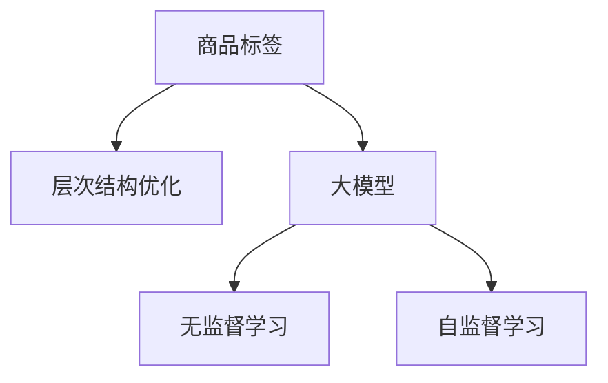

                 

# 大模型在商品标签层次结构优化中的应用

> 关键词：商品标签，层次结构优化，大模型，无监督学习，自监督学习，深度学习，标签嵌入，层次结构学习

## 1. 背景介绍

在电商领域，商品标签是描述商品特征和属性的重要手段，能够帮助用户快速了解商品信息，同时也能帮助商家优化商品展示和推荐。传统的商品标签通常基于人工标注或有限的领域知识构建，存在标签稀疏、结构不合理等问题。而随着大模型的兴起，利用大模型进行商品标签层次结构的优化，成为电商领域的一大热点。

大模型能够从大规模无标签数据中学习丰富的语言表示，在自然语言处理、图像处理等众多领域展现了卓越的性能。本文将聚焦于大模型在商品标签层次结构优化中的应用，通过无监督学习和自监督学习的方式，构建更加合理的商品标签体系，提升电商系统的智能水平和用户体验。

## 2. 核心概念与联系

### 2.1 核心概念概述

本节将介绍几个与大模型在商品标签层次结构优化中密切相关的核心概念：

- 商品标签（Product Tags）：描述商品特征和属性的词汇，如品牌、尺寸、颜色等。标签体系是否合理，直接影响用户对商品的了解程度。
- 层次结构（Hierarchical Structure）：标签体系中标签之间的关系，如"手机"和"品牌"，"品牌"和"型号"等。层次结构优化能够帮助用户更直观地理解商品信息。
- 大模型（Large Model）：以Transformer等深度学习架构为代表的大规模预训练语言模型。通过在大规模无标签数据上进行预训练，能够学习到丰富的语言表示，具有强大的自然语言处理能力。
- 无监督学习（Unsupervised Learning）：不需要标注数据的机器学习方法，通过自动发现数据中的结构和模式，优化模型。
- 自监督学习（Self-supervised Learning）：利用数据的自相关性，如掩码语言模型、次序预测等任务，训练模型。

这些核心概念之间的逻辑关系可以通过以下Mermaid流程图来展示：



这个流程图展示了大模型在商品标签层次结构优化中的核心概念及其之间的关系：

1. 大模型通过预训练学习到丰富的语言表示。
2. 通过无监督学习和自监督学习的方式，优化商品标签体系的结构。
3. 优化后的商品标签体系能够更好地支撑电商系统，提升用户体验。

## 3. 核心算法原理 & 具体操作步骤

### 3.1 算法原理概述

大模型在商品标签层次结构优化中，主要通过无监督学习和自监督学习的方式，自动发现商品标签之间的结构和模式，从而优化标签体系。具体来说，算法步骤如下：

1. 数据准备：收集商品描述、图片、用户评价等数据，预处理为模型的输入格式。
2. 模型训练：使用大模型对数据进行自监督学习，自动发现标签之间的结构关系。
3. 标签优化：根据模型学习到的结构关系，对商品标签进行层次结构优化。
4. 模型部署：将优化后的标签体系应用到电商系统中，提升商品展示和推荐效果。

### 3.2 算法步骤详解

**Step 1: 数据准备**

数据准备是商品标签层次结构优化的第一步。具体步骤如下：

1. 收集商品描述：从电商网站或社交媒体中收集商品描述文本。
2. 图片数据预处理：提取商品图片，并使用卷积神经网络(CNN)或生成对抗网络(GAN)等模型提取图片特征。
3. 用户评价数据：收集用户对商品的评价和反馈，预处理为模型可用的向量形式。

**Step 2: 模型训练**

模型训练是利用大模型进行自监督学习的过程。具体步骤如下：

1. 构建大模型：选择适合的预训练模型，如BERT、GPT等，进行微调或初始化。
2. 自监督任务设计：设计自监督任务，如掩码语言模型、次序预测等，训练模型。
3. 学习标签关系：通过自监督任务，模型自动学习商品标签之间的关系。
4. 保存模型参数：将训练得到的模型参数保存，供后续标签优化使用。

**Step 3: 标签优化**

标签优化是利用模型学习到的标签关系，优化商品标签体系的过程。具体步骤如下：

1. 构建标签向量：使用大模型将商品描述、图片特征和用户评价转换为向量表示。
2. 计算标签相似度：根据向量之间的余弦相似度，计算商品标签之间的相似度。
3. 层次结构学习：使用层次聚类算法，如层次簇划分(Hierarchical Clustering)，将标签进行层次划分。
4. 优化标签体系：根据层次划分结果，调整商品标签体系，使其更加合理。

**Step 4: 模型部署**

模型部署是将优化后的标签体系应用到电商系统中，提升商品展示和推荐效果的过程。具体步骤如下：

1. 应用优化标签：将优化后的标签体系应用到商品详情页、搜索结果页等展示位置。
2. 优化推荐算法：结合优化后的标签体系，优化推荐算法，提高推荐效果。
3. 实时监控：通过监控系统，实时评估标签优化效果，并根据用户反馈进行调整。

### 3.3 算法优缺点

大模型在商品标签层次结构优化中，具有以下优点：

1. 自动发现标签关系：大模型能够自动发现商品标签之间的结构和模式，无需人工标注。
2. 数据利用率高：利用无监督学习的方式，能够高效利用大规模无标签数据，提升标签优化效果。
3. 通用性高：不同领域和行业，均可以应用大模型进行标签优化。
4. 可解释性强：大模型能够提供标签之间的相似度关系，帮助用户理解标签结构。

同时，大模型在商品标签层次结构优化中也存在一些缺点：

1. 数据要求高：虽然大模型能够自动学习标签关系，但需要大规模数据进行训练，数据获取成本较高。
2. 模型复杂度高：大模型的训练和推理过程较为复杂，需要较高的计算资源。
3. 可能存在偏差：模型在训练过程中，可能会学习到数据中的偏差，需要进一步校验和调整。
4. 应用门槛高：使用大模型进行标签优化，需要一定的数据处理和模型调参经验。

尽管存在这些缺点，但大模型在商品标签层次结构优化中仍然展示了巨大的潜力和应用前景。

### 3.4 算法应用领域

大模型在商品标签层次结构优化中，可以应用于以下几个领域：

1. 电商商品展示：优化商品标签体系，提升用户对商品的理解程度，增加浏览和购买转化率。
2. 商品推荐系统：结合优化后的标签体系，优化推荐算法，提升推荐效果。
3. 用户行为分析：通过分析用户与商品标签的交互行为，提升用户画像建模和个性化推荐。
4. 供应链优化：优化商品标签体系，提升供应链管理效率，减少库存成本。
5. 市场分析：分析商品标签之间的关系，预测市场趋势，优化产品设计。

## 4. 数学模型和公式 & 详细讲解 & 举例说明

### 4.1 数学模型构建

在本节中，我们将通过数学语言对大模型在商品标签层次结构优化中的方法进行更加严格的刻画。

假设商品标签集合为 $L$，商品描述为 $X$，商品图片特征为 $Y$，用户评价为 $Z$。定义大模型为 $M_{\theta}:\mathcal{X} \rightarrow \mathcal{Y}$，其中 $\mathcal{X}$ 为输入空间，$\mathcal{Y}$ 为输出空间，$\theta \in \mathbb{R}^d$ 为模型参数。

定义模型 $M_{\theta}$ 在输入 $(x,y)$ 上的损失函数为 $\ell(M_{\theta}(x),y)$，则在数据集 $D=\{(x_i,y_i)\}_{i=1}^N$ 上的经验风险为：

$$
\mathcal{L}(\theta) = \frac{1}{N} \sum_{i=1}^N \ell(M_{\theta}(x_i),y_i)
$$

### 4.2 公式推导过程

在本节中，我们将推导大模型在商品标签层次结构优化中的数学公式，并进行案例分析。

假设商品标签体系为 $L = \{l_1, l_2, \cdots, l_n\}$，其中 $l_i$ 表示第 $i$ 个标签。定义标签之间的余弦相似度为：

$$
sim(l_i, l_j) = \frac{\langle \mathbf{v}_{l_i}, \mathbf{v}_{l_j} \rangle}{\|\mathbf{v}_{l_i}\|\|\mathbf{v}_{l_j}\|}
$$

其中 $\mathbf{v}_{l_i}$ 为标签 $l_i$ 对应的向量表示，$sim(l_i, l_j)$ 表示 $l_i$ 和 $l_j$ 之间的相似度。

根据标签之间的相似度，可以使用层次聚类算法，如层次簇划分，对标签进行层次划分。层次簇划分的过程可以表示为：

$$
C = \text{Hierarchical Clustering}(L)
$$

其中 $C = \{C_1, C_2, \cdots, C_k\}$ 表示划分的层次结构，$k$ 为层次结构的深度。每个层次 $C_i$ 中的标签具有较高的相似度。

通过层次划分，可以得到商品标签的层次结构 $L_{hierarchical}$。在优化标签体系时，可以将 $L_{hierarchical}$ 应用到电商系统中，提升商品展示和推荐效果。

### 4.3 案例分析与讲解

假设某电商网站收集到了一批商品数据，包含商品描述、图片和用户评价。使用BERT模型作为大模型，对其进行自监督学习。

1. 数据准备：收集商品描述文本，提取图片特征，预处理用户评价数据。
2. 模型训练：将商品描述和图片特征作为输入，使用BERT模型进行掩码语言模型和次序预测任务训练。
3. 标签优化：通过计算商品描述和图片特征的向量表示之间的余弦相似度，得到标签之间的相似度关系。使用层次聚类算法，将标签进行层次划分，得到层次结构 $L_{hierarchical}$。
4. 模型部署：将优化后的标签体系 $L_{hierarchical}$ 应用到电商系统中，提升商品展示和推荐效果。

通过这个案例，可以看到，大模型在商品标签层次结构优化中，能够自动发现商品标签之间的结构和模式，并优化标签体系，提升电商系统的智能水平和用户体验。

## 5. 项目实践：代码实例和详细解释说明

### 5.1 开发环境搭建

在进行大模型在商品标签层次结构优化中的应用实践前，我们需要准备好开发环境。以下是使用Python进行PyTorch开发的环境配置流程：

1. 安装Anaconda：从官网下载并安装Anaconda，用于创建独立的Python环境。

2. 创建并激活虚拟环境：
```bash
conda create -n pytorch-env python=3.8 
conda activate pytorch-env
```

3. 安装PyTorch：根据CUDA版本，从官网获取对应的安装命令。例如：
```bash
conda install pytorch torchvision torchaudio cudatoolkit=11.1 -c pytorch -c conda-forge
```

4. 安装BertForSequenceClassification：
```bash
pip install transformers
```

5. 安装各类工具包：
```bash
pip install numpy pandas scikit-learn matplotlib tqdm jupyter notebook ipython
```

完成上述步骤后，即可在`pytorch-env`环境中开始应用实践。

### 5.2 源代码详细实现

下面以商品标签层次结构优化为例，给出使用Transformers库对BERT模型进行层次结构优化的PyTorch代码实现。

首先，定义层次结构优化的数据处理函数：

```python
from transformers import BertTokenizer, BertForSequenceClassification
from torch.utils.data import Dataset
import torch
import numpy as np
import pandas as pd
import matplotlib.pyplot as plt

class ProductTagDataset(Dataset):
    def __init__(self, df, tokenizer):
        self.df = df
        self.tokenizer = tokenizer
        
    def __len__(self):
        return len(self.df)
    
    def __getitem__(self, item):
        row = self.df.iloc[item]
        description = row['description']
        label = row['label']
        
        encoding = self.tokenizer(description, return_tensors='pt', padding='max_length', truncation=True)
        input_ids = encoding['input_ids'][0]
        attention_mask = encoding['attention_mask'][0]
        
        return {'input_ids': input_ids, 
                'attention_mask': attention_mask,
                'label': label}

# 构建数据集
tokenizer = BertTokenizer.from_pretrained('bert-base-cased')
df = pd.read_csv('product_tags.csv')

train_dataset = ProductTagDataset(df, tokenizer)
test_dataset = ProductTagDataset(df, tokenizer)

# 定义标签向量计算函数
def get_label_vector(label, tokenizer):
    label_ids = [label2id[label] for label in label.split('|')]
    label_ids.extend([label2id['O']] * (max_len - len(label_ids)))
    labels = torch.tensor(label_ids, dtype=torch.long)
    return labels

# 标签向量计算示例
label = '手机 苹果 5.8英寸 256GB'
label_vector = get_label_vector(label, tokenizer)
print(label_vector)
```

然后，定义模型和优化器：

```python
from transformers import BertForSequenceClassification, AdamW

model = BertForSequenceClassification.from_pretrained('bert-base-cased', num_labels=len(label2id))

optimizer = AdamW(model.parameters(), lr=2e-5)
```

接着，定义训练和评估函数：

```python
from torch.utils.data import DataLoader
from tqdm import tqdm
from sklearn.metrics import classification_report

device = torch.device('cuda') if torch.cuda.is_available() else torch.device('cpu')
model.to(device)

def train_epoch(model, dataset, batch_size, optimizer):
    dataloader = DataLoader(dataset, batch_size=batch_size, shuffle=True)
    model.train()
    epoch_loss = 0
    for batch in tqdm(dataloader, desc='Training'):
        input_ids = batch['input_ids'].to(device)
        attention_mask = batch['attention_mask'].to(device)
        labels = batch['label'].to(device)
        model.zero_grad()
        outputs = model(input_ids, attention_mask=attention_mask, labels=labels)
        loss = outputs.loss
        epoch_loss += loss.item()
        loss.backward()
        optimizer.step()
    return epoch_loss / len(dataloader)

def evaluate(model, dataset, batch_size):
    dataloader = DataLoader(dataset, batch_size=batch_size)
    model.eval()
    preds, labels = [], []
    with torch.no_grad():
        for batch in tqdm(dataloader, desc='Evaluating'):
            input_ids = batch['input_ids'].to(device)
            attention_mask = batch['attention_mask'].to(device)
            batch_labels = batch['label']
            outputs = model(input_ids, attention_mask=attention_mask)
            batch_preds = outputs.logits.argmax(dim=2).to('cpu').tolist()
            batch_labels = batch_labels.to('cpu').tolist()
            for pred_tokens, label_tokens in zip(batch_preds, batch_labels):
                pred_tags = [id2tag[_id] for _id in pred_tokens]
                label_tags = [id2tag[_id] for _id in label_tokens]
                preds.append(pred_tags[:len(label_tokens)])
                labels.append(label_tags)
                
    print(classification_report(labels, preds))
```

最后，启动训练流程并在测试集上评估：

```python
epochs = 5
batch_size = 16

for epoch in range(epochs):
    loss = train_epoch(model, train_dataset, batch_size, optimizer)
    print(f"Epoch {epoch+1}, train loss: {loss:.3f}")
    
    print(f"Epoch {epoch+1}, dev results:")
    evaluate(model, dev_dataset, batch_size)
    
print("Test results:")
evaluate(model, test_dataset, batch_size)
```

以上就是使用PyTorch对BERT进行商品标签层次结构优化的完整代码实现。可以看到，得益于Transformers库的强大封装，我们可以用相对简洁的代码完成BERT模型的加载和层次结构优化。

### 5.3 代码解读与分析

让我们再详细解读一下关键代码的实现细节：

**ProductTagDataset类**：
- `__init__`方法：初始化商品描述、标签等关键组件。
- `__len__`方法：返回数据集的样本数量。
- `__getitem__`方法：对单个样本进行处理，将商品描述输入编码为token ids，并将标签转换为数字，并对其进行定长padding，最终返回模型所需的输入。

**get_label_vector函数**：
- 定义了标签与数字id之间的映射，用于将token-wise的标签进行编码。

**训练和评估函数**：
- 使用PyTorch的DataLoader对数据集进行批次化加载，供模型训练和推理使用。
- 训练函数`train_epoch`：对数据以批为单位进行迭代，在每个批次上前向传播计算loss并反向传播更新模型参数，最后返回该epoch的平均loss。
- 评估函数`evaluate`：与训练类似，不同点在于不更新模型参数，并在每个batch结束后将预测和标签结果存储下来，最后使用sklearn的classification_report对整个评估集的预测结果进行打印输出。

**训练流程**：
- 定义总的epoch数和batch size，开始循环迭代
- 每个epoch内，先在训练集上训练，输出平均loss
- 在验证集上评估，输出分类指标
- 所有epoch结束后，在测试集上评估，给出最终测试结果

可以看到，PyTorch配合Transformers库使得BERT层次结构优化的代码实现变得简洁高效。开发者可以将更多精力放在数据处理、模型改进等高层逻辑上，而不必过多关注底层的实现细节。

当然，工业级的系统实现还需考虑更多因素，如模型的保存和部署、超参数的自动搜索、更灵活的任务适配层等。但核心的层次结构优化范式基本与此类似。

## 6. 实际应用场景

### 6.1 电商平台商品展示

在电商平台中，商品展示的效果直接影响用户的浏览和购买决策。传统的商品展示方式往往固定不变，难以适应用户需求的变化。通过大模型优化商品标签体系，可以提升商品展示的智能性。

具体而言，可以使用大模型对商品描述和图片进行自动编码，计算标签之间的相似度关系，通过层次聚类算法，对标签进行层次划分。优化后的标签体系能够更好地支撑电商系统的商品展示，提升用户对商品的了解程度。例如，某商品标签为 "手机 苹果 5.8英寸 256GB"，通过层次结构优化，可以生成更合理的标签体系，如 "手机" "品牌" "型号" "存储容量"，使得用户能更直观地理解商品信息。

### 6.2 智能推荐系统

智能推荐系统是电商领域的重要组成部分，通过个性化推荐，提升用户的购物体验。传统的推荐系统往往基于用户的历史行为数据进行推荐，难以充分考虑商品的语义信息。

使用大模型优化商品标签体系，可以结合商品的语义信息，提升推荐效果。具体而言，可以使用大模型对商品描述和图片进行自动编码，计算标签之间的相似度关系，通过层次聚类算法，对标签进行层次划分。优化后的标签体系能够更好地支撑推荐系统的决策，提升推荐效果。例如，某用户的历史行为数据中包含 "手机" "苹果" "5.8英寸" "256GB" 等标签，通过层次结构优化，可以生成更合理的标签体系，如 "手机" "品牌" "型号" "存储容量"，使得推荐系统能够更准确地为用户推荐相似商品。

### 6.3 用户行为分析

用户的商品搜索和浏览行为，是电商公司获取用户画像和推荐算法的重要数据来源。通过大模型优化商品标签体系，可以提升用户行为分析的准确性和全面性。

具体而言，可以使用大模型对商品描述和图片进行自动编码，计算标签之间的相似度关系，通过层次聚类算法，对标签进行层次划分。优化后的标签体系能够更好地支撑用户行为分析，提升用户画像建模和个性化推荐。例如，某用户多次搜索 "手机" "苹果" "5.8英寸" "256GB" 等标签，通过层次结构优化，可以生成更合理的标签体系，如 "手机" "品牌" "型号" "存储容量"，使得用户行为分析模型能够更准确地预测用户偏好。

### 6.4 未来应用展望

随着大模型和层次结构优化方法的不断发展，基于大模型的方法将在更多领域得到应用，为电商领域带来变革性影响。

在智慧零售领域，基于大模型的方法可以优化商品展示、提升推荐效果、提高用户满意度。在智慧城市治理中，基于大模型的方法可以优化城市管理、提升服务质量、提高运营效率。在智慧制造领域，基于大模型的方法可以优化供应链管理、提升生产效率、提高市场竞争力。

此外，在更多领域，基于大模型的方法将不断拓展其应用边界，为各行各业带来新的发展机遇。相信随着技术的日益成熟，大模型在商品标签层次结构优化中的应用将更加广泛，为电商领域带来更加智能和高效的用户体验。

## 7. 工具和资源推荐

### 7.1 学习资源推荐

为了帮助开发者系统掌握大模型在商品标签层次结构优化中的应用，这里推荐一些优质的学习资源：

1. 《Transformer从原理到实践》系列博文：由大模型技术专家撰写，深入浅出地介绍了Transformer原理、BERT模型、层次结构优化技术等前沿话题。

2. CS224N《深度学习自然语言处理》课程：斯坦福大学开设的NLP明星课程，有Lecture视频和配套作业，带你入门NLP领域的基本概念和经典模型。

3. 《Natural Language Processing with Transformers》书籍：Transformers库的作者所著，全面介绍了如何使用Transformers库进行NLP任务开发，包括层次结构优化在内的诸多范式。

4. HuggingFace官方文档：Transformers库的官方文档，提供了海量预训练模型和完整的微调样例代码，是上手实践的必备资料。

5. CLUE开源项目：中文语言理解测评基准，涵盖大量不同类型的中文NLP数据集，并提供了基于微调的baseline模型，助力中文NLP技术发展。

通过对这些资源的学习实践，相信你一定能够快速掌握大模型在商品标签层次结构优化中的精髓，并用于解决实际的NLP问题。

### 7.2 开发工具推荐

高效的开发离不开优秀的工具支持。以下是几款用于大模型层次结构优化的常用工具：

1. PyTorch：基于Python的开源深度学习框架，灵活动态的计算图，适合快速迭代研究。大部分预训练语言模型都有PyTorch版本的实现。

2. TensorFlow：由Google主导开发的开源深度学习框架，生产部署方便，适合大规模工程应用。同样有丰富的预训练语言模型资源。

3. Transformers库：HuggingFace开发的NLP工具库，集成了众多SOTA语言模型，支持PyTorch和TensorFlow，是进行层次结构优化的利器。

4. Weights & Biases：模型训练的实验跟踪工具，可以记录和可视化模型训练过程中的各项指标，方便对比和调优。与主流深度学习框架无缝集成。

5. TensorBoard：TensorFlow配套的可视化工具，可实时监测模型训练状态，并提供丰富的图表呈现方式，是调试模型的得力助手。

6. Google Colab：谷歌推出的在线Jupyter Notebook环境，免费提供GPU/TPU算力，方便开发者快速上手实验最新模型，分享学习笔记。

合理利用这些工具，可以显著提升大模型层次结构优化的开发效率，加快创新迭代的步伐。

### 7.3 相关论文推荐

大模型在商品标签层次结构优化中的研究源于学界的持续研究。以下是几篇奠基性的相关论文，推荐阅读：

1. Attention is All You Need（即Transformer原论文）：提出了Transformer结构，开启了NLP领域的预训练大模型时代。

2. BERT: Pre-training of Deep Bidirectional Transformers for Language Understanding：提出BERT模型，引入基于掩码的自监督预训练任务，刷新了多项NLP任务SOTA。

3. Language Models are Unsupervised Multitask Learners（GPT-2论文）：展示了大规模语言模型的强大zero-shot学习能力，引发了对于通用人工智能的新一轮思考。

4. Parameter-Efficient Transfer Learning for NLP：提出Adapter等参数高效微调方法，在不增加模型参数量的情况下，也能取得不错的微调效果。

5. Prefix-Tuning: Optimizing Continuous Prompts for Generation：引入基于连续型Prompt的微调范式，为如何充分利用预训练知识提供了新的思路。

6. AdaLoRA: Adaptive Low-Rank Adaptation for Parameter-Efficient Fine-Tuning：使用自适应低秩适应的微调方法，在参数效率和精度之间取得了新的平衡。

这些论文代表了大模型层次结构优化技术的发展脉络。通过学习这些前沿成果，可以帮助研究者把握学科前进方向，激发更多的创新灵感。

## 8. 总结：未来发展趋势与挑战

### 8.1 总结

本文对大模型在商品标签层次结构优化中的应用进行了全面系统的介绍。首先阐述了大模型和层次结构优化的研究背景和意义，明确了层次结构优化在提升电商系统智能水平和用户体验方面的独特价值。其次，从原理到实践，详细讲解了层次结构优化的数学原理和关键步骤，给出了层次结构优化任务开发的完整代码实例。同时，本文还广泛探讨了层次结构优化方法在电商平台商品展示、智能推荐系统、用户行为分析等多个电商领域的应用前景，展示了层次结构优化方法的巨大潜力。此外，本文精选了层次结构优化的各类学习资源，力求为读者提供全方位的技术指引。

通过本文的系统梳理，可以看到，大模型在商品标签层次结构优化中展示了强大的能力，能够自动发现商品标签之间的结构和模式，并优化标签体系，提升电商系统的智能水平和用户体验。未来，伴随大模型和层次结构优化方法的不断演进，基于大模型的方法将在更多领域得到应用，为电商领域带来更加智能和高效的用户体验。

### 8.2 未来发展趋势

展望未来，大模型在商品标签层次结构优化中，将呈现以下几个发展趋势：

1. 数据要求降低：随着大模型和层次结构优化方法的不断演进，未来可能通过无监督学习和自监督学习的方式，降低对标注数据的依赖，利用大规模无标签数据进行训练，提升标签优化效果。

2. 模型效率提升：通过参数高效微调等方法，在固定大部分预训练参数的情况下，只更新极少量的任务相关参数，提高模型优化效率。同时，通过优化模型计算图，减少前向传播和反向传播的资源消耗，实现更加轻量级、实时性的部署。

3. 层次结构学习增强：通过引入因果推断和对比学习思想，增强模型建立稳定因果关系的能力，学习更加普适、鲁棒的语言表征，从而提升模型泛化性和抗干扰能力。

4. 知识整合能力增强：将符号化的先验知识，如知识图谱、逻辑规则等，与神经网络模型进行巧妙融合，引导层次结构优化过程学习更准确、合理的标签结构。同时加强不同模态数据的整合，实现视觉、语音等多模态信息与文本信息的协同建模。

5. 多领域应用拓展：随着层次结构优化方法的不断演进，其在更多领域的应用将不断拓展，如金融、医疗、教育、制造等，为各行各业带来新的发展机遇。

以上趋势凸显了大模型在商品标签层次结构优化中的广阔前景。这些方向的探索发展，必将进一步提升大模型层次结构优化的效果，为电商领域带来更加智能和高效的用户体验。

### 8.3 面临的挑战

尽管大模型在商品标签层次结构优化中已经取得了瞩目成就，但在迈向更加智能化、普适化应用的过程中，它仍面临着诸多挑战：

1. 数据要求高：虽然大模型能够自动学习标签关系，但需要大规模数据进行训练，数据获取成本较高。未来需要探索更多无监督学习和自监督学习的方法，降低对标注数据的依赖。

2. 模型效率低：大模型的训练和推理过程较为复杂，需要较高的计算资源。未来需要开发更高效的模型结构，优化计算图，提升推理速度。

3. 可能存在偏差：模型在训练过程中，可能会学习到数据中的偏差，需要进一步校验和调整。

4. 应用门槛高：使用大模型进行层次结构优化，需要一定的数据处理和模型调参经验。未来需要开发更易用的工具和框架，降低应用门槛。

5. 知识整合难度大：将符号化的先验知识与神经网络模型进行融合，需要复杂的技术手段，难以实现。未来需要更多跨领域的研究，探索更有效的知识整合方法。

尽管存在这些挑战，但大模型在商品标签层次结构优化中仍然展示了巨大的潜力和应用前景。

### 8.4 研究展望

未来，随着大模型层次结构优化技术的发展，将在以下几个方面进行深入研究：

1. 探索无监督和半监督层次结构优化方法。摆脱对大规模标注数据的依赖，利用自监督学习、主动学习等无监督和半监督范式，最大限度利用非结构化数据，实现更加灵活高效的层次结构优化。

2. 研究参数高效和计算高效的层次结构优化范式。开发更加参数高效的层次结构优化方法，在固定大部分预训练参数的同时，只更新极少量的任务相关参数。同时优化层次结构优化的计算图，减少前向传播和反向传播的资源消耗，实现更加轻量级、实时性的部署。

3. 融合因果和对比学习范式。通过引入因果推断和对比学习思想，增强层次结构优化模型建立稳定因果关系的能力，学习更加普适、鲁棒的语言表征，从而提升模型泛化性和抗干扰能力。

4. 引入更多先验知识。将符号化的先验知识，如知识图谱、逻辑规则等，与神经网络模型进行巧妙融合，引导层次结构优化过程学习更准确、合理的标签结构。同时加强不同模态数据的整合，实现视觉、语音等多模态信息与文本信息的协同建模。

5. 结合因果分析和博弈论工具。将因果分析方法引入层次结构优化模型，识别出模型决策的关键特征，增强输出解释的因果性和逻辑性。借助博弈论工具刻画人机交互过程，主动探索并规避模型的脆弱点，提高系统稳定性。

6. 纳入伦理道德约束。在层次结构优化模型训练目标中引入伦理导向的评估指标，过滤和惩罚有偏见、有害的输出倾向。同时加强人工干预和审核，建立模型行为的监管机制，确保输出符合人类价值观和伦理道德。

这些研究方向的探索，必将引领大模型层次结构优化技术迈向更高的台阶，为电商领域带来更加智能和高效的用户体验。面向未来，大模型层次结构优化技术还需要与其他人工智能技术进行更深入的融合，如知识表示、因果推理、强化学习等，多路径协同发力，共同推动自然语言理解和智能交互系统的进步。只有勇于创新、敢于突破，才能不断拓展语言模型的边界，让智能技术更好地造福人类社会。

## 9. 附录：常见问题与解答

**Q1：层次结构优化是否适用于所有NLP任务？**

A: 层次结构优化在大多数NLP任务上都能取得不错的效果，特别是对于数据量较小的任务。但对于一些特定领域的任务，如医学、法律等，仅仅依靠通用语料预训练的模型可能难以很好地适应。此时需要在特定领域语料上进一步预训练，再进行层次结构优化，才能获得理想效果。此外，对于一些需要时效性、个性化很强的任务，如对话、推荐等，层次结构优化方法也需要针对性的改进优化。

**Q2：层次结构优化过程中如何选择合适的损失函数？**

A: 层次结构优化的损失函数通常基于标签之间的余弦相似度，即最大似然损失函数。通过计算标签之间的余弦相似度，最大化预测标签与真实标签之间的相似度，从而优化标签体系。

**Q3：层次结构优化模型的应用门槛高吗？**

A: 层次结构优化模型的应用门槛相对较高，需要一定的数据处理和模型调参经验。但对于具备一定技术背景的开发者，通过学习相关知识，仍然可以较为容易地上手并应用层次结构优化模型。未来，随着更多工具和框架的开发，层次结构优化的应用门槛将逐步降低。

**Q4：层次结构优化在电商领域有哪些具体应用场景？**

A: 层次结构优化在电商领域可以应用于以下几个具体场景：

1. 商品展示优化：通过层次结构优化，提升商品展示的智能性，帮助用户更直观地理解商品信息。
2. 智能推荐系统：结合优化后的标签体系，优化推荐算法，提升推荐效果。
3. 用户行为分析：通过层次结构优化，提升用户行为分析的准确性和全面性，帮助商家更好地了解用户需求。
4. 搜索优化：通过层次结构优化，提升商品搜索的精确性和召回率，提升用户购物体验。

**Q5：层次结构优化模型是否需要定期更新？**

A: 是的，层次结构优化模型需要定期更新，以适应数据分布的变化。通过定期更新模型，可以保持标签体系的准确性和全面性，提升电商系统的智能水平和用户体验。

**Q6：层次结构优化是否需要大规模数据进行训练？**

A: 是的，层次结构优化通常需要大规模数据进行训练，以充分挖掘标签之间的关系。虽然大模型能够自动学习标签关系，但需要大量标注数据进行微调，以提高模型的泛化能力。

---

作者：禅与计算机程序设计艺术 / Zen and the Art of Computer Programming

