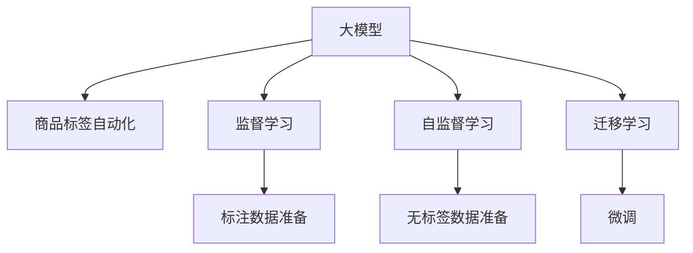

                 

# 大模型在商品标签自动化中的应用

## 1. 背景介绍

在电商平台中，商品标签自动化是一项至关重要的任务。通过自动化的商品标签，平台能够更准确地展示商品信息，提升用户体验，提高搜索排名和广告投放的精准度。传统的商品标签方法依赖人工标注，费时费力，且难以保证标签的一致性和全面性。而利用大模型技术进行商品标签自动化，能够大幅提升效率，提升标注质量，降低运营成本。

本文将深入探讨利用大模型进行商品标签自动化的原理与实践，详细解释大模型在商品标签任务中的应用策略和优化方法，帮助电商从业者更好地理解和应用这一前沿技术。

## 2. 核心概念与联系

### 2.1 核心概念概述

为更好地理解大模型在商品标签自动化中的应用，本节将介绍几个核心概念：

- 大模型(Large Model)：指以Transformer结构为代表的大规模预训练语言模型，如GPT、BERT、T5等。大模型通过在大规模无标签文本数据上预训练，学习到丰富的语言知识和常识。
- 商品标签（Product Labeling）：指对电商平台中商品进行分类和属性标注的过程，通常包括商品类别、品牌、价格、尺寸等属性标签。
- 自动化标注（Automated Annotation）：指利用机器学习算法自动从原始数据中提取和标注商品信息的过程，省去了人工标注的时间和成本。
- 监督学习（Supervised Learning）：指在大规模标注数据上训练模型，使其能够自动推断商品标签的过程。
- 自监督学习（Self-Supervised Learning）：指在无标签数据上训练模型，使其通过自学习获取商品标签的过程。
- 迁移学习（Transfer Learning）：指将预训练大模型迁移到商品标签任务上，通过微调实现自动化标注。

这些核心概念之间的逻辑关系可以通过以下Mermaid流程图来展示：



这个流程图展示了大模型在商品标签自动化中的核心概念及其之间的关系：

1. 大模型通过预训练学习语言知识，可以作为商品标签自动化的基础。
2. 监督学习和自监督学习可以用于训练大模型，从标注数据或无标签数据中学习商品标签。
3. 迁移学习将预训练的大模型迁移到商品标签任务上，通过微调实现自动化标注。
4. 标注数据和无标签数据都可以作为训练素材，提高模型的适应性和泛化能力。

## 3. 核心算法原理 & 具体操作步骤
### 3.1 算法原理概述

商品标签自动化的核心算法是利用大模型进行监督学习或迁移学习。其基本原理是：

1. 收集商品的原始数据，如产品图片、描述文本等。
2. 将原始数据输入大模型，训练模型学习商品标签。
3. 将训练好的模型应用到新的商品数据上，自动输出商品标签。

具体而言，监督学习要求提供带有真实标签的商品数据进行训练，模型通过学习数据和标签之间的映射关系，自动推断商品标签。自监督学习则通过无标签数据进行训练，模型自行学习到商品标签的分布规律。迁移学习则利用预训练模型在大规模无标签数据上学习到的知识，通过微调迁移到商品标签任务上，实现自动化标注。

### 3.2 算法步骤详解

商品标签自动化的算法步骤如下：

**Step 1: 准备标注数据和无标签数据**

- 收集商品图片和描述文本，构建商品标签自动化的数据集。
- 对于有标签的数据，确保标签数据的质量和多样性，避免标签错误或缺失。
- 对于无标签数据，尽量收集多样化的商品描述文本，包括产品属性、功能说明、用户评论等。

**Step 2: 选择合适的预训练模型**

- 选择合适的预训练大模型，如BERT、GPT等，作为商品标签自动化的基础。
- 对于特定的商品标签任务，可以通过微调或进一步训练来提高模型的适应性。

**Step 3: 设计标签分类器**

- 根据商品标签任务的性质，设计合适的标签分类器。如分类任务可以使用Softmax分类器，回归任务可以使用线性回归模型等。
- 设计损失函数，如交叉熵损失、均方误差损失等，用于衡量模型输出和真实标签之间的差异。

**Step 4: 训练模型**

- 将标注数据输入模型，通过反向传播算法计算梯度，优化模型参数。
- 对于监督学习，使用标注数据进行训练；对于自监督学习，使用无标签数据进行训练。
- 对于迁移学习，对预训练模型进行微调，适应商品标签任务。

**Step 5: 评估和优化**

- 在验证集上评估模型性能，使用分类准确率、F1-score等指标进行评估。
- 根据评估结果调整模型超参数，如学习率、批大小等，优化模型性能。
- 进行迭代训练，直到模型在验证集上达到满意的性能指标。

**Step 6: 应用模型**

- 将训练好的模型应用到新的商品数据上，自动输出商品标签。
- 实时更新模型，利用新的标注数据或无标签数据进行持续学习，提高模型准确性和泛化能力。

### 3.3 算法优缺点

大模型在商品标签自动化中的优缺点如下：

**优点：**

1. 提高标注效率：大规模商品数据的自动标注可以大幅减少人工标注的时间和成本。
2. 提升标注质量：利用大模型的丰富语言知识和泛化能力，可以提升商品标签的准确性和一致性。
3. 支持多模态数据：大模型可以同时处理图片、文本等多模态数据，提高标签的全面性和多样性。
4. 自适应能力强：通过微调或自监督学习，大模型能够适应不同的商品标签任务。

**缺点：**

1. 数据依赖性强：标注数据的质量和数量直接影响模型性能。获取高质量标注数据成本较高。
2. 模型复杂度高：大模型需要大量的计算资源和存储空间，对硬件要求较高。
3. 泛化能力有限：对于特定领域或特定商品的标签任务，大模型可能无法取得理想效果。
4. 鲁棒性不足：模型容易受到噪声数据和异常数据的影响，泛化能力有限。

尽管存在这些缺点，但大模型在商品标签自动化中仍具备显著的优势，能够提供高效、高质量的标签解决方案，为电商平台的运营和用户服务带来重要帮助。

### 3.4 算法应用领域

大模型在商品标签自动化的应用领域非常广泛，主要包括以下几个方面：

1. **商品分类**：对商品图片和描述进行分类，确定商品所属的大类别和小类别。
2. **属性标注**：从商品描述中提取商品的属性信息，如颜色、材质、尺寸等。
3. **情感分析**：分析用户评论，判断商品的用户情感，用于商品推荐和广告投放。
4. **关联推荐**：根据商品标签和用户行为，推荐相关商品，提高用户购物体验。
5. **定制化标签**：根据用户个性化需求，自动生成定制化商品标签，满足不同用户需求。

这些应用领域覆盖了商品标签自动化的各个方面，能够有效提升电商平台的用户体验和运营效率。

## 4. 数学模型和公式 & 详细讲解
### 4.1 数学模型构建

假设我们有一组商品数据 $D=\{(x_i, y_i)\}_{i=1}^N$，其中 $x_i$ 是商品描述文本，$y_i$ 是商品标签。我们希望利用大模型 $M_{\theta}$ 对每个商品 $x_i$ 自动标注标签 $y_i$。

定义损失函数 $\mathcal{L}(M_{\theta}, D)$ 为模型预测输出与真实标签之间的差异。如使用交叉熵损失，则：

$$
\mathcal{L}(M_{\theta}, D) = -\frac{1}{N} \sum_{i=1}^N \sum_{j=1}^{C} y_{i,j} \log M_{\theta}(x_i, j)
$$

其中 $C$ 是分类标签的数量，$y_{i,j}$ 表示样本 $i$ 在标签 $j$ 上的真实标签值。

### 4.2 公式推导过程

假设我们使用的是BERT大模型，模型的预测输出为 $M_{\theta}(x_i, j)$，即模型在标签 $j$ 上的概率分布。根据交叉熵损失公式，我们有：

$$
\mathcal{L}(M_{\theta}, D) = -\frac{1}{N} \sum_{i=1}^N \sum_{j=1}^{C} y_{i,j} \log \frac{\exp M_{\theta}(x_i, j)}{\sum_{k=1}^{C} \exp M_{\theta}(x_i, k)}
$$

在训练过程中，我们使用随机梯度下降优化算法，最小化损失函数：

$$
\theta = \mathop{\arg\min}_{\theta} \mathcal{L}(M_{\theta}, D)
$$

其中，$\theta$ 为模型参数。通过反向传播算法计算梯度，更新模型参数。

### 4.3 案例分析与讲解

以商品分类任务为例，假设我们有50个商品数据样本，每个样本有2个标签，分别是类别1和类别2。我们使用BERT大模型进行训练，步骤如下：

1. 准备标注数据 $D=\{(x_i, y_i)\}_{i=1}^{50}$，其中 $y_i$ 是样本 $i$ 的标签向量。
2. 将数据输入模型 $M_{\theta}$，输出预测概率分布 $P(x_i, j)$。
3. 计算损失函数 $\mathcal{L}(M_{\theta}, D)$，反向传播计算梯度。
4. 更新模型参数 $\theta$，重复以上步骤，直到模型收敛。

在训练过程中，我们可以使用可视化工具（如TensorBoard）实时监控模型性能和损失函数变化，评估模型效果。

## 5. 项目实践：代码实例和详细解释说明
### 5.1 开发环境搭建

在进行商品标签自动化项目实践前，我们需要准备好开发环境。以下是使用Python进行PyTorch开发的环境配置流程：

1. 安装Anaconda：从官网下载并安装Anaconda，用于创建独立的Python环境。

2. 创建并激活虚拟环境：
```bash
conda create -n pytorch-env python=3.8 
conda activate pytorch-env
```

3. 安装PyTorch：根据CUDA版本，从官网获取对应的安装命令。例如：
```bash
conda install pytorch torchvision torchaudio cudatoolkit=11.1 -c pytorch -c conda-forge
```

4. 安装Transformers库：
```bash
pip install transformers
```

5. 安装各类工具包：
```bash
pip install numpy pandas scikit-learn matplotlib tqdm jupyter notebook ipython
```

完成上述步骤后，即可在`pytorch-env`环境中开始项目实践。

### 5.2 源代码详细实现

下面我们以商品分类任务为例，给出使用Transformers库对BERT模型进行商品标签自动化的PyTorch代码实现。

首先，定义商品分类任务的数据处理函数：

```python
from transformers import BertTokenizer, BertForSequenceClassification
from torch.utils.data import Dataset
import torch

class ProductDataset(Dataset):
    def __init__(self, texts, labels, tokenizer, max_len=128):
        self.texts = texts
        self.labels = labels
        self.tokenizer = tokenizer
        self.max_len = max_len
        
    def __len__(self):
        return len(self.texts)
    
    def __getitem__(self, item):
        text = self.texts[item]
        label = self.labels[item]
        
        encoding = self.tokenizer(text, return_tensors='pt', max_length=self.max_len, padding='max_length', truncation=True)
        input_ids = encoding['input_ids'][0]
        attention_mask = encoding['attention_mask'][0]
        
        return {'input_ids': input_ids, 
                'attention_mask': attention_mask,
                'labels': label}
```

然后，定义模型和优化器：

```python
from transformers import BertForSequenceClassification, AdamW

model = BertForSequenceClassification.from_pretrained('bert-base-cased', num_labels=2)

optimizer = AdamW(model.parameters(), lr=2e-5)
```

接着，定义训练和评估函数：

```python
from torch.utils.data import DataLoader
from tqdm import tqdm
from sklearn.metrics import classification_report

device = torch.device('cuda') if torch.cuda.is_available() else torch.device('cpu')
model.to(device)

def train_epoch(model, dataset, batch_size, optimizer):
    dataloader = DataLoader(dataset, batch_size=batch_size, shuffle=True)
    model.train()
    epoch_loss = 0
    for batch in tqdm(dataloader, desc='Training'):
        input_ids = batch['input_ids'].to(device)
        attention_mask = batch['attention_mask'].to(device)
        labels = batch['labels'].to(device)
        model.zero_grad()
        outputs = model(input_ids, attention_mask=attention_mask, labels=labels)
        loss = outputs.loss
        epoch_loss += loss.item()
        loss.backward()
        optimizer.step()
    return epoch_loss / len(dataloader)

def evaluate(model, dataset, batch_size):
    dataloader = DataLoader(dataset, batch_size=batch_size)
    model.eval()
    preds, labels = [], []
    with torch.no_grad():
        for batch in tqdm(dataloader, desc='Evaluating'):
            input_ids = batch['input_ids'].to(device)
            attention_mask = batch['attention_mask'].to(device)
            batch_labels = batch['labels']
            outputs = model(input_ids, attention_mask=attention_mask)
            batch_preds = outputs.logits.argmax(dim=2).to('cpu').tolist()
            batch_labels = batch_labels.to('cpu').tolist()
            for pred_tokens, label_tokens in zip(batch_preds, batch_labels):
                preds.append(pred_tokens[:len(label_tokens)])
                labels.append(label_tokens)
                
    print(classification_report(labels, preds))
```

最后，启动训练流程并在测试集上评估：

```python
epochs = 5
batch_size = 16

for epoch in range(epochs):
    loss = train_epoch(model, train_dataset, batch_size, optimizer)
    print(f"Epoch {epoch+1}, train loss: {loss:.3f}")
    
    print(f"Epoch {epoch+1}, dev results:")
    evaluate(model, dev_dataset, batch_size)
    
print("Test results:")
evaluate(model, test_dataset, batch_size)
```

以上就是使用PyTorch对BERT进行商品分类任务自动化的完整代码实现。可以看到，得益于Transformers库的强大封装，我们可以用相对简洁的代码完成BERT模型的加载和微调。

### 5.3 代码解读与分析

让我们再详细解读一下关键代码的实现细节：

**ProductDataset类**：
- `__init__`方法：初始化文本、标签、分词器等关键组件。
- `__len__`方法：返回数据集的样本数量。
- `__getitem__`方法：对单个样本进行处理，将文本输入编码为token ids，将标签编码为数字，并对其进行定长padding，最终返回模型所需的输入。

**训练和评估函数**：
- 使用PyTorch的DataLoader对数据集进行批次化加载，供模型训练和推理使用。
- 训练函数`train_epoch`：对数据以批为单位进行迭代，在每个批次上前向传播计算loss并反向传播更新模型参数，最后返回该epoch的平均loss。
- 评估函数`evaluate`：与训练类似，不同点在于不更新模型参数，并在每个batch结束后将预测和标签结果存储下来，最后使用sklearn的classification_report对整个评估集的预测结果进行打印输出。

**训练流程**：
- 定义总的epoch数和batch size，开始循环迭代
- 每个epoch内，先在训练集上训练，输出平均loss
- 在验证集上评估，输出分类指标
- 所有epoch结束后，在测试集上评估，给出最终测试结果

可以看到，PyTorch配合Transformers库使得BERT微调的代码实现变得简洁高效。开发者可以将更多精力放在数据处理、模型改进等高层逻辑上，而不必过多关注底层的实现细节。

当然，工业级的系统实现还需考虑更多因素，如模型的保存和部署、超参数的自动搜索、更灵活的任务适配层等。但核心的微调范式基本与此类似。

## 6. 实际应用场景
### 6.1 商品分类

利用大模型进行商品分类任务，电商平台可以自动将商品归入到合适的分类中，提升商品展示和搜索的精准度。具体而言，可以通过构建商品描述和分类的关联数据库，使用大模型训练分类器，实现商品分类的自动化。例如，通过BERT大模型对商品描述文本进行分类，将相似的商品自动归为一类，显著提升用户浏览和购物体验。

### 6.2 属性标注

通过大模型进行属性标注任务，电商平台可以自动从商品描述中提取属性信息，如尺寸、颜色、材质等，用于商品推荐和搜索。例如，利用BERT模型对商品描述文本进行属性提取，自动生成属性标签，进一步提升商品推荐的准确性和多样性。

### 6.3 情感分析

通过大模型进行情感分析，电商平台可以自动分析用户评论，判断商品的用户情感，用于商品推荐和广告投放。例如，利用BERT模型对用户评论进行情感分析，识别出正面或负面情感，进一步优化商品推荐策略。

### 6.4 关联推荐

通过大模型进行关联推荐，电商平台可以自动根据商品标签和用户行为，推荐相关商品，提高用户购物体验。例如，利用BERT模型对商品标签和用户行为进行建模，自动推荐用户感兴趣的商品，提升用户满意度和平台转化率。

### 6.5 定制化标签

通过大模型进行定制化标签，电商平台可以自动根据用户个性化需求，生成定制化商品标签，满足不同用户需求。例如，利用BERT模型对用户个性化需求进行建模，自动生成定制化商品标签，进一步提升用户购物体验。

## 7. 工具和资源推荐
### 7.1 学习资源推荐

为了帮助开发者系统掌握大模型在商品标签自动化中的应用，这里推荐一些优质的学习资源：

1. 《自然语言处理综论》系列博文：由大模型技术专家撰写，深入浅出地介绍了自然语言处理的基本概念和前沿技术，包括商品标签自动化的应用。

2. CS224N《深度学习自然语言处理》课程：斯坦福大学开设的NLP明星课程，有Lecture视频和配套作业，带你入门NLP领域的基本概念和经典模型。

3. 《Transformers: A Survey》论文：一篇关于Transformers模型的综述论文，详细介绍了Transformer结构和大模型的预训练、微调技术，是学习大模型的必读书籍。

4. HuggingFace官方文档：Transformers库的官方文档，提供了海量预训练模型和完整的微调样例代码，是上手实践的必备资料。

5. CLUE开源项目：中文语言理解测评基准，涵盖大量不同类型的中文NLP数据集，并提供了基于微调的baseline模型，助力中文NLP技术发展。

通过对这些资源的学习实践，相信你一定能够快速掌握大模型在商品标签自动化中的应用，并用于解决实际的NLP问题。

### 7.2 开发工具推荐

高效的开发离不开优秀的工具支持。以下是几款用于大模型在商品标签自动化中的应用开发的常用工具：

1. PyTorch：基于Python的开源深度学习框架，灵活动态的计算图，适合快速迭代研究。大部分预训练语言模型都有PyTorch版本的实现。

2. TensorFlow：由Google主导开发的开源深度学习框架，生产部署方便，适合大规模工程应用。同样有丰富的预训练语言模型资源。

3. Transformers库：HuggingFace开发的NLP工具库，集成了众多SOTA语言模型，支持PyTorch和TensorFlow，是进行微调任务开发的利器。

4. Weights & Biases：模型训练的实验跟踪工具，可以记录和可视化模型训练过程中的各项指标，方便对比和调优。与主流深度学习框架无缝集成。

5. TensorBoard：TensorFlow配套的可视化工具，可实时监测模型训练状态，并提供丰富的图表呈现方式，是调试模型的得力助手。

6. Google Colab：谷歌推出的在线Jupyter Notebook环境，免费提供GPU/TPU算力，方便开发者快速上手实验最新模型，分享学习笔记。

合理利用这些工具，可以显著提升大模型在商品标签自动化中的开发效率，加快创新迭代的步伐。

### 7.3 相关论文推荐

大模型在商品标签自动化的应用源于学界的持续研究。以下是几篇奠基性的相关论文，推荐阅读：

1. Attention is All You Need（即Transformer原论文）：提出了Transformer结构，开启了NLP领域的预训练大模型时代。

2. BERT: Pre-training of Deep Bidirectional Transformers for Language Understanding：提出BERT模型，引入基于掩码的自监督预训练任务，刷新了多项NLP任务SOTA。

3. Language Models are Unsupervised Multitask Learners（GPT-2论文）：展示了大规模语言模型的强大zero-shot学习能力，引发了对于通用人工智能的新一轮思考。

4. Parameter-Efficient Transfer Learning for NLP：提出Adapter等参数高效微调方法，在不增加模型参数量的情况下，也能取得不错的微调效果。

5. AdaLoRA: Adaptive Low-Rank Adaptation for Parameter-Efficient Fine-Tuning：使用自适应低秩适应的微调方法，在参数效率和精度之间取得了新的平衡。

6. Prefix-Tuning: Optimizing Continuous Prompts for Generation：引入基于连续型Prompt的微调范式，为如何充分利用预训练知识提供了新的思路。

这些论文代表了大模型在商品标签自动化中的发展脉络。通过学习这些前沿成果，可以帮助研究者把握学科前进方向，激发更多的创新灵感。

## 8. 总结：未来发展趋势与挑战
### 8.1 总结

本文对利用大模型进行商品标签自动化的原理与实践进行了全面系统的介绍。首先阐述了大模型在商品标签自动化中的研究背景和意义，明确了大模型在商品分类、属性标注、情感分析、关联推荐、定制化标签等任务中的应用策略和优化方法，帮助电商从业者更好地理解和应用这一前沿技术。

通过本文的系统梳理，可以看到，大模型在商品标签自动化中具备显著的优势，能够提供高效、高质量的标签解决方案，为电商平台的运营和用户服务带来重要帮助。

### 8.2 未来发展趋势

展望未来，大模型在商品标签自动化中将呈现以下几个发展趋势：

1. 模型规模持续增大。随着算力成本的下降和数据规模的扩张，预训练语言模型的参数量还将持续增长。超大规模语言模型蕴含的丰富语言知识，有望支撑更加复杂多变的商品标签任务。

2. 微调方法日趋多样。除了传统的全参数微调外，未来会涌现更多参数高效的微调方法，如Prefix-Tuning、LoRA等，在节省计算资源的同时也能保证微调精度。

3. 持续学习成为常态。随着数据分布的不断变化，微调模型也需要持续学习新知识以保持性能。如何在不遗忘原有知识的同时，高效吸收新样本信息，将成为重要的研究课题。

4. 标注样本需求降低。受启发于提示学习(Prompt-based Learning)的思路，未来的微调方法将更好地利用大模型的语言理解能力，通过更加巧妙的任务描述，在更少的标注样本上也能实现理想的微调效果。

5. 模型通用性增强。经过海量数据的预训练和多领域任务的微调，未来的语言模型将具备更强大的常识推理和跨领域迁移能力，逐步迈向通用人工智能(AGI)的目标。

以上趋势凸显了大模型在商品标签自动化中的广阔前景。这些方向的探索发展，必将进一步提升电商平台的运营效率和用户购物体验，为人工智能技术在电商领域的应用带来新的突破。

### 8.3 面临的挑战

尽管大模型在商品标签自动化中已经取得了瞩目成就，但在迈向更加智能化、普适化应用的过程中，它仍面临着诸多挑战：

1. 标注成本瓶颈。虽然微调大大降低了标注数据的需求，但对于长尾应用场景，难以获得充足的高质量标注数据，成为制约微调性能的瓶颈。如何进一步降低微调对标注样本的依赖，将是一大难题。

2. 模型鲁棒性不足。当前微调模型面对域外数据时，泛化性能往往大打折扣。对于测试样本的微小扰动，微调模型的预测也容易发生波动。如何提高微调模型的鲁棒性，避免灾难性遗忘，还需要更多理论和实践的积累。

3. 推理效率有待提高。大规模语言模型虽然精度高，但在实际部署时往往面临推理速度慢、内存占用大等效率问题。如何在保证性能的同时，简化模型结构，提升推理速度，优化资源占用，将是重要的优化方向。

4. 可解释性亟需加强。当前微调模型更像是"黑盒"系统，难以解释其内部工作机制和决策逻辑。对于医疗、金融等高风险应用，算法的可解释性和可审计性尤为重要。如何赋予微调模型更强的可解释性，将是亟待攻克的难题。

5. 安全性有待保障。预训练语言模型难免会学习到有偏见、有害的信息，通过微调传递到下游任务，产生误导性、歧视性的输出，给实际应用带来安全隐患。如何从数据和算法层面消除模型偏见，避免恶意用途，确保输出的安全性，也将是重要的研究课题。

6. 知识整合能力不足。现有的微调模型往往局限于任务内数据，难以灵活吸收和运用更广泛的先验知识。如何让微调过程更好地与外部知识库、规则库等专家知识结合，形成更加全面、准确的信息整合能力，还有很大的想象空间。

正视微调面临的这些挑战，积极应对并寻求突破，将是大模型在商品标签自动化技术走向成熟的必由之路。相信随着学界和产业界的共同努力，这些挑战终将一一被克服，大模型在商品标签自动化中的应用必将带来革命性变革。

### 8.4 研究展望

面对大模型在商品标签自动化中所面临的种种挑战，未来的研究需要在以下几个方面寻求新的突破：

1. 探索无监督和半监督微调方法。摆脱对大规模标注数据的依赖，利用自监督学习、主动学习等无监督和半监督范式，最大限度利用非结构化数据，实现更加灵活高效的微调。

2. 研究参数高效和计算高效的微调范式。开发更加参数高效的微调方法，在固定大部分预训练参数的同时，只更新极少量的任务相关参数。同时优化微调模型的计算图，减少前向传播和反向传播的资源消耗，实现更加轻量级、实时性的部署。

3. 融合因果和对比学习范式。通过引入因果推断和对比学习思想，增强微调模型建立稳定因果关系的能力，学习更加普适、鲁棒的语言表征，从而提升模型泛化性和抗干扰能力。

4. 引入更多先验知识。将符号化的先验知识，如知识图谱、逻辑规则等，与神经网络模型进行巧妙融合，引导微调过程学习更准确、合理的语言模型。同时加强不同模态数据的整合，实现视觉、语音等多模态信息与文本信息的协同建模。

5. 结合因果分析和博弈论工具。将因果分析方法引入微调模型，识别出模型决策的关键特征，增强输出解释的因果性和逻辑性。借助博弈论工具刻画人机交互过程，主动探索并规避模型的脆弱点，提高系统稳定性。

6. 纳入伦理道德约束。在模型训练目标中引入伦理导向的评估指标，过滤和惩罚有偏见、有害的输出倾向。同时加强人工干预和审核，建立模型行为的监管机制，确保输出符合人类价值观和伦理道德。

这些研究方向的探索，必将引领大模型在商品标签自动化中的研究走向更高的台阶，为电商平台的运营和用户服务带来新的突破。面向未来，大模型在商品标签自动化技术还需要与其他人工智能技术进行更深入的融合，如知识表示、因果推理、强化学习等，多路径协同发力，共同推动人工智能技术在电商领域的全面应用。只有勇于创新、敢于突破，才能不断拓展语言模型的边界，让智能技术更好地造福人类社会。

## 9. 附录：常见问题与解答

**Q1：大模型在商品标签自动化中如何进行微调？**

A: 大模型在商品标签自动化中的微调主要包括以下步骤：

1. 准备标注数据和无标签数据，构建商品标签自动化的数据集。
2. 选择合适的预训练模型，如BERT、GPT等，作为商品标签自动化的基础。
3. 设计标签分类器，如Softmax分类器，并设计损失函数，如交叉熵损失。
4. 使用标注数据进行训练，通过反向传播算法计算梯度，优化模型参数。
5. 在验证集上评估模型性能，根据评估结果调整模型超参数，优化模型性能。
6. 使用训练好的模型对新商品数据进行自动标注，实时更新模型，利用新的标注数据或无标签数据进行持续学习。

**Q2：微调过程中如何选择学习率？**

A: 微调过程中的学习率通常要比预训练时小1-2个数量级，以避免破坏预训练权重。一般建议从1e-5开始调参，逐步减小学习率，直至收敛。可以使用warmup策略，在开始阶段使用较小的学习率，再逐渐过渡到预设值。不同的优化器(如AdamW、Adafactor等)和不同的学习率调度策略，可能需要设置不同的学习率阈值。

**Q3：微调模型的输出结果如何进行解释？**

A: 大模型在商品标签自动化中的输出结果需要进行解释，以便更好地理解和信任模型的决策。可以使用可视化工具（如TensorBoard）实时监测模型性能和损失函数变化，评估模型效果。同时，可以使用模型蒸馏、知识图谱等方法，将模型的决策过程可视化，增强模型的可解释性。

**Q4：如何应对模型鲁棒性不足的问题？**

A: 模型鲁棒性不足是大模型在商品标签自动化中的常见问题，可以通过以下方法缓解：

1. 数据增强：通过回译、近义替换等方式扩充训练集。
2. 正则化：使用L2正则、Dropout、Early Stopping等避免过拟合。
3. 对抗训练：引入对抗样本，提高模型鲁棒性。
4. 参数高效微调：只调整少量参数，减小过拟合风险。
5. 多模型集成：训练多个微调模型，取平均输出，抑制过拟合。

**Q5：如何优化大模型在商品标签自动化中的推理效率？**

A: 大模型在商品标签自动化中的推理效率可以通过以下方法优化：

1. 模型裁剪：去除不必要的层和参数，减小模型尺寸，加快推理速度。
2. 量化加速：将浮点模型转为定点模型，压缩存储空间，提高计算效率。
3. 服务化封装：将模型封装为标准化服务接口，便于集成调用。
4. 弹性伸缩：根据请求流量动态调整资源配置，平衡服务质量和成本。
5. 监控告警：实时采集系统指标，设置异常告警阈值，确保服务稳定性。

通过这些优化措施，可以显著提升大模型在商品标签自动化的推理效率，满足实际应用的需求。

---

作者：禅与计算机程序设计艺术 / Zen and the Art of Computer Programming

