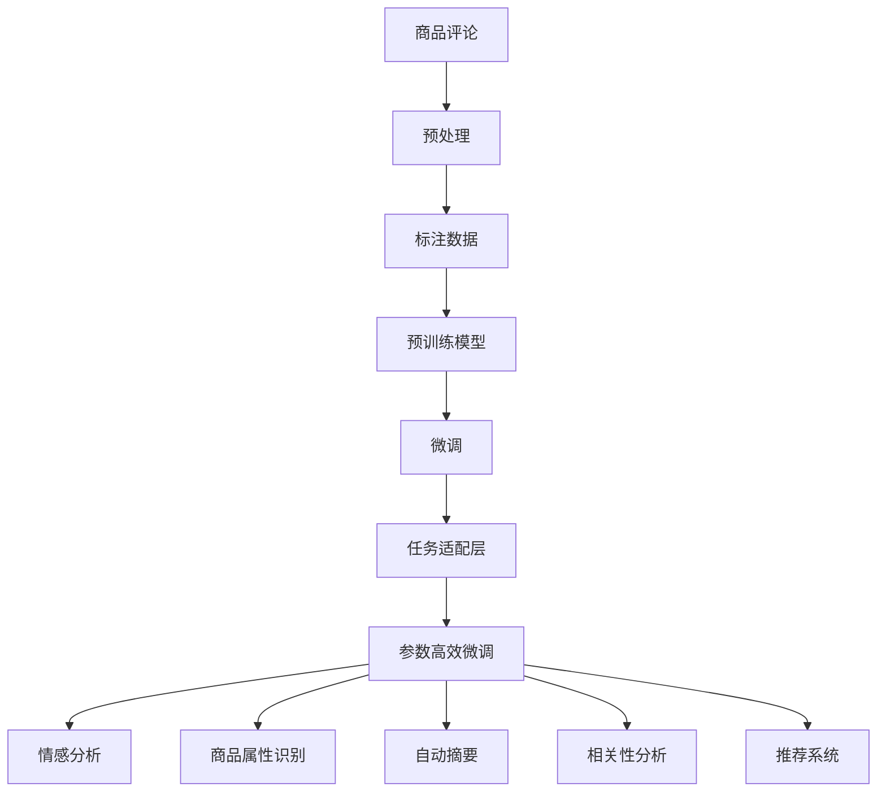

                 

# 大模型在商品评论挖掘与分析中的应用

## 1. 背景介绍

### 1.1 问题由来

在电商领域，商品评论数据是了解用户需求、监测产品表现的重要资源。通过分析商品评论，可以识别出用户关注的热点，发现产品的不足之处，优化商品质量，提升用户体验。然而，随着在线交易规模的不断扩大，商品评论数量呈指数级增长，且数据多样性复杂，给传统的人工处理方式带来了巨大的挑战。

大模型技术，尤其是基于深度学习的预训练模型，近年来在电商领域的应用逐渐增多。大模型能够通过大量无标签数据的预训练，学习到广泛的知识和语义表征，进而能够高效地处理和分析商品评论数据，为电商企业提供强有力的技术支撑。

### 1.2 问题核心关键点

大模型在商品评论挖掘与分析中的应用主要围绕以下几个关键点展开：

1. **预训练模型选择**：选择合适的预训练语言模型，如BERT、GPT等，作为商品评论分析的基础。
2. **数据预处理与清洗**：对原始商品评论数据进行清洗、去重和标注，构建合适的训练数据集。
3. **微调与任务适配**：在大模型上微调，针对特定任务进行适配，如情感分析、商品属性识别等。
4. **性能评估与优化**：使用适当的评估指标，如精确度、召回率、F1值等，对微调后的模型进行性能评估和优化。

## 2. 核心概念与联系

### 2.1 核心概念概述

以下是与商品评论挖掘与分析应用相关的重要概念：

- **大模型（Large Models）**：基于深度学习的预训练模型，如BERT、GPT等，通过大量无标签数据预训练，学习到丰富的语言表示。
- **预训练（Pre-training）**：使用大规模无标签数据训练预训练模型，学习通用的语言表示。
- **微调（Fine-tuning）**：在大模型基础上，通过少量标注数据对模型进行微调，使其适应特定任务。
- **任务适配层（Task-Adaptation Layer）**：在预训练模型的顶层添加任务特定的输出层和损失函数，进行任务适配。
- **参数高效微调（Parameter-Efficient Fine-tuning, PEFT）**：只更新部分模型参数，以减少微调过程中的计算资源消耗。
- **情感分析（Sentiment Analysis）**：识别文本中的情感倾向，如正面、负面或中性。
- **商品属性识别（Product Attribute Recognition）**：从评论中提取产品属性，如尺寸、颜色、材质等。
- **自动摘要（Automatic Summarization）**：自动生成商品评论的简要概述。
- **相关性分析（Relevance Analysis）**：评估评论与产品的相关性，剔除无关信息。
- **推荐系统（Recommendation System）**：根据商品评论生成个性化推荐。

这些概念通过以下Mermaid流程图表示它们之间的联系：



## 3. 核心算法原理 & 具体操作步骤

### 3.1 算法原理概述

商品评论挖掘与分析的核心算法原理基于大模型的预训练与微调。通过在大规模无标签商品评论数据上预训练，大模型能够学习到通用的语言表示。接着，通过微调，模型能够针对特定任务（如情感分析、属性识别等）进行适配，从而实现高效的商品评论分析和处理。

微调过程主要包括以下步骤：

1. **数据准备**：收集和清洗商品评论数据，标注并构建训练数据集。
2. **模型加载与初始化**：加载预训练的大模型，并初始化任务适配层和损失函数。
3. **微调训练**：在标注数据集上，对模型进行微调训练，更新模型参数。
4. **评估与优化**：使用合适的评估指标对微调后的模型进行性能评估，并进行参数优化。
5. **部署与应用**：将微调后的模型部署到实际应用中，处理新的商品评论数据。

### 3.2 算法步骤详解

#### 3.2.1 数据准备

商品评论数据的准备和清洗是商品评论分析的基础。具体步骤如下：

1. **数据收集**：从电商平台收集商品评论数据，确保数据来源广泛、真实可靠。
2. **数据清洗**：去除无关信息，如停用词、特殊符号等，保留有意义的评论内容。
3. **数据标注**：对评论进行情感、属性、相关性等标注，构建训练数据集。
4. **数据分割**：将数据集划分为训练集、验证集和测试集。

#### 3.2.2 模型加载与初始化

选择合适的预训练模型作为基础，初始化任务适配层和损失函数。具体步骤如下：

1. **模型选择**：根据任务需求选择合适的大模型，如BERT、GPT等。
2. **模型加载**：使用适当的库（如Hugging Face Transformers）加载预训练模型。
3. **任务适配**：在模型顶层添加任务适配层，如线性分类器、解码器等，并设置相应的损失函数。

#### 3.2.3 微调训练

微调训练是商品评论分析的核心步骤。具体步骤如下：

1. **设置参数**：选择合适的优化器、学习率、批大小等训练参数。
2. **前向传播**：将评论数据输入模型，进行前向传播计算。
3. **反向传播**：计算损失函数，反向传播更新模型参数。
4. **参数更新**：根据优化算法更新模型参数。
5. **迭代训练**：重复上述过程，直至模型收敛。

#### 3.2.4 评估与优化

微调后的模型需要经过评估与优化，确保其性能达到预期。具体步骤如下：

1. **性能评估**：使用合适的评估指标（如精确度、召回率、F1值等）对模型进行评估。
2. **参数调整**：根据评估结果，调整模型参数，如学习率、正则化强度等。
3. **迭代优化**：重复评估与调整过程，直至模型性能最优。

### 3.3 算法优缺点

#### 3.3.1 优点

1. **高效性**：大模型通过预训练已经学习到了丰富的语言知识，微调过程相对简单，能够快速实现商品评论分析。
2. **泛化性强**：大模型具有较强的泛化能力，能够在不同的商品评论数据集上取得优异的效果。
3. **可解释性高**：大模型的参数结构和训练过程是透明的，可以通过解释模型参数来理解其行为。
4. **适用性广**：大模型可以应用于各种商品评论分析任务，如情感分析、属性识别、推荐等。

#### 3.3.2 缺点

1. **数据依赖性强**：微调效果很大程度上依赖于标注数据的质量和数量，高质量标注数据的获取成本较高。
2. **过拟合风险**：在标注数据较少的情况下，微调模型容易出现过拟合，泛化能力下降。
3. **计算资源消耗大**：大模型参数量大，微调过程需要消耗大量计算资源。
4. **理解困难**：大模型通常被视为"黑盒"，其内部工作机制难以解释。

## 4. 数学模型和公式 & 详细讲解 & 举例说明

### 4.1 数学模型构建

商品评论分析的数学模型主要基于大模型的预训练与微调过程。假设预训练模型为 $M_{\theta}$，其中 $\theta$ 为预训练得到的模型参数。商品评论数据集为 $D=\{(x_i, y_i)\}_{i=1}^N$，其中 $x_i$ 为评论文本，$y_i$ 为对应的情感标签（0表示负面，1表示正面）。微调的目标是找到最优参数 $\hat{\theta}$，使得模型在商品评论数据集上的损失函数最小化：

$$
\hat{\theta} = \mathop{\arg\min}_{\theta} \mathcal{L}(M_{\theta},D)
$$

其中 $\mathcal{L}$ 为针对情感分析任务的交叉熵损失函数：

$$
\mathcal{L}(M_{\theta},D) = -\frac{1}{N} \sum_{i=1}^N y_i \log M_{\theta}(x_i) + (1-y_i) \log (1-M_{\theta}(x_i))
$$

### 4.2 公式推导过程

情感分析任务的公式推导如下：

1. **输入处理**：将评论文本 $x_i$ 输入预训练模型 $M_{\theta}$，得到输出 $M_{\theta}(x_i)$。
2. **计算损失**：根据输出 $M_{\theta}(x_i)$ 和真实标签 $y_i$，计算交叉熵损失 $\ell_i$：

$$
\ell_i = -y_i \log M_{\theta}(x_i) + (1-y_i) \log (1-M_{\theta}(x_i))
$$

3. **总损失**：计算总损失 $\mathcal{L}$：

$$
\mathcal{L} = \frac{1}{N} \sum_{i=1}^N \ell_i
$$

4. **梯度更新**：使用梯度下降等优化算法更新模型参数 $\theta$：

$$
\theta \leftarrow \theta - \eta \nabla_{\theta}\mathcal{L}
$$

其中 $\eta$ 为学习率。

### 4.3 案例分析与讲解

以情感分析为例，假设有一个商品评论数据集 $D=\{(x_1, y_1), (x_2, y_2), \ldots, (x_N, y_N)\}$，其中 $y_i$ 为情感标签（0表示负面，1表示正面）。使用BERT模型进行微调，步骤如下：

1. **数据准备**：将评论文本 $x_i$ 转换为BERT模型可接受的格式，并进行分词。
2. **模型加载**：加载BERT模型，并初始化任务适配层，如线性分类器。
3. **前向传播**：将评论文本输入BERT模型，得到输出 $M_{\theta}(x_i)$。
4. **计算损失**：根据输出 $M_{\theta}(x_i)$ 和真实标签 $y_i$，计算交叉熵损失 $\ell_i$。
5. **反向传播**：计算损失函数对模型参数 $\theta$ 的梯度，反向传播更新模型参数。
6. **参数更新**：根据优化算法（如Adam）更新模型参数 $\theta$。
7. **评估与优化**：使用合适的评估指标（如精确度、召回率、F1值等）对模型进行评估，并进行参数优化。

## 5. 项目实践：代码实例和详细解释说明

### 5.1 开发环境搭建

商品评论分析的开发环境搭建主要涉及以下几个步骤：

1. **安装Python**：从官网下载并安装Python，确保版本为3.8及以上。
2. **安装Anaconda**：下载并安装Anaconda，用于创建独立的Python环境。
3. **创建虚拟环境**：
```bash
conda create -n product_review python=3.8 
conda activate product_review
```
4. **安装相关库**：
```bash
pip install torch transformers sklearn pandas
```

### 5.2 源代码详细实现

以下是一个基于BERT模型的情感分析代码实现示例：

```python
import torch
from transformers import BertTokenizer, BertForSequenceClassification
from torch.utils.data import Dataset, DataLoader
from sklearn.model_selection import train_test_split
from sklearn.metrics import accuracy_score, precision_score, recall_score, f1_score

# 定义数据集
class ProductReviewDataset(Dataset):
    def __init__(self, texts, labels):
        self.tokenizer = BertTokenizer.from_pretrained('bert-base-uncased')
        self.texts = texts
        self.labels = labels
        
    def __len__(self):
        return len(self.texts)
    
    def __getitem__(self, index):
        text = self.texts[index]
        label = self.labels[index]
        
        encoding = self.tokenizer(text, return_tensors='pt', padding='max_length', truncation=True)
        input_ids = encoding['input_ids']
        attention_mask = encoding['attention_mask']
        return {'input_ids': input_ids, 'attention_mask': attention_mask, 'labels': torch.tensor(label)}

# 加载数据集
tokenizer = BertTokenizer.from_pretrained('bert-base-uncased')
train_data, dev_data, test_data = train_test_split(train_data, dev_data, test_data, test_size=0.2, random_state=42)

# 初始化模型和优化器
model = BertForSequenceClassification.from_pretrained('bert-base-uncased', num_labels=2)
optimizer = torch.optim.Adam(model.parameters(), lr=2e-5)

# 训练过程
def train_epoch(model, data_loader, optimizer):
    model.train()
    for batch in data_loader:
        input_ids = batch['input_ids'].to(device)
        attention_mask = batch['attention_mask'].to(device)
        labels = batch['labels'].to(device)
        model.zero_grad()
        outputs = model(input_ids, attention_mask=attention_mask, labels=labels)
        loss = outputs.loss
        loss.backward()
        optimizer.step()
    return loss.item()

# 评估过程
def evaluate(model, data_loader):
    model.eval()
    preds, labels = [], []
    with torch.no_grad():
        for batch in data_loader:
            input_ids = batch['input_ids'].to(device)
            attention_mask = batch['attention_mask'].to(device)
            labels = batch['labels'].to(device)
            outputs = model(input_ids, attention_mask=attention_mask)
            preds.append(outputs.logits.argmax(dim=1).tolist())
            labels.append(labels.tolist())
    return accuracy_score(labels, preds), precision_score(labels, preds), recall_score(labels, preds), f1_score(labels, preds)

# 训练与评估
device = torch.device('cuda' if torch.cuda.is_available() else 'cpu')
model.to(device)
for epoch in range(5):
    train_loss = train_epoch(model, train_loader)
    train_accuracy, train_precision, train_recall, train_f1 = evaluate(model, train_loader)
    dev_accuracy, dev_precision, dev_recall, dev_f1 = evaluate(model, dev_loader)
    print(f'Epoch {epoch+1}, Train Loss: {train_loss:.4f}, Train Accuracy: {train_accuracy:.4f}, Train Precision: {train_precision:.4f}, Train Recall: {train_recall:.4f}, Train F1: {train_f1:.4f}')
    print(f'Epoch {epoch+1}, Dev Accuracy: {dev_accuracy:.4f}, Dev Precision: {dev_precision:.4f}, Dev Recall: {dev_recall:.4f}, Dev F1: {dev_f1:.4f}')
```

### 5.3 代码解读与分析

**ProductReviewDataset类**：
- `__init__`方法：初始化数据集，包括文本和标签。
- `__len__`方法：返回数据集长度。
- `__getitem__`方法：对单个样本进行处理，将文本进行分词并转换为模型可接受的格式。

**模型训练与评估函数**：
- `train_epoch`函数：在训练数据集上训练模型，计算损失并更新参数。
- `evaluate`函数：在验证集和测试集上评估模型性能，计算准确率、精确度、召回率和F1值。

**训练过程**：
- 循环5个epoch，每个epoch在训练集上训练一次，在验证集上评估一次。
- 在每个epoch内，使用梯度下降算法更新模型参数。
- 输出每个epoch的训练损失和验证集性能指标。

## 6. 实际应用场景

### 6.1 智能客服系统

基于大模型的商品评论分析可以应用于智能客服系统中，提升客服效率和用户满意度。智能客服系统通过分析商品评论数据，能够识别用户关注的商品问题，快速响应并解决问题，提升客户体验。

具体实现步骤如下：

1. **数据收集**：收集客户与客服的聊天记录，标注出客户提出的问题和客服的回答。
2. **情感分析**：对客户提出的问题和客服的回答进行情感分析，识别出客户情绪。
3. **意图识别**：识别客户问题的意图，如退货、投诉、咨询等。
4. **知识图谱构建**：构建商品知识图谱，将商品属性、功能等信息整合，辅助客服查询。
5. **智能推荐**：根据客户的问题和历史行为，推荐相关商品或服务。

### 6.2 商品推荐系统

商品评论分析还可以用于个性化推荐系统，提升推荐效果。推荐系统通过分析商品评论数据，能够识别出用户对商品的具体需求，生成更加个性化的推荐。

具体实现步骤如下：

1. **数据收集**：收集用户对商品的评价和评论。
2. **情感分析**：对评论进行情感分析，筛选出正面评价的商品。
3. **属性识别**：从评论中提取商品属性，如颜色、尺寸等。
4. **相关性分析**：评估评论与用户的历史行为和偏好之间的相关性。
5. **推荐生成**：根据评论和相关性分析结果，生成个性化推荐。

### 6.3 市场分析

大模型在商品评论分析中的应用还可以扩展到市场分析，帮助企业洞察市场动态，做出更明智的决策。市场分析通过分析大量商品评论数据，能够发现市场趋势、预测需求变化，为企业提供决策支持。

具体实现步骤如下：

1. **数据收集**：收集不同商品的市场评论数据。
2. **情感分析**：对评论进行情感分析，识别出市场情绪。
3. **主题建模**：对评论进行主题建模，发现市场热点和趋势。
4. **市场预测**：根据主题模型和情感分析结果，预测市场需求变化。
5. **决策支持**：结合市场预测结果，辅助企业制定决策。

### 6.4 未来应用展望

未来，随着大模型技术的不断发展，基于商品评论分析的应用将更加广泛和深入，将进一步拓展到更多场景中，为电商企业、智能客服、推荐系统等领域提供更为精准、智能的解决方案。

## 7. 工具和资源推荐

### 7.1 学习资源推荐

1. **《深度学习》课程**：由斯坦福大学开设，讲解深度学习的核心概念和算法，是学习大模型的基础课程。
2. **《自然语言处理》课程**：由Coursera提供，涵盖NLP的基本概念和前沿技术，推荐给有一定深度学习基础的学习者。
3. **Hugging Face官方文档**：提供丰富的预训练模型和微调样例，是学习和应用大模型的重要资源。
4. **Kaggle竞赛**：参与Kaggle数据竞赛，通过实际问题解决，积累经验和知识。
5. **《自然语言处理综述》论文**：综述了NLP领域的最新研究成果，是了解前沿技术的良好来源。

### 7.2 开发工具推荐

1. **PyTorch**：深度学习框架，支持动态图计算，灵活高效。
2. **TensorFlow**：深度学习框架，支持静态图计算，适用于大规模工程应用。
3. **Hugging Face Transformers**：提供丰富的预训练模型和微调功能，方便开发者使用。
4. **TensorBoard**：可视化工具，用于监控模型训练状态。
5. **Weights & Biases**：实验跟踪工具，记录和可视化模型训练过程中的各项指标。

### 7.3 相关论文推荐

1. **BERT: Pre-training of Deep Bidirectional Transformers for Language Understanding**：提出BERT模型，通过预训练获得良好的语言表示。
2. **GPT-3: Language Models are Unsupervised Multitask Learners**：提出GPT-3模型，展示了预训练语言模型在零样本学习中的强大能力。
3. **LoRA: Low-Rank Adaptation of Pretrained Models**：提出LoRA方法，实现轻量级参数高效的微调。
4. **AdaLoRA: Adaptive Low-Rank Adaptation for Parameter-Efficient Fine-Tuning**：提出AdaLoRA方法，进一步优化LoRA的微调效果。

## 8. 总结：未来发展趋势与挑战

### 8.1 总结

本文介绍了基于大模型的商品评论分析方法和应用场景。首先，阐述了商品评论分析在大模型微调中的重要性，明确了微调在拓展预训练模型应用、提升下游任务性能方面的独特价值。其次，从原理到实践，详细讲解了商品评论分析的数学模型和关键步骤，给出了微调任务开发的完整代码实例。同时，本文还探讨了商品评论分析在智能客服、推荐系统、市场分析等多个领域的应用前景，展示了微调范式的巨大潜力。

通过本文的系统梳理，可以看到，基于大模型的商品评论分析技术正在成为电商领域的重要工具，极大地拓展了预训练语言模型的应用边界，催生了更多的落地场景。得益于大规模语料的预训练，微调模型在标注数据较少的情况下也能取得不错的效果，有力推动了电商技术的产业化进程。未来，伴随预训练语言模型和微调方法的持续演进，相信电商技术必将迎来更多智能化、个性化的应用。

### 8.2 未来发展趋势

展望未来，大模型在商品评论分析领域的发展趋势如下：

1. **模型规模不断扩大**：随着算力成本的下降和数据规模的扩张，预训练模型参数量将持续增长，提供更丰富、更深入的语言表示。
2. **多模态融合**：商品评论分析将更多地融入图像、视频、语音等多模态数据，实现更全面的信息整合和分析。
3. **跨领域迁移**：微调模型将具备更强的跨领域迁移能力，能够应对不同领域的商品评论数据。
4. **实时推理**：基于大模型的商品评论分析将实现实时推理，提升推荐系统的响应速度和准确性。
5. **可解释性增强**：研究者将更多关注模型的可解释性，通过解释模型参数和推理过程，提高模型的透明度和可信度。

### 8.3 面临的挑战

尽管大模型在商品评论分析中取得了显著进展，但仍然面临以下挑战：

1. **数据获取困难**：高质量商品评论数据的获取成本较高，数据样本数量有限。
2. **模型鲁棒性不足**：微调模型面对域外数据时，泛化性能往往较差，容易出现灾难性遗忘。
3. **计算资源消耗大**：大规模商品评论数据集的处理需要消耗大量计算资源，难以高效处理。
4. **模型可解释性差**：大模型通常被视为"黑盒"，难以解释其内部工作机制和决策逻辑。
5. **安全风险**：商品评论数据可能包含敏感信息，存在隐私和安全性问题。

### 8.4 研究展望

为了应对以上挑战，未来研究需要关注以下几个方向：

1. **数据增强**：通过数据增强技术，如回译、近义替换等，扩充训练集，提升模型的泛化能力。
2. **对抗训练**：引入对抗样本，提高模型鲁棒性，减少对抗攻击的风险。
3. **模型压缩**：通过模型压缩技术，如剪枝、量化等，减小计算资源消耗，提升推理速度。
4. **可解释性研究**：研究可解释性模型，如LIME、SHAP等，提高模型的透明度和可信度。
5. **隐私保护**：采用隐私保护技术，如差分隐私、联邦学习等，保护用户隐私，增强模型安全性。

## 9. 附录：常见问题与解答

### 9.1 常见问题

**Q1：如何选择预训练模型？**

A: 选择预训练模型应考虑任务需求和数据特性。一般来说，BERT模型适合文本分类、情感分析等任务，而GPT模型适合生成式任务，如文本生成、对话生成等。

**Q2：如何处理不平衡数据集？**

A: 不平衡数据集可以通过过采样、欠采样、SMOTE等方法进行平衡处理。也可以使用加权损失函数，对少数类别赋予更高的权重。

**Q3：如何处理长文本？**

A: 长文本可以通过截断、分段等方法进行预处理，确保模型能够高效处理。也可以使用长文本处理方法，如BART、T5等，专门处理长文本。

**Q4：如何优化模型参数？**

A: 可以通过超参数调优、正则化、早停等方法优化模型参数。也可以使用如LoRA、AdaLoRA等参数高效微调方法，减少计算资源消耗。

**Q5：如何评估模型性能？**

A: 可以使用精确度、召回率、F1值等指标评估模型性能。还可以使用ROC曲线、PR曲线等可视化工具，进一步分析模型效果。

---

作者：禅与计算机程序设计艺术 / Zen and the Art of Computer Programming

