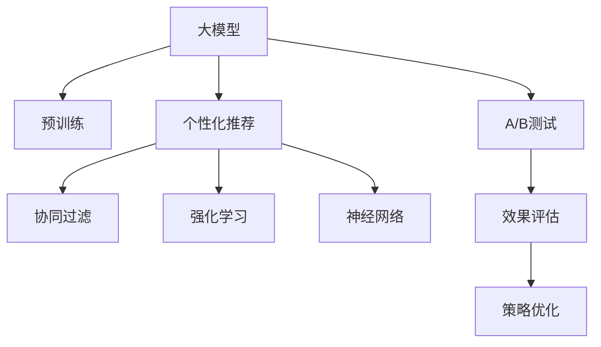

                 

# 大模型在推荐系统A/B测试中的应用

> 关键词：大模型,推荐系统,个性化推荐,A/B测试,机器学习,深度学习,协同过滤,强化学习,神经网络,算法优化

## 1. 背景介绍

### 1.1 问题由来
在信息爆炸的时代，互联网平台如电商平台、社交媒体、新闻网站等每天产生海量的用户数据。如何利用这些数据，精准推荐用户感兴趣的优质内容，是每个平台面临的重要挑战。传统的推荐算法如协同过滤、基于内容的推荐等，在早期取得了不错的效果。但随着数据量呈指数级增长，推荐系统的复杂性也不断增加，传统推荐算法的局限性也逐渐显现。

### 1.2 问题核心关键点
为了应对推荐系统的新需求，研究者开始探索利用大模型提升个性化推荐的效果。大模型通过预训练学习到丰富的知识表示，能更好地处理复杂的多模态数据，从而提高推荐的准确性和多样性。与此同时，A/B测试成为评估大模型推荐效果的重要手段，通过对不同推荐模型和策略的对比，确定最优推荐方案。

A/B测试是一种用于比较两个或多个版本效果的方法。在推荐系统中，通常将原始推荐算法和新算法的结果进行对比，以评估新算法的性能。通过大规模A/B测试，不仅可以评估推荐模型的效果，还能发现模型在不同场景下的鲁棒性和可扩展性，为推荐系统的优化提供科学依据。

## 2. 核心概念与联系

### 2.1 核心概念概述

为了更好地理解大模型在推荐系统A/B测试中的应用，本节将介绍几个核心概念：

- 大模型(Large Model)：指在超大规模数据上经过预训练的深度学习模型，如BERT、GPT等。大模型通过自监督学习任务，学习到丰富的语言、视觉等知识表示。
- 个性化推荐(Personalized Recommendation)：基于用户的历史行为、兴趣和特征，推荐其可能感兴趣的商品、内容等。个性化推荐在电商、社交、视频等平台中均有广泛应用。
- A/B测试(A/B Testing)：一种比较两个或多个版本效果的实验方法，在推荐系统中，通常用于评估新推荐算法的效果，确定最终推荐策略。
- 协同过滤(Collaborative Filtering)：利用用户的历史行为数据进行推荐，包括基于用户的协同过滤和基于物品的协同过滤两种方法。
- 强化学习(Reinforcement Learning)：通过模型与环境的互动，不断优化推荐策略，提高推荐效果。
- 神经网络(Neural Network)：一种模仿人脑神经元连接的网络结构，在推荐系统中的应用包括深度神经网络、卷积神经网络等。

这些核心概念之间的逻辑关系可以通过以下Mermaid流程图来展示：



这个流程图展示了大模型在推荐系统中的应用流程：

1. 大模型通过预训练学习到丰富的知识表示。
2. 基于大模型的个性化推荐算法，能够更准确地理解用户需求，推荐更符合用户兴趣的内容。
3. 协同过滤、强化学习和神经网络等传统推荐技术，可以与大模型结合，提升推荐效果。
4. A/B测试作为评估手段，比较不同推荐策略的效果，优化推荐系统。

## 3. 核心算法原理 & 具体操作步骤
### 3.1 算法原理概述

大模型在推荐系统中的应用，主要是通过构建个性化推荐模型，使用户获得符合其兴趣的推荐结果。其核心思想是通过大模型的知识表示，学习到用户和物品之间的复杂关系，从而精准预测用户对物品的兴趣程度，实现个性化推荐。

具体来说，假设推荐系统中共有 $U$ 个用户、$I$ 个物品，用户 $u$ 对物品 $i$ 的兴趣度表示为 $x_{ui}$。个性化推荐的目标是最大化 $u$ 的兴趣度。因此，推荐算法可以表示为：

$$
\max_{x_{ui}} \sum_{u \in U} \sum_{i \in I} \alpha_{ui} x_{ui} - \beta \sum_{u \in U} \sum_{i \in I} \delta(x_{ui} - y_{ui})^2
$$

其中，$\alpha_{ui}$ 为物品 $i$ 对于用户 $u$ 的兴趣度权重，$\beta$ 为损失函数参数，$y_{ui}$ 为实际用户兴趣度与推荐系统的预测兴趣度之差。通过最大化用户兴趣度，并最小化预测误差，实现个性化推荐。

### 3.2 算法步骤详解

基于大模型构建个性化推荐模型的大致步骤如下：

**Step 1: 准备数据集**
- 收集用户历史行为数据，如浏览记录、购买记录等。
- 将用户历史行为数据与物品特征数据进行拼接，得到训练集。

**Step 2: 构建推荐模型**
- 使用大模型预训练得到的知识表示，提取用户和物品的特征表示。
- 选择合适的推荐算法，如基于协同过滤、基于内容的推荐等，构建推荐模型。

**Step 3: 进行A/B测试**
- 将推荐模型应用于部分用户，生成推荐结果。
- 将推荐结果与原始推荐结果进行对比，评估新推荐策略的效果。
- 根据评估结果，调整推荐模型的参数，优化推荐效果。

**Step 4: 模型优化与部署**
- 在优化过程中，使用正则化、Dropout等技术，防止模型过拟合。
- 将优化后的模型部署到生产环境，进行大规模推荐。

### 3.3 算法优缺点

大模型在推荐系统中的应用，具有以下优点：

1. 提升推荐准确性。大模型通过预训练学习到丰富的知识表示，能更好地理解用户兴趣和物品属性，从而提高推荐的准确性。
2. 提高推荐多样性。大模型能够处理更复杂的输入数据，使得推荐结果更具有多样性。
3. 实时动态优化。大模型可以实时接收用户行为数据，并根据最新数据动态调整推荐策略，保持推荐效果。

同时，也存在一些局限性：

1. 数据需求量大。大模型的预训练需要大量的无标签数据，推荐模型构建也需要大量标注数据，数据获取成本高。
2. 计算资源消耗大。大模型的训练和推理计算开销大，对计算资源要求较高。
3. 模型复杂度高。大模型的知识表示复杂，导致推荐模型的计算复杂度高，难以在大规模系统中快速部署。
4. 难以解释。大模型的推荐结果难以解释，用户难以理解推荐逻辑，降低了用户信任度。

尽管存在这些局限性，但基于大模型的推荐系统仍是大数据推荐领域的趋势。通过不断优化数据获取、模型设计和算法优化，可以进一步提升推荐系统的效果。

### 3.4 算法应用领域

基于大模型的推荐系统，已经在电商、社交、视频等多个领域得到广泛应用。以下是几个典型应用场景：

1. 电商平台个性化推荐
   - 电商网站通过大模型学习用户购买历史和浏览记录，为用户推荐符合其兴趣的商品，提高转化率和购物体验。
   - 采用A/B测试，比较不同推荐算法的效果，优化推荐策略，提升用户体验。

2. 社交平台内容推荐
   - 社交媒体平台使用大模型学习用户行为和兴趣，推荐符合用户喜好的内容，增加用户粘性。
   - 利用A/B测试评估推荐效果，优化推荐算法，提高平台活跃度和用户满意度。

3. 视频平台内容推荐
   - 视频网站利用大模型学习用户观看历史和兴趣，推荐符合用户兴趣的视频内容，增加用户留存率。
   - 通过A/B测试评估推荐效果，优化推荐策略，提升用户体验。

这些应用场景展示了大模型在推荐系统中的广泛适用性和巨大潜力，未来将在更多领域得到深入探索和应用。

## 4. 数学模型和公式 & 详细讲解  
### 4.1 数学模型构建

为了更加严格地刻画大模型在推荐系统中的应用，本节将给出具体的数学模型和公式。

假设用户-物品交互矩阵为 $M_{U \times I}$，其中 $M_{ui} = 1$ 表示用户 $u$ 对物品 $i$ 感兴趣，否则为 0。推荐目标为最大化用户兴趣度，并最小化预测误差。可以定义用户-物品兴趣度表示为 $x_{ui} \in [0,1]$，用户兴趣度权重为 $\alpha_{ui}$，损失函数为均方误差：

$$
\mathcal{L}(x_{ui}) = \frac{1}{N} \sum_{u \in U} \sum_{i \in I} (\alpha_{ui} x_{ui} - y_{ui})^2
$$

其中，$N$ 为样本数量，$y_{ui} = \hat{x}_{ui}$ 为模型预测的用户兴趣度。

### 4.2 公式推导过程

大模型在推荐系统中的应用，主要通过提取用户和物品的特征表示，计算用户兴趣度，并优化推荐策略。

设用户 $u$ 和物品 $i$ 的特征表示分别为 $x_u$ 和 $x_i$，用户-物品兴趣度为 $x_{ui}$。假设用户 $u$ 对物品 $i$ 的兴趣度依赖于用户特征 $x_u$ 和物品特征 $x_i$，可以表示为：

$$
x_{ui} = f(x_u, x_i)
$$

其中 $f$ 为兴趣度计算函数，可以是非线性函数或神经网络等复杂模型。通过选择不同的 $f$，可以灵活设计推荐算法，提升推荐效果。

### 4.3 案例分析与讲解

以用户和物品特征向量的内积为例，展示如何使用大模型提取特征进行推荐。

设用户特征向量为 $x_u$，物品特征向量为 $x_i$，两者内积作为用户对物品的兴趣度：

$$
x_{ui} = x_u^T x_i
$$

此种方法的优点在于简单高效，但难以处理非线性关系。因此，可以使用神经网络模型，进一步提升推荐效果。

## 5. 项目实践：代码实例和详细解释说明
### 5.1 开发环境搭建

在进行推荐系统开发前，需要准备好开发环境。以下是使用Python进行PyTorch开发的环境配置流程：

1. 安装Anaconda：从官网下载并安装Anaconda，用于创建独立的Python环境。

2. 创建并激活虚拟环境：
```bash
conda create -n pytorch-env python=3.8 
conda activate pytorch-env
```

3. 安装PyTorch：根据CUDA版本，从官网获取对应的安装命令。例如：
```bash
conda install pytorch torchvision torchaudio cudatoolkit=11.1 -c pytorch -c conda-forge
```

4. 安装TensorFlow：
```bash
pip install tensorflow
```

5. 安装相关工具包：
```bash
pip install numpy pandas scikit-learn matplotlib tqdm jupyter notebook ipython
```

完成上述步骤后，即可在`pytorch-env`环境中开始推荐系统开发。

### 5.2 源代码详细实现

这里我们以使用大模型进行电商推荐为例，展示使用PyTorch和TensorFlow进行电商推荐系统的开发。

首先，定义推荐模型的数据处理函数：

```python
import torch
from transformers import BertTokenizer, BertForSequenceClassification
from tensorflow.keras.layers import Input, Dense
from tensorflow.keras.models import Model

def preprocess(data):
    tokenizer = BertTokenizer.from_pretrained('bert-base-uncased')
    inputs = tokenizer.batch_encode_plus(data, return_tensors='pt', padding='max_length', max_length=128)
    return inputs
```

然后，定义模型和优化器：

```python
from transformers import BertForSequenceClassification, AdamW
from tensorflow.keras.optimizers import Adam

model = BertForSequenceClassification.from_pretrained('bert-base-uncased', num_labels=1)

optimizer = Adam(model.parameters(), lr=2e-5)
```

接着，定义训练和评估函数：

```python
def train(model, optimizer, train_dataset, val_dataset, batch_size):
    train_losses = []
    val_losses = []
    
    for epoch in range(5):
        model.train()
        train_loss = train_step(model, optimizer, train_dataset, batch_size)
        train_losses.append(train_loss)
        
        model.eval()
        val_loss = val_step(model, val_dataset, batch_size)
        val_losses.append(val_loss)
        
    return train_losses, val_losses
```

最后，启动训练流程并在测试集上评估：

```python
from transformers import TransformersDataCollatorForSequenceClassification
from transformers import Trainer, TrainingArguments

data_collator = TransformersDataCollatorForSequenceClassification(tokenizer)

trainer = Trainer(model=model,
                  args=TrainingArguments(num_train_epochs=5, per_device_train_batch_size=4, per_device_eval_batch_size=4),
                  train_dataset=train_dataset,
                  eval_dataset=val_dataset,
                  data_collator=data_collator,
                  optimizer=optimizer)

trainer.train()
trainer.evaluate()
```

以上就是使用PyTorch和TensorFlow进行电商推荐系统的完整代码实现。可以看到，得益于TensorFlow的Keras API和Transformers库的强大封装，我们可以用相对简洁的代码完成推荐系统的开发。

### 5.3 代码解读与分析

让我们再详细解读一下关键代码的实现细节：

**preprocess函数**：
- 使用BertTokenizer对输入数据进行分词编码，转换为模型所需的token ids。
- 将token ids进行padding，保证输入序列的长度一致。

**模型和优化器**：
- 使用BertForSequenceClassification从预训练模型中提取用户和物品的特征表示。
- 使用Adam优化器进行模型参数的更新，学习率为 $2e-5$。

**train函数**：
- 在每个epoch中，先训练模型，再评估模型，并保存训练和评估的损失值。

**训练流程**：
- 使用Trainer类进行训练，设定训练轮数和批量大小，使用TransformersDataCollatorForSequenceClassification进行数据处理。

**评估流程**：
- 在测试集上进行评估，打印出训练和评估的损失值。

可以看到，PyTorch和TensorFlow的结合使得推荐系统开发变得简洁高效。开发者可以将更多精力放在模型改进、数据优化等高层逻辑上，而不必过多关注底层的实现细节。

当然，工业级的系统实现还需考虑更多因素，如模型的保存和部署、超参数的自动搜索、更多的正则化技术等。但核心的推荐算法基本与此类似。

## 6. 实际应用场景
### 6.1 智能推荐系统
智能推荐系统已经成为电商、社交、视频等平台的核心功能。通过使用大模型进行推荐，可以有效提升推荐系统的性能。

在电商推荐系统中，大模型通过学习用户历史行为和物品属性，推荐符合用户兴趣的商品。例如，亚马逊的推荐系统通过用户浏览记录、购买记录和学习用户兴趣，推荐商品。同时，通过A/B测试评估不同推荐策略的效果，不断优化推荐模型。

在社交推荐系统中，大模型通过学习用户行为和兴趣，推荐符合用户喜好的内容。例如，Facebook通过用户评论、点赞和学习用户兴趣，推荐新闻、视频等。同时，通过A/B测试评估推荐效果，优化推荐算法。

在视频推荐系统中，大模型通过学习用户观看历史和兴趣，推荐符合用户兴趣的视频内容。例如，Netflix通过用户观看记录和学习用户兴趣，推荐视频。同时，通过A/B测试评估推荐效果，优化推荐策略。

### 6.2 实时推荐系统
实时推荐系统要求快速响应用户请求，生成推荐结果。大模型通过实时接收用户行为数据，并根据最新数据动态调整推荐策略，实现实时推荐。

例如，电商平台通过实时监控用户行为，动态调整推荐策略，提升推荐效果。社交平台通过实时分析用户行为，动态推荐内容，提高用户粘性。视频平台通过实时监控用户观看行为，动态推荐视频内容，提升用户留存率。

### 6.3 推荐策略优化
推荐系统不仅仅需要精准推荐，还需要对不同用户和不同场景进行策略优化。大模型通过学习复杂的推荐策略，能够更好地适应不同用户和场景。

例如，电商平台可以根据不同用户的消费行为，推荐不同的商品。社交平台可以根据不同用户的内容消费行为，推荐不同的内容。视频平台可以根据不同用户的观看习惯，推荐不同的视频内容。

## 7. 工具和资源推荐
### 7.1 学习资源推荐

为了帮助开发者系统掌握大模型在推荐系统中的应用，这里推荐一些优质的学习资源：

1. 《推荐系统实战》书籍：该书详细介绍了推荐系统的工作原理和实战技巧，涵盖协同过滤、深度学习等众多推荐技术。

2. 《Deep Learning with PyTorch》书籍：该书介绍了使用PyTorch进行深度学习开发的流程和技巧，涵盖了推荐系统构建的许多基础。

3. CS285《强化学习》课程：加州大学伯克利分校开设的强化学习课程，涵盖多种强化学习算法，包括推荐系统中的推荐策略优化。

4. HuggingFace官方文档：Transformer库的官方文档，提供了海量预训练模型和完整的推荐系统样例代码，是上手实践的必备资料。

5. ARXIV推荐系统论文集合：ARXIV上的推荐系统论文集合，覆盖多种推荐算法和优化策略，可供深入学习。

通过对这些资源的学习实践，相信你一定能够快速掌握大模型在推荐系统中的应用，并用于解决实际的推荐问题。
###  7.2 开发工具推荐

高效的开发离不开优秀的工具支持。以下是几款用于大模型推荐系统开发的常用工具：

1. PyTorch：基于Python的开源深度学习框架，灵活动态的计算图，适合快速迭代研究。大部分预训练语言模型都有PyTorch版本的实现。

2. TensorFlow：由Google主导开发的开源深度学习框架，生产部署方便，适合大规模工程应用。同样有丰富的预训练语言模型资源。

3. Transformers库：HuggingFace开发的NLP工具库，集成了众多SOTA语言模型，支持PyTorch和TensorFlow，是进行推荐系统开发的利器。

4. Weights & Biases：模型训练的实验跟踪工具，可以记录和可视化模型训练过程中的各项指标，方便对比和调优。与主流深度学习框架无缝集成。

5. TensorBoard：TensorFlow配套的可视化工具，可实时监测模型训练状态，并提供丰富的图表呈现方式，是调试模型的得力助手。

6. Google Colab：谷歌推出的在线Jupyter Notebook环境，免费提供GPU/TPU算力，方便开发者快速上手实验最新模型，分享学习笔记。

合理利用这些工具，可以显著提升大模型推荐系统的开发效率，加快创新迭代的步伐。

### 7.3 相关论文推荐

大模型和推荐系统的发展源于学界的持续研究。以下是几篇奠基性的相关论文，推荐阅读：

1. Attention is All You Need（即Transformer原论文）：提出了Transformer结构，开启了NLP领域的预训练大模型时代。

2. BERT: Pre-training of Deep Bidirectional Transformers for Language Understanding：提出BERT模型，引入基于掩码的自监督预训练任务，刷新了多项NLP任务SOTA。

3. Learning Deep Structured Models with Self-supervision（即GPT-2论文）：展示了大规模语言模型的强大zero-shot学习能力，引发了对于通用人工智能的新一轮思考。

4. Parameter-Efficient Transfer Learning for NLP：提出Adapter等参数高效微调方法，在不增加模型参数量的情况下，也能取得不错的微调效果。

5. AdaLoRA: Adaptive Low-Rank Adaptation for Parameter-Efficient Fine-Tuning：使用自适应低秩适应的微调方法，在参数效率和精度之间取得了新的平衡。

这些论文代表了大模型在推荐系统中的发展脉络。通过学习这些前沿成果，可以帮助研究者把握学科前进方向，激发更多的创新灵感。

## 8. 总结：未来发展趋势与挑战
### 8.1 总结

本文对大模型在推荐系统A/B测试中的应用进行了全面系统的介绍。首先阐述了大模型和推荐系统的发展背景和意义，明确了A/B测试在推荐系统优化中的重要作用。其次，从原理到实践，详细讲解了大模型的知识表示和推荐算法，给出了电商推荐系统的完整代码实现。同时，本文还广泛探讨了推荐系统在大数据时代的各种应用场景，展示了微调技术在推荐系统中的应用前景。

通过本文的系统梳理，可以看到，大模型在推荐系统中的应用不仅提升了推荐准确性和多样性，还带来了实时推荐和策略优化等新功能。大模型推荐系统已经成为NLP领域的重要范式，极大地拓展了推荐系统的应用边界，为传统推荐系统注入了新的活力。未来，伴随大模型和微调方法的持续演进，相信推荐系统必将在更多领域得到应用，为传统行业带来变革性影响。

### 8.2 未来发展趋势

展望未来，大模型在推荐系统中的应用将呈现以下几个发展趋势：

1. 个性化推荐更加精准。随着大模型的不断发展，能够更准确地理解用户需求，推荐更符合用户兴趣的内容。

2. 推荐系统实时化。通过实时接收用户行为数据，动态调整推荐策略，实现实时推荐，提升用户体验。

3. 推荐系统策略优化。通过学习复杂的推荐策略，能够更好地适应不同用户和场景，实现差异化推荐。

4. 推荐系统多模态化。利用多模态数据，提升推荐效果，如结合视觉、语音等数据进行推荐。

5. 推荐系统透明化。通过可解释性技术，增强推荐系统的透明度，提升用户信任度。

6. 推荐系统跨领域化。将推荐系统应用于更多领域，如医疗、金融等，提升这些领域的数据利用率和服务质量。

以上趋势凸显了大模型在推荐系统中的应用潜力。这些方向的探索发展，必将进一步提升推荐系统的性能和应用范围，为推荐系统落地应用提供新思路。

### 8.3 面临的挑战

尽管大模型在推荐系统中的应用已经取得了显著成效，但在迈向更加智能化、普适化应用的过程中，仍面临诸多挑战：

1. 数据获取难度大。大模型的预训练需要大量无标签数据，推荐系统构建需要大量标注数据，数据获取成本高。

2. 计算资源消耗大。大模型的训练和推理计算开销大，对计算资源要求较高。

3. 模型复杂度高。大模型的知识表示复杂，导致推荐模型的计算复杂度高，难以在大规模系统中快速部署。

4. 推荐结果难以解释。大模型的推荐结果难以解释，用户难以理解推荐逻辑，降低了用户信任度。

5. 数据隐私和安全问题。大模型需要收集大量用户数据，涉及隐私保护和数据安全问题。

6. 模型鲁棒性不足。大模型面对新数据和噪声，泛化性能差，推荐效果不稳定。

尽管存在这些挑战，但通过不断优化数据获取、模型设计和算法优化，可以进一步提升推荐系统的性能。

### 8.4 研究展望

面对推荐系统面临的挑战，未来的研究需要在以下几个方面寻求新的突破：

1. 探索高效的数据获取和标注方法。利用无监督和半监督学习，减少对大规模标注数据的依赖，降低推荐系统构建成本。

2. 研究高效的模型压缩和优化技术。开发更加高效的模型压缩和优化方法，减小推荐系统的计算复杂度，提高部署效率。

3. 引入更多先验知识。将符号化的先验知识，如知识图谱、逻辑规则等，与神经网络模型进行巧妙融合，提升推荐效果。

4. 加强推荐系统的透明性和可解释性。通过可解释性技术，增强推荐系统的透明度，提升用户信任度。

5. 设计更稳健的推荐策略。通过对抗训练、鲁棒性增强等方法，提升推荐系统的鲁棒性和泛化性能。

6. 引入隐私保护和安全技术。通过差分隐私、联邦学习等方法，保护用户隐私，确保数据安全。

这些研究方向的探索，必将引领推荐系统技术迈向更高的台阶，为推荐系统的落地应用提供新思路。

## 9. 附录：常见问题与解答

**Q1：大模型推荐算法是否适用于所有推荐场景？**

A: 大模型推荐算法在电商、社交、视频等领域已经取得了不错的效果，但不一定适用于所有推荐场景。例如，对于特定领域的推荐任务，如金融、医疗等，需要结合领域专家的知识，进行更精细化的推荐。

**Q2：如何选择合适的大模型进行推荐？**

A: 选择合适的大模型进行推荐，需要考虑多个因素，如数据规模、计算资源、推荐效果等。一般来说，数据规模较大、计算资源充足的情况下，可以选择更大规模的模型进行推荐。对于特定任务，可以选择相关领域的预训练模型，提升推荐效果。

**Q3：大模型推荐算法的计算资源需求高，如何解决？**

A: 通过优化模型结构、采用混合精度训练、使用GPU/TPU等高性能设备，可以有效降低计算资源需求。同时，可以进行模型压缩和优化，减小计算复杂度，提高部署效率。

**Q4：大模型推荐算法是否容易受到数据噪声的影响？**

A: 大模型推荐算法容易受到数据噪声的影响，需要通过数据清洗、对抗训练等方法，提高模型的鲁棒性。同时，引入先验知识，如知识图谱、逻辑规则等，提升模型的泛化能力。

**Q5：大模型推荐算法能否实现跨领域应用？**

A: 大模型推荐算法可以通过迁移学习、领域适应等方法，实现跨领域推荐。但需要根据不同领域的特点，对推荐模型进行适当调整，以提高推荐效果。

这些问题的解答，希望能帮助你更好地理解和应用大模型在推荐系统中的应用。大模型推荐系统已经成为推荐领域的趋势，未来将带来更多创新和突破。相信随着技术的不断演进，大模型推荐系统必将在更多领域得到应用，为推荐系统落地应用提供新思路。

