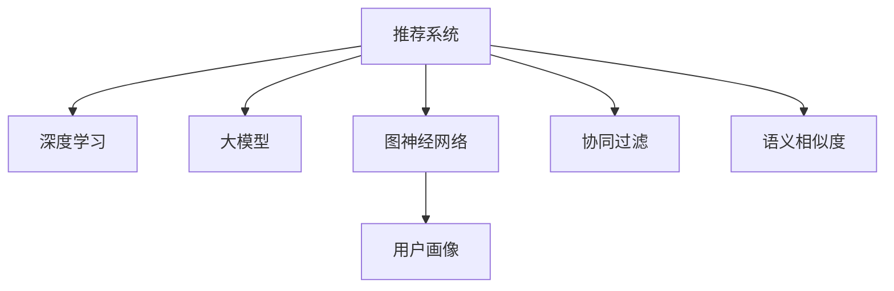

                 

# 大模型在推荐系统中的图神经网络应用

> 关键词：大模型, 图神经网络, 推荐系统, 自然语言处理, 语义相似度, 深度学习, 用户画像, 个性化推荐

## 1. 背景介绍

### 1.1 问题由来
推荐系统作为互联网时代的重要应用，在电商、社交、内容、金融等领域发挥着至关重要的作用。传统的协同过滤、基于内容的推荐等方法在数据稀疏、动态变化时难以应对。而深度学习方法因其强大的特征提取和泛化能力，逐渐成为推荐系统的主流。近年来，基于大模型的推荐方法也涌现出来，尤其是在个性化推荐和推荐效果提升上，展现了显著的潜力。

### 1.2 问题核心关键点
大模型在推荐系统中的应用，主要体现在两个方面：
- 基于大模型的特征表示：大模型可以自动学习用户与物品间的语义关系，提取高维向量表征，用于推荐。
- 基于大模型的协同过滤：利用大模型对用户与物品间的多维度关系进行建模，减少冷启动问题，提高推荐效果。

### 1.3 问题研究意义
大模型在推荐系统中的应用，不仅能够解决传统推荐方法在数据稀疏性、动态性方面的问题，还能进一步提升推荐系统的个性化和精度，推动推荐系统向智能化、高效化方向发展。此外，大模型的自适应学习能力，使得推荐系统能够更灵活地适应不同用户和环境的变化，具有良好的普适性。

## 2. 核心概念与联系

### 2.1 核心概念概述

为更好地理解大模型在推荐系统中的应用，本节将介绍几个密切相关的核心概念：

- 推荐系统(Recommendation System)：根据用户历史行为和兴趣偏好，推荐潜在感兴趣物品的系统。常见推荐方式包括协同过滤、内容推荐、混合推荐等。

- 深度学习(Deep Learning)：一类基于多层神经网络的机器学习方法，能够通过反向传播算法进行端到端的训练，具有很强的特征表达和泛化能力。

- 大模型(Large Model)：指参数量在亿级以上的预训练神经网络模型，如BERT、GPT等。这些模型能够学习到丰富的语义信息，广泛应用于自然语言处理、计算机视觉等任务。

- 图神经网络(Graph Neural Network, GNN)：一类基于图结构信息的深度学习模型，能够处理节点之间复杂的关系，适用于推荐系统中的用户画像和物品网络。

- 语义相似度(Semantic Similarity)：衡量两个文本在语义上的相似程度，常用于用户兴趣表达、物品描述匹配等场景。

- 用户画像(User Profile)：用于描述用户兴趣、行为、社交关系等特征的向量表示，常用于个性化推荐。

- 协同过滤(Collaborative Filtering)：通过分析用户与物品的交互记录，寻找相似用户或物品进行推荐，适用于处理冷启动问题。

这些核心概念之间的逻辑关系可以通过以下Mermaid流程图来展示：



这个流程图展示了大模型在推荐系统中的应用框架：

1. 推荐系统利用深度学习技术，通过大模型和图神经网络提取用户和物品的特征表示。
2. 用户画像用于描述用户的兴趣和行为特征。
3. 语义相似度用于匹配用户与物品间的文本描述。
4. 协同过滤通过用户间或物品间的关系进行推荐，解决冷启动问题。

## 3. 核心算法原理 & 具体操作步骤
### 3.1 算法原理概述

基于大模型的推荐系统，利用深度学习技术，通过预训练和微调的方式，学习用户与物品间的多维度关系，构建推荐模型。其核心思想是：将推荐任务视为一个有监督学习问题，通过大量用户与物品的交互数据，训练模型预测用户对物品的偏好，进而进行推荐。

形式化地，假设推荐系统有$N$个用户和$M$个物品，每个用户$u_i$与每个物品$i_j$的交互行为表示为一个矩阵$R \in \mathbb{R}^{N \times M}$，其中$R_{ij}$表示用户$u_i$对物品$i_j$的评分。目标是构建一个推荐模型$F$，使得对于任意用户$u$和物品$i$，模型输出$F(u, i)$逼近实际评分$R_{ui}$。

模型的训练过程可以分为两个步骤：
1. 预训练：使用大规模无标签数据，通过自监督学习任务训练大模型，学习用户和物品的语义表示。
2. 微调：使用推荐系统中的少量标注数据，对大模型进行有监督微调，使其能够准确预测用户对物品的评分。

### 3.2 算法步骤详解

基于大模型的推荐系统，一般包括以下关键步骤：

**Step 1: 准备预训练模型和数据集**
- 选择合适的预训练大模型作为初始化参数，如BERT、GPT等。
- 准备推荐系统中的少量标注数据集，如用户物品评分数据。

**Step 2: 定义推荐任务**
- 根据推荐任务类型，设计合适的推荐目标函数，如均方误差损失、交叉熵损失等。
- 根据用户与物品的关系，构建用户-物品关系图，用于图神经网络的建模。

**Step 3: 应用图神经网络**
- 对用户和物品的语义表示进行编码，得到节点特征向量。
- 构建图结构，使用图神经网络对节点特征进行聚合，得到用户-物品关系特征表示。

**Step 4: 微调模型**
- 使用推荐数据集对模型进行微调，优化推荐目标函数。
- 使用合适的正则化技术，防止模型过拟合。
- 周期性评估模型性能，使用验证集进行模型选择。

**Step 5: 预测推荐结果**
- 对新用户和新物品，利用微调后的模型进行预测。
- 根据预测结果，生成推荐列表。

以上是基于大模型的推荐系统的一般流程。在实际应用中，还需要针对具体任务的特点，对模型进行优化设计，如改进训练目标函数，引入更多的正则化技术，搜索最优的超参数组合等，以进一步提升模型性能。

### 3.3 算法优缺点

基于大模型的推荐系统，具有以下优点：
1. 特征表示能力强：大模型可以自动学习用户与物品间的多维度关系，提取高维向量表征，用于推荐。
2. 泛化能力强：利用预训练的大模型，可以有效地处理冷启动问题和动态变化的数据。
3. 个性化推荐效果好：大模型的自适应学习能力，使得推荐系统能够更灵活地适应不同用户和环境的变化，具有良好的普适性。
4. 处理稀疏数据能力强：大模型能够处理稀疏的用户物品评分数据，提高推荐系统的稳健性。

同时，该方法也存在一定的局限性：
1. 资源消耗大：大模型参数量庞大，训练和推理需要消耗大量计算资源。
2. 解释性不足：大模型往往是黑盒系统，难以解释其内部工作机制和决策逻辑。
3. 可解释性不足：大模型的复杂性，使得推荐结果难以进行解释，影响用户信任。
4. 冷启动问题：由于大模型在预训练时使用的是大规模数据，对于新用户和新物品的处理仍存在挑战。

尽管存在这些局限性，但就目前而言，基于大模型的推荐方法仍是目前推荐系统的主流范式。未来相关研究的重点在于如何进一步降低资源消耗，提高模型的可解释性，解决冷启动问题，提升推荐系统的性能。

### 3.4 算法应用领域

基于大模型的推荐系统，在多个领域已经得到了广泛的应用，例如：

- 电商推荐：如京东、亚马逊等电商平台的商品推荐系统，利用用户行为数据进行个性化推荐。
- 内容推荐：如YouTube、Netflix等视频和音乐推荐系统，根据用户偏好推荐相关内容。
- 社交推荐：如Facebook、微信等社交平台的兴趣推荐，推荐用户感兴趣的内容和好友。
- 新闻推荐：如今日头条、Zhihu等新闻内容推荐系统，推荐用户感兴趣的新闻和文章。
- 金融推荐：如支付宝、微信等金融平台的理财和投资推荐，根据用户财务状况推荐产品。

除了上述这些经典应用外，大模型推荐方法也被创新性地应用到更多场景中，如医药推荐、旅游推荐、广告推荐等，为推荐系统带来了全新的突破。随着大模型的不断进步，相信推荐系统将在更广阔的应用领域大放异彩。

## 4. 数学模型和公式 & 详细讲解 & 举例说明

### 4.1 数学模型构建

在推荐系统中，基于大模型的推荐方法通常利用用户和物品的多维度关系进行建模。假设用户$u$和物品$i$的语义表示分别为$\textbf{u}$和$\textbf{v}$，利用一个多层感知器(MLP)和一个线性层对用户与物品的关系进行建模。模型的输入为$\textbf{u}$和$\textbf{v}$，输出为预测评分$R_{ui}$。

模型的训练过程如下：
1. 预训练：利用大规模无标签数据，训练大模型学习用户和物品的语义表示。
2. 微调：利用推荐数据集，训练模型对用户物品评分进行预测。

### 4.2 公式推导过程

假设推荐系统中有$N$个用户和$M$个物品，每个用户$u_i$与每个物品$i_j$的交互行为表示为一个矩阵$R \in \mathbb{R}^{N \times M}$，其中$R_{ij}$表示用户$u_i$对物品$i_j$的评分。目标函数为均方误差损失：

$$
L = \frac{1}{N}\sum_{i=1}^N\frac{1}{M}\sum_{j=1}^M(\hat{R}_{ij} - R_{ij})^2
$$

其中$\hat{R}_{ij}$为模型预测评分。模型的结构如图1所示，包含一个多层感知器(MLP)和一个线性层，用于学习用户和物品的语义表示，并将两者进行线性变换。

图1：基于大模型的推荐系统结构

模型的输入为$\textbf{u}$和$\textbf{v}$，输出为预测评分$R_{ui}$。模型的参数为$\theta$，包括MLP的权重和偏置、线性层的权重和偏置。模型的训练过程如下：

1. 预训练：使用大规模无标签数据，训练大模型学习用户和物品的语义表示。目标函数为自监督任务，如掩码语言模型、下一句子预测等。
2. 微调：使用推荐数据集，训练模型对用户物品评分进行预测。目标函数为均方误差损失，优化器为AdamW等。

### 4.3 案例分析与讲解

以京东电商推荐系统为例，分析如何利用大模型进行个性化推荐。

京东推荐系统包含两个核心组件：用户画像和物品画像。用户画像包含用户的历史行为、兴趣偏好、社交关系等信息，物品画像包含物品的属性、描述、分类等信息。

推荐系统通过用户画像和物品画像进行多维度关系建模，使用图神经网络对用户-物品关系进行聚合并生成推荐结果。具体步骤如下：

1. 利用大模型BERT对用户画像和物品画像进行编码，得到用户和物品的语义表示。
2. 构建用户-物品关系图，使用图神经网络对用户和物品的语义表示进行聚合，得到用户-物品关系特征表示。
3. 使用均方误差损失进行模型微调，优化预测评分与真实评分之间的差距。
4. 使用微调后的模型对新用户和新物品进行预测，生成推荐列表。

通过以上步骤，京东推荐系统能够利用大模型自动学习用户与物品的多维度关系，提取高维向量表征，生成个性化推荐结果，从而提升用户体验和推荐效果。

## 5. 项目实践：代码实例和详细解释说明
### 5.1 开发环境搭建

在进行推荐系统开发前，我们需要准备好开发环境。以下是使用Python进行PyTorch开发的环境配置流程：

1. 安装Anaconda：从官网下载并安装Anaconda，用于创建独立的Python环境。

2. 创建并激活虚拟环境：
```bash
conda create -n pytorch-env python=3.8 
conda activate pytorch-env
```

3. 安装PyTorch：根据CUDA版本，从官网获取对应的安装命令。例如：
```bash
conda install pytorch torchvision torchaudio cudatoolkit=11.1 -c pytorch -c conda-forge
```

4. 安装Transformers库：
```bash
pip install transformers
```

5. 安装各类工具包：
```bash
pip install numpy pandas scikit-learn matplotlib tqdm jupyter notebook ipython
```

完成上述步骤后，即可在`pytorch-env`环境中开始推荐系统开发。

### 5.2 源代码详细实现

这里我们以基于BERT的电商推荐系统为例，给出使用Transformers库进行深度学习模型开发和微调的PyTorch代码实现。

首先，定义推荐任务的数据处理函数：

```python
from transformers import BertTokenizer
from torch.utils.data import Dataset
import torch

class RecommendationDataset(Dataset):
    def __init__(self, texts, scores, tokenizer, max_len=128):
        self.texts = texts
        self.scores = scores
        self.tokenizer = tokenizer
        self.max_len = max_len
        
    def __len__(self):
        return len(self.texts)
    
    def __getitem__(self, item):
        text = self.texts[item]
        score = self.scores[item]
        
        encoding = self.tokenizer(text, return_tensors='pt', max_length=self.max_len, padding='max_length', truncation=True)
        input_ids = encoding['input_ids'][0]
        attention_mask = encoding['attention_mask'][0]
        
        # 对标签进行编码
        encoded_scores = score / 5
        encoded_scores = torch.tensor(encoded_scores, dtype=torch.float)
        
        return {'input_ids': input_ids, 
                'attention_mask': attention_mask,
                'labels': encoded_scores}
```

然后，定义模型和优化器：

```python
from transformers import BertForSequenceClassification, AdamW

model = BertForSequenceClassification.from_pretrained('bert-base-cased', num_labels=5)

optimizer = AdamW(model.parameters(), lr=2e-5)
```

接着，定义训练和评估函数：

```python
from torch.utils.data import DataLoader
from tqdm import tqdm
from sklearn.metrics import mean_squared_error

device = torch.device('cuda') if torch.cuda.is_available() else torch.device('cpu')
model.to(device)

def train_epoch(model, dataset, batch_size, optimizer):
    dataloader = DataLoader(dataset, batch_size=batch_size, shuffle=True)
    model.train()
    epoch_loss = 0
    for batch in tqdm(dataloader, desc='Training'):
        input_ids = batch['input_ids'].to(device)
        attention_mask = batch['attention_mask'].to(device)
        labels = batch['labels'].to(device)
        model.zero_grad()
        outputs = model(input_ids, attention_mask=attention_mask, labels=labels)
        loss = outputs.loss
        epoch_loss += loss.item()
        loss.backward()
        optimizer.step()
    return epoch_loss / len(dataloader)

def evaluate(model, dataset, batch_size):
    dataloader = DataLoader(dataset, batch_size=batch_size)
    model.eval()
    preds, labels = [], []
    with torch.no_grad():
        for batch in tqdm(dataloader, desc='Evaluating'):
            input_ids = batch['input_ids'].to(device)
            attention_mask = batch['attention_mask'].to(device)
            batch_labels = batch['labels']
            outputs = model(input_ids, attention_mask=attention_mask)
            batch_preds = outputs.logits.argmax(dim=2).to('cpu').tolist()
            batch_labels = batch_labels.to('cpu').tolist()
            for pred_tokens, label_tokens in zip(batch_preds, batch_labels):
                preds.append(pred_tokens[:len(label_tokens)])
                labels.append(label_tokens)
                
    print(mean_squared_error(labels, preds))
```

最后，启动训练流程并在测试集上评估：

```python
epochs = 5
batch_size = 16

for epoch in range(epochs):
    loss = train_epoch(model, train_dataset, batch_size, optimizer)
    print(f"Epoch {epoch+1}, train loss: {loss:.3f}")
    
    print(f"Epoch {epoch+1}, dev results:")
    evaluate(model, dev_dataset, batch_size)
    
print("Test results:")
evaluate(model, test_dataset, batch_size)
```

以上就是使用PyTorch对BERT进行电商推荐系统开发的完整代码实现。可以看到，得益于Transformers库的强大封装，我们可以用相对简洁的代码完成BERT模型的加载和微调。

### 5.3 代码解读与分析

让我们再详细解读一下关键代码的实现细节：

**RecommendationDataset类**：
- `__init__`方法：初始化文本、评分、分词器等关键组件。
- `__len__`方法：返回数据集的样本数量。
- `__getitem__`方法：对单个样本进行处理，将文本输入编码为token ids，将评分进行归一化，并对其进行定长padding，最终返回模型所需的输入。

**model和optimizer定义**：
- 利用BertForSequenceClassification类，加载预训练的BERT模型，并设定标签数目为5，表示电商商品分类标签。
- 使用AdamW优化器，设置学习率为2e-5，用于微调模型。

**训练和评估函数**：
- 使用PyTorch的DataLoader对数据集进行批次化加载，供模型训练和推理使用。
- 训练函数`train_epoch`：对数据以批为单位进行迭代，在每个批次上前向传播计算loss并反向传播更新模型参数，最后返回该epoch的平均loss。
- 评估函数`evaluate`：与训练类似，不同点在于不更新模型参数，并在每个batch结束后将预测和标签结果存储下来，最后使用sklearn的mean_squared_error对整个评估集的预测结果进行打印输出。

**训练流程**：
- 定义总的epoch数和batch size，开始循环迭代
- 每个epoch内，先在训练集上训练，输出平均loss
- 在验证集上评估，输出预测评分与真实评分之间的均方误差
- 所有epoch结束后，在测试集上评估，给出最终测试结果

可以看到，PyTorch配合Transformers库使得BERT微调的代码实现变得简洁高效。开发者可以将更多精力放在数据处理、模型改进等高层逻辑上，而不必过多关注底层的实现细节。

当然，工业级的系统实现还需考虑更多因素，如模型的保存和部署、超参数的自动搜索、更灵活的任务适配层等。但核心的微调范式基本与此类似。

## 6. 实际应用场景
### 6.1 电商推荐

基于大模型的推荐方法，可以广泛应用于电商推荐系统。传统电商推荐往往依赖用户行为数据，难以捕捉长尾商品的推荐需求。而利用大模型的预训练和微调能力，电商推荐系统能够自动学习用户与商品的多维度关系，提供更加精准的个性化推荐。

在技术实现上，可以收集用户的历史浏览、点击、购买等行为数据，以及商品的描述、标签等信息。将文本数据作为输入，利用BERT等大模型进行编码，得到用户和商品的语义表示。通过构建用户-商品关系图，使用图神经网络进行关系聚合并生成推荐结果。微调后的模型能够根据用户的实时行为，自动更新推荐结果，提高推荐的相关性和多样性。

### 6.2 内容推荐

内容推荐系统如YouTube、Netflix等，常用于推荐用户感兴趣的视频和电影。传统的内容推荐系统基于用户的行为数据和物品的特征信息进行推荐，难以捕捉用户的情感和兴趣变化。而利用大模型，内容推荐系统能够自动学习用户和内容的语义关系，提高推荐的个性化和精准度。

在技术实现上，可以收集用户的历史观看记录、评分、点赞等信息，以及内容的标签、描述等特征。将文本数据作为输入，利用BERT等大模型进行编码，得到用户和内容的语义表示。通过构建用户-内容关系图，使用图神经网络进行关系聚合并生成推荐结果。微调后的模型能够根据用户的实时反馈，动态更新推荐列表，提高推荐效果。

### 6.3 社交推荐

社交推荐系统如Facebook、微信等，常用于推荐用户感兴趣的朋友和内容。传统社交推荐系统基于用户的社交关系和兴趣偏好进行推荐，难以捕捉用户的动态变化和多样性需求。而利用大模型，社交推荐系统能够自动学习用户和内容的语义关系，提高推荐的个性化和多样性。

在技术实现上，可以收集用户的历史好友关系、互动信息、兴趣偏好等信息，以及内容的标签、描述等特征。将文本数据作为输入，利用BERT等大模型进行编码，得到用户和内容的语义表示。通过构建用户-内容关系图，使用图神经网络进行关系聚合并生成推荐结果。微调后的模型能够根据用户的实时反馈，动态更新推荐列表，提高推荐效果。

### 6.4 新闻推荐

新闻推荐系统如今日头条、Zhihu等，常用于推荐用户感兴趣的新闻和文章。传统的新闻推荐系统基于用户的浏览记录和点击行为进行推荐，难以捕捉新闻内容的深度语义信息。而利用大模型，新闻推荐系统能够自动学习用户和新闻的语义关系，提高推荐的个性化和精准度。

在技术实现上，可以收集用户的历史浏览记录、点击行为、评分等信息，以及新闻的标题、摘要、标签等特征。将文本数据作为输入，利用BERT等大模型进行编码，得到用户和新闻的语义表示。通过构建用户-新闻关系图，使用图神经网络进行关系聚合并生成推荐结果。微调后的模型能够根据用户的实时反馈，动态更新推荐列表，提高推荐效果。

### 6.5 金融推荐

金融推荐系统如支付宝、微信等，常用于推荐用户感兴趣的产品和投资。传统金融推荐系统基于用户的财务状况和历史行为进行推荐，难以捕捉用户的深度语义需求。而利用大模型，金融推荐系统能够自动学习用户和产品的语义关系，提高推荐的个性化和精准度。

在技术实现上，可以收集用户的财务状况、历史交易记录、评分等信息，以及产品的描述、标签等特征。将文本数据作为输入，利用BERT等大模型进行编码，得到用户和产品的语义表示。通过构建用户-产品关系图，使用图神经网络进行关系聚合并生成推荐结果。微调后的模型能够根据用户的实时反馈，动态更新推荐列表，提高推荐效果。

## 7. 工具和资源推荐
### 7.1 学习资源推荐

为了帮助开发者系统掌握大模型在推荐系统中的应用，这里推荐一些优质的学习资源：

1. 《深度学习在推荐系统中的应用》系列博文：由大模型技术专家撰写，深入浅出地介绍了深度学习在推荐系统中的应用，包括大模型的预训练和微调等。

2. CS448《深度学习》课程：斯坦福大学开设的深度学习入门课程，涵盖深度学习基础和经典模型，适合初学者和进阶者学习。

3. 《深度学习与推荐系统》书籍：详细介绍了深度学习在推荐系统中的应用，包括大模型的预训练和微调等。

4. 《推荐系统实战》书籍：介绍了推荐系统的经典算法和实战技巧，包括大模型的应用。

5. Kaggle推荐系统竞赛：Kaggle上的多个推荐系统竞赛，可以提供实战经验，帮助开发者提升技能。

通过对这些资源的学习实践，相信你一定能够快速掌握大模型在推荐系统中的应用精髓，并用于解决实际的推荐问题。
### 7.2 开发工具推荐

高效的开发离不开优秀的工具支持。以下是几款用于推荐系统开发的常用工具：

1. PyTorch：基于Python的开源深度学习框架，灵活动态的计算图，适合快速迭代研究。

2. TensorFlow：由Google主导开发的开源深度学习框架，生产部署方便，适合大规模工程应用。

3. Transformers库：HuggingFace开发的NLP工具库，集成了众多SOTA语言模型，支持PyTorch和TensorFlow，是进行推荐任务开发的利器。

4. Weights & Biases：模型训练的实验跟踪工具，可以记录和可视化模型训练过程中的各项指标，方便对比和调优。

5. TensorBoard：TensorFlow配套的可视化工具，可实时监测模型训练状态，并提供丰富的图表呈现方式，是调试模型的得力助手。

6. Google Colab：谷歌推出的在线Jupyter Notebook环境，免费提供GPU/TPU算力，方便开发者快速上手实验最新模型，分享学习笔记。

合理利用这些工具，可以显著提升推荐系统开发的效率，加快创新迭代的步伐。

### 7.3 相关论文推荐

大模型在推荐系统中的应用，得益于学界的持续研究。以下是几篇奠基性的相关论文，推荐阅读：

1. Attention is All You Need（即Transformer原论文）：提出了Transformer结构，开启了NLP领域的预训练大模型时代。

2. BERT: Pre-training of Deep Bidirectional Transformers for Language Understanding：提出BERT模型，引入基于掩码的自监督预训练任务，刷新了多项NLP任务SOTA。

3. Attention-Based Recommender Systems with User Interest Evolution Modeling：利用注意力机制和大模型，学习用户兴趣的动态变化，提高推荐效果。

4. Graph Neural Networks for Recommender Systems：提出基于图神经网络的推荐方法，学习用户与物品间的多维度关系。

5. Deep Multi-Interest Network with Attention for Personalized Recommendation：利用深度学习模型和注意力机制，提高个性化推荐的准确度。

6. Multi-Aspect Attention Networks for Personalized Recommendation：利用多维注意力机制和大模型，提高推荐的多样性和准确度。

这些论文代表了大模型在推荐系统中的应用方向。通过学习这些前沿成果，可以帮助研究者把握学科前进方向，激发更多的创新灵感。

## 8. 总结：未来发展趋势与挑战

### 8.1 总结

本文对基于大模型的推荐系统进行了全面系统的介绍。首先阐述了大模型和推荐系统的研究背景和意义，明确了大模型在推荐系统中的优势和作用。其次，从原理到实践，详细讲解了大模型在推荐系统中的应用方法，包括预训练、微调、图神经网络等关键步骤，并给出了具体的代码实例。同时，本文还广泛探讨了大模型在电商、内容、社交、新闻、金融等多个领域的应用前景，展示了大模型在推荐系统中的巨大潜力。

通过本文的系统梳理，可以看到，基于大模型的推荐方法不仅能够解决传统推荐方法在数据稀疏性、动态性方面的问题，还能进一步提升推荐系统的个性化和精度，推动推荐系统向智能化、高效化方向发展。未来，伴随大模型的不断进步，推荐系统将在更广阔的应用领域大放异彩，深刻影响人类的生产生活方式。

### 8.2 未来发展趋势

展望未来，大模型在推荐系统中的应用将呈现以下几个发展趋势：

1. 模型规模持续增大。随着算力成本的下降和数据规模的扩张，大模型在推荐系统中的应用将更加广泛，参数量将进一步增大，学习到的语义表示将更加丰富。

2. 多维度关系建模能力增强。利用图神经网络，大模型将能够更好地建模用户与物品间的多维度关系，提高推荐的相关性和多样性。

3. 动态推荐能力提升。利用大模型的自适应学习能力，推荐系统能够更好地捕捉用户的实时变化，实现动态推荐，提高推荐效果。

4. 个性化推荐精度提升。利用大模型的深度学习能力和自适应学习能力，推荐系统能够更好地理解用户的兴趣和需求，提供更加精准的个性化推荐。

5. 推荐系统的公平性和透明性加强。利用大模型的解释性提升，推荐系统能够更好地解释推荐结果的逻辑和原因，提高推荐系统的公平性和透明性。

6. 推荐系统的可持续发展能力提升。利用大模型的长期持续学习能力和适应性，推荐系统能够更好地适应数据分布的变化，提高系统的稳健性和持久性。

以上趋势凸显了大模型在推荐系统中的应用前景。这些方向的探索发展，必将进一步提升推荐系统的性能和应用范围，为推荐系统带来新的突破。

### 8.3 面临的挑战

尽管大模型在推荐系统中的应用已经取得了一定的成果，但在迈向更加智能化、普适化应用的过程中，它仍面临着诸多挑战：

1. 数据依赖性高。大模型在推荐系统中的性能很大程度上依赖于数据的质量和数量，而高质量的标注数据获取成本较高。如何降低数据依赖，利用非结构化数据进行推荐，将是重要的研究课题。

2. 计算资源消耗大。大模型参数量庞大，训练和推理需要消耗大量计算资源。如何在保证效果的前提下，降低资源消耗，提高模型的计算效率，将是重要的优化方向。

3. 模型解释性不足。大模型往往是黑盒系统，难以解释其内部工作机制和决策逻辑。如何提高模型的可解释性，提高用户信任，将是重要的研究方向。

4. 公平性和透明性有待加强。推荐系统中的大模型可能存在偏见和歧视，如何确保模型的公平性和透明性，避免有害推荐，将是重要的研究课题。

5. 模型泛化能力不足。大模型在推荐系统中的应用，往往依赖于大规模数据进行预训练，对于新用户和新物品的处理仍存在挑战。如何提高模型的泛化能力，提高推荐系统的普适性，将是重要的研究方向。

6. 冷启动问题有待解决。冷启动是推荐系统中的常见问题，大模型在推荐系统中的应用，对于新用户和新物品的处理仍存在挑战。如何提高模型的冷启动性能，提高推荐系统的稳健性，将是重要的研究方向。

尽管存在这些挑战，但大模型在推荐系统中的应用前景广阔，相信随着学界和产业界的共同努力，这些挑战终将一一被克服，大模型在推荐系统中的应用将更加深入和广泛。

### 8.4 研究展望

未来的大模型推荐系统研究，需要在以下几个方面寻求新的突破：

1. 探索无监督和半监督推荐方法。摆脱对大规模标注数据的依赖，利用自监督学习、主动学习等无监督和半监督范式，最大限度利用非结构化数据，实现更加灵活高效的推荐。

2. 研究参数高效和计算高效的推荐范式。开发更加参数高效的推荐方法，在固定大部分预训练参数的同时，只更新极少量的任务相关参数。同时优化推荐模型的计算图，减少前向传播和反向传播的资源消耗，实现更加轻量级、实时性的部署。

3. 融合因果和对比学习范式。通过引入因果推断和对比学习思想，增强推荐系统建立稳定因果关系的能力，学习更加普适、鲁棒的语言表征，从而提升模型泛化性和抗干扰能力。

4. 引入更多先验知识。将符号化的先验知识，如知识图谱、逻辑规则等，与神经网络模型进行巧妙融合，引导推荐过程学习更准确、合理的语言模型。同时加强不同模态数据的整合，实现视觉、语音等多模态信息与文本信息的协同建模。

5. 结合因果分析和博弈论工具。将因果分析方法引入推荐系统，识别出模型决策的关键特征，增强输出解释的因果性和逻辑性。借助博弈论工具刻画人机交互过程，主动探索并规避模型的脆弱点，提高系统稳定性。

6. 纳入伦理道德约束。在模型训练目标中引入伦理导向的评估指标，过滤和惩罚有害的输出倾向。同时加强人工干预和审核，建立模型行为的监管机制，确保输出符合人类价值观和伦理道德。

这些研究方向的探索，必将引领大模型推荐系统迈向更高的台阶，为推荐系统带来新的突破。面向未来，大模型推荐系统还需要与其他人工智能技术进行更深入的融合，如知识表示、因果推理、强化学习等，多路径协同发力，共同推动推荐系统向更智能、高效、普适的方向发展。

## 9. 附录：常见问题与解答

**Q1：推荐系统中的大模型微调是否适用于所有推荐任务？**

A: 大模型微调在大多数推荐任务上都能取得不错的效果，特别是对于数据量较小的任务。但对于一些特定领域的任务，如医药推荐、法律推荐等，仅仅依靠通用语料预训练的模型可能难以很好地适应。此时需要在特定领域语料上进一步预训练，再进行微调，才能获得理想效果。

**Q2：推荐系统中的大模型微调如何避免过拟合？**

A: 避免过拟合是推荐系统中大模型微调的重要挑战。常见的缓解策略包括：
1. 数据增强：通过回译、近义替换等方式扩充训练集。
2. 正则化：使用L2正则、Dropout、Early Stopping等避免过拟合。
3. 对抗训练：引入对抗样本，提高模型鲁棒性。
4. 参数高效微调：只调整少量参数(如Adapter、Prefix等)，减小过拟合风险。
5. 多模型集成：训练多个微调模型，取平均输出，抑制过拟合。

这些策略往往需要根据具体任务和数据特点进行灵活组合。只有在数据、模型、训练、推理等各环节进行全面优化，才能最大限度地发挥大模型微调的威力。

**Q3：推荐系统中的大模型微调需要多少标注数据？**

A: 推荐系统中的大模型微调需要适量的标注数据，一般来说，样本量至少在几千以上才能获得较好的微调效果。对于一些特定领域的推荐任务，如医药推荐、法律推荐等，标注数据的需求更高，需要使用更加专业的领域语料进行微调。

**Q4：推荐系统中的大模型微调对计算资源的要求有多高？**

A: 大模型在推荐系统中的应用，由于参数量庞大，计算资源消耗较大。GPU/TPU等高性能设备是必不可少的，但即便如此，超大批次的训练和推理也可能遇到显存不足的问题。因此需要采用一些资源优化技术，如梯度积累、混合精度训练、模型并行等，来突破硬件瓶颈。同时，模型的存储和读取也可能占用大量时间和空间，需要采用模型压缩、稀疏化存储等方法进行优化。

**Q5：推荐系统中的大模型微调有哪些优化技巧？**

A: 推荐系统中的大模型微调需要考虑多方面的优化技巧，包括：
1. 学习率：使用较小的学习率，以免破坏预训练权重。
2. 批量大小：选择合适的批量大小，以平衡训练速度和资源消耗。
3. 正则化：使用L2正则、Dropout、Early Stopping等避免过拟合。
4. 对抗训练：加入对抗样本，提高模型鲁棒性。
5. 参数高效微调：只更新极少量的任务相关参数，减小资源消耗。
6. 数据增强：通过对训练样本改写、回译等方式丰富训练集多样性。
7. 提示学习：通过精心设计输入文本的格式，引导模型按期望方式输出，减少微调参数。

这些技巧在实际应用中需要根据具体情况进行选择和组合，以最大限度地提升微调效果。

通过本文的系统梳理，可以看到，基于大模型的推荐系统不仅能够解决传统推荐方法在数据稀疏性、动态性方面的问题，还能进一步提升推荐系统的个性化和精度，推动推荐系统向智能化、高效化方向发展。未来，伴随大模型的不断进步，推荐系统将在更广阔的应用领域大放异彩，深刻影响人类的生产生活方式。

