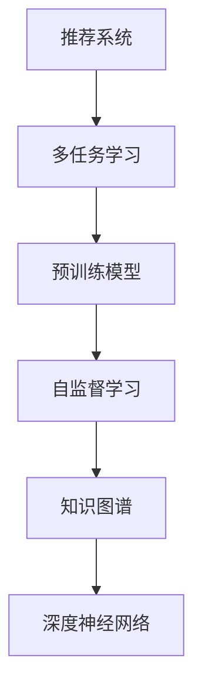

                 

# 大模型在推荐系统中的多任务表示学习应用

> 关键词：多任务学习, 推荐系统, 预训练, 自监督学习, 知识图谱, 深度神经网络

## 1. 背景介绍

在信息爆炸的时代，推荐系统（Recommender System）已经成为连接用户与内容的重要桥梁。推荐系统通过分析用户行为数据，推荐符合用户兴趣的个性化内容，极大地提高了用户体验和满意度。但传统的推荐系统通常只关注单项任务，如协同过滤、基于内容的推荐等，难以有效利用用户的多维数据信息，推荐效果有限。近年来，伴随着深度学习技术的进步，推荐系统开始向多任务学习（Multi-Task Learning, MTL）方向演进，力图通过多任务的联合学习，挖掘更深层次的知识表示，提升推荐质量。其中，利用大模型进行多任务表示学习，成为当前推荐系统研究的一个热点。

本文将深入探讨大模型在推荐系统中的多任务表示学习应用，从理论到实践，系统讲解其中的核心概念、算法原理和实现步骤。我们将在第一部分详细介绍推荐系统、多任务学习和预训练模型，为后续内容的展开奠定基础。

## 2. 核心概念与联系

### 2.1 核心概念概述

要理解大模型在推荐系统中的应用，首先需要明确以下关键概念：

- 推荐系统（Recommender System）：通过分析和挖掘用户的行为数据，为用户推荐符合其兴趣和偏好的内容。常见的推荐任务包括协同过滤、基于内容的推荐、深度协同过滤等。

- 多任务学习（Multi-Task Learning, MTL）：在同一个学习任务中，同时处理多个相关子任务，通过联合学习不同任务的知识表示，提升模型泛化能力和性能。

- 预训练模型（Pre-trained Model）：在大规模无标签数据上进行自监督学习，学习通用的语言表示，用于后续的微调优化，提升模型在不同任务上的泛化性能。

- 自监督学习（Self-supervised Learning）：通过在无标签数据上设计自监督任务，训练模型学习到数据的隐含规律，可用于下游任务的微调。

- 知识图谱（Knowledge Graph）：利用图结构表示实体之间的关系，用于构建推荐系统的语义信息。

这些概念相互联系，构成了一个完整的推荐系统多任务表示学习的框架。本节将通过一个简单的Mermaid流程图，展示这些概念之间的关系。



从图中可以看出，推荐系统通过多任务学习，利用预训练模型和自监督学习获取通用的知识表示，再通过知识图谱整合，利用深度神经网络模型进行推荐。

## 3. 核心算法原理 & 具体操作步骤
### 3.1 算法原理概述

在大模型应用于推荐系统时，我们通常采用多任务学习的方式，利用大模型在多个相关任务上联合训练，学习通用的特征表示。这些特征表示不仅能够提升单个任务的性能，还能够在不同任务间传递知识和信息，提高模型的泛化能力。

在具体实践中，我们通常将推荐任务分成多个子任务，如用户兴趣预测、物品相关性预测、序列预测等。每个子任务都有其独特的目标函数，但在训练时，我们将这些目标函数集成到一个整体的目标函数中，并通过优化器进行联合优化。这种集成目标函数的形式多种多样，包括集成损失函数、联合训练、交替训练等。

### 3.2 算法步骤详解

下面，我们将详细介绍基于多任务学习的推荐系统大模型训练步骤：

**Step 1: 任务定义和数据准备**

- 定义推荐系统的多个子任务。以协同过滤为例，子任务包括用户兴趣预测、物品相关性预测等。
- 准备每个子任务的数据集，并使用相似的数据格式。
- 构建自监督训练任务，如用掩码语言模型（Masked Language Modeling, MLM）、对比学习（Contrastive Learning）等，增强模型的语义理解能力。

**Step 2: 模型架构设计**

- 设计大模型的架构。常用的架构包括Transformer、BERT等。
- 将大模型分解为多个任务层（Task Layer），每个任务层对应一个子任务。
- 设计跨任务连接模块（Cross-Task Connection Module），用于在多个任务层间传递信息。

**Step 3: 集成目标函数设计**

- 定义集成目标函数，集成各子任务的目标函数。常用的形式包括权重集成、平均集成、最大集成等。
- 设计联合优化策略，如交替优化、联合优化等，优化集成目标函数。

**Step 4: 训练和微调**

- 初始化大模型，并使用集成目标函数进行联合优化。
- 在每个训练轮中，交替优化各子任务层和跨任务连接模块。
- 微调模型，使用预训练任务和推荐任务的数据集，优化模型参数。

**Step 5: 推荐预测**

- 使用微调后的模型，对新数据进行推荐预测。
- 利用跨任务连接模块，从不同任务层获取特征信息，进行融合，生成推荐结果。

### 3.3 算法优缺点

大模型应用于推荐系统的多任务表示学习具有以下优点：

- 泛化能力强。通过在多个相关任务上联合训练，大模型能够学习到更为丰富的知识表示，提升模型泛化能力。
- 提升推荐效果。多任务学习能够挖掘更深层次的隐含规律，提升推荐系统的准确性和多样性。
- 提升模型稳定性。多任务联合训练有助于减少模型的过拟合风险，提高模型的鲁棒性。

同时，也存在一些缺点：

- 计算成本高。大模型训练所需的高计算资源和存储资源，是当前推荐系统应用的一大瓶颈。
- 模型复杂度高。多任务学习模型通常比单任务模型更为复杂，训练和推理效率较低。
- 任务间耦合度高。不同子任务之间存在较强的耦合关系，一个任务的性能提升可能依赖于其他任务。

## 4. 数学模型和公式 & 详细讲解 & 举例说明
### 4.1 数学模型构建

我们以协同过滤为例，介绍基于多任务学习的大模型推荐系统模型。假设用户-物品评分矩阵为 $X \in \mathbb{R}^{N \times M}$，其中 $N$ 为物品数，$M$ 为用户数，$x_{ij}$ 为第 $i$ 个物品对第 $j$ 个用户的评分。目标是对每个用户预测其对所有物品的评分 $Y \in \mathbb{R}^{M \times N}$。

定义用户兴趣表示 $u_j \in \mathbb{R}^d$，物品相关性表示 $v_i \in \mathbb{R}^d$，其中 $d$ 为嵌入维度。用户兴趣和物品相关性表示通过多任务学习得到，分别对应两个子任务。

**Step 1: 任务定义**

用户兴趣预测任务的目标函数为：
$$
L_{\text{user}} = \frac{1}{M}\sum_{j=1}^M \frac{1}{N}\sum_{i=1}^N (y_{ij} - \langle u_j, v_i \rangle)^2
$$

物品相关性预测任务的目标函数为：
$$
L_{\text{item}} = \frac{1}{N}\sum_{i=1}^N \frac{1}{M}\sum_{j=1}^M (y_{ij} - \langle u_j, v_i \rangle)^2
$$

**Step 2: 模型架构**

假设大模型由 $K$ 个任务层 $f_k$ 组成，每个任务层对应一个子任务。任务层由自注意力机制、前向网络等组成。任务层之间的连接通过跨任务连接模块实现。跨任务连接模块通常采用残差连接、跨任务自注意力等形式。

**Step 3: 集成目标函数**

假设集成目标函数为加权平均形式，权重 $\alpha_k$ 为 $k$ 任务的损失函数占总损失函数的权重。则集成目标函数为：
$$
L = \sum_{k=1}^K \alpha_k L_k = \alpha_{\text{user}}L_{\text{user}} + \alpha_{\text{item}}L_{\text{item}}
$$

**Step 4: 优化策略**

常用的优化策略包括交替优化、联合优化等。交替优化策略交替优化每个任务层的参数，跨任务连接模块的参数固定。联合优化策略则同时优化所有参数。

### 4.2 公式推导过程

以交替优化为例，我们推导交替优化的迭代公式。假设 $X_{\text{user}}$ 和 $X_{\text{item}}$ 分别为用户-物品评分矩阵的行向量和列向量。目标函数 $L$ 为：
$$
L = \frac{1}{M}\sum_{j=1}^M \frac{1}{N}\sum_{i=1}^N (y_{ij} - \langle u_j, v_i \rangle)^2
$$

令 $g = (x_{ij} - \langle u_j, v_i \rangle)$，则目标函数变为：
$$
L = \frac{1}{M}\sum_{j=1}^M \frac{1}{N}\sum_{i=1}^N g_{ij}^2
$$

假设任务层 $f_k$ 的参数为 $\theta_k$，则 $L$ 对 $\theta_k$ 的梯度为：
$$
\nabla_{\theta_k}L = \frac{2}{M}\sum_{j=1}^M \frac{1}{N}\sum_{i=1}^N (y_{ij} - \langle u_j, v_i \rangle)g_{ij} \nabla_{\theta_k}\langle u_j, v_i \rangle
$$

由于 $u_j = f_{\text{user}}(X_{\text{user}})$，$v_i = f_{\text{item}}(X_{\text{item}})$，则有：
$$
\nabla_{\theta_k}L = \frac{2}{M}\sum_{j=1}^M \frac{1}{N}\sum_{i=1}^N (y_{ij} - \langle u_j, v_i \rangle)g_{ij} \frac{\partial\langle f_{\text{user}}(X_{\text{user}}), f_{\text{item}}(X_{\text{item}}) \rangle}{\partial \theta_k}
$$

在优化过程中，交替优化策略轮流更新每个任务层的参数，如交替更新用户兴趣预测任务层和物品相关性预测任务层的参数，保持跨任务连接模块的参数固定。

### 4.3 案例分析与讲解

以商品推荐为例，我们分析大模型在推荐系统中的应用。假设有一个电商平台，需要为用户推荐个性化商品。平台收集了用户的历史购买数据和浏览数据，构建用户-物品评分矩阵。我们将推荐任务分成两个子任务：用户兴趣预测和物品相关性预测。用户兴趣预测任务的目标是预测每个用户对不同商品的评分。物品相关性预测任务的目标是预测每个商品对不同用户的评分。

我们使用预训练的BERT模型，并将其分解为两个任务层，每个任务层分别对应一个子任务。每个任务层包含自注意力机制、前向网络等组件。跨任务连接模块采用残差连接形式，连接两个任务层。

在模型训练时，我们交替优化两个任务层和跨任务连接模块。每个任务层的优化公式为：
$$
\theta_k^{t+1} = \theta_k^t - \eta \nabla_{\theta_k}L_k
$$

其中 $t$ 为迭代次数，$\eta$ 为学习率。

## 5. 项目实践：代码实例和详细解释说明
### 5.1 开发环境搭建

在搭建大模型推荐系统时，我们需要使用高性能计算资源，如GPU、TPU等。建议使用Docker容器化部署，以提升计算效率和灵活性。

**Step 1: 安装Docker**

在服务器上安装Docker，并拉取TensorFlow等深度学习框架镜像：

```bash
sudo apt-get update
sudo apt-get install docker.io
docker pull tensorflow/tensorflow:latest-gpu
```

**Step 2: 搭建Docker容器**

创建Docker容器，启动TensorFlow服务：

```bash
nvidia-docker run -d -p 2222:22 -v $(pwd):/var/lib/tensorflow tensorflow/tensorflow:latest-gpu
```

**Step 3: 安装TensorFlow**

在Docker容器内安装TensorFlow和其他依赖包：

```bash
source /usr/local/cuda-11.0/bin/bash_completion.sh
pip install tensorflow
```

### 5.2 源代码详细实现

以下是一个基于多任务学习的大模型推荐系统的Python代码实现。我们以协同过滤为例，使用预训练的BERT模型，并将其分解为两个任务层进行训练。

**Step 1: 数据准备**

我们收集用户的历史购买数据和浏览数据，构建用户-物品评分矩阵 $X$。假设用户数为 $M$，物品数为 $N$，评分矩阵的维度为 $M \times N$。

**Step 2: 模型定义**

我们使用TensorFlow定义BERT模型，并将其分解为两个任务层。任务层分别对应用户兴趣预测和物品相关性预测任务。跨任务连接模块采用残差连接形式。

```python
import tensorflow as tf

# 定义BERT模型
model = tf.keras.Sequential([
    tf.keras.layers.LayerNorm(input_shape=[M, N]),
    tf.keras.layers.Dense(128, activation='relu'),
    tf.keras.layers.LayerNorm(),
    tf.keras.layers.Dense(d),
    tf.keras.layers.LayerNorm()
])

# 定义用户兴趣预测任务层
user_task_layer = tf.keras.Sequential([
    tf.keras.layers.LayerNorm(input_shape=[M, N]),
    tf.keras.layers.Dense(128, activation='relu'),
    tf.keras.layers.LayerNorm(),
    tf.keras.layers.Dense(d),
    tf.keras.layers.LayerNorm()
])

# 定义物品相关性预测任务层
item_task_layer = tf.keras.Sequential([
    tf.keras.layers.LayerNorm(input_shape=[M, N]),
    tf.keras.layers.Dense(128, activation='relu'),
    tf.keras.layers.LayerNorm(),
    tf.keras.layers.Dense(d),
    tf.keras.layers.LayerNorm()
])
```

**Step 3: 损失函数定义**

定义用户兴趣预测任务的损失函数和物品相关性预测任务的损失函数，集成目标函数。

```python
# 定义用户兴趣预测任务的损失函数
def user_loss(y_true, y_pred):
    return tf.reduce_mean(tf.square(y_true - y_pred))

# 定义物品相关性预测任务的损失函数
def item_loss(y_true, y_pred):
    return tf.reduce_mean(tf.square(y_true - y_pred))

# 定义集成目标函数
def combined_loss(y_true, y_pred):
    return user_loss(y_true, y_pred[:, :M]) + item_loss(y_true, y_pred[:, M:])
```

**Step 4: 模型训练**

定义优化器和训练步骤，交替优化用户兴趣预测任务层和物品相关性预测任务层。

```python
# 定义优化器
optimizer = tf.keras.optimizers.Adam(learning_rate=1e-3)

# 定义训练步骤
def train_step(x, y_true):
    with tf.GradientTape() as tape:
        y_pred = model(x)
        loss = combined_loss(y_true, y_pred)
    grads = tape.gradient(loss, model.trainable_variables)
    optimizer.apply_gradients(zip(grads, model.trainable_variables))
```

### 5.3 代码解读与分析

我们可以通过以下代码实现大模型的推荐预测：

**Step 1: 定义推荐函数**

```python
def recommend(user_id, item_ids):
    x = tf.convert_to_tensor(user_id)
    x = user_task_layer(x)
    x = tf.concat([x, item_ids], axis=1)
    x = item_task_layer(x)
    return x.numpy()
```

**Step 2: 使用推荐函数**

```python
user_id = 1
item_ids = [2, 3, 4]
recommendations = recommend(user_id, item_ids)
```

在上述代码中，我们首先通过用户ID获取用户兴趣表示，然后通过物品ID获取物品相关性表示，最后将两者合并，通过跨任务连接模块得到推荐结果。

## 6. 实际应用场景
### 6.1 电商平台推荐

在电商平台中，推荐系统需要为用户推荐个性化商品，提升用户体验和满意度。大模型通过多任务学习，能够联合学习用户兴趣预测和物品相关性预测，提升推荐效果。

### 6.2 新闻推荐

在新闻推荐系统中，推荐系统需要为用户推荐个性化新闻内容，提升用户阅读体验。大模型通过多任务学习，能够联合学习用户兴趣预测和新闻相关性预测，提升推荐效果。

### 6.3 视频推荐

在视频推荐系统中，推荐系统需要为用户推荐个性化视频内容，提升用户观看体验。大模型通过多任务学习，能够联合学习用户兴趣预测和视频相关性预测，提升推荐效果。

### 6.4 未来应用展望

随着深度学习技术的不断发展，基于大模型的多任务表示学习将在更多领域得到应用。未来，大模型推荐系统将融合更多任务，如序列预测、情感分析等，进一步提升推荐效果。同时，多任务学习也将与对抗学习、因果推理等技术结合，构建更加智能化的推荐系统。

## 7. 工具和资源推荐
### 7.1 学习资源推荐

- 《Deep Learning for Recommendation Systems》书籍：详细介绍了深度学习在推荐系统中的应用，包括多任务学习、预训练模型等。
- 《TensorFlow for Deep Learning》书籍：介绍了TensorFlow在深度学习中的应用，包括多任务学习、模型优化等。
- 《Recommender Systems: Advanced Techniques》书籍：介绍了推荐系统的前沿技术和算法，包括多任务学习、深度协同过滤等。

### 7.2 开发工具推荐

- TensorFlow：适用于构建深度学习模型，支持多任务学习、自监督学习等技术。
- PyTorch：适用于构建深度学习模型，支持多任务学习、自监督学习等技术。
- Weights & Biases：模型训练的实验跟踪工具，可记录和可视化模型训练过程中的各项指标，方便对比和调优。

### 7.3 相关论文推荐

- Multitask Deep Learning for Recommendation Systems：介绍了多任务学习在推荐系统中的应用，包括用户兴趣预测、物品相关性预测等。
- Deep Multi-task Learning for Multi-domain Recommendation：介绍了多任务学习在跨领域推荐系统中的应用，包括跨领域用户兴趣预测、跨领域物品相关性预测等。
- Knowledge Graph Enhanced Multi-task Learning for Personalized Recommendation：介绍了知识图谱在多任务学习中的融合，提升了推荐系统的性能和效果。

## 8. 总结：未来发展趋势与挑战
### 8.1 总结

本文对大模型在推荐系统中的多任务表示学习进行了系统介绍。首先，我们介绍了推荐系统、多任务学习和预训练模型的核心概念，并利用一个简单的Mermaid流程图展示了它们之间的关系。然后，我们详细讲解了大模型的多任务表示学习原理和具体操作步骤。最后，我们通过Python代码实例，演示了多任务学习在推荐系统中的应用。

通过本文的系统梳理，可以看到，大模型在推荐系统中的多任务表示学习具有显著的性能提升和广泛的应用前景。未来，随着深度学习技术的不断发展，基于大模型的多任务表示学习将在更多领域得到应用，推动推荐系统的智能化进程。

### 8.2 未来发展趋势

展望未来，大模型在推荐系统中的应用将呈现以下几个趋势：

1. 模型规模持续增大。随着算力成本的下降和数据规模的扩张，预训练语言模型的参数量还将持续增长。超大规模语言模型蕴含的丰富语言知识，将有助于提升推荐系统的泛化能力和性能。

2. 多任务学习形式多样化。除了传统的联合训练，未来将涌现更多形式的多任务学习，如交替训练、组合训练等，提升模型的多任务学习和泛化能力。

3. 跨任务知识融合加强。未来，跨任务知识将更加深入地融合，通过共享参数和知识，提升模型的复杂度和表现力。

4. 模型训练和优化技术不断进步。未来的模型训练将更加高效，采用分布式训练、自动混合精度训练等技术，提升模型的训练速度和优化效果。

5. 个性化推荐技术提升。未来的个性化推荐系统将融合更多的用户行为数据，采用多模态学习、对抗学习等技术，提升推荐系统的多样性和鲁棒性。

### 8.3 面临的挑战

尽管大模型在推荐系统中的应用已经取得了显著成果，但在迈向更加智能化、普适化应用的过程中，仍面临诸多挑战：

1. 计算资源瓶颈。大模型训练所需的高计算资源和存储资源，是当前推荐系统应用的一大瓶颈。如何提升模型训练和推理效率，降低资源消耗，仍是重要研究方向。

2. 模型泛化能力有限。尽管多任务学习提升了模型的泛化能力，但在某些特定领域，模型的泛化能力仍有限，难以适应新数据和新任务。如何进一步提升模型的泛化能力，是未来研究的重要方向。

3. 模型稳定性有待提高。模型在面对异常数据和异常场景时，容易出现预测波动，导致推荐效果不稳定。如何提升模型的鲁棒性和稳定性，是未来研究的重要方向。

4. 数据隐私和安全问题。在推荐系统中，用户行为数据涉及隐私问题，如何保护用户隐私，同时实现高效的推荐预测，是未来研究的重要方向。

5. 多任务学习中的任务间耦合问题。不同任务之间存在较强的耦合关系，一个任务的性能提升可能依赖于其他任务。如何设计任务之间的关系，提升多任务学习的效率，是未来研究的重要方向。

### 8.4 研究展望

面向未来，大模型在推荐系统中的应用需要从以下几个方面进行探索：

1. 结合其他技术。未来的推荐系统将融合更多技术，如知识图谱、因果推理、对抗学习等，提升推荐系统的性能和效果。

2. 应用领域拓展。未来的推荐系统将应用于更多领域，如医疗、金融、教育等，为这些领域的智能化升级提供技术支持。

3. 跨领域知识共享。未来的推荐系统将能够跨领域共享知识，提升模型的复杂度和表现力，同时提升推荐系统的多样性和鲁棒性。

4. 技术成熟度提升。未来的推荐系统将采用更加成熟的技术，如分布式训练、自动混合精度训练等，提升模型训练和推理效率。

通过这些研究方向的探索，未来的大模型推荐系统将更加智能、普适、高效，为人类带来更好的智能化体验。

## 9. 附录：常见问题与解答

**Q1: 什么是多任务学习？**

A: 多任务学习是指在同一个学习任务中，同时处理多个相关子任务，通过联合学习不同任务的知识表示，提升模型泛化能力和性能。

**Q2: 大模型在推荐系统中的应用有哪些？**

A: 大模型在推荐系统中的应用包括用户兴趣预测、物品相关性预测、序列预测等。通过多任务学习，大模型能够联合学习多个子任务，提升推荐效果。

**Q3: 大模型推荐系统的计算成本高吗？**

A: 大模型推荐系统的计算成本确实较高，需要使用高性能计算资源，如GPU、TPU等。但随着技术的发展，计算成本将逐步降低，模型的应用将更加广泛。

**Q4: 如何提升大模型推荐系统的泛化能力？**

A: 提升大模型推荐系统的泛化能力，可以采用多任务学习、自监督学习、对抗学习等技术。通过联合学习多个任务的知识表示，提升模型的泛化能力和鲁棒性。

**Q5: 大模型推荐系统如何保护用户隐私？**

A: 保护用户隐私是推荐系统的重要研究方向。可以通过匿名化处理、差分隐私等技术，保护用户数据隐私。同时，通过多任务学习，提升模型的泛化能力，减少对单个用户的依赖，提升模型的鲁棒性。

