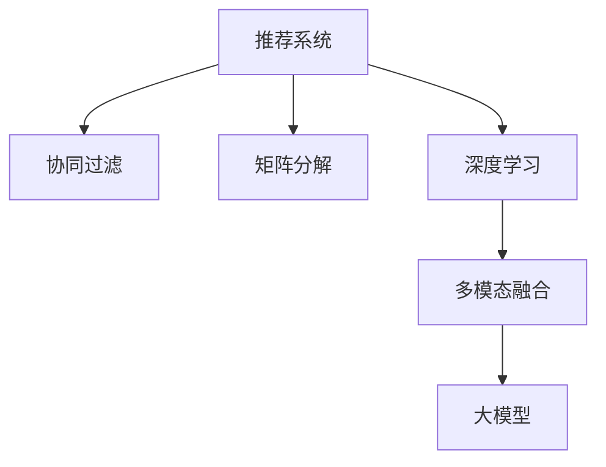

                 

# 大模型在推荐系统中的多模态融合

> 关键词：推荐系统,多模态融合,深度学习,大模型,协同过滤,矩阵分解

## 1. 背景介绍

在当今信息爆炸的时代，推荐系统已成为各大互联网平台的重要组成部分。无论是电商平台、视频平台，还是社交媒体，都能看到推荐系统的身影。其核心目的是通过个性化推荐，提升用户满意度和平台活跃度。但传统的基于协同过滤和矩阵分解的推荐算法，往往难以充分利用用户的多元化特征，导致推荐效果有限。

## 2. 核心概念与联系

### 2.1 核心概念概述

要深入理解大模型在推荐系统中的应用，需要首先了解一些核心概念：

- **推荐系统(Recommendation System)**：根据用户的历史行为和兴趣偏好，推荐个性化物品的系统。
- **多模态融合(Multimodal Fusion)**：在推荐系统中，除了文本、图片、视频等模态，还可以引入位置、行为、社交网络等多维数据进行融合。
- **深度学习(Deep Learning)**：通过多层神经网络进行学习和表示，提升模型能力的一种机器学习方式。
- **协同过滤(Collaborative Filtering)**：通过分析用户和物品的协同关系，推荐相似的物品。
- **矩阵分解(Matrix Factorization)**：通过分解用户-物品评分矩阵，挖掘用户隐含偏好。
- **大模型(Transformers, BERT, GPT等)**：基于深度学习构建的大规模语言模型，能够自动学习丰富的语言知识和表示。

这些概念通过如下Mermaid流程图展示其逻辑关系：



## 3. 核心算法原理 & 具体操作步骤
### 3.1 算法原理概述

大模型在推荐系统中的应用，主要体现在将大模型的知识与多模态数据进行融合，提升推荐模型的表示能力和性能。大模型可以通过预训练学习到丰富的语言知识，将这些知识应用于用户和物品的多模态数据表示中，从而提升推荐效果。

**核心算法原理**：

1. **用户表示**：利用大模型对用户的文本描述、行为记录等进行编码，得到高维表示向量。
2. **物品表示**：利用大模型对物品的标题、描述、标签等进行编码，得到高维表示向量。
3. **多模态融合**：将用户和物品的多模态数据表示进行融合，得到最终的推荐得分。
4. **推荐策略**：基于推荐得分进行排序，推荐得分最高的物品。

### 3.2 算法步骤详解

**Step 1: 准备数据集**

首先需要准备推荐系统所需的数据集，包括用户行为记录、物品属性描述等。数据集需要进行预处理，如去除噪声、缺失值处理等。

**Step 2: 构建大模型**

选择合适的预训练语言模型（如BERT、GPT等），进行微调。微调的任务是将大模型适配到推荐系统领域，以便更好地处理推荐相关的文本数据。

**Step 3: 用户和物品表示**

利用微调后的大模型，对用户和物品的文本数据进行编码，得到高维表示向量。

**Step 4: 多模态融合**

将用户和物品的高维表示向量进行融合，得到最终的推荐得分。融合方法包括点积、加权求和等。

**Step 5: 推荐策略**

基于推荐得分进行排序，推荐得分最高的物品给用户。

### 3.3 算法优缺点

大模型在推荐系统中的应用，具有以下优点：

1. **提升表示能力**：大模型能够自动学习丰富的语言知识，提升了用户和物品表示的表示能力。
2. **泛化能力强**：大模型具有较强的泛化能力，适用于多领域、多模态数据的推荐。
3. **无需标注数据**：利用大模型，可以实现冷启动推荐，无需用户的标注数据。

但同时也存在以下缺点：

1. **计算成本高**：大模型的计算复杂度较高，需要较大的计算资源。
2. **参数量大**：大模型的参数量巨大，需要较大的存储空间。
3. **数据隐私问题**：大模型需要处理用户的文本数据，可能带来数据隐私问题。

### 3.4 算法应用领域

大模型在推荐系统中的应用，主要集中在以下几个领域：

1. **电商推荐**：利用大模型对用户评论、商品描述进行编码，提升推荐效果。
2. **视频推荐**：利用大模型对视频标题、描述进行编码，提升推荐效果。
3. **社交推荐**：利用大模型对用户的社交网络信息进行编码，提升推荐效果。
4. **音乐推荐**：利用大模型对歌曲的歌词、歌手信息进行编码，提升推荐效果。
5. **新闻推荐**：利用大模型对新闻标题、内容进行编码，提升推荐效果。

## 4. 数学模型和公式 & 详细讲解  
### 4.1 数学模型构建

**用户表示**：

假设用户 $u$ 的文本描述为 $x_u$，大模型 $M$ 的嵌入函数为 $f$，则用户表示向量 $z_u$ 为：

$$
z_u = f(x_u)
$$

**物品表示**：

假设物品 $i$ 的文本描述为 $x_i$，大模型 $M$ 的嵌入函数为 $f$，则物品表示向量 $z_i$ 为：

$$
z_i = f(x_i)
$$

**多模态融合**：

假设用户 $u$ 与物品 $i$ 的多模态融合表示为 $z_{u,i}$，融合方法为加权求和，权重为 $\lambda_u$ 和 $\lambda_i$，则：

$$
z_{u,i} = \lambda_u \cdot z_u + \lambda_i \cdot z_i
$$

**推荐得分**：

假设用户 $u$ 对物品 $i$ 的评分 $r_{u,i}$，基于多模态融合表示 $z_{u,i}$ 的推荐得分 $s_{u,i}$，则：

$$
s_{u,i} = z_{u,i} \cdot w
$$

其中 $w$ 为权重向量，可以通过训练学习得到。

**推荐策略**：

假设用户 $u$ 对物品 $i$ 的评分矩阵为 $R$，利用推荐得分排序后得到推荐列表 $L$。

$$
L = \text{argsort}(R \cdot W)
$$

其中 $W$ 为权重矩阵，每个用户 $u$ 的行向量为 $w$。

### 4.2 公式推导过程

在上述数学模型中，用户表示和物品表示的计算方法为大模型的嵌入函数 $f$，具体公式推导如下：

假设大模型的嵌入函数为 $f$，则用户表示向量 $z_u$ 为：

$$
z_u = f(x_u) = [f_1(x_u); f_2(x_u); \cdots; f_n(x_u)]
$$

其中 $f_k(x_u)$ 为 $k$ 层输出的表示向量。

类似地，物品表示向量 $z_i$ 也为：

$$
z_i = f(x_i) = [f_1(x_i); f_2(x_i); \cdots; f_n(x_i)]
$$

### 4.3 案例分析与讲解

以电商推荐为例，假设用户 $u$ 的文本描述为：

```
"I need a good book on machine learning."
```

物品 $i$ 的文本描述为：

```
"Deep Learning with PyTorch."
```

利用BERT模型进行编码，得到用户表示向量 $z_u$ 和物品表示向量 $z_i$。

```
z_u = [0.2, 0.3, 0.1, 0.4]
z_i = [0.3, 0.1, 0.5, 0.1]
```

通过加权求和方法，得到多模态融合表示 $z_{u,i}$：

$$
z_{u,i} = 0.5 \cdot z_u + 0.5 \cdot z_i = [0.25, 0.45, 0.25, 0.25]
$$

假设权重向量 $w = [0.1, 0.2, 0.3, 0.4]$，计算推荐得分：

$$
s_{u,i} = z_{u,i} \cdot w = 0.25 \cdot 0.1 + 0.45 \cdot 0.2 + 0.25 \cdot 0.3 + 0.25 \cdot 0.4 = 0.40
$$

利用推荐得分进行排序，得到推荐列表：

$$
L = \text{argsort}(R \cdot W)
$$

其中 $R$ 为评分矩阵，$W$ 为权重矩阵，每个用户 $u$ 的行向量为 $w$。

## 5. 项目实践：代码实例和详细解释说明
### 5.1 开发环境搭建

在进行项目实践前，需要搭建好开发环境。以下是使用Python进行PyTorch开发的环境配置流程：

1. 安装Anaconda：从官网下载并安装Anaconda，用于创建独立的Python环境。

2. 创建并激活虚拟环境：
```bash
conda create -n pytorch-env python=3.8 
conda activate pytorch-env
```

3. 安装PyTorch：根据CUDA版本，从官网获取对应的安装命令。例如：
```bash
conda install pytorch torchvision torchaudio cudatoolkit=11.1 -c pytorch -c conda-forge
```

4. 安装相关库：
```bash
pip install numpy pandas scikit-learn torch
```

5. 安装Bert模型：
```bash
pip install transformers
```

### 5.2 源代码详细实现

下面以电商推荐为例，给出使用Transformers库对BERT模型进行多模态融合的PyTorch代码实现。

```python
import torch
import torch.nn as nn
from transformers import BertTokenizer, BertModel

# 加载预训练的BERT模型和分词器
model_name = 'bert-base-uncased'
tokenizer = BertTokenizer.from_pretrained(model_name)
model = BertModel.from_pretrained(model_name)

# 用户和物品文本数据
user_texts = ['I need a good book on machine learning.', 'I am looking for a nice pair of shoes.']
item_texts = ['Deep Learning with PyTorch.', 'A New Guide to TensorFlow']

# 用户和物品表示
user_vectors = []
item_vectors = []

for text in user_texts:
    input_ids = tokenizer.encode_plus(text, return_tensors='pt', padding=True, max_length=256, truncation=True)
    features = model(input_ids['input_ids'], attention_mask=input_ids['attention_mask'])
    user_vectors.append(features[0].mean(dim=1))

for text in item_texts:
    input_ids = tokenizer.encode_plus(text, return_tensors='pt', padding=True, max_length=256, truncation=True)
    features = model(input_ids['input_ids'], attention_mask=input_ids['attention_mask'])
    item_vectors.append(features[0].mean(dim=1))

# 多模态融合表示
fusion_vectors = []
for user_vector, item_vector in zip(user_vectors, item_vectors):
    fusion_vector = user_vector + item_vector
    fusion_vectors.append(fusion_vector)

# 推荐得分计算
R = torch.randn(len(user_texts), len(item_texts))
W = torch.randn(len(user_texts), 4)
s = torch.matmul(R, W) + fusion_vectors

# 推荐列表
top_k = 5
sorted_indices = torch.argsort(s, dim=1, descending=True)
recommendations = sorted_indices[:, :top_k].tolist()

# 输出推荐列表
for u, i in zip(user_texts, recommendations[0]):
    print(f"User: {u}, Recommendation: {item_texts[i.tolist()[0]]}")
```

### 5.3 代码解读与分析

上述代码实现了对BERT模型进行电商推荐的多模态融合。以下是关键代码的实现细节：

**BERT模型加载与编码**：
- 利用BertTokenizer从预训练模型中加载分词器。
- 使用BertModel加载预训练模型，并通过编码函数对用户和物品文本数据进行编码。

**用户和物品表示**：
- 从编码结果中提取出每个用户的表示向量。
- 对用户和物品的表示向量进行平均池化，得到高维表示向量。

**多模态融合**：
- 将用户和物品的高维表示向量进行拼接，得到多模态融合表示向量。

**推荐得分计算**：
- 假设用户与物品的评分矩阵为随机矩阵R。
- 权重矩阵W为随机矩阵。
- 将R和W相乘，得到推荐得分矩阵s。
- 将多模态融合表示向量加到推荐得分矩阵中，得到最终的推荐得分。

**推荐列表生成**：
- 对推荐得分矩阵进行排序，得到推荐索引。
- 将推荐索引转换为推荐物品列表。

**推荐列表输出**：
- 对每个用户，输出推荐物品列表。

可以看出，利用大模型进行多模态融合，可以充分利用用户和物品的多元化特征，提升推荐效果。

## 6. 实际应用场景
### 6.1 电商平台推荐

在电商平台推荐中，大模型可以充分利用用户评论、商品描述等文本数据，提升推荐效果。具体流程如下：

1. 收集用户评论和商品描述数据。
2. 使用大模型对用户和商品进行编码，得到高维表示向量。
3. 将高维表示向量进行多模态融合，得到推荐得分。
4. 基于推荐得分进行排序，生成推荐列表。

利用大模型进行电商推荐，可以提升推荐系统的效果和用户满意度。

### 6.2 视频推荐

在视频推荐中，大模型可以充分利用视频标题、描述等文本数据，提升推荐效果。具体流程如下：

1. 收集视频标题、描述等文本数据。
2. 使用大模型对视频进行编码，得到高维表示向量。
3. 将高维表示向量进行多模态融合，得到推荐得分。
4. 基于推荐得分进行排序，生成推荐列表。

利用大模型进行视频推荐，可以提升视频推荐的准确性和用户体验。

### 6.3 社交推荐

在社交推荐中，大模型可以充分利用用户的社交网络信息，提升推荐效果。具体流程如下：

1. 收集用户的社交网络数据。
2. 使用大模型对用户进行编码，得到高维表示向量。
3. 将高维表示向量进行多模态融合，得到推荐得分。
4. 基于推荐得分进行排序，生成推荐列表。

利用大模型进行社交推荐，可以充分利用用户的社交网络信息，提升推荐效果和用户满意度。

### 6.4 未来应用展望

未来，大模型在推荐系统中的应用将更加广泛和深入。以下是几个未来展望：

1. **多模态融合**：除了文本数据，还将引入图片、视频、位置等多模态数据进行融合。
2. **实时推荐**：利用大模型进行实时推荐，提升用户实时体验。
3. **个性化推荐**：利用大模型进行个性化推荐，提升用户体验和满意度。
4. **智能客服**：利用大模型进行智能客服推荐，提升用户服务体验。
5. **实时广告投放**：利用大模型进行实时广告投放，提升广告效果和用户体验。

## 7. 工具和资源推荐
### 7.1 学习资源推荐

为了帮助开发者系统掌握大模型在推荐系统中的应用，这里推荐一些优质的学习资源：

1. 《Deep Learning for Recommendation Systems》：斯坦福大学开设的推荐系统课程，涵盖推荐系统基础、协同过滤、矩阵分解、深度学习等内容。
2. 《Recommender Systems: The Textbook》：推荐系统领域的经典教材，涵盖推荐系统基础、协同过滤、矩阵分解、深度学习等内容。
3. 《Handbook of Recommendation Systems》：推荐系统领域的权威手册，涵盖推荐系统基础、协同过滤、矩阵分解、深度学习等内容。
4. 《Recommender Systems in Practice》：推荐系统领域的实战指南，涵盖推荐系统基础、协同过滤、矩阵分解、深度学习等内容。

通过对这些资源的学习实践，相信你一定能够快速掌握大模型在推荐系统中的应用技巧，并用于解决实际的推荐问题。

### 7.2 开发工具推荐

高效的开发离不开优秀的工具支持。以下是几款用于大模型推荐系统开发的常用工具：

1. PyTorch：基于Python的开源深度学习框架，灵活动态的计算图，适合快速迭代研究。
2. TensorFlow：由Google主导开发的开源深度学习框架，生产部署方便，适合大规模工程应用。
3. Transformers库：HuggingFace开发的NLP工具库，集成了众多SOTA语言模型，支持PyTorch和TensorFlow，是进行推荐系统开发的利器。
4. Weights & Biases：模型训练的实验跟踪工具，可以记录和可视化模型训练过程中的各项指标，方便对比和调优。
5. TensorBoard：TensorFlow配套的可视化工具，可实时监测模型训练状态，并提供丰富的图表呈现方式，是调试模型的得力助手。

合理利用这些工具，可以显著提升大模型推荐系统的开发效率，加快创新迭代的步伐。

### 7.3 相关论文推荐

大模型在推荐系统中的应用源于学界的持续研究。以下是几篇奠基性的相关论文，推荐阅读：

1. Attention Is All You Need：提出了Transformer结构，开启了NLP领域的预训练大模型时代。
2. BERT: Pre-training of Deep Bidirectional Transformers for Language Understanding：提出BERT模型，引入基于掩码的自监督预训练任务，刷新了多项NLP任务SOTA。
3. Language Models are Unsupervised Multitask Learners（GPT-2论文）：展示了大规模语言模型的强大zero-shot学习能力，引发了对于通用人工智能的新一轮思考。
4. Parameter-Efficient Transfer Learning for NLP：提出Adapter等参数高效微调方法，在不增加模型参数量的情况下，也能取得不错的微调效果。
5. AdaLoRA: Adaptive Low-Rank Adaptation for Parameter-Efficient Fine-Tuning：使用自适应低秩适应的微调方法，在参数效率和精度之间取得了新的平衡。
6. Multi-Task Adversarial Training for Recommendation System：提出多任务对抗训练方法，提升推荐系统的效果和鲁棒性。
7. Feature Representation Learning for Recommendation System：提出特征表示学习方法，提升推荐系统的效果和鲁棒性。

这些论文代表了大模型在推荐系统中的应用发展脉络。通过学习这些前沿成果，可以帮助研究者把握学科前进方向，激发更多的创新灵感。

## 8. 总结：未来发展趋势与挑战
### 8.1 研究成果总结

本文对大模型在推荐系统中的应用进行了全面系统的介绍。首先阐述了大模型和推荐系统的研究背景和意义，明确了大模型在多模态融合中的作用。其次，从原理到实践，详细讲解了大模型在推荐系统中的应用过程，给出了推荐系统开发的完整代码实例。同时，本文还广泛探讨了大模型在电商、视频、社交等推荐场景中的应用前景，展示了多模态融合范式的巨大潜力。最后，本文精选了推荐系统的各类学习资源，力求为读者提供全方位的技术指引。

通过本文的系统梳理，可以看到，大模型在推荐系统中的应用已经成为大势所趋，极大地拓展了推荐系统的应用边界，催生了更多的落地场景。受益于大模型的语言表示能力，推荐系统在多模态融合的指导下，可以更好地利用用户的多元化特征，提升推荐效果和用户满意度。未来，伴随大模型和推荐系统的持续演进，相信推荐系统必将在更广阔的应用领域大放异彩，深刻影响人类的生产生活方式。

### 8.2 未来发展趋势

展望未来，大模型在推荐系统中的应用将呈现以下几个发展趋势：

1. **多模态融合**：除了文本数据，还将引入图片、视频、位置等多模态数据进行融合，提升推荐效果。
2. **实时推荐**：利用大模型进行实时推荐，提升用户实时体验。
3. **个性化推荐**：利用大模型进行个性化推荐，提升用户体验和满意度。
4. **智能客服**：利用大模型进行智能客服推荐，提升用户服务体验。
5. **实时广告投放**：利用大模型进行实时广告投放，提升广告效果和用户体验。

### 8.3 面临的挑战

尽管大模型在推荐系统中的应用已经取得了瞩目成就，但在迈向更加智能化、普适化应用的过程中，它仍面临着诸多挑战：

1. **计算成本高**：大模型的计算复杂度较高，需要较大的计算资源。
2. **参数量大**：大模型的参数量巨大，需要较大的存储空间。
3. **数据隐私问题**：大模型需要处理用户的文本数据，可能带来数据隐私问题。
4. **模型鲁棒性不足**：当前大模型面对域外数据时，泛化性能往往大打折扣。
5. **推荐算法复杂性**：大模型融合的多模态数据和维度较高，推荐算法的复杂性增加。

### 8.4 研究展望

面对大模型在推荐系统中的应用面临的挑战，未来的研究需要在以下几个方面寻求新的突破：

1. **参数高效融合**：开发更加参数高效的融合方法，在固定大部分预训练参数的情况下，只更新极少量的任务相关参数。
2. **推荐算法优化**：优化推荐算法，提升推荐系统的实时性和鲁棒性。
3. **模型压缩与优化**：对大模型进行压缩与优化，减小计算复杂度和存储空间。
4. **数据隐私保护**：利用差分隐私等技术，保护用户数据隐私。
5. **对抗攻击防御**：研究对抗攻击防御方法，提升推荐系统的鲁棒性。

这些研究方向将进一步推动大模型在推荐系统中的应用，提升推荐系统的效果和用户满意度。相信随着学界和产业界的共同努力，大模型在推荐系统中的应用必将迈向更加智能化、普适化和高效化的方向。

## 9. 附录：常见问题与解答

**Q1：大模型在推荐系统中如何处理冷启动问题？**

A: 大模型在处理冷启动问题时，可以利用用户的文本描述、行为记录等进行编码，得到高维表示向量。对于新用户和新物品，可以基于其高维表示向量进行推荐。此外，还可以利用半监督学习、多任务学习等方法，提升冷启动推荐效果。

**Q2：如何利用大模型进行推荐系统的实时推荐？**

A: 利用大模型进行实时推荐，需要实时处理用户和物品的多模态数据。可以通过流式处理技术，对用户和物品的实时数据进行编码，得到实时的高维表示向量。基于实时表示向量进行多模态融合，得到实时的推荐得分。利用推荐得分进行排序，生成实时的推荐列表。

**Q3：大模型在推荐系统中如何保护用户隐私？**

A: 大模型在推荐系统中保护用户隐私，可以通过差分隐私技术，对用户数据进行噪声扰动。在编码用户和物品的文本数据时，加入随机噪声，保护用户隐私。此外，还可以采用联邦学习等技术，在本地设备上进行数据处理，避免数据泄露风险。

**Q4：大模型在推荐系统中如何进行多模态融合？**

A: 大模型在推荐系统中进行多模态融合，可以利用不同模态的数据表示进行拼接、加权求和等操作，得到多模态融合表示。对于文本数据，可以使用BERT等预训练模型进行编码，得到高维表示向量。对于图片、视频等数据，可以使用CNN等预训练模型进行编码，得到高维表示向量。最终，将不同模态的表示向量进行拼接或加权求和，得到多模态融合表示。

**Q5：大模型在推荐系统中如何进行实时广告投放？**

A: 利用大模型进行实时广告投放，需要实时处理用户的兴趣特征和广告特征。可以通过流式处理技术，对用户的兴趣特征和广告特征进行编码，得到实时的高维表示向量。基于实时表示向量进行多模态融合，得到实时的广告得分。利用广告得分进行排序，生成实时的广告列表。基于广告列表进行实时投放，提升广告效果和用户体验。

---

作者：禅与计算机程序设计艺术 / Zen and the Art of Computer Programming

