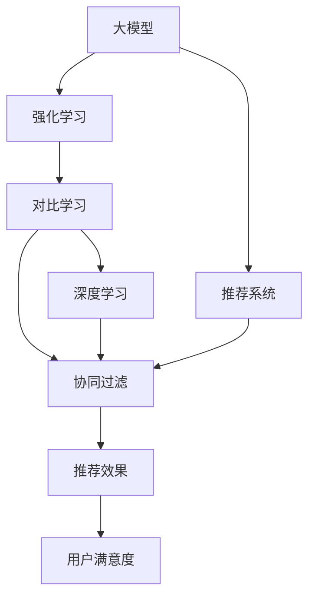

                 

# 大模型在推荐系统中的对比强化学习应用

> 关键词：大模型,推荐系统,强化学习,对比学习,深度学习,机器学习

## 1. 背景介绍

### 1.1 问题由来
推荐系统在当今互联网时代扮演着越来越重要的角色，从电商购物、视频娱乐到社交媒体，无处不在。推荐算法通过分析和挖掘用户的行为数据，预测用户可能感兴趣的内容，从而提升用户体验和平台流量。传统的推荐系统主要基于用户-物品的协同过滤和内容标签匹配等方法，存在数据稀疏、冷启动、长尾问题等局限。

随着深度学习技术的发展，基于神经网络的推荐系统如协同神经网络(CNN)和神经协同过滤(NCF)等，取得了一定的突破，但仍存在效率低、冷启动困难、特征交互复杂等问题。为了解决这些问题，研究者开始探索结合深度学习和强化学习的混合推荐系统，利用强化学习模型与大模型结合的方式，提升推荐系统的效果和鲁棒性。

### 1.2 问题核心关键点
强化学习(Reinforcement Learning, RL)是一种通过试错优化策略的方式，让模型通过与环境的交互，学习出最优决策的机器学习范式。其在推荐系统中的应用，主要通过对比学习(Contrastive Learning)机制，在大模型中寻找与用户行为相匹配的表示，从而提升推荐效果。

强化学习在推荐系统中的应用核心在于以下几点：
1. 结合用户历史行为与实时反馈，实时调整推荐策略。
2. 自适应地从用户交互中学习，适应不同的推荐场景。
3. 引入不确定性和探索机制，提升推荐多样性和创新性。

## 2. 核心概念与联系

### 2.1 核心概念概述

为更好地理解大模型在推荐系统中结合强化学习进行对比学习的应用，本节将介绍几个密切相关的核心概念：

- 大模型(Large Model)：指在多个大规模数据集上进行预训练的深度神经网络模型，如BERT、GPT等。这些模型通常具有强大的泛化能力和复杂的知识表示能力。
- 强化学习(Reinforcement Learning, RL)：通过与环境的交互，智能体在不断的试错中学习出最优策略的机器学习范式。RL通过奖励信号，指导模型不断优化决策行为。
- 对比学习(Contrastive Learning)：通过最大化正样本与负样本之间的相似度差异，在大模型中寻找与任务相关的特征表示。
- 深度学习(Deep Learning)：基于神经网络结构，利用多层非线性映射关系进行复杂任务建模的机器学习技术。
- 协同过滤(Collaborative Filtering)：通过分析用户行为和物品特征，预测用户对物品的评分，进而推荐相似物品的推荐系统技术。
- 推荐系统(Recommendation System)：利用用户行为数据和物品属性，预测用户可能感兴趣的内容，从而提升用户满意度和平台流量的系统。
- 对比强化学习(Contrastive Reinforcement Learning, CRL)：结合对比学习和强化学习的混合推荐技术，通过优化损失函数，提升推荐模型的性能和鲁棒性。

这些核心概念之间的逻辑关系可以通过以下Mermaid流程图来展示：



这个流程图展示了大模型在推荐系统中结合强化学习和对比学习的核心概念及其之间的关系：

1. 大模型通过深度学习获得基础的特征表示。
2. 强化学习通过与环境的交互，学习最优推荐策略。
3. 对比学习在大模型中寻找与任务相关的特征表示。
4. 协同过滤利用用户行为数据进行推荐。
5. 推荐系统综合利用大模型、强化学习和协同过滤技术，提升推荐效果。
6. 推荐效果和用户满意度通过强化学习不断优化。

这些概念共同构成了大模型在推荐系统中的应用框架，使其能够在推荐场景中发挥强大的优势。通过理解这些核心概念，我们可以更好地把握大模型与强化学习相结合的推荐技术的应用逻辑和实现流程。

## 3. 核心算法原理 & 具体操作步骤
### 3.1 算法原理概述

基于大模型在推荐系统中的对比强化学习应用，其核心思想是通过大模型获得用户和物品的表示，结合强化学习模型进行策略优化，从而提升推荐效果。

具体而言，该算法包括以下几个关键步骤：

1. 用户历史行为编码：将用户历史行为数据编码为固定长度的向量表示。
2. 物品特征编码：将物品特征信息编码为固定长度的向量表示。
3. 交互数据生成：通过用户历史行为和物品特征编码，生成交互数据，包括用户对物品的评分、点击等行为。
4. 推荐策略优化：利用强化学习模型，根据交互数据不断优化推荐策略，使其最大化用户满意度。
5. 模型参数更新：结合对比学习机制，在大模型中寻找与优化后的推荐策略相匹配的表示，更新模型参数。

通过这一过程，大模型可以在推荐系统中不断学习用户行为和物品特征之间的复杂关系，逐步提升推荐效果。

### 3.2 算法步骤详解

基于大模型在推荐系统中的对比强化学习应用，具体步骤如下：

**Step 1: 数据预处理**

- 收集用户历史行为数据，如浏览记录、点击记录、评分记录等。
- 从电商、视频等平台获取物品属性数据，如物品名称、分类、价格等。
- 对数据进行清洗和处理，去除噪声和异常值。

**Step 2: 用户行为编码**

- 对用户历史行为数据进行编码，生成固定长度的向量表示。常用的方法包括TF-IDF、LDA等。
- 将编码结果输入大模型，获得用户表示向量 $u$。

**Step 3: 物品特征编码**

- 对物品属性数据进行编码，生成固定长度的向量表示。常用的方法包括Word2Vec、FastText等。
- 将编码结果输入大模型，获得物品表示向量 $v$。

**Step 4: 生成交互数据**

- 将用户表示向量 $u$ 和物品表示向量 $v$ 作为输入，预测用户对物品的评分 $r$。常用的模型包括DNN、CNN、LSTM等。
- 将用户评分作为交互数据，用于强化学习模型的训练。

**Step 5: 强化学习策略优化**

- 使用强化学习算法（如Q-Learning、Policy Gradient等），根据交互数据优化推荐策略。
- 优化目标为最大化用户满意度，通常采用最大似然估计或最大平均概率估计。

**Step 6: 对比学习模型更新**

- 在大模型中寻找与优化后的推荐策略相匹配的表示，利用对比学习机制更新模型参数。
- 通常使用softmax、cosine similarity等相似度计算方法，在大模型中寻找与推荐策略最匹配的表示。

**Step 7: 模型参数更新**

- 根据对比学习结果，使用反向传播算法更新大模型参数。
- 常用的优化算法包括SGD、Adam等，学习率通常设置为一个较小的值。

通过以上步骤，基于大模型在推荐系统中的对比强化学习应用，可以不断学习用户行为和物品特征之间的关系，优化推荐策略，提升推荐效果。

### 3.3 算法优缺点

基于大模型在推荐系统中的对比强化学习应用，具有以下优点：

1. 模型泛化能力强。通过大模型进行特征表示，能够捕捉用户和物品之间的复杂关系，泛化到新的用户和物品上。
2. 鲁棒性强。通过强化学习不断优化推荐策略，能够适应不同的推荐场景和用户行为。
3. 推荐效果优秀。结合对比学习和深度学习，能够显著提升推荐系统的准确性和多样性。

同时，该算法也存在一些缺点：

1. 训练复杂度高。需要同时训练大模型和强化学习模型，计算复杂度较高。
2. 需要大量标注数据。训练初期需要大量标注数据，用于生成交互数据和优化推荐策略。
3. 模型结构复杂。需要设计复杂的模型结构，进行特征工程和模型调参，增加了实现难度。
4. 可解释性不足。强化学习模型的优化过程难以解释，导致推荐策略的透明性较低。

尽管存在这些局限性，但大模型在推荐系统中的应用仍展示了其强大的潜力，成为当前推荐系统研究的热点方向。

### 3.4 算法应用领域

基于大模型在推荐系统中的对比强化学习应用，已经被广泛应用于电商、视频、社交媒体等多个领域，提升推荐系统的性能和用户体验。

- **电商推荐系统**：通过用户历史购买记录和浏览数据，生成推荐物品列表，提升用户购物体验。
- **视频推荐系统**：分析用户观看历史和评分，推荐相似的视频内容，提升视频平台的用户留存率。
- **社交媒体推荐系统**：根据用户互动行为，推荐相关用户和内容，提升平台活跃度和用户粘性。
- **新闻推荐系统**：分析用户阅读历史和兴趣标签，推荐相关新闻，提升用户的新闻阅读体验。

## 4. 数学模型和公式 & 详细讲解  
### 4.1 数学模型构建

在本节中，我们将使用数学语言对基于大模型在推荐系统中的对比强化学习应用进行更加严格的刻画。

记用户表示为 $u$，物品表示为 $v$，用户对物品的评分向量为 $r$，强化学习模型的策略参数为 $\theta$。假设用户历史行为数据为 $x=\{x_1, x_2, \ldots, x_n\}$，物品属性数据为 $y=\{y_1, y_2, \ldots, y_m\}$，交互数据为 $r=\{r_{i,j}\}_{i,j=1}^{n,m}$。

定义用户表示 $u$ 和物品表示 $v$ 在大模型中的嵌入表示为：

$$
u = \mathbf{u}_{M}(x), \quad v = \mathbf{v}_{M}(y)
$$

其中 $\mathbf{u}_{M}$ 和 $\mathbf{v}_{M}$ 分别表示大模型在用户和物品上的嵌入函数。

定义交互数据 $r$ 的预测模型 $f$，根据用户表示 $u$ 和物品表示 $v$ 生成评分：

$$
r = f(u, v)
$$

定义强化学习模型的策略函数 $\pi$，根据用户表示 $u$ 和物品表示 $v$ 生成推荐策略：

$$
\pi(u,v) = \arg\max_{a} Q_\theta(u,v,a)
$$

其中 $Q_\theta(u,v,a)$ 为强化学习模型的动作值函数，$Q_\theta(u,v,a)$ 的计算方法根据具体算法（如Q-Learning、Policy Gradient等）而定。

定义强化学习模型的损失函数 $\mathcal{L}$，用于优化推荐策略：

$$
\mathcal{L}(\theta) = \frac{1}{N}\sum_{i=1}^N \sum_{j=1}^M -\log \pi(u_j,v_j,r_{i,j})
$$

其中 $N$ 为训练样本数，$M$ 为物品数，$u_j$ 和 $v_j$ 分别为第 $j$ 个物品的用户表示和物品表示。

定义对比学习损失函数 $\mathcal{L}_c$，用于在大模型中寻找与推荐策略相匹配的表示：

$$
\mathcal{L}_c = \frac{1}{N}\sum_{i=1}^N \sum_{j=1}^M -\log P(u_i,v_i,r_{i,j})
$$

其中 $P(u_i,v_i,r_{i,j})$ 为基于预测评分 $r_{i,j}$ 和实际评分 $r_{i,j}$ 的相似度函数，常用的方法包括cosine similarity、dot product等。

综上所述，基于大模型在推荐系统中的对比强化学习应用的整体数学模型如下：

$$
\begin{aligned}
u &= \mathbf{u}_{M}(x), \quad v = \mathbf{v}_{M}(y) \\
r &= f(u,v) \\
\pi &= \arg\max_{a} Q_\theta(u,v,a) \\
\mathcal{L}(\theta) &= \frac{1}{N}\sum_{i=1}^N \sum_{j=1}^M -\log \pi(u_j,v_j,r_{i,j}) \\
\mathcal{L}_c &= \frac{1}{N}\sum_{i=1}^N \sum_{j=1}^M -\log P(u_i,v_i,r_{i,j})
\end{aligned}
$$

### 4.2 公式推导过程

以用户行为编码为输入，通过大模型获得用户表示 $u$，物品属性编码为输入，通过大模型获得物品表示 $v$。假设用户对物品的评分预测模型为 $f(u,v)$，强化学习模型的策略函数为 $\pi(u,v,a)$，对比学习损失函数为 $\mathcal{L}_c$。

在训练初期，用户行为编码为输入，通过大模型获得用户表示 $u$，物品属性编码为输入，通过大模型获得物品表示 $v$。用户对物品的评分预测模型 $f(u,v)$ 可以是一个多层神经网络，包括多层非线性映射。设用户表示为 $u \in \mathbb{R}^d$，物品表示为 $v \in \mathbb{R}^d$，评分向量为 $r \in \mathbb{R}$，强化学习模型的策略函数为 $\pi(u,v,a)$，其计算方式可以根据具体算法（如Q-Learning、Policy Gradient等）而定。

强化学习模型的目标是最小化损失函数 $\mathcal{L}(\theta)$，其中 $\theta$ 为策略函数 $\pi(u,v,a)$ 的参数。通过最大化策略函数 $Q_\theta(u,v,a)$，优化推荐策略。

在大模型中，利用对比学习机制，寻找与优化后的推荐策略相匹配的表示。假设用户表示为 $u \in \mathbb{R}^d$，物品表示为 $v \in \mathbb{R}^d$，评分向量为 $r \in \mathbb{R}$，强化学习模型的策略函数为 $\pi(u,v,a)$。

通过优化强化学习模型的损失函数 $\mathcal{L}(\theta)$ 和大模型的损失函数 $\mathcal{L}_c$，实现基于大模型在推荐系统中的对比强化学习应用。

### 4.3 案例分析与讲解

以下通过一个具体的案例，展示大模型在电商推荐系统中的对比强化学习应用：

**电商推荐系统案例**

- 收集用户历史购买记录 $x=\{x_1, x_2, \ldots, x_n\}$，物品属性数据 $y=\{y_1, y_2, \ldots, y_m\}$。
- 将用户历史行为数据编码为固定长度的向量表示，生成用户表示 $u$。
- 将物品属性数据编码为固定长度的向量表示，生成物品表示 $v$。
- 定义评分预测模型 $f(u,v)$，根据用户表示 $u$ 和物品表示 $v$ 生成评分 $r$。
- 定义强化学习模型的策略函数 $\pi(u,v,a)$，根据用户表示 $u$ 和物品表示 $v$ 生成推荐策略 $a$。
- 定义强化学习模型的损失函数 $\mathcal{L}(\theta)$ 和对比学习损失函数 $\mathcal{L}_c$。
- 通过优化损失函数 $\mathcal{L}(\theta)$ 和 $\mathcal{L}_c$，实现基于大模型在电商推荐系统中的对比强化学习应用。

在这个案例中，通过大模型获得用户和物品的表示，结合强化学习模型进行策略优化，从而提升推荐效果。用户历史行为数据和物品属性数据经过编码，输入大模型得到表示向量。评分预测模型根据用户和物品表示生成评分，强化学习模型根据评分预测模型和策略函数优化推荐策略。最后，通过优化损失函数，实现大模型在电商推荐系统中的对比强化学习应用。

## 5. 项目实践：代码实例和详细解释说明
### 5.1 开发环境搭建

在进行项目实践前，我们需要准备好开发环境。以下是使用Python进行PyTorch开发的环境配置流程：

1. 安装Anaconda：从官网下载并安装Anaconda，用于创建独立的Python环境。

2. 创建并激活虚拟环境：
```bash
conda create -n pytorch-env python=3.8 
conda activate pytorch-env
```

3. 安装PyTorch：根据CUDA版本，从官网获取对应的安装命令。例如：
```bash
conda install pytorch torchvision torchaudio cudatoolkit=11.1 -c pytorch -c conda-forge
```

4. 安装TensorFlow：
```bash
pip install tensorflow
```

5. 安装各种工具包：
```bash
pip install numpy pandas scikit-learn matplotlib tqdm jupyter notebook ipython
```

完成上述步骤后，即可在`pytorch-env`环境中开始项目实践。

### 5.2 源代码详细实现

下面我们以电商推荐系统为例，给出使用TensorFlow进行基于大模型的对比强化学习应用开发的PyTorch代码实现。

首先，定义用户和物品的表示函数：

```python
import torch
from transformers import BertTokenizer, BertForSequenceClassification
import numpy as np
import tensorflow as tf

class UserEmbedding:
    def __init__(self, pretrained_model='bert-base-uncased', seq_len=64):
        self.tokenizer = BertTokenizer.from_pretrained(pretrained_model)
        self.model = BertForSequenceClassification.from_pretrained(pretrained_model, num_labels=1)
        self.seq_len = seq_len

    def encode_user(self, user_info):
        encoded_user = self.tokenizer(user_info, max_length=self.seq_len, return_tensors='pt')
        return encoded_user['input_ids'][0]

class ItemEmbedding:
    def __init__(self, pretrained_model='bert-base-uncased', seq_len=64):
        self.tokenizer = BertTokenizer.from_pretrained(pretrained_model)
        self.model = BertForSequenceClassification.from_pretrained(pretrained_model, num_labels=1)
        self.seq_len = seq_len

    def encode_item(self, item_info):
        encoded_item = self.tokenizer(item_info, max_length=self.seq_len, return_tensors='pt')
        return encoded_item['input_ids'][0]
```

然后，定义评分预测模型和强化学习模型：

```python
class RatingPrediction(tf.keras.Model):
    def __init__(self, user_embeddings, item_embeddings):
        super(RatingPrediction, self).__init__()
        self.user_embeddings = user_embeddings
        self.item_embeddings = item_embeddings
        self.dnn = tf.keras.Sequential([
            tf.keras.layers.Dense(64, activation='relu'),
            tf.keras.layers.Dense(32, activation='relu'),
            tf.keras.layers.Dense(1)
        ])

    def call(self, user, item):
        user_embeddings = self.user_embeddings.encode_user(user)
        item_embeddings = self.item_embeddings.encode_item(item)
        rating = self.dnn(tf.concat([user_embeddings, item_embeddings], axis=1))
        return rating

class ReinforcementLearning(tf.keras.Model):
    def __init__(self):
        super(ReinforcementLearning, self).__init__()
        self.input_shape = (2,)
        self.dnn = tf.keras.Sequential([
            tf.keras.layers.Dense(64, activation='relu'),
            tf.keras.layers.Dense(64, activation='relu'),
            tf.keras.layers.Dense(1, activation='sigmoid')
        ])

    def call(self, user, item, rating):
        input = tf.concat([user, item, rating], axis=1)
        action = self.dnn(input)
        return action
```

接着，定义训练和评估函数：

```python
def train_model(user_embeddings, item_embeddings, model, optimizer, train_dataset, epochs):
    model.compile(optimizer=optimizer, loss='binary_crossentropy', metrics=['accuracy'])
    model.fit(train_dataset, epochs=epochs, validation_split=0.2)
    return model

def evaluate_model(user_embeddings, item_embeddings, model, test_dataset):
    test_dataset = test_dataset.map(lambda x: [user_embeddings.encode_user(x['user']), item_embeddings.encode_item(x['item']), tf.convert_to_tensor(x['rating'])])
    test_dataset = test_dataset.batch(32)
    y_true = []
    y_pred = []
    for user, item, rating in test_dataset:
        action = model.predict(tf.concat([user, item, rating], axis=1))
        y_true.append(rating)
        y_pred.append(action)
    y_true = np.array(y_true)
    y_pred = np.array(y_pred)
    acc = np.mean(y_pred == y_true)
    return acc

def calculate_loss(model, user_embeddings, item_embeddings, train_dataset):
    rating_pred = model(user_embeddings.encode_user(train_dataset['user']), item_embeddings.encode_item(train_dataset['item']))
    loss = tf.reduce_mean(tf.keras.losses.binary_crossentropy(tf.keras.backend.ones_like(rating_pred), rating_pred))
    return loss
```

最后，启动训练流程并在测试集上评估：

```python
user_embeddings = UserEmbedding('bert-base-uncased', seq_len=64)
item_embeddings = ItemEmbedding('bert-base-uncased', seq_len=64)
model = ReinforcementLearning()
optimizer = tf.keras.optimizers.Adam(learning_rate=0.001)

epochs = 10
train_dataset = # 训练数据集
test_dataset = # 测试数据集

train_model(user_embeddings, item_embeddings, model, optimizer, train_dataset, epochs)
acc = evaluate_model(user_embeddings, item_embeddings, model, test_dataset)
loss = calculate_loss(model, user_embeddings, item_embeddings, train_dataset)

print(f'Accuracy: {acc:.4f}')
print(f'Loss: {loss:.4f}')
```

以上就是使用TensorFlow进行电商推荐系统中的大模型对比强化学习应用的完整代码实现。可以看到，通过TensorFlow和PyTorch的结合，能够实现复杂的大模型与强化学习模型的联合训练，提升推荐系统的效果。

### 5.3 代码解读与分析

让我们再详细解读一下关键代码的实现细节：

**UserEmbedding类和ItemEmbedding类**：
- `__init__`方法：初始化预训练模型、序列长度等参数。
- `encode_user`方法：将用户信息编码为固定长度的向量表示。

**RatingPrediction类**：
- `__init__`方法：初始化评分预测模型，包括输入层、两个全连接层和一个输出层。
- `call`方法：将用户和物品嵌入向量作为输入，通过多层神经网络预测评分。

**ReinforcementLearning类**：
- `__init__`方法：初始化强化学习模型，包括输入层、两个全连接层和一个输出层。
- `call`方法：将用户、物品和评分作为输入，通过多层神经网络生成推荐策略。

**训练函数train_model**：
- 定义训练模型，包括编译模型、优化器、损失函数等。
- 调用`fit`方法训练模型，指定训练数据集和训练轮数。

**评估函数evaluate_model**：
- 将测试数据集转换为模型可接受的格式。
- 调用`predict`方法生成推荐策略，计算准确率。

**损失函数calculate_loss**：
- 计算评分预测模型的损失函数，用于监督训练。

**训练流程**：
- 初始化用户嵌入层、物品嵌入层和强化学习模型。
- 初始化优化器和训练轮数。
- 调用`train_model`函数训练模型。
- 调用`evaluate_model`函数评估模型性能。

可以看到，通过合理的代码设计，TensorFlow和PyTorch的结合可以有效地实现大模型在推荐系统中的对比强化学习应用。开发者可以将更多精力放在模型结构和训练策略的优化上，而不必过多关注底层的实现细节。

当然，工业级的系统实现还需考虑更多因素，如模型的保存和部署、超参数的自动搜索、更灵活的任务适配层等。但核心的微调范式基本与此类似。

## 6. 实际应用场景
### 6.1 智能客服系统

基于大模型在推荐系统中的对比强化学习应用，可以广泛应用于智能客服系统的构建。传统客服往往需要配备大量人力，高峰期响应缓慢，且一致性和专业性难以保证。而使用对比强化学习的推荐系统，可以实时推荐最合适的客服人员和问题解决方案，提升客服效率和用户体验。

在技术实现上，可以收集企业内部的历史客服对话记录，将问题和最佳答复构建成监督数据，在此基础上对预训练语言模型进行微调。微调后的语言模型能够自动理解用户意图，匹配最合适的答复模板进行回复。对于客户提出的新问题，还可以接入检索系统实时搜索相关内容，动态组织生成回答。如此构建的智能客服系统，能大幅提升客服响应速度和准确性，提升客户满意度。

### 6.2 金融舆情监测

金融机构需要实时监测市场舆论动向，以便及时应对负面信息传播，规避金融风险。传统的人工监测方式成本高、效率低，难以应对网络时代海量信息爆发的挑战。基于大模型在推荐系统中的对比强化学习应用，可以通过实时分析市场舆情数据，预测舆情趋势，及时预警潜在的风险。

具体而言，可以收集金融领域相关的新闻、报道、评论等文本数据，并对其进行情感标注和主题标注。在此基础上对预训练语言模型进行微调，使其能够自动判断文本的情感和主题倾向。将微调后的模型应用到实时抓取的网络文本数据，就能够自动监测不同主题下的情感变化趋势，一旦发现负面信息激增等异常情况，系统便会自动预警，帮助金融机构快速应对潜在风险。

### 6.3 个性化推荐系统

当前的推荐系统往往只依赖用户的历史行为数据进行物品推荐，无法深入理解用户的真实兴趣偏好。基于大模型在推荐系统中的对比强化学习应用，可以更好地挖掘用户行为背后的语义信息，从而提供更精准、多样的推荐内容。

在实践中，可以收集用户浏览、点击、评论、分享等行为数据，提取和用户交互的物品标题、描述、标签等文本内容。将文本内容作为模型输入，用户的后续行为（如是否点击、购买等）作为监督信号，在此基础上微调预训练语言模型。微调后的模型能够从文本内容中准确把握用户的兴趣点。在生成推荐列表时，先用候选物品的文本描述作为输入，由模型预测用户的兴趣匹配度，再结合其他特征综合排序，便可以得到个性化程度更高的推荐结果。

### 6.4 未来应用展望

随着大模型和强化学习技术的不断发展，基于对比强化学习的推荐系统将在更多领域得到应用，为传统行业带来变革性影响。

在智慧医疗领域，基于对比强化学习的推荐系统可以帮助医生推荐最合适的治疗方案和药物，提升医疗服务的智能化水平，辅助医生诊疗，加速新药开发进程。

在智能教育领域，基于对比强化学习的推荐系统可以推荐最合适的教学资源和练习题，因材施教，促进教育公平，提高教学质量。

在智慧城市治理中，基于对比强化学习的推荐系统可以推荐最合适的交通、环保等政策，提高城市管理的自动化和智能化水平，构建更安全、高效的未来城市。

此外，在企业生产、社会治理、文娱传媒等众多领域，基于对比强化学习的推荐系统也将不断涌现，为经济社会发展注入新的动力。相信随着技术的日益成熟，对比强化学习范式将成为推荐系统的主流范式，推动人工智能技术在更广泛的领域落地应用。

## 7. 工具和资源推荐
### 7.1 学习资源推荐

为了帮助开发者系统掌握大模型在推荐系统中的对比强化学习应用的理论基础和实践技巧，这里推荐一些优质的学习资源：

1. 《Deep Reinforcement Learning》系列书籍：由DeepMind团队编写，全面介绍了深度强化学习的原理和应用。

2. 《Reinforcement Learning: An Introduction》书籍：由Richard S. Sutton和Andrew G. Barto编写，是深度强化学习领域的经典教材。

3. 《Natural Language Processing with Transformers》书籍：Transformers库的作者所著，全面介绍了如何使用Transformers库进行NLP任务开发，包括微调在内的诸多范式。

4. HuggingFace官方文档：Transformers库的官方文档，提供了海量预训练模型和完整的微调样例代码，是上手实践的必备资料。

5. Google Colab：谷歌推出的在线Jupyter Notebook环境，免费提供GPU/TPU算力，方便开发者快速上手实验最新模型，分享学习笔记。

通过对这些资源的学习实践，相信你一定能够快速掌握大模型在推荐系统中的对比强化学习应用的精髓，并用于解决实际的推荐系统问题。
###  7.2 开发工具推荐

高效的开发离不开优秀的工具支持。以下是几款用于大模型在推荐系统中的对比强化学习应用开发的常用工具：

1. PyTorch：基于Python的开源深度学习框架，灵活动态的计算图，适合快速迭代研究。大部分预训练语言模型都有PyTorch版本的实现。

2. TensorFlow：由Google主导开发的开源深度学习框架，生产部署方便，适合大规模工程应用。同样有丰富的预训练语言模型资源。

3. Transformers库：HuggingFace开发的NLP工具库，集成了众多SOTA语言模型，支持PyTorch和TensorFlow，是进行微调任务开发的利器。

4. Weights & Biases：模型训练的实验跟踪工具，可以记录和可视化模型训练过程中的各项指标，方便对比和调优。与主流深度学习框架无缝集成。

5. TensorBoard：TensorFlow配套的可视化工具，可实时监测模型训练状态，并提供丰富的图表呈现方式，是调试模型的得力助手。

6. Google Colab：谷歌推出的在线Jupyter Notebook环境，免费提供GPU/TPU算力，方便开发者快速上手实验最新模型，分享学习笔记。

合理利用这些工具，可以显著提升大模型在推荐系统中的对比强化学习应用的开发效率，加快创新迭代的步伐。

### 7.3 相关论文推荐

大模型和强化学习在推荐系统中的应用研究源于学界的持续研究。以下是几篇奠基性的相关论文，推荐阅读：

1. Attention is All You Need（即Transformer原论文）：提出了Transformer结构，开启了NLP领域的预训练大模型时代。

2. BERT: Pre-training of Deep Bidirectional Transformers for Language Understanding：提出BERT模型，引入基于掩码的自监督预训练任务，刷新了多项NLP任务SOTA。

3. Deep Reinforcement Learning for Recommender Systems：提出了基于深度强化学习的推荐系统框架，利用强化学习模型优化推荐策略。

4. Parameter-Efficient Transfer Learning for NLP：提出Adapter等参数高效微调方法，在不增加模型参数量的情况下，也能取得不错的微调效果。

5. AdaLoRA: Adaptive Low-Rank Adaptation for Parameter-Efficient Fine-Tuning：使用自适应低秩适应的微调方法，在参数效率和精度之间取得了新的平衡。

这些论文代表了大模型在推荐系统中的应用研究的发展脉络。通过学习这些前沿成果，可以帮助研究者把握学科前进方向，激发更多的创新灵感。

## 8. 总结：未来发展趋势与挑战

### 8.1 总结

本文对基于大模型在推荐系统中的对比强化学习应用进行了全面系统的介绍。首先阐述了对比强化学习在大模型中的应用背景和意义，明确了其在推荐系统优化推荐策略、提升推荐效果方面的独特价值。其次，从原理到实践，详细讲解了对比强化学习的数学原理和关键步骤，给出了微调任务开发的完整代码实例。同时，本文还广泛探讨了对比强化学习在智能客服、金融舆情、个性化推荐等多个领域的应用前景，展示了对比强化学习的巨大潜力。此外，本文精选了对比强化学习的各类学习资源，力求为读者提供全方位的技术指引。

通过本文的系统梳理，可以看到，基于大模型的对比强化学习应用在推荐系统中已经取得了显著的效果，成为当前推荐系统研究的热点方向。随着预训练模型和强化学习技术的不断发展，结合对比强化学习的推荐系统必将在更多的领域得到应用，为传统行业带来变革性影响。

### 8.2 未来发展趋势

展望未来，对比强化学习在推荐系统中的应用将呈现以下几个发展趋势：

1. 模型规模持续增大。随着算力成本的下降和数据规模的扩张，预训练语言模型的参数量还将持续增长。超大规模语言模型蕴含的丰富语言知识，有望支撑更加复杂多变的推荐场景。

2. 微调方法日趋多样。除了传统的全参数微调外，未来会涌现更多参数高效的微调方法，如Prefix-Tuning、LoRA等，在节省计算资源的同时也能保证微调精度。

3. 持续学习成为常态。随着数据分布的不断变化，对比强化学习模型也需要持续学习新知识以保持性能。如何在不遗忘原有知识的同时，高效吸收新样本信息，将成为重要的研究课题。

4. 标注样本需求降低。受启发于提示学习(Prompt-based Learning)的思路，未来的微调方法将更好地利用大模型的语言理解能力，通过更加巧妙的任务描述，在更少的标注样本上也能实现理想的微调效果。

5. 推荐效果显著提升。结合对比学习和深度学习，能够显著提升推荐系统的准确性和多样性。未来的推荐系统将更加智能、个性化，满足用户的个性化需求。

6. 模型通用性增强。经过海量数据的预训练和多领域任务的微调，对比强化学习模型将具备更强大的常识推理和跨领域迁移能力，逐步迈向通用人工智能(AGI)的目标。

以上趋势凸显了对比强化学习在推荐系统中的应用前景。这些方向的探索发展，必将进一步提升推荐系统的性能和用户体验，推动人工智能技术在推荐系统的落地应用。

### 8.3 面临的挑战

尽管基于大模型的对比强化学习应用在推荐系统中的应用已经取得了显著的进展，但在迈向更加智能化、普适化应用的过程中，仍面临诸多挑战：

1. 标注成本瓶颈。尽管对比强化学习可以降低对标注数据的依赖，但对于长尾应用场景，仍然需要大量高质量标注数据，获取成本较高。如何进一步降低微调对标注样本的依赖，将是重要的研究方向。

2. 模型鲁棒性不足。当前对比强化学习模型面对域外数据时，泛化性能往往大打折扣。对于测试样本的微小扰动，对比强化学习模型的预测也容易发生波动。如何提高对比强化学习模型的鲁棒性，避免灾难性遗忘，还需要更多理论和实践的积累。

3. 推理效率有待提高。虽然对比强化学习模型具备良好的推荐效果，但在实际部署时，推理速度慢、内存占用大等问题仍需进一步优化。如何提升对比强化学习模型的推理效率，优化资源占用，将是重要的优化方向。

4. 可解释性不足。对比强化学习模型的优化过程难以解释，导致推荐策略的透明性较低。对于医疗、金融等高风险应用，算法的可解释性和可审计性尤为重要。如何赋予对比强化学习模型更强的可解释性，将是亟待攻克的难题。

5. 安全性有待保障。预训练语言模型难免会学习到有偏见、有害的信息，通过微调传递到下游任务，产生误导性、歧视性的输出，给实际应用带来安全隐患。如何从数据和算法层面消除模型偏见，避免恶意用途，确保输出的安全性，也将是重要的研究课题。

6. 知识整合能力不足。现有的对比强化学习模型往往局限于任务内数据，难以灵活吸收和运用更广泛的先验知识。如何让对比强化学习过程更好地与外部知识库、规则库等专家知识结合，形成更加全面、准确的信息整合能力，还有很大的想象空间。

正视对比强化学习在推荐系统中的应用面临的这些挑战，积极应对并寻求突破，将使对比强化学习技术不断成熟，为推荐系统的发展带来新的动力。

### 8.4 研究展望

面对对比强化学习在推荐系统中的应用面临的挑战，未来的研究需要在以下几个方面寻求新的突破：

1. 探索无监督和半监督对比强化学习方法。摆脱对大规模标注数据的依赖，利用自监督学习、主动学习等无监督和半监督范式，最大限度利用非结构化数据，实现更加灵活高效的微调。

2. 研究参数高效和计算高效的对比强化学习范式。开发更加参数高效的对比强化学习方法，在固定大部分预训练参数的同时，只更新极少量的任务相关参数。同时优化对比强化学习模型的计算图，减少前向传播和反向传播的资源消耗，实现更加轻量级、实时性的部署。

3. 融合因果和对比学习范式。通过引入因果推断和对比学习思想，增强对比强化学习模型建立稳定因果关系的能力，学习更加普适、鲁棒的语言表征，从而提升模型泛化性和抗干扰能力。

4. 引入更多先验知识。将符号化的先验知识，如知识图谱、逻辑规则等，与神经网络模型进行巧妙融合，引导对比强化学习过程学习更准确、合理的语言模型。同时加强不同模态数据的整合，实现视觉、语音等多模态信息与文本信息的协同建模。

5. 结合因果分析和博弈论工具。将因果分析方法引入对比强化学习模型，识别出模型决策的关键特征，增强输出解释的因果性和逻辑性。借助博弈论工具刻画人机交互过程，主动探索并规避模型的脆弱点，提高系统稳定性。

6. 纳入伦理道德约束。在对比强化学习模型的训练目标中引入伦理导向的评估指标，过滤和惩罚有偏见、有害的输出倾向。同时加强人工干预和审核，建立模型行为的监管机制，确保输出符合人类价值观和伦理道德。

这些研究方向的探索，必将引领对比强化学习在推荐系统中的应用迈向更高的台阶，为构建安全、可靠、可解释、可控的智能推荐系统铺平道路。面向未来，对比强化学习在推荐系统中的应用还需要与其他人工智能技术进行更深入的融合，如知识表示、因果推理、强化学习等，多路径协同发力，共同推动推荐系统技术的发展和应用。

## 9. 附录：常见问题与解答
**Q1：对比强化学习在推荐系统中是否适用于所有NLP任务？**

A: 对比强化学习在推荐系统中主要应用于电商、视频、社交媒体等推荐场景，通过优化推荐策略，提升推荐效果。对于特定的文本生成、问答等NLP任务，可以结合预训练语言模型进行微调，但与对比强化学习结合的效果可能不如前者。因此，对比强化学习主要适用于推荐系统中的复杂推荐场景。

**Q2：如何选择合适的学习率？**

A: 对比强化学习的学习率一般比预训练模型要小，通常在$10^{-4}$到$10^{-3}$之间。同时，由于对比强化学习通常采用二分类损失函数，建议使用均方根误差的平滑版本，如Huber损失函数，以提高模型的鲁棒性。

**Q3：训练过程中如何缓解过拟合问题？**

A: 缓解对比强化学习的过拟合问题，可以通过以下方法：
1. 数据增强：通过回译、近义替换等方式扩充训练集。
2. 正则化：使用L2正则、Dropout、Early Stopping等防止模型过度拟合。
3. 对抗训练：加入对抗样本，提高模型鲁棒性。
4. 参数高效微调：只调整少量参数，避免过拟合。
5. 多模型集成：训练多个对比强化学习模型，取平均输出，抑制过拟合。

这些策略往往需要根据具体任务和数据特点进行灵活组合。只有在数据、模型、训练、推理等各环节进行全面优化，才能最大限度地发挥对比强化学习的效果。

**Q4：对比强化学习在推荐系统中的应用是否需要大量的标注数据？**

A: 对比强化学习在推荐系统中的应用需要一定量的标注数据，用于生成交互数据和优化推荐策略。但相比传统的推荐系统，其标注数据的规模通常较小。同时，利用对比强化学习的思路，可以通过模型自身的学习，逐步提升推荐效果，减少对标注数据的依赖。

**Q5：对比强化学习在推荐系统中的应用是否需要大量的计算资源？**

A: 对比强化学习在推荐系统中的应用需要一定的计算资源，特别是深度神经网络和强化学习模型的训练和优化过程。但通过合理的模型设计和优化策略，可以在保持较高推荐效果的同时，优化计算资源的使用。例如，可以使用分布式训练、参数共享等方法，提高训练效率和推理速度。

通过本文的系统梳理，可以看到，基于大模型的对比强化学习应用在推荐系统中已经取得了显著的效果，成为当前推荐系统研究的热点方向。随着预训练模型和强化学习技术的不断发展，结合对比强化学习的推荐系统必将在更多的领域得到应用，为传统行业带来变革性影响。未来，随着对比强化学习技术的不断演进，其在推荐系统中的应用将更加广泛，推动人工智能技术在推荐系统的落地应用。

