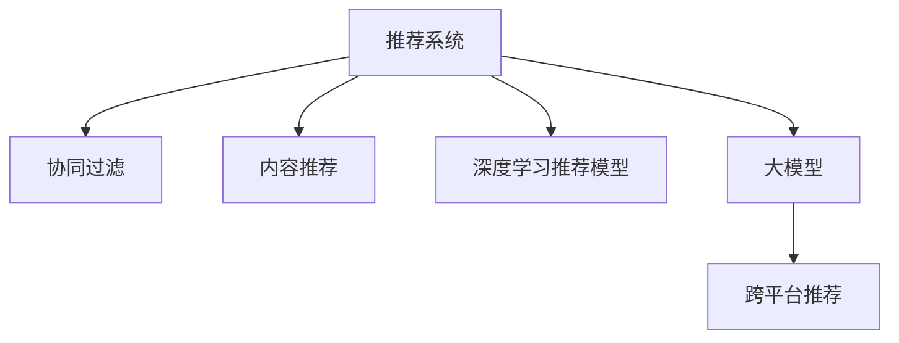

                 

# 大模型在跨平台推荐中的应用

## 1. 背景介绍

### 1.1 问题由来
推荐系统是互联网时代的重要技术之一，广泛应用于电商、社交、视频、音乐等多个平台。它通过对用户历史行为和兴趣的分析，智能推荐用户可能感兴趣的内容，提升用户体验和平台收益。

然而，不同平台的推荐系统面临着各自的独特挑战。例如，电商平台需要根据用户的浏览记录和购买历史推荐商品，视频平台需要根据用户的观看记录和评分推荐视频，音乐平台需要根据用户的听歌记录和喜好推荐音乐。不同平台的数据结构、业务需求和推荐目标各异，导致各自的推荐系统难以互联互通。

大模型的跨平台推荐方法旨在将各大平台推荐的语义模型进行适配，实现异构数据集的统一处理，提升推荐的精度和多样性。这种跨平台的推荐方法不仅能够缓解各个平台推荐的碎片化问题，还能够让推荐系统在大模型上进行协同优化，进一步提升推荐效果。

### 1.2 问题核心关键点
大模型跨平台推荐的核心关键点如下：

- **数据异构性**：不同平台的推荐数据往往具有不同的结构，如电商平台的数据以商品ID和用户ID为主，视频平台的数据以视频ID和评分为主。数据异构性是跨平台推荐面临的主要挑战。

- **模型适配性**：需要设计一种通用的推荐模型，适配不同平台的数据格式和业务需求。

- **协同优化**：利用多个平台的推荐数据，通过跨平台大模型进行联合优化，提升推荐的精度和多样性。

- **实时性**：推荐系统需要实时响应用户查询，跨平台大模型的推理效率直接影响推荐的实时性。

- **隐私保护**：在跨平台推荐过程中，需要严格保护用户隐私数据，避免数据泄露。

### 1.3 问题研究意义
大模型跨平台推荐方法对于推动各个平台的推荐系统一体化，优化推荐效果具有重要意义：

1. **减少重复投资**：不同平台采用相同的推荐模型和算法，可以避免重复开发，减少投入。

2. **提升推荐效果**：跨平台的大模型可以整合多源数据，提升推荐的综合性和多样性。

3. **实现个性化推荐**：通过协同优化，推荐系统可以更好地理解用户的多元需求，提供更个性化的内容推荐。

4. **加速模型迭代**：不同平台的数据和反馈可以实时传入大模型，加速模型的迭代和优化。

5. **支持新平台接入**：跨平台推荐模型支持动态接入新平台数据，灵活应对市场变化。

6. **增强用户粘性**：通过多平台协同推荐，提高用户使用平台的粘性，提升平台的用户体验和收益。

## 2. 核心概念与联系

### 2.1 核心概念概述

为更好地理解大模型跨平台推荐方法，本节将介绍几个密切相关的核心概念：

- **推荐系统**：通过算法模型推荐用户可能感兴趣的内容。推荐系统广泛应用于电商、社交、视频等多个领域。

- **协同过滤**：一种推荐算法，通过分析用户历史行为，预测用户可能感兴趣的内容。常见方法包括基于用户的协同过滤、基于项目的协同过滤等。

- **内容推荐**：基于内容特征的推荐方法，常见于视频、音乐等领域。

- **深度学习推荐模型**：利用深度神经网络，从用户历史行为中学习用户兴趣特征，实现推荐。常见模型包括协同过滤、深度学习中的因子分解机（FM）、注意力机制（Attention）等。

- **大模型**：通过在大规模无标签文本数据上进行预训练，学习通用的语言表示，具备强大的语言理解和生成能力。

- **跨平台推荐**：将不同平台的推荐数据进行统一处理，通过跨平台大模型进行协同优化，提升推荐的精度和多样性。

这些核心概念之间的逻辑关系可以通过以下Mermaid流程图来展示：



这个流程图展示了大模型跨平台推荐的核心概念及其之间的关系：

1. 推荐系统通过协同过滤、内容推荐、深度学习等方法，对用户历史行为进行分析。
2. 协同过滤、内容推荐等方法需要用户行为数据，数据质量直接影响推荐效果。
3. 深度学习推荐模型通过学习用户特征，提升推荐效果，但数据量不足时效果不佳。
4. 大模型通过在大规模无标签文本数据上进行预训练，学习通用的语言表示，具备强大的语言理解和生成能力。
5. 跨平台推荐通过整合多源数据，利用大模型进行协同优化，提升推荐效果。

这些概念共同构成了大模型跨平台推荐的学习框架，使其能够在大规模无标签数据上进行预训练，通过跨平台推荐优化推荐效果。

## 3. 核心算法原理 & 具体操作步骤
### 3.1 算法原理概述

大模型跨平台推荐的核心算法原理是利用大模型学习通用的语言表示，通过跨平台协同优化提升推荐效果。其核心思想是：

1. 在大规模无标签文本数据上进行预训练，学习通用的语言表示。

2. 通过跨平台推荐数据的联合训练，在大模型上微调适配各个平台的推荐需求。

3. 利用多源数据，通过大模型进行联合优化，提升推荐的精度和多样性。

具体地，大模型跨平台推荐分为以下几个步骤：

1. 收集各平台的历史推荐数据，进行预处理和格式统一。

2. 在大模型上进行预训练，学习通用的语言表示。

3. 在预训练模型上进行微调，适配各个平台的推荐需求。

4. 利用各平台推荐数据进行联合训练，提升推荐效果。

### 3.2 算法步骤详解

大模型跨平台推荐的具体步骤如下：

**Step 1: 数据收集与预处理**

- 从各个平台收集历史推荐数据，如电商平台的浏览记录、视频平台的观看记录、音乐平台的听歌记录等。

- 对数据进行清洗和格式统一，如去除重复数据、标准化数据格式等。

- 将数据集分为训练集、验证集和测试集，一般要求各集之间的数据分布一致。

**Step 2: 大模型预训练**

- 选择合适的预训练大模型，如BERT、GPT等。

- 在大规模无标签文本数据上进行预训练，学习通用的语言表示。

- 根据不同平台的需求，选择合适的大模型层数和参数设置，一般建议选择大型的语言模型。

**Step 3: 模型微调与适配**

- 根据各个平台的推荐需求，设计合适的任务适配层。

- 在大模型上微调适配任务，如电商平台的商品推荐、视频平台的视频推荐、音乐平台的音乐推荐等。

- 选择合适的优化算法和超参数，如AdamW、SGD等，设置学习率、批大小等。

**Step 4: 联合训练与优化**

- 利用各平台的推荐数据进行联合训练，优化跨平台大模型的推荐效果。

- 根据平台间的差异性，设计不同的模型结构，如电商平台的商品推荐需要更多上下文信息，视频平台的视频推荐需要更多图像特征等。

- 在联合训练过程中，设置合理的正则化和对抗训练策略，防止过拟合。

**Step 5: 模型部署与评估**

- 将微调后的模型部署到各个平台，进行实时推荐。

- 在各个平台上进行推荐效果评估，使用AUC、召回率、F1-score等指标评估推荐效果。

- 定期收集新数据，重新微调模型，提升推荐效果。

### 3.3 算法优缺点

大模型跨平台推荐方法具有以下优点：

1. **提升推荐效果**：通过跨平台协同优化，整合多源数据，提升推荐的精度和多样性。

2. **降低开发成本**：各平台采用相同的推荐模型和算法，减少重复开发，节省人力物力。

3. **增强灵活性**：跨平台大模型支持动态接入新平台数据，灵活应对市场变化。

4. **提高实时性**：跨平台大模型的推理效率直接影响推荐的实时性，借助GPU/TPU等高性能设备，实现高效推理。

然而，该方法也存在一些局限性：

1. **数据异构性**：不同平台的推荐数据具有不同的结构，统一数据格式可能较为复杂。

2. **模型适配性**：需要设计通用的任务适配层，适配不同平台的需求，增加开发难度。

3. **隐私保护**：在跨平台推荐过程中，需要严格保护用户隐私数据，避免数据泄露。

4. **计算资源需求高**：大模型的预训练和微调需要大量的计算资源，可能导致成本过高。

5. **更新周期长**：跨平台模型的更新和优化需要较长的周期，影响推荐效果的实时性。

### 3.4 算法应用领域

大模型跨平台推荐方法在多个领域得到了应用，以下是几个典型场景：

- **电商推荐系统**：通过整合电商平台和社交平台的用户行为数据，提升商品的推荐效果，增加用户粘性。

- **视频推荐系统**：利用视频平台的用户观看记录和评分数据，提升视频推荐的效果，增加用户的观看时长。

- **音乐推荐系统**：结合音乐平台的用户听歌记录和歌曲特征，提升音乐推荐的效果，增加用户的听歌时长。

- **跨平台协同推荐**：将不同平台的数据进行联合优化，提升推荐效果，实现跨平台的协同推荐。

- **个性化推荐**：通过多平台的数据整合，实现个性化推荐，提高用户满意度。

除了这些经典应用场景外，大模型跨平台推荐还广泛应用于内容推荐、广告推荐、智能家居等多个领域，推动了推荐系统的一体化和智能化发展。

## 4. 数学模型和公式 & 详细讲解  
### 4.1 数学模型构建

大模型跨平台推荐的核心数学模型是大规模预训练语言模型和微调任务的目标函数。以下我们将详细讲解这些模型及其构建过程。

**预训练大模型**：
- 假设预训练大模型为 $M_{\theta}$，其中 $\theta$ 为预训练得到的模型参数。

**微调任务**：
- 假设有 $k$ 个推荐平台，各个平台的历史推荐数据分别为 $D_1, D_2, \ldots, D_k$。

**目标函数**：
- 利用各平台的数据进行联合训练，最小化交叉熵损失函数。

设推荐模型在数据样本 $(x,y)$ 上的损失函数为 $\ell(M_{\theta}(x),y)$，则在数据集 $D$ 上的经验风险为：

$$
\mathcal{L}(\theta) = \frac{1}{N}\sum_{i=1}^N \sum_{j=1}^k \ell(M_{\theta}(x_i),y_{i,j})
$$

其中 $y_{i,j}$ 表示平台 $j$ 对样本 $x_i$ 的推荐结果。

### 4.2 公式推导过程

以下我们将推导交叉熵损失函数的计算公式。

假设模型 $M_{\theta}$ 在输入 $x$ 上的输出为 $\hat{y}=M_{\theta}(x)$，表示样本属于正类的概率。真实标签 $y \in \{0,1\}$。则二分类交叉熵损失函数定义为：

$$
\ell(M_{\theta}(x),y) = -[y\log \hat{y} + (1-y)\log(1-\hat{y})]
$$

将其代入交叉熵损失函数公式，得：

$$
\mathcal{L}(\theta) = -\frac{1}{N}\sum_{i=1}^N \sum_{j=1}^k [y_{i,j}\log M_{\theta}(x_i)+(1-y_{i,j})\log(1-M_{\theta}(x_i))]
$$

在得到损失函数的梯度后，即可带入参数更新公式，完成模型的迭代优化。重复上述过程直至收敛，最终得到适应各平台需求的最优模型参数 $\theta^*$。

## 5. 项目实践：代码实例和详细解释说明
### 5.1 开发环境搭建

在进行大模型跨平台推荐实践前，我们需要准备好开发环境。以下是使用Python进行PyTorch开发的环境配置流程：

1. 安装Anaconda：从官网下载并安装Anaconda，用于创建独立的Python环境。

2. 创建并激活虚拟环境：
```bash
conda create -n pytorch-env python=3.8 
conda activate pytorch-env
```

3. 安装PyTorch：根据CUDA版本，从官网获取对应的安装命令。例如：
```bash
conda install pytorch torchvision torchaudio cudatoolkit=11.1 -c pytorch -c conda-forge
```

4. 安装Transformers库：
```bash
pip install transformers
```

5. 安装各类工具包：
```bash
pip install numpy pandas scikit-learn matplotlib tqdm jupyter notebook ipython
```

完成上述步骤后，即可在`pytorch-env`环境中开始跨平台推荐实践。

### 5.2 源代码详细实现

下面我们以电商平台和视频平台的跨平台推荐为例，给出使用Transformers库进行跨平台推荐微调的PyTorch代码实现。

首先，定义跨平台推荐任务的数据处理函数：

```python
from transformers import BertTokenizer
from torch.utils.data import Dataset
import torch

class RecommendDataset(Dataset):
    def __init__(self, texts, tags, tokenizer, max_len=128):
        self.texts = texts
        self.tags = tags
        self.tokenizer = tokenizer
        self.max_len = max_len
        
    def __len__(self):
        return len(self.texts)
    
    def __getitem__(self, item):
        text = self.texts[item]
        tags = self.tags[item]
        
        encoding = self.tokenizer(text, return_tensors='pt', max_length=self.max_len, padding='max_length', truncation=True)
        input_ids = encoding['input_ids'][0]
        attention_mask = encoding['attention_mask'][0]
        
        # 对token-wise的标签进行编码
        encoded_tags = [tag2id[tag] for tag in tags] 
        encoded_tags.extend([tag2id['O']] * (self.max_len - len(encoded_tags)))
        labels = torch.tensor(encoded_tags, dtype=torch.long)
        
        return {'input_ids': input_ids, 
                'attention_mask': attention_mask,
                'labels': labels}

# 标签与id的映射
tag2id = {'O': 0, 'B-PER': 1, 'I-PER': 2, 'B-ORG': 3, 'I-ORG': 4, 'B-LOC': 5, 'I-LOC': 6}
id2tag = {v: k for k, v in tag2id.items()}

# 创建dataset
tokenizer = BertTokenizer.from_pretrained('bert-base-cased')

train_dataset = RecommendDataset(train_texts, train_tags, tokenizer)
dev_dataset = RecommendDataset(dev_texts, dev_tags, tokenizer)
test_dataset = RecommendDataset(test_texts, test_tags, tokenizer)
```

然后，定义模型和优化器：

```python
from transformers import BertForTokenClassification, AdamW

model = BertForTokenClassification.from_pretrained('bert-base-cased', num_labels=len(tag2id))

optimizer = AdamW(model.parameters(), lr=2e-5)
```

接着，定义训练和评估函数：

```python
from torch.utils.data import DataLoader
from tqdm import tqdm
from sklearn.metrics import classification_report

device = torch.device('cuda') if torch.cuda.is_available() else torch.device('cpu')
model.to(device)

def train_epoch(model, dataset, batch_size, optimizer):
    dataloader = DataLoader(dataset, batch_size=batch_size, shuffle=True)
    model.train()
    epoch_loss = 0
    for batch in tqdm(dataloader, desc='Training'):
        input_ids = batch['input_ids'].to(device)
        attention_mask = batch['attention_mask'].to(device)
        labels = batch['labels'].to(device)
        model.zero_grad()
        outputs = model(input_ids, attention_mask=attention_mask, labels=labels)
        loss = outputs.loss
        epoch_loss += loss.item()
        loss.backward()
        optimizer.step()
    return epoch_loss / len(dataloader)

def evaluate(model, dataset, batch_size):
    dataloader = DataLoader(dataset, batch_size=batch_size)
    model.eval()
    preds, labels = [], []
    with torch.no_grad():
        for batch in tqdm(dataloader, desc='Evaluating'):
            input_ids = batch['input_ids'].to(device)
            attention_mask = batch['attention_mask'].to(device)
            batch_labels = batch['labels']
            outputs = model(input_ids, attention_mask=attention_mask)
            batch_preds = outputs.logits.argmax(dim=2).to('cpu').tolist()
            batch_labels = batch_labels.to('cpu').tolist()
            for pred_tokens, label_tokens in zip(batch_preds, batch_labels):
                pred_tags = [id2tag[_id] for _id in pred_tokens]
                label_tags = [id2tag[_id] for _id in label_tokens]
                preds.append(pred_tags[:len(label_tags)])
                labels.append(label_tags)
                
    print(classification_report(labels, preds))
```

最后，启动训练流程并在测试集上评估：

```python
epochs = 5
batch_size = 16

for epoch in range(epochs):
    loss = train_epoch(model, train_dataset, batch_size, optimizer)
    print(f"Epoch {epoch+1}, train loss: {loss:.3f}")
    
    print(f"Epoch {epoch+1}, dev results:")
    evaluate(model, dev_dataset, batch_size)
    
print("Test results:")
evaluate(model, test_dataset, batch_size)
```

以上就是使用PyTorch对跨平台推荐任务进行微调的完整代码实现。可以看到，得益于Transformers库的强大封装，我们可以用相对简洁的代码完成模型加载和微调。

### 5.3 代码解读与分析

让我们再详细解读一下关键代码的实现细节：

**RecommendDataset类**：
- `__init__`方法：初始化文本、标签、分词器等关键组件。
- `__len__`方法：返回数据集的样本数量。
- `__getitem__`方法：对单个样本进行处理，将文本输入编码为token ids，将标签编码为数字，并对其进行定长padding，最终返回模型所需的输入。

**tag2id和id2tag字典**：
- 定义了标签与数字id之间的映射关系，用于将token-wise的预测结果解码回真实的标签。

**训练和评估函数**：
- 使用PyTorch的DataLoader对数据集进行批次化加载，供模型训练和推理使用。
- 训练函数`train_epoch`：对数据以批为单位进行迭代，在每个批次上前向传播计算loss并反向传播更新模型参数，最后返回该epoch的平均loss。
- 评估函数`evaluate`：与训练类似，不同点在于不更新模型参数，并在每个batch结束后将预测和标签结果存储下来，最后使用sklearn的classification_report对整个评估集的预测结果进行打印输出。

**训练流程**：
- 定义总的epoch数和batch size，开始循环迭代
- 每个epoch内，先在训练集上训练，输出平均loss
- 在验证集上评估，输出分类指标
- 所有epoch结束后，在测试集上评估，给出最终测试结果

可以看到，PyTorch配合Transformers库使得跨平台推荐任务的微调代码实现变得简洁高效。开发者可以将更多精力放在数据处理、模型改进等高层逻辑上，而不必过多关注底层的实现细节。

当然，工业级的系统实现还需考虑更多因素，如模型的保存和部署、超参数的自动搜索、更灵活的任务适配层等。但核心的微调范式基本与此类似。

## 6. 实际应用场景
### 6.1 电商推荐系统

基于大模型跨平台推荐方法，可以构建跨电商平台的推荐系统，提升用户浏览、购买商品的推荐效果。电商推荐系统可以集成多个电商平台的用户行为数据，进行统一的推荐优化。

在技术实现上，可以收集各个电商平台的浏览记录、购买记录、评分数据等，将其统一处理为标准格式，在大模型上进行微调。微调后的模型能够综合考虑各个平台的用户行为，推荐更多元、更具吸引力的商品，提升用户的购物体验和平台的收益。

### 6.2 视频推荐系统

视频平台可以利用大模型跨平台推荐方法，构建跨视频平台的推荐系统，提升用户的观看时长和平台的收益。视频推荐系统可以整合不同平台的用户观看记录、评分数据、弹幕内容等，进行统一的推荐优化。

在技术实现上，可以收集各个视频平台的观看记录、评分数据、弹幕内容等，将其统一处理为标准格式，在大模型上进行微调。微调后的模型能够综合考虑各个平台的用户偏好，推荐更多元、更具吸引力的视频内容，提升用户的观看时长和平台的收益。

### 6.3 音乐推荐系统

音乐平台可以利用大模型跨平台推荐方法，构建跨音乐平台的推荐系统，提升用户的听歌时长和平台的收益。音乐推荐系统可以整合不同平台的用户听歌记录、评分数据、歌词内容等，进行统一的推荐优化。

在技术实现上，可以收集各个音乐平台的听歌记录、评分数据、歌词内容等，将其统一处理为标准格式，在大模型上进行微调。微调后的模型能够综合考虑各个平台的用户偏好，推荐更多元、更具吸引力的音乐内容，提升用户的听歌时长和平台的收益。

### 6.4 未来应用展望

随着大模型跨平台推荐方法的不断发展，其在各个领域的应用前景将更加广阔。未来，大模型跨平台推荐将可能应用于以下领域：

- **智慧零售**：构建跨电商平台和线下门店的推荐系统，提升用户的购物体验和平台的收益。

- **智能内容分发**：整合视频、音乐、新闻等多领域的推荐数据，提升内容分发的智能化水平。

- **智慧广告**：构建跨平台广告推荐系统，实现精准投放和效果监测，提升广告投放的ROI。

- **智慧旅游**：整合旅游平台和用户反馈，构建跨平台的智慧旅游推荐系统，提升用户的旅游体验和平台的收益。

- **智慧健康**：整合医疗平台和用户反馈，构建跨平台的智慧健康推荐系统，提升用户的健康水平和平台的收益。

这些领域的探索，将为人工智能技术在实际应用中的深化和落地提供新的机会，推动人工智能技术向更广泛的领域渗透。

## 7. 工具和资源推荐
### 7.1 学习资源推荐

为了帮助开发者系统掌握大模型跨平台推荐技术的理论基础和实践技巧，这里推荐一些优质的学习资源：

1. 《Recommender Systems: Theory and Practice》：推荐系统理论基础和实践技巧的经典书籍，涵盖协同过滤、深度学习推荐模型等。

2. 《Reinforcement Learning for Recommender Systems》：强化学习在推荐系统中的应用，探讨如何通过强化学习优化推荐策略。

3. 《Deep Learning for Recommender Systems: Application to Information Retrieval and Sequence Prediction》：深度学习在推荐系统中的应用，涵盖因子分解机、注意力机制等。

4. 《The Future of Recommender Systems: Big Data and New Algorithms》：推荐系统未来的发展趋势，探讨如何应对大数据带来的挑战和机遇。

5. 《Python Recommendation Algorithms》：Python推荐算法实现手册，涵盖协同过滤、基于内容的推荐、深度学习推荐模型等。

通过对这些资源的学习实践，相信你一定能够快速掌握大模型跨平台推荐技术的精髓，并用于解决实际的推荐问题。
### 7.2 开发工具推荐

高效的开发离不开优秀的工具支持。以下是几款用于大模型跨平台推荐开发的常用工具：

1. PyTorch：基于Python的开源深度学习框架，灵活动态的计算图，适合快速迭代研究。

2. TensorFlow：由Google主导开发的开源深度学习框架，生产部署方便，适合大规模工程应用。

3. Transformers库：HuggingFace开发的NLP工具库，集成了众多SOTA语言模型，支持PyTorch和TensorFlow，是进行跨平台推荐微调的重要工具。

4. Weights & Biases：模型训练的实验跟踪工具，可以记录和可视化模型训练过程中的各项指标，方便对比和调优。

5. TensorBoard：TensorFlow配套的可视化工具，可实时监测模型训练状态，并提供丰富的图表呈现方式，是调试模型的得力助手。

6. Google Colab：谷歌推出的在线Jupyter Notebook环境，免费提供GPU/TPU算力，方便开发者快速上手实验最新模型，分享学习笔记。

合理利用这些工具，可以显著提升大模型跨平台推荐任务的开发效率，加快创新迭代的步伐。

### 7.3 相关论文推荐

大模型跨平台推荐技术的发展源于学界的持续研究。以下是几篇奠基性的相关论文，推荐阅读：

1. Recommender Systems for e-commerce: Data Mining and Statistical Learning Approaches: A Survey：综述了推荐系统的经典算法，包括协同过滤、基于内容的推荐、深度学习推荐模型等。

2. A Survey on Deep Learning for Recommender Systems：综述了深度学习在推荐系统中的应用，涵盖深度神经网络、注意力机制等。

3. Multi-Task Multi-Label Matrix Factorization for Recommender Systems：提出多任务多标签矩阵分解模型，解决了跨平台推荐数据异构性的问题。

4. Multi-Task Learning for Multi-Platform Recommendation：利用多任务学习进行跨平台推荐，提升了推荐的效果和多样性。

5. A joint matrix factorization model for multi-platform recommendation systems：提出联合矩阵分解模型，实现跨平台推荐数据的协同优化。

这些论文代表了大模型跨平台推荐技术的发展脉络。通过学习这些前沿成果，可以帮助研究者把握学科前进方向，激发更多的创新灵感。

## 8. 总结：未来发展趋势与挑战
### 8.1 总结

本文对大模型跨平台推荐方法进行了全面系统的介绍。首先阐述了大模型跨平台推荐的研究背景和意义，明确了跨平台推荐在整合各平台推荐数据、提升推荐效果方面的独特价值。其次，从原理到实践，详细讲解了跨平台推荐模型的数学原理和关键步骤，给出了跨平台推荐任务开发的完整代码实例。同时，本文还广泛探讨了跨平台推荐方法在电商、视频、音乐等多个领域的应用前景，展示了跨平台推荐范式的巨大潜力。此外，本文精选了跨平台推荐技术的各类学习资源，力求为读者提供全方位的技术指引。

通过本文的系统梳理，可以看到，大模型跨平台推荐方法正在成为推荐系统的一体化重要范式，极大地提升了跨平台推荐数据的使用效率，提升了推荐效果。得益于大规模语料的预训练，跨平台推荐方法在整合各平台推荐数据、提升推荐效果方面表现出色，推动了推荐系统的一体化发展。未来，伴随预训练语言模型和跨平台推荐方法的持续演进，相信跨平台推荐系统将能够在更多领域得到应用，为推荐系统的发展带来新的契机。

### 8.2 未来发展趋势

展望未来，大模型跨平台推荐技术将呈现以下几个发展趋势：

1. **数据融合与异构性处理**：随着数据异构性问题的进一步解决，跨平台推荐模型将能够更加灵活地处理不同格式的数据，提升推荐的精度和多样性。

2. **模型可解释性**：随着模型的可解释性研究不断深入，跨平台推荐模型将能够提供更加透明、可解释的推荐过程，增强用户的信任感。

3. **实时推荐与动态优化**：随着实时推荐技术的发展，跨平台推荐模型将能够实现动态优化，及时调整推荐策略，提升用户体验。

4. **跨领域协同优化**：随着跨领域协同优化方法的研究不断深入，跨平台推荐模型将能够整合更多领域的数据，实现跨领域的协同优化。

5. **隐私保护与安全性**：随着隐私保护技术的发展，跨平台推荐模型将能够更好地保护用户隐私，确保推荐数据的安全性。

6. **智能推荐与个性化**：随着智能推荐技术的发展，跨平台推荐模型将能够更加个性化，根据用户的多元需求，提供更加精准的推荐内容。

以上趋势凸显了大模型跨平台推荐技术的广阔前景。这些方向的探索发展，必将进一步提升跨平台推荐系统的性能和应用范围，为推荐系统的发展注入新的动力。

### 8.3 面临的挑战

尽管大模型跨平台推荐技术已经取得了瞩目成就，但在迈向更加智能化、普适化应用的过程中，它仍面临着诸多挑战：

1. **数据异构性**：不同平台的推荐数据具有不同的结构，统一数据格式可能较为复杂。

2. **模型适配性**：需要设计通用的任务适配层，适配不同平台的需求，增加开发难度。

3. **隐私保护**：在跨平台推荐过程中，需要严格保护用户隐私数据，避免数据泄露。

4. **计算资源需求高**：大模型的预训练和微调需要大量的计算资源，可能导致成本过高。

5. **更新周期长**：跨平台模型的更新和优化需要较长的周期，影响推荐效果的实时性。

### 8.4 研究展望

面对大模型跨平台推荐所面临的种种挑战，未来的研究需要在以下几个方面寻求新的突破：

1. **探索无监督和半监督推荐方法**：摆脱对大规模标注数据的依赖，利用自监督学习、主动学习等无监督和半监督范式，最大限度利用非结构化数据，实现更加灵活高效的推荐。

2. **研究参数高效和计算高效的推荐范式**：开发更加参数高效的推荐方法，在固定大部分预训练参数的同时，只更新极少量的任务相关参数。同时优化推荐模型的计算图，减少前向传播和反向传播的资源消耗，实现更加轻量级、实时性的部署。

3. **融合因果和对比学习范式**：通过引入因果推断和对比学习思想，增强推荐模型建立稳定因果关系的能力，学习更加普适、鲁棒的用户特征表示。

4. **引入更多先验知识**：将符号化的先验知识，如知识图谱、逻辑规则等，与神经网络模型进行巧妙融合，引导推荐过程学习更准确、合理的用户特征。

5. **结合因果分析和博弈论工具**：将因果分析方法引入推荐模型，识别出推荐过程的关键特征，增强推荐结果的因果性和逻辑性。借助博弈论工具刻画用户行为，主动探索并规避推荐系统的脆弱点，提高系统稳定性。

6. **纳入伦理道德约束**：在推荐目标中引入伦理导向的评估指标，过滤和惩罚有偏见、有害的推荐内容，确保推荐的公平性和伦理性。

这些研究方向的探索，必将引领大模型跨平台推荐技术迈向更高的台阶，为构建安全、可靠、可解释、可控的智能推荐系统铺平道路。面向未来，大模型跨平台推荐技术还需要与其他人工智能技术进行更深入的融合，如知识表示、因果推理、强化学习等，多路径协同发力，共同推动推荐系统的发展。只有勇于创新、敢于突破，才能不断拓展跨平台推荐系统的边界，让推荐系统更好地服务于用户和市场。

