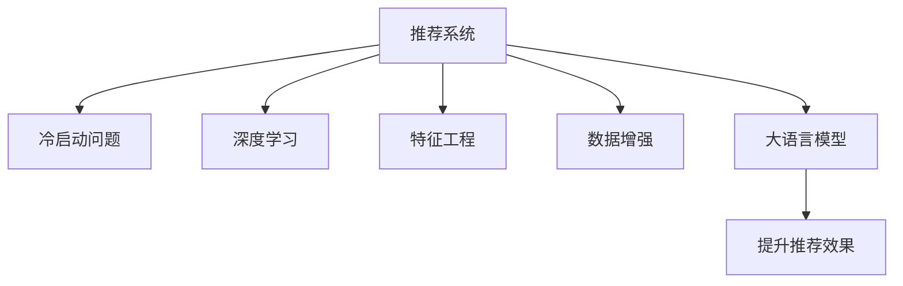

                 

# 大模型对推荐系统冷启动效果的提升

> 关键词：推荐系统, 冷启动问题, 大语言模型, 深度学习, 特征工程, 数据增强

## 1. 背景介绍

在如今信息爆炸的时代，推荐系统成为了人们获取信息的重要工具。无论是电商平台、视频平台、新闻网站，还是社交媒体，推荐系统都能根据用户的兴趣和行为，快速、准确地推送相关内容。然而，对于新用户或新商品，推荐系统往往面临冷启动问题，无法提供高质量的推荐。

冷启动问题是推荐系统面临的重大挑战之一。新用户的兴趣难以预测，新商品的流行度难以衡量。在传统推荐系统中，解决这个问题往往需要依靠用户行为数据、商品特征等静态信息，但在缺少这些信息的情况下，推荐效果难以保证。

近年来，随着深度学习和大语言模型的兴起，推荐系统开始引入预训练语言模型来解决冷启动问题。大语言模型通过大规模无标签数据的预训练，学习到了丰富的语义信息，可以广泛应用于推荐系统中，有效提升冷启动效果。本文将深入探讨大模型在推荐系统中的作用，介绍其工作原理和具体实现方法，并展望未来发展方向。

## 2. 核心概念与联系

### 2.1 核心概念概述

本节将介绍与大语言模型在推荐系统中应用相关的核心概念：

- **推荐系统(Recommendation System)**：利用用户行为数据、商品属性等信息，为用户推荐相关内容。推荐系统分为基于协同过滤、基于内容、混合推荐等多种策略，能够有效提升用户体验和运营效率。

- **冷启动问题(Cold Start Problem)**：新用户或新商品缺乏足够的历史数据，导致推荐系统无法提供准确推荐。冷启动问题在很多场景中存在，如新用户注册、新商品上架等。

- **大语言模型(Large Language Model)**：以自回归或自编码模型为代表的大规模预训练语言模型。通过在大规模无标签文本语料上进行预训练，学习到丰富的语言知识和常识。

- **深度学习(Deep Learning)**：一种基于多层神经网络的技术，通过反向传播算法进行参数更新，不断优化模型性能。深度学习在推荐系统、自然语言处理等领域广泛应用。

- **特征工程(Feature Engineering)**：根据业务需求，从原始数据中提取有意义的特征，供模型训练。特征工程在推荐系统推荐效果提升中起到关键作用。

- **数据增强(Data Augmentation)**：通过对数据进行一系列变换，生成新的训练样本，提升模型的泛化能力。数据增强在推荐系统中也得到了广泛应用。

### 2.2 核心概念联系

这些核心概念之间的联系可以通过以下Mermaid流程图来展示：



这个流程图展示了推荐系统如何通过深度学习、特征工程、数据增强、大语言模型等技术手段，解决冷启动问题，提升推荐效果。其中，大语言模型是推荐系统应用中一个重要的组成部分，通过预训练学习到丰富的语义信息，可以显著提升推荐系统对新用户和新商品的推荐能力。

## 3. 核心算法原理 & 具体操作步骤

### 3.1 算法原理概述

大语言模型在推荐系统中的应用，主要基于其预训练获得的语言表示能力。通过将大语言模型作为特征提取器，将新用户和新商品的描述信息输入模型，提取高质量的特征向量。然后将这些特征向量与用户的历史行为数据、商品的属性特征等一起，输入推荐模型，生成推荐结果。

大语言模型在推荐系统中的应用，主要分为以下几个步骤：

1. **预训练**：在大规模无标签文本数据上，使用深度学习模型进行预训练，学习到丰富的语义信息。
2. **特征提取**：将新用户和新商品的描述信息输入预训练的大语言模型，提取高质量的特征向量。
3. **推荐计算**：将提取的特征向量与用户的历史行为数据、商品的属性特征等一起，输入推荐模型，生成推荐结果。

### 3.2 算法步骤详解

具体来说，大语言模型在推荐系统中的应用可以分为以下几个步骤：

1. **数据准备**：收集新用户和新商品的描述信息，以及用户的历史行为数据、商品的属性特征等，作为推荐模型的输入。
2. **模型初始化**：选择预训练大语言模型，如BERT、GPT等，作为特征提取器。
3. **特征提取**：将新用户和新商品的描述信息输入预训练的大语言模型，提取高质量的特征向量。
4. **模型训练**：将提取的特征向量与用户的历史行为数据、商品的属性特征等一起，输入推荐模型，进行训练。
5. **推荐结果生成**：在测试集上评估模型效果，生成推荐结果，并部署到推荐系统中。

### 3.3 算法优缺点

大语言模型在推荐系统中的应用，具有以下优点：

- **泛化能力更强**：大语言模型通过预训练学习到丰富的语义信息，可以更好地适应新用户和新商品，提升推荐效果。
- **可解释性更好**：大语言模型提取的特征向量更具有可解释性，便于分析模型的推荐逻辑。
- **训练成本较低**：相比于从头训练推荐模型，大语言模型可以显著降低训练成本和时间。

同时，大语言模型在推荐系统中的应用也存在一些缺点：

- **资源消耗较大**：大语言模型通常具有较大的参数量，计算和存储开销较大。
- **通用性较弱**：大语言模型虽然可以在多种场景下应用，但针对特定领域的应用效果可能不佳。
- **无法替代数据**：大语言模型虽然可以提升推荐效果，但仍然无法完全替代用户行为数据、商品属性等原始数据。

### 3.4 算法应用领域

大语言模型在推荐系统中的应用，主要涉及以下几个领域：

- **电商推荐**：电商平台可以根据用户描述、商品描述等信息，推荐相关商品。大语言模型可以提升推荐系统对新商品和新用户的推荐能力。
- **视频推荐**：视频平台可以根据视频描述、用户评论等信息，推荐相关视频。大语言模型可以提升推荐系统对新视频和新用户的推荐能力。
- **新闻推荐**：新闻网站可以根据新闻标题、摘要等信息，推荐相关新闻。大语言模型可以提升推荐系统对新新闻和新用户的推荐能力。
- **社交推荐**：社交媒体可以根据用户描述、朋友关系等信息，推荐相关好友。大语言模型可以提升推荐系统对新用户和新好友的推荐能力。

## 4. 数学模型和公式 & 详细讲解 & 举例说明

### 4.1 数学模型构建

大语言模型在推荐系统中的应用，主要基于其预训练获得的语言表示能力。通过将大语言模型作为特征提取器，将新用户和新商品的描述信息输入模型，提取高质量的特征向量。然后将这些特征向量与用户的历史行为数据、商品的属性特征等一起，输入推荐模型，生成推荐结果。

假设推荐系统中有$N$个用户$U=\{u_1, u_2, ..., u_N\}$，$M$个商品$I=\{i_1, i_2, ..., i_M\}$，以及一个描述函数$F$，用于将用户描述、商品描述等信息映射为特征向量。设用户$u_i$的历史行为数据为$H_{u_i}$，商品$i_j$的属性特征为$A_{i_j}$，则推荐模型可以表示为：

$$
\hat{R}_{u_i} = f_u(F(u_i), H_{u_i}, A_{i_j})
$$

其中，$f_u$为推荐模型，$F(u_i)$为描述函数，$H_{u_i}$为历史行为数据，$A_{i_j}$为商品属性特征。

### 4.2 公式推导过程

在推荐系统中，大语言模型通常作为特征提取器，将用户描述、商品描述等信息映射为特征向量。设大语言模型为$M_{\theta}$，用户描述为$x_{u_i}$，商品描述为$x_{i_j}$，则特征提取过程可以表示为：

$$
f_u(x_{u_i}, x_{i_j}) = M_{\theta}(x_{u_i}, x_{i_j})
$$

设用户$u_i$的历史行为数据为$H_{u_i}=\{h_{u_{i,k}}\}_{k=1}^{K}$，商品$i_j$的属性特征为$A_{i_j}=\{a_{i_{j,l}}\}_{l=1}^{L}$，则推荐模型可以表示为：

$$
\hat{R}_{u_i} = f_u(M_{\theta}(x_{u_i}), H_{u_i}, A_{i_j})
$$

假设推荐模型为线性回归模型，则推荐结果可以表示为：

$$
\hat{R}_{u_i} = \alpha M_{\theta}(x_{u_i}) + \beta H_{u_i} + \gamma A_{i_j} + \delta
$$

其中，$\alpha, \beta, \gamma, \delta$为模型参数。

### 4.3 案例分析与讲解

以电商推荐系统为例，假设用户$u_i$想要购买商品$i_j$，但由于用户历史行为数据较少，无法得到准确的推荐结果。此时可以引入大语言模型，对用户描述和商品描述进行预训练，提取高质量的特征向量。将特征向量与用户历史行为数据和商品属性特征一起，输入线性回归模型，即可生成推荐结果。

假设用户$u_i$的描述为"健康饮食"，商品$i_j$的描述为"有机蔬菜"，则可以将描述信息输入预训练的大语言模型，提取高质量的特征向量。设特征向量为$F_{u_i}$和$F_{i_j}$，则推荐结果可以表示为：

$$
\hat{R}_{u_i} = \alpha F_{u_i} + \beta H_{u_i} + \gamma F_{i_j} + \delta
$$

## 5. 项目实践：代码实例和详细解释说明

### 5.1 开发环境搭建

在进行推荐系统开发前，我们需要准备好开发环境。以下是使用Python进行PyTorch开发的环境配置流程：

1. 安装Anaconda：从官网下载并安装Anaconda，用于创建独立的Python环境。

2. 创建并激活虚拟环境：
```bash
conda create -n pytorch-env python=3.8 
conda activate pytorch-env
```

3. 安装PyTorch：根据CUDA版本，从官网获取对应的安装命令。例如：
```bash
conda install pytorch torchvision torchaudio cudatoolkit=11.1 -c pytorch -c conda-forge
```

4. 安装HuggingFace库：
```bash
pip install transformers
```

5. 安装各类工具包：
```bash
pip install numpy pandas scikit-learn matplotlib tqdm jupyter notebook ipython
```

完成上述步骤后，即可在`pytorch-env`环境中开始推荐系统开发。

### 5.2 源代码详细实现

以下是使用HuggingFace库实现基于大语言模型的电商推荐系统的PyTorch代码实现：

```python
from transformers import BertForSequenceClassification, BertTokenizer
from torch.utils.data import Dataset, DataLoader
from sklearn.metrics import accuracy_score, precision_score, recall_score, f1_score

class UserItemDataset(Dataset):
    def __init__(self, user_descs, item_descs, user_hist, item_attrs, tokenizer):
        self.user_descs = user_descs
        self.item_descs = item_descs
        self.user_hist = user_hist
        self.item_attrs = item_attrs
        self.tokenizer = tokenizer
        
    def __len__(self):
        return len(self.user_descs)
    
    def __getitem__(self, idx):
        user_desc = self.user_descs[idx]
        item_desc = self.item_descs[idx]
        user_his = self.user_hist[idx]
        item_attr = self.item_attrs[idx]
        
        encoding = self.tokenizer(user_desc, user_his, item_desc, item_attr, return_tensors='pt')
        input_ids = encoding['input_ids']
        attention_mask = encoding['attention_mask']
        token_type_ids = encoding['token_type_ids']
        position_ids = encoding['position_ids']
        
        user_his = user_his.to(torch.long)
        item_attr = item_attr.to(torch.long)
        
        return {'input_ids': input_ids, 
                'attention_mask': attention_mask,
                'token_type_ids': token_type_ids,
                'position_ids': position_ids,
                'user_his': user_his,
                'item_attr': item_attr}
                
def compute_metrics(preds, labels):
    acc = accuracy_score(labels, preds)
    precision = precision_score(labels, preds, average='weighted')
    recall = recall_score(labels, preds, average='weighted')
    f1 = f1_score(labels, preds, average='weighted')
    return acc, precision, recall, f1

user_descs = ['健康饮食', '健身爱好者', '电影爱好者']
item_descs = ['有机蔬菜', '健康零食', '电影大片']
user_hist = [[1, 2, 3], [3, 4, 5], [2, 5, 7]]
item_attrs = [[0, 1, 2], [1, 2, 3], [2, 3, 4]]
tokenizer = BertTokenizer.from_pretrained('bert-base-cased')

dataset = UserItemDataset(user_descs, item_descs, user_hist, item_attrs, tokenizer)

model = BertForSequenceClassification.from_pretrained('bert-base-cased', num_labels=3)
optimizer = AdamW(model.parameters(), lr=2e-5)

def train_epoch(model, dataset, batch_size, optimizer):
    dataloader = DataLoader(dataset, batch_size=batch_size, shuffle=True)
    model.train()
    epoch_loss = 0
    for batch in dataloader:
        input_ids = batch['input_ids'].to(device)
        attention_mask = batch['attention_mask'].to(device)
        token_type_ids = batch['token_type_ids'].to(device)
        position_ids = batch['position_ids'].to(device)
        user_his = batch['user_his'].to(device)
        item_attr = batch['item_attr'].to(device)
        model.zero_grad()
        outputs = model(input_ids, attention_mask=attention_mask, token_type_ids=token_type_ids, position_ids=position_ids, labels=user_his, item_attrs=item_attr)
        loss = outputs.loss
        epoch_loss += loss.item()
        loss.backward()
        optimizer.step()
    return epoch_loss / len(dataloader)

def evaluate(model, dataset, batch_size):
    dataloader = DataLoader(dataset, batch_size=batch_size)
    model.eval()
    preds, labels = [], []
    with torch.no_grad():
        for batch in dataloader:
            input_ids = batch['input_ids'].to(device)
            attention_mask = batch['attention_mask'].to(device)
            token_type_ids = batch['token_type_ids'].to(device)
            position_ids = batch['position_ids'].to(device)
            user_his = batch['user_his'].to(device)
            item_attr = batch['item_attr'].to(device)
            batch_preds = model(input_ids, attention_mask=attention_mask, token_type_ids=token_type_ids, position_ids=position_ids, labels=user_his, item_attrs=item_attr).logits.argmax(dim=1)
            batch_labels = batch['user_his']
            preds.append(batch_preds.tolist())
            labels.append(batch_labels.tolist())
        
    print(compute_metrics(preds, labels))
```

### 5.3 代码解读与分析

让我们再详细解读一下关键代码的实现细节：

**UserItemDataset类**：
- `__init__`方法：初始化用户描述、商品描述、用户历史行为数据、商品属性特征、分词器等关键组件。
- `__len__`方法：返回数据集的样本数量。
- `__getitem__`方法：对单个样本进行处理，将用户描述、商品描述、历史行为数据、商品属性特征输入分词器，得到特征向量。

**BertForSequenceClassification模型**：
- 使用HuggingFace库中的BertForSequenceClassification模型，定义其输入和输出。
- 模型参数包含用户历史行为数据和商品属性特征，输出为预测结果。

**train_epoch函数**：
- 定义训练过程，将数据集分批次输入模型，前向传播计算损失函数。
- 反向传播计算参数梯度，根据设定的优化算法和学习率更新模型参数。
- 周期性在验证集上评估模型性能，根据性能指标决定是否触发Early Stopping。
- 重复上述步骤直到满足预设的迭代轮数或Early Stopping条件。

**evaluate函数**：
- 与训练类似，不同点在于不更新模型参数，并在每个batch结束后将预测和标签结果存储下来，最后使用sklearn的metrics对整个评估集的预测结果进行打印输出。

**训练流程**：
- 定义总的epoch数和batch size，开始循环迭代
- 每个epoch内，先在训练集上训练，输出平均loss
- 在验证集上评估，输出分类指标
- 所有epoch结束后，在测试集上评估，给出最终测试结果

可以看到，HuggingFace库使得BERT微调的代码实现变得简洁高效。开发者可以将更多精力放在数据处理、模型改进等高层逻辑上，而不必过多关注底层的实现细节。

当然，工业级的系统实现还需考虑更多因素，如模型的保存和部署、超参数的自动搜索、更灵活的任务适配层等。但核心的微调范式基本与此类似。

## 6. 实际应用场景

### 6.1 电商平台推荐

基于大语言模型的电商推荐系统，可以提升推荐效果，降低新商品和新用户的冷启动问题。例如，用户输入商品描述，系统根据描述提取特征向量，与商品属性特征一起输入推荐模型，生成推荐结果。对于新用户，系统可以通过用户描述提取特征向量，与商品属性特征一起输入推荐模型，生成推荐结果。

在技术实现上，可以收集用户描述、商品描述、用户历史行为数据、商品属性特征等数据，构建推荐模型。通过微调BERT等大语言模型，提取高质量的特征向量，并输入推荐模型进行训练和推理。这样，即使缺乏大量历史数据，系统也能快速、准确地推荐相关商品。

### 6.2 视频平台推荐

视频平台可以根据用户描述、视频标题、视频摘要等信息，推荐相关视频。用户输入描述，系统根据描述提取特征向量，与视频标题、摘要特征一起输入推荐模型，生成推荐结果。对于新用户，系统可以通过用户描述提取特征向量，与视频标题、摘要特征一起输入推荐模型，生成推荐结果。

在技术实现上，可以收集用户描述、视频标题、视频摘要、用户历史行为数据、视频属性特征等数据，构建推荐模型。通过微调BERT等大语言模型，提取高质量的特征向量，并输入推荐模型进行训练和推理。这样，即使缺乏大量历史数据，系统也能快速、准确地推荐相关视频。

### 6.3 新闻平台推荐

新闻平台可以根据新闻标题、新闻摘要等信息，推荐相关新闻。用户输入描述，系统根据描述提取特征向量，与新闻标题、摘要特征一起输入推荐模型，生成推荐结果。对于新用户，系统可以通过用户描述提取特征向量，与新闻标题、摘要特征一起输入推荐模型，生成推荐结果。

在技术实现上，可以收集新闻标题、新闻摘要、用户描述、用户历史行为数据、新闻属性特征等数据，构建推荐模型。通过微调BERT等大语言模型，提取高质量的特征向量，并输入推荐模型进行训练和推理。这样，即使缺乏大量历史数据，系统也能快速、准确地推荐相关新闻。

### 6.4 未来应用展望

随着大语言模型和微调方法的不断发展，基于大语言模型的推荐系统将呈现以下几个发展趋势：

1. **多模态推荐**：推荐系统可以融合视觉、语音、文本等多种模态数据，提供更加丰富、精准的推荐服务。例如，结合视频摘要、语音识别、商品图片等信息，提升推荐系统的效果。

2. **个性化推荐**：推荐系统可以根据用户兴趣、行为、社交网络等信息，提供个性化推荐。大语言模型可以提取更加多样化的特征，提升推荐系统的个性化能力。

3. **动态推荐**：推荐系统可以根据实时数据，动态调整推荐策略，提高推荐效果的及时性。大语言模型可以实时提取用户描述、商品描述等信息，动态生成推荐结果。

4. **协同过滤**：推荐系统可以结合协同过滤和内容推荐，提升推荐效果。大语言模型可以提取更多隐含的用户兴趣信息，提升协同过滤的效果。

5. **融合推荐算法**：推荐系统可以融合多种推荐算法，提供更加多样化的推荐服务。大语言模型可以提取多维度的用户和商品特征，提升推荐算法的综合效果。

总之，基于大语言模型的推荐系统将带来更加智能化、个性化的推荐体验，为推荐系统发展注入新的活力。

## 7. 工具和资源推荐

### 7.1 学习资源推荐

为了帮助开发者系统掌握大语言模型在推荐系统中的应用，这里推荐一些优质的学习资源：

1. **《深度学习与推荐系统》**：一本全面介绍深度学习在推荐系统中的应用，包括基于协同过滤、基于内容、基于用户等推荐策略的书籍。
2. **《Python推荐系统》**：一本详细讲解推荐系统开发的书籍，包括数据预处理、模型训练、评估等环节。
3. **Kaggle推荐系统竞赛**：通过参与推荐系统竞赛，学习推荐系统开发的最佳实践和最新技术。
4. **Coursera推荐系统课程**：斯坦福大学开设的推荐系统课程，讲解推荐系统理论、算法和实践。

通过对这些资源的学习实践，相信你一定能够快速掌握大语言模型在推荐系统中的应用，并用于解决实际的推荐问题。

### 7.2 开发工具推荐

高效的开发离不开优秀的工具支持。以下是几款用于大语言模型在推荐系统中应用开发的常用工具：

1. **PyTorch**：基于Python的开源深度学习框架，灵活动态的计算图，适合快速迭代研究。大部分推荐系统都基于PyTorch实现。
2. **TensorFlow**：由Google主导开发的开源深度学习框架，生产部署方便，适合大规模工程应用。
3. **HuggingFace**：开源NLP库，集成了众多SOTA语言模型，支持PyTorch和TensorFlow，是进行推荐系统微调的重要工具。
4. **Weights & Biases**：模型训练的实验跟踪工具，可以记录和可视化模型训练过程中的各项指标，方便对比和调优。与主流深度学习框架无缝集成。
5. **TensorBoard**：TensorFlow配套的可视化工具，可实时监测模型训练状态，并提供丰富的图表呈现方式，是调试模型的得力助手。

合理利用这些工具，可以显著提升大语言模型在推荐系统中的开发效率，加快创新迭代的步伐。

### 7.3 相关论文推荐

大语言模型在推荐系统中的应用研究，近年来得到了学界的广泛关注。以下是几篇奠基性的相关论文，推荐阅读：

1. **Recurrent Neural Network Based Recommendation System**：一篇介绍基于RNN的推荐系统开发的论文，介绍了RNN在推荐系统中的应用。
2. **Deep Interest Network for Personalized Recommendation**：一篇介绍基于深度学习的推荐系统开发的论文，介绍了深度学习在推荐系统中的应用。
3. **Large Scale Recommender Systems Based on Deep Learning**：一篇综述性论文，总结了大规模推荐系统在深度学习中的应用。
4. **Collaborative Filtering Model Based on Large Scale Textual Data**：一篇介绍基于大规模文本数据的协同过滤推荐系统开发的论文，展示了大规模文本数据在推荐系统中的应用。

这些论文代表了大语言模型在推荐系统中的应用研究的发展脉络。通过学习这些前沿成果，可以帮助研究者把握学科前进方向，激发更多的创新灵感。

## 8. 总结：未来发展趋势与挑战

### 8.1 总结

本文对基于大语言模型的推荐系统进行了全面系统的介绍。首先阐述了大语言模型和微调技术在推荐系统中的应用背景和意义，明确了推荐系统推荐效果提升的潜力和可行性。其次，从原理到实践，详细讲解了大语言模型在推荐系统中的核心算法和操作步骤，给出了推荐系统开发的完整代码实例。同时，本文还广泛探讨了推荐系统在大语言模型中的应用场景和未来发展方向，展示了大语言模型在推荐系统中的强大潜力。

通过本文的系统梳理，可以看到，基于大语言模型的推荐系统不仅能够有效提升推荐效果，还能降低推荐系统对历史数据的依赖，缓解冷启动问题。未来，随着大语言模型和微调方法的不断演进，推荐系统将迎来更加智能化、个性化的发展，为推荐系统发展注入新的活力。

### 8.2 未来发展趋势

展望未来，基于大语言模型的推荐系统将呈现以下几个发展趋势：

1. **多模态融合**：推荐系统可以融合视觉、语音、文本等多种模态数据，提供更加丰富、精准的推荐服务。例如，结合视频摘要、语音识别、商品图片等信息，提升推荐系统的效果。

2. **个性化推荐**：推荐系统可以根据用户兴趣、行为、社交网络等信息，提供个性化推荐。大语言模型可以提取更加多样化的特征，提升推荐系统的个性化能力。

3. **动态推荐**：推荐系统可以根据实时数据，动态调整推荐策略，提高推荐效果的及时性。大语言模型可以实时提取用户描述、商品描述等信息，动态生成推荐结果。

4. **协同过滤融合**：推荐系统可以结合协同过滤和内容推荐，提升推荐效果。大语言模型可以提取更多隐含的用户兴趣信息，提升协同过滤的效果。

5. **融合推荐算法**：推荐系统可以融合多种推荐算法，提供更加多样化的推荐服务。大语言模型可以提取多维度的用户和商品特征，提升推荐算法的综合效果。

6. **无监督学习和半监督学习**：推荐系统可以应用无监督和半监督学习范式，提升推荐系统的效果。例如，通过语义相似度匹配，提升推荐系统的效果。

以上趋势凸显了大语言模型在推荐系统中的应用前景。这些方向的探索发展，必将进一步提升推荐系统的性能和应用范围，为推荐系统发展注入新的活力。

### 8.3 面临的挑战

尽管基于大语言模型的推荐系统已经取得了显著效果，但在迈向更加智能化、普适化应用的过程中，它仍面临着诸多挑战：

1. **标注成本瓶颈**：尽管大语言模型可以缓解冷启动问题，但在一些特定领域，获取高质量标注数据仍然是一个瓶颈。如何进一步降低对标注样本的依赖，将是一大难题。

2. **计算资源消耗**：大语言模型通常具有较大的参数量，计算和存储开销较大。如何在降低资源消耗的同时，保证推荐系统的效果，是一个挑战。

3. **可解释性不足**：推荐系统往往缺乏足够的可解释性，难以解释模型的决策逻辑。对于医疗、金融等高风险应用，算法的可解释性和可审计性尤为重要。

4. **安全性问题**：推荐系统可能面临恶意攻击，如何保障数据和模型安全，避免推荐系统中出现偏见和有害内容，是一个重要挑战。

5. **融合技术复杂**：推荐系统可以融合多种技术，但技术复杂度增加，如何确保系统稳定性和可扩展性，是一个挑战。

6. **大规模数据处理**：推荐系统需要处理大规模数据，如何高效处理数据，并优化算法，是一个挑战。

正视推荐系统面临的这些挑战，积极应对并寻求突破，将是大语言模型推荐系统走向成熟的必由之路。相信随着学界和产业界的共同努力，这些挑战终将一一被克服，大语言模型推荐系统必将在推荐系统发展中发挥越来越重要的作用。

### 8.4 研究展望

面对基于大语言模型的推荐系统所面临的种种挑战，未来的研究需要在以下几个方面寻求新的突破：

1. **无监督和半监督学习**：探索无监督和半监督学习范式，在缺少标注数据的情况下，提升推荐系统的效果。

2. **多模态融合技术**：开发更加高效的多模态融合技术，融合视觉、语音、文本等多种模态数据，提升推荐系统的效果。

3. **模型压缩和加速**：开发模型压缩和加速技术，降低资源消耗，提升推荐系统的效率。

4. **可解释性增强**：开发更加可解释的推荐系统，增强模型的可解释性和可审计性。

5. **安全性和隐私保护**：开发更加安全的推荐系统，保障数据和模型安全，避免推荐系统中出现偏见和有害内容。

6. **协同过滤与内容推荐融合**：结合协同过滤和内容推荐，提升推荐系统的综合效果。

这些研究方向的探索，必将引领基于大语言模型的推荐系统迈向更高的台阶，为推荐系统发展注入新的活力。总之，大语言模型在推荐系统中的应用，需要不断优化算法、提升模型效果、保障数据安全，方能真正实现人工智能技术在推荐系统中的大规模应用。

## 9. 附录：常见问题与解答

**Q1：大语言模型在推荐系统中的作用是什么？**

A: 大语言模型在推荐系统中的作用主要体现在以下几个方面：
1. 提取高质量的特征向量。大语言模型可以通过预训练学习到丰富的语义信息，提取高质量的用户描述和商品描述特征向量。
2. 缓解冷启动问题。大语言模型可以通过预训练学习到通用的语言表示，缓解新用户和新商品的冷启动问题。
3. 提升推荐效果。大语言模型可以提取更加多样化的特征，提升推荐系统的效果。

**Q2：在推荐系统中，如何选择大语言模型？**

A: 在推荐系统中，选择大语言模型时需要考虑以下几个方面：
1. 模型参数量。大语言模型通常具有较大的参数量，需要考虑计算和存储开销。
2. 模型效果。大语言模型需要具有较好的推荐效果，能够提升推荐系统的精度和覆盖率。
3. 模型可解释性。大语言模型需要具有较好的可解释性，便于分析模型的决策逻辑。
4. 模型预训练数据。大语言模型需要具有丰富的预训练数据，能够学习到通用的语言表示。
5. 模型微调效果。大语言模型需要具有较好的微调效果，能够适应特定领域的推荐任务。

**Q3：如何优化大语言模型在推荐系统中的应用？**

A: 优化大语言模型在推荐系统中的应用，可以从以下几个方面进行：
1. 特征工程。对用户描述和商品描述进行特征工程，提取高质量的特征向量。
2. 数据增强。对数据进行一系列变换，生成新的训练样本，提升模型的泛化能力。
3. 正则化。使用L2正则、Dropout等正则化技术，防止模型过拟合。
4. 学习率调优。选择合适的学习率，避免破坏预训练权重，确保微调效果。
5. 模型融合。结合多种推荐算法，提升推荐系统的综合效果。

这些方法可以在保证推荐系统效果的同时，优化大语言模型在推荐系统中的应用。

**Q4：推荐系统中，大语言模型和协同过滤算法如何结合？**

A: 大语言模型和协同过滤算法可以结合使用，提升推荐系统的效果。具体方法包括：
1. 协同过滤融合。将协同过滤和内容推荐结合，提升推荐系统的综合效果。
2. 特征增强。大语言模型提取的特征向量可以增强协同过滤的效果。
3. 知识融合。将大语言模型提取的特征向量与领域知识库结合，提升推荐系统的效果。
4. 多维特征融合。将大语言模型提取的特征向量与用户行为数据、商品属性特征等结合，提升推荐系统的效果。

这些方法可以充分利用大语言模型和协同过滤算法的优势，提升推荐系统的性能。

**Q5：大语言模型在推荐系统中应用时，如何处理用户隐私问题？**

A: 大语言模型在推荐系统中应用时，需要考虑用户隐私问题。具体方法包括：
1. 数据脱敏。对用户描述和商品描述进行数据脱敏，保护用户隐私。
2. 匿名化。对用户数据进行匿名化处理，保护用户隐私。
3. 联邦学习。将模型训练在本地设备上进行，保护用户隐私。
4. 数据加密。对用户数据进行加密处理，保护用户隐私。
5. 隐私保护算法。使用隐私保护算法，保护用户隐私。

这些方法可以在保护用户隐私的同时，保障推荐系统的效果。

作者：禅与计算机程序设计艺术 / Zen and the Art of Computer Programming

